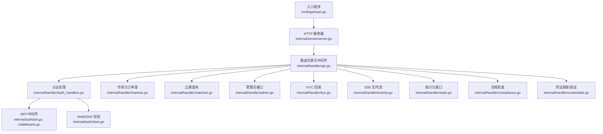
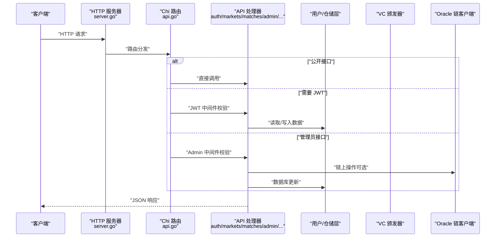
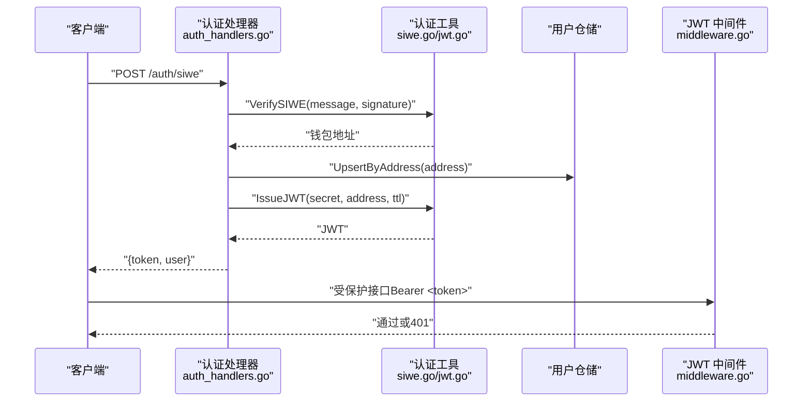
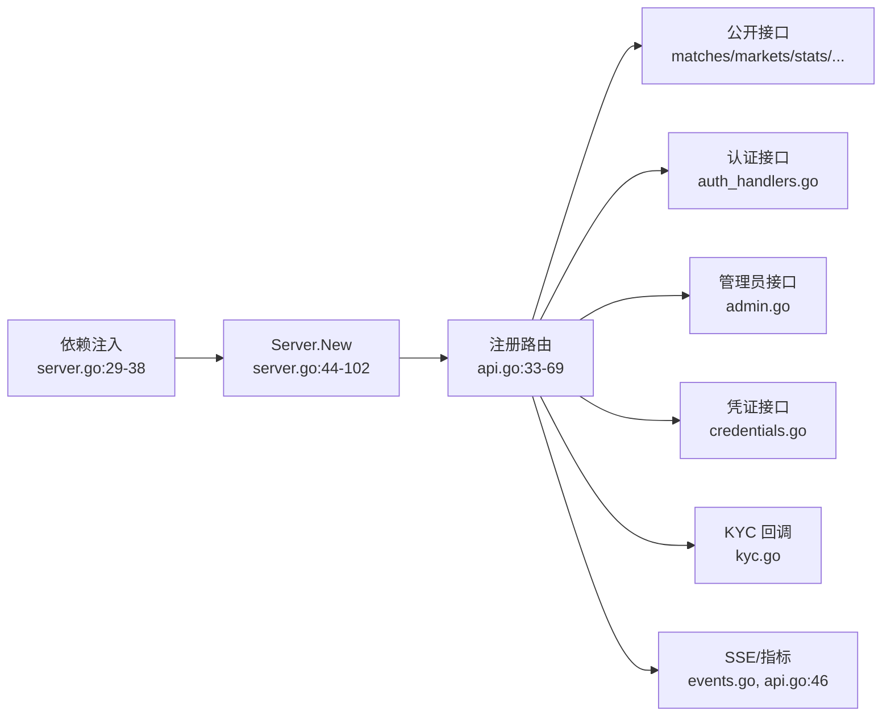

# API参考文档

<cite>
**本文档引用的文件**
- [main.go](file://cmd/api/main.go)
- [server.go](file://internal/server/server.go)
- [api.go](file://internal/handler/api.go)
- [middleware.go](file://internal/auth/middleware.go)
- [jwt.go](file://internal/auth/jwt.go)
- [siwe.go](file://internal/auth/siwe.go)
- [auth_handlers.go](file://internal/handler/auth_handlers.go)
- [matches.go](file://internal/handler/matches.go)
- [markets.go](file://internal/handler/markets.go)
- [admin.go](file://internal/handler/admin.go)
- [kyc.go](file://internal/handler/kyc.go)
- [events.go](file://internal/handler/events.go)
- [stats.go](file://internal/handler/stats.go)
- [compliance.go](file://internal/handler/compliance.go)
- [credentials.go](file://internal/handler/credentials.go)
</cite>

## 目录
1. [简介](#简介)
2. [项目结构](#项目结构)
3. [核心组件](#核心组件)
4. [架构总览](#架构总览)
5. [详细组件分析](#详细组件分析)
6. [依赖分析](#依赖分析)
7. [性能考虑](#性能考虑)
8. [故障排除指南](#故障排除指南)
9. [结论](#结论)
10. [附录](#附录)

## 简介
本文件为 PredictionDIDSimple 后端服务的完整 API 参考文档。内容覆盖公开接口、用户认证接口、市场与比赛接口、管理员接口、合规与 KYC、SSE 实时流、指标与统计等。文档提供每个端点的 HTTP 方法、URL 模式、请求/响应结构、认证方式、错误码与示例，以及速率限制、安全注意事项、版本信息、常见用例与性能优化建议。

## 项目结构
后端采用分层设计：
- 入口程序负责配置加载、数据库迁移、Redis 连接、索引器与预言机客户端初始化，并启动 HTTP 服务器。
- 服务器层负责路由注册、全局中间件（CORS、速率限制、地理封锁）、健康检查与 API 路由装配。
- 处理器层（handler）实现具体业务接口，按功能划分为认证、市场、比赛、管理员、KYM、事件流、统计、合规、凭证等。
- 认证层（auth）提供 JWT 颁发/解析与 SIWE 验证、DID 绑定校验。
- 中间件层（middleware）提供速率限制与地理封锁。

图表来源
- [main.go:1-161](file://cmd/api/main.go#L1-L161)
- [server.go:1-129](file://internal/server/server.go#L1-L129)
- [api.go:1-100](file://internal/handler/api.go#L1-L100)
- [auth_handlers.go:1-98](file://internal/handler/auth_handlers.go#L1-L98)
- [markets.go:1-60](file://internal/handler/markets.go#L1-L60)
- [matches.go:1-44](file://internal/handler/matches.go#L1-L44)
- [admin.go:1-109](file://internal/handler/admin.go#L1-L109)
- [kyc.go:1-67](file://internal/handler/kyc.go#L1-L67)
- [events.go:1-47](file://internal/handler/events.go#L1-L47)
- [stats.go:1-87](file://internal/handler/stats.go#L1-L87)
- [compliance.go:1-30](file://internal/handler/compliance.go#L1-L30)
- [credentials.go:1-115](file://internal/handler/credentials.go#L1-L115)
- [jwt.go:1-58](file://internal/auth/jwt.go#L1-L58)
- [siwe.go:1-75](file://internal/auth/siwe.go#L1-L75)

章节来源
- [main.go:1-161](file://cmd/api/main.go#L1-L161)
- [server.go:1-129](file://internal/server/server.go#L1-L129)
- [api.go:1-100](file://internal/handler/api.go#L1-L100)

## 核心组件
- 服务器与路由
  - 服务器初始化时注册全局中间件（请求ID、真实IP、日志、恢复、速率限制、地理封锁、CORS）。
  - 健康检查、API 路由组注册、SSE 流、Prometheus 指标等。
- 认证与授权
  - SIWE 登录：验证钱包签名，创建/获取用户，颁发 JWT。
  - JWT 中间件：校验 Authorization: Bearer <token>，注入钱包地址到上下文。
  - 管理员中间件：基于 X-Admin-Key 的管理员权限控制。
- 数据访问与仓储
  - 比赛、市场、用户、持仓、凭证、统计、合规、预言机任务等仓储统一注入到 API 处理器。
- 实时与监控
  - SSE 比赛流：每 5 秒推送最新比赛列表。
  - Prometheus 指标：/metrics。

章节来源
- [server.go:1-129](file://internal/server/server.go#L1-L129)
- [api.go:1-100](file://internal/handler/api.go#L1-L100)
- [middleware.go:1-50](file://internal/auth/middleware.go#L1-L50)
- [jwt.go:1-58](file://internal/auth/jwt.go#L1-L58)
- [siwe.go:1-75](file://internal/auth/siwe.go#L1-L75)

## 架构总览
下图展示请求从客户端到各处理器的流转与认证/授权路径：

图表来源
- [server.go:44-102](file://internal/server/server.go#L44-L102)
- [api.go:33-69](file://internal/handler/api.go#L33-L69)
- [auth_handlers.go:19-53](file://internal/handler/auth_handlers.go#L19-L53)
- [admin.go:30-61](file://internal/handler/admin.go#L30-L61)

## 详细组件分析

### 认证与授权
- JWT 颁发与解析
  - 颁发：生成包含钱包地址与过期时间的 HS256 签名 JWT。
  - 解析：校验签名算法与签名有效性，提取地址。
- SIWE 登录
  - 校验消息域名、URI、过期时间，执行签名校验，返回钱包地址。
- DID 绑定
  - 校验 DID 规范（did:pkh:eip155:<chain>:<address>），MVP 阶段签名由客户端校验。
- 中间件
  - JWT 中间件：Authorization: Bearer <token>。
  - 管理员中间件：X-Admin-Key。

图表来源
- [auth_handlers.go:19-53](file://internal/handler/auth_handlers.go#L19-L53)
- [siwe.go:20-60](file://internal/auth/siwe.go#L20-L60)
- [jwt.go:19-34](file://internal/auth/jwt.go#L19-L34)
- [middleware.go:17-43](file://internal/auth/middleware.go#L17-L43)

章节来源
- [jwt.go:1-58](file://internal/auth/jwt.go#L1-L58)
- [siwe.go:1-75](file://internal/auth/siwe.go#L1-L75)
- [middleware.go:1-50](file://internal/auth/middleware.go#L1-L50)
- [auth_handlers.go:1-98](file://internal/handler/auth_handlers.go#L1-L98)

### 公开接口
- 比赛
  - GET /matches：分页列出比赛，支持 status、limit、offset。
  - GET /matches/{id}：返回比赛详情与关联市场列表。
- 市场
  - GET /markets：分页列出市场，返回 items、collateral_address、chain_id。
  - GET /markets/{id}：返回市场详情，若 RequiresVC=true 则返回 access 控制信息。
  - GET /markets/{id}/pool：返回池子状态（reserve、price、fee、outcome_count）。
  - GET /markets/{id}/orderbook：返回二元市场的合成盘口（YES/NO 买卖盘）。
- 平台统计
  - GET /stats/platform：返回全平台聚合统计。
- 合规
  - GET /compliance/restricted：返回国家代码、是否受限、合规要求、环境。
- KYC 回调
  - POST /kyc/webhook：接收第三方 KYC 回调，支持 HMAC-SHA256 签名校验，通过则颁发 KYC VC。
- SSE 实时流
  - GET /events/scores：SSE 推送最新比赛列表，每 5 秒一次。
- 指标
  - GET /metrics：Prometheus 指标。

章节来源
- [matches.go:1-44](file://internal/handler/matches.go#L1-L44)
- [markets.go:1-60](file://internal/handler/markets.go#L1-L60)
- [stats.go:1-87](file://internal/handler/stats.go#L1-L87)
- [compliance.go:1-30](file://internal/handler/compliance.go#L1-L30)
- [kyc.go:1-67](file://internal/handler/kyc.go#L1-L67)
- [events.go:1-47](file://internal/handler/events.go#L1-L47)
- [api.go:33-46](file://internal/handler/api.go#L33-L46)

### 用户认证接口
- SIWE 登录
  - POST /auth/siwe
  - 请求体字段
    - message: SIWE 签名消息（字符串）
    - signature: 钱包签名（字符串）
  - 成功响应
    - token: JWT
    - user: 用户对象（含地址、DID 等）
  - 错误
    - 400: 请求体无效
    - 401: 签名验证失败/过期
    - 500: 服务器内部错误
- 绑定 DID
  - POST /users/bind-did（需 JWT）
  - 请求体字段
    - did: DID 标识符（字符串）
    - signature: 签名（字符串，MVP 阶段服务端信任 JWT）
  - 成功响应
    - user: 更新后的用户对象
  - 错误
    - 400: DID 格式或签名不匹配
    - 500: 服务器内部错误
- 我的凭证
  - GET /users/me/credentials（需 JWT）
  - 成功响应
    - items: 凭证列表
  - 错误
    - 500: 服务器内部错误

章节来源
- [auth_handlers.go:19-53](file://internal/handler/auth_handlers.go#L19-L53)
- [auth_handlers.go:61-84](file://internal/handler/auth_handlers.go#L61-L84)
- [credentials.go:73-82](file://internal/handler/credentials.go#L73-L82)

### 市场管理接口
- 列出市场
  - GET /markets
  - 查询参数
    - status: 市场状态过滤
    - limit: 每页数量，默认 20
    - offset: 偏移，默认 0
  - 成功响应
    - items: 市场列表
    - collateral_address: 抵押代币合约地址
    - chain_id: 链 ID
- 市场详情
  - GET /markets/{id}
  - 成功响应
    - market: 市场对象
    - collateral_address: 抵押代币合约地址
    - chain_id: 链 ID
    - access.allowed: 是否允许交易
    - access.requires_vc: 是否需要 VC
    - access.credential_type: 凭证类型
- 市场池子
  - GET /markets/{id}/pool
  - 成功响应
    - market_id、market_type、reserve_yes、reserve_no、price_yes_bps、fee_bps、outcome_count
- 市场订单簿
  - GET /markets/{id}/orderbook
  - 成功响应
    - bids: 两条记录（YES/NO），price_bps 由 YES 价格推导，depth 由 reserve 或 pool 回退
    - note: 说明（Phase 3）

章节来源
- [markets.go:10-27](file://internal/handler/markets.go#L10-L27)
- [markets.go:29-59](file://internal/handler/markets.go#L29-L59)
- [stats.go:19-66](file://internal/handler/stats.go#L19-L66)

### 比赛管理接口
- 列出比赛
  - GET /matches
  - 查询参数
    - status: 比赛状态过滤
    - limit: 每页数量，默认 20
    - offset: 偏移，默认 0
  - 成功响应
    - items: 比赛列表
- 比赛详情
  - GET /matches/{id}
  - 成功响应
    - match: 比赛对象
    - markets: 该比赛关联的市场列表

章节来源
- [matches.go:8-19](file://internal/handler/matches.go#L8-L19)
- [matches.go:21-43](file://internal/handler/matches.go#L21-L43)

### 管理员接口
- 列出 Oracle 任务
  - GET /admin/oracle-jobs（需管理员 Key）
  - 查询参数
    - status: 任务状态过滤
  - 成功响应
    - items: 任务列表
- 注册市场
  - POST /admin/markets（需管理员 Key）
  - 请求体字段
    - match_id: 关联比赛 ID
    - market_address: 合约地址
    - question: 预测问题
    - requires_vc: 是否需要 VC
    - restricted_region: 限制地区
    - resolution_rule: 解析规则
  - 成功响应
    - status: registered
- 作废市场
  - POST /admin/markets/{id}/void（需管理员 Key）
  - 请求体字段
    - reason: 作废原因（字符串）
  - 行为
    - 若配置 Oracle 链客户端则调用链上 VoidMarket，否则仅更新数据库状态为 VOID，并将关联比赛状态置为 CANCELLED。
  - 成功响应
    - status: void
- 重试 Oracle 任务
  - POST /admin/oracle-jobs/{id}/retry（需管理员 Key）
  - 行为
    - 将任务状态重置为 pending，清除错误消息
  - 成功响应
    - status: pending

章节来源
- [admin.go:12-23](file://internal/handler/admin.go#L12-L23)
- [admin.go:73-93](file://internal/handler/admin.go#L73-L93)
- [admin.go:30-61](file://internal/handler/admin.go#L30-L61)
- [admin.go:95-109](file://internal/handler/admin.go#L95-L109)

### 凭证接口
- 颁发凭证
  - POST /credentials/issue（需管理员 Key）
  - 请求体字段
    - address: 目标钱包地址
    - credential_type: 凭证类型
    - claims: 自定义声明（JSON 对象）
    - ttl_hours: 有效时长（小时，可选）
  - 行为
    - 优先使用已绑定的 DID，否则构建 did:pkh:eip155:<chain>:<address>
    - 调用 VC 颁发器签发，存储到数据库
  - 成功响应
    - id: 新凭证 ID
    - vc: 凭证 JSON
- 验证 VC
  - POST /auth/verify-vc
  - 请求体字段
    - vc_json: 凭证 JSON
    - credential_type: 凭证类型（可选，用于匹配）
    - region: 要求匹配的地区（可选）
  - 成功响应
    - valid: true
- 我的凭证
  - GET /users/me/credentials（需 JWT）
  - 成功响应
    - items: 凭证列表

章节来源
- [credentials.go:24-71](file://internal/handler/credentials.go#L24-L71)
- [credentials.go:91-114](file://internal/handler/credentials.go#L91-L114)
- [credentials.go:73-82](file://internal/handler/credentials.go#L73-L82)

### KYC 回调
- POST /kyc/webhook
  - 请求头
    - X-KYC-Signature: HMAC-SHA256 签名（若配置了 webhook secret）
  - 请求体字段
    - external_id: 外部 KYC ID
    - user_address: 用户钱包地址
    - status: KYC 状态
  - 行为
    - 校验签名（若启用），记录合规日志；若状态为 approved 且提供地址，自动颁发 KYC VC
  - 成功响应
    - ok: true
  - 错误
    - 400: 读取 body 失败/JSON 无效/缺少字段
    - 401: 签名无效
    - 500: 服务器内部错误

章节来源
- [kyc.go:16-66](file://internal/handler/kyc.go#L16-L66)

### SSE 实时流
- GET /events/scores
  - 响应头
    - Content-Type: text/event-stream
    - Cache-Control: no-cache
    - Connection: keep-alive
  - 行为
    - 每 5 秒推送一次最新比赛列表，包含 items 与 ts
  - 错误
    - 500: 服务器不支持 streaming

章节来源
- [events.go:12-46](file://internal/handler/events.go#L12-L46)

### 指标与统计
- GET /metrics
  - 返回 Prometheus 指标文本
- GET /stats/platform
  - 返回平台聚合统计

章节来源
- [api.go:46](file://internal/handler/api.go#L46)
- [stats.go:9-17](file://internal/handler/stats.go#L9-L17)

## 依赖分析
- 服务器依赖注入
  - Port、Cfg、DB、Redis、Chain、OracleChain
- 路由与中间件
  - 全局中间件：CORS（允许 Cookie、特定头部）、速率限制、地理封锁、日志、恢复、请求ID
- 处理器依赖
  - Matches、Markets、Users、Positions、OracleJobs、Credentials、Stats、Compliance、VCIssuer、OracleChain

图表来源
- [server.go:29-38](file://internal/server/server.go#L29-L38)
- [server.go:44-102](file://internal/server/server.go#L44-L102)
- [api.go:33-69](file://internal/handler/api.go#L33-L69)

章节来源
- [server.go:29-38](file://internal/server/server.go#L29-L38)
- [server.go:44-102](file://internal/server/server.go#L44-L102)
- [api.go:33-69](file://internal/handler/api.go#L33-L69)

## 性能考虑
- 速率限制
  - 全局中间件按分钟限制，请根据部署环境调整配置。
- SSE 长连接
  - /events/scores 使用定时器推送，注意客户端断线重连与 backoff 策略。
- 数据查询
  - /matches/{id} 在内存中筛选关联市场，建议在数据库层优化或增加索引。
- 缓存与降级
  - Redis 可选，若不可用会降级运行；建议生产环境启用并监控。
- 写入路径
  - 管理员作废市场可能涉及链上调用，需考虑超时与重试。

[本节为通用指导，无需源码引用]

## 故障排除指南
- 401 未授权
  - JWT 缺失或格式不正确（需 Bearer <token>）
  - SIWE 签名验证失败（域名/URI/过期/签名）
- 403 禁止
  - 凭证区域不匹配
- 400 请求错误
  - 请求体 JSON 无效、缺少必要字段、ID 解析失败
- 404 未找到
  - 比赛/市场不存在
- 500 服务器错误
  - 数据库/Redis/链上调用异常
- 建议
  - 使用 /metrics 与 /health 检查服务状态
  - 对于 SSE，确保客户端支持 EventSource 与长连接

章节来源
- [middleware.go:17-43](file://internal/auth/middleware.go#L17-L43)
- [auth_handlers.go:20-53](file://internal/handler/auth_handlers.go#L20-L53)
- [credentials.go:91-114](file://internal/handler/credentials.go#L91-L114)
- [matches.go:22-43](file://internal/handler/matches.go#L22-L43)
- [admin.go:30-61](file://internal/handler/admin.go#L30-L61)

## 结论
本 API 文档覆盖了 PredictionDIDSimple 的主要接口与认证流程。公开接口提供比赛与市场信息、实时流与指标；认证接口支持 SIWE 与 JWT；管理员接口支持市场管理与 Oracle 任务治理；凭证与 KYC 支持合规与身份绑定。建议在生产环境中启用 Redis、配置速率限制与 CORS、完善链上调用的重试与可观测性。

[本节为总结，无需源码引用]

## 附录

### 认证机制详解
- JWT
  - 颁发：HS256 签名，包含 address、exp、iat
  - 使用：Authorization: Bearer <token>
  - 中间件：校验签名与过期，注入地址到上下文
- SIWE
  - 校验：域名、URI、过期时间、签名
  - 返回：钱包地址（小写）
- DID 绑定
  - 规范：did:pkh:eip155:<chain>:<address>
  - MVP：服务端信任 JWT，签名由客户端校验

章节来源
- [jwt.go:13-34](file://internal/auth/jwt.go#L13-L34)
- [jwt.go:36-57](file://internal/auth/jwt.go#L36-L57)
- [siwe.go:14-60](file://internal/auth/siwe.go#L14-L60)
- [middleware.go:17-43](file://internal/auth/middleware.go#L17-L43)

### 速率限制与安全
- 速率限制
  - 全局中间件按分钟限制，请在配置中调整
- CORS
  - 允许来源：本地开发前端
  - 允许方法：GET、POST、PUT、DELETE、OPTIONS
  - 允许头：Authorization、Content-Type、X-Admin-Key、CF-IPCountry、X-Country-Code、X-KYC-Signature
  - 允许凭据：是
- 安全头
  - Recoverer 防止 panic 导致服务崩溃
  - GeoBlock 记录地理访问日志
- KYC 回调签名
  - HMAC-SHA256，请求头 X-KYC-Signature

章节来源
- [server.go:52-67](file://internal/server/server.go#L52-L67)
- [kyc.go:24-36](file://internal/handler/kyc.go#L24-L36)

### 版本信息与兼容性
- 版本
  - 当前实现为 Phase 3 的接口集合
- 兼容性
  - /markets/{id}/orderbook 返回“CPMM snapshot (Phase 3)”说明
  - /metrics 为 Prometheus 指标端点
- 迁移与弃用
  - 未发现明确弃用端点；若有变更请关注后续版本发布

章节来源
- [stats.go:64](file://internal/handler/stats.go#L64)
- [api.go:46](file://internal/handler/api.go#L46)

### 常见用例与最佳实践
- 客户端实现要点
  - SIWE 登录：构造消息、钱包签名、发送 /auth/siwe，保存 JWT
  - 访问受保护接口：在 Authorization 头添加 Bearer <token>
  - SSE：使用 EventSource 订阅 /events/scores，处理 reconnect/backoff
  - 凭证：使用 /auth/verify-vc 校验 VC，必要时在 /markets/{id} 检查 access
- 性能优化
  - 批量查询 /matches 与 /markets 时合理设置 limit/offset
  - 对高频接口（如 SSE）考虑客户端缓存与去抖
  - 管理员操作（作废市场）建议幂等与重试策略

[本节为通用指导，无需源码引用]