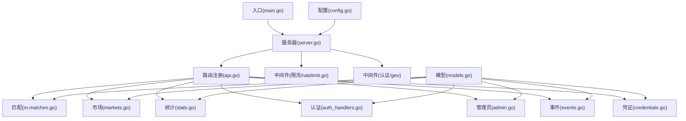
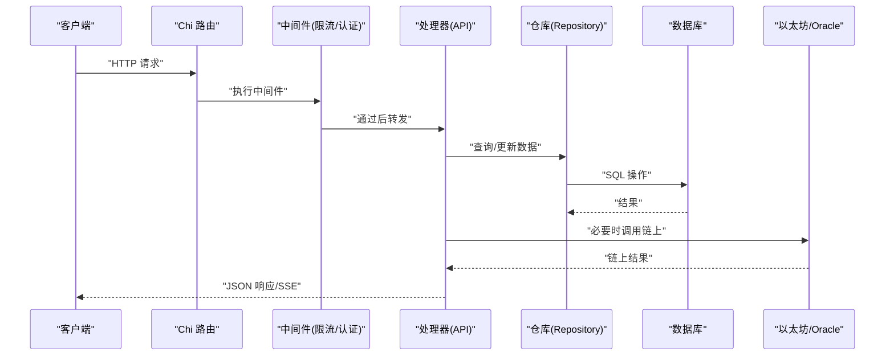
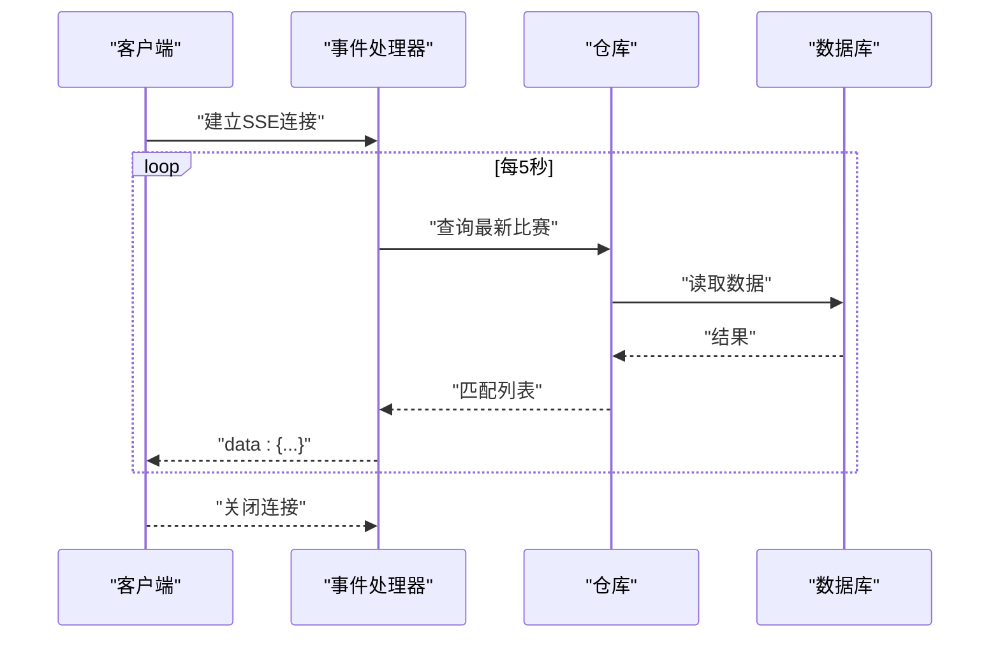
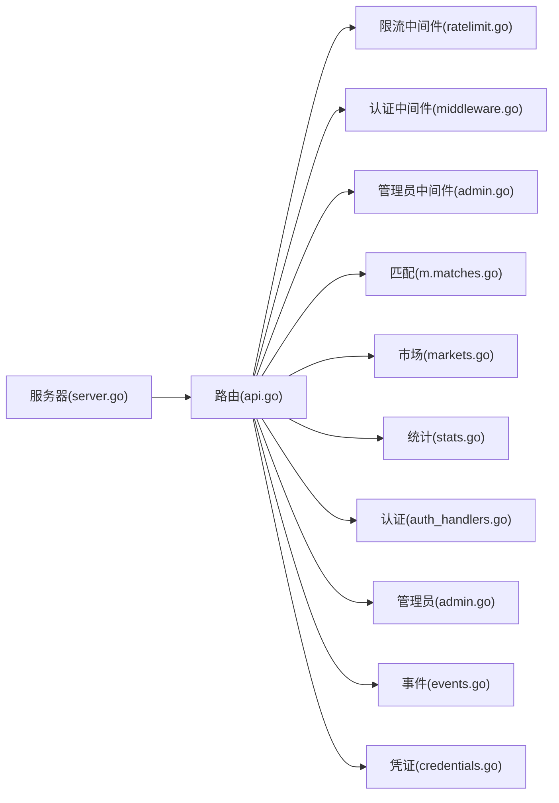

# API参考文档

<cite>
**本文档引用的文件**
- [cmd/api/main.go](file://cmd/api/main.go)
- [internal/server/server.go](file://internal/server/server.go)
- [internal/handler/api.go](file://internal/handler/api.go)
- [internal/handler/matches.go](file://internal/handler/matches.go)
- [internal/handler/markets.go](file://internal/handler/markets.go)
- [internal/handler/stats.go](file://internal/handler/stats.go)
- [internal/handler/auth_handlers.go](file://internal/handler/auth_handlers.go)
- [internal/handler/admin.go](file://internal/handler/admin.go)
- [internal/handler/events.go](file://internal/handler/events.go)
- [internal/handler/credentials.go](file://internal/handler/credentials.go)
- [internal/config/config.go](file://internal/config/config.go)
- [internal/auth/middleware.go](file://internal/auth/middleware.go)
- [internal/auth/admin.go](file://internal/auth/admin.go)
- [internal/middleware/ratelimit.go](file://internal/middleware/ratelimit.go)
- [internal/models/models.go](file://internal/models/models.go)
</cite>

## 目录
1. [简介](#简介)
2. [项目结构](#项目结构)
3. [核心组件](#核心组件)
4. [架构总览](#架构总览)
5. [详细组件分析](#详细组件分析)
6. [依赖关系分析](#依赖关系分析)
7. [性能考虑](#性能考虑)
8. [故障排除指南](#故障排除指南)
9. [结论](#结论)
10. [附录](#附录)

## 简介
本文件为 PredictionDIDSimple 后端服务的完整 API 参考文档，覆盖公开数据 API、认证与授权 API、用户相关 API、管理员 API 以及 WebSocket 实时事件流。文档提供每个端点的 HTTP 方法、URL 模式、请求/响应结构、认证方式、错误码及示例，并补充速率限制、安全与性能优化建议。

## 项目结构
后端采用分层设计：入口程序负责初始化数据库迁移、索引器与服务；服务器层构建路由与中间件；处理器层实现各业务 API；配置层管理运行时参数；认证与限流中间件提供安全与保护。

图表来源
- [cmd/api/main.go](file://cmd/api/main.go#L24-L118)
- [internal/server/server.go](file://internal/server/server.go#L35-L85)
- [internal/handler/api.go](file://internal/handler/api.go#L30-L61)

章节来源
- [cmd/api/main.go](file://cmd/api/main.go#L24-L118)
- [internal/server/server.go](file://internal/server/server.go#L35-L85)

## 核心组件
- 路由与中间件：基于 Chi 路由器，启用 CORS、日志、恢复、速率限制与地理阻断。
- 处理器：按功能分组，提供公开数据、认证、用户、管理员与事件等 API。
- 配置：集中管理数据库、Redis、链上 RPC、JWT、SIWE、VC、限流、合规等参数。
- 安全：JWT 认证、管理员密钥校验、速率限制、地理阻断。

章节来源
- [internal/server/server.go](file://internal/server/server.go#L35-L85)
- [internal/handler/api.go](file://internal/handler/api.go#L30-L61)
- [internal/config/config.go](file://internal/config/config.go#L45-L96)
- [internal/middleware/ratelimit.go](file://internal/middleware/ratelimit.go#L36-L55)

## 架构总览
下图展示从客户端到处理器再到存储与链上组件的整体调用路径。

图表来源
- [internal/server/server.go](file://internal/server/server.go#L35-L85)
- [internal/handler/api.go](file://internal/handler/api.go#L30-L61)

## 详细组件分析

### 公共API
- 基础路径：无前缀
- 认证：无需
- 适用场景：公开数据浏览、平台统计与事件流订阅

端点一览
- GET /matches
  - 查询参数
    - status：字符串，过滤条件
    - limit：整数，默认20
    - offset：整数，默认0
  - 响应字段
    - items：数组，元素为匹配对象
  - 错误码
    - 500：内部错误
  - 示例
    - 请求：GET /matches?status=upcoming&limit=20&offset=0
    - 响应：{"items": [...]}

- GET /matches/{id}
  - 路径参数
    - id：整数，比赛ID
  - 响应字段
    - match：匹配对象
    - markets：关联市场列表
  - 错误码
    - 400：无效ID
    - 404：未找到

- GET /markets
  - 查询参数
    - status：字符串，过滤条件
    - limit：整数，默认20
    - offset：整数，默认0
  - 响应字段
    - items：数组，元素为市场对象
    - collateral_address：合约地址
    - chain_id：链ID
  - 错误码
    - 500：内部错误

- GET /markets/{id}
  - 响应字段
    - market：市场对象
    - collateral_address：合约地址
    - chain_id：链ID
    - access.allowed：是否允许访问
    - access.requires_vc：是否需要凭证
    - access.credential_type：凭证类型
  - 错误码
    - 400：无效ID
    - 404：未找到

- GET /markets/{id}/pool
  - 响应字段
    - market_id：市场ID
    - market_type：市场类型
    - reserve_yes/no：流动性储备
    - price_yes_bps：价格（BP）
    - fee_bps：手续费（BP）
    - outcome_count：结果数量
  - 错误码
    - 400/404：无效或不存在

- GET /markets/{id}/orderbook
  - 响应字段
    - bids：数组，包含“yes/no”方向、价格与深度
    - note：说明（CPMM 快照）
  - 错误码
    - 400/404：无效或不存在

- GET /stats/platform
  - 响应：平台统计数据对象
  - 错误码
    - 500：内部错误

- GET /events/scores
  - 协议：Server-Sent Events
  - 响应字段
    - items：匹配列表
    - ts：时间戳
  - 错误码
    - 500：不支持流式

- GET /metrics
  - 响应：Prometheus 指标文本
  - 用途：监控与告警

章节来源
- [internal/handler/api.go](file://internal/handler/api.go#L30-L41)
- [internal/handler/matches.go](file://internal/handler/matches.go#L7-L38)
- [internal/handler/markets.go](file://internal/handler/markets.go#L9-L50)
- [internal/handler/stats.go](file://internal/handler/stats.go#L8-L78)
- [internal/handler/events.go](file://internal/handler/events.go#L10-L37)

### 认证API
- 基础路径：/auth
- 认证：无需
- 适用场景：用户登录与凭证验证

端点一览
- POST /auth/siwe
  - 请求体
    - message：字符串，SIWE 原文
    - signature：字符串，签名
  - 响应字段
    - token：JWT
    - user：用户对象
  - 错误码
    - 400：请求体无效
    - 401：未授权（签名无效）

- POST /auth/verify-vc
  - 请求体
    - vc_json：JSON 字符串，VC 原始内容
    - credential_type：字符串，凭证类型
    - region：字符串，可选，地区校验
  - 响应字段
    - valid：布尔，是否有效
  - 错误码
    - 400：请求体无效
    - 401：未授权（验证失败）
    - 403：禁止（地区不匹配）

章节来源
- [internal/handler/api.go](file://internal/handler/api.go#L43-L44)
- [internal/handler/auth_handlers.go](file://internal/handler/auth_handlers.go#L16-L44)
- [internal/handler/credentials.go](file://internal/handler/credentials.go#L78-L96)

### 用户API
- 基础路径：/（受JWT保护）
- 认证：Bearer JWT
- 适用场景：用户持仓、绑定DID、查看个人凭证

端点一览
- GET /me/positions
  - 响应字段
    - items：用户持仓列表
  - 错误码
    - 500：内部错误

- POST /users/bind-did
  - 请求体
    - did：字符串，DID
    - signature：字符串，签名
  - 响应字段
    - user：用户对象
  - 错误码
    - 400：请求体无效/签名无效
    - 500：内部错误

- GET /users/me/credentials
  - 响应字段
    - items：用户凭证列表
  - 错误码
    - 500：内部错误

章节来源
- [internal/handler/api.go](file://internal/handler/api.go#L46-L51)
- [internal/handler/auth_handlers.go](file://internal/handler/auth_handlers.go#L51-L78)
- [internal/handler/credentials.go](file://internal/handler/credentials.go#L62-L70)

### 管理员API
- 基础路径：/admin（受管理员密钥保护）
- 认证：X-Admin-Key 或 Authorization: Bearer
- 适用场景：Oracle 任务管理、市场注册与作废、凭证签发

端点一览
- GET /admin/oracle-jobs
  - 查询参数
    - status：字符串，过滤条件
  - 响应字段
    - items：Oracle 任务列表
  - 错误码
    - 500：内部错误

- POST /admin/markets
  - 请求体
    - match_id：整数
    - market_address：字符串
    - question：字符串
    - requires_vc：布尔
    - restricted_region：字符串
    - resolution_rule：字符串
  - 响应字段
    - status：字符串
  - 错误码
    - 400：请求体无效
    - 500：内部错误

- POST /admin/markets/{id}/void
  - 请求体：空
  - 响应字段
    - status：字符串
  - 错误码
    - 400/404：无效或不存在
    - 500：内部错误

- POST /admin/oracle-jobs/{id}/retry
  - 响应字段
    - status：字符串
  - 错误码
    - 400：无效ID
    - 500：内部错误

- POST /credentials/issue
  - 请求体
    - address：字符串
    - credential_type：字符串
    - claims：对象
    - ttl_hours：整数，可选
  - 响应字段
    - id：凭证ID
    - vc：原始VC JSON
  - 错误码
    - 400：缺少必填字段
    - 500：内部错误

章节来源
- [internal/handler/api.go](file://internal/handler/api.go#L53-L60)
- [internal/handler/admin.go](file://internal/handler/admin.go#L10-L89)
- [internal/handler/credentials.go](file://internal/handler/credentials.go#L21-L60)

### WebSocket 事件流
- 端点：/events/scores
- 协议：Server-Sent Events
- 连接保持：每5秒推送一次
- 消息格式：JSON 对象
  - items：匹配列表
  - ts：UTC 时间戳
- 断开：客户端取消请求或网络中断

图表来源
- [internal/handler/events.go](file://internal/handler/events.go#L10-L37)

章节来源
- [internal/handler/events.go](file://internal/handler/events.go#L10-L37)

## 依赖关系分析
- 服务器依赖注入：数据库连接池、Redis、链客户端、Oracle 客户端、配置。
- 路由分组：公开API、JWT保护组、管理员组。
- 中间件链：日志、恢复、CORS、速率限制、地理阻断、JWT、管理员密钥。

图表来源
- [internal/server/server.go](file://internal/server/server.go#L35-L85)
- [internal/handler/api.go](file://internal/handler/api.go#L30-L61)
- [internal/middleware/ratelimit.go](file://internal/middleware/ratelimit.go#L36-L55)
- [internal/auth/middleware.go](file://internal/auth/middleware.go#L13-L31)
- [internal/auth/admin.go](file://internal/auth/admin.go#L8-L26)

章节来源
- [internal/server/server.go](file://internal/server/server.go#L35-L85)
- [internal/handler/api.go](file://internal/handler/api.go#L30-L61)

## 性能考虑
- 速率限制：默认每分钟请求数由配置项控制，健康检查与就绪检查不受限流影响。
- 缓存与异步：Redis 客户端在启动时尝试连接，若不可用则降级运行。
- 写超时：SSE 场景写超时设置为无限，确保事件推送稳定。
- 数据库：使用连接池，避免频繁创建连接。
- 事件流：固定周期轮询，减少数据库压力。

章节来源
- [internal/middleware/ratelimit.go](file://internal/middleware/ratelimit.go#L36-L55)
- [internal/server/server.go](file://internal/server/server.go#L78-L83)
- [cmd/api/main.go](file://cmd/api/main.go#L48-L59)

## 故障排除指南
- 401 未授权
  - 检查 Authorization 头是否为 Bearer Token，且签名有效。
  - 确认 JWT 密钥与签发方一致。
- 403 禁止
  - 管理员端点需 X-Admin-Key 或 Bearer 管理员令牌。
- 404 未找到
  - 检查资源ID是否正确，数据库中是否存在对应记录。
- 429 速率限制
  - 降低请求频率或提升配置项 RATE_LIMIT_PER_MINUTE。
- 500 内部错误
  - 查看服务日志，定位具体处理器与仓库操作。
- SSE 不工作
  - 确认客户端支持 Server-Sent Events，网络环境允许长连接。

章节来源
- [internal/auth/middleware.go](file://internal/auth/middleware.go#L13-L31)
- [internal/auth/admin.go](file://internal/auth/admin.go#L8-L26)
- [internal/middleware/ratelimit.go](file://internal/middleware/ratelimit.go#L36-L55)
- [internal/handler/events.go](file://internal/handler/events.go#L10-L37)

## 结论
本 API 文档覆盖了公开数据、认证、用户、管理员与实时事件流的完整能力边界。通过明确的认证方式、统一的错误码与响应结构，开发者可快速集成与扩展。建议在生产环境启用更严格的速率限制、地理阻断与安全头，并对敏感端点进行审计与监控。

## 附录

### API 版本控制
- 当前版本：未发现显式版本号或路径前缀，建议后续引入 /v1 前缀以支持多版本演进。

### 速率限制策略
- 默认每IP每分钟请求数由配置项控制。
- 健康与就绪检查不受限流影响。
- 建议根据业务峰值调整 perMinute 参数。

章节来源
- [internal/config/config.go](file://internal/config/config.go#L72-L72)
- [internal/middleware/ratelimit.go](file://internal/middleware/ratelimit.go#L36-L55)

### 安全考虑
- 认证
  - JWT：用于用户会话，签发有效期可配置。
  - SIWE：链上签名登录，需校验域名与URI。
  - 管理员：X-Admin-Key 或 Bearer 管理令牌。
- 传输
  - 建议仅在 HTTPS 下提供服务，防止令牌泄露。
- 存储
  - JWT 秘钥与 VC 签发密钥需妥善保管，定期轮换。
- 地理阻断
  - 支持按国家/地区封禁，可通过配置启用。

章节来源
- [internal/auth/middleware.go](file://internal/auth/middleware.go#L13-L31)
- [internal/auth/admin.go](file://internal/auth/admin.go#L8-L26)
- [internal/config/config.go](file://internal/config/config.go#L71-L77)

### 常见使用案例
- 获取市场深度
  - 步骤：先 GET /markets/{id} 获取基础信息，再 GET /markets/{id}/orderbook 获取盘口快照。
- 订阅实时比分
  - 步骤：GET /events/scores，客户端循环读取 data 行。
- 用户登录
  - 步骤：POST /auth/siwe 获取 JWT，后续请求在 Authorization 头带上 Bearer Token。
- 管理市场
  - 步骤：POST /admin/markets 注册市场，必要时 POST /admin/markets/{id}/void 作废。

### 客户端实现指南
- 使用标准 HTTP 客户端或 fetch 发起请求。
- SSE 客户端需支持 EventSource 或自定义轮询。
- 对于管理员端点，务必在请求头携带 X-Admin-Key 或 Authorization: Bearer。
- 对错误响应进行统一处理，区分业务错误与系统错误。

### 数据模型摘要
- 匹配：包含主队、客队、开赛时间、状态与比分。
- 市场：包含链上地址、问题、结束时间、状态、池子、手续费、是否需要凭证等。
- 持仓：用户在各市场的多/空头寸。
- 用户：钱包地址与可选DID。

章节来源
- [internal/models/models.go](file://internal/models/models.go#L5-L57)