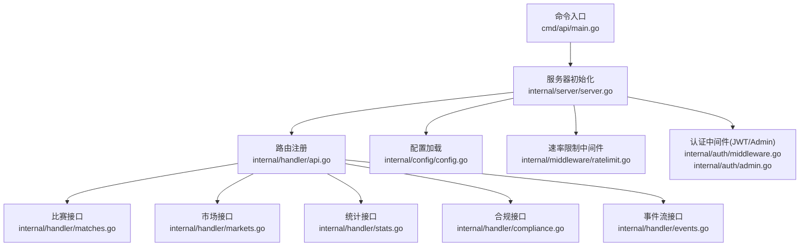
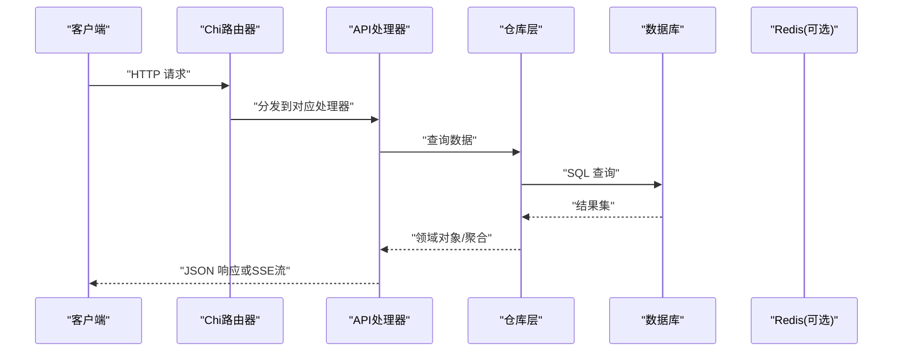
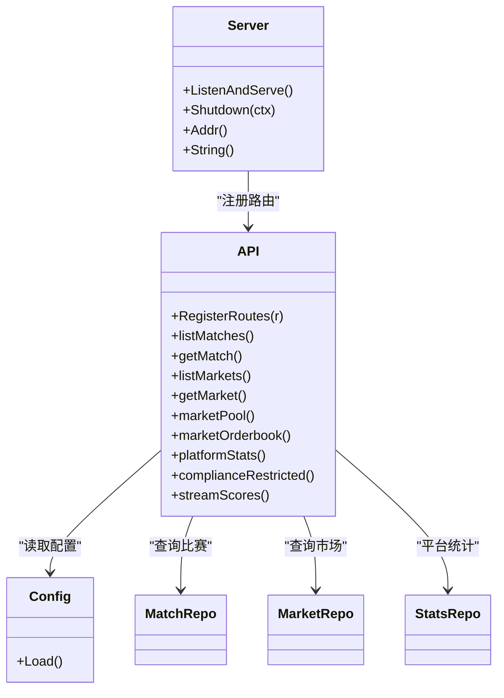

# 公共API

<cite>
**本文引用的文件**
- [cmd/api/main.go](file://cmd/api/main.go)
- [internal/server/server.go](file://internal/server/server.go)
- [internal/handler/api.go](file://internal/handler/api.go)
- [internal/handler/matches.go](file://internal/handler/matches.go)
- [internal/handler/markets.go](file://internal/handler/markets.go)
- [internal/handler/stats.go](file://internal/handler/stats.go)
- [internal/handler/compliance.go](file://internal/handler/compliance.go)
- [internal/handler/events.go](file://internal/handler/events.go)
- [internal/config/config.go](file://internal/config/config.go)
- [internal/models/models.go](file://internal/models/models.go)
- [internal/repository/stats.go](file://internal/repository/stats.go)
- [internal/middleware/ratelimit.go](file://internal/middleware/ratelimit.go)
- [internal/auth/middleware.go](file://internal/auth/middleware.go)
- [internal/auth/admin.go](file://internal/auth/admin.go)
</cite>

## 目录
1. [简介](#简介)
2. [项目结构](#项目结构)
3. [核心组件](#核心组件)
4. [架构总览](#架构总览)
5. [详细组件分析](#详细组件分析)
6. [依赖关系分析](#依赖关系分析)
7. [性能考虑](#性能考虑)
8. [故障排查指南](#故障排查指南)
9. [结论](#结论)

## 简介
本文件为公共API接口的权威文档，覆盖无需认证即可访问的公开端点，包括：
- 比赛相关：/matches、/matches/{id}
- 市场相关：/markets、/markets/{id}、/markets/{id}/pool、/markets/{id}/orderbook
- 统计接口：/stats/platform
- 合规性接口：/compliance/restricted
- 事件流接口：/events/scores

文档逐项说明HTTP方法、URL参数、查询参数、请求格式、响应格式、错误码，并提供请求与响应示例路径、数据结构字段说明、使用限制与最佳实践。

## 项目结构
后端基于Go语言与Chi路由器构建，服务启动于命令入口，路由在API处理器中集中注册，中间件统一处理CORS、限流与地理阻断等横切关注点。

**图表来源**
- [cmd/api/main.go](file://cmd/api/main.go#L24-L98)
- [internal/server/server.go](file://internal/server/server.go#L35-L84)
- [internal/handler/api.go](file://internal/handler/api.go#L30-L61)

**章节来源**
- [cmd/api/main.go](file://cmd/api/main.go#L24-L98)
- [internal/server/server.go](file://internal/server/server.go#L35-L84)

## 核心组件
- 路由器与中间件
  - CORS允许GET/POST/PUT/DELETE/OPTIONS，允许头包含CF-IPCountry、X-Country-Code、X-KYC-Signature等。
  - 速率限制默认每分钟120次，健康检查与就绪检查不受限流影响。
  - 地理阻断中间件根据配置的黑名单国家进行访问控制，并记录日志。
- API处理器
  - 注册公共端点与受保护端点；公共端点无需认证。
  - 提供通用写JSON与错误响应工具函数。
- 数据模型
  - Match、Market、Position、User用于接口响应的数据载体。

**章节来源**
- [internal/server/server.go](file://internal/server/server.go#L48-L53)
- [internal/middleware/ratelimit.go](file://internal/middleware/ratelimit.go#L36-L54)
- [internal/handler/api.go](file://internal/handler/api.go#L30-L87)
- [internal/models/models.go](file://internal/models/models.go#L5-L57)

## 架构总览
下图展示公共API的调用链路与关键组件交互。

**图表来源**
- [internal/server/server.go](file://internal/server/server.go#L62-L75)
- [internal/handler/api.go](file://internal/handler/api.go#L30-L61)
- [internal/repository/stats.go](file://internal/repository/stats.go#L26-L41)

## 详细组件分析

### 比赛接口

- 端点：/matches
  - 方法：GET
  - 查询参数：
    - status：字符串，过滤条件
    - limit：整数，默认20
    - offset：整数，默认0
  - 请求格式：无
  - 响应格式：包含items数组的对象
  - 错误码：
    - 500：内部错误
  - 示例：
    - 请求示例路径：[GET /matches](file://internal/handler/matches.go#L7-L17)
    - 成功响应示例路径：[GET /matches 成功](file://internal/handler/matches.go#L16-L16)
    - 失败响应示例路径：[GET /matches 失败](file://internal/handler/matches.go#L13-L13)

- 端点：/matches/{id}
  - 方法：GET
  - URL参数：id（整数）
  - 请求格式：无
  - 响应格式：包含match与markets数组的对象
  - 错误码：
    - 400：无效id
    - 404：未找到比赛
    - 500：内部错误
  - 示例：
    - 请求示例路径：[GET /matches/{id}](file://internal/handler/matches.go#L19-L38)
    - 成功响应示例路径：[GET /matches/{id} 成功](file://internal/handler/matches.go#L37-L37)
    - 失败响应示例路径：[GET /matches/{id} 失败](file://internal/handler/matches.go#L22-L28)

**章节来源**
- [internal/handler/matches.go](file://internal/handler/matches.go#L7-L38)
- [internal/handler/api.go](file://internal/handler/api.go#L31-L32)

### 市场接口

- 端点：/markets
  - 方法：GET
  - 查询参数：
    - status：字符串，过滤条件
    - limit：整数，默认20
    - offset：整数，默认0
  - 请求格式：无
  - 响应格式：包含items数组、collateral_address与chain_id的对象
  - 错误码：
    - 500：内部错误
  - 示例：
    - 请求示例路径：[GET /markets](file://internal/handler/markets.go#L9-L23)
    - 成功响应示例路径：[GET /markets 成功](file://internal/handler/markets.go#L18-L22)
    - 失败响应示例路径：[GET /markets 失败](file://internal/handler/markets.go#L15-L15)

- 端点：/markets/{id}
  - 方法：GET
  - URL参数：id（整数）
  - 请求格式：无
  - 响应格式：包含market、collateral_address、chain_id与access的对象
  - access字段说明：
    - allowed：布尔值，是否允许访问
    - requires_vc：布尔值，是否需要凭证类型
    - credential_type：字符串，所需凭证类型
  - 错误码：
    - 400：无效id
    - 404：未找到市场
    - 500：内部错误
  - 示例：
    - 请求示例路径：[GET /markets/{id}](file://internal/handler/markets.go#L25-L50)
    - 成功响应示例路径：[GET /markets/{id} 成功](file://internal/handler/markets.go#L44-L49)
    - 失败响应示例路径：[GET /markets/{id} 失败](file://internal/handler/markets.go#L28-L34)

- 端点：/markets/{id}/pool
  - 方法：GET
  - URL参数：id（整数）
  - 请求格式：无
  - 响应格式：包含market_id、market_type、reserve_yes、reserve_no、price_yes_bps、fee_bps、outcome_count的对象
  - 错误码：
    - 400：无效id
    - 404：未找到市场
    - 500：内部错误
  - 示例：
    - 请求示例路径：[GET /markets/{id}/pool](file://internal/handler/stats.go#L17-L37)
    - 成功响应示例路径：[GET /markets/{id}/pool 成功](file://internal/handler/stats.go#L28-L36)
    - 失败响应示例路径：[GET /markets/{id}/pool 失败](file://internal/handler/stats.go#L20-L26)

- 端点：/markets/{id}/orderbook
  - 方法：GET
  - URL参数：id（整数）
  - 请求格式：无
  - 响应格式：包含bids数组与note字段的对象
  - bids数组元素字段：
    - side：字符串，"yes"或"no"
    - price_bps：整数，千分比价格
    - depth：字符串，深度（优先使用reserve，否则回退到pool）
  - note：字符串，说明为CPMM快照
  - 错误码：
    - 400：无效id
    - 404：未找到市场
    - 500：内部错误
  - 示例：
    - 请求示例路径：[GET /markets/{id}/orderbook](file://internal/handler/stats.go#L39-L59)
    - 成功响应示例路径：[GET /markets/{id}/orderbook 成功](file://internal/handler/stats.go#L52-L58)
    - 失败响应示例路径：[GET /markets/{id}/orderbook 失败](file://internal/handler/stats.go#L43-L49)

**章节来源**
- [internal/handler/markets.go](file://internal/handler/markets.go#L9-L50)
- [internal/handler/stats.go](file://internal/handler/stats.go#L17-L78)
- [internal/handler/api.go](file://internal/handler/api.go#L33-L36)

### 统计接口

- 端点：/stats/platform
  - 方法：GET
  - 请求格式：无
  - 响应格式：PlatformStats对象
    - trade_count：整数，交易次数
    - trade_volume：字符串，交易总量
    - fees_collected：字符串，已收取费用
    - active_users：整数，活跃用户数
    - open_markets：整数，开放市场数
    - tvl_approx：字符串，近似总锁仓价值
  - 错误码：
    - 500：内部错误
  - 示例：
    - 请求示例路径：[GET /stats/platform](file://internal/handler/stats.go#L8-L14)
    - 成功响应示例路径：[GET /stats/platform 成功](file://internal/handler/stats.go#L14-L14)
    - 失败响应示例路径：[GET /stats/platform 失败](file://internal/handler/stats.go#L11-L11)

**章节来源**
- [internal/handler/stats.go](file://internal/handler/stats.go#L8-L15)
- [internal/repository/stats.go](file://internal/repository/stats.go#L9-L41)

### 合规性接口

- 端点：/compliance/restricted
  - 方法：GET
  - 请求格式：无
  - 响应格式：包含country、restricted、compliance_required、environment的对象
  - 错误码：
    - 200：总是返回成功（即使解析不到国家代码）
  - 示例：
    - 请求示例路径：[GET /compliance/restricted](file://internal/handler/compliance.go#L7-L22)
    - 成功响应示例路径：[GET /compliance/restricted 成功](file://internal/handler/compliance.go#L16-L21)

**章节来源**
- [internal/handler/compliance.go](file://internal/handler/compliance.go#L7-L22)
- [internal/config/config.go](file://internal/config/config.go#L37-L42)

### 事件流接口

- 端点：/events/scores
  - 方法：GET
  - 请求格式：无
  - 响应格式：Server-Sent Events（text/event-stream）
  - 字段：
    - items：比赛列表
    - ts：时间戳（UTC）
  - 错误码：
    - 500：不支持流式传输
  - 示例：
    - 请求示例路径：[GET /events/scores](file://internal/handler/events.go#L10-L37)
    - 成功响应示例路径：[GET /events/scores 成功](file://internal/handler/events.go#L32-L34)

**章节来源**
- [internal/handler/events.go](file://internal/handler/events.go#L10-L37)

### 数据模型与字段说明

- Match
  - id：整数
  - external_id：字符串
  - home_team：字符串
  - away_team：字符串
  - kickoff_at：时间
  - status：字符串
  - home_score：整数（可空）
  - away_score：整数（可空）

- Market
  - id：整数
  - match_id：整数（可空）
  - chain_id：整数
  - factory_address：字符串
  - market_address：字符串
  - on_chain_market_id：整数
  - match_ref：字符串
  - question：字符串
  - end_time：时间
  - status：字符串
  - winning_outcome：整数（可空）
  - yes_pool：字符串
  - no_pool：字符串
  - market_type：字符串
  - outcome_count：整数
  - fee_bps：整数
  - reserve_yes：字符串（可空）
  - reserve_no：字符串（可空）
  - price_yes_bps：字符串（可空）
  - requires_vc：布尔值
  - restricted_region：字符串（可空）
  - resolution_rule：字符串（可空）
  - match：Match（可空）

- Position
  - id：整数
  - market_id：整数
  - user_address：字符串
  - yes_amount：字符串
  - no_amount：字符串
  - claimed：布尔值
  - market：Market（可空）
  - updated_at：时间

- User
  - id：整数
  - address：字符串
  - did：字符串（可空）

**章节来源**
- [internal/models/models.go](file://internal/models/models.go#L5-L57)

## 依赖关系分析

**图表来源**
- [internal/handler/api.go](file://internal/handler/api.go#L16-L28)
- [internal/server/server.go](file://internal/server/server.go#L62-L75)
- [internal/config/config.go](file://internal/config/config.go#L45-L96)

**章节来源**
- [internal/handler/api.go](file://internal/handler/api.go#L16-L28)
- [internal/server/server.go](file://internal/server/server.go#L62-L75)

## 性能考虑
- 速率限制
  - 默认每分钟120次，健康检查与就绪检查不受限流。
  - 受限流影响的端点：/matches、/matches/{id}、/markets、/markets/{id}、/markets/{id}/pool、/markets/{id}/orderbook、/stats/platform、/compliance/restricted、/events/scores。
- 写超时
  - SSE端点写超时设为0以支持长连接推送。
- 缓存与降级
  - Redis可用时启用，不可用时降级记录日志。

**章节来源**
- [internal/middleware/ratelimit.go](file://internal/middleware/ratelimit.go#L36-L54)
- [internal/server/server.go](file://internal/server/server.go#L82-L82)

## 故障排查指南
- 400 错误（无效id）
  - 检查URL参数id是否为合法整数。
  - 参考：[parseID](file://internal/handler/api.go#L85-L87)
- 404 错误（未找到）
  - 对应资源不存在，确认id与状态参数。
  - 参考：[getMatch/getMarket/marketPool/marketOrderbook](file://internal/handler/matches.go#L25-L28)
- 500 错误（内部错误）
  - 数据库查询异常或业务逻辑错误。
  - 参考：[listMatches/listMarkets/platformStats](file://internal/handler/matches.go#L12-L15)
- 速率限制
  - 触达每分钟上限，降低请求频率或提升配置。
  - 参考：[RateLimit](file://internal/middleware/ratelimit.go#L36-L54)
- SSE不工作
  - 客户端不支持流式传输或网络中断。
  - 参考：[streamScores](file://internal/handler/events.go#L14-L18)

**章节来源**
- [internal/handler/api.go](file://internal/handler/api.go#L85-L87)
- [internal/handler/matches.go](file://internal/handler/matches.go#L12-L28)
- [internal/handler/markets.go](file://internal/handler/markets.go#L15-L34)
- [internal/handler/stats.go](file://internal/handler/stats.go#L11-L26)
- [internal/middleware/ratelimit.go](file://internal/middleware/ratelimit.go#L36-L54)
- [internal/handler/events.go](file://internal/handler/events.go#L14-L18)

## 结论
本文档系统梳理了公共API的端点定义、参数规范、响应结构与错误处理策略，并提供了示例路径与最佳实践建议。生产环境部署时请确保正确配置环境变量与限流策略，合理规划请求频率，以获得稳定的服务体验。