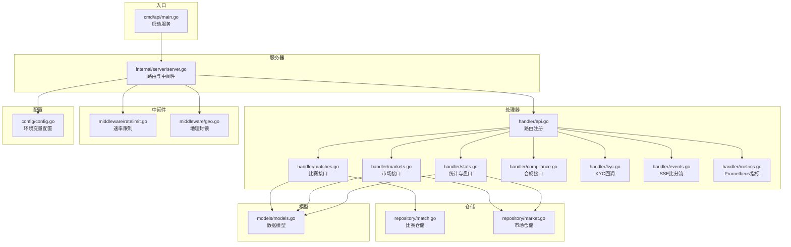
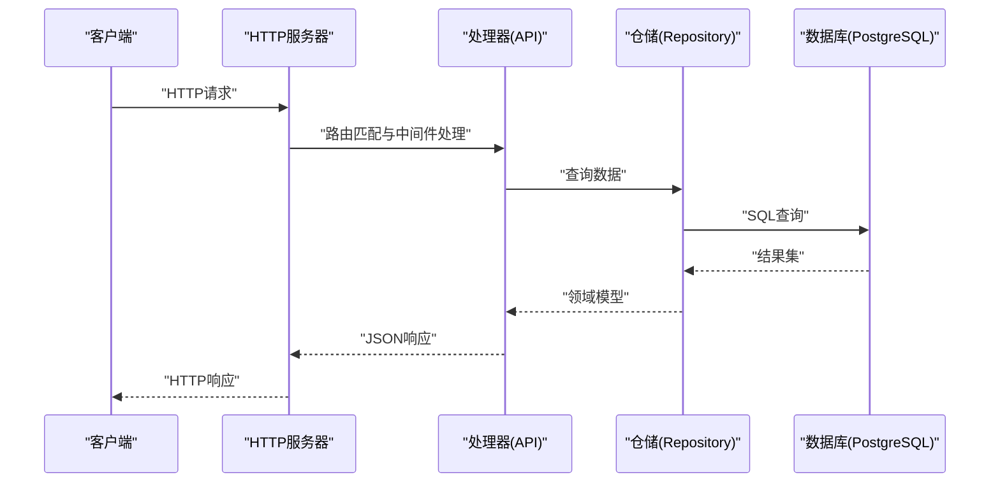
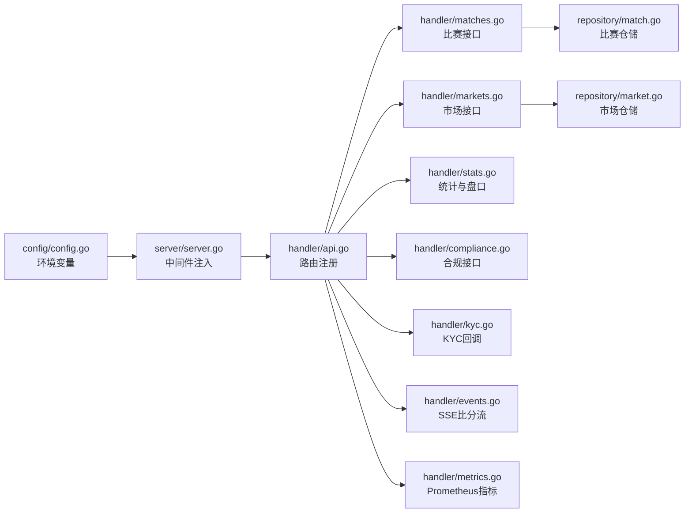
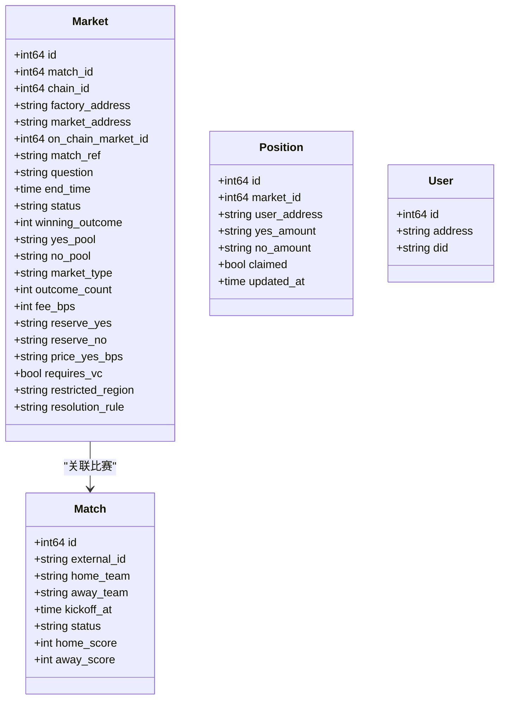

# 公开API接口

<cite>
**本文档引用的文件**
- [main.go](file://cmd/api/main.go)
- [server.go](file://internal/server/server.go)
- [api.go](file://internal/handler/api.go)
- [matches.go](file://internal/handler/matches.go)
- [markets.go](file://internal/handler/markets.go)
- [stats.go](file://internal/handler/stats.go)
- [compliance.go](file://internal/handler/compliance.go)
- [kyc.go](file://internal/handler/kyc.go)
- [events.go](file://internal/handler/events.go)
- [metrics.go](file://internal/handler/metrics.go)
- [config.go](file://internal/config/config.go)
- [models.go](file://internal/models/models.go)
- [match_repo.go](file://internal/repository/match.go)
- [market_repo.go](file://internal/repository/market.go)
- [health.go](file://internal/handler/health.go)
- [ratelimit.go](file://internal/middleware/ratelimit.go)
- [geo.go](file://internal/middleware/geo.go)
</cite>

## 目录
1. [简介](#简介)
2. [项目结构](#项目结构)
3. [核心组件](#核心组件)
4. [架构总览](#架构总览)
5. [详细组件分析](#详细组件分析)
6. [依赖关系分析](#依赖关系分析)
7. [性能考虑](#性能考虑)
8. [故障排除指南](#故障排除指南)
9. [结论](#结论)
10. [附录](#附录)

## 简介
本文件为 PredictionDIDSimple 项目的公开API接口文档，面向无需认证即可访问的REST端点进行系统化说明。涵盖以下端点：
- 比赛列表查询：/matches
- 比赛详情获取：/matches/{id}
- 市场列表查询：/markets
- 市场详情获取：/markets/{id}
- 市场资金池查询：/markets/{id}/pool
- 市场订单簿查询：/markets/{id}/orderbook
- 平台统计查询：/stats/platform
- 合规受限名单查询：/compliance/restricted
- KYC回调：/kyc/webhook
- SSE比分流：/events/scores
- Prometheus指标：/metrics

同时提供请求参数说明、响应格式示例、HTTP状态码定义、错误处理机制、实际curl示例以及JavaScript/Go客户端调用参考。

## 项目结构
后端采用分层架构：
- 入口层：cmd/api/main.go 启动HTTP服务并初始化依赖
- 服务器层：internal/server/server.go 配置路由、中间件与处理器
- 处理器层：internal/handler/* 提供业务逻辑与HTTP响应
- 仓储层：internal/repository/* 访问数据库
- 模型层：internal/models/* 定义数据结构
- 中间件：internal/middleware/* 提供速率限制与地理封锁
- 配置层：internal/config/config.go 读取环境变量

**图表来源**
- [main.go:1-161](file://cmd/api/main.go#L1-L161)
- [server.go:1-129](file://internal/server/server.go#L1-L129)
- [api.go:1-100](file://internal/handler/api.go#L1-L100)
- [matches.go:1-44](file://internal/handler/matches.go#L1-L44)
- [markets.go:1-60](file://internal/handler/markets.go#L1-L60)
- [stats.go:1-87](file://internal/handler/stats.go#L1-L87)
- [compliance.go:1-30](file://internal/handler/compliance.go#L1-L30)
- [kyc.go:1-67](file://internal/handler/kyc.go#L1-L67)
- [events.go:1-47](file://internal/handler/events.go#L1-L47)
- [metrics.go:1-37](file://internal/handler/metrics.go#L1-L37)
- [match_repo.go:1-118](file://internal/repository/match.go#L1-L118)
- [market_repo.go:1-269](file://internal/repository/market.go#L1-L269)
- [models.go:1-63](file://internal/models/models.go#L1-L63)
- [ratelimit.go:1-67](file://internal/middleware/ratelimit.go#L1-L67)
- [geo.go:1-65](file://internal/middleware/geo.go#L1-L65)
- [config.go:1-139](file://internal/config/config.go#L1-L139)

**章节来源**
- [main.go:1-161](file://cmd/api/main.go#L1-L161)
- [server.go:1-129](file://internal/server/server.go#L1-L129)
- [api.go:1-100](file://internal/handler/api.go#L1-L100)

## 核心组件
- 服务器与路由
  - 服务器在内部完成Chi路由、全局中间件、CORS配置与健康检查注册，随后注册公开API路由。
  - 公开API路由在处理器层统一注册，无需认证即可访问。
- 中间件
  - 速率限制中间件：基于IP的每分钟滑动窗口限流，默认每分钟120次，健康检查与就绪检查豁免。
  - 地理封锁中间件：根据请求头中的国家代码判断是否允许访问，合规相关路径与SSE事件流路径豁免。
- 配置
  - 通过环境变量加载，包含端口、数据库、Redis、链RPC、速率限制、封禁国家列表、KYC回调密钥等。

**章节来源**
- [server.go:40-102](file://internal/server/server.go#L40-L102)
- [api.go:33-69](file://internal/handler/api.go#L33-L69)
- [ratelimit.go:42-66](file://internal/middleware/ratelimit.go#L42-L66)
- [geo.go:12-51](file://internal/middleware/geo.go#L12-L51)
- [config.go:48-104](file://internal/config/config.go#L48-L104)

## 架构总览
公开API的典型请求流程如下：

**图表来源**
- [server.go:44-101](file://internal/server/server.go#L44-L101)
- [api.go:33-69](file://internal/handler/api.go#L33-L69)
- [match_repo.go:25-76](file://internal/repository/match.go#L25-L76)
- [market_repo.go:25-92](file://internal/repository/market.go#L25-L92)

## 详细组件分析

### 比赛列表查询 /matches
- 方法与路径
  - GET /matches
- 请求参数
  - status: 可选，按状态过滤
  - limit: 可选，每页条数，默认20
  - offset: 可选，偏移量，默认0
- 响应
  - 成功：200 OK，返回 items 数组
  - 失败：500 Internal Server Error，返回错误对象
- 示例
  - curl: curl "http://localhost:8080/matches?status=SCHEDULED&limit=20&offset=0"
- 错误处理
  - 数据库查询异常时返回500

**章节来源**
- [api.go:36](file://internal/handler/api.go#L36)
- [matches.go:8-19](file://internal/handler/matches.go#L8-L19)
- [match_repo.go:25-63](file://internal/repository/match.go#L25-L63)

### 比赛详情获取 /matches/{id}
- 方法与路径
  - GET /matches/{id}
- 路径参数
  - id: 整数，比赛ID
- 响应
  - 成功：200 OK，返回 match 和该比赛关联的 markets 列表
  - 失败：400 Bad Request（无效ID）、404 Not Found（未找到）
- 示例
  - curl: curl "http://localhost:8080/matches/123"
- 错误处理
  - ID解析失败返回400
  - 未找到比赛返回404

**章节来源**
- [api.go:37](file://internal/handler/api.go#L37)
- [matches.go:21-43](file://internal/handler/matches.go#L21-L43)
- [match_repo.go:65-76](file://internal/repository/match.go#L65-L76)

### 市场列表查询 /markets
- 方法与路径
  - GET /markets
- 请求参数
  - status: 可选，按状态过滤
  - limit: 可选，默认20
  - offset: 可选，默认0
- 响应
  - 成功：200 OK，返回 items 数组，以及 collateral_address 与 chain_id
  - 失败：500 Internal Server Error
- 示例
  - curl: curl "http://localhost:8080/markets?status=OPEN&limit=50&offset=0"
- 错误处理
  - 数据库查询异常返回500

**章节来源**
- [api.go:38](file://internal/handler/api.go#L38)
- [markets.go:10-27](file://internal/handler/markets.go#L10-L27)
- [market_repo.go:25-73](file://internal/repository/market.go#L25-L73)
- [config.go:12-46](file://internal/config/config.go#L12-L46)

### 市场详情获取 /markets/{id}
- 方法与路径
  - GET /markets/{id}
- 路径参数
  - id: 整数，市场ID
- 响应
  - 成功：200 OK，返回 market、collateral_address、chain_id，以及 access 控制信息
  - 失败：400 Bad Request（无效ID）、404 Not Found（未找到）
- access 字段说明
  - allowed: 是否允许交易
  - requires_vc: 是否需要VC
  - credential_type: 凭证类型
- 示例
  - curl: curl "http://localhost:8080/markets/456"
- 错误处理
  - ID解析失败返回400
  - 未找到市场返回404

**章节来源**
- [api.go:39](file://internal/handler/api.go#L39)
- [markets.go:29-59](file://internal/handler/markets.go#L29-L59)
- [market_repo.go:75-92](file://internal/repository/market.go#L75-L92)

### 市场资金池查询 /markets/{id}/pool
- 方法与路径
  - GET /markets/{id}/pool
- 路径参数
  - id: 整数，市场ID
- 响应
  - 成功：200 OK，返回 reserve_yes、reserve_no、price_yes_bps、fee_bps、outcome_count 等
  - 失败：400 Bad Request（无效ID）、404 Not Found（未找到）
- 示例
  - curl: curl "http://localhost:8080/markets/456/pool"

**章节来源**
- [api.go:40](file://internal/handler/api.go#L40)
- [stats.go:19-40](file://internal/handler/stats.go#L19-L40)
- [market_repo.go:75-92](file://internal/repository/market.go#L75-L92)

### 市场订单簿查询 /markets/{id}/orderbook
- 方法与路径
  - GET /markets/{id}/orderbook
- 路径参数
  - id: 敳数，市场ID
- 响应
  - 成功：200 OK，返回 bids（YES/NO两个方向），note标注CPMM快照
  - 失败：400 Bad Request（无效ID）、404 Not Found（未找到）
- 示例
  - curl: curl "http://localhost:8080/markets/456/orderbook"

**章节来源**
- [api.go:41](file://internal/handler/api.go#L41)
- [stats.go:42-66](file://internal/handler/stats.go#L42-L66)
- [market_repo.go:75-92](file://internal/repository/market.go#L75-L92)

### 平台统计查询 /stats/platform
- 方法与路径
  - GET /stats/platform
- 响应
  - 成功：200 OK，返回平台聚合统计
  - 失败：500 Internal Server Error
- 示例
  - curl: curl "http://localhost:8080/stats/platform"

**章节来源**
- [api.go:42](file://internal/handler/api.go#L42)
- [stats.go:9-17](file://internal/handler/stats.go#L9-L17)

### 合规受限名单查询 /compliance/restricted
- 方法与路径
  - GET /compliance/restricted
- 请求头
  - CF-IPCountry 或 X-Country-Code：国家代码
- 响应
  - 成功：200 OK，返回 country、restricted、compliance_required、environment
- 示例
  - curl: curl -H "CF-IPCountry: CN" "http://localhost:8080/compliance/restricted"

**章节来源**
- [api.go:43](file://internal/handler/api.go#L43)
- [compliance.go:9-29](file://internal/handler/compliance.go#L9-L29)
- [config.go:40-46](file://internal/config/config.go#L40-L46)

### KYC回调 /kyc/webhook
- 方法与路径
  - POST /kyc/webhook
- 请求头
  - X-KYC-Signature：HMAC-SHA256签名（若配置了密钥）
- 请求体
  - JSON对象，包含 external_id、user_address、status
- 响应
  - 成功：200 OK，返回 {"ok":"true"}
  - 失败：400 Bad Request（参数缺失/签名错误/JSON无效）、401 Unauthorized（签名不匹配）、500 Internal Server Error
- 示例
  - curl: curl -X POST "http://localhost:8080/kyc/webhook" -H "X-KYC-Signature: <hmac>" -H "Content-Type: application/json" -d '{"external_id":"ext123","user_address":"0x...","status":"approved"}'

**章节来源**
- [api.go:44](file://internal/handler/api.go#L44)
- [kyc.go:16-66](file://internal/handler/kyc.go#L16-L66)
- [config.go:43](file://internal/config/config.go#L43)

### SSE比分流 /events/scores
- 方法与路径
  - GET /events/scores
- 响应
  - 成功：200 OK，text/event-stream，每5秒推送一次，包含 items 与 ts
  - 失败：500 Internal Server Error（不支持流式）
- 示例
  - curl: curl -N "http://localhost:8080/events/scores"

**章节来源**
- [api.go:45](file://internal/handler/api.go#L45)
- [events.go:12-46](file://internal/handler/events.go#L12-L46)

### Prometheus指标 /metrics
- 方法与路径
  - GET /metrics
- 响应
  - 成功：200 OK，text/plain，输出oracle_jobs_*系列指标
- 示例
  - curl: curl "http://localhost:8080/metrics"

**章节来源**
- [api.go:46](file://internal/handler/api.go#L46)
- [metrics.go:9-36](file://internal/handler/metrics.go#L9-L36)

## 依赖关系分析
- 路由与处理器
  - 路由在API处理器中集中注册，公开接口无需认证
- 仓储与模型
  - 比赛与市场仓储负责SQL查询与模型映射
- 中间件
  - 速率限制与地理封锁在服务器初始化时注入
- 配置
  - 端口、封禁国家、速率限制等通过环境变量配置

**图表来源**
- [api.go:33-69](file://internal/handler/api.go#L33-L69)
- [matches.go:1-44](file://internal/handler/matches.go#L1-L44)
- [markets.go:1-60](file://internal/handler/markets.go#L1-L60)
- [stats.go:1-87](file://internal/handler/stats.go#L1-L87)
- [compliance.go:1-30](file://internal/handler/compliance.go#L1-L30)
- [kyc.go:1-67](file://internal/handler/kyc.go#L1-L67)
- [events.go:1-47](file://internal/handler/events.go#L1-L47)
- [metrics.go:1-37](file://internal/handler/metrics.go#L1-L37)
- [match_repo.go:1-118](file://internal/repository/match.go#L1-L118)
- [market_repo.go:1-269](file://internal/repository/market.go#L1-L269)
- [server.go:44-101](file://internal/server/server.go#L44-L101)
- [config.go:48-104](file://internal/config/config.go#L48-L104)

**章节来源**
- [server.go:44-101](file://internal/server/server.go#L44-L101)
- [api.go:33-69](file://internal/handler/api.go#L33-L69)

## 性能考虑
- 速率限制
  - 默认每分钟120次，可通过环境变量调整
  - 健康检查与就绪检查豁免限流
- 地理封锁
  - 对合规相关路径与SSE事件流路径豁免，减少不必要的拦截
- SSE推送
  - 5秒定时推送，适合前端轮询替代方案
- 数据库查询
  - 分页查询默认limit=20，建议客户端合理设置limit与offset

[本节为通用指导，不涉及具体文件分析]

## 故障排除指南
- 常见HTTP状态码
  - 200：成功
  - 400：请求参数无效或缺失
  - 401：未授权（如KYC回调签名不匹配）
  - 403：地理封锁限制
  - 404：资源不存在
  - 429：超出速率限制
  - 500：服务器内部错误
  - 503：服务不可用（就绪检查失败）
- 健康与就绪
  - 使用 /health 与 /ready 检查服务状态
- 速率限制
  - 检查环境变量 RATE_LIMIT_PER_MINUTE
- 地理封锁
  - 确认 BLOCKED_COUNTRIES 与 GEO_BLOCK_ENABLED
- KYC回调
  - 确认 KYC_WEBHOOK_SECRET 与请求头 X-KYC-Signature

**章节来源**
- [health.go:28-77](file://internal/handler/health.go#L28-L77)
- [ratelimit.go:42-66](file://internal/middleware/ratelimit.go#L42-L66)
- [geo.go:12-51](file://internal/middleware/geo.go#L12-L51)
- [kyc.go:16-66](file://internal/handler/kyc.go#L16-L66)
- [config.go:75-104](file://internal/config/config.go#L75-L104)

## 结论
本文档系统梳理了 PredictionDIDSimple 的公开API接口，明确了各端点的请求参数、响应格式、状态码与错误处理机制，并提供了实际的curl示例与客户端调用参考。生产部署时，请确保正确配置环境变量并关注速率限制与地理封锁策略。

[本节为总结性内容，不涉及具体文件分析]

## 附录

### 数据模型概览

**图表来源**
- [models.go:6-63](file://internal/models/models.go#L6-L63)

### 客户端调用参考
- JavaScript（fetch）
  - GET /matches：使用 fetch(url) 获取JSON，解析 items
  - GET /events/scores：使用 EventSource(url) 订阅SSE
  - POST /kyc/webhook：使用 fetch(url, { method: 'POST', headers: {'X-KYC-Signature': sig}, body: JSON.stringify(payload) })
- Go
  - GET /metrics：使用 http.Get(url)，解析返回的Prometheus文本
  - GET /markets/{id}/orderbook：使用 http.Get(url)，解析 bids 数组

[本节为概念性示例，不直接对应具体源码片段]