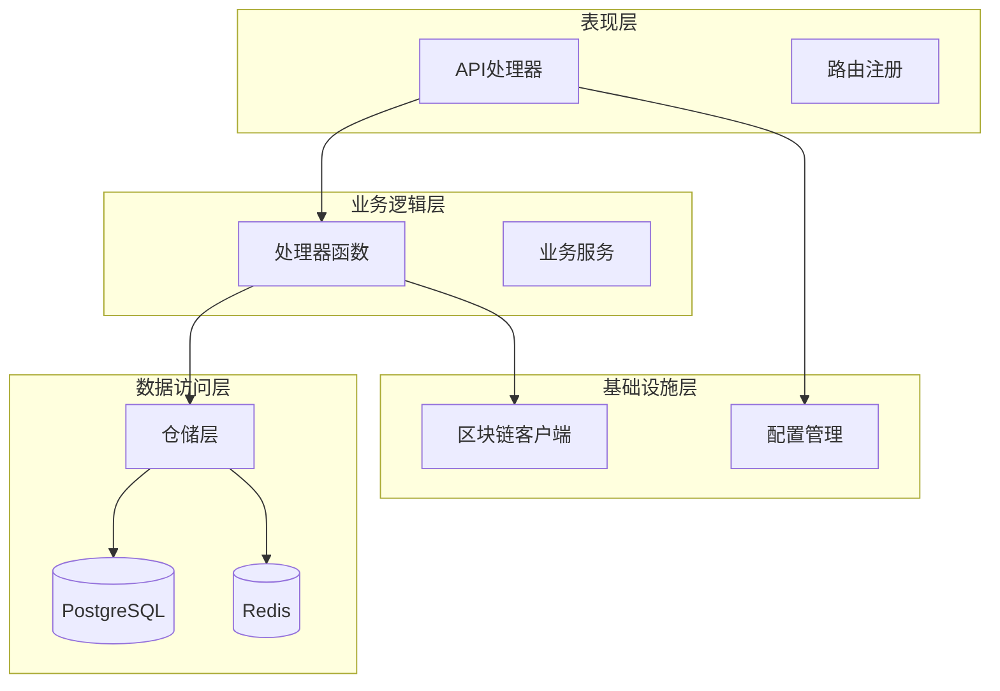
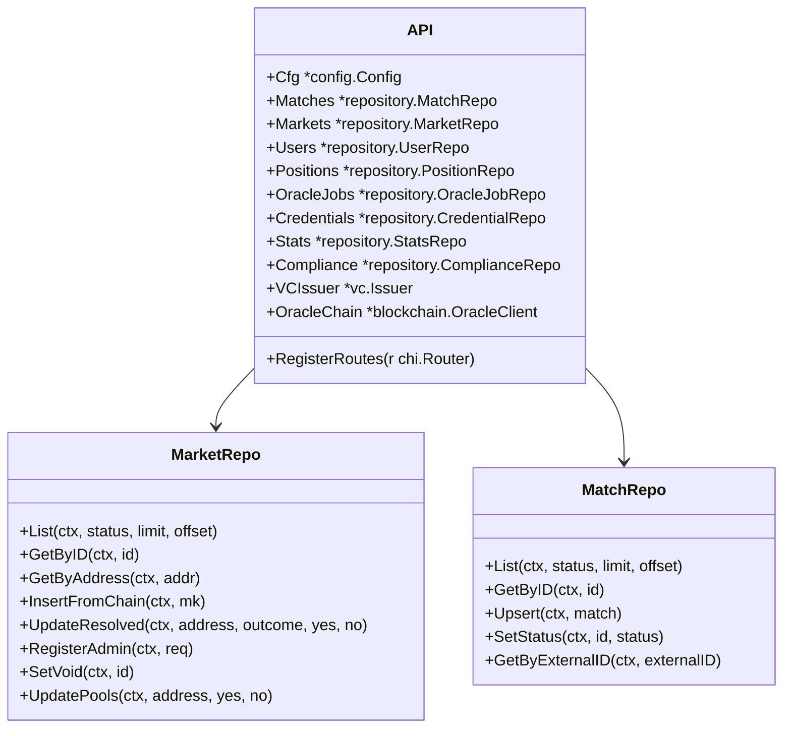
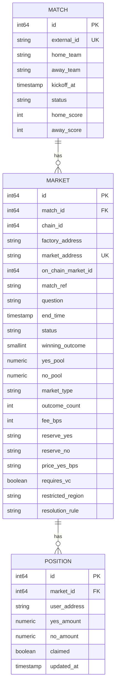
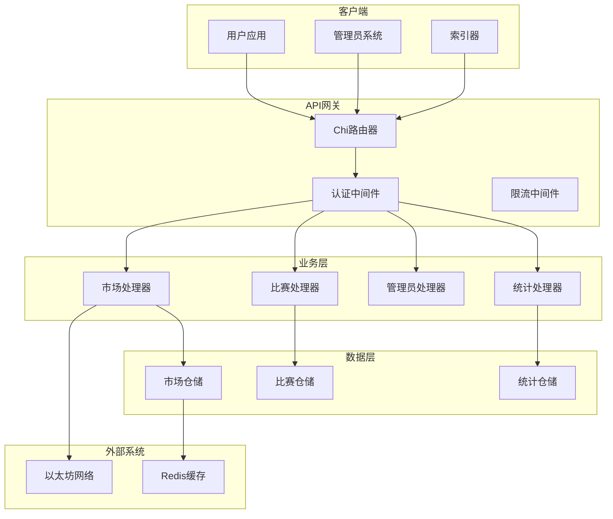
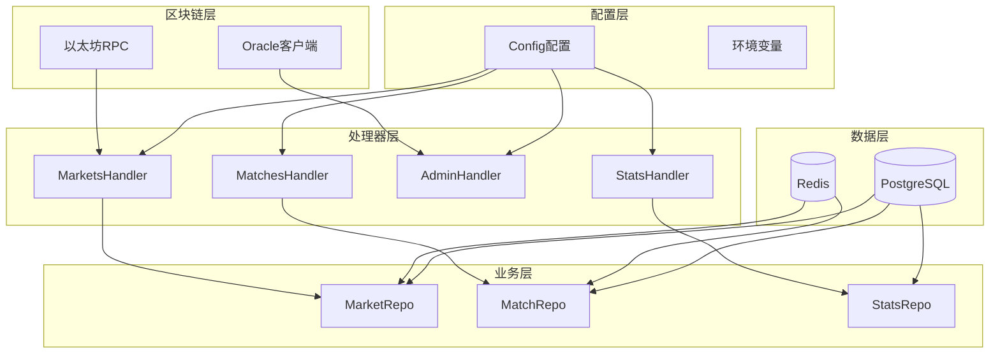
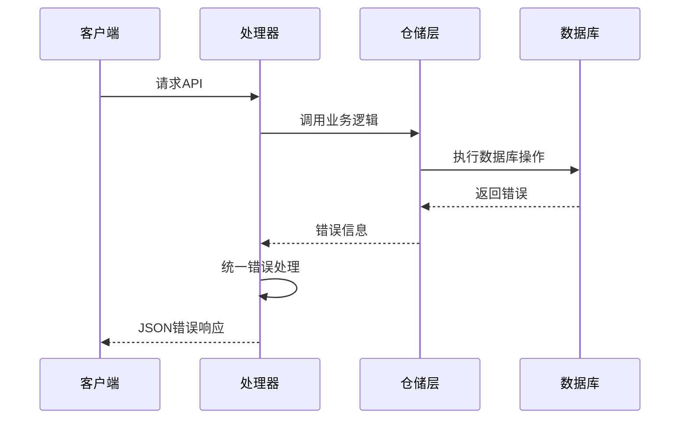

# 市场管理API接口

<cite>
**本文档引用的文件**
- [api.go](file://internal/handler/api.go)
- [markets.go](file://internal/handler/markets.go)
- [matches.go](file://internal/handler/matches.go)
- [admin.go](file://internal/handler/admin.go)
- [stats.go](file://internal/handler/stats.go)
- [events.go](file://internal/handler/events.go)
- [compliance.go](file://internal/handler/compliance.go)
- [market.go](file://internal/repository/market.go)
- [match.go](file://internal/repository/match.go)
- [stats.go](file://internal/repository/stats.go)
- [models.go](file://internal/models/models.go)
- [config.go](file://internal/config/config.go)
- [main.go](file://cmd/api/main.go)
- [000002_phase1.up.sql](file://migrations/000002_phase1.up.sql)
</cite>

## 目录
1. [简介](#简介)
2. [项目结构](#项目结构)
3. [核心组件](#核心组件)
4. [架构概览](#架构概览)
5. [详细组件分析](#详细组件分析)
6. [依赖关系分析](#依赖关系分析)
7. [性能考虑](#性能考虑)
8. [故障排除指南](#故障排除指南)
9. [结论](#结论)

## 简介

PredictionDIDSimple项目是一个基于区块链的预测市场平台，提供了完整的市场管理API接口。该系统支持二元和多结果预测市场，包含市场创建、查询、交易、结算等核心功能。系统采用Go语言开发，使用PostgreSQL作为数据存储，Redis进行缓存，通过以太坊RPC与智能合约交互。

## 项目结构

系统采用分层架构设计，主要分为以下层次：

**图表来源**
- [api.go:33-69](file://internal/handler/api.go#L33-L69)
- [main.go:124-131](file://cmd/api/main.go#L124-L131)

**章节来源**
- [api.go:18-31](file://internal/handler/api.go#L18-L31)
- [main.go:26-50](file://cmd/api/main.go#L26-L50)

## 核心组件

### API处理器聚合器

API处理器聚合器负责管理所有依赖项和服务，包括配置、数据库连接、区块链客户端等。

**图表来源**
- [api.go:18-31](file://internal/handler/api.go#L18-L31)
- [market.go:15-23](file://internal/repository/market.go#L15-L23)
- [match.go:15-23](file://internal/repository/match.go#L15-L23)

### 数据模型

系统定义了三个核心数据模型：比赛、市场和持仓。

**图表来源**
- [models.go:6-63](file://internal/models/models.go#L6-L63)
- [000002_phase1.up.sql:22-65](file://migrations/000002_phase1.up.sql#L22-L65)

**章节来源**
- [models.go:18-43](file://internal/models/models.go#L18-L43)
- [000002_phase1.up.sql:22-38](file://migrations/000002_phase1.up.sql#L22-L38)

## 架构概览

系统采用RESTful API设计，支持多种认证方式和权限控制。

**图表来源**
- [api.go:33-69](file://internal/handler/api.go#L33-L69)
- [main.go:88-110](file://cmd/api/main.go#L88-L110)

## 详细组件分析

### 市场管理API

#### 市场列表查询

市场列表查询接口支持分页和状态过滤，返回市场基本信息和链上合约地址。

**请求参数**
- status: 市场状态过滤器（OPEN/RESOLVED/VOID）
- limit: 每页记录数，默认20
- offset: 偏移量，默认0

**响应数据**
- items: 市场列表数组
- collateral_address: 抵押代币合约地址
- chain_id: 区块链ID

**章节来源**
- [markets.go:10-27](file://internal/handler/markets.go#L10-L27)
- [market.go:25-73](file://internal/repository/market.go#L25-L73)

#### 单个市场详情

市场详情接口返回完整的市场信息，包括关联的比赛数据和访问控制信息。

**响应数据**
- market: 市场完整信息
- collateral_address: 抵押代币合约地址
- chain_id: 区块链ID
- access: 访问控制信息
  - allowed: 是否允许访问
  - requires_vc: 是否需要VC
  - credential_type: 凭证类型

**章节来源**
- [markets.go:29-59](file://internal/handler/markets.go#L29-L59)
- [market.go:75-92](file://internal/repository/market.go#L75-L92)

#### 市场资金池查询

资金池查询接口提供市场流动性信息，用于前端展示价格曲线。

**响应数据**
- market_id: 市场ID
- market_type: 市场类型（binary/multi）
- reserve_yes: YES资金池储备
- reserve_no: NO资金池储备
- price_yes_bps: YES价格（基点）
- fee_bps: 手续费基点
- outcome_count: 结果数量

**章节来源**
- [stats.go:19-40](file://internal/handler/stats.go#L19-L40)
- [market.go:190-197](file://internal/repository/market.go#L190-L197)

#### 市场订单簿查询

订单簿接口基于CPMM模型生成合成盘口数据，提供买卖盘深度信息。

**响应数据**
- bids: 买入盘数据
  - side: 交易方向（yes/no）
  - price_bps: 价格（基点）
  - depth: 深度（储备金或资金池）
- note: 接口说明

**章节来源**
- [stats.go:42-66](file://internal/handler/stats.go#L42-L66)
- [stats.go:68-87](file://internal/handler/stats.go#L68-L87)

### 比赛管理API

#### 比赛列表查询

比赛列表查询支持状态过滤和分页，返回比赛基本信息。

**请求参数**
- status: 比赛状态过滤器
- limit: 每页记录数，默认20
- offset: 偏移量，默认0

**响应数据**
- items: 比赛列表数组

**章节来源**
- [matches.go:8-19](file://internal/handler/matches.go#L8-L19)
- [match.go:25-63](file://internal/repository/match.go#L25-L63)

#### 单个比赛详情

比赛详情接口返回比赛信息及其关联的所有市场列表。

**响应数据**
- match: 比赛完整信息
- markets: 关联的市场列表

**章节来源**
- [matches.go:21-43](file://internal/handler/matches.go#L21-L43)
- [match.go:65-76](file://internal/repository/match.go#L65-L76)

### 管理员API

#### 市场注册

管理员可以注册新的预测市场，设置市场参数和访问控制。

**请求体参数**
- match_id: 关联比赛ID
- market_address: 市场合约地址
- question: 预测问题
- requires_vc: 是否需要VC
- restricted_region: 限制地区
- resolution_rule: 结算规则

**响应数据**
- status: 注册状态

**章节来源**
- [admin.go:63-93](file://internal/handler/admin.go#L63-L93)
- [market.go:159-182](file://internal/repository/market.go#L159-L182)

#### 市场作废

管理员可以将市场标记为作废状态，并更新关联比赛状态。

**请求参数**
- id: 市场ID

**响应数据**
- status: 作废状态

**章节来源**
- [admin.go:30-61](file://internal/handler/admin.go#L30-L61)
- [market.go:184-188](file://internal/repository/market.go#L184-L188)

#### Oracle任务管理

管理员可以查看、重试Oracle任务，处理链上事件同步问题。

**响应数据**
- items: Oracle任务列表

**章节来源**
- [admin.go:12-23](file://internal/handler/admin.go#L12-L23)
- [admin.go:95-109](file://internal/handler/admin.go#L95-L109)

### 平台统计API

#### 平台统计数据

返回平台级关键指标，包括交易量、活跃用户、开放市场等。

**响应数据**
- trade_count: 总交易次数
- trade_volume: 总交易额
- fees_collected: 已收取手续费
- active_users: 活跃用户数
- open_markets: 开放市场数量
- tvl_approx: 总锁仓量

**章节来源**
- [stats.go:9-17](file://internal/handler/stats.go#L9-L17)
- [stats.go:34-53](file://internal/repository/stats.go#L34-L53)

### 实时事件API

#### 比赛比分推送

通过Server-Sent Events实时推送比赛状态更新。

**响应数据**
- items: 最新比赛列表
- ts: 推送时间戳

**章节来源**
- [events.go:12-46](file://internal/handler/events.go#L12-L46)
- [match.go:25-63](file://internal/repository/match.go#L25-L63)

### 合规检查API

#### 地理位置限制检查

根据客户端IP地理位置判断是否需要合规限制。

**响应数据**
- country: 国家代码
- restricted: 是否受限
- compliance_required: 是否要求合规
- environment: 运行环境

**章节来源**
- [compliance.go:9-29](file://internal/handler/compliance.go#L9-L29)
- [config.go:107-117](file://internal/config/config.go#L107-L117)

## 依赖关系分析

系统采用依赖注入模式，所有处理器都通过API聚合器统一管理。

**图表来源**
- [api.go:18-31](file://internal/handler/api.go#L18-L31)
- [main.go:124-131](file://cmd/api/main.go#L124-L131)

**章节来源**
- [api.go:18-31](file://internal/handler/api.go#L18-L31)
- [main.go:124-131](file://cmd/api/main.go#L124-L131)

## 性能考虑

### 数据库优化

系统通过索引优化查询性能：
- markets表的match_id和status索引
- trades表的unique约束确保数据完整性
- positions表的唯一约束防止重复持仓

### 缓存策略

- Redis用于存储临时数据和会话信息
- 支持降级运行模式，即使Redis不可用也能正常工作
- 缓存配置可通过环境变量调整

### 并发处理

- 使用goroutine处理索引器和Oracle客户端
- HTTP服务器支持并发请求处理
- 数据库连接池自动管理连接复用

## 故障排除指南

### 常见错误处理

系统实现了统一的错误响应格式：

**图表来源**
- [api.go:78-81](file://internal/handler/api.go#L78-L81)

### 健康检查

系统提供完整的健康检查接口：

- `/health`: 基本存活检查
- `/ready`: 就绪状态检查，包含数据库、Redis、RPC状态

**章节来源**
- [health.go:13-77](file://internal/handler/health.go#L13-L77)

### 日志监控

- 使用标准库log记录关键事件
- 支持不同环境级别的日志输出
- Redis连接失败仅记录警告，不影响主业务

## 结论

PredictionDIDSimple项目提供了完整的预测市场管理API解决方案，具有以下特点：

1. **模块化设计**: 采用清晰的分层架构，职责分离明确
2. **扩展性强**: 支持二元和多结果市场，易于扩展新功能
3. **安全性高**: 多层认证机制，支持VC门控和地理限制
4. **可观测性好**: 完整的健康检查、指标收集和日志记录
5. **性能优化**: 数据库索引、缓存策略和并发处理

该API接口文档为开发者提供了完整的市场管理功能说明，包括市场生命周期管理、交易操作、结算流程等核心功能的详细接口规范。通过遵循本文档的接口约定，开发者可以快速集成和扩展预测市场功能。