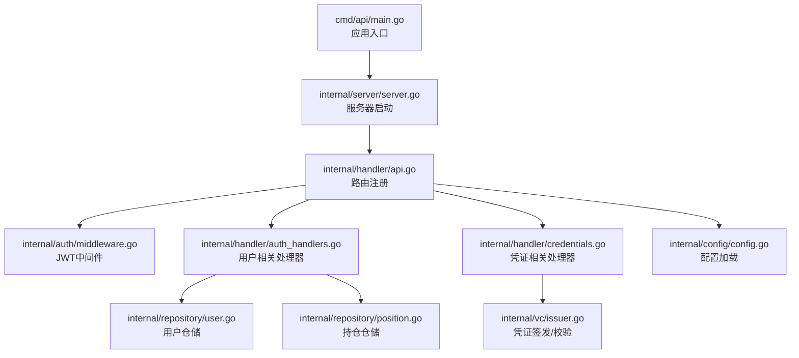
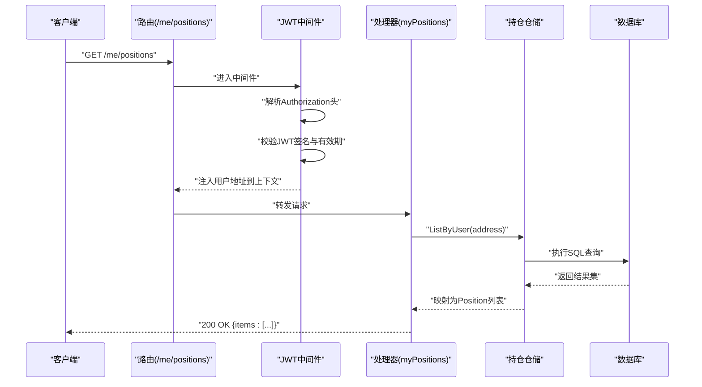
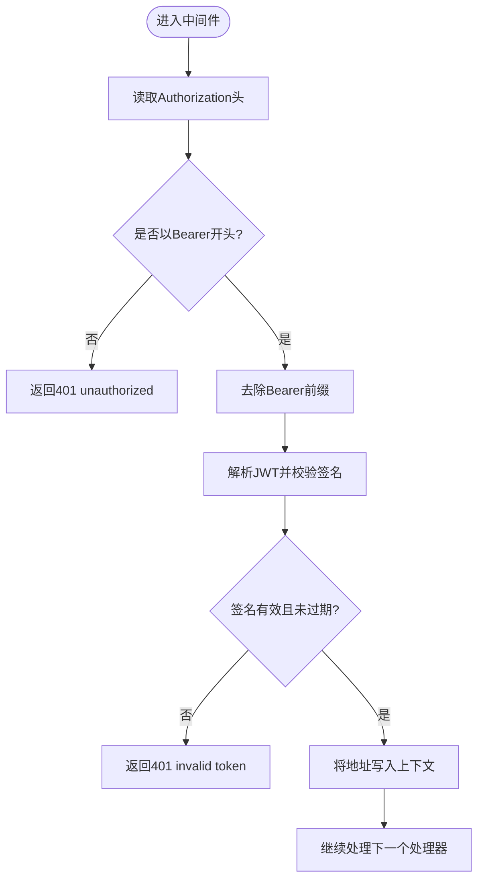
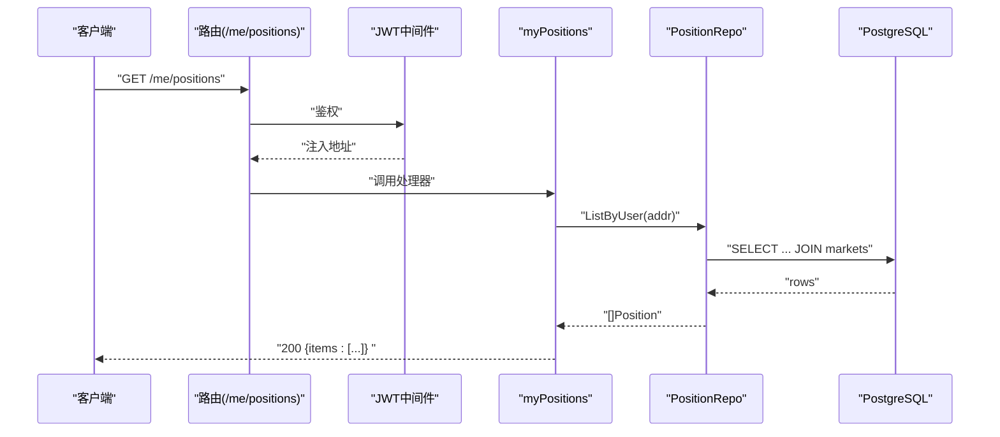
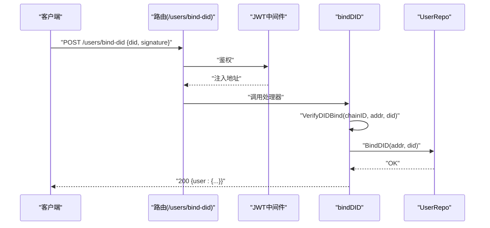
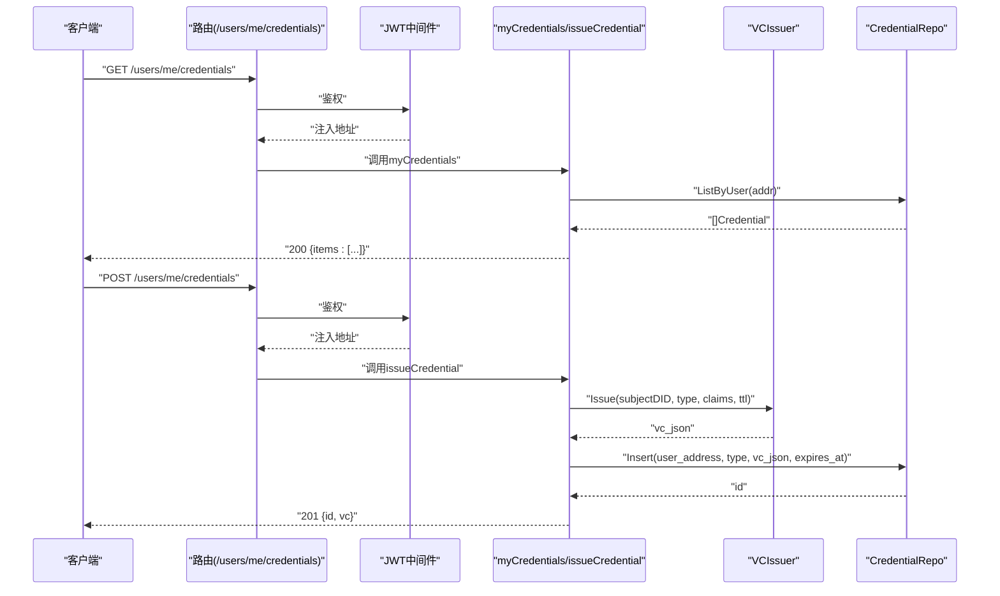
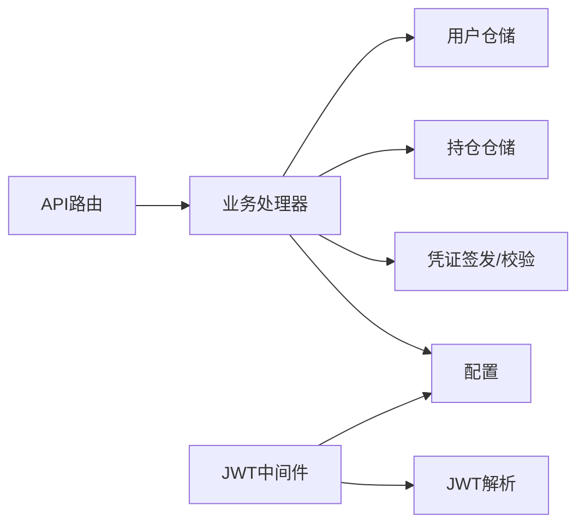

# 用户API

<cite>
**本文档引用的文件**
- [cmd/api/main.go](file://cmd/api/main.go)
- [internal/handler/api.go](file://internal/handler/api.go)
- [internal/handler/auth_handlers.go](file://internal/handler/auth_handlers.go)
- [internal/handler/credentials.go](file://internal/handler/credentials.go)
- [internal/auth/middleware.go](file://internal/auth/middleware.go)
- [internal/auth/jwt.go](file://internal/auth/jwt.go)
- [internal/auth/siwe.go](file://internal/auth/siwe.go)
- [internal/models/models.go](file://internal/models/models.go)
- [internal/repository/user.go](file://internal/repository/user.go)
- [internal/repository/position.go](file://internal/repository/position.go)
- [internal/config/config.go](file://internal/config/config.go)
- [internal/vc/issuer.go](file://internal/vc/issuer.go)
- [migrations/000003_phase2.up.sql](file://migrations/000003_phase2.up.sql)
</cite>

## 目录
1. [简介](#简介)
2. [项目结构](#项目结构)
3. [核心组件](#核心组件)
4. [架构总览](#架构总览)
5. [详细组件分析](#详细组件分析)
6. [依赖关系分析](#依赖关系分析)
7. [性能考虑](#性能考虑)
8. [故障排除指南](#故障排除指南)
9. [结论](#结论)
10. [附录](#附录)

## 简介
本文件为用户相关API的权威技术文档，覆盖以下需要认证用户访问的端点：
- 用户持仓查询：/me/positions
- DID绑定：/users/bind-did
- 用户凭证管理：/users/me/credentials

文档内容包括：
- 认证与授权机制（JWT中间件、权限检查）
- 请求参数、响应格式与业务逻辑
- 用户数据模型（持仓、DID格式、凭证类型）
- 使用示例与常见问题解答

## 项目结构
后端采用分层架构，入口在命令行程序中初始化服务与依赖，路由注册在处理器模块中完成，认证中间件与业务处理分离。

图表来源
- [cmd/api/main.go](file://cmd/api/main.go#L91-L98)
- [internal/handler/api.go](file://internal/handler/api.go#L30-L61)
- [internal/auth/middleware.go](file://internal/auth/middleware.go#L13-L31)
- [internal/handler/auth_handlers.go](file://internal/handler/auth_handlers.go#L16-L78)
- [internal/handler/credentials.go](file://internal/handler/credentials.go#L21-L96)
- [internal/repository/user.go](file://internal/repository/user.go#L19-L49)
- [internal/repository/position.go](file://internal/repository/position.go#L45-L84)
- [internal/vc/issuer.go](file://internal/vc/issuer.go#L28-L100)
- [internal/config/config.go](file://internal/config/config.go#L45-L96)

章节来源
- [cmd/api/main.go](file://cmd/api/main.go#L24-L117)
- [internal/handler/api.go](file://internal/handler/api.go#L30-L61)

## 核心组件
- 路由与控制器
  - 路由注册集中于处理器模块，认证保护通过中间件组包裹。
  - 用户相关端点位于受保护路由组内，使用JWT中间件进行鉴权。
- 认证中间件
  - 解析Authorization头中的Bearer Token，校验签名与有效期，将用户地址写入上下文。
- 数据模型
  - 用户、市场、持仓等模型定义清晰，便于前后端契约一致。
- 仓储层
  - 用户仓储支持按地址插入或更新、绑定DID、查询。
  - 持仓仓储支持按用户查询持仓列表，并关联市场信息。
- 凭证服务
  - 凭证签发与校验，支持TTL控制与区域限制。

章节来源
- [internal/handler/api.go](file://internal/handler/api.go#L16-L28)
- [internal/auth/middleware.go](file://internal/auth/middleware.go#L13-L31)
- [internal/models/models.go](file://internal/models/models.go#L53-L57)
- [internal/repository/user.go](file://internal/repository/user.go#L19-L49)
- [internal/repository/position.go](file://internal/repository/position.go#L45-L84)
- [internal/vc/issuer.go](file://internal/vc/issuer.go#L28-L100)

## 架构总览
下图展示用户API调用链路与组件交互：

图表来源
- [internal/handler/api.go](file://internal/handler/api.go#L46-L51)
- [internal/auth/middleware.go](file://internal/auth/middleware.go#L13-L31)
- [internal/handler/auth_handlers.go](file://internal/handler/auth_handlers.go#L70-L78)
- [internal/repository/position.go](file://internal/repository/position.go#L45-L84)

## 详细组件分析

### JWT中间件机制
- 功能
  - 从请求头提取Bearer Token，校验签名方法与密钥，验证过期时间。
  - 将用户地址写入请求上下文，供后续处理器读取。
- 关键流程
  - 头部格式校验、Token解析、Claims提取、上下文注入。
- 会话管理
  - 基于短期JWT令牌；前端需在每次请求携带Authorization头。

图表来源
- [internal/auth/middleware.go](file://internal/auth/middleware.go#L13-L31)
- [internal/auth/jwt.go](file://internal/auth/jwt.go#L28-L43)

章节来源
- [internal/auth/middleware.go](file://internal/auth/middleware.go#L13-L31)
- [internal/auth/jwt.go](file://internal/auth/jwt.go#L16-L43)

### 用户持仓查询 /me/positions
- 认证要求
  - 需要有效的Bearer JWT令牌。
- 请求参数
  - 无路径/查询参数。
- 响应格式
  - 返回包含items数组的对象，数组元素为Position对象。
- 业务逻辑
  - 从上下文中取出用户地址，查询该用户的持仓列表，并关联市场信息。
- 错误处理
  - 数据库查询失败返回500。

图表来源
- [internal/handler/api.go](file://internal/handler/api.go#L46-L51)
- [internal/handler/auth_handlers.go](file://internal/handler/auth_handlers.go#L70-L78)
- [internal/repository/position.go](file://internal/repository/position.go#L45-L84)

章节来源
- [internal/handler/api.go](file://internal/handler/api.go#L46-L51)
- [internal/handler/auth_handlers.go](file://internal/handler/auth_handlers.go#L70-L78)
- [internal/repository/position.go](file://internal/repository/position.go#L45-L84)

### DID绑定 /users/bind-did
- 认证要求
  - 需要有效的Bearer JWT令牌。
- 请求参数
  - JSON体包含did与signature字段。
- 响应格式
  - 返回当前用户对象（含did字段）。
- 业务逻辑
  - 校验DID格式是否符合预期（基于链ID与地址）。
  - 将DID写入用户记录。
- 错误处理
  - 参数无效返回400；签名校验失败返回400；数据库错误返回500。

图表来源
- [internal/handler/api.go](file://internal/handler/api.go#L46-L51)
- [internal/handler/auth_handlers.go](file://internal/handler/auth_handlers.go#L51-L68)
- [internal/auth/siwe.go](file://internal/auth/siwe.go#L48-L56)
- [internal/repository/user.go](file://internal/repository/user.go#L33-L38)

章节来源
- [internal/handler/api.go](file://internal/handler/api.go#L46-L51)
- [internal/handler/auth_handlers.go](file://internal/handler/auth_handlers.go#L51-L68)
- [internal/auth/siwe.go](file://internal/auth/siwe.go#L48-L56)
- [internal/repository/user.go](file://internal/repository/user.go#L33-L38)

### 用户凭证管理 /users/me/credentials
- 认证要求
  - 需要有效的Bearer JWT令牌。
- 请求参数
  - GET：无参数。
  - POST：JSON体包含address、credential_type、claims、ttl_hours。
- 响应格式
  - GET：返回包含items数组的对象，数组元素为凭证记录。
  - POST：返回新创建凭证的id与vc原始JSON。
- 业务逻辑
  - GET：按用户地址查询其凭证列表。
  - POST：根据address生成DID（若已绑定则使用已有DID），签发凭证并持久化。
- 错误处理
  - 参数缺失返回400；签发/存储失败返回500。

图表来源
- [internal/handler/api.go](file://internal/handler/api.go#L46-L51)
- [internal/handler/credentials.go](file://internal/handler/credentials.go#L21-L96)
- [internal/vc/issuer.go](file://internal/vc/issuer.go#L28-L66)

章节来源
- [internal/handler/api.go](file://internal/handler/api.go#L46-L51)
- [internal/handler/credentials.go](file://internal/handler/credentials.go#L21-L96)
- [internal/vc/issuer.go](file://internal/vc/issuer.go#L28-L100)

### 用户数据模型
- 用户(User)
  - 字段：id、address、did（可选）。
- 持仓(Position)
  - 字段：id、market_id、user_address、yes_amount、no_amount、claimed、updated_at、market（关联）。
- 市场(Market)
  - 字段：id、match_id、chain_id、factory_address、market_address、on_chain_market_id、match_ref、question、end_time、status、winning_outcome、yes_pool、no_pool、market_type、outcome_count、fee_bps、reserve_yes、reserve_no、price_yes_bps、requires_vc、restricted_region、resolution_rule、match（关联）。
- 凭证(Credential)
  - 表结构：id、user_address、credential_type、vc_json、expires_at、revoked、created_at。
  - 索引：对user_address使用LOWER函数建立索引。

章节来源
- [internal/models/models.go](file://internal/models/models.go#L53-L57)
- [internal/models/models.go](file://internal/models/models.go#L42-L51)
- [internal/models/models.go](file://internal/models/models.go#L16-L40)
- [migrations/000003_phase2.up.sql](file://migrations/000003_phase2.up.sql#L28-L39)

### 认证与会话管理
- JWT签发
  - 使用对称密钥（配置项）签发，包含address与标准声明，有效期默认24小时。
- JWT解析
  - 校验签名算法与密钥，验证过期时间，提取address。
- SIWE登录
  - 客户端使用钱包签名消息，服务端校验域、URI、过期时间与签名，成功后签发JWT。
- DID绑定
  - 服务端校验DID格式（did:pkh:eip155:{chainId}:{address}），MVP阶段信任JWT提供的用户身份。

章节来源
- [internal/auth/jwt.go](file://internal/auth/jwt.go#L16-L43)
- [internal/auth/siwe.go](file://internal/auth/siwe.go#L17-L46)
- [internal/handler/auth_handlers.go](file://internal/handler/auth_handlers.go#L16-L44)
- [internal/auth/siwe.go](file://internal/auth/siwe.go#L48-L56)

## 依赖关系分析
- 组件耦合
  - 路由器仅依赖处理器；处理器依赖仓储与凭证服务；仓储依赖数据库连接池。
- 中间件依赖
  - JWT中间件依赖配置中的密钥与JWT解析工具。
- 外部依赖
  - SIWE库用于消息解析与签名验证；凭证签发依赖HMAC-SHA256签名。

图表来源
- [internal/handler/api.go](file://internal/handler/api.go#L30-L61)
- [internal/auth/middleware.go](file://internal/auth/middleware.go#L13-L31)
- [internal/auth/jwt.go](file://internal/auth/jwt.go#L28-L43)
- [internal/config/config.go](file://internal/config/config.go#L52-L76)

章节来源
- [internal/handler/api.go](file://internal/handler/api.go#L30-L61)
- [internal/auth/middleware.go](file://internal/auth/middleware.go#L13-L31)
- [internal/auth/jwt.go](file://internal/auth/jwt.go#L28-L43)
- [internal/config/config.go](file://internal/config/config.go#L52-L76)

## 性能考虑
- 连接池与并发
  - 数据库使用连接池，建议合理设置最大连接数与超时。
- 查询优化
  - 持仓查询涉及多表联结，确保对user_address与updated_at等字段建立合适索引。
- 缓存策略
  - 可结合Redis缓存热点数据（如用户凭证列表），降低数据库压力。
- 中间件开销
  - JWT解析与校验为轻量操作，通常不构成瓶颈。

## 故障排除指南
- 401 未授权
  - 检查Authorization头格式是否为Bearer Token；确认JWT密钥正确；检查是否过期。
- 400 参数错误
  - DID绑定请求体缺少did或signature；凭证签发缺少address或credential_type。
- 403 区域限制
  - 凭证校验时指定region，若凭证主体region不匹配将拒绝。
- 500 内部错误
  - 数据库写入失败（如DID绑定、凭证存储）；JWT签发失败。

章节来源
- [internal/auth/middleware.go](file://internal/auth/middleware.go#L16-L28)
- [internal/handler/auth_handlers.go](file://internal/handler/auth_handlers.go#L51-L68)
- [internal/handler/credentials.go](file://internal/handler/credentials.go#L78-L96)

## 结论
本文档系统性地梳理了用户相关API的认证机制、端点行为与数据模型。通过JWT中间件保障会话安全，结合仓储与凭证服务实现用户持仓查询、DID绑定与凭证管理功能。建议在生产环境强化安全配置（如HTTPS、密钥轮换、速率限制）并持续监控性能指标。

## 附录

### 使用示例（步骤说明）
- 获取JWT
  - 使用钱包对SIWE消息进行签名，向登录端点提交消息与签名，获得token与用户信息。
- 查询持仓
  - 在请求头添加Authorization: Bearer <token>，访问/ me/positions获取持仓列表。
- 绑定DID
  - 在请求体提供did与signature，访问/users/bind-did完成绑定。
- 查看凭证
  - 访问/users/me/credentials获取凭证列表。
- 签发凭证（管理员）
  - 提交address、credential_type、claims、ttl_hours，获得凭证ID与原始JSON。

章节来源
- [internal/handler/auth_handlers.go](file://internal/handler/auth_handlers.go#L16-L44)
- [internal/handler/auth_handlers.go](file://internal/handler/auth_handlers.go#L70-L78)
- [internal/handler/auth_handlers.go](file://internal/handler/auth_handlers.go#L51-L68)
- [internal/handler/credentials.go](file://internal/handler/credentials.go#L21-L96)