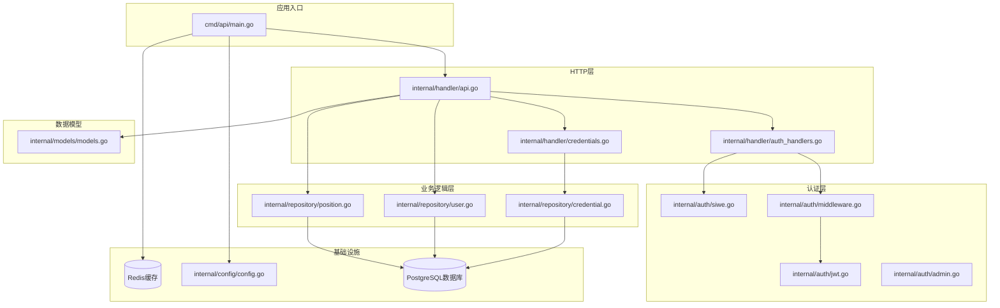
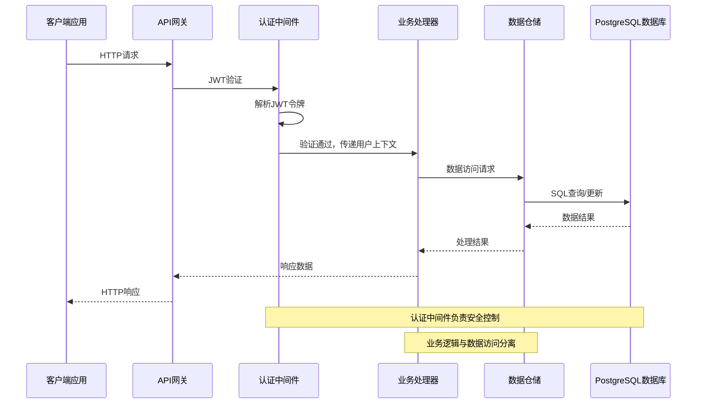
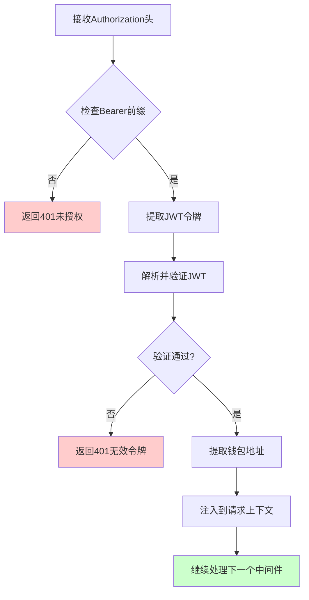
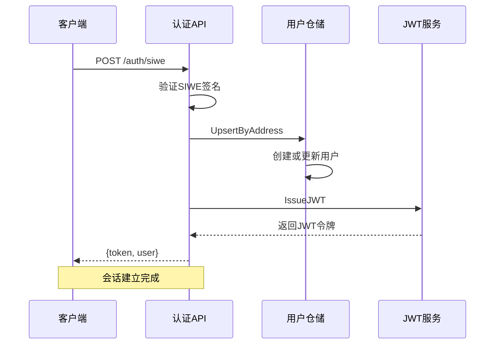
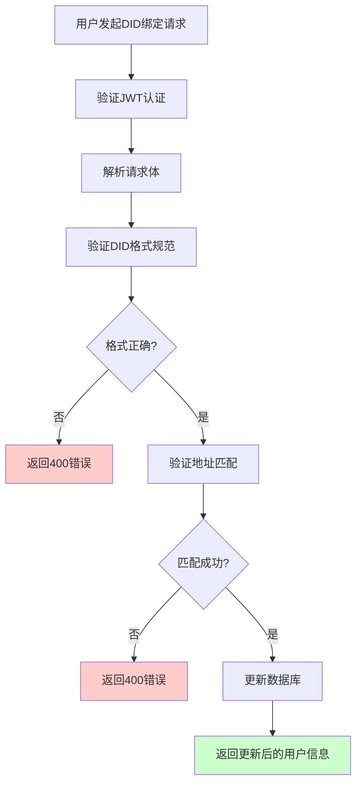
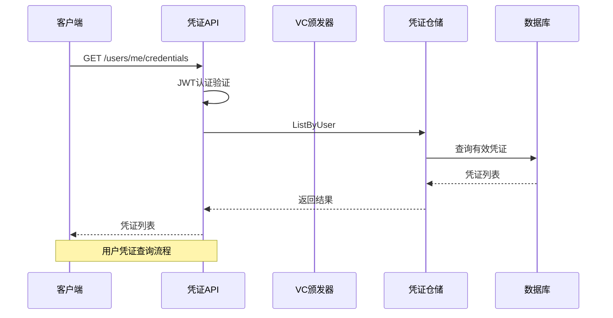
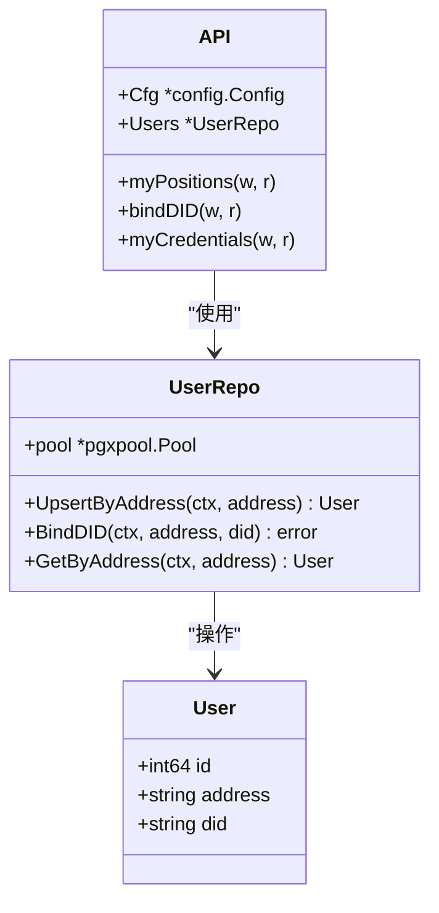
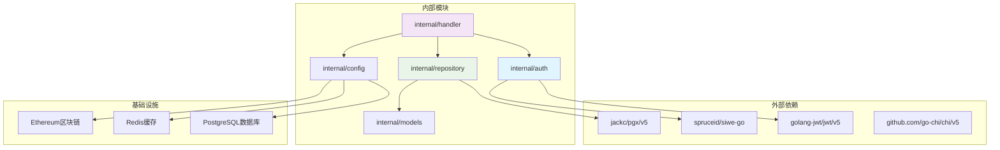

# 用户管理API接口

<cite>
**本文档引用的文件**
- [main.go](file://cmd/api/main.go)
- [api.go](file://internal/handler/api.go)
- [middleware.go](file://internal/auth/middleware.go)
- [jwt.go](file://internal/auth/jwt.go)
- [siwe.go](file://internal/auth/siwe.go)
- [user.go](file://internal/repository/user.go)
- [position.go](file://internal/repository/position.go)
- [credentials.go](file://internal/handler/credentials.go)
- [credential.go](file://internal/repository/credential.go)
- [models.go](file://internal/models/models.go)
- [config.go](file://internal/config/config.go)
- [DIDRegistry.json](file://pkg/contracts/DIDRegistry.json)
</cite>

## 目录
1. [简介](#简介)
2. [项目结构](#项目结构)
3. [核心组件](#核心组件)
4. [架构概览](#架构概览)
5. [详细组件分析](#详细组件分析)
6. [依赖关系分析](#依赖关系分析)
7. [性能考虑](#性能考虑)
8. [故障排除指南](#故障排除指南)
9. [结论](#结论)

## 简介

PredictionDIDSimple是一个基于以太坊的预测市场平台，集成了去中心化身份(DID)管理和可验证凭证(VCs)系统。本文档详细说明了用户管理API接口，包括JWT认证机制、用户会话管理、DID绑定流程以及可验证凭证的查询和管理。

该系统采用现代化的微服务架构，使用Go语言开发，结合PostgreSQL数据库、Redis缓存和以太坊区块链技术，为用户提供安全可靠的预测市场参与体验。

## 项目结构

PredictionDIDSimple后端采用清晰的分层架构设计：

**图表来源**
- [main.go:1-161](file://cmd/api/main.go#L1-L161)
- [api.go:1-100](file://internal/handler/api.go#L1-L100)

**章节来源**
- [main.go:1-161](file://cmd/api/main.go#L1-L161)
- [api.go:1-100](file://internal/handler/api.go#L1-L100)

## 核心组件

### JWT认证系统

JWT(JSON Web Token)认证系统是整个用户管理API的核心安全机制：

- **令牌结构**: 包含钱包地址和标准注册声明(过期时间、签发时间)
- **签名算法**: HS256对称加密
- **有效期**: 默认24小时
- **密钥管理**: 通过环境变量配置

### 用户仓储层

用户仓储提供了完整的用户数据持久化能力：

- **UpsertByAddress**: 通过钱包地址创建或更新用户记录
- **BindDID**: 为用户绑定去中心化身份标识
- **GetByAddress**: 通过钱包地址查询用户信息

### 持仓管理

持仓管理系统支持用户在预测市场中的投资组合管理：

- **ListByUser**: 查询用户所有持仓记录
- **AddTrade**: 添加交易记录并更新用户持仓
- **SetClaimed**: 设置用户持仓为已领取状态

### 可验证凭证管理

VC管理系统提供完整的凭证生命周期管理：

- **Issue**: 颁发新的可验证凭证
- **ListByUser**: 查询用户有效凭证
- **Verify**: 验证凭证有效性

**章节来源**
- [jwt.go:13-58](file://internal/auth/jwt.go#L13-L58)
- [user.go:25-71](file://internal/repository/user.go#L25-L71)
- [position.go:66-133](file://internal/repository/position.go#L66-L133)
- [credential.go:34-83](file://internal/repository/credential.go#L34-L83)

## 架构概览

系统采用分层架构设计，确保关注点分离和代码可维护性：

**图表来源**
- [middleware.go:17-43](file://internal/auth/middleware.go#L17-L43)
- [api.go:33-69](file://internal/handler/api.go#L33-L69)

## 详细组件分析

### JWT认证机制

JWT认证机制通过以下步骤实现：

**图表来源**
- [middleware.go:18-42](file://internal/auth/middleware.go#L18-L42)
- [jwt.go:36-57](file://internal/auth/jwt.go#L36-L57)

#### JWT令牌结构

| 字段 | 类型 | 描述 | 示例 |
|------|------|------|------|
| address | string | 用户钱包地址 | "0x742d35Cc6634C0532925a3b844Bc454e4438f44e" |
| exp | number | 过期时间戳 | 1700000000 |
| iat | number | 签发时间戳 | 1699964000 |

**章节来源**
- [jwt.go:13-34](file://internal/auth/jwt.go#L13-L34)
- [middleware.go:17-43](file://internal/auth/middleware.go#L17-L43)

### 用户会话管理

用户会话管理通过以下流程实现：

**图表来源**
- [auth_handlers.go:19-53](file://internal/handler/auth_handlers.go#L19-L53)
- [user.go:25-43](file://internal/repository/user.go#L25-L43)
- [jwt.go:19-34](file://internal/auth/jwt.go#L19-L34)

**章节来源**
- [auth_handlers.go:19-53](file://internal/handler/auth_handlers.go#L19-L53)
- [user.go:25-43](file://internal/repository/user.go#L25-L43)

### DID绑定流程

DID绑定流程确保用户身份的安全性和去中心化特性：

**图表来源**
- [auth_handlers.go:61-84](file://internal/handler/auth_handlers.go#L61-L84)
- [siwe.go:62-74](file://internal/auth/siwe.go#L62-L74)
- [user.go:45-55](file://internal/repository/user.go#L45-L55)

#### DID格式规范

DID必须遵循以下格式规范：
- **格式**: `did:pkh:eip155:{chainId}:{walletAddress}`
- **示例**: `did:pkh:eip155:1:0x742d35Cc6634C0532925a3b844Bc454e4438f44e`
- **验证**: 服务器端验证DID格式和链ID匹配

**章节来源**
- [auth_handlers.go:61-84](file://internal/handler/auth_handlers.go#L61-L84)
- [siwe.go:62-74](file://internal/auth/siwe.go#L62-L74)
- [user.go:45-55](file://internal/repository/user.go#L45-L55)

### 可验证凭证查询和管理

可验证凭证系统提供完整的凭证生命周期管理：

**图表来源**
- [credentials.go:73-82](file://internal/handler/credentials.go#L73-L82)
- [credential.go:45-67](file://internal/repository/credential.go#L45-L67)

#### 凭证类型和属性

| 属性 | 类型 | 描述 | 必填 |
|------|------|------|------|
| address | string | 用户钱包地址 | 是 |
| credential_type | string | 凭证类型标识 | 是 |
| claims | object | 自定义声明内容 | 否 |
| ttl_hours | number | 有效期(小时) | 否 |

**章节来源**
- [credentials.go:16-71](file://internal/handler/credentials.go#L16-L71)
- [credential.go:13-43](file://internal/repository/credential.go#L13-L43)

### 用户信息管理

用户信息管理提供基本的用户数据操作：

**图表来源**
- [models.go:57-62](file://internal/models/models.go#L57-L62)
- [user.go:13-23](file://internal/repository/user.go#L13-L23)
- [api.go:18-31](file://internal/handler/api.go#L18-L31)

**章节来源**
- [models.go:57-62](file://internal/models/models.go#L57-L62)
- [user.go:13-71](file://internal/repository/user.go#L13-L71)

## 依赖关系分析

系统采用模块化设计，各组件间依赖关系清晰：

**图表来源**
- [jwt.go:5-11](file://internal/auth/jwt.go#L5-L11)
- [siwe.go:11](file://internal/auth/siwe.go#L11)
- [user.go:9](file://internal/repository/user.go#L9)

**章节来源**
- [jwt.go:5-11](file://internal/auth/jwt.go#L5-L11)
- [siwe.go:11](file://internal/auth/siwe.go#L11)
- [user.go:9](file://internal/repository/user.go#L9)

## 性能考虑

### 缓存策略

系统采用多层缓存策略优化性能：

- **Redis缓存**: 用户会话和热点数据缓存
- **数据库连接池**: PostgreSQL连接复用
- **响应缓存**: 静态数据和查询结果缓存

### 数据库优化

- **索引设计**: 在常用查询字段上建立索引
- **批量操作**: 支持批量数据处理
- **连接池管理**: 动态调整连接池大小

### API性能优化

- **限流控制**: 基于IP的请求频率限制
- **压缩传输**: 启用Gzip压缩减少带宽
- **异步处理**: 非关键操作异步执行

## 故障排除指南

### 常见错误类型

| 错误代码 | 错误类型 | 可能原因 | 解决方案 |
|----------|----------|----------|----------|
| 401 | 未授权 | JWT令牌无效或过期 | 重新登录获取新令牌 |
| 403 | 禁止访问 | 管理员密钥错误 | 检查X-Admin-Key头部 |
| 400 | 请求错误 | 请求格式不正确 | 验证请求体格式 |
| 500 | 服务器错误 | 服务器内部异常 | 检查服务器日志 |

### 调试建议

1. **启用详细日志**: 设置日志级别为DEBUG
2. **监控指标**: 使用Prometheus指标监控系统状态
3. **健康检查**: 定期执行健康检查API
4. **错误追踪**: 实现统一的错误处理和追踪机制

**章节来源**
- [middleware.go:23-35](file://internal/auth/middleware.go#L23-L35)
- [admin.go:17-31](file://internal/auth/admin.go#L17-L31)

## 结论

PredictionDIDSimple的用户管理API接口设计体现了现代Web应用的最佳实践：

- **安全性**: 采用JWT认证和SIWE协议确保用户身份安全
- **可扩展性**: 模块化设计支持功能扩展和性能优化
- **可靠性**: 完善的错误处理和监控机制
- **用户体验**: 简洁的API设计和清晰的错误反馈

该系统为预测市场的用户管理提供了坚实的技术基础，支持去中心化身份和可验证凭证的完整生命周期管理，为构建可信的去中心化金融应用奠定了重要基础。