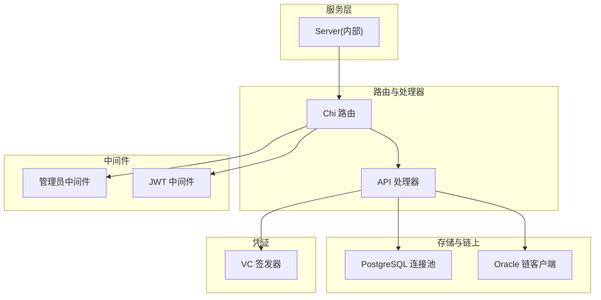
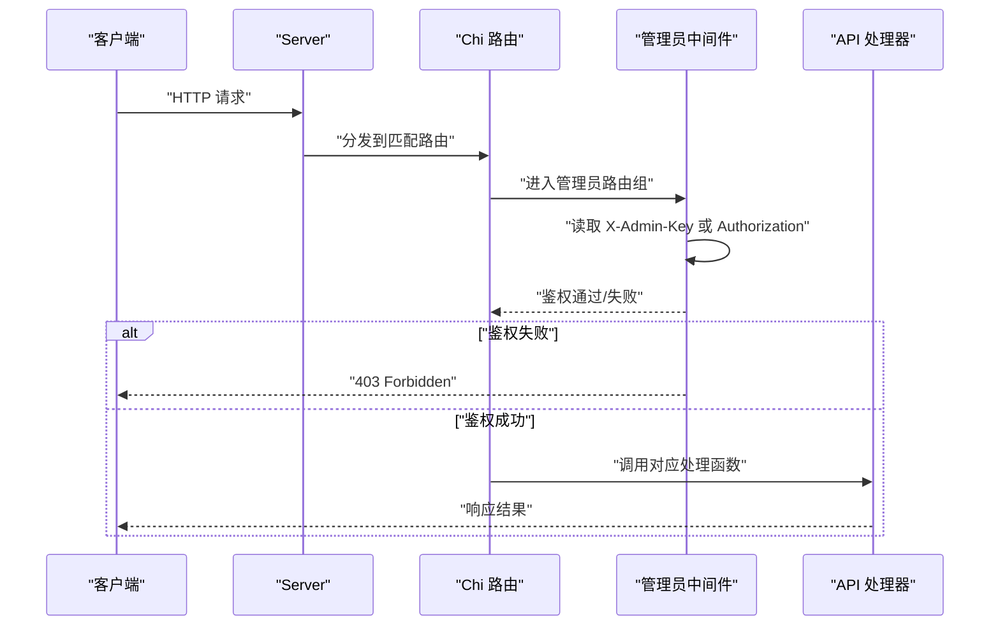
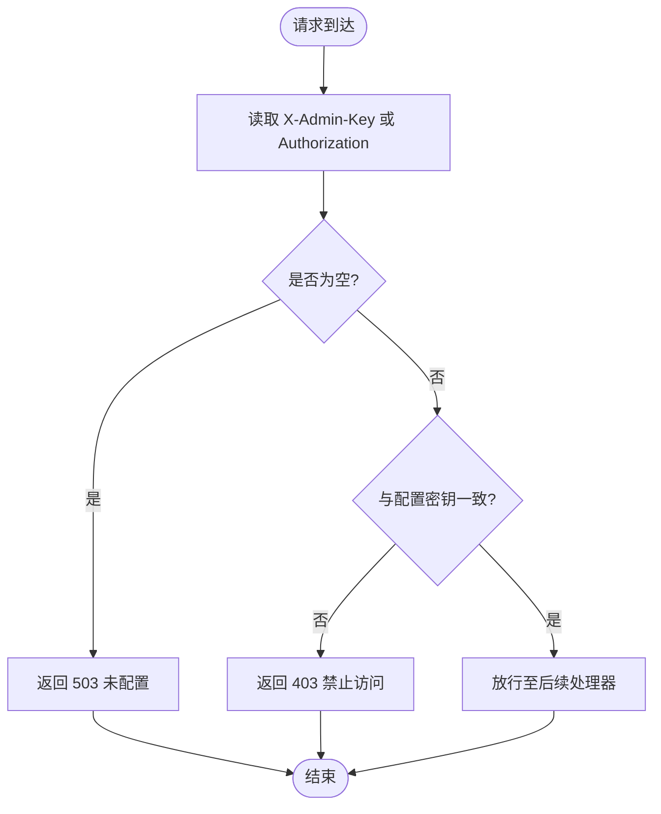
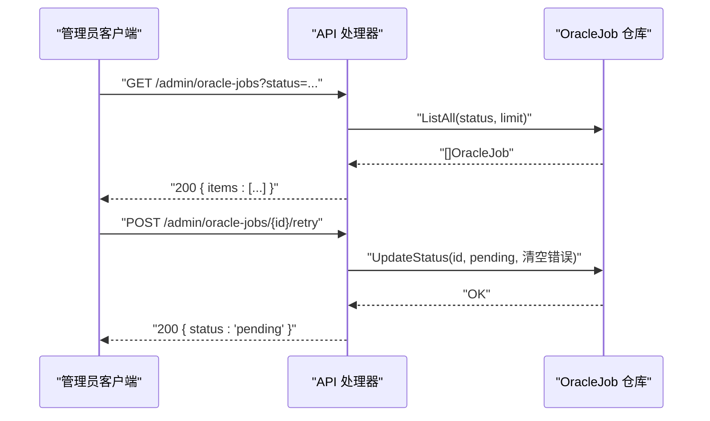
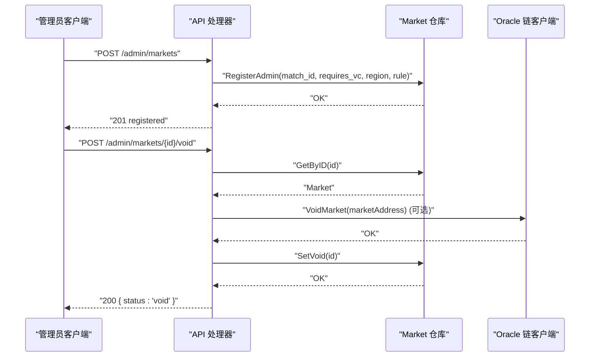
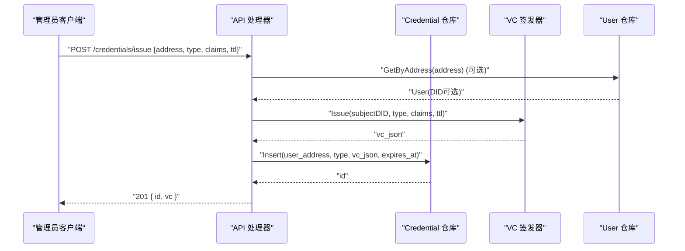
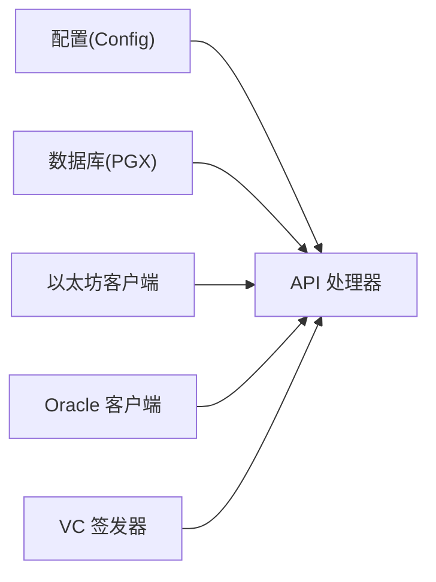

# 管理员API

<cite>
**本文引用的文件**
- [internal/handler/api.go](file://internal/handler/api.go)
- [internal/handler/admin.go](file://internal/handler/admin.go)
- [internal/handler/credentials.go](file://internal/handler/credentials.go)
- [internal/auth/admin.go](file://internal/auth/admin.go)
- [internal/auth/middleware.go](file://internal/auth/middleware.go)
- [internal/server/server.go](file://internal/server/server.go)
- [internal/config/config.go](file://internal/config/config.go)
- [internal/repository/oracle_job.go](file://internal/repository/oracle_job.go)
- [internal/repository/market.go](file://internal/repository/market.go)
- [internal/repository/credential.go](file://internal/repository/credential.go)
- [internal/vc/issuer.go](file://internal/vc/issuer.go)
- [cmd/api/main.go](file://cmd/api/main.go)
</cite>

## 目录
1. [简介](#简介)
2. [项目结构](#项目结构)
3. [核心组件](#核心组件)
4. [架构总览](#架构总览)
5. [详细组件分析](#详细组件分析)
6. [依赖关系分析](#依赖关系分析)
7. [性能考量](#性能考量)
8. [故障排除指南](#故障排除指南)
9. [结论](#结论)
10. [附录](#附录)

## 简介
本文件为管理员API的权威文档，覆盖以下内容：
- 需要管理员权限的API端点：预言机作业管理（/admin/oracle-jobs、/admin/oracle-jobs/{id}/retry）、市场管理（/admin/markets、/admin/markets/{id}/void）与凭证签发（/credentials/issue）
- 管理员认证机制：API密钥验证与权限控制
- 每个管理操作的业务逻辑、请求参数、返回结构与安全注意事项
- 管理界面使用建议与批量操作实践
- 系统维护与故障排除相关API与流程

## 项目结构
管理员API位于统一的HTTP路由体系中，通过中间件实现权限隔离：
- 路由注册集中在API处理器中，按“公开”“用户认证”“管理员”三组分组
- 管理员路由组使用独立的管理员中间件进行鉴权
- 服务器启动时装配数据库、链上客户端、凭证签发器等依赖

图表来源
- [internal/server/server.go](file://internal/server/server.go#L35-L84)
- [internal/handler/api.go](file://internal/handler/api.go#L30-L61)
- [internal/auth/admin.go](file://internal/auth/admin.go#L8-L26)
- [internal/auth/middleware.go](file://internal/auth/middleware.go#L13-L31)

章节来源
- [internal/server/server.go](file://internal/server/server.go#L35-L84)
- [internal/handler/api.go](file://internal/handler/api.go#L30-L61)

## 核心组件
- 管理员中间件：校验管理员API密钥，支持两种头部格式（X-Admin-Key或Authorization: Bearer）
- 管理员API处理器：提供预言机作业查询、重试；市场登记与作废；凭证签发
- 数据仓库：预言机作业、市场、凭证的持久化与查询
- 凭证签发器：基于密钥对VC进行签名与验证
- 服务器装配：注入配置、数据库、链上客户端、凭证签发器

章节来源
- [internal/auth/admin.go](file://internal/auth/admin.go#L8-L26)
- [internal/handler/admin.go](file://internal/handler/admin.go#L10-L89)
- [internal/handler/credentials.go](file://internal/handler/credentials.go#L21-L60)
- [internal/repository/oracle_job.go](file://internal/repository/oracle_job.go#L29-L155)
- [internal/repository/market.go](file://internal/repository/market.go#L13-L172)
- [internal/repository/credential.go](file://internal/repository/credential.go#L21-L74)
- [internal/vc/issuer.go](file://internal/vc/issuer.go#L13-L114)
- [internal/server/server.go](file://internal/server/server.go#L62-L74)

## 架构总览
管理员API采用“路由分组 + 中间件”的权限模型：
- 公开路由：无需认证
- 用户认证路由：需携带JWT（Authorization: Bearer），用于用户侧功能
- 管理员路由：需提供管理员API密钥（X-Admin-Key 或 Authorization: Bearer）

图表来源
- [internal/server/server.go](file://internal/server/server.go#L35-L84)
- [internal/handler/api.go](file://internal/handler/api.go#L53-L60)
- [internal/auth/admin.go](file://internal/auth/admin.go#L8-L26)

## 详细组件分析

### 管理员认证机制
- 管理员API密钥来源：从配置加载（环境变量 ADMIN_API_KEY）
- 支持两种头部传递方式：
  - X-Admin-Key: 管理员专用密钥头
  - Authorization: Bearer <密钥>：兼容性支持
- 未配置密钥时，直接返回服务不可用错误
- 任何不匹配均返回禁止访问

图表来源
- [internal/auth/admin.go](file://internal/auth/admin.go#L8-L26)
- [internal/config/config.go](file://internal/config/config.go#L68-L68)

章节来源
- [internal/auth/admin.go](file://internal/auth/admin.go#L8-L26)
- [internal/config/config.go](file://internal/config/config.go#L68-L68)

### 预言机作业管理
- 列表查询：/admin/oracle-jobs
  - 查询参数：status（可选）
  - 返回：作业列表（含市场地址与问题）
  - 限制：默认最大返回数量受实现限制
- 单条重试：/admin/oracle-jobs/{id}/retry
  - 将指定作业状态更新为“pending”，并清空错误信息
  - 成功返回状态变更结果

图表来源
- [internal/handler/admin.go](file://internal/handler/admin.go#L10-L18)
- [internal/handler/admin.go](file://internal/handler/admin.go#L79-L89)
- [internal/repository/oracle_job.go](file://internal/repository/oracle_job.go#L87-L119)
- [internal/repository/oracle_job.go](file://internal/repository/oracle_job.go#L121-L138)

章节来源
- [internal/handler/admin.go](file://internal/handler/admin.go#L10-L18)
- [internal/handler/admin.go](file://internal/handler/admin.go#L79-L89)
- [internal/repository/oracle_job.go](file://internal/repository/oracle_job.go#L87-L119)
- [internal/repository/oracle_job.go](file://internal/repository/oracle_job.go#L121-L138)

### 市场管理
- 市场登记（管理员）：/admin/markets
  - 请求体字段：
    - match_id: 关联比赛ID
    - market_address: 市场合约地址
    - question: 市场问题
    - requires_vc: 是否需要凭证
    - restricted_region: 受限地区（可空）
    - resolution_rule: 解析规则（可空，默认值见仓库实现）
  - 业务逻辑：根据match_id更新市场的解析规则、是否需要凭证及受限区域
- 市场作废：/admin/markets/{id}/void
  - 参数：路径ID
  - 业务逻辑：
    - 若链上适配器可用，则尝试在链上执行作废
    - 更新数据库中标记为VOID
    - 如存在关联比赛，同步将比赛状态置为取消
  - 返回：作废状态确认

图表来源
- [internal/handler/admin.go](file://internal/handler/admin.go#L60-L77)
- [internal/handler/admin.go](file://internal/handler/admin.go#L24-L49)
- [internal/repository/market.go](file://internal/repository/market.go#L153-L167)
- [internal/repository/market.go](file://internal/repository/market.go#L169-L172)

章节来源
- [internal/handler/admin.go](file://internal/handler/admin.go#L20-L22)
- [internal/handler/admin.go](file://internal/handler/admin.go#L51-L58)
- [internal/handler/admin.go](file://internal/handler/admin.go#L60-L77)
- [internal/handler/admin.go](file://internal/handler/admin.go#L24-L49)
- [internal/repository/market.go](file://internal/repository/market.go#L153-L167)
- [internal/repository/market.go](file://internal/repository/market.go#L169-L172)

### 凭证管理（签发）
- 端点：/credentials/issue
- 请求体字段：
  - address: 用户钱包地址（必需）
  - credential_type: 凭证类型（必需）
  - claims: 自定义声明（可选）
  - ttl_hours: 有效期小时数（可选，默认一年）
- 业务逻辑：
  - 计算目标DID（优先使用已绑定的DID，否则基于链ID与地址生成）
  - 调用VC签发器生成带签名的凭证
  - 写入数据库凭证记录（含过期时间）
  - 返回凭证ID与原始凭证JSON
- 安全注意：
  - 仅管理员可调用
  - 严格校验必填字段
  - 有效期可配置，避免长期有效凭证

图表来源
- [internal/handler/credentials.go](file://internal/handler/credentials.go#L21-L60)
- [internal/repository/credential.go](file://internal/repository/credential.go#L29-L37)
- [internal/vc/issuer.go](file://internal/vc/issuer.go#L28-L66)

章节来源
- [internal/handler/credentials.go](file://internal/handler/credentials.go#L14-L19)
- [internal/handler/credentials.go](file://internal/handler/credentials.go#L21-L60)
- [internal/repository/credential.go](file://internal/repository/credential.go#L29-L37)
- [internal/vc/issuer.go](file://internal/vc/issuer.go#L28-L66)

### 路由与权限分组
- 公开路由：无需认证
- 用户认证路由：JWT中间件（Authorization: Bearer）
- 管理员路由：管理员中间件（X-Admin-Key 或 Authorization: Bearer）

章节来源
- [internal/handler/api.go](file://internal/handler/api.go#L30-L61)
- [internal/auth/admin.go](file://internal/auth/admin.go#L8-L26)
- [internal/auth/middleware.go](file://internal/auth/middleware.go#L13-L31)

## 依赖关系分析
- 服务器装配依赖：
  - 配置：包含管理员API密钥、JWT密钥、链上地址、凭证签发密钥等
  - 数据库：PostgreSQL连接池
  - 链上：以太坊RPC客户端与Oracle适配器客户端
  - 缓存：可选Redis
- 处理器依赖：
  - 市场、预言机作业、凭证、用户、统计数据等仓库
  - VC签发器
  - Oracle链客户端（可选）

图表来源
- [internal/server/server.go](file://internal/server/server.go#L62-L74)
- [internal/config/config.go](file://internal/config/config.go#L10-L43)
- [cmd/api/main.go](file://cmd/api/main.go#L91-L98)

章节来源
- [internal/server/server.go](file://internal/server/server.go#L62-L74)
- [internal/config/config.go](file://internal/config/config.go#L10-L43)
- [cmd/api/main.go](file://cmd/api/main.go#L91-L98)

## 性能考量
- 管理员路由组不引入额外速率限制，但全局中间件对非健康检查路径实施IP级每分钟请求数限制
- 预言机作业列表查询默认限制返回数量，避免一次性返回过多数据
- 市场作废涉及链上交互时，需考虑网络延迟与重试策略

章节来源
- [internal/middleware/ratelimit.go](file://internal/middleware/ratelimit.go#L36-L55)
- [internal/repository/oracle_job.go](file://internal/repository/oracle_job.go#L87-L119)

## 故障排除指南
- 管理员未配置
  - 现象：返回服务不可用
  - 排查：确认环境变量 ADMIN_API_KEY 已设置
- 禁止访问
  - 现象：返回403
  - 排查：确认请求头中包含正确的管理员密钥（X-Admin-Key 或 Authorization: Bearer）
- 市场作废失败
  - 现象：链上作废或数据库更新失败
  - 排查：检查Oracle适配器配置与私钥、链上地址是否正确；查看数据库连接状态
- 凭证签发失败
  - 现象：返回5xx
  - 排查：确认VC签发密钥配置、数据库写入权限、请求体字段完整

章节来源
- [internal/auth/admin.go](file://internal/auth/admin.go#L11-L14)
- [internal/auth/admin.go](file://internal/auth/admin.go#L19-L22)
- [internal/config/config.go](file://internal/config/config.go#L68-L68)
- [internal/handler/admin.go](file://internal/handler/admin.go#L35-L40)
- [internal/handler/credentials.go](file://internal/handler/credentials.go#L45-L47)

## 结论
管理员API通过明确的中间件与路由分组，实现了对高风险操作的强约束访问控制。结合链上适配器与凭证签发能力，管理员可在最小暴露面下完成预言机、市场与凭证的关键治理任务。建议在生产环境中：
- 使用强口令与HTTPS传输
- 限制管理员密钥的发放范围
- 对高频管理操作进行审计与告警

## 附录

### 管理员API清单与参数
- GET /admin/oracle-jobs
  - 查询参数：status（可选）
  - 返回：作业列表
- POST /admin/oracle-jobs/{id}/retry
  - 路径参数：id（作业ID）
  - 行为：将作业状态置为pending并清空错误
- POST /admin/markets
  - 请求体字段：match_id, market_address, question, requires_vc, restricted_region, resolution_rule
  - 行为：按match_id更新市场解析规则与访问控制
- POST /admin/markets/{id}/void
  - 路径参数：id（市场ID）
  - 行为：链上作废（如可用）+ 数据库标记VOID + 同步比赛状态
- POST /credentials/issue
  - 请求体字段：address（必需）、credential_type（必需）、claims（可选）、ttl_hours（可选）
  - 行为：签发VC并入库

章节来源
- [internal/handler/api.go](file://internal/handler/api.go#L53-L60)
- [internal/handler/admin.go](file://internal/handler/admin.go#L10-L18)
- [internal/handler/admin.go](file://internal/handler/admin.go#L79-L89)
- [internal/handler/admin.go](file://internal/handler/admin.go#L60-L77)
- [internal/handler/admin.go](file://internal/handler/admin.go#L24-L49)
- [internal/handler/credentials.go](file://internal/handler/credentials.go#L21-L60)