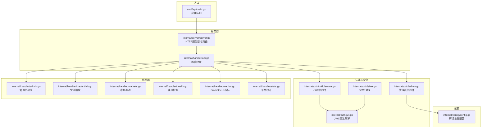
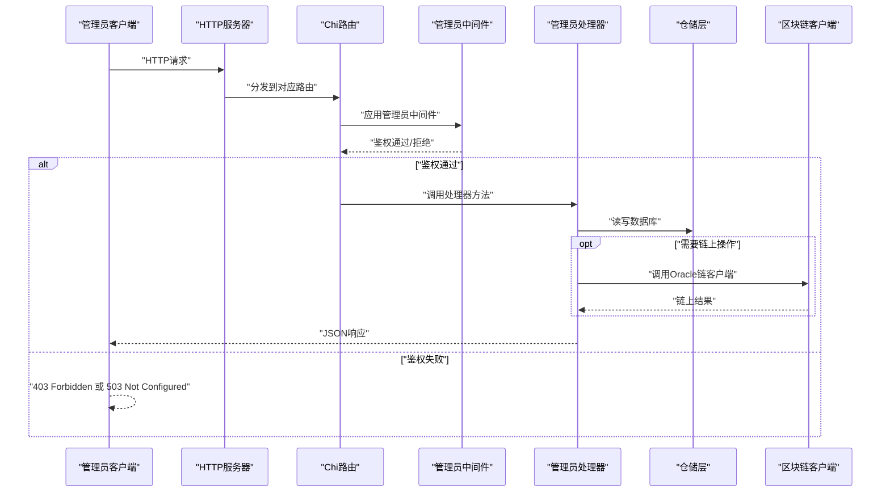
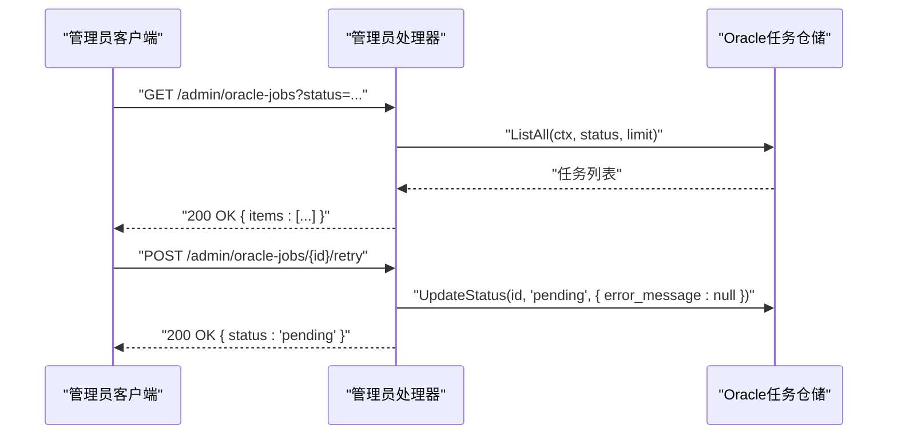
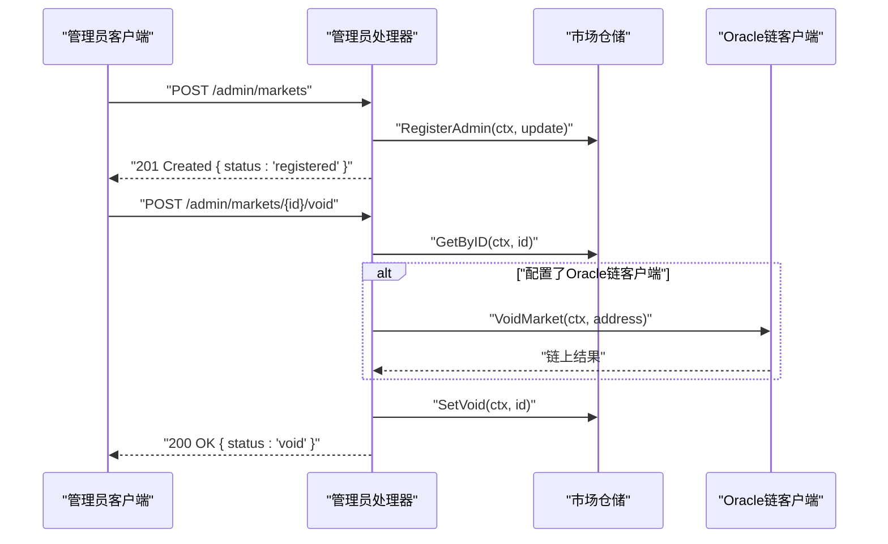
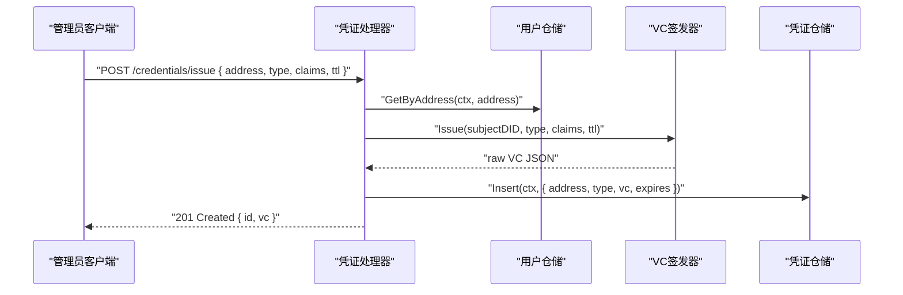
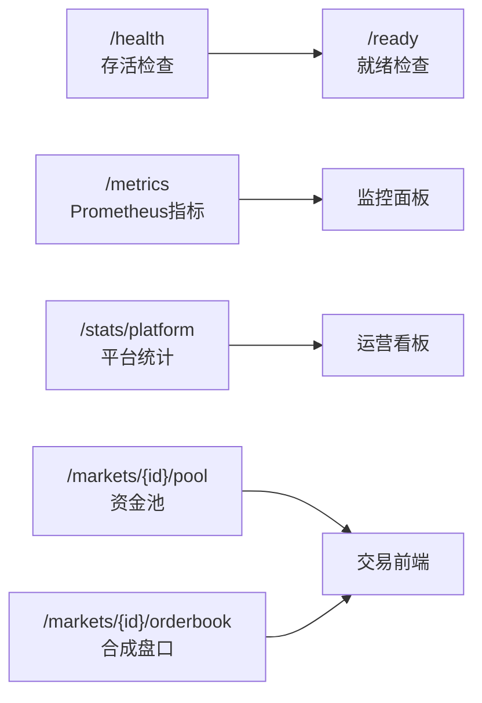
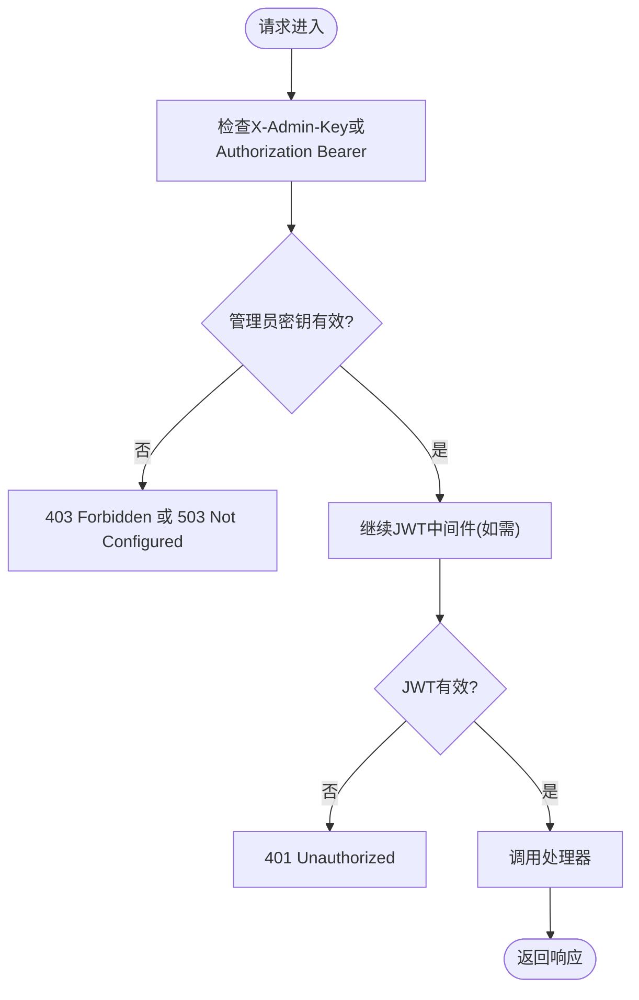
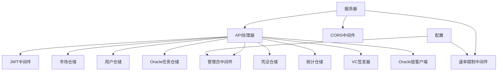

# 管理员API接口

<cite>
**本文档引用的文件**
- [api.go](file://internal/handler/api.go)
- [admin.go](file://internal/handler/admin.go)
- [credentials.go](file://internal/handler/credentials.go)
- [admin.go](file://internal/auth/admin.go)
- [config.go](file://internal/config/config.go)
- [server.go](file://internal/server/server.go)
- [main.go](file://cmd/api/main.go)
- [markets.go](file://internal/handler/markets.go)
- [health.go](file://internal/handler/health.go)
- [metrics.go](file://internal/handler/metrics.go)
- [stats.go](file://internal/handler/stats.go)
- [middleware.go](file://internal/auth/middleware.go)
- [jwt.go](file://internal/auth/jwt.go)
- [siwe.go](file://internal/auth/siwe.go)
</cite>

## 目录
1. [简介](#简介)
2. [项目结构](#项目结构)
3. [核心组件](#核心组件)
4. [架构总览](#架构总览)
5. [详细组件分析](#详细组件分析)
6. [依赖关系分析](#依赖关系分析)
7. [性能考虑](#性能考虑)
8. [故障排查指南](#故障排查指南)
9. [结论](#结论)
10. [附录](#附录)

## 简介
本文件面向PredictionDIDSimple项目的管理员，提供后台管理API接口的权威文档。内容涵盖需要管理员密钥认证的管理功能，包括Oracle任务管理、市场注册与作废、任务重试、凭证颁发等；同时阐述管理员权限体系与安全机制，以及系统维护、监控、配置管理等后台能力。文档还提供最佳实践与安全注意事项，并给出系统状态监控、故障排查与数据备份恢复的管理接口说明。

## 项目结构
后端采用分层架构：入口程序负责初始化配置、数据库迁移、Redis与区块链客户端、索引器与HTTP服务器；服务器层构建Chi路由与中间件；处理器层实现业务接口；认证层提供JWT与管理员密钥中间件；配置层统一加载环境变量。

**图表来源**
- [main.go:27-161](file://cmd/api/main.go#L27-L161)
- [server.go:44-102](file://internal/server/server.go#L44-L102)
- [api.go:34-69](file://internal/handler/api.go#L34-L69)
- [admin.go:10-37](file://internal/auth/admin.go#L10-L37)
- [middleware.go:18-43](file://internal/auth/middleware.go#L18-L43)
- [jwt.go:19-57](file://internal/auth/jwt.go#L19-L57)
- [siwe.go:20-60](file://internal/auth/siwe.go#L20-L60)
- [admin.go:12-109](file://internal/handler/admin.go#L12-L109)
- [credentials.go:24-71](file://internal/handler/credentials.go#L24-L71)
- [markets.go:10-59](file://internal/handler/markets.go#L10-L59)
- [health.go:20-77](file://internal/handler/health.go#L20-L77)
- [metrics.go:11-36](file://internal/handler/metrics.go#L11-L36)
- [stats.go:9-87](file://internal/handler/stats.go#L9-L87)
- [config.go:48-104](file://internal/config/config.go#L48-L104)

**章节来源**
- [main.go:27-161](file://cmd/api/main.go#L27-L161)
- [server.go:44-102](file://internal/server/server.go#L44-L102)
- [api.go:34-69](file://internal/handler/api.go#L34-L69)
- [config.go:48-104](file://internal/config/config.go#L48-L104)

## 核心组件
- 管理员密钥中间件：通过请求头X-Admin-Key或Authorization: Bearer <key>进行校验，未配置密钥时返回服务不可用。
- 管理员路由组：在统一的/route组内应用管理员中间件，确保所有管理接口均受控。
- 管理员功能：Oracle任务列表、市场注册、市场作废、任务重试、凭证颁发。
- 健康检查与就绪检测：/health与/ready端点，聚合数据库、Redis与区块链RPC状态。
- Prometheus指标：导出Oracle任务状态计数，便于监控与告警。
- 平台统计与市场盘口：提供平台聚合统计、资金池与合成盘口数据。

**章节来源**
- [admin.go:10-37](file://internal/auth/admin.go#L10-L37)
- [api.go:60-68](file://internal/handler/api.go#L60-L68)
- [admin.go:12-109](file://internal/handler/admin.go#L12-L109)
- [health.go:20-77](file://internal/handler/health.go#L20-L77)
- [metrics.go:11-36](file://internal/handler/metrics.go#L11-L36)
- [stats.go:9-87](file://internal/handler/stats.go#L9-L87)

## 架构总览
管理员API位于独立的路由组中，统一由管理员密钥中间件保护。请求进入后，先经过全局中间件（日志、限流、CORS），再进入路由组，最后到达具体处理器。处理器调用仓储层与区块链客户端（如配置存在）执行业务逻辑，并返回JSON响应。

**图表来源**
- [server.go:44-102](file://internal/server/server.go#L44-L102)
- [api.go:60-68](file://internal/handler/api.go#L60-L68)
- [admin.go:10-37](file://internal/auth/admin.go#L10-L37)
- [admin.go:12-109](file://internal/handler/admin.go#L12-L109)

## 详细组件分析

### 管理员权限体系与安全机制
- 管理员密钥来源：从配置加载，支持环境变量ADMIN_API_KEY。
- 鉴权方式：优先从X-Admin-Key头读取；若为空则回退Authorization: Bearer <key>。
- 未配置密钥：中间件直接返回服务不可用。
- 未授权访问：返回403 Forbidden。
- CORS配置：允许X-Admin-Key头，保障跨域场景下的密钥传递。

**章节来源**
- [config.go:72-72](file://internal/config/config.go#L72-L72)
- [admin.go:10-37](file://internal/auth/admin.go#L10-L37)
- [server.go:62-67](file://internal/server/server.go#L62-L67)

### Oracle任务管理
- 列表查询：支持按status过滤，最多返回100条任务。
- 重试机制：将任务状态重置为pending，并清除错误消息。

**图表来源**
- [admin.go:12-23](file://internal/handler/admin.go#L12-L23)
- [admin.go:95-108](file://internal/handler/admin.go#L95-L108)

**章节来源**
- [admin.go:12-23](file://internal/handler/admin.go#L12-L23)
- [admin.go:95-108](file://internal/handler/admin.go#L95-L108)

### 市场注册与作废
- 市场注册：接收比赛ID、合约地址、问题、是否需要VC、限制地区、解析规则等字段，写入数据库。
- 市场作废：若配置了Oracle链客户端，则调用链上作废；随后更新数据库状态为VOID，并将关联比赛状态改为CANCELLED。

**图表来源**
- [admin.go:73-93](file://internal/handler/admin.go#L73-L93)
- [admin.go:30-61](file://internal/handler/admin.go#L30-L61)

**章节来源**
- [admin.go:63-93](file://internal/handler/admin.go#L63-L93)
- [admin.go:25-61](file://internal/handler/admin.go#L25-L61)

### 凭证颁发
- 接口：POST /credentials/issue
- 请求体字段：address、credential_type、claims、ttl_hours
- 行为：根据用户是否已绑定DID选择主体DID；调用VC签发器签发；存储至数据库并返回凭证ID与JSON。

**图表来源**
- [credentials.go:24-71](file://internal/handler/credentials.go#L24-L71)

**章节来源**
- [credentials.go:16-71](file://internal/handler/credentials.go#L16-L71)

### 系统维护与监控接口
- 健康检查：/health返回存活状态；/ready聚合数据库、Redis与RPC状态，异常时返回503。
- Prometheus指标：/metrics导出Oracle任务状态计数，便于监控面板展示。
- 平台统计：/stats/platform返回全平台聚合统计。
- 市场盘口：/markets/{id}/pool与/markets/{id}/orderbook返回资金池与合成盘口数据。

**图表来源**
- [health.go:20-77](file://internal/handler/health.go#L20-L77)
- [metrics.go:11-36](file://internal/handler/metrics.go#L11-L36)
- [stats.go:9-87](file://internal/handler/stats.go#L9-L87)
- [markets.go:10-59](file://internal/handler/markets.go#L10-L59)

**章节来源**
- [health.go:20-77](file://internal/handler/health.go#L20-L77)
- [metrics.go:11-36](file://internal/handler/metrics.go#L11-L36)
- [stats.go:9-87](file://internal/handler/stats.go#L9-L87)
- [markets.go:10-59](file://internal/handler/markets.go#L10-L59)

### 认证与授权流程
- JWT中间件：校验Authorization: Bearer <jwt>，解析失败返回401。
- 管理员中间件：校验X-Admin-Key或Authorization Bearer，未配置返回503。
- SIWE登录：校验消息与签名，支持域名与URI校验，过期时间检查。

**图表来源**
- [admin.go:10-37](file://internal/auth/admin.go#L10-L37)
- [middleware.go:18-43](file://internal/auth/middleware.go#L18-L43)
- [jwt.go:36-57](file://internal/auth/jwt.go#L36-L57)
- [siwe.go:20-60](file://internal/auth/siwe.go#L20-L60)

**章节来源**
- [middleware.go:18-43](file://internal/auth/middleware.go#L18-L43)
- [jwt.go:19-57](file://internal/auth/jwt.go#L19-L57)
- [siwe.go:20-60](file://internal/auth/siwe.go#L20-L60)

## 依赖关系分析
- 路由注册集中于API处理器，管理员路由组统一应用管理员中间件。
- 服务器层负责中间件装配、CORS配置与路由注册。
- 配置层集中加载环境变量，包括管理员密钥、速率限制、地理封锁等。
- 处理器依赖仓储层与可选的区块链客户端。

**图表来源**
- [api.go:34-69](file://internal/handler/api.go#L34-L69)
- [server.go:44-102](file://internal/server/server.go#L44-L102)
- [config.go:48-104](file://internal/config/config.go#L48-L104)

**章节来源**
- [api.go:34-69](file://internal/handler/api.go#L34-L69)
- [server.go:44-102](file://internal/server/server.go#L44-L102)
- [config.go:48-104](file://internal/config/config.go#L48-L104)

## 性能考虑
- 速率限制：基于IP的滑动窗口限流，默认每分钟若干次，健康检查路径豁免。
- 健康检查：/ready会探测数据库、Redis与RPC状态，异常时返回503，避免向不健康的下游转发流量。
- Prometheus指标：导出Oracle任务状态分布，便于及时发现异常峰值。
- 建议：在高负载场景下适当提高速率限制阈值，并结合Nginx/反向代理做进一步限流与缓存。

**章节来源**
- [ratelimit.go:28-66](file://internal/middleware/ratelimit.go#L28-L66)
- [health.go:33-77](file://internal/handler/health.go#L33-L77)
- [metrics.go:11-36](file://internal/handler/metrics.go#L11-L36)

## 故障排查指南
- 管理员密钥错误
  - 现象：403 Forbidden 或 503 Not Configured
  - 排查：确认ADMIN_API_KEY是否正确配置；请求头是否为X-Admin-Key或Authorization Bearer
- 健康检查失败
  - 现象：/ready返回not ready或503
  - 排查：检查数据库连接、Redis连通性与RPC节点状态
- Oracle任务异常
  - 现象：/metrics显示failed计数上升
  - 排查：查看任务列表与日志，必要时使用重试接口
- 凭证颁发失败
  - 现象：500 Internal Server Error
  - 排查：确认VC签发器密钥、用户DID绑定状态与claims格式

**章节来源**
- [admin.go:10-37](file://internal/auth/admin.go#L10-L37)
- [health.go:33-77](file://internal/handler/health.go#L33-L77)
- [metrics.go:11-36](file://internal/handler/metrics.go#L11-L36)
- [credentials.go:24-71](file://internal/handler/credentials.go#L24-L71)

## 结论
管理员API通过集中式的管理员密钥中间件与清晰的路由分组，提供了对Oracle任务、市场与凭证等关键后台功能的统一管控。配合健康检查、Prometheus指标与平台统计接口，能够满足日常运维、监控与配置管理需求。建议在生产环境中妥善保管管理员密钥，启用HTTPS与反向代理限流，并定期巡检链上与数据库状态。

## 附录

### 管理员API端点一览
- GET /admin/oracle-jobs
  - 功能：列出Oracle任务（支持status过滤）
  - 认证：管理员密钥
  - 响应：包含items的任务列表
- POST /admin/oracle-jobs/{id}/retry
  - 功能：重试失败的Oracle任务
  - 认证：管理员密钥
  - 响应：状态pending
- POST /admin/markets
  - 功能：注册新市场
  - 认证：管理员密钥
  - 请求体：match_id, market_address, question, requires_vc, restricted_region, resolution_rule
  - 响应：registered
- POST /admin/markets/{id}/void
  - 功能：作废指定市场（链上+数据库）
  - 认证：管理员密钥
  - 响应：void
- POST /credentials/issue
  - 功能：颁发可验证凭证
  - 认证：管理员密钥
  - 请求体：address, credential_type, claims, ttl_hours
  - 响应：凭证ID与JSON

**章节来源**
- [api.go:60-68](file://internal/handler/api.go#L60-L68)
- [admin.go:12-23](file://internal/handler/admin.go#L12-L23)
- [admin.go:95-108](file://internal/handler/admin.go#L95-L108)
- [admin.go:73-93](file://internal/handler/admin.go#L73-L93)
- [admin.go:30-61](file://internal/handler/admin.go#L30-L61)
- [credentials.go:24-71](file://internal/handler/credentials.go#L24-L71)

### 系统状态监控与维护
- /health：存活检查
- /ready：就绪检查（数据库、Redis、RPC）
- /metrics：Prometheus指标（Oracle任务状态）
- /stats/platform：平台统计
- /markets/{id}/pool：资金池
- /markets/{id}/orderbook：合成盘口

**章节来源**
- [health.go:20-77](file://internal/handler/health.go#L20-L77)
- [metrics.go:11-36](file://internal/handler/metrics.go#L11-L36)
- [stats.go:9-87](file://internal/handler/stats.go#L9-L87)
- [markets.go:10-59](file://internal/handler/markets.go#L10-L59)

### 最佳实践与安全注意事项
- 管理员密钥管理
  - 使用强随机字符串作为ADMIN_API_KEY
  - 严格控制分发范围，避免硬编码在客户端
  - 定期轮换密钥并审计访问日志
- 认证与传输
  - 仅通过HTTPS传输，避免明文泄露
  - 对外暴露的网关启用TLS与WAF
- 操作审计
  - 记录所有管理员操作（注册、作废、重试、颁发）
  - 对敏感操作增加二次确认或审批流程
- 监控与告警
  - 基于/ready与/metrics建立告警
  - 对failed任务计数设置阈值告警
- 数据备份与恢复
  - 定期备份数据库与Redis
  - 测试恢复流程，确保可快速回滚
- 速率限制与防护
  - 合理设置每分钟请求数
  - 结合反向代理与WAF限制恶意扫描