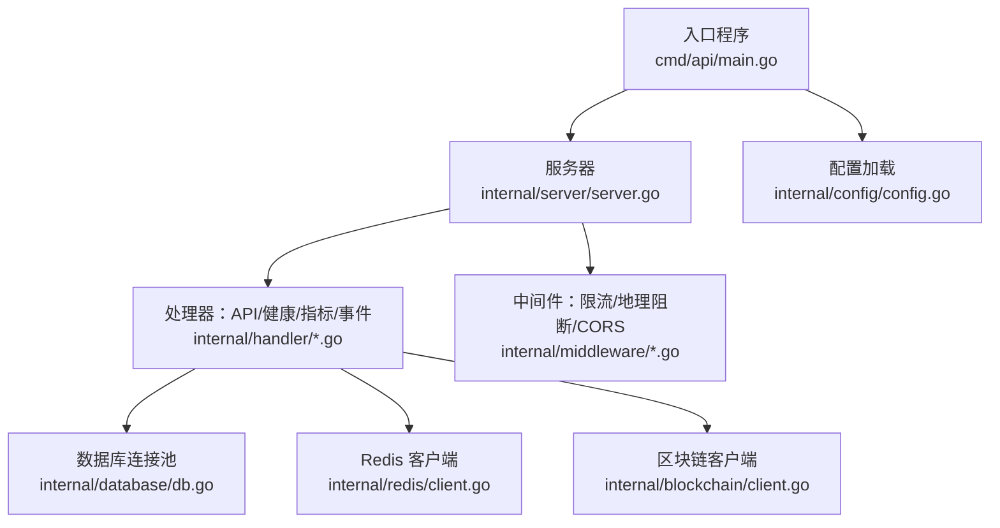
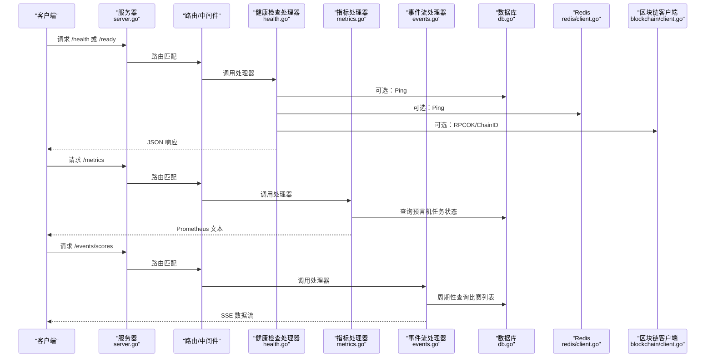
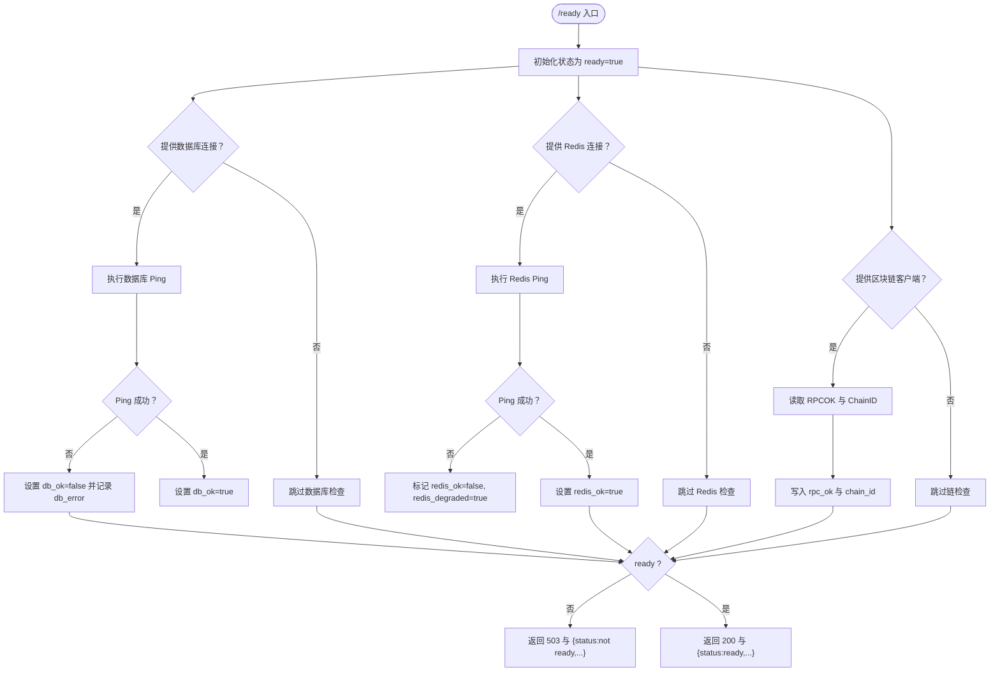
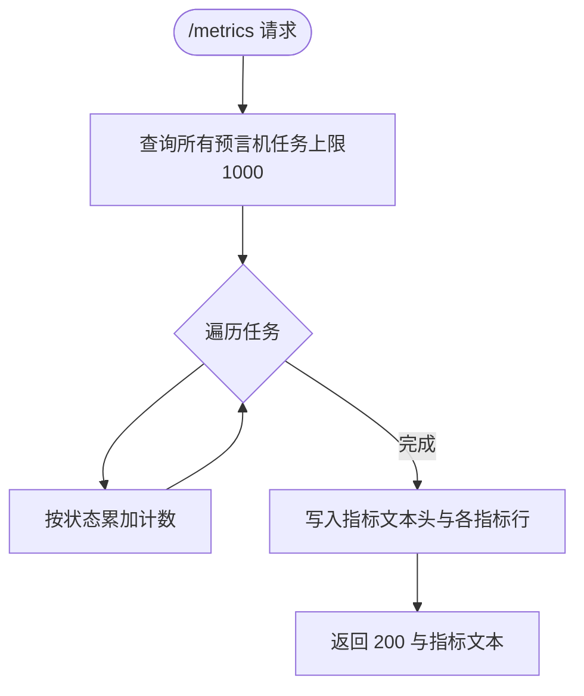
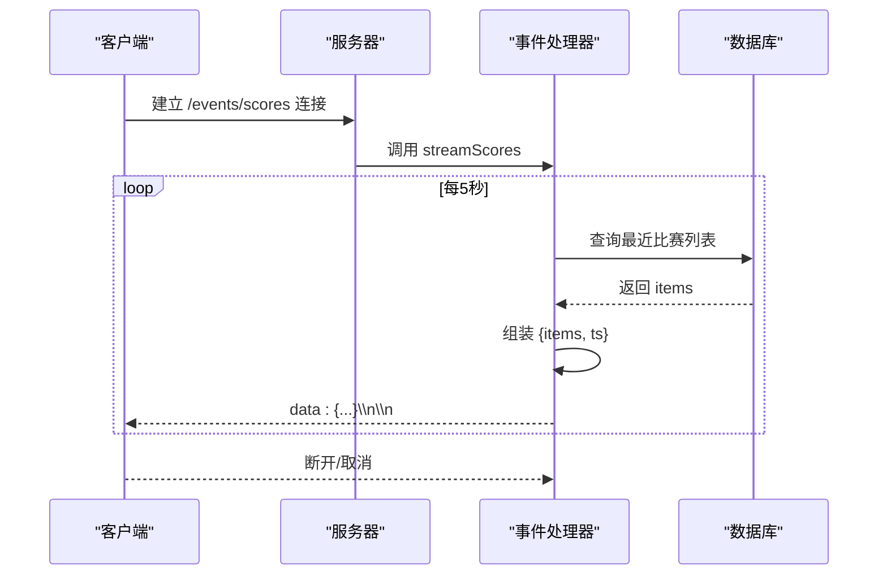
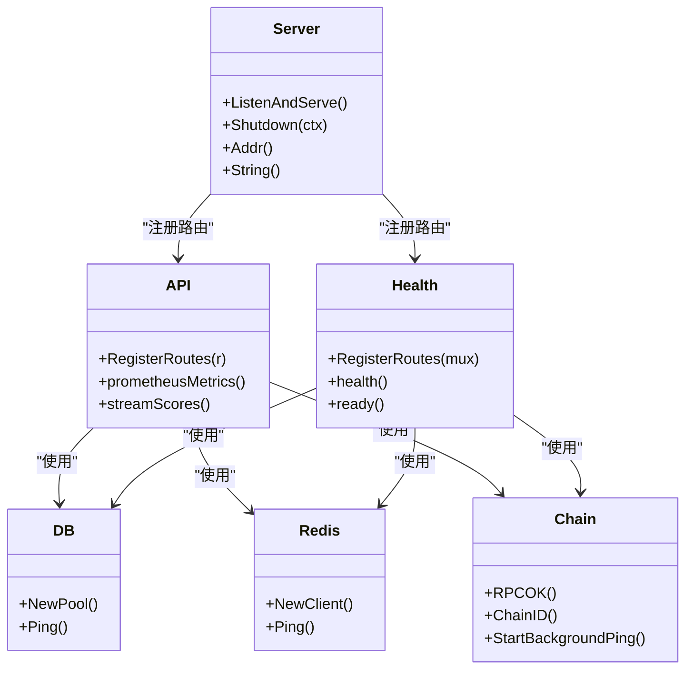

# 系统API

<cite>
**本文引用的文件**
- [cmd/api/main.go](file://cmd/api/main.go)
- [internal/server/server.go](file://internal/server/server.go)
- [internal/handler/api.go](file://internal/handler/api.go)
- [internal/handler/health.go](file://internal/handler/health.go)
- [internal/handler/metrics.go](file://internal/handler/metrics.go)
- [internal/handler/events.go](file://internal/handler/events.go)
- [internal/blockchain/client.go](file://internal/blockchain/client.go)
- [internal/redis/client.go](file://internal/redis/client.go)
- [internal/database/db.go](file://internal/database/db.go)
- [internal/middleware/ratelimit.go](file://internal/middleware/ratelimit.go)
- [internal/middleware/geo.go](file://internal/middleware/geo.go)
- [internal/alert/notifier.go](file://internal/alert/notifier.go)
- [internal/config/config.go](file://internal/config/config.go)
</cite>

## 目录
1. [简介](#简介)
2. [项目结构](#项目结构)
3. [核心组件](#核心组件)
4. [架构总览](#架构总览)
5. [详细组件分析](#详细组件分析)
6. [依赖关系分析](#依赖关系分析)
7. [性能考量](#性能考量)
8. [故障排查指南](#故障排查指南)
9. [结论](#结论)
10. [附录](#附录)

## 简介
本文件为系统监控与维护相关API的权威文档，覆盖以下端点：
- 健康检查：/health、/ready
- 指标导出：/metrics（Prometheus）
- 事件流：/events/scores（Server-Sent Events）

内容包含各端点的请求方式、响应格式、错误码、数据来源与典型用法，并给出监控最佳实践与故障诊断建议。

## 项目结构
后端采用分层与职责分离设计：
- 入口程序负责初始化配置、数据库迁移、Redis连接、区块链客户端与索引器等子系统，随后启动HTTP服务器。
- 服务器层构建路由与中间件，注册健康检查、指标与事件流等端点。
- 处理器层实现具体业务逻辑与监控端点。
- 中间件层提供限流、地理阻断、CORS等横切能力。
- 配置层从环境变量加载运行参数。

图表来源
- [cmd/api/main.go](file://cmd/api/main.go#L24-L98)
- [internal/server/server.go](file://internal/server/server.go#L35-L84)
- [internal/handler/api.go](file://internal/handler/api.go#L30-L61)
- [internal/middleware/ratelimit.go](file://internal/middleware/ratelimit.go#L36-L55)
- [internal/middleware/geo.go](file://internal/middleware/geo.go#L10-L31)
- [internal/database/db.go](file://internal/database/db.go#L14-L26)
- [internal/redis/client.go](file://internal/redis/client.go#L10-L22)
- [internal/blockchain/client.go](file://internal/blockchain/client.go#L19-L78)
- [internal/config/config.go](file://internal/config/config.go#L45-L96)

章节来源
- [cmd/api/main.go](file://cmd/api/main.go#L24-L98)
- [internal/server/server.go](file://internal/server/server.go#L35-L84)

## 核心组件
- 健康检查处理器：提供 /health 与 /ready 两个端点，/ready 会进行数据库、Redis与区块链客户端的连通性与一致性校验。
- 指标处理器：输出 Prometheus 文本格式的指标，当前包含“预言机任务按状态计数”。
- 事件流处理器：以 Server-Sent Events 推送比赛数据快照，周期性刷新。
- 服务器与路由：统一注册上述端点，并挂载限流、地理阻断与CORS中间件。
- 中间件：对特定路径豁免限流；对受限制地区返回403；支持跨域访问。

章节来源
- [internal/handler/health.go](file://internal/handler/health.go#L17-L22)
- [internal/handler/metrics.go](file://internal/handler/metrics.go#L8-L29)
- [internal/handler/events.go](file://internal/handler/events.go#L10-L37)
- [internal/server/server.go](file://internal/server/server.go#L35-L84)
- [internal/middleware/ratelimit.go](file://internal/middleware/ratelimit.go#L36-L55)
- [internal/middleware/geo.go](file://internal/middleware/geo.go#L10-L40)

## 架构总览
下图展示API端点在系统中的位置与调用链：

图表来源
- [internal/server/server.go](file://internal/server/server.go#L55-L75)
- [internal/handler/health.go](file://internal/handler/health.go#L24-L67)
- [internal/handler/metrics.go](file://internal/handler/metrics.go#L8-L29)
- [internal/handler/events.go](file://internal/handler/events.go#L10-L37)
- [internal/database/db.go](file://internal/database/db.go#L22-L26)
- [internal/redis/client.go](file://internal/redis/client.go#L18-L22)
- [internal/blockchain/client.go](file://internal/blockchain/client.go#L72-L78)

## 详细组件分析

### 健康检查接口
- 端点
  - GET /health：快速健康探测，返回服务可用性摘要。
  - GET /ready：就绪检查，对数据库、Redis与区块链客户端进行连通性与一致性验证。
- 响应字段（/ready）
  - status：字符串，正常时为 "ready"，异常时为 "not ready"。
  - db_ok：布尔，数据库可连通则为 true，否则为 false 并附带 db_error。
  - redis_ok：布尔，Redis可连通则为 true；若不可连通但非致命，标记 redis_degraded 为 true。
  - rpc_ok：布尔，区块链RPC连通且链ID一致则为 true。
  - chain_id：整数，当链ID有效时返回。
- 错误码
  - /ready 在存在致命问题时返回 503。
- 实现要点
  - /health 直接返回固定结构，不进行实际探测。
  - /ready 对每个依赖执行独立探测，任一致命失败即返回 503。

图表来源
- [internal/handler/health.go](file://internal/handler/health.go#L28-L67)

章节来源
- [internal/handler/health.go](file://internal/handler/health.go#L17-L22)
- [internal/handler/health.go](file://internal/handler/health.go#L24-L67)
- [internal/database/db.go](file://internal/database/db.go#L22-L26)
- [internal/redis/client.go](file://internal/redis/client.go#L18-L22)
- [internal/blockchain/client.go](file://internal/blockchain/client.go#L72-L78)

### 指标收集接口
- 端点
  - GET /metrics：导出 Prometheus 文本格式指标。
- 指标定义
  - 名称：oracle_jobs_total
  - 类型：Gauge
  - 含义：按状态分类的预言机任务数量
  - 标签：无
  - 值：pending、manual_review、confirmed、failed 四类计数
- 输出格式
  - Content-Type: text/plain; version=0.0.4
  - 每个指标一行，形如：指标名 数值
- 数据来源
  - 从数据库查询所有预言机任务的状态分布并统计计数。

图表来源
- [internal/handler/metrics.go](file://internal/handler/metrics.go#L8-L29)

章节来源
- [internal/handler/metrics.go](file://internal/handler/metrics.go#L8-L29)

### 事件流接口
- 端点
  - GET /events/scores：Server-Sent Events 流，推送比赛数据快照。
- 协议与头部
  - Content-Type: text/event-stream
  - Cache-Control: no-cache
  - Connection: keep-alive
- 刷新策略
  - 使用定时器每5秒触发一次推送。
- 消息格式
  - 每条消息为一个数据块，包含 items 与 ts 字段：
    - items：最近的比赛列表（上限50条）。
    - ts：UTC 时间戳。
- 订阅机制
  - 客户端通过标准浏览器或兼容库建立长连接。
  - 服务端在每次触发时序列化负载并写入响应体，随后 flush。
  - 客户端断开或上下文取消时停止推送。
- 错误处理
  - 若底层写入不支持 flush，立即返回 500 并提示不支持 streaming。

图表来源
- [internal/handler/events.go](file://internal/handler/events.go#L10-L37)

章节来源
- [internal/handler/events.go](file://internal/handler/events.go#L10-L37)

### 路由与中间件集成
- 路由注册
  - /health、/ready：健康检查处理器
  - /metrics：指标处理器
  - /events/scores：事件流处理器
- 中间件
  - CORS：允许指定来源与方法/头
  - 速率限制：默认每分钟限制，/health 与 /ready 豁免
  - 地理阻断：根据国家代码与白名单决定是否放行，/metrics 与 /events/* 豁免

章节来源
- [internal/server/server.go](file://internal/server/server.go#L35-L84)
- [internal/middleware/ratelimit.go](file://internal/middleware/ratelimit.go#L36-L55)
- [internal/middleware/geo.go](file://internal/middleware/geo.go#L10-L40)

## 依赖关系分析
- 服务器依赖注入
  - 数据库连接池、Redis客户端、区块链客户端、配置对象作为依赖传入。
- 处理器依赖
  - 健康检查依赖数据库、Redis与区块链客户端。
  - 指标依赖数据库（查询预言机任务）。
  - 事件流依赖数据库（查询比赛列表）。
- 中间件依赖
  - 速率限制依赖请求IP解析。
  - 地理阻断依赖请求头中的国家代码与配置的阻断名单。

图表来源
- [internal/server/server.go](file://internal/server/server.go#L22-L84)
- [internal/handler/api.go](file://internal/handler/api.go#L16-L28)
- [internal/handler/health.go](file://internal/handler/health.go#L11-L15)
- [internal/database/db.go](file://internal/database/db.go#L14-L26)
- [internal/redis/client.go](file://internal/redis/client.go#L10-L22)
- [internal/blockchain/client.go](file://internal/blockchain/client.go#L12-L78)

章节来源
- [internal/server/server.go](file://internal/server/server.go#L22-L84)
- [internal/handler/api.go](file://internal/handler/api.go#L16-L28)
- [internal/handler/health.go](file://internal/handler/health.go#L11-L15)
- [internal/database/db.go](file://internal/database/db.go#L14-L26)
- [internal/redis/client.go](file://internal/redis/client.go#L10-L22)
- [internal/blockchain/client.go](file://internal/blockchain/client.go#L12-L78)

## 性能考量
- /metrics
  - 查询上限1000，避免大规模扫描；建议Prometheus抓取间隔与服务端指标更新频率协调。
- /events/scores
  - 每5秒一次推送，适合低频更新场景；若数据量增大，建议优化查询或增加分页/过滤。
- 限流与地理阻断
  - 默认每分钟限制请求数，/health 与 /ready 豁免；地理阻断对受限制地区直接拒绝，减少无效流量。
- 写超时
  - 服务器对SSE设置了较长写超时，确保事件流稳定推送。

章节来源
- [internal/handler/metrics.go](file://internal/handler/metrics.go#L8-L29)
- [internal/handler/events.go](file://internal/handler/events.go#L20-L36)
- [internal/middleware/ratelimit.go](file://internal/middleware/ratelimit.go#L36-L55)
- [internal/middleware/geo.go](file://internal/middleware/geo.go#L10-L40)
- [internal/server/server.go](file://internal/server/server.go#L77-L83)

## 故障排查指南
- /ready 返回 not ready
  - 检查数据库连接池是否可用（/ready 会记录 db_error）。
  - 检查 Redis 是否可达；若不可达但非致命，会标记 redis_degraded。
  - 检查区块链RPC URL与链ID是否正确，确认后台ping线程已成功探测。
- /metrics 无法被Prometheus抓取
  - 确认Prometheus抓取地址与端口正确，且未被地理阻断拦截。
  - 检查服务端日志中是否有数据库查询异常。
- /events/scores 无法接收数据
  - 确认客户端支持SSE且未被代理/网关中断。
  - 检查服务端日志中是否有数据库查询错误或flush失败。
- 告警通知
  - 若配置了告警Webhook，系统会在满足条件时发送告警事件到指定URL。

章节来源
- [internal/handler/health.go](file://internal/handler/health.go#L28-L67)
- [internal/handler/metrics.go](file://internal/handler/metrics.go#L8-L29)
- [internal/handler/events.go](file://internal/handler/events.go#L10-L37)
- [internal/alert/notifier.go](file://internal/alert/notifier.go#L23-L35)

## 结论
本文档梳理了系统监控与维护相关的三类API端点：健康检查、指标导出与事件流。通过明确的响应结构、数据来源与中间件策略，可帮助运维与开发团队快速定位问题、评估系统健康状况并建立可靠的监控体系。

## 附录

### 环境变量与配置项
- 关键配置项（部分）
  - HTTP_PORT：HTTP监听端口
  - DATABASE_URL：PostgreSQL连接串
  - REDIS_URL：Redis连接串
  - ETH_RPC_URL：以太坊RPC地址
  - CHAIN_ID：期望链ID
  - JWT_SECRET、ADMIN_API_KEY、VC_ISSUER_KEY
  - GEO_BLOCK_ENABLED、BLOCKED_COUNTRIES
  - RATE_LIMIT_PER_MINUTE
  - ALERT_WEBHOOK_URL
- 加载流程
  - 从环境变量读取并解析为结构体，缺失必填项会报错。

章节来源
- [internal/config/config.go](file://internal/config/config.go#L45-L96)
- [cmd/api/main.go](file://cmd/api/main.go#L24-L40)