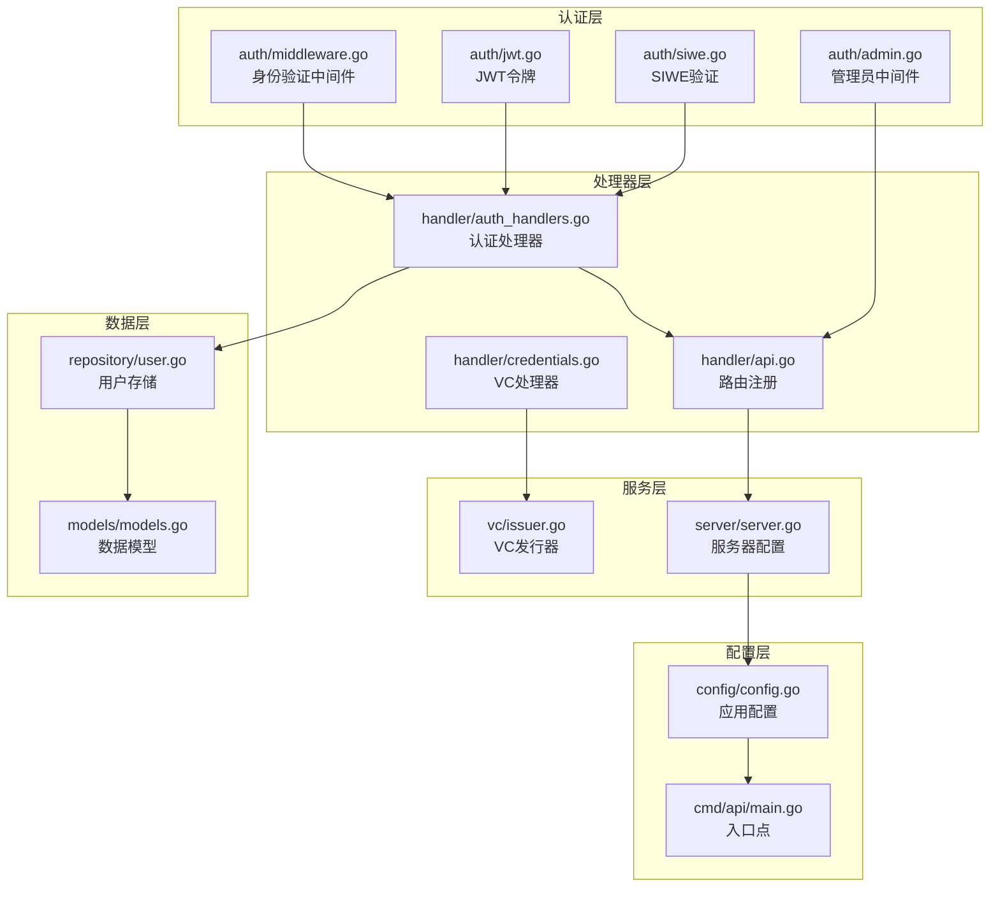
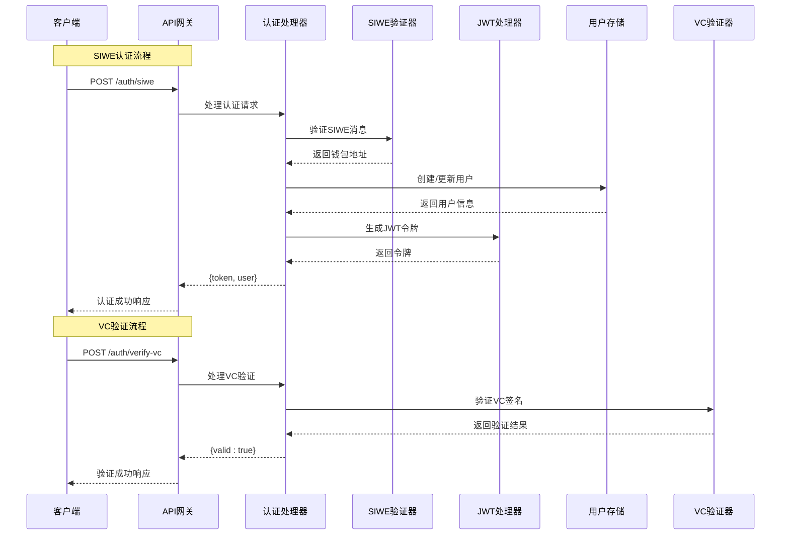
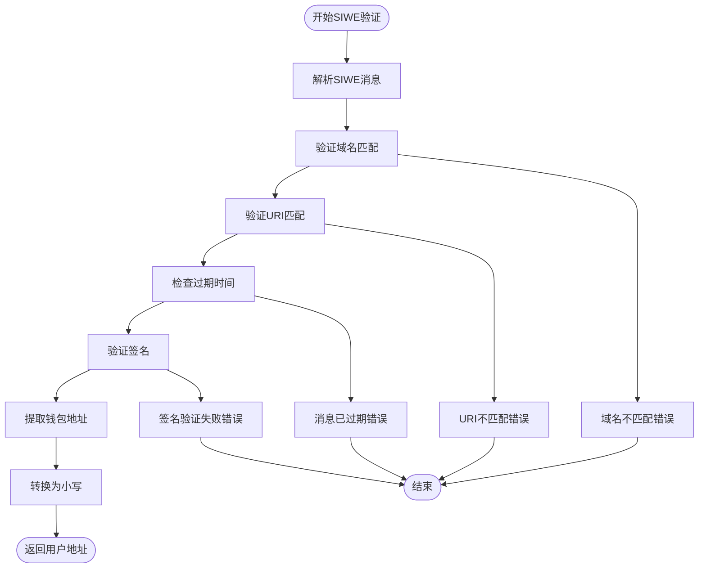
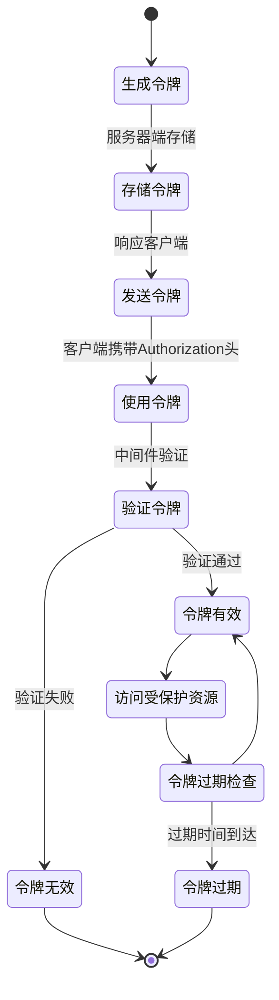
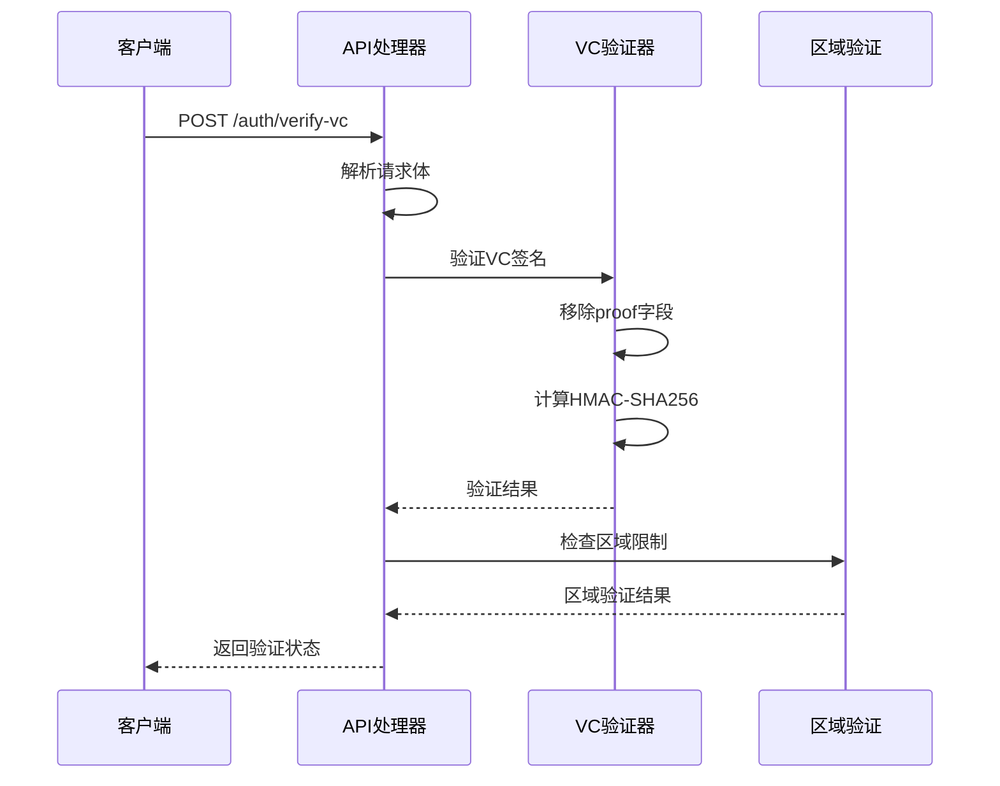
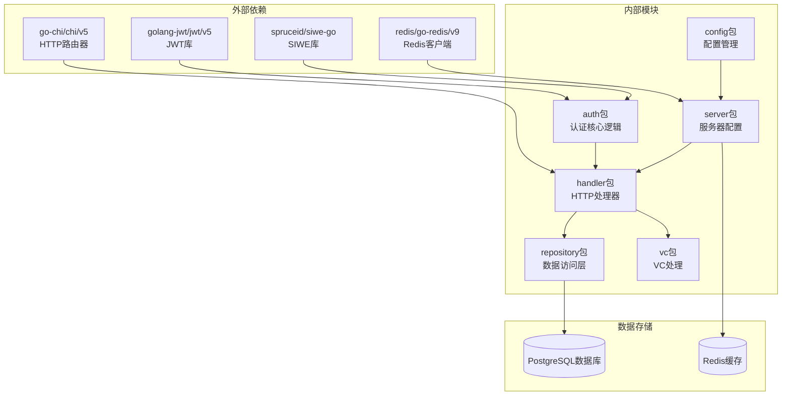

# 认证API

<cite>
**本文档引用的文件**
- [internal/auth/siwe.go](file://internal/auth/siwe.go)
- [internal/auth/jwt.go](file://internal/auth/jwt.go)
- [internal/auth/middleware.go](file://internal/auth/middleware.go)
- [internal/auth/admin.go](file://internal/auth/admin.go)
- [internal/handler/auth_handlers.go](file://internal/handler/auth_handlers.go)
- [internal/handler/api.go](file://internal/handler/api.go)
- [internal/handler/credentials.go](file://internal/handler/credentials.go)
- [internal/vc/issuer.go](file://internal/vc/issuer.go)
- [internal/repository/user.go](file://internal/repository/user.go)
- [internal/config/config.go](file://internal/config/config.go)
- [internal/server/server.go](file://internal/server/server.go)
- [cmd/api/main.go](file://cmd/api/main.go)
- [internal/models/models.go](file://internal/models/models.go)
</cite>

## 目录
1. [简介](#简介)
2. [项目结构](#项目结构)
3. [核心组件](#核心组件)
4. [架构概览](#架构概览)
5. [详细组件分析](#详细组件分析)
6. [依赖关系分析](#依赖关系分析)
7. [性能考虑](#性能考虑)
8. [故障排除指南](#故障排除指南)
9. [结论](#结论)

## 简介

本文件详细说明了PredictionDID Simple项目的认证API接口，重点关注用户身份验证和授权相关的API端点。系统实现了两种主要的认证方式：SIWE（Sign-In with Ethereum）认证和VC（Verifiable Credential）验证认证。

SIWE认证接口（/auth/siwe）允许用户使用以太坊钱包进行身份验证，通过验证用户的数字签名来确认其对钱包地址的所有权。VC验证接口（/auth/verify-vc）则用于验证去中心化身份凭证的有效性。

系统采用JWT（JSON Web Token）作为会话令牌，结合基于上下文的身份验证中间件实现权限控制。整个认证流程包括钱包连接、消息签名、身份验证和会话管理等步骤。

## 项目结构

认证系统在项目中的组织结构如下：



**图表来源**
- [internal/auth/siwe.go](file://internal/auth/siwe.go#L1-L57)
- [internal/auth/jwt.go](file://internal/auth/jwt.go#L1-L44)
- [internal/auth/middleware.go](file://internal/auth/middleware.go#L1-L37)
- [internal/auth/admin.go](file://internal/auth/admin.go#L1-L27)
- [internal/handler/auth_handlers.go](file://internal/handler/auth_handlers.go#L1-L79)
- [internal/handler/api.go](file://internal/handler/api.go#L1-L88)
- [internal/handler/credentials.go](file://internal/handler/credentials.go#L1-L96)
- [internal/vc/issuer.go](file://internal/vc/issuer.go#L1-L113)
- [internal/repository/user.go](file://internal/repository/user.go#L1-L50)
- [internal/config/config.go](file://internal/config/config.go#L1-L128)
- [internal/server/server.go](file://internal/server/server.go#L1-L102)
- [cmd/api/main.go](file://cmd/api/main.go#L1-L118)

**章节来源**
- [internal/auth/siwe.go](file://internal/auth/siwe.go#L1-L57)
- [internal/auth/jwt.go](file://internal/auth/jwt.go#L1-L44)
- [internal/auth/middleware.go](file://internal/auth/middleware.go#L1-L37)
- [internal/auth/admin.go](file://internal/auth/admin.go#L1-L27)
- [internal/handler/auth_handlers.go](file://internal/handler/auth_handlers.go#L1-L79)
- [internal/handler/api.go](file://internal/handler/api.go#L1-L88)
- [internal/handler/credentials.go](file://internal/handler/credentials.go#L1-L96)
- [internal/vc/issuer.go](file://internal/vc/issuer.go#L1-L113)
- [internal/repository/user.go](file://internal/repository/user.go#L1-L50)
- [internal/config/config.go](file://internal/config/config.go#L1-L128)
- [internal/server/server.go](file://internal/server/server.go#L1-L102)
- [cmd/api/main.go](file://cmd/api/main.go#L1-L118)

## 核心组件

### SIWE认证组件

SIWE（Sign-In with Ethereum）认证组件负责验证以太坊钱包签名的消息，实现去中心化身份验证。

**主要功能：**
- 解析SIWE消息格式
- 验证域名和URI匹配
- 检查消息过期时间
- 使用以太坊钱包验证签名
- 提取钱包地址并转换为小写

**关键参数：**
- Domain: 配置的域名，用于验证SIWE消息中的域名字段
- URI: 配置的应用URI，用于验证SIWE消息中的URI字段
- Signature: 用户钱包签名的十六进制字符串

**章节来源**
- [internal/auth/siwe.go](file://internal/auth/siwe.go#L17-L46)

### JWT令牌组件

JWT（JSON Web Token）组件负责生成和解析基于HS256算法的令牌，实现会话状态管理。

**主要功能：**
- 生成包含用户地址的JWT令牌
- 验证JWT令牌的有效性
- 设置令牌的过期时间和签发时间
- 提取令牌中的用户地址信息

**令牌结构：**
- Header: HS256签名算法
- Payload: 包含address和标准声明
- Signature: 基于密钥的签名

**章节来源**
- [internal/auth/jwt.go](file://internal/auth/jwt.go#L16-L43)

### 身份验证中间件

身份验证中间件负责拦截受保护的API请求，验证JWT令牌并提取用户信息。

**主要功能：**
- 从Authorization头中提取Bearer令牌
- 验证令牌签名和有效性
- 将用户地址注入到请求上下文中
- 支持受保护路由的访问控制

**章节来源**
- [internal/auth/middleware.go](file://internal/auth/middleware.go#L13-L31)

### VC验证组件

VC（Verifiable Credential）验证组件负责验证去中心化身份凭证的有效性。

**主要功能：**
- 验证VC的数字签名
- 检查凭证的过期时间
- 提取凭证主题的地区信息
- 支持区域限制验证

**章节来源**
- [internal/handler/credentials.go](file://internal/handler/credentials.go#L78-L96)
- [internal/vc/issuer.go](file://internal/vc/issuer.go#L74-L100)

## 架构概览

认证系统的整体架构采用分层设计，确保安全性和可维护性：



**图表来源**
- [internal/handler/auth_handlers.go](file://internal/handler/auth_handlers.go#L16-L44)
- [internal/handler/credentials.go](file://internal/handler/credentials.go#L78-L96)
- [internal/auth/siwe.go](file://internal/auth/siwe.go#L17-L46)
- [internal/auth/jwt.go](file://internal/auth/jwt.go#L16-L26)
- [internal/repository/user.go](file://internal/repository/user.go#L19-L31)

## 详细组件分析

### SIWE认证流程

SIWE认证是去中心化身份验证的核心组件，实现了基于以太坊钱包签名的消息验证。

#### 消息验证流程



**图表来源**
- [internal/auth/siwe.go](file://internal/auth/siwe.go#L17-L46)

#### DID绑定验证

DID（Decentralized Identifier）绑定验证确保用户绑定的DID与钱包地址一致。

**验证规则：**
- DID必须符合格式：did:pkh:eip155:{chainID}:{lowercaseAddress}
- 当前版本中签名在客户端侧验证，服务器信任JWT认证的用户

**章节来源**
- [internal/auth/siwe.go](file://internal/auth/siwe.go#L48-L56)

### JWT令牌管理

JWT令牌系统提供了完整的会话管理机制，包括令牌生成、验证和过期处理。

#### 令牌生命周期



**图表来源**
- [internal/auth/jwt.go](file://internal/auth/jwt.go#L16-L26)
- [internal/auth/middleware.go](file://internal/auth/middleware.go#L22-L28)

#### 令牌结构定义

| 字段 | 类型 | 描述 | 示例 |
|------|------|------|------|
| address | string | 用户钱包地址 | "0x742d35Cc6634C0532925a3b844Bc454e4438f44e" |
| exp | number | 过期时间戳 | 1700000000 |
| iat | number | 签发时间戳 | 1699996400 |

**章节来源**
- [internal/auth/jwt.go](file://internal/auth/jwt.go#L11-L14)
- [internal/auth/jwt.go](file://internal/auth/jwt.go#L16-L26)

### VC验证认证

VC（Verifiable Credential）验证提供了基于去中心化身份的认证机制。

#### VC验证流程



**图表来源**
- [internal/handler/credentials.go](file://internal/handler/credentials.go#L78-L96)
- [internal/vc/issuer.go](file://internal/vc/issuer.go#L74-L100)

#### VC结构定义

| 字段 | 类型 | 描述 | 示例 |
|------|------|------|------|
| @context | array | JSON-LD上下文 | ["https://www.w3.org/2018/credentials/v1"] |
| type | array | 凭证类型 | ["VerifiableCredential", "KYC"] |
| issuer | object | 发行者信息 | {"id": "did:web:...", "name": "Prediction DID Issuer"} |
| issuanceDate | string | 签发日期 | "2023-11-01T00:00:00Z" |
| expirationDate | string | 过期日期 | "2024-11-01T00:00:00Z" |
| credentialSubject | object | 凭证主体 | 包含用户声明的JSON对象 |
| proof | object | 数字签名 | HMAC-SHA256签名 |

**章节来源**
- [internal/vc/issuer.go](file://internal/vc/issuer.go#L40-L66)
- [internal/vc/issuer.go](file://internal/vc/issuer.go#L74-L100)

### 受保护路由管理

系统通过中间件模式实现路由级别的访问控制，支持不同级别的权限管理。

#### 权限层次结构

```mermaid
graph TB
subgraph "公共路由"
Public1[/matches]
Public2[/markets]
Public3[/stats]
end
subgraph "认证路由"
Auth1[/auth/siwe]
Auth2[/auth/verify-vc]
Auth3[/users/bind-did]
Auth4[/me/positions]
Auth5[/users/me/credentials]
end
subgraph "管理员路由"
Admin1[/admin/oracle-jobs]
Admin2[/admin/markets]
Admin3[/admin/oracle-jobs/{id}/retry]
Admin4[/credentials/issue]
end
Public1 --> Auth1
Public2 --> Auth2
Public3 --> Auth3
Auth3 --> Auth4
Auth4 --> Auth5
Auth5 --> Admin1
Admin1 --> Admin2
Admin2 --> Admin3
Admin3 --> Admin4
```

**图表来源**
- [internal/handler/api.go](file://internal/handler/api.go#L30-L61)

**章节来源**
- [internal/handler/api.go](file://internal/handler/api.go#L46-L51)
- [internal/auth/admin.go](file://internal/auth/admin.go#L8-L26)

## 依赖关系分析

认证系统的依赖关系体现了清晰的分层架构和职责分离：



**图表来源**
- [internal/auth/siwe.go](file://internal/auth/siwe.go#L3-L10)
- [internal/auth/jwt.go](file://internal/auth/jwt.go#L3-L9)
- [internal/handler/api.go](file://internal/handler/api.go#L3-L14)
- [internal/server/server.go](file://internal/server/server.go#L3-L20)

### 关键依赖关系

**认证核心依赖：**
- golang-jwt/jwt/v5: 提供JWT令牌的生成和验证功能
- spruceid/siwe-go: 提供SIWE消息的解析和验证功能

**框架依赖：**
- go-chi/chi/v5: 提供HTTP路由和中间件支持
- redis/go-redis/v9: 提供Redis缓存支持

**数据存储依赖：**
- PostgreSQL: 主要的数据存储，用于用户信息和凭证管理
- Redis: 缓存和会话管理

**章节来源**
- [internal/auth/siwe.go](file://internal/auth/siwe.go#L3-L10)
- [internal/auth/jwt.go](file://internal/auth/jwt.go#L3-L9)
- [internal/server/server.go](file://internal/server/server.go#L3-L20)

## 性能考虑

### 认证性能优化

**JWT令牌缓存：**
- 令牌验证使用内存缓存，避免频繁的签名验证
- 令牌过期时间设置为24小时，平衡安全性与性能

**数据库查询优化：**
- 用户查询使用LOWER函数索引，提高地址查找效率
- 凭证查询添加多列索引，优化复杂查询性能

**网络优化：**
- CORS配置允许必要的跨域请求
- 服务器超时设置合理，平衡响应时间和资源占用

### 安全性能权衡

**令牌有效期：**
- 24小时有效期提供良好的用户体验
- 短有效期减少令牌泄露的风险

**签名验证：**
- SIWE签名验证在服务器端执行，确保安全性
- VC签名验证使用HMAC-SHA256，提供强加密保证

## 故障排除指南

### 常见认证错误

**SIWE认证错误：**
- 域名不匹配：检查SIWE_DOMAIN环境变量配置
- URI不匹配：验证SIWE_URI与实际应用URI一致
- 消息过期：检查系统时间同步和消息有效期
- 签名验证失败：确认钱包签名正确性和私钥安全

**JWT认证错误：**
- 令牌格式错误：确保Authorization头格式为"Bearer {token}"
- 签名验证失败：检查JWT_SECRET配置正确性
- 令牌过期：重新进行SIWE认证获取新令牌

**VC验证错误：**
- 凭证签名无效：检查VC发行密钥和签名算法
- 凭证过期：验证凭证的expirationDate字段
- 区域限制：确认用户所在地区未被限制

### 调试建议

**开发环境配置：**
- 设置DEBUG环境变量启用详细日志
- 使用本地Redis实例进行开发测试
- 配置适当的CORS设置允许前端调试

**监控指标：**
- 认证成功率统计
- 各类错误码分布
- 请求延迟和吞吐量监控

**章节来源**
- [internal/handler/auth_handlers.go](file://internal/handler/auth_handlers.go#L26-L28)
- [internal/handler/credentials.go](file://internal/handler/credentials.go#L84-L94)
- [internal/auth/middleware.go](file://internal/auth/middleware.go#L17-L25)

## 结论

PredictionDID Simple项目的认证系统实现了现代去中心化身份验证的最佳实践。系统通过SIWE和VC两种认证方式，为用户提供了灵活且安全的身份验证选择。

**主要优势：**
- 去中心化身份验证，无需传统用户名密码
- 基于区块链的不可篡改身份标识
- 完整的JWT会话管理和权限控制
- 支持区域限制和合规要求
- 清晰的分层架构和职责分离

**安全特性：**
- 多重验证机制（SIWE签名+JWT令牌）
- 区域限制和合规检查
- 密钥管理和安全配置
- 完善的错误处理和日志记录

**扩展性考虑：**
- 模块化的认证组件设计
- 支持多种认证方式的插件架构
- 可配置的安全策略和验证规则
- 良好的性能优化和缓存机制

该认证系统为PredictionDID平台提供了坚实的安全基础，支持去中心化金融应用的用户身份管理和权限控制需求。