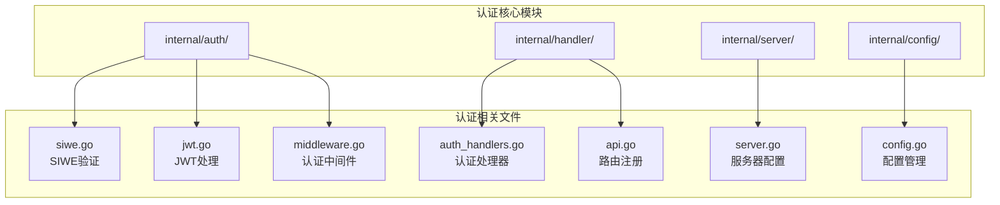
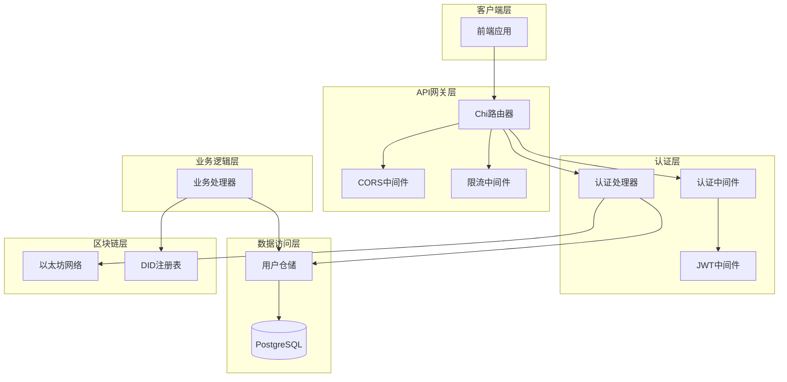
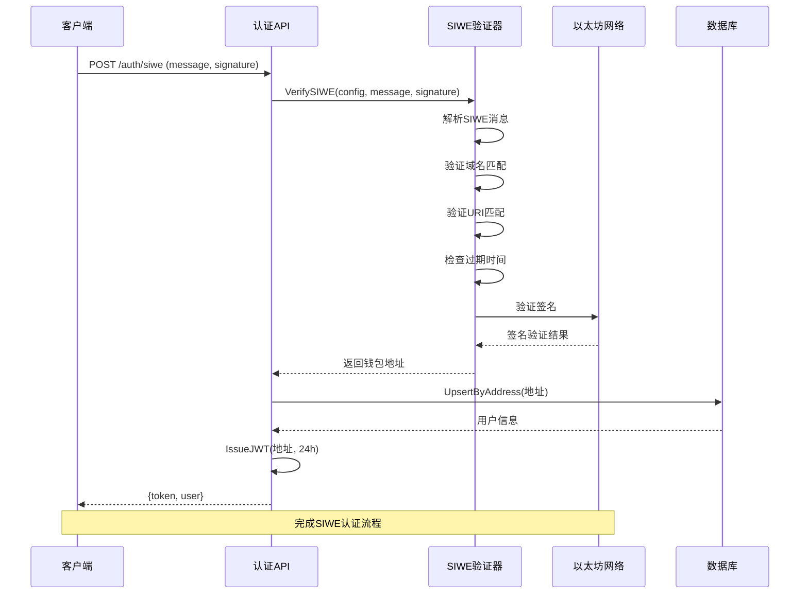
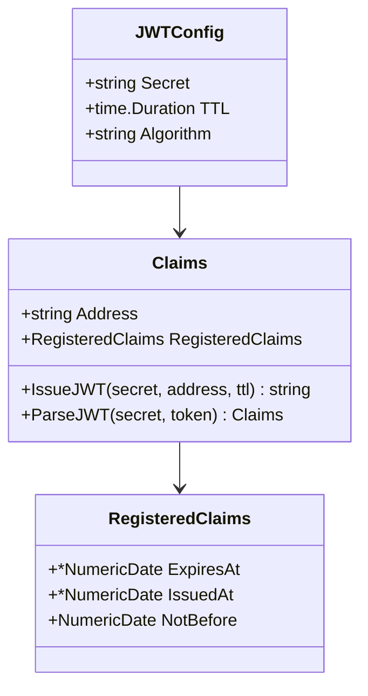
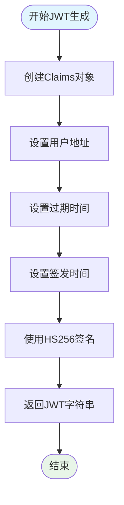
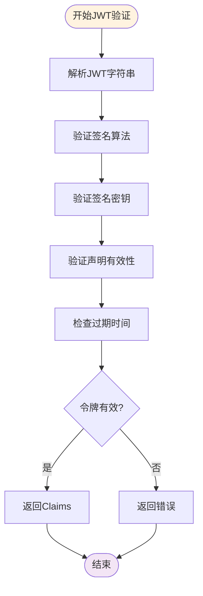
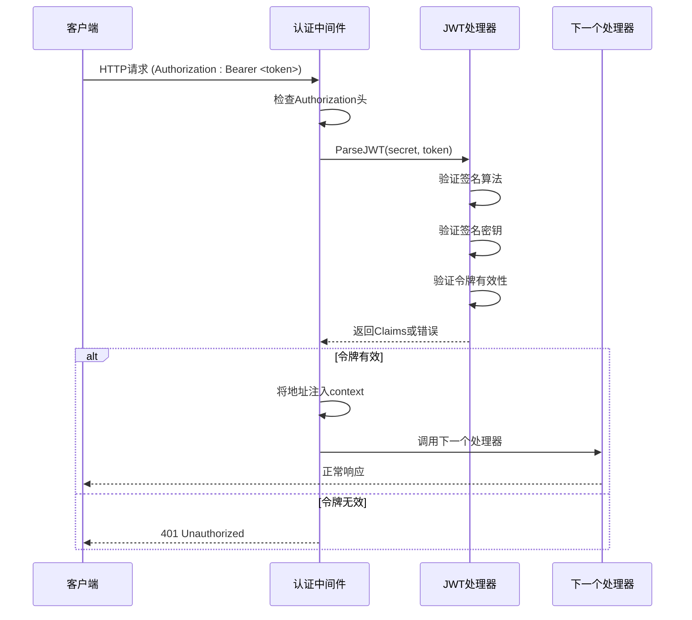
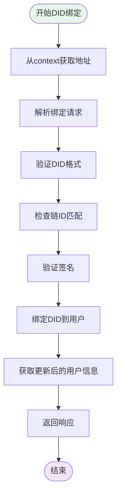
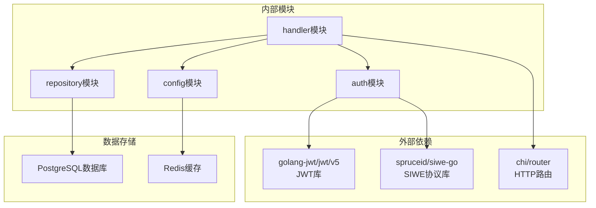

# 认证API接口

<cite>
**本文档引用的文件**
- [siwe.go](file://internal/auth/siwe.go)
- [jwt.go](file://internal/auth/jwt.go)
- [middleware.go](file://internal/auth/middleware.go)
- [auth_handlers.go](file://internal/handler/auth_handlers.go)
- [api.go](file://internal/handler/api.go)
- [server.go](file://internal/server/server.go)
- [config.go](file://internal/config/config.go)
- [user.go](file://internal/repository/user.go)
- [models.go](file://internal/models/models.go)
- [main.go](file://cmd/api/main.go)
</cite>

## 目录
1. [简介](#简介)
2. [项目结构](#项目结构)
3. [核心组件](#核心组件)
4. [架构概览](#架构概览)
5. [详细组件分析](#详细组件分析)
6. [依赖关系分析](#依赖关系分析)
7. [性能考虑](#性能考虑)
8. [故障排除指南](#故障排除指南)
9. [结论](#结论)

## 简介

PredictionDIDSimple项目是一个基于以太坊的预测市场平台，提供了完整的认证系统，包括SIWE（Sign-In with Ethereum）钱包登录和VC（可验证凭证）验证功能。该认证系统采用JWT（JSON Web Token）作为会话管理机制，结合区块链钱包签名实现去中心化身份认证。

## 项目结构

认证系统主要分布在以下模块中：



**图表来源**
- [siwe.go:1-75](file://internal/auth/siwe.go#L1-L75)
- [jwt.go:1-58](file://internal/auth/jwt.go#L1-L58)
- [middleware.go:1-50](file://internal/auth/middleware.go#L1-L50)

**章节来源**
- [main.go:1-161](file://cmd/api/main.go#L1-L161)
- [server.go:1-129](file://internal/server/server.go#L1-L129)

## 核心组件

### SIWE认证组件

SIWE（Sign-In with Ethereum）认证组件负责验证来自区块链钱包的签名，确保用户拥有相应的钱包地址。

### JWT处理组件

JWT（JSON Web Token）处理组件负责生成、验证和解析JWT令牌，管理用户会话状态。

### 认证中间件

认证中间件负责拦截HTTP请求，验证JWT令牌的有效性，并将认证信息注入到请求上下文中。

### 认证处理器

认证处理器提供具体的API端点实现，包括SIWE登录和VC验证功能。

**章节来源**
- [siwe.go:14-75](file://internal/auth/siwe.go#L14-L75)
- [jwt.go:13-58](file://internal/auth/jwt.go#L13-L58)
- [middleware.go:11-50](file://internal/auth/middleware.go#L11-L50)
- [auth_handlers.go:13-98](file://internal/handler/auth_handlers.go#L13-L98)

## 架构概览

认证系统采用分层架构设计，各组件职责明确，耦合度低：



**图表来源**
- [server.go:44-102](file://internal/server/server.go#L44-L102)
- [api.go:34-69](file://internal/handler/api.go#L34-L69)
- [auth_handlers.go:19-98](file://internal/handler/auth_handlers.go#L19-L98)

## 详细组件分析

### SIWE认证流程

SIWE认证流程是整个认证系统的核心，它结合了区块链签名验证和JWT会话管理。

#### SIWE消息验证流程



**图表来源**
- [auth_handlers.go:19-53](file://internal/handler/auth_handlers.go#L19-L53)
- [siwe.go:21-60](file://internal/auth/siwe.go#L21-L60)

#### SIWE配置参数

| 参数 | 类型 | 描述 | 示例值 |
|------|------|------|--------|
| Domain | string | 期望的域名 | localhost |
| URI | string | 期望的URI | http://localhost:5173 |

#### SIWE消息字段

| 字段 | 类型 | 必需 | 描述 |
|------|------|------|------|
| message | string | 是 | 完整的SIWE消息字符串 |
| signature | string | 是 | 钱包签名 |

**章节来源**
- [siwe.go:14-60](file://internal/auth/siwe.go#L14-L60)
- [auth_handlers.go:13-31](file://internal/handler/auth_handlers.go#L13-L31)

### JWT令牌管理

JWT（JSON Web Token）令牌是认证系统的核心组件，负责在客户端和服务器之间传递用户身份信息。

#### JWT令牌结构



**图表来源**
- [jwt.go:13-34](file://internal/auth/jwt.go#L13-L34)

#### JWT令牌生成流程



**图表来源**
- [jwt.go:19-34](file://internal/auth/jwt.go#L19-L34)

#### JWT令牌验证流程



**图表来源**
- [jwt.go:36-57](file://internal/auth/jwt.go#L36-L57)

**章节来源**
- [jwt.go:13-58](file://internal/auth/jwt.go#L13-L58)

### 认证中间件

认证中间件是保护受保护API端点的关键组件，它负责验证JWT令牌并在请求上下文中注入用户信息。

#### 中间件工作流程



**图表来源**
- [middleware.go:17-43](file://internal/auth/middleware.go#L17-L43)

#### 中间件配置

| 配置项 | 类型 | 默认值 | 描述 |
|--------|------|--------|------|
| secret | string | 从配置加载 | JWT签名密钥 |
| algorithm | string | HS256 | 签名算法 |

**章节来源**
- [middleware.go:17-43](file://internal/auth/middleware.go#L17-L43)

### 认证API端点

认证系统提供以下主要API端点：

#### SIWE登录端点

**端点**: `POST /auth/siwe`

**请求体**:
```json
{
  "message": "string",
  "signature": "string"
}
```

**响应体**:
```json
{
  "token": "string",
  "user": {
    "id": 1,
    "address": "0x...",
    "did": null
  }
}
```

**状态码**:
- 200: 成功
- 400: 请求体无效
- 401: 未授权（签名验证失败）

#### VC验证端点

**端点**: `POST /auth/verify-vc`

**请求体**:
```json
{
  "vc_json": "{}",
  "credential_type": "string",
  "region": "string"
}
```

**响应体**:
```json
{
  "valid": true
}
```

**状态码**:
- 200: 验证成功
- 400: 请求体无效
- 401: 未授权（验证失败）
- 403: 禁止访问（地区限制）

**章节来源**
- [api.go:48-50](file://internal/handler/api.go#L48-L50)
- [auth_handlers.go:19-98](file://internal/handler/auth_handlers.go#L19-L98)

### DID绑定功能

DID（Decentralized Identifier）绑定功能允许用户将区块链钱包地址与去中心化身份关联。

#### DID绑定流程



**图表来源**
- [auth_handlers.go:61-84](file://internal/handler/auth_handlers.go#L61-L84)
- [siwe.go:62-74](file://internal/auth/siwe.go#L62-L74)

**章节来源**
- [auth_handlers.go:55-84](file://internal/handler/auth_handlers.go#L55-L84)
- [siwe.go:62-74](file://internal/auth/siwe.go#L62-L74)

## 依赖关系分析

认证系统的依赖关系清晰，各组件职责分离：



**图表来源**
- [jwt.go](file://internal/auth/jwt.go#L10)
- [siwe.go](file://internal/auth/siwe.go#L11)
- [server.go:11-22](file://internal/server/server.go#L11-L22)

**章节来源**
- [config.go:1-139](file://internal/config/config.go#L1-L139)
- [server.go:1-129](file://internal/server/server.go#L1-L129)

## 性能考虑

### JWT令牌优化

1. **令牌大小控制**: JWT令牌应保持精简，只包含必要的声明
2. **过期时间设置**: 合理设置令牌过期时间，平衡安全性与用户体验
3. **签名算法选择**: 使用HS256算法确保安全性

### 数据库性能

1. **用户查询优化**: 对用户地址建立索引以提高查询性能
2. **事务处理**: 合理使用数据库事务确保数据一致性
3. **连接池管理**: 配置合适的数据库连接池大小

### 缓存策略

1. **Redis集成**: 利用Redis缓存频繁访问的数据
2. **过期策略**: 为缓存数据设置合理的过期时间
3. **内存管理**: 监控Redis内存使用情况

## 故障排除指南

### 常见认证错误

#### SIWE认证失败

**错误类型**: 域名不匹配
**原因**: SIWE消息中的域名与配置不一致
**解决方案**: 检查SIWE_DOMAIN配置与消息中的域名

**错误类型**: URI不匹配  
**原因**: SIWE消息中的URI与配置不一致
**解决方案**: 验证SIWE_URI配置正确性

**错误类型**: 令牌过期
**原因**: SIWE消息已超过有效期
**解决方案**: 确保在消息有效期内完成签名

**错误类型**: 签名验证失败
**原因**: 钱包签名不正确或被篡改
**解决方案**: 检查钱包签名过程和消息完整性

#### JWT认证失败

**错误类型**: 未提供Authorization头
**原因**: 请求缺少Bearer令牌
**解决方案**: 在Authorization头中添加Bearer <token>

**错误类型**: 令牌格式错误
**原因**: JWT令牌格式不正确
**解决方案**: 验证令牌字符串格式

**错误类型**: 签名算法不支持
**原因**: 使用了不受支持的签名算法
**解决方案**: 确保使用HS256算法

**错误类型**: 密钥不匹配
**原因**: JWT签名密钥不正确
**解决方案**: 检查JWT_SECRET配置

#### DID绑定错误

**错误类型**: DID格式不正确
**原因**: DID不符合did:pkh:eip155:<chain>:<address>规范
**解决方案**: 按照规范格式提供DID

**错误类型**: 链ID不匹配
**原因**: DID中的链ID与配置不一致
**解决方案**: 检查链ID配置和DID中的链ID

### 调试建议

1. **启用详细日志**: 在开发环境中启用详细的认证日志
2. **检查配置**: 确保所有认证相关配置正确设置
3. **测试环境**: 在测试环境中充分验证认证流程
4. **监控指标**: 监控认证相关的性能指标和错误率

**章节来源**
- [siwe.go:21-60](file://internal/auth/siwe.go#L21-L60)
- [jwt.go:36-57](file://internal/auth/jwt.go#L36-L57)
- [middleware.go:17-43](file://internal/auth/middleware.go#L17-L43)

## 结论

PredictionDIDSimple项目的认证系统实现了完整的去中心化身份认证流程，结合了SIWE钱包登录和JWT会话管理的优势。系统具有以下特点：

1. **安全性**: 基于区块链签名的身份验证，确保用户对钱包地址的控制权
2. **标准化**: 采用SIWE协议和JWT标准，便于集成和扩展
3. **模块化**: 清晰的组件分离，便于维护和测试
4. **可扩展性**: 支持DID绑定和VC验证，为未来功能扩展奠定基础

该认证系统为预测市场平台提供了可靠的身份认证基础设施，既保证了安全性，又兼顾了用户体验。通过合理的配置和最佳实践，可以构建更加健壮和安全的去中心化应用认证体系。