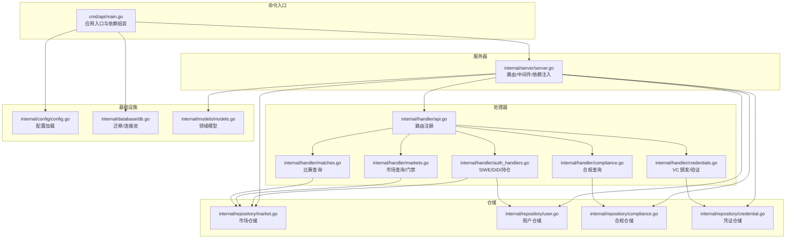
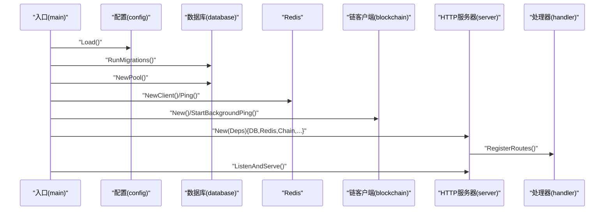
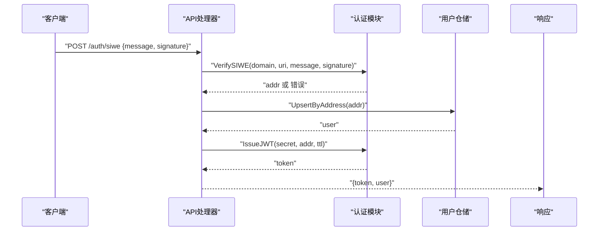
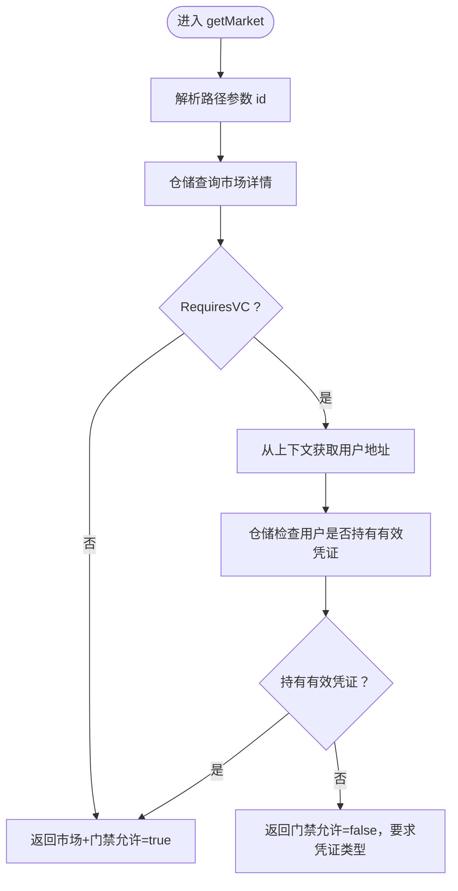
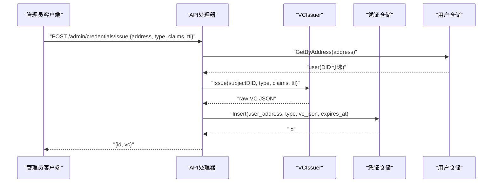
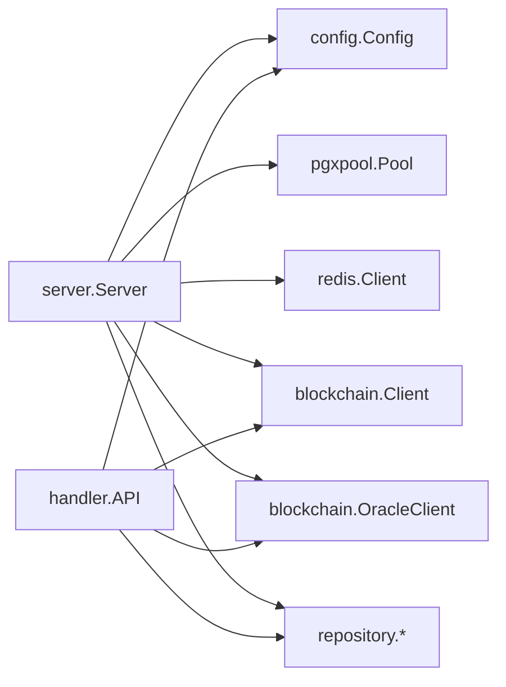
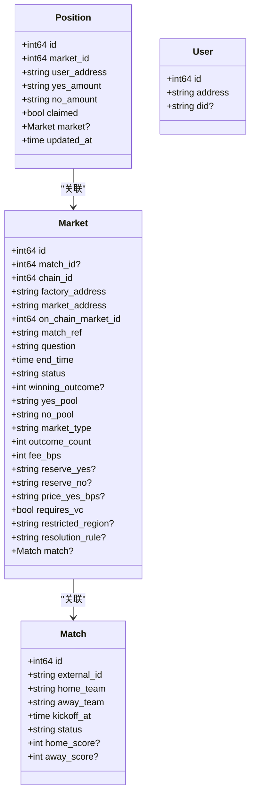

# 功能模块

<cite>
**本文档引用的文件**
- [cmd/api/main.go](file://cmd/api/main.go)
- [internal/server/server.go](file://internal/server/server.go)
- [internal/config/config.go](file://internal/config/config.go)
- [internal/database/db.go](file://internal/database/db.go)
- [internal/models/models.go](file://internal/models/models.go)
- [internal/handler/api.go](file://internal/handler/api.go)
- [internal/handler/matches.go](file://internal/handler/matches.go)
- [internal/handler/markets.go](file://internal/handler/markets.go)
- [internal/handler/auth_handlers.go](file://internal/handler/auth_handlers.go)
- [internal/handler/compliance.go](file://internal/handler/compliance.go)
- [internal/handler/credentials.go](file://internal/handler/credentials.go)
- [internal/repository/market.go](file://internal/repository/market.go)
- [internal/repository/user.go](file://internal/repository/user.go)
- [internal/repository/compliance.go](file://internal/repository/compliance.go)
- [internal/repository/credential.go](file://internal/repository/credential.go)
</cite>

## 目录
1. [简介](#简介)
2. [项目结构](#项目结构)
3. [核心组件](#核心组件)
4. [架构总览](#架构总览)
5. [详细组件分析](#详细组件分析)
6. [依赖分析](#依赖分析)
7. [性能考虑](#性能考虑)
8. [故障排查指南](#故障排查指南)
9. [结论](#结论)
10. [附录](#附录)

## 简介
本文件面向 PredictionDIDSimple 项目的后端功能模块，系统化梳理以下业务域的实现细节、调用关系、接口规范与领域模型：
- 用户管理模块：注册、登录（SIWE）、DID 绑定
- 预测市场模块：创建/注册、交易门禁、结算
- 比赛管理模块：数据同步、状态管理
- 持仓管理模块：查询、统计
- 合规管理模块：KYC、地理限制、监管报告
- 可验证凭证模块：凭证签发、验证、DID 集成

文档兼顾初学者易读性与工程师技术深度，提供来自实际代码库的路径引用、流程图与时序图，帮助快速定位实现位置与扩展点。

## 项目结构
后端采用“命令入口 → 服务器 → 处理器 → 仓储 → 数据库”的分层组织方式：
- 命令入口负责配置加载、数据库迁移、Redis/链客户端初始化与子任务启动
- 服务器负责路由注册、中间件装配与 HTTP 生命周期管理
- 处理器聚合各业务 handler，统一注册公开/鉴权/管理员三类路由
- 仓储封装数据库访问，提供领域模型的 CRUD 与组合查询
- 数据库层包含迁移与连接池，配合配置模块读取环境变量

图表来源
- [cmd/api/main.go:27-161](file://cmd/api/main.go#L27-L161)
- [internal/server/server.go:44-102](file://internal/server/server.go#L44-L102)
- [internal/handler/api.go:34-69](file://internal/handler/api.go#L34-L69)
- [internal/repository/market.go:15-269](file://internal/repository/market.go#L15-L269)
- [internal/repository/user.go:13-71](file://internal/repository/user.go#L13-L71)
- [internal/repository/compliance.go:11-36](file://internal/repository/compliance.go#L11-L36)
- [internal/repository/credential.go:24-83](file://internal/repository/credential.go#L24-L83)
- [internal/config/config.go:48-105](file://internal/config/config.go#L48-L105)
- [internal/database/db.go:16-51](file://internal/database/db.go#L16-L51)
- [internal/models/models.go:6-63](file://internal/models/models.go#L6-L63)

章节来源
- [cmd/api/main.go:27-161](file://cmd/api/main.go#L27-L161)
- [internal/server/server.go:44-102](file://internal/server/server.go#L44-L102)
- [internal/config/config.go:48-105](file://internal/config/config.go#L48-L105)
- [internal/database/db.go:16-51](file://internal/database/db.go#L16-L51)

## 核心组件
- 配置模块：集中加载运行时配置（数据库、Redis、链 RPC、合约地址、管理员密钥、VC 发行密钥、地理封锁、速率限制等）
- 数据库模块：连接池创建、Ping 探活、迁移执行
- 服务器模块：路由注册、CORS、速率限制、地理封锁中间件、健康检查
- 处理器模块：按公开/鉴权/管理员三类注册路由，统一 JSON 响应与错误处理
- 仓储模块：围绕领域模型提供 CRUD 与组合查询，支持市场、用户、合规、凭证等
- 领域模型：比赛、市场、持仓、用户

章节来源
- [internal/config/config.go:12-46](file://internal/config/config.go#L12-L46)
- [internal/database/db.go:16-51](file://internal/database/db.go#L16-L51)
- [internal/server/server.go:29-102](file://internal/server/server.go#L29-L102)
- [internal/handler/api.go:18-31](file://internal/handler/api.go#L18-L31)
- [internal/repository/market.go:15-269](file://internal/repository/market.go#L15-L269)
- [internal/repository/user.go:13-71](file://internal/repository/user.go#L13-L71)
- [internal/repository/compliance.go:11-36](file://internal/repository/compliance.go#L11-L36)
- [internal/repository/credential.go:24-83](file://internal/repository/credential.go#L24-L83)
- [internal/models/models.go:6-63](file://internal/models/models.go#L6-L63)

## 架构总览
后端以 HTTP 服务为核心，通过依赖注入将配置、数据库、Redis、链客户端、预言机客户端与各仓储注入到服务器与处理器。入口程序负责：
- 加载配置与执行数据库迁移
- 初始化数据库连接池与 Redis 客户端
- 启动链上事件索引器（可选）
- 启动 HTTP 服务器并注册路由
- 优雅关闭

图表来源
- [cmd/api/main.go:27-161](file://cmd/api/main.go#L27-L161)
- [internal/server/server.go:44-102](file://internal/server/server.go#L44-L102)
- [internal/config/config.go:48-105](file://internal/config/config.go#L48-L105)
- [internal/database/db.go:33-51](file://internal/database/db.go#L33-L51)

## 详细组件分析

### 用户管理模块（注册、登录、DID 绑定）
- 登录（SIWE）
  - 接口：POST /auth/siwe
  - 流程：解码请求 → 验证 SIWE 签名 → 创建/更新用户 → 颁发 JWT
  - 关键实现路径：
    - [siweAuth:19-53](file://internal/handler/auth_handlers.go#L19-L53)
    - [VerifySIWE](file://internal/auth/siwe.go)
    - [IssueJWT](file://internal/auth/jwt.go)
    - [UpsertByAddress:25-43](file://internal/repository/user.go#L25-L43)
- DID 绑定
  - 接口：POST /users/bind-did（需 JWT）
  - 流程：从上下文提取地址 → 校验 DID+签名 → 写库 → 返回最新用户
  - 关键实现路径：
    - [bindDID:61-84](file://internal/handler/auth_handlers.go#L61-L84)
    - [BindDID:45-55](file://internal/repository/user.go#L45-L55)
    - [GetByAddress:57-70](file://internal/repository/user.go#L57-L70)
- 我的持仓
  - 接口：GET /me/positions（需 JWT）
  - 关键实现路径：
    - [myPositions:86-98](file://internal/handler/auth_handlers.go#L86-L98)
    - [ListByUser](file://internal/repository/position.go)

图表来源
- [internal/handler/auth_handlers.go:19-53](file://internal/handler/auth_handlers.go#L19-L53)
- [internal/repository/user.go:25-43](file://internal/repository/user.go#L25-L43)

章节来源
- [internal/handler/auth_handlers.go:19-98](file://internal/handler/auth_handlers.go#L19-L98)
- [internal/repository/user.go:13-71](file://internal/repository/user.go#L13-L71)

### 预测市场模块（创建/注册、交易、结算）
- 市场查询
  - 接口：GET /markets, GET /markets/{id}
  - 门禁逻辑：若市场 RequiresVC=true，则需当前用户持有对应类型有效凭证
  - 关键实现路径：
    - [listMarkets:10-27](file://internal/handler/markets.go#L10-L27)
    - [getMarket:29-60](file://internal/handler/markets.go#L29-L60)
    - [HasValidType:69-82](file://internal/repository/credential.go#L69-L82)
- 市场注册（管理员）
  - 接口：POST /admin/markets（需管理员 Key）
  - 关键实现路径：
    - [registerMarket](file://internal/handler/api.go:64-L68)
    - [InsertFromChain:113-128](file://internal/repository/market.go#L113-L128)
- 市场状态与结算
  - 接口：POST /admin/markets/{id}/void（作废）
  - 接口：市场解析/结算（通过预言机与链交互，见预言机模块）
  - 关键实现路径：
    - [SetVoid:184-188](file://internal/repository/market.go#L184-L188)
    - [UpdateResolved:130-138](file://internal/repository/market.go#L130-L138)
    - [UpdatePools:190-197](file://internal/repository/market.go#L190-L197)

图表来源
- [internal/handler/markets.go:29-60](file://internal/handler/markets.go#L29-L60)
- [internal/repository/credential.go:69-82](file://internal/repository/credential.go#L69-L82)

章节来源
- [internal/handler/markets.go:10-60](file://internal/handler/markets.go#L10-L60)
- [internal/repository/market.go:15-269](file://internal/repository/market.go#L15-L269)
- [internal/handler/api.go:60-69](file://internal/handler/api.go#L60-L69)

### 比赛管理模块（数据同步、状态管理）
- 比赛查询
  - 接口：GET /matches, GET /matches/{id}
  - 关键实现路径：
    - [listMatches:8-19](file://internal/handler/matches.go#L8-L19)
    - [getMatch:21-44](file://internal/handler/matches.go#L21-L44)
    - [List/GetByID](file://internal/repository/match.go)
- 数据同步
  - 通过索引器从链上事件拉取并入库（入口程序中启动），索引器注入比赛/市场/持仓/状态仓储
  - 关键实现路径：
    - [cmd/api/main.go 启动索引器:88-110](file://cmd/api/main.go#L88-L110)

章节来源
- [internal/handler/matches.go:8-44](file://internal/handler/matches.go#L8-L44)
- [cmd/api/main.go:88-110](file://cmd/api/main.go#L88-L110)

### 持仓管理模块（查询、统计、风险控制）
- 我的持仓
  - 接口：GET /me/positions（需 JWT）
  - 关键实现路径：
    - [myPositions:86-98](file://internal/handler/auth_handlers.go#L86-L98)
    - [ListByUser](file://internal/repository/position.go)
- 统计
  - 接口：GET /stats/platform
  - 关键实现路径：
    - [platformStats](file://internal/handler/stats.go)
    - [StatsRepo](file://internal/repository/stats.go)

章节来源
- [internal/handler/auth_handlers.go:86-98](file://internal/handler/auth_handlers.go#L86-L98)
- [internal/handler/stats.go](file://internal/handler/stats.go)
- [internal/repository/stats.go](file://internal/repository/stats.go)

### 合规管理模块（KYC、地理限制、监管报告）
- 地理限制查询
  - 接口：GET /compliance/restricted
  - 逻辑：读取 CF-IPCountry 或 X-Country-Code，判断是否在封禁列表
  - 关键实现路径：
    - [complianceRestricted:9-30](file://internal/handler/compliance.go#L9-L30)
    - [BlockedCountries](file://internal/config/config.go#L40)
- KYC 回调
  - 接口：POST /kyc/webhook
  - 逻辑：接收回调，入库记录
  - 关键实现路径：
    - [kycWebhook](file://internal/handler/api.go:44)
    - [LogKYC:29-35](file://internal/repository/compliance.go#L29-L35)
- 地理访问日志
  - 中间件记录每次访问的 IP、国家、路径与是否允许
  - 关键实现路径：
    - [GeoBlock 中间件注册:54-60](file://internal/server/server.go#L54-L60)
    - [LogGeo:21-27](file://internal/repository/compliance.go#L21-L27)

章节来源
- [internal/handler/compliance.go:9-30](file://internal/handler/compliance.go#L9-L30)
- [internal/server/server.go:54-60](file://internal/server/server.go#L54-L60)
- [internal/repository/compliance.go:11-36](file://internal/repository/compliance.go#L11-L36)
- [internal/config/config.go:40](file://internal/config/config.go#L40)

### 可验证凭证模块（凭证签发、验证、DID 集成）
- 颁发凭证（管理员）
  - 接口：POST /admin/credentials/issue
  - 流程：解析请求 → 构造 SubjectDID（优先使用已绑定 DID）→ 调用 VCIssuer → 存储凭证 → 返回 ID 与 JSON
  - 关键实现路径：
    - [issueCredential:24-71](file://internal/handler/credentials.go#L24-L71)
    - [VCIssuer.Issue](file://internal/vc/issuer.go)
    - [Insert:34-43](file://internal/repository/credential.go#L34-L43)
- 我的凭证
  - 接口：GET /users/me/credentials（需 JWT）
  - 关键实现路径：
    - [myCredentials:73-82](file://internal/handler/credentials.go#L73-L82)
    - [ListByUser:45-67](file://internal/repository/credential.go#L45-L67)
- 验证凭证
  - 接口：POST /auth/verify-vc
  - 流程：校验签名与过期 → 可选地区匹配 → 返回 valid=true
  - 关键实现路径：
    - [verifyVC:91-115](file://internal/handler/credentials.go#L91-L115)
    - [VCIssuer.Verify](file://internal/vc/issuer.go)
    - [SubjectRegion](file://internal/vc/issuer.go)

图表来源
- [internal/handler/credentials.go:24-71](file://internal/handler/credentials.go#L24-L71)
- [internal/repository/credential.go:34-43](file://internal/repository/credential.go#L34-L43)
- [internal/repository/user.go:57-70](file://internal/repository/user.go#L57-L70)

章节来源
- [internal/handler/credentials.go:16-115](file://internal/handler/credentials.go#L16-L115)
- [internal/repository/credential.go:13-83](file://internal/repository/credential.go#L13-L83)
- [internal/repository/user.go:13-71](file://internal/repository/user.go#L13-L71)

## 依赖分析
- 组件耦合
  - 服务器通过依赖注入聚合配置、数据库、Redis、链/预言机客户端与各仓储
  - 处理器仅依赖仓储与配置，保持业务逻辑与基础设施分离
- 外部依赖
  - 数据库：PostgreSQL（pgx 连接池）
  - 缓存：Redis（go-redis）
  - 区块链：以太坊 RPC、预言机适配器、DID Registry
  - 配置：环境变量驱动
- 循环依赖
  - 未发现直接循环依赖；仓储与模型双向引用属于常见数据映射模式

图表来源
- [internal/server/server.go:29-38](file://internal/server/server.go#L29-L38)
- [internal/handler/api.go:18-31](file://internal/handler/api.go#L18-L31)

章节来源
- [internal/server/server.go:29-38](file://internal/server/server.go#L29-L38)
- [internal/handler/api.go:18-31](file://internal/handler/api.go#L18-L31)

## 性能考虑
- 连接池与超时
  - 数据库使用连接池，读超时已配置；建议根据负载调整最大连接数与空闲连接数
  - Redis Ping 降级运行，不影响主流程
- 查询优化
  - 市场列表支持按状态过滤与分页；建议在高频字段建立索引
  - 关联查询使用 LEFT JOIN，注意大表场景下的排序与分页成本
- 缓存策略
  - Redis 可用于热点数据缓存（如市场详情、合规状态），需设计合理的过期与失效策略
- 并发与限流
  - 服务器内置速率限制中间件，建议结合 GeoBlock 与管理员 Key 控制突发流量

## 故障排查指南
- 配置缺失
  - 症状：启动即报错
  - 排查：确认 DATABASE_URL 必填；其他配置可通过默认值覆盖
  - 参考路径：
    - [Load:48-105](file://internal/config/config.go#L48-L105)
- 数据库迁移失败
  - 症状：migrate: xxx
  - 排查：检查 migrations 目录与数据库权限；确认迁移文件顺序与语法
  - 参考路径：
    - [RunMigrations:33-50](file://internal/database/db.go#L33-L50)
- Redis 不可用
  - 症状：WARN: redis ping: ...
  - 排查：检查 RedisURL 与网络连通性；服务仍可降级运行
  - 参考路径：
    - [main.go Redis 初始化:63-82](file://cmd/api/main.go#L63-L82)
- 市场查询异常
  - 症状：500 Internal Server Error
  - 排查：检查仓储 SQL 与参数；关注分页与过滤条件
  - 参考路径：
    - [MarketRepo.List:25-73](file://internal/repository/market.go#L25-L73)
- 凭证签发失败
  - 症状：500 Internal Server Error
  - 排查：确认 VC 发行密钥、用户 DID 绑定状态、仓储插入
  - 参考路径：
    - [issueCredential:24-71](file://internal/handler/credentials.go#L24-L71)
    - [Insert:34-43](file://internal/repository/credential.go#L34-L43)

章节来源
- [internal/config/config.go:48-105](file://internal/config/config.go#L48-L105)
- [internal/database/db.go:33-50](file://internal/database/db.go#L33-L50)
- [cmd/api/main.go:63-82](file://cmd/api/main.go#L63-L82)
- [internal/repository/market.go:25-73](file://internal/repository/market.go#L25-L73)
- [internal/handler/credentials.go:24-71](file://internal/handler/credentials.go#L24-L71)
- [internal/repository/credential.go:34-43](file://internal/repository/credential.go#L34-L43)

## 结论
本项目以清晰的分层架构与依赖注入实现了用户、市场、合规与凭证等核心业务域。入口程序负责基础设施初始化与子任务调度，服务器与处理器承担路由与业务编排职责，仓储提供稳定的数据库访问能力。通过配置模块与中间件，系统具备良好的可运维性与可扩展性。后续可在缓存、监控与指标方面进一步增强。

## 附录

### 领域模型

图表来源
- [internal/models/models.go:6-63](file://internal/models/models.go#L6-L63)

### 配置项一览（节选）
- 数据库与缓存
  - DATABASE_URL（必填）
  - REDIS_URL（可选，默认本地）
- 链与合约
  - ETH_RPC_URL / ETH_RPC_FALLBACK_URL
  - CHAIN_ID
  - MARKET_FACTORY_ADDRESS / MARKET_FACTORY_V3_ADDRESS
  - MOCK_USDC_ADDRESS
  - ORACLE_ADAPTER_ADDRESS / ORACLE_ADAPTER_V2_ADDRESS
  - DID_REGISTRY_ADDRESS
- 安全与合规
  - JWT_SECRET
  - ADMIN_API_KEY
  - GEO_BLOCK_ENABLED
  - BLOCKED_COUNTRIES
  - COMPLIANCE_REQUIRED
- 运行参数
  - HTTP_PORT（默认 8080）
  - INDEXER_POLL_SECONDS（默认 5）
  - ORACLE_COOLDOWN_MINUTES / ORACLE_TIMELOCK_SECONDS / ORACLE_POLL_SECONDS
  - RATE_LIMIT_PER_MINUTE（默认 120）

章节来源
- [internal/config/config.go:12-46](file://internal/config/config.go#L12-L46)