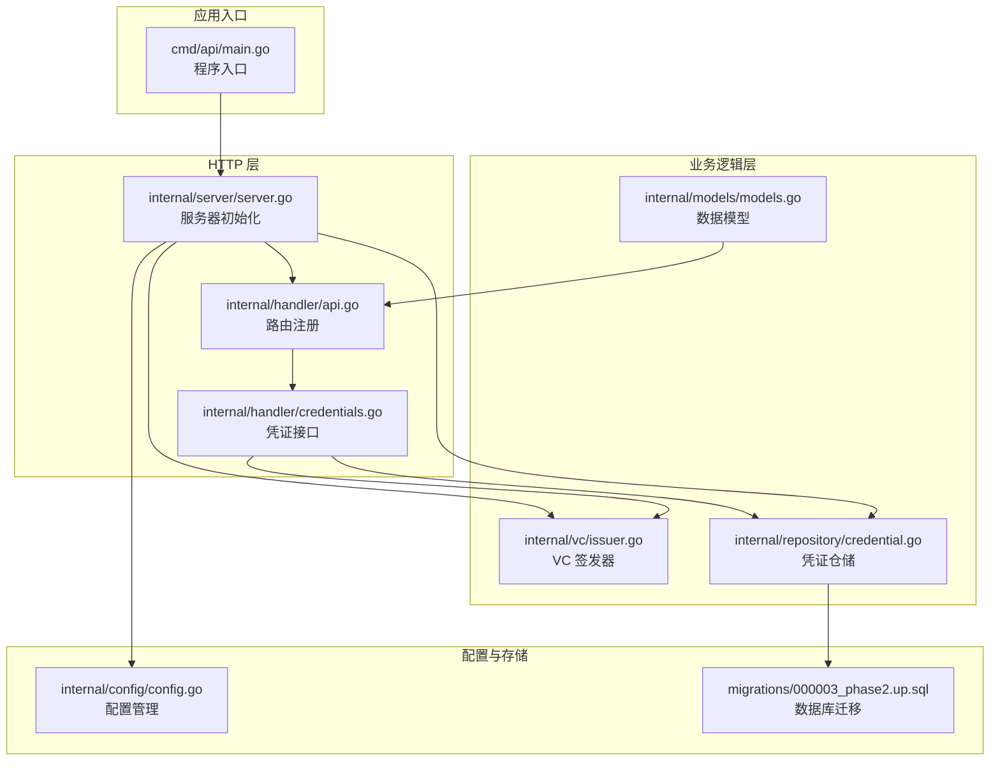
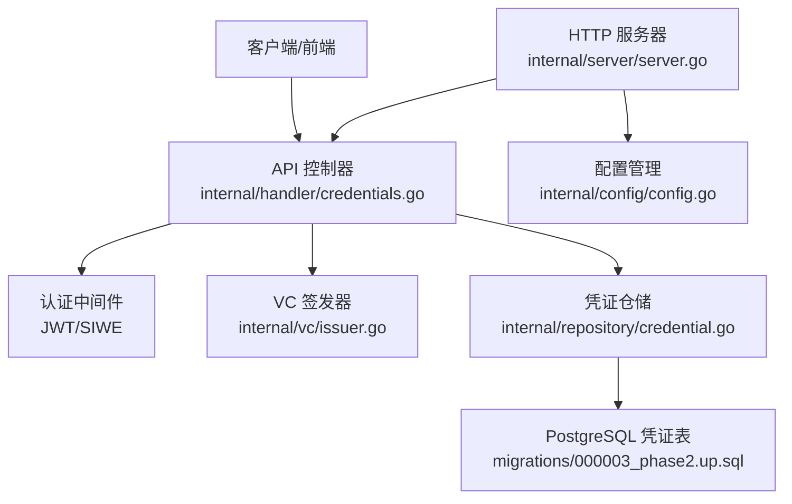
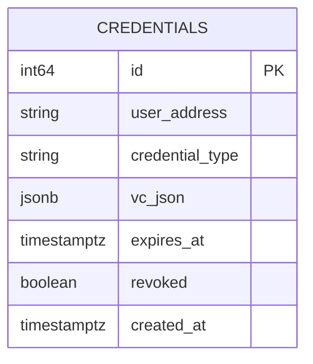
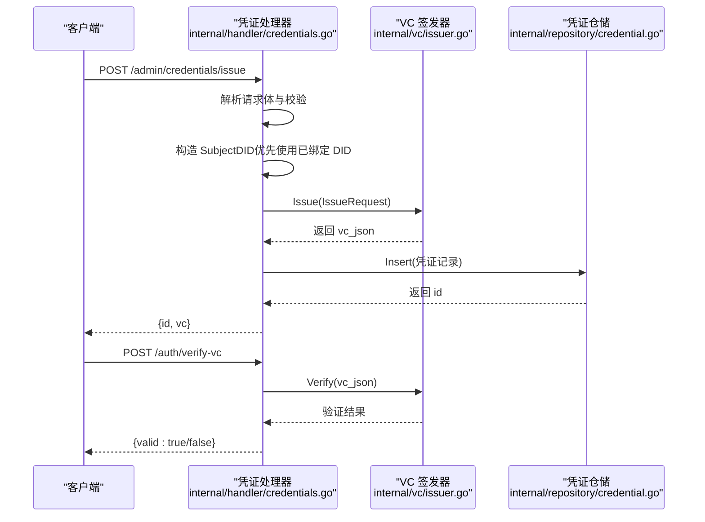
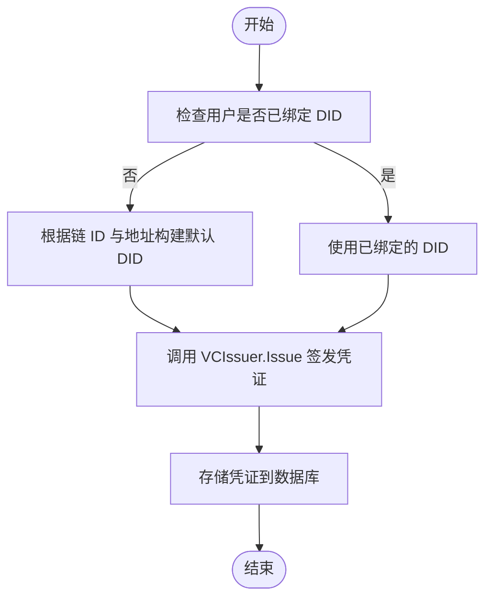
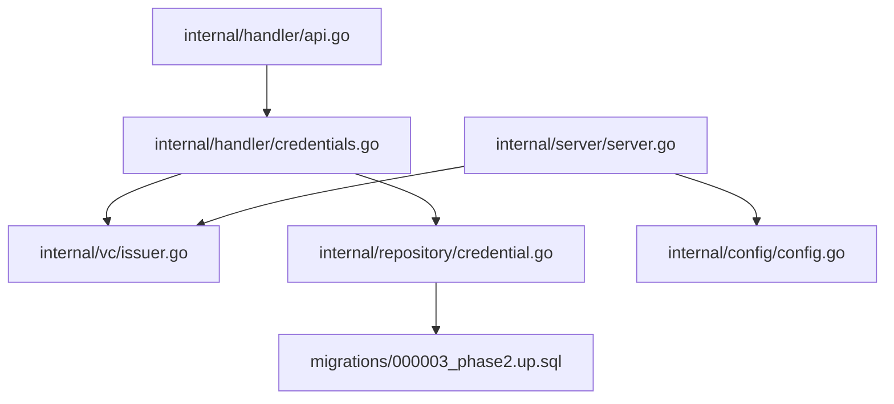

# 可验证凭证模块

<cite>
**本文档引用的文件**
- [internal/vc/issuer.go](file://internal/vc/issuer.go)
- [internal/handler/credentials.go](file://internal/handler/credentials.go)
- [internal/repository/credential.go](file://internal/repository/credential.go)
- [internal/server/server.go](file://internal/server/server.go)
- [internal/handler/api.go](file://internal/handler/api.go)
- [internal/config/config.go](file://internal/config/config.go)
- [internal/models/models.go](file://internal/models/models.go)
- [cmd/api/main.go](file://cmd/api/main.go)
- [migrations/000003_phase2.up.sql](file://migrations/000003_phase2.up.sql)
</cite>

## 目录
1. [简介](#简介)
2. [项目结构](#项目结构)
3. [核心组件](#核心组件)
4. [架构概览](#架构概览)
5. [详细组件分析](#详细组件分析)
6. [依赖关系分析](#依赖关系分析)
7. [性能考虑](#性能考虑)
8. [故障排除指南](#故障排除指南)
9. [结论](#结论)
10. [附录](#附录)

## 简介
本文件为 PredictionDIDSimple 项目的可验证凭证（Verifiable Credentials, VC）模块提供全面的技术文档。内容涵盖凭证签发、验证、DID 集成的完整实现，详细说明凭证类型管理、数字签名验证、DID 与凭证关联机制。同时包含具体的代码示例路径，展示凭证申请接口、验证 API、DID 绑定流程；记录凭证存储格式、元数据管理、生命周期控制；解释与 Web3 凭证提供商的集成方式、Mock 实现机制、测试策略；并提供凭证安全最佳实践和隐私保护方案。

## 项目结构
VC 模块在后端项目中的组织方式如下：
- 签发与验证逻辑位于 `internal/vc/issuer.go`，采用 HMAC-SHA256 对凭证 JSON 进行签名，遵循 W3C VC 规范。
- HTTP 接口位于 `internal/handler/credentials.go`，提供管理员颁发凭证、用户查询凭证、凭证验证等 API。
- 数据持久化位于 `internal/repository/credential.go`，使用 PostgreSQL 存储凭证 JSON、类型、过期时间等元数据。
- 服务器初始化在 `internal/server/server.go` 中完成依赖注入，包括 VC 签发器的创建。
- 配置管理位于 `internal/config/config.go`，VC 发行密钥通过环境变量注入。
- 数据模型位于 `internal/models/models.go`，包含用户实体及其 DID 字段。
- 数据库迁移脚本 `migrations/000003_phase2.up.sql` 定义凭证表结构。
- 程序入口 `cmd/api/main.go` 负责应用启动与依赖装配。



**图表来源**
- [cmd/api/main.go:1-161](file://cmd/api/main.go#L1-L161)
- [internal/server/server.go:1-129](file://internal/server/server.go#L1-L129)
- [internal/handler/api.go:1-100](file://internal/handler/api.go#L1-L100)
- [internal/handler/credentials.go:1-115](file://internal/handler/credentials.go#L1-L115)
- [internal/vc/issuer.go:1-142](file://internal/vc/issuer.go#L1-L142)
- [internal/repository/credential.go:1-83](file://internal/repository/credential.go#L1-L83)
- [internal/config/config.go:1-139](file://internal/config/config.go#L1-L139)
- [migrations/000003_phase2.up.sql:29-38](file://migrations/000003_phase2.up.sql#L29-L38)

**章节来源**
- [cmd/api/main.go:1-161](file://cmd/api/main.go#L1-L161)
- [internal/server/server.go:1-129](file://internal/server/server.go#L1-L129)
- [internal/handler/api.go:1-100](file://internal/handler/api.go#L1-L100)
- [internal/handler/credentials.go:1-115](file://internal/handler/credentials.go#L1-L115)
- [internal/vc/issuer.go:1-142](file://internal/vc/issuer.go#L1-L142)
- [internal/repository/credential.go:1-83](file://internal/repository/credential.go#L1-L83)
- [internal/config/config.go:1-139](file://internal/config/config.go#L1-L139)
- [migrations/000003_phase2.up.sql:29-38](file://migrations/000003_phase2.up.sql#L29-L38)

## 核心组件
- VC 签发器（Issuer）：负责构建符合 W3C 规范的凭证结构，添加 issuer、issuanceDate、expirationDate、credentialSubject 等字段，并使用 HMAC-SHA256 生成 proofValue 签名。
- 凭证仓储（CredentialRepo）：提供凭证的插入、按用户查询、有效性判断等数据库操作。
- 凭证 HTTP 处理器：暴露管理员颁发凭证、用户查询凭证、凭证验证等接口。
- 服务器依赖注入：在服务启动时创建 VC 签发器实例并注入到 API 处理器。
- 配置管理：从环境变量读取 VC 发行密钥，确保生产环境的安全性。

**章节来源**
- [internal/vc/issuer.go:15-81](file://internal/vc/issuer.go#L15-L81)
- [internal/repository/credential.go:24-82](file://internal/repository/credential.go#L24-L82)
- [internal/handler/credentials.go:24-114](file://internal/handler/credentials.go#L24-L114)
- [internal/server/server.go:78-90](file://internal/server/server.go#L78-L90)
- [internal/config/config.go:38](file://internal/config/config.go#L38)

## 架构概览
VC 模块采用分层架构，职责清晰分离：
- 表现层：HTTP 路由与控制器，负责请求解析、权限校验、调用业务逻辑并返回响应。
- 业务层：VC 签发器与仓储层，封装凭证签发、验证、存储与查询逻辑。
- 数据层：PostgreSQL 凭证表，存储凭证 JSON、类型、过期时间、撤销状态等元数据。
- 配置层：环境变量驱动的密钥与参数配置，确保部署灵活性与安全性。



**图表来源**
- [internal/handler/credentials.go:24-114](file://internal/handler/credentials.go#L24-L114)
- [internal/vc/issuer.go:41-81](file://internal/vc/issuer.go#L41-L81)
- [internal/repository/credential.go:34-67](file://internal/repository/credential.go#L34-L67)
- [migrations/000003_phase2.up.sql:29-38](file://migrations/000003_phase2.up.sql#L29-L38)
- [internal/server/server.go:78-90](file://internal/server/server.go#L78-L90)
- [internal/config/config.go:38](file://internal/config/config.go#L38)

## 详细组件分析

### VC 签发器（Issuer）
- 功能概述
  - 构建符合 W3C Verifiable Credential 规范的凭证 JSON 结构。
  - 使用 HMAC-SHA256 对凭证 JSON 进行签名，生成 proofValue。
  - 提供凭证验证方法，检查签名与过期时间。
  - 提供从凭证主体声明中提取地区信息的辅助方法。
- 关键实现要点
  - IssueRequest 结构体包含 SubjectDID、Type、Claims、TTL 等字段。
  - Issue 方法默认一年有效期，将 SubjectDID 注入 Claims，并生成 proof。
  - Verify 方法删除 proof 后重新计算签名并与原签名比对，同时检查 expirationDate。
  - SubjectRegion 从 credentialSubject 中提取 region 字段并统一为大写。
- 复杂度分析
  - Issue/Verify 时间复杂度为 O(n)，n 为凭证 JSON 字节长度；空间复杂度 O(n)。
  - HMAC-SHA256 计算为 O(n)，常数因子较小，性能开销主要来自 JSON 序列化/反序列化。

```mermaid
classDiagram
class Issuer {
-string key
+Issue(req) json.RawMessage
+Verify(raw) error
-sign(payload) string
}
class IssueRequest {
+string SubjectDID
+string Type
+map~string,interface{}~ Claims
+duration TTL
}
Issuer --> IssueRequest : "接收签发请求"
```

**图表来源**
- [internal/vc/issuer.go:15-81](file://internal/vc/issuer.go#L15-L81)
- [internal/vc/issuer.go:28-35](file://internal/vc/issuer.go#L28-L35)

**章节来源**
- [internal/vc/issuer.go:15-142](file://internal/vc/issuer.go#L15-L142)

### 凭证仓储（CredentialRepo）
- 功能概述
  - 插入新凭证，返回生成的 ID。
  - 按用户查询有效凭证（未撤销且未过期）。
  - 判断用户是否持有某类型的有效凭证。
- 数据模型
  - Credential 结构体包含 id、user_address、credential_type、vc_json、expires_at、revoked、created_at。
- SQL 查询要点
  - 查询时使用 LOWER(user_address) 进行大小写不敏感匹配，并过滤 revoked=false 与 expires_at > NOW()。
  - 使用 EXISTS 查询快速判断凭证类型存在性。



**图表来源**
- [migrations/000003_phase2.up.sql:29-38](file://migrations/000003_phase2.up.sql#L29-L38)

**章节来源**
- [internal/repository/credential.go:13-82](file://internal/repository/credential.go#L13-L82)
- [migrations/000003_phase2.up.sql:29-38](file://migrations/000003_phase2.up.sql#L29-L38)

### 凭证 HTTP 处理器
- 管理员颁发凭证（POST /admin/credentials/issue）
  - 请求体包含 address、credential_type、claims、ttl_hours。
  - 校验必填字段，构造 DID（优先使用已绑定的 DID）。
  - 调用 VCIssuer.Issue 生成凭证 JSON，存储到数据库并返回 id 与 vc。
- 用户查询凭证（GET /users/me/credentials）
  - 从 JWT 中获取当前用户地址，查询其有效凭证列表。
- 凭证验证（POST /auth/verify-vc）
  - 校验签名与过期时间；若请求包含 region，则额外校验凭证主体声明中的地区字段。



**图表来源**
- [internal/handler/credentials.go:24-114](file://internal/handler/credentials.go#L24-L114)
- [internal/vc/issuer.go:41-81](file://internal/vc/issuer.go#L41-L81)
- [internal/repository/credential.go:34-43](file://internal/repository/credential.go#L34-L43)

**章节来源**
- [internal/handler/credentials.go:24-114](file://internal/handler/credentials.go#L24-L114)

### DID 与凭证关联机制
- DID 构建规则
  - 默认 DID 格式：did:pkh:eip155:{chainID}:{address}。
  - 若用户已绑定 DID，则优先使用已绑定的 DID。
- 用户绑定流程
  - 绑定接口位于 /users/bind-did，结合 SIWE 钱包签名与配置的链 ID 进行校验。
  - 绑定成功后，后续颁发凭证将使用该 DID 作为主体标识。
- 与 Web3 凭证提供商的集成
  - 项目当前使用自研的 HMAC-SHA256 签名方案，而非标准的 JWK/Web5/DID-Web。
  - 如需对接标准 DID-Web/JWK，可在 VCIssuer 中扩展签名算法与验证逻辑。



**图表来源**
- [internal/handler/credentials.go:42-53](file://internal/handler/credentials.go#L42-L53)
- [internal/models/models.go:57-62](file://internal/models/models.go#L57-L62)

**章节来源**
- [internal/handler/credentials.go:42-53](file://internal/handler/credentials.go#L42-L53)
- [internal/models/models.go:57-62](file://internal/models/models.go#L57-L62)

### 凭证类型管理与生命周期控制
- 凭证类型管理
  - 凭证类型通过 IssueRequest.Type 字段指定，如 KYCVerification 等。
  - 仓储层提供按类型查询与存在性判断，支持基于类型的访问控制。
- 生命周期控制
  - TTL 通过 IssueRequest.TTL 指定，默认一年；Insert 时将 expires_at 设为当前时间加上 TTL。
  - 查询时自动过滤过期与撤销的凭证，保证只返回有效的凭证集合。
- 存储格式与元数据
  - vc_json 字段存储完整的凭证 JSON；credential_type 记录类型；revoked 标识撤销状态。

**章节来源**
- [internal/vc/issuer.go:30-35](file://internal/vc/issuer.go#L30-L35)
- [internal/repository/credential.go:13-22](file://internal/repository/credential.go#L13-L22)
- [internal/repository/credential.go:34-67](file://internal/repository/credential.go#L34-L67)

### 与 Web3 凭证提供商的集成方式与 Mock 实现
- 集成方式
  - 当前实现采用自定义 HMAC-SHA256 签名，proofValue 与 verificationMethod 为自定义标识。
  - 若需对接标准 DID-Web/JWK，可在 VCIssuer 中扩展签名算法与验证逻辑。
- Mock 实现机制
  - 项目中存在 wcprovider 包，提供 MockProvider 与 DualProvider，用于加载本地 JSON 数据并同步到数据库。
  - 该机制可用于模拟外部数据源，便于凭证场景下的数据准备与测试。
- 测试策略
  - 单元测试：针对 VCIssuer 的 Issue/Verify 方法，覆盖不同 TTL、Claims、过期场景。
  - 集成测试：通过 HTTP 接口调用 /admin/credentials/issue 与 /auth/verify-vc，验证端到端流程。
  - 场景测试：结合 wcprovider 的数据同步，模拟真实业务场景下的凭证发放与验证。

**章节来源**
- [internal/vc/issuer.go:92-124](file://internal/vc/issuer.go#L92-L124)
- [internal/wcprovider/mock.go:1-77](file://internal/wcprovider/mock.go#L1-L77)
- [internal/wcprovider/dual.go:1-144](file://internal/wcprovider/dual.go#L1-L144)

## 依赖关系分析
- 组件耦合
  - API 层依赖 VC 签发器与凭证仓储，耦合度低，便于替换实现。
  - 服务器初始化集中注入 VC 签发器，确保全局一致性。
- 外部依赖
  - 配置模块提供 VC 发行密钥，影响凭证签名与验证的安全性。
  - 数据库迁移脚本定义凭证表结构，约束数据存储格式。
- 循环依赖
  - 未发现循环导入或循环依赖，模块边界清晰。



**图表来源**
- [internal/handler/api.go:34-68](file://internal/handler/api.go#L34-L68)
- [internal/handler/credentials.go:24-114](file://internal/handler/credentials.go#L24-L114)
- [internal/server/server.go:78-90](file://internal/server/server.go#L78-L90)
- [internal/config/config.go:38](file://internal/config/config.go#L38)
- [migrations/000003_phase2.up.sql:29-38](file://migrations/000003_phase2.up.sql#L29-L38)

**章节来源**
- [internal/handler/api.go:34-68](file://internal/handler/api.go#L34-L68)
- [internal/handler/credentials.go:24-114](file://internal/handler/credentials.go#L24-L114)
- [internal/server/server.go:78-90](file://internal/server/server.go#L78-L90)
- [internal/config/config.go:38](file://internal/config/config.go#L38)
- [migrations/000003_phase2.up.sql:29-38](file://migrations/000003_phase2.up.sql#L29-L38)

## 性能考虑
- JSON 序列化/反序列化成本
  - 凭证签发与验证均涉及 JSON 的序列化与反序列化，建议缓存常用凭证或批量处理以降低开销。
- 数据库查询优化
  - 凭证查询使用 LOWER(user_address) 与 expires_at > NOW() 条件，建议在 user_address 上建立索引以提升查询性能。
- 签名算法选择
  - 当前使用 HMAC-SHA256，计算开销较小；若未来扩展至 ECDSA/RSA 等，需评估签名与验证的性能差异。
- 并发与限流
  - 服务器已集成速率限制中间件，建议在高并发场景下配合缓存与异步处理优化吞吐量。

[本节为通用性能讨论，无需具体文件分析]

## 故障排除指南
- 凭证验证失败
  - 检查凭证是否过期：Verify 方法会根据 expirationDate 判断。
  - 检查签名是否正确：Verify 会重新计算签名并与 proofValue 比对。
  - 检查凭证 JSON 格式：确保包含 proof 字段且格式正确。
- 数据库查询异常
  - 确认凭证表结构与迁移脚本一致，字段类型与索引满足查询需求。
  - 检查 user_address 的大小写处理，使用 LOWER 进行不区分大小写的匹配。
- 管理员接口无权限
  - 确认 X-Admin-Key 或 Authorization: Bearer 头是否正确传递。
  - 检查配置中的 AdminAPIKey 是否正确设置。
- DID 绑定失败
  - 确认 SIWE 签名验证通过，且链 ID 与地址匹配。
  - 检查用户是否已绑定 DID，若已绑定则优先使用已绑定的 DID。

**章节来源**
- [internal/vc/issuer.go:92-124](file://internal/vc/issuer.go#L92-L124)
- [internal/repository/credential.go:45-67](file://internal/repository/credential.go#L45-L67)
- [internal/auth/admin.go:10-37](file://internal/auth/admin.go#L10-L37)

## 结论
PredictionDIDSimple 的 VC 模块实现了从凭证签发、验证到存储与查询的完整闭环，采用 HMAC-SHA256 签名与 W3C 规范兼容的数据结构，具备良好的可扩展性与安全性基础。通过明确的分层设计与依赖注入，模块易于维护与演进。建议在未来版本中引入标准 DID-Web/JWK 方案，并完善凭证撤销与审计日志功能，以进一步增强合规性与安全性。

[本节为总结性内容，无需具体文件分析]

## 附录

### API 定义与示例路径
- 管理员颁发凭证
  - 方法与路径：POST /admin/credentials/issue
  - 请求体字段：address、credential_type、claims、ttl_hours
  - 示例路径：[凭证颁发接口实现:24-71](file://internal/handler/credentials.go#L24-L71)
- 用户查询凭证
  - 方法与路径：GET /users/me/credentials
  - 示例路径：[凭证查询接口实现:73-82](file://internal/handler/credentials.go#L73-L82)
- 凭证验证
  - 方法与路径：POST /auth/verify-vc
  - 请求体字段：vc_json、credential_type、region
  - 示例路径：[凭证验证接口实现:91-114](file://internal/handler/credentials.go#L91-L114)

**章节来源**
- [internal/handler/credentials.go:24-114](file://internal/handler/credentials.go#L24-L114)

### 配置项参考
- VC 发行密钥：VC_ISSUER_KEY（通过环境变量注入）
- 管理员 API 密钥：ADMIN_API_KEY
- 示例路径：[配置加载与默认值](file://internal/config/config.go#L38)

**章节来源**
- [internal/config/config.go:38](file://internal/config/config.go#L38)

### 数据库表结构
- 凭证表（credentials）
  - 字段：id、user_address、credential_type、vc_json、expires_at、revoked、created_at
  - 索引：idx_credentials_user（LOWER(user_address)）
  - 示例路径：[数据库迁移定义:29-38](file://migrations/000003_phase2.up.sql#L29-L38)

**章节来源**
- [migrations/000003_phase2.up.sql:29-38](file://migrations/000003_phase2.up.sql#L29-L38)

### 安全最佳实践与隐私保护
- 密钥管理
  - VC 发行密钥通过环境变量注入，避免硬编码；生产环境务必使用强随机密钥。
- 传输安全
  - 建议启用 HTTPS，确保凭证 JSON 在传输过程中的机密性与完整性。
- 最小权限原则
  - 管理员接口仅对授权用户开放，严格校验 X-Admin-Key 或 Bearer Token。
- 隐私保护
  - 凭证主体声明中的敏感信息应最小化，遵循 GDPR 等法规要求。
  - 提供凭证撤销与删除机制，支持用户撤回同意与删除数据。
- 审计与监控
  - 记录凭证签发与验证的日志，便于审计与异常追踪。
  - 监控凭证过期与撤销状态，及时清理无效凭证。

[本节为通用安全与隐私指导，无需具体文件分析]