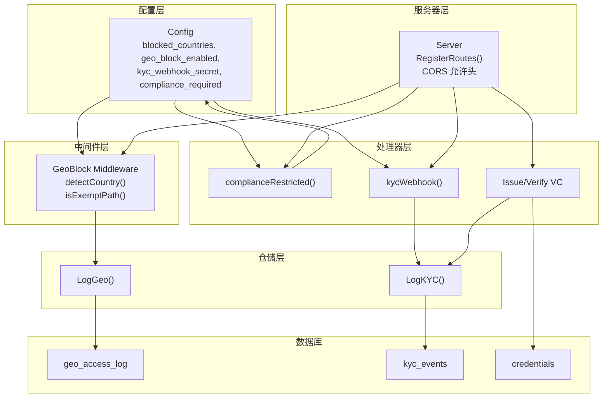
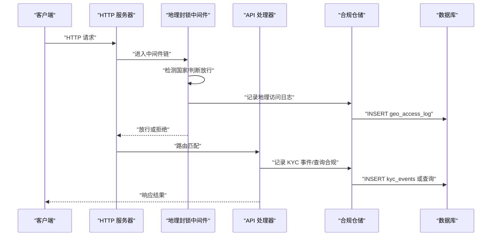
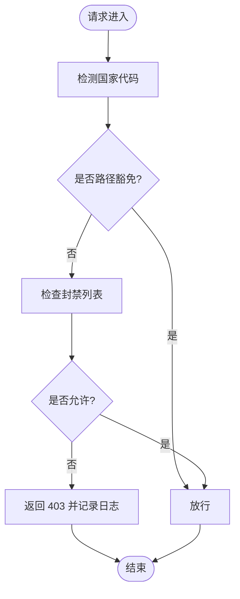
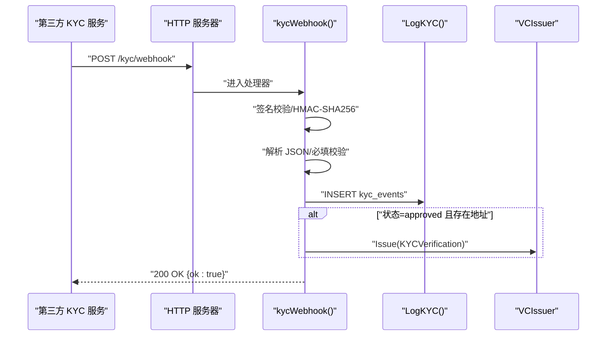
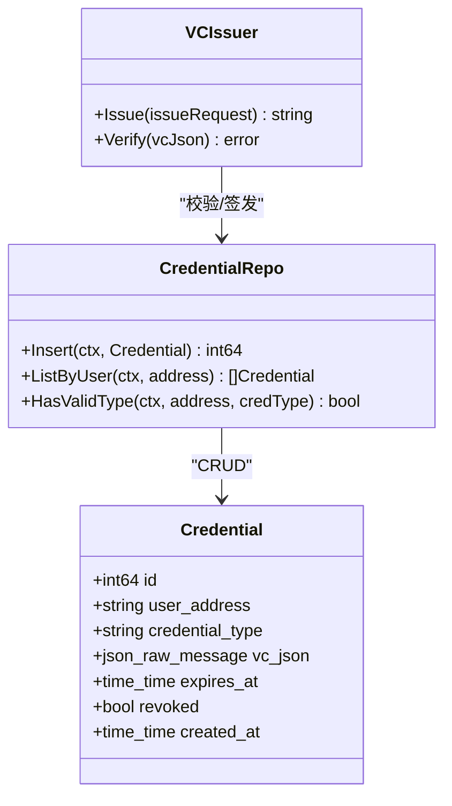
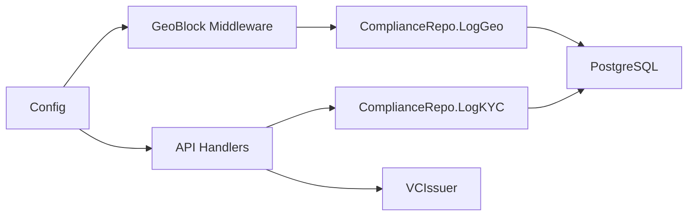

# 合规与KYC模块

<cite>
**本文档引用的文件**
- [internal/handler/kyc.go](file://internal/handler/kyc.go)
- [internal/handler/compliance.go](file://internal/handler/compliance.go)
- [internal/middleware/geo.go](file://internal/middleware/geo.go)
- [internal/repository/compliance.go](file://internal/repository/compliance.go)
- [internal/config/config.go](file://internal/config/config.go)
- [internal/server/server.go](file://internal/server/server.go)
- [internal/models/models.go](file://internal/models/models.go)
- [internal/handler/credentials.go](file://internal/handler/credentials.go)
- [internal/repository/credential.go](file://internal/repository/credential.go)
- [migrations/000001_init.up.sql](file://migrations/000001_init.up.sql)
- [migrations/000003_phase2.up.sql](file://migrations/000003_phase2.up.sql)
</cite>

## 目录
1. [简介](#简介)
2. [项目结构](#项目结构)
3. [核心组件](#核心组件)
4. [架构总览](#架构总览)
5. [详细组件分析](#详细组件分析)
6. [依赖关系分析](#依赖关系分析)
7. [性能考虑](#性能考虑)
8. [故障排除指南](#故障排除指南)
9. [结论](#结论)
10. [附录](#附录)

## 简介
本文件系统性梳理 PredictionDIDSimple 的合规与 KYC 模块，覆盖以下关键能力：
- KYC 流程集成：接收第三方 KYC 服务回调、签名校验、状态落库、自动颁发 KYC VC。
- 地理位置限制：基于请求头的国家识别、地理封锁中间件、访问日志记录。
- 合规检查机制：合规状态查询接口、合规要求开关、环境隔离。
- 身份验证与凭证：可验证凭证（VC）签发与校验、凭证存储与查询。
- 监管报告与审计：地理访问日志、KYC 事件日志、审计追踪字段。
- 外部服务集成：Cloudflare 国家头、第三方 KYC Webhook、VC 颁发器。
- 自动化审批流程：通过状态驱动的自动 VC 颁发。

本模块通过配置驱动实现灵活部署，支持开发与生产环境差异，并提供完善的错误处理与安全校验。

## 项目结构
合规与 KYC 相关代码分布在以下层次：
- 配置层：集中管理地理封锁、合规要求、KYC Webhook 密钥等。
- 中间件层：地理封锁中间件，统一拦截与审计。
- 仓储层：地理访问日志与 KYC 事件入库。
- 处理器层：合规状态查询、KYC 回调处理、VC 签发与校验。
- 服务器层：路由注册、CORS 配置、依赖注入。
- 数据模型：用户、凭证等基础模型。
- 数据库迁移：geo_access_log、kyc_events、credentials 表结构。

图表来源
- [internal/config/config.go:12-46](file://internal/config/config.go#L12-L46)
- [internal/middleware/geo.go:12-64](file://internal/middleware/geo.go#L12-L64)
- [internal/server/server.go:44-102](file://internal/server/server.go#L44-L102)
- [internal/handler/compliance.go:9-29](file://internal/handler/compliance.go#L9-L29)
- [internal/handler/kyc.go:16-66](file://internal/handler/kyc.go#L16-L66)
- [internal/repository/compliance.go:21-35](file://internal/repository/compliance.go#L21-L35)
- [migrations/000001_init.up.sql:1-10](file://migrations/000001_init.up.sql#L1-L10)
- [migrations/000003_phase2.up.sql:29-38](file://migrations/000003_phase2.up.sql#L29-L38)

章节来源
- [internal/config/config.go:48-104](file://internal/config/config.go#L48-L104)
- [internal/middleware/geo.go:12-64](file://internal/middleware/geo.go#L12-L64)
- [internal/server/server.go:44-102](file://internal/server/server.go#L44-L102)
- [internal/handler/compliance.go:9-29](file://internal/handler/compliance.go#L9-L29)
- [internal/handler/kyc.go:16-66](file://internal/handler/kyc.go#L16-L66)
- [internal/repository/compliance.go:21-35](file://internal/repository/compliance.go#L21-L35)
- [migrations/000001_init.up.sql:1-10](file://migrations/000001_init.up.sql#L1-L10)
- [migrations/000003_phase2.up.sql:29-38](file://migrations/000003_phase2.up.sql#L29-L38)

## 核心组件
- 配置管理：集中管理地理封锁开关、封禁国家列表、合规要求开关、KYC Webhook 密钥、运行环境等。
- 地理封锁中间件：基于请求头识别国家，判断是否放行，记录审计日志。
- 合规状态查询：返回国家代码、是否受限、是否要求合规、运行环境等。
- KYC 回调处理：签名校验、负载解析、必填字段校验、事件入库、自动颁发 KYC VC。
- 凭证管理：VC 签发、校验、存储与查询。
- 数据仓储：地理访问日志与 KYC 事件入库。

章节来源
- [internal/config/config.go:12-46](file://internal/config/config.go#L12-L46)
- [internal/middleware/geo.go:12-64](file://internal/middleware/geo.go#L12-L64)
- [internal/handler/compliance.go:9-29](file://internal/handler/compliance.go#L9-L29)
- [internal/handler/kyc.go:16-66](file://internal/handler/kyc.go#L16-L66)
- [internal/repository/compliance.go:21-35](file://internal/repository/compliance.go#L21-L35)

## 架构总览
合规与 KYC 模块采用“配置驱动 + 中间件拦截 + 处理器编排 + 仓储持久化”的分层设计。服务器启动时注册路由与中间件，中间件负责地理封锁与审计日志，处理器负责业务逻辑，仓储负责数据持久化。

图表来源
- [internal/server/server.go:44-102](file://internal/server/server.go#L44-L102)
- [internal/middleware/geo.go:12-64](file://internal/middleware/geo.go#L12-L64)
- [internal/repository/compliance.go:21-35](file://internal/repository/compliance.go#L21-L35)

## 详细组件分析

### 地理位置限制与封锁
- 国家识别：优先读取 Cloudflare 注入的国家头，其次读取自定义头，最后回退为 UNKNOWN。
- 路径豁免：健康检查、就绪检查、指标、合规查询、事件流等路径始终放行。
- 封禁判定：根据配置的封禁国家列表进行判断，记录审计日志后返回 403。
- 审计日志：记录 IP、国家代码、路径、是否允许，便于监管审计。

图表来源
- [internal/middleware/geo.go:12-64](file://internal/middleware/geo.go#L12-L64)

章节来源
- [internal/middleware/geo.go:12-64](file://internal/middleware/geo.go#L12-L64)

### 合规状态查询
- 接口：/compliance/restricted
- 功能：返回当前请求者所在国家、是否受限、是否要求合规、运行环境。
- 数据来源：请求头国家代码 + 配置中的封禁列表与合规开关。

章节来源
- [internal/handler/compliance.go:9-29](file://internal/handler/compliance.go#L9-L29)
- [internal/config/config.go:40-46](file://internal/config/config.go#L40-L46)

### KYC 回调集成
- 接口：/kyc/webhook
- 安全：支持可选的 Webhook 密钥，使用 HMAC-SHA256 进行签名校验。
- 负载：external_id、user_address、status 三要素必填。
- 处理：写入 kyc_events；当状态为 approved 且提供 user_address 时，自动颁发 KYC VC。
- 响应：成功返回 {"ok": "true"}。

图表来源
- [internal/handler/kyc.go:16-66](file://internal/handler/kyc.go#L16-L66)
- [internal/repository/compliance.go:29-35](file://internal/repository/compliance.go#L29-L35)

章节来源
- [internal/handler/kyc.go:16-66](file://internal/handler/kyc.go#L16-L66)
- [internal/config/config.go:43-44](file://internal/config/config.go#L43-L44)

### 可验证凭证（VC）管理
- 签发：支持按用户地址或已绑定 DID 签发，支持自定义 TTL。
- 校验：验证签名与过期时间，可选按地区限制校验。
- 存储：credentials 表存储 VC 原始 JSON、类型、过期时间、创建时间与撤销状态。
- 查询：按用户地址查询有效凭证（未撤销且未过期）。

图表来源
- [internal/repository/credential.go:13-82](file://internal/repository/credential.go#L13-L82)
- [internal/handler/credentials.go:35-114](file://internal/handler/credentials.go#L35-L114)

章节来源
- [internal/handler/credentials.go:35-114](file://internal/handler/credentials.go#L35-L114)
- [internal/repository/credential.go:13-82](file://internal/repository/credential.go#L13-L82)

### 数据模型与表结构
- 用户模型：包含钱包地址与可选 DID。
- 凭证模型：包含用户地址、凭证类型、VC JSON、过期时间、撤销状态等。
- 数据库迁移：初始化 schema_meta；凭证表结构与索引。

章节来源
- [internal/models/models.go:57-63](file://internal/models/models.go#L57-L63)
- [migrations/000001_init.up.sql:1-10](file://migrations/000001_init.up.sql#L1-L10)
- [migrations/000003_phase2.up.sql:29-38](file://migrations/000003_phase2.up.sql#L29-L38)

## 依赖关系分析
- 服务器层依赖配置、中间件、处理器与仓储，统一注册路由与 CORS。
- 中间件依赖配置进行地理封锁判断，并回调仓储记录日志。
- 处理器依赖配置进行合规与 KYC Webhook 密钥校验，依赖仓储进行数据持久化，依赖 VC 颁发器进行凭证签发。
- 仓储依赖数据库连接池执行 SQL。

图表来源
- [internal/server/server.go:44-102](file://internal/server/server.go#L44-L102)
- [internal/middleware/geo.go:12-64](file://internal/middleware/geo.go#L12-L64)
- [internal/handler/kyc.go:16-66](file://internal/handler/kyc.go#L16-L66)
- [internal/repository/compliance.go:21-35](file://internal/repository/compliance.go#L21-L35)

章节来源
- [internal/server/server.go:44-102](file://internal/server/server.go#L44-L102)
- [internal/middleware/geo.go:12-64](file://internal/middleware/geo.go#L12-L64)
- [internal/handler/kyc.go:16-66](file://internal/handler/kyc.go#L16-L66)
- [internal/repository/compliance.go:21-35](file://internal/repository/compliance.go#L21-L35)

## 性能考虑
- 中间件拦截成本低：仅做国家识别与封禁判断，避免昂贵操作。
- 日志异步化：中间件回调仓储记录日志，可在后台异步处理。
- 请求体限制：KYC 回调接口限制最大读取大小，防止异常流量。
- 速率限制：全局中间件限制每分钟请求数，缓解突发流量。
- 数据库索引：凭证表按用户地址建立索引，提升查询效率。

## 故障排除指南
- KYC 回调 401 无效签名：确认 X-KYC-Signature 头与配置的密钥一致，检查 HMAC-SHA256 计算。
- KYC 回调 400 缺少字段：确保回调负载包含 external_id 与 status。
- 地理封锁 403：检查请求头 CF-IPCountry 或 X-Country-Code，确认国家是否在封禁列表。
- 合规查询返回 UNKNOWN：上游未注入国家头时会回退为 UNKNOWN，需确保网关或代理正确传递国家头。
- VC 校验失败：检查凭证是否过期、签名是否有效、是否满足地区限制。
- 数据库连接失败：检查 DATABASE_URL 与连接池配置。

章节来源
- [internal/handler/kyc.go:24-50](file://internal/handler/kyc.go#L24-L50)
- [internal/middleware/geo.go:17-36](file://internal/middleware/geo.go#L17-L36)
- [internal/handler/compliance.go:10-28](file://internal/handler/compliance.go#L10-L28)
- [internal/handler/credentials.go:92-114](file://internal/handler/credentials.go#L92-L114)

## 结论
本合规与 KYC 模块通过配置驱动实现了灵活的地理封锁、合规状态查询与 KYC 回调处理，并结合 VC 管理形成完整的合规闭环。模块具备良好的扩展性与安全性，适合在多环境部署中满足不同监管要求。

## 附录

### 配置项说明
- GEO_BLOCK_ENABLED：是否启用地理封锁。
- BLOCKED_COUNTRIES：封禁国家列表（逗号分隔）。
- KYC_WEBHOOK_SECRET：KYC 回调签名校验密钥（可选）。
- COMPLIANCE_REQUIRED：是否要求合规审查。
- APP_ENV：运行环境（development/production）。

章节来源
- [internal/config/config.go:75-79](file://internal/config/config.go#L75-L79)
- [internal/config/config.go:82-87](file://internal/config/config.go#L82-L87)
- [internal/config/config.go:108-117](file://internal/config/config.go#L108-L117)

### 数据导出与监管报告
- 地理访问日志：geo_access_log 表记录 IP、国家代码、路径、是否允许。
- KYC 事件：kyc_events 表记录 external_id、user_address、status、原始 JSON。
- 凭证审计：credentials 表记录 VC 类型、过期时间、撤销状态，可用于合规审计。

章节来源
- [internal/repository/compliance.go:21-35](file://internal/repository/compliance.go#L21-L35)
- [migrations/000001_init.up.sql:1-10](file://migrations/000001_init.up.sql#L1-L10)
- [migrations/000003_phase2.up.sql:29-38](file://migrations/000003_phase2.up.sql#L29-L38)

### 与外部服务集成要点
- Cloudflare 国家头：优先使用 CF-IPCountry，其次 X-Country-Code。
- 第三方 KYC：通过 /kyc/webhook 接收回调，支持签名校验。
- VC 颁发：通过 VCIssuer 对外提供 KYCVerification 凭证。

章节来源
- [internal/middleware/geo.go:53-63](file://internal/middleware/geo.go#L53-L63)
- [internal/handler/kyc.go:24-36](file://internal/handler/kyc.go#L24-L36)
- [internal/handler/credentials.go:47-57](file://internal/handler/credentials.go#L47-L57)

### 合规运营指南与监管要求满足方案
- 运营指南
  - 在生产环境启用 GEO_BLOCK_ENABLED，并维护 BLOCKED_COUNTRIES。
  - 为 KYC 回调配置 KYC_WEBHOOK_SECRET 并严格管理密钥。
  - 使用 /compliance/restricted 接口向客户端暴露合规状态。
  - 定期导出 geo_access_log 与 kyc_events 用于审计。
- 监管要求满足
  - 地理限制：通过中间件强制封禁指定国家。
  - 审计日志：保留完整的访问与 KYC 事件日志。
  - 凭证管理：VC 签发与校验可追溯，支持撤销与过期控制。
  - 环境隔离：通过 APP_ENV 区分开发与生产，便于合规测试与上线。

章节来源
- [internal/config/config.go:75-79](file://internal/config/config.go#L75-L79)
- [internal/handler/compliance.go:9-29](file://internal/handler/compliance.go#L9-L29)
- [internal/repository/compliance.go:21-35](file://internal/repository/compliance.go#L21-L35)