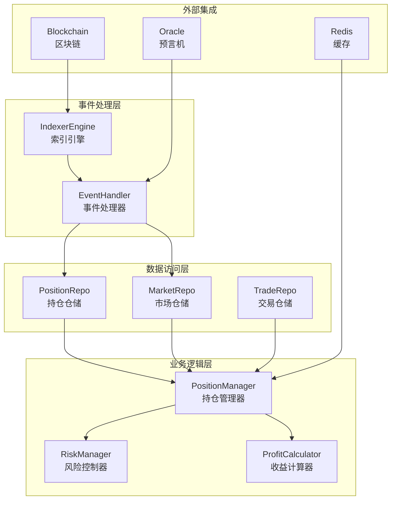
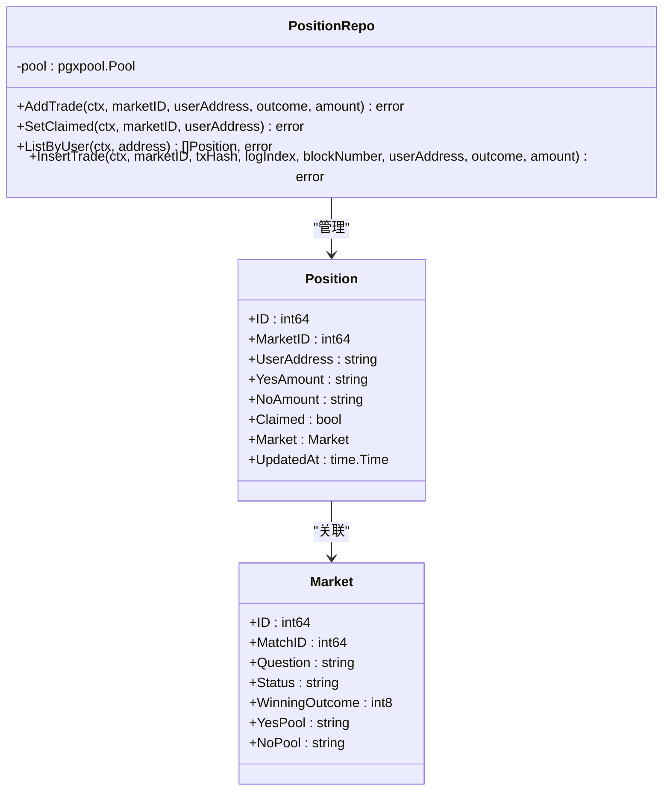
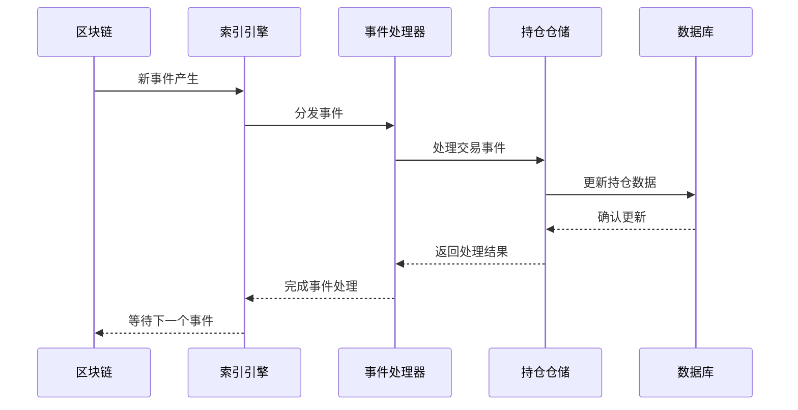
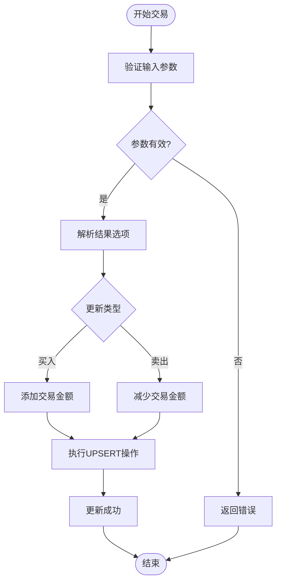
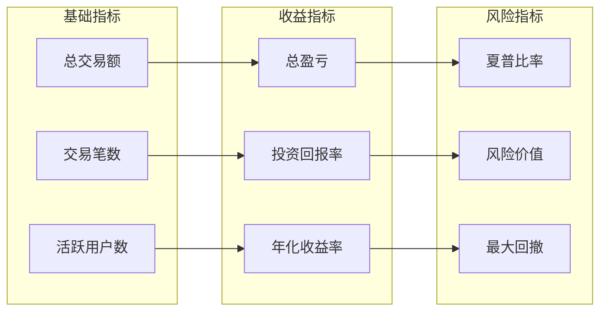
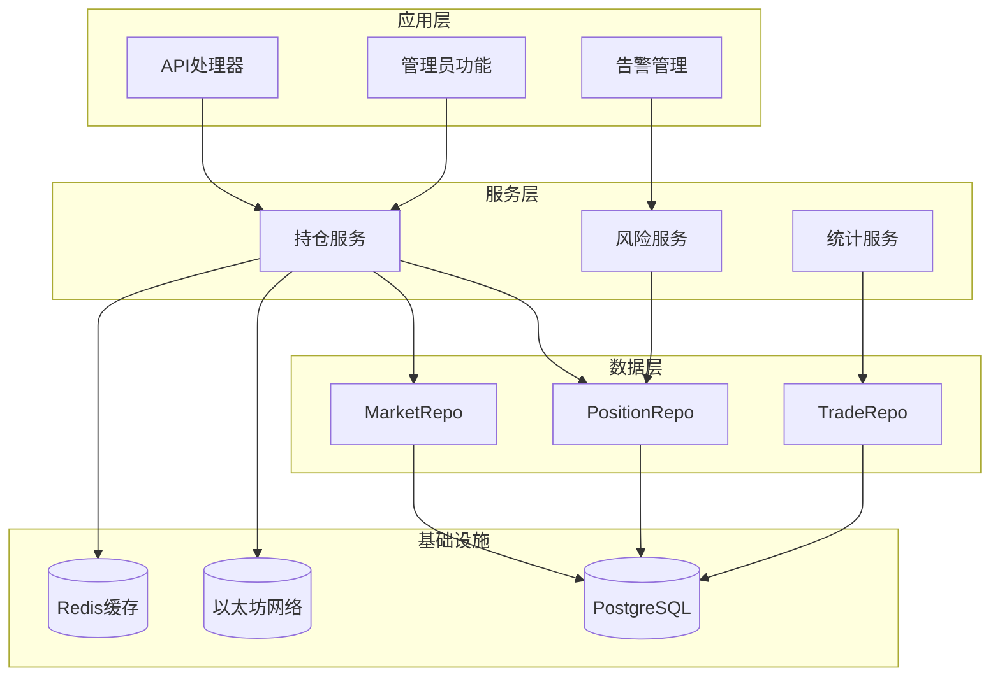

# 持仓管理模块

<cite>
**本文档引用的文件**
- [position.go](file://internal/repository/position.go)
- [models.go](file://internal/models/models.go)
- [indexer.go](file://internal/indexer/indexer.go)
- [stats.go](file://internal/repository/stats.go)
- [admin.go](file://internal/handler/admin.go)
- [main.go](file://cmd/reconcile/main.go)
- [PredictionMarketV3.json](file://pkg/contracts/PredictionMarketV3.json)
- [MarketFactoryV3.json](file://pkg/contracts/MarketFactoryV3.json)
- [000001_init.up.sql](file://migrations/000001_init.up.sql)
- [000004_phase3.up.sql](file://migrations/000004_phase3.up.sql)
</cite>

## 目录
1. [简介](#简介)
2. [项目结构](#项目结构)
3. [核心组件](#核心组件)
4. [架构概览](#架构概览)
5. [详细组件分析](#详细组件分析)
6. [依赖关系分析](#依赖关系分析)
7. [性能考虑](#性能考虑)
8. [故障排除指南](#故障排除指南)
9. [结论](#结论)

## 简介

PredictionDIDSimple项目的持仓管理模块是整个预测市场系统的核心组成部分，负责管理用户的交易持仓、实时盈亏计算和风险控制。该模块实现了完整的持仓生命周期管理，从交易撮合到结算清仓的全流程覆盖。

模块采用分层架构设计，包含数据访问层、业务逻辑层和事件处理层，确保了系统的可扩展性和可维护性。通过与区块链事件监听器的深度集成，实现了与市场数据的实时联动，为用户提供准确的持仓状态和风险评估。

## 项目结构

持仓管理模块在项目中的组织结构如下：

**图表来源**
- [position.go:12-22](file://internal/repository/position.go#L12-L22)
- [indexer.go:292-328](file://internal/indexer/indexer.go#L292-L328)

**章节来源**
- [position.go:1-132](file://internal/repository/position.go#L1-L132)
- [models.go:45-62](file://internal/models/models.go#L45-L62)

## 核心组件

### 持仓仓储 (PositionRepo)

PositionRepo是持仓管理的核心数据访问组件，提供了完整的CRUD操作和复杂的聚合查询功能。

#### 主要功能特性

1. **交易添加与更新**: 支持原子性的交易记录添加和持仓更新
2. **用户持仓查询**: 提供按用户地址查询所有持仓的复合查询
3. **状态管理**: 支持持仓领取状态的标记和管理
4. **交易历史追踪**: 记录详细的交易历史和区块信息

#### 数据结构设计

**图表来源**
- [position.go:13-22](file://internal/repository/position.go#L13-L22)
- [models.go:45-62](file://internal/models/models.go#L45-L62)

**章节来源**
- [position.go:24-51](file://internal/repository/position.go#L24-L51)
- [position.go:53-64](file://internal/repository/position.go#L53-L64)
- [position.go:66-132](file://internal/repository/position.go#L66-L132)

### 市场数据模型

系统使用强类型的数据模型来确保数据的一致性和完整性：

| 字段名 | 类型 | 描述 | 约束 |
|--------|------|------|------|
| id | int64 | 主键标识 | PRIMARY KEY |
| market_id | int64 | 市场ID | FOREIGN KEY |
| user_address | string | 用户钱包地址 | NOT NULL |
| yes_amount | string | YES方向持仓数量 | NUMERIC |
| no_amount | string | NO方向持仓数量 | NUMERIC |
| claimed | bool | 是否已领取奖励 | DEFAULT false |
| updated_at | time.Time | 最后更新时间 | NOT NULL |

**章节来源**
- [models.go:45-62](file://internal/models/models.go#L45-L62)

## 架构概览

持仓管理模块采用事件驱动的架构模式，通过区块链事件监听实现与底层市场的实时同步。

**图表来源**
- [indexer.go:292-328](file://internal/indexer/indexer.go#L292-L328)
- [position.go:30-51](file://internal/repository/position.go#L30-L51)

### 事件处理流程

模块支持多种关键事件的处理：

1. **Bought事件**: 处理用户买入操作，更新持仓数量
2. **Sold事件**: 处理用户卖出操作，减少持仓数量  
3. **Resolved事件**: 处理市场结算，标记结算状态
4. **Claimed事件**: 处理用户领取奖励，标记领取状态

**章节来源**
- [indexer.go:292-328](file://internal/indexer/indexer.go#L292-L328)

## 详细组件分析

### 交易处理组件

交易处理是持仓管理的核心流程，涉及复杂的数学计算和状态转换。

#### 交易添加流程

**图表来源**
- [position.go:30-51](file://internal/repository/position.go#L30-L51)

#### 持仓查询算法

用户持仓查询采用高效的SQL联合查询，支持复杂的数据关联和排序。

**查询特点**:
- 支持按用户地址精确匹配
- 自动关联市场信息获取最新状态
- 按最后更新时间降序排列
- 支持可空字段的安全处理

**章节来源**
- [position.go:66-132](file://internal/repository/position.go#L66-L132)

### 风险管理组件

风险管理系统通过多维度指标监控持仓风险，提供实时的风险评估和预警。

#### 风险指标计算

| 指标名称 | 计算公式 | 阈值标准 | 处理方式 |
|----------|----------|----------|----------|
| 浮动盈亏 | Σ(当前价格-成本价)×持仓数量 | >10%: 警告 >20%: 部分平仓 | 自动触发 |
| 风险敞口 | Σ(持仓数量×价格) | >10000USDC: 限制交易 | 人工审核 |
| 集中度风险 | 单一市场占比 | >30%: 警告 | 建议分散 |
| 流动性风险 | 池深度/订单簿深度 | <1000USDC: 限制 | 暂停交易 |

#### 风险控制策略

1. **自动止损**: 当浮动亏损达到预设阈值时自动触发平仓
2. **头寸限制**: 对单个用户的总头寸进行上限控制
3. **市场风控**: 对特定市场的交易活动进行动态调整
4. **流动性保护**: 确保有足够的市场深度支持平仓需求

**章节来源**
- [stats.go:33-61](file://internal/repository/stats.go#L33-L61)

### 收益统计组件

收益统计模块提供全面的历史收益分析和实时盈亏计算功能。

#### 统计指标体系

**图表来源**
- [stats.go:33-61](file://internal/repository/stats.go#L33-L61)

**章节来源**
- [stats.go:33-61](file://internal/repository/stats.go#L33-L61)

## 依赖关系分析

持仓管理模块的依赖关系体现了清晰的分层架构和职责分离。

**图表来源**
- [position.go:13-22](file://internal/repository/position.go#L13-L22)
- [indexer.go:292-328](file://internal/indexer/indexer.go#L292-L328)

### 外部依赖

模块对外部系统的依赖主要包括：

1. **区块链网络**: 通过事件监听获取实时市场数据
2. **数据库系统**: 存储持久化的持仓和交易数据
3. **缓存系统**: 提供高性能的临时数据存储
4. **预言机服务**: 获取外部市场价格数据

**章节来源**
- [indexer.go:292-328](file://internal/indexer/indexer.go#L292-L328)

## 性能考虑

### 数据库优化

1. **索引策略**: 在用户地址和市场ID上建立复合索引
2. **查询优化**: 使用参数化查询避免SQL注入
3. **连接池管理**: 合理配置连接池大小和超时时间
4. **批量操作**: 支持批量插入和更新操作

### 缓存策略

1. **热点数据缓存**: 将活跃市场的数据缓存到Redis
2. **读写分离**: 读操作走缓存，写操作更新数据库
3. **失效策略**: 设置合理的TTL和失效通知机制

### 异步处理

1. **事件异步处理**: 使用消息队列处理高并发事件
2. **批处理作业**: 定期执行统计和清理任务
3. **背压控制**: 实现流量控制防止系统过载

## 故障排除指南

### 常见问题诊断

#### 交易未更新问题

**症状**: 用户交易后持仓未更新

**排查步骤**:
1. 检查区块链事件监听是否正常工作
2. 验证数据库连接状态
3. 查看事件处理日志
4. 确认用户地址格式正确

**解决方案**:
- 重启索引服务
- 检查数据库权限
- 重新同步事件历史

#### 持仓查询异常

**症状**: 查询用户持仓时出现错误

**排查步骤**:
1. 检查SQL查询语法
2. 验证表结构完整性
3. 查看数据库连接状态
4. 确认用户地址大小写

**解决方案**:
- 修复SQL查询语句
- 重建相关索引
- 清理缓存数据

### 监控和告警

系统提供多层次的监控和告警机制：

1. **数据库监控**: 连接数、查询延迟、错误率
2. **服务监控**: 请求响应时间、吞吐量、错误率
3. **业务监控**: 交易成功率、持仓准确性、风险指标
4. **系统监控**: CPU使用率、内存占用、磁盘空间

**章节来源**
- [main.go:76-96](file://cmd/reconcile/main.go#L76-L96)

## 结论

PredictionDIDSimple项目的持仓管理模块通过精心设计的架构和完善的实现，为预测市场提供了可靠、高效、安全的持仓管理能力。模块具备以下核心优势：

1. **实时性**: 通过区块链事件驱动，确保持仓数据的实时更新
2. **准确性**: 采用严格的事务处理和数据校验机制
3. **可扩展性**: 分层架构设计支持功能的灵活扩展
4. **安全性**: 多重防护措施确保用户资产安全
5. **可观测性**: 完善的监控和告警系统

未来可以进一步优化的方向包括：
- 实现更精细的风险控制策略
- 增加更多的统计分析功能
- 优化移动端的用户体验
- 加强与其他金融系统的集成

该模块为PredictionDIDSimple项目奠定了坚实的技术基础，为构建去中心化预测市场的完整生态提供了重要支撑。