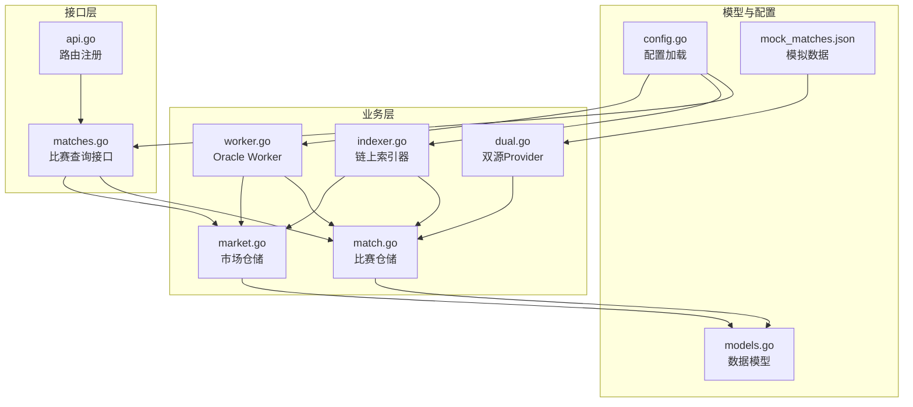
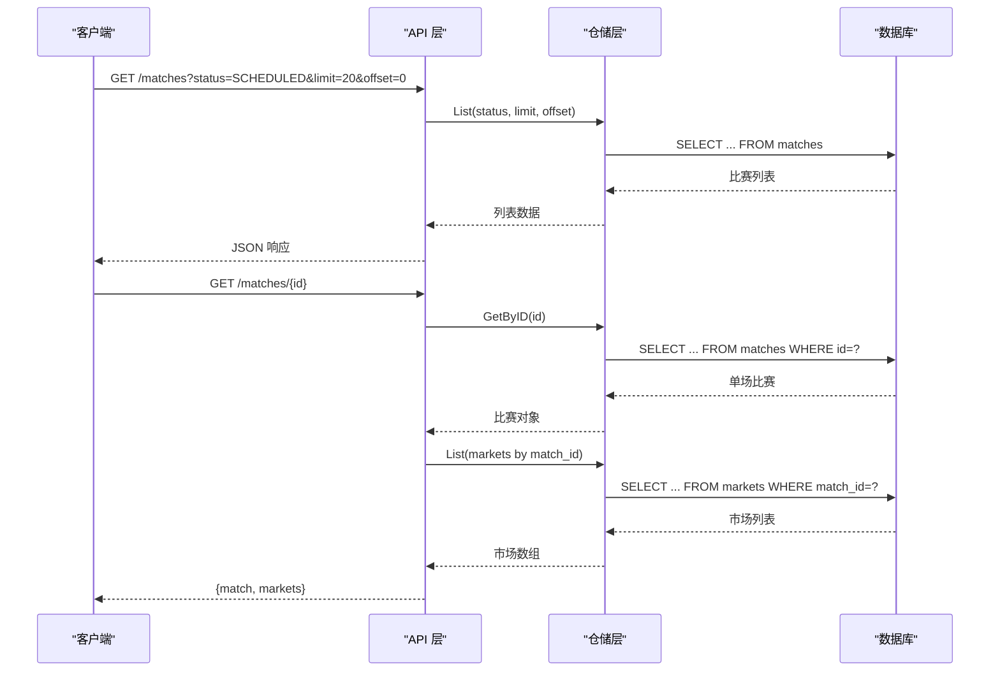
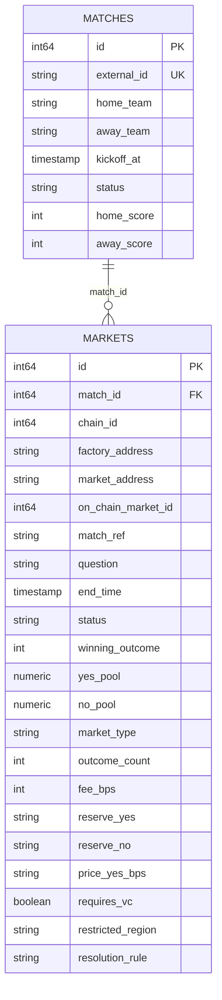
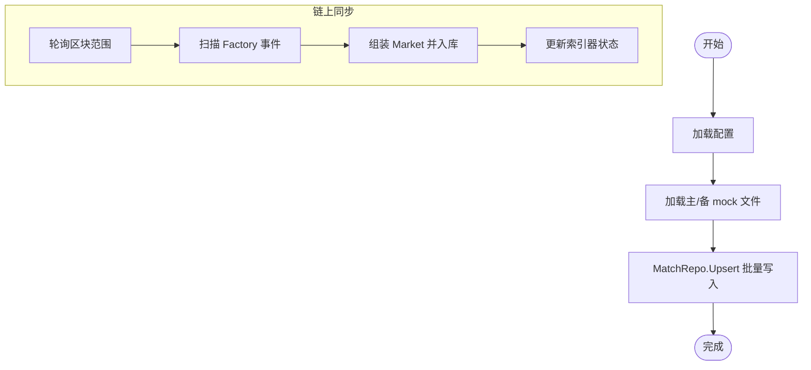
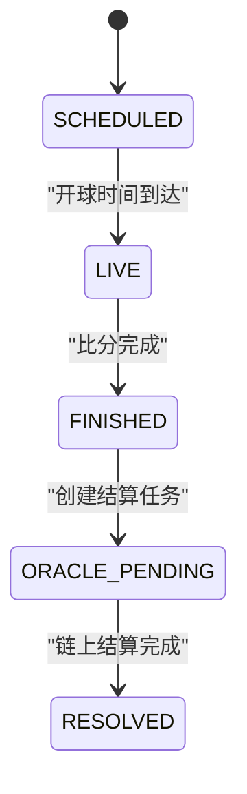
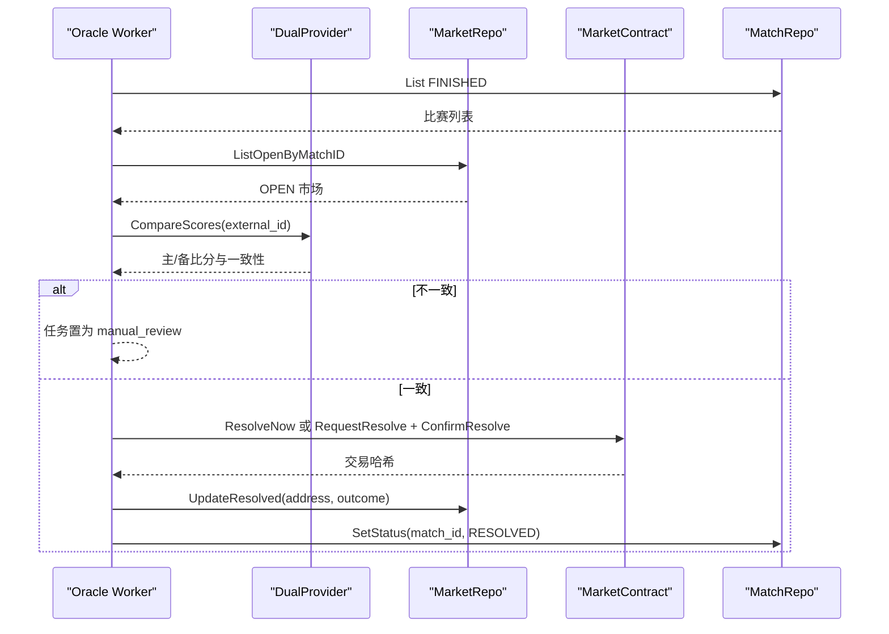
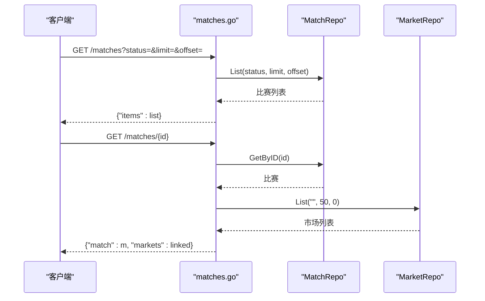
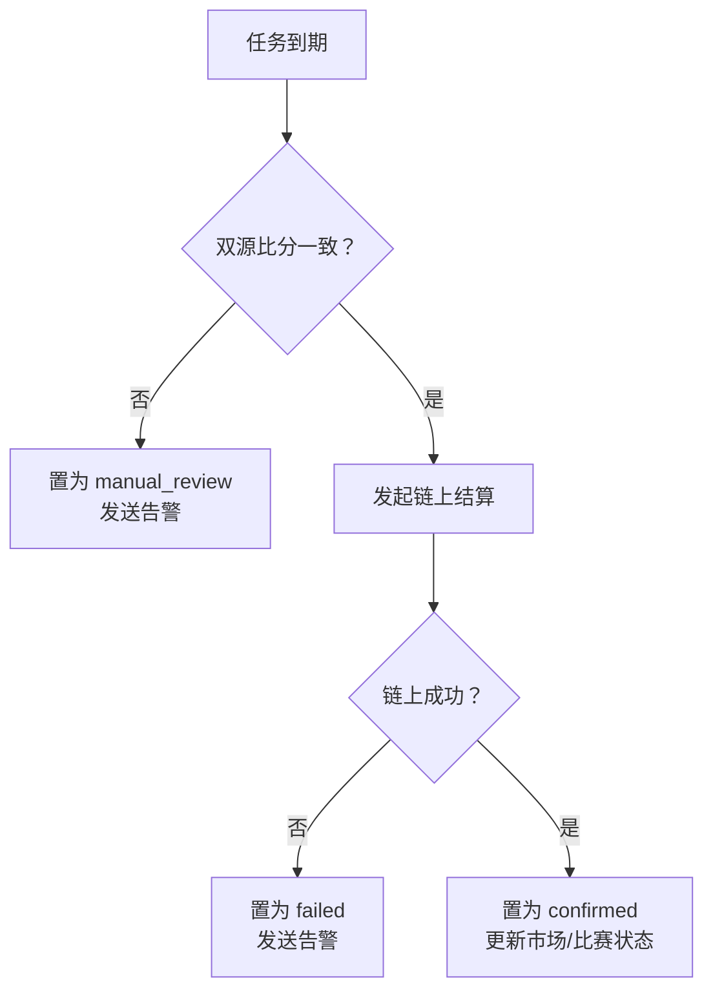
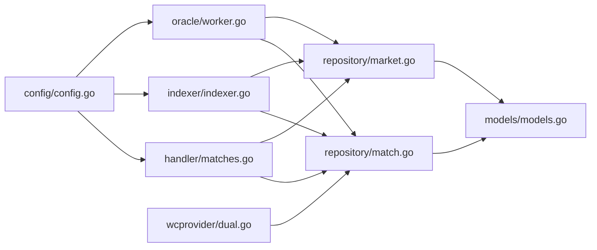

# 比赛管理模块

<cite>
**本文档引用的文件**
- [internal/handler/matches.go](file://internal/handler/matches.go)
- [internal/repository/match.go](file://internal/repository/match.go)
- [internal/models/models.go](file://internal/models/models.go)
- [cmd/sync/main.go](file://cmd/sync/main.go)
- [internal/indexer/indexer.go](file://internal/indexer/indexer.go)
- [internal/wcprovider/dual.go](file://internal/wcprovider/dual.go)
- [internal/repository/market.go](file://internal/repository/market.go)
- [internal/config/config.go](file://internal/config/config.go)
- [data/mock_matches.json](file://data/mock_matches.json)
- [internal/oracle/worker.go](file://internal/oracle/worker.go)
- [internal/alert/notifier.go](file://internal/alert/notifier.go)
- [internal/handler/api.go](file://internal/handler/api.go)
</cite>

## 目录
1. [简介](#简介)
2. [项目结构](#项目结构)
3. [核心组件](#核心组件)
4. [架构概览](#架构概览)
5. [详细组件分析](#详细组件分析)
6. [依赖分析](#依赖分析)
7. [性能考虑](#性能考虑)
8. [故障排除指南](#故障排除指南)
9. [结论](#结论)
10. [附录](#附录)

## 简介
本文件针对 PredictionDIDSimple 项目的比赛管理模块进行深入技术文档编写，覆盖以下关键主题：
- 比赛数据同步机制：自动同步与手动更新流程
- 状态管理：SCHEDULED/LIVE/FINISHED/ORACLE_PENDING/RESOLVED 等状态流转
- 结果处理：基于比分与规则的结算触发与验证
- 比赛与市场的关联关系：一对一/一对多及外键约束
- 数据一致性保证：幂等写入、冲突处理与事务边界
- 错误重试策略：指数退避、冷却时间与告警联动
- 监控告警机制：本地日志与 Webhook 告警
- 最佳实践：数据质量保障与异常处理

## 项目结构
比赛管理模块涉及多个层次的协作：
- Handler 层：对外提供 HTTP 接口，负责参数解析与响应封装
- Repository 层：封装数据库访问，提供分页查询、Upsert、状态更新等方法
- Model 层：定义 Match/Market/Position/User 等核心数据模型
- Indexer/Oracle/Provider 层：负责链上事件索引、自动结算与双源比分数据
- Config/Data 层：配置加载与模拟数据源

**图表来源**
- [internal/handler/matches.go:1-44](file://internal/handler/matches.go#L1-L44)
- [internal/handler/api.go:1-100](file://internal/handler/api.go#L1-L100)
- [internal/repository/match.go:1-118](file://internal/repository/match.go#L1-L118)
- [internal/repository/market.go:1-269](file://internal/repository/market.go#L1-L269)
- [internal/wcprovider/dual.go:1-144](file://internal/wcprovider/dual.go#L1-L144)
- [internal/oracle/worker.go:1-214](file://internal/oracle/worker.go#L1-L214)
- [internal/indexer/indexer.go:1-329](file://internal/indexer/indexer.go#L1-L329)
- [internal/models/models.go:1-63](file://internal/models/models.go#L1-L63)
- [internal/config/config.go:1-139](file://internal/config/config.go#L1-L139)
- [data/mock_matches.json:1-30](file://data/mock_matches.json#L1-L30)

**章节来源**
- [internal/handler/matches.go:1-44](file://internal/handler/matches.go#L1-L44)
- [internal/handler/api.go:1-100](file://internal/handler/api.go#L1-L100)
- [internal/repository/match.go:1-118](file://internal/repository/match.go#L1-L118)
- [internal/repository/market.go:1-269](file://internal/repository/market.go#L1-L269)
- [internal/wcprovider/dual.go:1-144](file://internal/wcprovider/dual.go#L1-L144)
- [internal/oracle/worker.go:1-214](file://internal/oracle/worker.go#L1-L214)
- [internal/indexer/indexer.go:1-329](file://internal/indexer/indexer.go#L1-L329)
- [internal/models/models.go:1-63](file://internal/models/models.go#L1-L63)
- [internal/config/config.go:1-139](file://internal/config/config.go#L1-L139)
- [data/mock_matches.json:1-30](file://data/mock_matches.json#L1-L30)

## 核心组件
- 比赛模型（Match）：包含外部 ID、队伍、开球时间、状态、比分等字段
- 市场模型（Market）：包含链上地址、工厂地址、结束时间、状态、结算结果、资金池等字段
- 比赛仓储（MatchRepo）：提供分页查询、按 ID/外部 ID 查询、Upsert、状态更新
- 市场仓储（MarketRepo）：提供市场分页查询、按地址/ID 查询、链上插入、结算更新、资金池更新
- 双源 Provider（DualProvider）：提供主/备源比分数据加载、交叉验证、完成比赛并更新比分
- Oracle Worker：根据 FINISHED 的比赛生成结算任务，校验比分一致性，发起链上结算
- Indexer：轮询链上事件，创建市场并更新状态，处理买入/结算/领取事件
- 配置（Config）：加载运行时配置，含数据库、RPC、轮询间隔、冷却不等参数
- Handler（matches.go）：提供比赛列表与详情查询接口，整合市场列表返回

**章节来源**
- [internal/models/models.go:6-43](file://internal/models/models.go#L6-L43)
- [internal/repository/match.go:15-118](file://internal/repository/match.go#L15-L118)
- [internal/repository/market.go:15-269](file://internal/repository/market.go#L15-L269)
- [internal/wcprovider/dual.go:23-144](file://internal/wcprovider/dual.go#L23-L144)
- [internal/oracle/worker.go:18-214](file://internal/oracle/worker.go#L18-L214)
- [internal/indexer/indexer.go:26-329](file://internal/indexer/indexer.go#L26-L329)
- [internal/config/config.go:12-139](file://internal/config/config.go#L12-L139)
- [internal/handler/matches.go:8-44](file://internal/handler/matches.go#L8-L44)

## 架构概览
比赛管理模块围绕“数据源 → 同步/索引 → 存储 → 查询/结算”的闭环构建。

**图表来源**
- [internal/handler/matches.go:8-44](file://internal/handler/matches.go#L8-L44)
- [internal/repository/match.go:25-76](file://internal/repository/match.go#L25-L76)
- [internal/repository/market.go:25-92](file://internal/repository/market.go#L25-L92)

## 详细组件分析

### 数据模型与关联关系
- 比赛（Match）与市场（Market）：一对多关联，Market 的 MatchID 外键指向 Match 的主键
- 关联查询：MarketRepo 在查询时 LEFT JOIN Matches，支持返回带关联比赛的完整市场信息
- 字段要点：Match 的 ExternalID 作为外部唯一标识，用于与 Provider 的数据源对齐；Market 的 ResolutionRule 决定结算规则

**图表来源**
- [internal/models/models.go:6-43](file://internal/models/models.go#L6-L43)
- [internal/repository/market.go:30-43](file://internal/repository/market.go#L30-L43)

**章节来源**
- [internal/models/models.go:6-43](file://internal/models/models.go#L6-L43)
- [internal/repository/market.go:25-92](file://internal/repository/market.go#L25-L92)

### 比赛数据同步机制
- 自动同步（离线工具）：cmd/sync/main.go 通过 wcprovider.NewDual 读取主/备 mock 数据，调用 MatchRepo.Upsert 完成插入或更新
- 索引器同步（链上）：internal/indexer/indexer.go 轮询 Factory 合约的 MarketCreated 事件，反查 MatchRef 与外部 ID，创建市场并设置状态为 OPEN
- 双源 Provider：dual.go 提供 CompareScores 交叉验证，FinishMatch 完成比赛并更新比分与状态

**图表来源**
- [cmd/sync/main.go:17-52](file://cmd/sync/main.go#L17-L52)
- [internal/indexer/indexer.go:97-160](file://internal/indexer/indexer.go#L97-L160)
- [internal/wcprovider/dual.go:91-97](file://internal/wcprovider/dual.go#L91-L97)

**章节来源**
- [cmd/sync/main.go:17-52](file://cmd/sync/main.go#L17-L52)
- [internal/indexer/indexer.go:97-160](file://internal/indexer/indexer.go#L97-L160)
- [internal/wcprovider/dual.go:91-140](file://internal/wcprovider/dual.go#L91-L140)

### 状态管理与流转
- 比赛状态：SCHEDULED/LIVE/FINISHED/ORACLE_PENDING/RESOLVED
- 流程图：

- 关键实现点：
  - 双源比分一致时，Oracle Worker 将比赛状态置为 ORACLE_PENDING，随后置为 RESOLVED
  - MarketRepo.UpdateResolved 将市场置为 RESOLVED 并清空资金池
  - Indexer 在链上 Resolved 事件发生时也更新市场状态

**图表来源**
- [internal/oracle/worker.go:70-101](file://internal/oracle/worker.go#L70-L101)
- [internal/oracle/worker.go:198-204](file://internal/oracle/worker.go#L198-L204)
- [internal/indexer/indexer.go:311-321](file://internal/indexer/indexer.go#L311-L321)

**章节来源**
- [internal/oracle/worker.go:70-101](file://internal/oracle/worker.go#L70-L101)
- [internal/oracle/worker.go:198-204](file://internal/oracle/worker.go#L198-L204)
- [internal/indexer/indexer.go:311-321](file://internal/indexer/indexer.go#L311-L321)

### 结果处理与结算触发
- 结算触发条件：比赛状态为 FINISHED 且存在 OPEN 市场
- 结算规则：优先使用 Market 的 ResolutionRule，否则默认 HOME_WIN
- OutcomeFromRule：根据 OVER_25 或 HOME_WIN 计算结果（0=Yes, 1=No）
- 链上结算：支持无时间锁直接结算或带时间锁的请求→等待→确认流程
- 失败处理：任务置为 failed，发送告警

**图表来源**
- [internal/oracle/worker.go:70-101](file://internal/oracle/worker.go#L70-L101)
- [internal/oracle/worker.go:123-205](file://internal/oracle/worker.go#L123-L205)
- [internal/wcprovider/dual.go:67-89](file://internal/wcprovider/dual.go#L67-L89)
- [internal/repository/market.go:130-138](file://internal/repository/market.go#L130-L138)
- [internal/repository/match.go:95-99](file://internal/repository/match.go#L95-L99)

**章节来源**
- [internal/oracle/worker.go:123-205](file://internal/oracle/worker.go#L123-L205)
- [internal/wcprovider/dual.go:99-119](file://internal/wcprovider/dual.go#L99-L119)
- [internal/repository/market.go:130-138](file://internal/repository/market.go#L130-L138)
- [internal/repository/match.go:95-99](file://internal/repository/match.go#L95-L99)

### 比赛列表查询与详情获取
- 列表查询：支持 status 过滤、limit/offset 分页
- 详情获取：返回比赛与关联市场列表（当前实现为全量市场后过滤，建议下沉至 SQL）

**图表来源**
- [internal/handler/matches.go:8-44](file://internal/handler/matches.go#L8-L44)
- [internal/repository/match.go:25-76](file://internal/repository/match.go#L25-L76)
- [internal/repository/market.go:25-73](file://internal/repository/market.go#L25-L73)

**章节来源**
- [internal/handler/matches.go:8-44](file://internal/handler/matches.go#L8-L44)
- [internal/repository/match.go:25-76](file://internal/repository/match.go#L25-L76)
- [internal/repository/market.go:25-73](file://internal/repository/market.go#L25-L73)

### 数据一致性保证
- Upsert 幂等：MatchRepo.Upsert 使用 external_id 唯一键，ON CONFLICT 更新字段并刷新 updated_at
- 链上事件幂等：Indexer 在扫描区块范围时更新最后区块号，避免重复处理
- 市场状态一致性：Indexer 与 Oracle Worker 对市场/比赛状态更新保持一致

**章节来源**
- [internal/repository/match.go:78-93](file://internal/repository/match.go#L78-L93)
- [internal/indexer/indexer.go:158-159](file://internal/indexer/indexer.go#L158-L159)
- [internal/oracle/worker.go:198-204](file://internal/oracle/worker.go#L198-L204)

### 错误重试策略与监控告警
- Oracle 冷却时间：配置 OracleCooldownMinutes，避免频繁结算
- 重试与人工审核：双源比分不一致时置为 manual_review 并发送告警
- 告警机制：内部 alert.Notifier 支持 Webhook 推送与本地日志输出

**图表来源**
- [internal/oracle/worker.go:103-121](file://internal/oracle/worker.go#L103-L121)
- [internal/oracle/worker.go:146-153](file://internal/oracle/worker.go#L146-L153)
- [internal/oracle/worker.go:184-191](file://internal/oracle/worker.go#L184-L191)
- [internal/alert/notifier.go:27-47](file://internal/alert/notifier.go#L27-L47)

**章节来源**
- [internal/oracle/worker.go:77-98](file://internal/oracle/worker.go#L77-L98)
- [internal/oracle/worker.go:146-153](file://internal/oracle/worker.go#L146-L153)
- [internal/oracle/worker.go:184-191](file://internal/oracle/worker.go#L184-L191)
- [internal/alert/notifier.go:27-47](file://internal/alert/notifier.go#L27-L47)

## 依赖分析
- Handler 依赖 Repository；Repository 依赖数据库连接池；Model 为数据载体
- Indexer 依赖配置、ABI、RPC 客户端与仓储；Oracle Worker 依赖配置、链上客户端、告警与仓储
- 双源 Provider 依赖文件系统与 MatchRepo

**图表来源**
- [internal/handler/matches.go:1-44](file://internal/handler/matches.go#L1-L44)
- [internal/repository/match.go:1-118](file://internal/repository/match.go#L1-L118)
- [internal/repository/market.go:1-269](file://internal/repository/market.go#L1-L269)
- [internal/models/models.go:1-63](file://internal/models/models.go#L1-L63)
- [internal/indexer/indexer.go:1-329](file://internal/indexer/indexer.go#L1-L329)
- [internal/oracle/worker.go:1-214](file://internal/oracle/worker.go#L1-L214)
- [internal/wcprovider/dual.go:1-144](file://internal/wcprovider/dual.go#L1-L144)
- [internal/config/config.go:1-139](file://internal/config/config.go#L1-L139)

**章节来源**
- [internal/handler/matches.go:1-44](file://internal/handler/matches.go#L1-L44)
- [internal/repository/match.go:1-118](file://internal/repository/match.go#L1-L118)
- [internal/repository/market.go:1-269](file://internal/repository/market.go#L1-L269)
- [internal/models/models.go:1-63](file://internal/models/models.go#L1-L63)
- [internal/indexer/indexer.go:1-329](file://internal/indexer/indexer.go#L1-L329)
- [internal/oracle/worker.go:1-214](file://internal/oracle/worker.go#L1-L214)
- [internal/wcprovider/dual.go:1-144](file://internal/wcprovider/dual.go#L1-L144)
- [internal/config/config.go:1-139](file://internal/config/config.go#L1-L139)

## 性能考虑
- 分页查询：List 方法统一使用 LIMIT/OFFSET，建议结合 KickoffAt/EndTime 建立复合索引
- 关联查询：MarketRepo 在查询时 LEFT JOIN Matches，注意字段扫描与序列化开销
- 索引器轮询：每次最多扫描 2000 区块，避免 RPC 超时；轮询间隔可配置
- Oracle 冷却：避免频繁结算导致链上拥堵与失败重试

[本节为通用指导，无需列出具体文件来源]

## 故障排除指南
- 比赛未显示或状态异常
  - 检查 MatchRepo.Upsert 是否正确按 external_id 去重
  - 确认 Indexer 是否扫描到 Factory 事件并创建市场
- 结算任务未触发
  - 确认比赛状态为 FINISHED 且存在 OPEN 市场
  - 检查 OracleCooldownMinutes 配置是否过长
- 双源比分不一致
  - 查看 Oracle Worker 的 manual_review 状态与告警
  - 手动核对主/备 mock 数据源
- 链上结算失败
  - 查看失败任务的 error_message 字段
  - 检查 OraclePrivateKey、FactoryAddress、时间锁配置

**章节来源**
- [internal/repository/match.go:78-93](file://internal/repository/match.go#L78-L93)
- [internal/indexer/indexer.go:150-157](file://internal/indexer/indexer.go#L150-L157)
- [internal/oracle/worker.go:70-101](file://internal/oracle/worker.go#L70-L101)
- [internal/oracle/worker.go:146-153](file://internal/oracle/worker.go#L146-L153)
- [internal/oracle/worker.go:184-191](file://internal/oracle/worker.go#L184-L191)

## 结论
比赛管理模块通过“双源数据 + 链上索引 + 自动结算”的组合，实现了从数据采集到结算执行的完整闭环。其关键优势在于：
- 数据来源多样化：mock 文件与链上事件双通道，提升鲁棒性
- 状态机清晰：明确的状态流转与幂等写入，降低一致性风险
- 可观测性强：任务状态、告警与链上事件均可追踪
- 易于扩展：规则可配置、冷却与轮询参数可调

## 附录
- 配置项参考
  - INDEXER_POLL_SECONDS：索引器轮询间隔
  - MOCK_MATCHES_PATH/MOCK_MATCHES_SECONDARY：主/备 mock 文件路径
  - ORACLE_COOLDOWN_MINUTES：Oracle 冷却时间
  - ORACLE_TIMELOCK_SECONDS：时间锁秒数
  - ALERT_WEBHOOK_URL：告警 Webhook 地址

**章节来源**
- [internal/config/config.go:31-72](file://internal/config/config.go#L31-L72)
- [internal/config/config.go:104-139](file://internal/config/config.go#L104-L139)