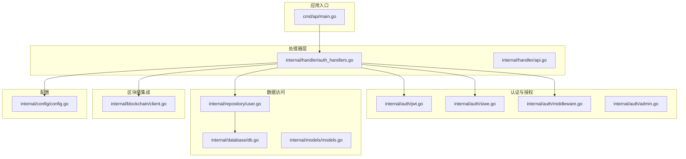
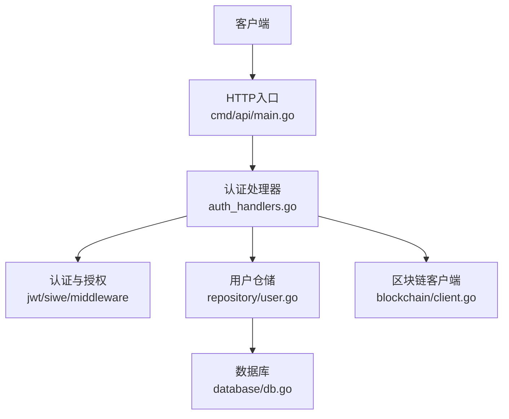
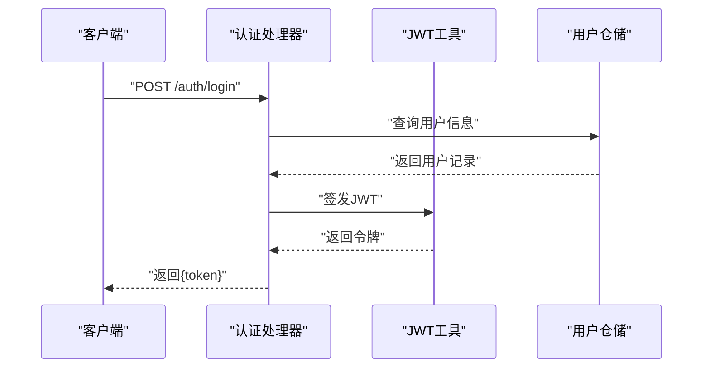
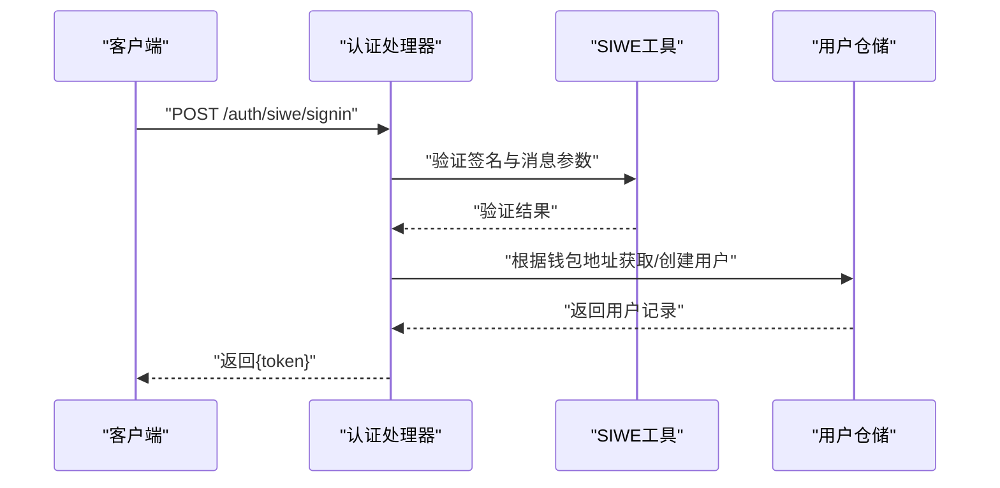
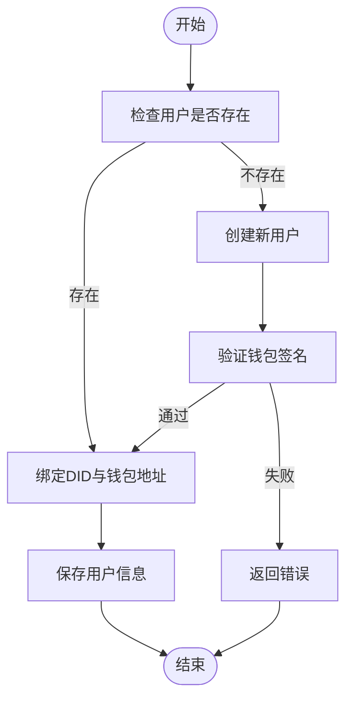
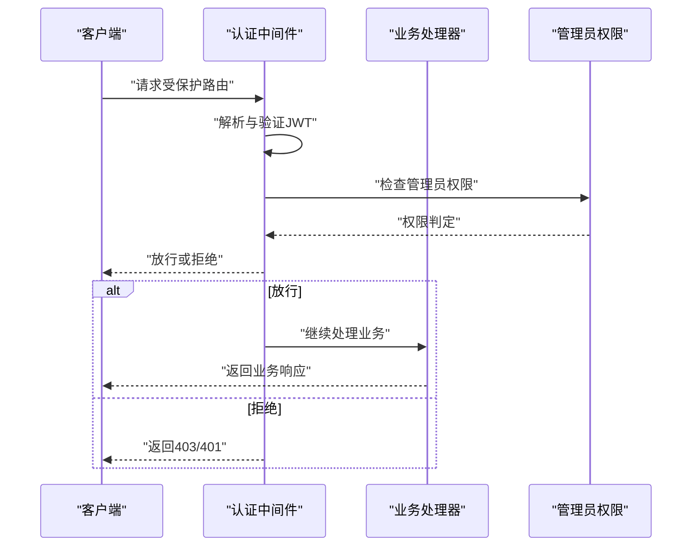
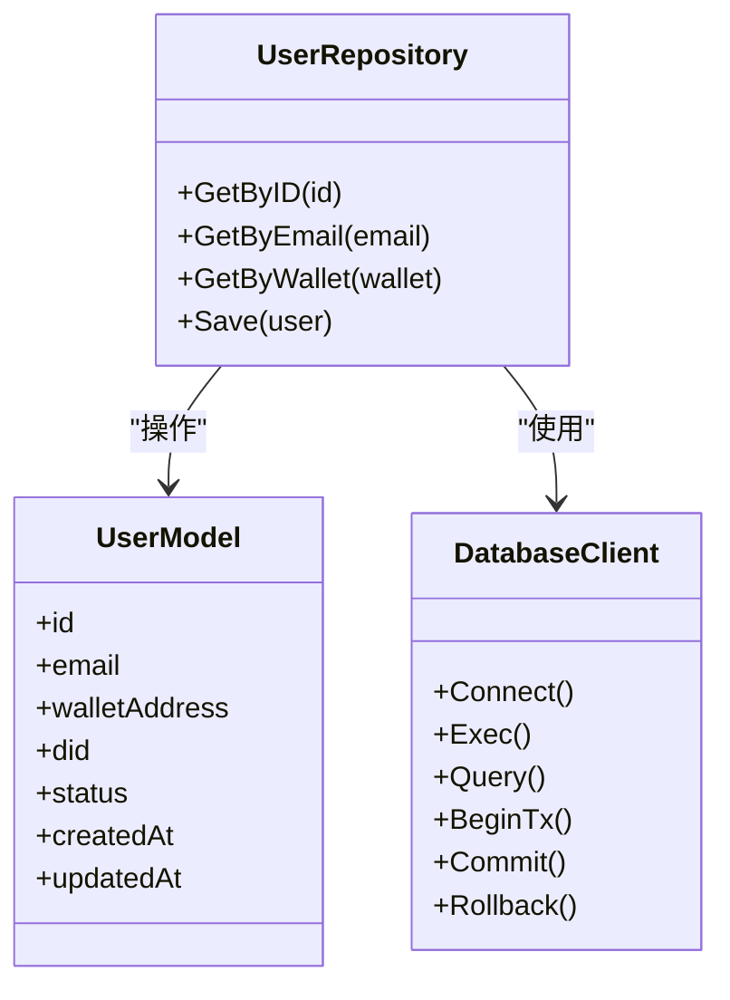
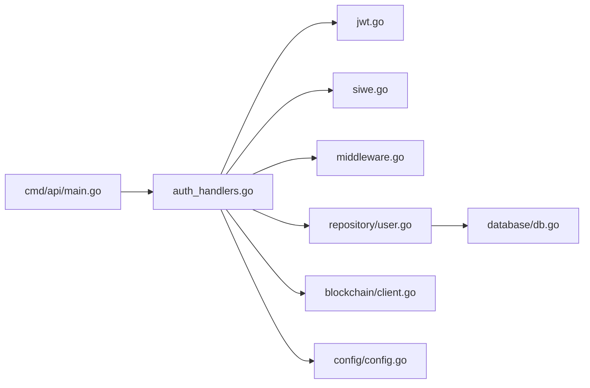

# 用户管理模块

<cite>
**本文档引用的文件**
- [main.go](file://cmd/api/main.go)
- [jwt.go](file://internal/auth/jwt.go)
- [siwe.go](file://internal/auth/siwe.go)
- [middleware.go](file://internal/auth/middleware.go)
- [admin.go](file://internal/auth/admin.go)
- [auth_handlers.go](file://internal/handler/auth_handlers.go)
- [api.go](file://internal/handler/api.go)
- [db.go](file://internal/database/db.go)
- [user.go](file://internal/repository/user.go)
- [models.go](file://internal/models/models.go)
- [client.go](file://internal/blockchain/client.go)
- [config.go](file://internal/config/config.go)
</cite>

## 目录
1. [简介](#简介)
2. [项目结构](#项目结构)
3. [核心组件](#核心组件)
4. [架构总览](#架构总览)
5. [详细组件分析](#详细组件分析)
6. [依赖关系分析](#依赖关系分析)
7. [性能考量](#性能考量)
8. [故障排除指南](#故障排除指南)
9. [结论](#结论)
10. [附录](#附录)

## 简介
本文件面向PredictionDIDSimple项目的用户管理模块，系统性阐述用户注册、登录、DID绑定、JWT认证与SIWE集成的完整实现。文档覆盖用户生命周期管理、身份验证流程、权限控制机制，并提供API接口规范、请求参数、响应格式与错误处理策略。同时说明与区块链客户端的集成方式、安全考虑与最佳实践，并给出常见问题解决方案与性能优化建议。

## 项目结构
用户管理相关的核心目录与文件组织如下：
- 认证与授权：internal/auth（JWT、SIWE、中间件、管理员）
- 处理器层：internal/handler（认证处理器、通用API）
- 数据库与模型：internal/database、internal/models
- 仓储层：internal/repository（用户仓储）
- 区块链集成：internal/blockchain
- 配置：internal/config
- 应用入口：cmd/api/main.go

**图表来源**
- [main.go](file://cmd/api/main.go)
- [jwt.go](file://internal/auth/jwt.go)
- [siwe.go](file://internal/auth/siwe.go)
- [middleware.go](file://internal/auth/middleware.go)
- [admin.go](file://internal/auth/admin.go)
- [auth_handlers.go](file://internal/handler/auth_handlers.go)
- [api.go](file://internal/handler/api.go)
- [db.go](file://internal/database/db.go)
- [user.go](file://internal/repository/user.go)
- [models.go](file://internal/models/models.go)
- [client.go](file://internal/blockchain/client.go)
- [config.go](file://internal/config/config.go)

**章节来源**
- [main.go](file://cmd/api/main.go)
- [jwt.go](file://internal/auth/jwt.go)
- [siwe.go](file://internal/auth/siwe.go)
- [middleware.go](file://internal/auth/middleware.go)
- [admin.go](file://internal/auth/admin.go)
- [auth_handlers.go](file://internal/handler/auth_handlers.go)
- [api.go](file://internal/handler/api.go)
- [db.go](file://internal/database/db.go)
- [user.go](file://internal/repository/user.go)
- [models.go](file://internal/models/models.go)
- [client.go](file://internal/blockchain/client.go)
- [config.go](file://internal/config/config.go)

## 核心组件
- JWT认证：负责令牌签发、解析与校验，支持过期时间与签名算法配置。
- SIWE集成：实现Sign-In with Ethereum协议，用于钱包地址与用户会话绑定。
- 中间件：统一鉴权与权限拦截，支持管理员路由保护。
- 认证处理器：封装注册、登录、DID绑定等业务接口。
- 用户仓储：抽象数据库操作，提供用户查询与持久化能力。
- 区块链客户端：与以太坊网络交互，验证钱包签名与状态。
- 配置中心：集中管理认证相关参数（如密钥、超时、链ID等）。

**章节来源**
- [jwt.go](file://internal/auth/jwt.go)
- [siwe.go](file://internal/auth/siwe.go)
- [middleware.go](file://internal/auth/middleware.go)
- [auth_handlers.go](file://internal/handler/auth_handlers.go)
- [user.go](file://internal/repository/user.go)
- [client.go](file://internal/blockchain/client.go)
- [config.go](file://internal/config/config.go)

## 架构总览
用户管理模块采用分层架构，自上而下分别为HTTP入口、处理器层、认证授权层、仓储层与外部服务集成层。认证流程通过JWT与SIWE协同工作，确保用户身份可信且可追溯；区块链客户端用于验证钱包签名，保障DID与钱包地址绑定的安全性。

**图表来源**
- [main.go](file://cmd/api/main.go)
- [auth_handlers.go](file://internal/handler/auth_handlers.go)
- [jwt.go](file://internal/auth/jwt.go)
- [siwe.go](file://internal/auth/siwe.go)
- [middleware.go](file://internal/auth/middleware.go)
- [user.go](file://internal/repository/user.go)
- [db.go](file://internal/database/db.go)
- [client.go](file://internal/blockchain/client.go)

## 详细组件分析

### JWT认证机制
- 令牌签发：基于用户标识生成短期有效令牌，包含标准声明与自定义字段。
- 令牌解析：在受保护路由中解析并验证签名，提取用户上下文。
- 过期与刷新：支持过期时间控制与刷新策略，避免长期有效令牌带来的风险。
- 安全配置：密钥管理、算法选择与传输加密要求。

**图表来源**
- [auth_handlers.go](file://internal/handler/auth_handlers.go)
- [jwt.go](file://internal/auth/jwt.go)
- [user.go](file://internal/repository/user.go)

**章节来源**
- [jwt.go](file://internal/auth/jwt.go)
- [auth_handlers.go](file://internal/handler/auth_handlers.go)
- [user.go](file://internal/repository/user.go)

### SIWE集成（钱包登录）
- 协议流程：客户端构造SIWE消息，用户通过钱包签名后提交至服务端。
- 消息验证：服务端校验签名者、链ID、域名、nonce等关键字段。
- 会话绑定：将已验证的钱包地址与用户账户关联，作为后续DID绑定的基础。

**图表来源**
- [auth_handlers.go](file://internal/handler/auth_handlers.go)
- [siwe.go](file://internal/auth/siwe.go)
- [user.go](file://internal/repository/user.go)

**章节来源**
- [siwe.go](file://internal/auth/siwe.go)
- [auth_handlers.go](file://internal/handler/auth_handlers.go)
- [user.go](file://internal/repository/user.go)

### 用户注册与DID绑定
- 注册流程：接收用户名、邮箱等基础信息，创建用户记录并初始化账户状态。
- DID绑定：在SIWE验证通过后，将用户钱包地址与DID进行绑定，确保身份唯一性与可验证性。
- 区块链验证：调用区块链客户端验证签名有效性与地址合法性，防止伪造。

**图表来源**
- [auth_handlers.go](file://internal/handler/auth_handlers.go)
- [user.go](file://internal/repository/user.go)
- [client.go](file://internal/blockchain/client.go)

**章节来源**
- [auth_handlers.go](file://internal/handler/auth_handlers.go)
- [user.go](file://internal/repository/user.go)
- [client.go](file://internal/blockchain/client.go)

### 权限控制与中间件
- 路由保护：通过中间件对特定路径实施JWT校验与角色权限检查。
- 管理员权限：提供管理员专用路由，仅允许具备管理员角色的用户访问。
- 统一错误处理：在中间件层捕获认证异常并返回标准化错误响应。

**图表来源**
- [middleware.go](file://internal/auth/middleware.go)
- [admin.go](file://internal/auth/admin.go)
- [auth_handlers.go](file://internal/handler/auth_handlers.go)

**章节来源**
- [middleware.go](file://internal/auth/middleware.go)
- [admin.go](file://internal/auth/admin.go)
- [auth_handlers.go](file://internal/handler/auth_handlers.go)

### 数据模型与仓储
- 用户模型：包含用户标识、邮箱、钱包地址、DID、状态等字段。
- 仓储接口：提供按ID、邮箱、钱包地址等维度的查询方法，以及用户更新与保存。
- 数据库连接：通过统一数据库客户端管理连接池与事务。

**图表来源**
- [models.go](file://internal/models/models.go)
- [user.go](file://internal/repository/user.go)
- [db.go](file://internal/database/db.go)

**章节来源**
- [models.go](file://internal/models/models.go)
- [user.go](file://internal/repository/user.go)
- [db.go](file://internal/database/db.go)

### API接口规范

- 登录（SIWE）
  - 方法与路径：POST /auth/siwe/signin
  - 请求体字段：message（SIWE消息）、signature（钱包签名）
  - 成功响应：{ token }
  - 错误码：400（参数无效）、401（签名验证失败）、500（服务器内部错误）

- 登录（传统）
  - 方法与路径：POST /auth/login
  - 请求体字段：username（用户名或邮箱）、password（密码）
  - 成功响应：{ token }
  - 错误码：400（参数无效）、401（凭据无效）、500（服务器内部错误）

- 注册
  - 方法与路径：POST /auth/register
  - 请求体字段：username（用户名）、email（邮箱）、password（密码）
  - 成功响应：{ token }
  - 错误码：400（参数无效或冲突）、500（服务器内部错误）

- 绑定DID
  - 方法与路径：POST /auth/did/bind
  - 请求头：Authorization: Bearer {token}
  - 请求体字段：walletAddress（钱包地址）、signature（签名）
  - 成功响应：{ did }
  - 错误码：400（参数无效）、401（未授权）、403（权限不足）、500（服务器内部错误）

- 受保护路由示例
  - 方法与路径：GET /admin/stats
  - 请求头：Authorization: Bearer {token}
  - 成功响应：统计信息对象
  - 错误码：401（令牌无效/过期）、403（权限不足）、404（资源不存在）、500（服务器内部错误）

**章节来源**
- [auth_handlers.go](file://internal/handler/auth_handlers.go)
- [api.go](file://internal/handler/api.go)

## 依赖关系分析
- 入口依赖：HTTP入口依赖认证处理器与路由配置。
- 处理器依赖：认证处理器依赖JWT工具、SIWE工具、用户仓储与区块链客户端。
- 仓储依赖：用户仓储依赖数据库客户端与模型定义。
- 外部依赖：区块链客户端提供签名验证与链上状态查询能力。
- 配置依赖：认证与安全参数由配置模块集中管理。

**图表来源**
- [main.go](file://cmd/api/main.go)
- [auth_handlers.go](file://internal/handler/auth_handlers.go)
- [jwt.go](file://internal/auth/jwt.go)
- [siwe.go](file://internal/auth/siwe.go)
- [middleware.go](file://internal/auth/middleware.go)
- [user.go](file://internal/repository/user.go)
- [db.go](file://internal/database/db.go)
- [client.go](file://internal/blockchain/client.go)
- [config.go](file://internal/config/config.go)

**章节来源**
- [main.go](file://cmd/api/main.go)
- [auth_handlers.go](file://internal/handler/auth_handlers.go)
- [jwt.go](file://internal/auth/jwt.go)
- [siwe.go](file://internal/auth/siwe.go)
- [middleware.go](file://internal/auth/middleware.go)
- [user.go](file://internal/repository/user.go)
- [db.go](file://internal/database/db.go)
- [client.go](file://internal/blockchain/client.go)
- [config.go](file://internal/config/config.go)

## 性能考量
- 令牌缓存：对频繁访问的用户令牌进行缓存，减少重复签发与解析开销。
- 数据库索引：为邮箱、钱包地址建立索引，提升查询效率。
- 并发控制：在高并发场景下限制令牌签发速率，避免资源争用。
- 链上调用优化：批量验证签名与状态查询，降低网络往返次数。
- 日志与监控：记录认证关键指标（成功率、延迟、错误类型），便于性能分析与告警。

## 故障排除指南
- 常见错误与排查
  - 400 参数无效：检查请求体字段是否完整且格式正确。
  - 401 未授权：确认Authorization头是否携带有效JWT，令牌是否过期。
  - 403 权限不足：确认用户角色是否满足管理员路由要求。
  - 500 服务器内部错误：查看日志定位具体异常，优先检查数据库连接与区块链客户端可用性。
- 令牌问题
  - 令牌过期：调整过期时间配置或引导客户端执行刷新流程。
  - 签名不匹配：核对JWT算法与密钥配置，确保客户端与服务端一致。
- SIWE问题
  - 域名或链ID不匹配：确认消息中的domain与chainId与配置一致。
  - nonce重复：确保每次登录生成新的nonce并及时清理。
- 区块链验证失败
  - 网络不可达：检查节点URL与网络连通性。
  - 地址非法：确认钱包地址格式与链上状态。

**章节来源**
- [middleware.go](file://internal/auth/middleware.go)
- [jwt.go](file://internal/auth/jwt.go)
- [siwe.go](file://internal/auth/siwe.go)
- [user.go](file://internal/repository/user.go)
- [client.go](file://internal/blockchain/client.go)

## 结论
用户管理模块通过JWT与SIWE的组合实现了去中心化的身份认证与授权，结合区块链客户端验证确保了DID与钱包地址绑定的安全性。模块采用清晰的分层设计与统一的中间件机制，既保证了安全性也兼顾了可维护性。建议在生产环境中强化令牌缓存、数据库索引与链上调用优化，并完善监控与告警体系以持续改进性能与稳定性。

## 附录
- 最佳实践
  - 使用HTTPS传输，严格管理JWT密钥与算法配置。
  - 对敏感操作增加二次确认与审计日志。
  - 定期轮换密钥，避免长期使用同一密钥。
  - 在网关层实施速率限制与IP白名单策略。
- 扩展建议
  - 引入多因子认证（MFA）增强登录安全性。
  - 支持多种DID方法（如did:pkh），提升兼容性。
  - 提供SDK或OpenAPI文档，便于前端与第三方集成。