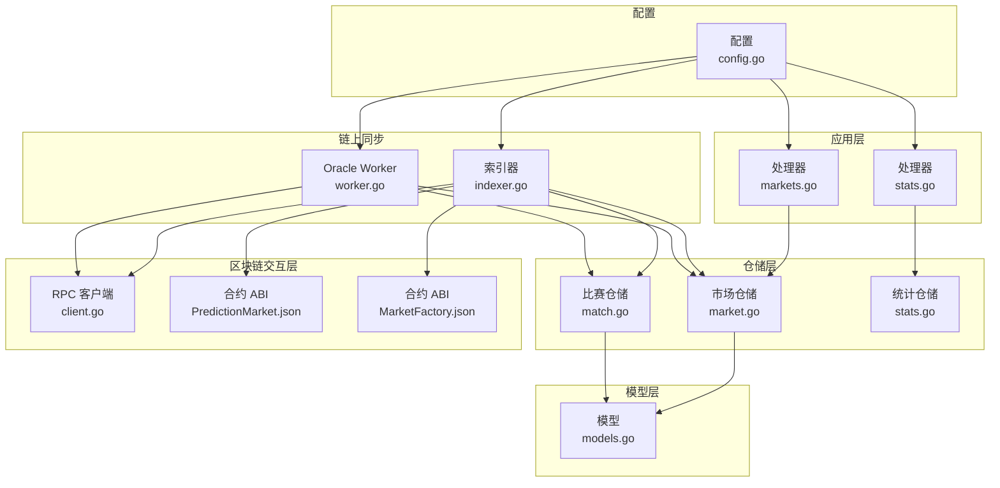
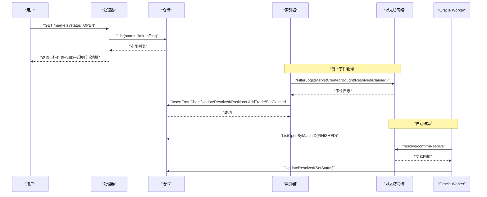
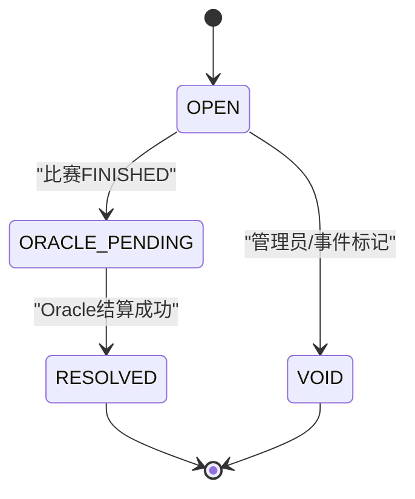
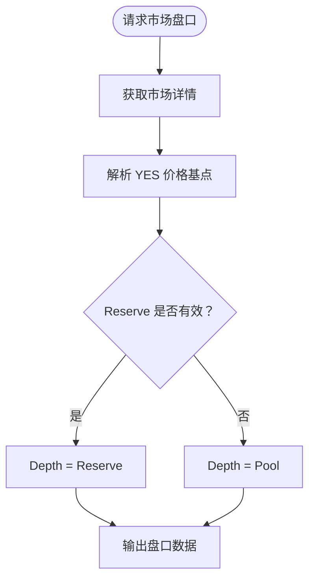
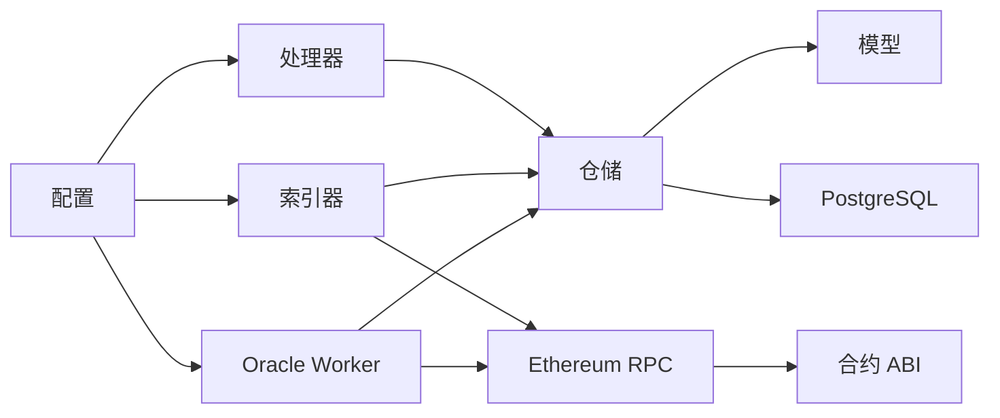

# 预测市场模块

<cite>
**本文档引用的文件**
- [models.go](file://internal/models/models.go)
- [market.go](file://internal/repository/market.go)
- [markets.go](file://internal/handler/markets.go)
- [PredictionMarket.json](file://pkg/contracts/PredictionMarket.json)
- [MarketFactory.json](file://pkg/contracts/MarketFactory.json)
- [client.go](file://internal/blockchain/client.go)
- [indexer.go](file://internal/indexer/indexer.go)
- [worker.go](file://internal/oracle/worker.go)
- [match.go](file://internal/repository/match.go)
- [stats.go](file://internal/repository/stats.go)
- [stats_handler.go](file://internal/handler/stats.go)
- [config.go](file://internal/config/config.go)
- [main.go](file://cmd/sync/main.go)
</cite>

## 目录
1. [简介](#简介)
2. [项目结构](#项目结构)
3. [核心组件](#核心组件)
4. [架构总览](#架构总览)
5. [详细组件分析](#详细组件分析)
6. [依赖关系分析](#依赖关系分析)
7. [性能考量](#性能考量)
8. [故障排除指南](#故障排除指南)
9. [结论](#结论)
10. [附录](#附录)

## 简介
本文件面向 PredictionDIDSimple 项目的预测市场模块，系统性梳理从市场创建、配置、交易撮合到结算的完整业务流程。重点覆盖：
- 市场状态管理（OPEN、RESOLVED、CANCELLED/VOID、ORACLE_PENDING）
- 市场参数设置（类型、结果数、费用、VC 门控、地区限制、结算规则）
- 交易撮合与盘口展示（CPMM 合成盘口）
- 与智能合约交互（工厂合约创建、市场合约读写、Oracle 写入）
- 链上状态同步（索引器轮询事件）
- 风险控制与合规（地理封锁、VC 门控、KYC）
- 统计与奖励（平台统计、资金池与价格）

## 项目结构
预测市场模块由以下层次构成：
- 数据模型层：定义比赛、市场、持仓、用户等核心实体
- 仓储层：数据库访问与聚合查询
- 处理器层：HTTP 接口暴露市场查询、详情、盘口、统计等
- 区块链交互层：RPC 健康检查、合约 ABIs、Oracle 写入
- 索引器：轮询链上事件并同步至数据库
- Oracle Worker：自动结算任务编排与链上写入
- 配置层：统一加载运行时配置

图表来源
- [markets.go:1-60](file://internal/handler/markets.go#L1-L60)
- [stats_handler.go:1-87](file://internal/handler/stats.go#L1-L87)
- [market.go:1-269](file://internal/repository/market.go#L1-L269)
- [match.go:1-118](file://internal/repository/match.go#L1-L118)
- [stats.go:1-69](file://internal/repository/stats.go#L1-L69)
- [models.go:1-63](file://internal/models/models.go#L1-L63)
- [client.go:1-94](file://internal/blockchain/client.go#L1-L94)
- [indexer.go:1-329](file://internal/indexer/indexer.go#L1-L329)
- [worker.go:1-214](file://internal/oracle/worker.go#L1-L214)
- [config.go:1-139](file://internal/config/config.go#L1-L139)

章节来源
- [markets.go:1-60](file://internal/handler/markets.go#L1-L60)
- [market.go:1-269](file://internal/repository/market.go#L1-L269)
- [match.go:1-118](file://internal/repository/match.go#L1-L118)
- [stats.go:1-69](file://internal/repository/stats.go#L1-L69)
- [models.go:1-63](file://internal/models/models.go#L1-L63)
- [client.go:1-94](file://internal/blockchain/client.go#L1-L94)
- [indexer.go:1-329](file://internal/indexer/indexer.go#L1-L329)
- [worker.go:1-214](file://internal/oracle/worker.go#L1-L214)
- [config.go:1-139](file://internal/config/config.go#L1-L139)

## 核心组件
- 市场模型与仓储
  - 市场实体包含链 ID、工厂地址、市场地址、链上市场 ID、问题、结束时间、状态、获胜结果、资金池、类型、结果数、费用、储备金、价格基点、VC 门控、地区限制、结算规则等字段
  - 仓储提供分页查询、按 ID/地址获取、从链上事件插入、更新已结算、更新资金池、管理员更新属性、设置作废等能力
- 比赛模型与仓储
  - 比赛实体包含外部 ID、主客队、开球时间、状态、比分等
  - 仓储支持分页查询、按 ID/外部 ID 获取、Upsert、状态更新
- 统计与盘口
  - 平台统计包含交易次数、交易额、手续费、活跃用户、开放市场数、TVL 近似值
  - 市场盘口基于 CPMM 合成盘口，展示 YES/NO 买卖深度与价格
- 处理器接口
  - 列表与详情：支持按状态过滤、分页、返回链 ID 与抵押代币地址
  - 访问门禁：根据 VC 门控动态放行
  - 盘口与统计：返回资金池、价格、费用、CPMM 盘口快照
- 区块链交互
  - RPC 健康检查与链 ID 校验
  - 通过 ABI 与合约交互（创建市场、购买、结算、领取等）
- 索引器与 Oracle Worker
  - 索引器轮询工厂与市场事件，同步市场、交易、结算、领取状态
  - Oracle Worker 编排到期结算任务，读取比分数据，链上写入结算

章节来源
- [models.go:18-43](file://internal/models/models.go#L18-L43)
- [market.go:25-182](file://internal/repository/market.go#L25-L182)
- [match.go:25-99](file://internal/repository/match.go#L25-L99)
- [stats.go:11-69](file://internal/repository/stats.go#L11-L69)
- [markets.go:10-59](file://internal/handler/markets.go#L10-L59)
- [stats_handler.go:9-87](file://internal/handler/stats.go#L9-L87)
- [client.go:14-94](file://internal/blockchain/client.go#L14-L94)
- [indexer.go:26-329](file://internal/indexer/indexer.go#L26-L329)
- [worker.go:18-214](file://internal/oracle/worker.go#L18-L214)

## 架构总览
预测市场模块采用“链上事件驱动 + 后端同步”的架构模式：
- 工厂合约创建市场事件被索引器捕获，生成市场记录
- 市场合约的交易、结算、领取事件被索引器捕获，更新数据库状态
- Oracle Worker 基于比赛状态与配置，自动发起链上结算
- 处理器层对外提供查询、详情、盘口、统计接口

图表来源
- [markets.go:10-27](file://internal/handler/markets.go#L10-L27)
- [market.go:25-182](file://internal/repository/market.go#L25-L182)
- [indexer.go:162-329](file://internal/indexer/indexer.go#L162-L329)
- [worker.go:70-205](file://internal/oracle/worker.go#L70-L205)

## 详细组件分析

### 市场状态管理
- 状态枚举与流转
  - OPEN：市场创建后初始状态
  - RESOLVED：Oracle Worker 成功结算后
  - VOID/CANCELLED：通过管理接口或链上事件标记
  - ORACLE_PENDING：比赛 FINISHED 后等待结算
- 状态更新路径
  - 索引器：Resolved 事件 -> UpdateResolved
  - Oracle Worker：processJob -> UpdateResolved
  - 管理接口：SetVoid
- 状态查询
  - 列表接口支持按状态过滤
  - 详情接口返回当前状态与门禁信息

图表来源
- [market.go:130-182](file://internal/repository/market.go#L130-L182)
- [indexer.go:311-321](file://internal/indexer/indexer.go#L311-L321)
- [worker.go:198-204](file://internal/oracle/worker.go#L198-L204)

章节来源
- [market.go:130-182](file://internal/repository/market.go#L130-L182)
- [indexer.go:311-321](file://internal/indexer/indexer.go#L311-L321)
- [worker.go:198-204](file://internal/oracle/worker.go#L198-L204)

### 市场参数与配置
- 关键参数
  - 类型：binary/multi（OutcomeCount）
  - 费用：FeeBps（默认 30 bps）
  - VC 门控：RequiresVC
  - 地区限制：RestrictedRegion
  - 结算规则：ResolutionRule（默认 HOME_WIN）
- 管理员更新
  - 通过 RegisterAdmin 更新 RequiresVC、RestrictedRegion、ResolutionRule
- 详情接口门禁
  - 若 RequiresVC=true，需校验用户是否持有 VerifiedFan 凭证

章节来源
- [models.go:18-43](file://internal/models/models.go#L18-L43)
- [market.go:159-182](file://internal/repository/market.go#L159-L182)
- [markets.go:44-58](file://internal/handler/markets.go#L44-L58)

### 交易撮合与盘口
- 交易撮合
  - 用户在前端调用市场合约 buy，索引器监听 Bought 事件，插入交易记录并更新持仓聚合
- 盘口展示（CPMM 合成盘口）
  - 基于 ReserveYes/ReserveNo 与 PriceYesBps 计算 YES/NO 买卖深度
  - 若 Reserve 缺失或为 0，回退到 Pool 字段
- 接口
  - marketPool：返回资金池、价格、费用、结果数
  - marketOrderbook：返回 YES/NO 买卖盘快照

图表来源
- [stats_handler.go:42-66](file://internal/handler/stats.go#L42-L66)
- [stats_handler.go:68-87](file://internal/handler/stats.go#L68-L87)

章节来源
- [indexer.go:292-309](file://internal/indexer/indexer.go#L292-L309)
- [stats_handler.go:42-66](file://internal/handler/stats.go#L42-L66)
- [stats_handler.go:68-87](file://internal/handler/stats.go#L68-L87)

### 与智能合约交互
- 工厂合约（MarketFactory）
  - createMarket：创建市场，产生 MarketCreated 事件
  - 事件包含 marketId、marketAddress、matchRef、question、endTime
- 市场合约（PredictionMarket）
  - buy：用户买入，产生 Bought 事件
  - resolve：结算，产生 Resolved 事件
  - claim：领取，产生 Claimed 事件
  - view 方法：collateral、endTime、status、yesPool/noPool、yesBalance/noBalance、winningOutcome、question、matchRef、factory、oracle
- Oracle 写入
  - 无时间锁：直接 resolve
  - 有时间锁：requestResolve -> 等待确认 -> 等待时间锁 -> confirmResolve

章节来源
- [MarketFactory.json:129-143](file://pkg/contracts/MarketFactory.json#L129-L143)
- [PredictionMarket.json:127-130](file://pkg/contracts/PredictionMarket.json#L127-L130)
- [PredictionMarket.json:276-279](file://pkg/contracts/PredictionMarket.json#L276-L279)
- [PredictionMarket.json:134-137](file://pkg/contracts/PredictionMarket.json#L134-L137)
- [PredictionMarket.json:283-293](file://pkg/contracts/PredictionMarket.json#L283-L293)
- [worker.go:169-183](file://internal/oracle/worker.go#L169-L183)

### 链上状态同步与索引器
- 轮询策略
  - 每 INDEXER_POLL_SECONDS 秒轮询一次
  - 单次扫描不超过 2000 区块，避免 RPC 超时
- 事件扫描
  - 工厂：MarketCreated
  - 市场：Bought、Resolved、Claimed
- 数据落库
  - MarketCreated：InsertFromChain（冲突按地址去重）
  - Bought：positions.InsertTrade + AddTrade
  - Resolved：UpdateResolved
  - Claimed：positions.SetClaimed

章节来源
- [indexer.go:97-160](file://internal/indexer/indexer.go#L97-L160)
- [indexer.go:162-228](file://internal/indexer/indexer.go#L162-L228)
- [indexer.go:251-289](file://internal/indexer/indexer.go#L251-L289)
- [indexer.go:292-328](file://internal/indexer/indexer.go#L292-L328)

### Oracle 自动结算
- 任务编排
  - enqueueFinished：将 FINISHED 比赛关联的 OPEN 市场入队，带冷却时间
  - processDue：处理到期任务
- 结算流程
  - 双源比分比对，不一致进入人工审核
  - 根据 ResolutionRule 计算获胜结果
  - 链上 resolve/confirmResolve 或 requestResolve -> confirmResolve
  - 更新任务状态、市场状态、比赛状态

章节来源
- [worker.go:70-101](file://internal/oracle/worker.go#L70-L101)
- [worker.go:103-121](file://internal/oracle/worker.go#L103-L121)
- [worker.go:123-205](file://internal/oracle/worker.go#L123-L205)

### 市场查询与详情接口
- 列表接口
  - GET /markets
  - 查询参数：status、limit、offset
  - 返回 items、collateral_address、chain_id
- 详情接口
  - GET /markets/{id}
  - 返回 market、collateral_address、chain_id、access（VC 门控）
  - 若 RequiresVC=true，需校验用户凭证类型 VerifiedFan

章节来源
- [markets.go:10-59](file://internal/handler/markets.go#L10-L59)

### 平台统计与资金池
- 平台统计
  - trade_count、trade_volume、fees_collected、active_users、open_markets、tvl_approx
- 市场资金池
  - UpdateMarketPool：更新 reserve_yes、reserve_no、price_yes_bps
- 盘口接口
  - marketPool：返回资金池、价格、费用、结果数
  - marketOrderbook：返回 YES/NO 买卖盘快照（CPMM）

章节来源
- [stats.go:34-69](file://internal/repository/stats.go#L34-L69)
- [stats_handler.go:9-87](file://internal/handler/stats.go#L9-L87)

## 依赖关系分析
- 组件耦合
  - 处理器依赖仓储；仓储依赖模型与数据库连接池
  - 索引器与 Oracle Worker 依赖配置、仓储、区块链客户端
  - 区块链交互依赖合约 ABI 与 RPC 客户端
- 外部依赖
  - PostgreSQL（pgx 连接池）
  - Ethereum RPC（go-ethereum）
  - Redis（配置中存在但当前模块未直接使用）
- 循环依赖
  - 未发现循环依赖

图表来源
- [markets.go:1-60](file://internal/handler/markets.go#L1-L60)
- [market.go:1-269](file://internal/repository/market.go#L1-L269)
- [match.go:1-118](file://internal/repository/match.go#L1-L118)
- [stats.go:1-69](file://internal/repository/stats.go#L1-L69)
- [indexer.go:1-329](file://internal/indexer/indexer.go#L1-L329)
- [worker.go:1-214](file://internal/oracle/worker.go#L1-L214)
- [client.go:1-94](file://internal/blockchain/client.go#L1-L94)
- [config.go:1-139](file://internal/config/config.go#L1-L139)

章节来源
- [markets.go:1-60](file://internal/handler/markets.go#L1-L60)
- [market.go:1-269](file://internal/repository/market.go#L1-L269)
- [match.go:1-118](file://internal/repository/match.go#L1-L118)
- [stats.go:1-69](file://internal/repository/stats.go#L1-L69)
- [indexer.go:1-329](file://internal/indexer/indexer.go#L1-L329)
- [worker.go:1-214](file://internal/oracle/worker.go#L1-L214)
- [client.go:1-94](file://internal/blockchain/client.go#L1-L94)
- [config.go:1-139](file://internal/config/config.go#L1-L139)

## 性能考量
- 索引器轮询
  - 单次扫描上限 2000 区块，避免 RPC 超时
  - 轮询间隔可配置，默认 5 秒
- 数据库查询
  - 列表接口支持 limit/offset 分页，避免一次性加载过多数据
  - 使用 LEFT JOIN 关联比赛，减少 N+1 查询
- 盘口计算
  - CPMM 合成盘口仅读取现有字段，计算简单高效
- 链上交互
  - RPC 健康检查与链 ID 校验，降低无效调用成本

[本节为通用性能建议，无需特定文件来源]

## 故障排除指南
- RPC 连接异常
  - 现象：RPCOK=false，链 ID 不一致
  - 排查：检查 ETH_RPC_URL、CHAIN_ID 配置，确认节点可达
- 工厂地址未配置
  - 现象：索引器跳过轮询
  - 排查：设置 MARKET_FACTORY_ADDRESS
- 事件未同步
  - 现象：市场未显示 OPEN，交易未入账
  - 排查：确认索引器轮询间隔、区块范围、事件过滤
- Oracle 结算失败
  - 现象：任务状态 failed，告警推送
  - 排查：检查 OraclePrivateKey、时间锁配置、链上交易回执
- 门禁不生效
  - 现象：RequiresVC=true 仍可交易
  - 排查：确认用户凭证类型 VerifiedFan 是否正确下发

章节来源
- [client.go:30-83](file://internal/blockchain/client.go#L30-L83)
- [indexer.go:97-120](file://internal/indexer/indexer.go#L97-L120)
- [worker.go:103-121](file://internal/oracle/worker.go#L103-L121)
- [markets.go:44-58](file://internal/handler/markets.go#L44-L58)

## 结论
预测市场模块通过清晰的分层设计与链上事件驱动，实现了从市场创建、交易撮合到自动结算的闭环。索引器与 Oracle Worker 保障了链上状态与数据库的一致性，处理器接口提供了灵活的查询与盘口展示能力。配合 VC 门控与地理封锁等风控措施，系统在功能完整性与安全性之间取得平衡。

[本节为总结性内容，无需特定文件来源]

## 附录

### 市场查询接口示例
- 列表查询
  - 请求：GET /markets?status=OPEN&limit=20&offset=0
  - 返回：items、collateral_address、chain_id
- 详情查询
  - 请求：GET /markets/{id}
  - 返回：market、collateral_address、chain_id、access（VC 门控）

章节来源
- [markets.go:10-59](file://internal/handler/markets.go#L10-L59)

### 市场详情获取示例
- 请求：GET /markets/{id}
- 返回字段：market（含状态、资金池、价格、费用、VC 门控、地区限制、结算规则）、access（是否允许交易）

章节来源
- [markets.go:29-59](file://internal/handler/markets.go#L29-L59)

### 交易下单流程（接口调用路径）
- 前端调用市场合约 buy（由前端钱包完成）
- 索引器监听 Bought 事件并入库
- 处理器提供 marketPool/marketOrderbook 展示盘口

章节来源
- [PredictionMarket.json:127-130](file://pkg/contracts/PredictionMarket.json#L127-L130)
- [indexer.go:292-309](file://internal/indexer/indexer.go#L292-L309)
- [stats_handler.go:42-66](file://internal/handler/stats.go#L42-L66)

### 市场统计数据计算
- 平台统计：交易次数、交易额、手续费、活跃用户、开放市场数、TVL 近似值
- 资金池更新：reserve_yes/reserve_no/price_yes_bps

章节来源
- [stats.go:34-69](file://internal/repository/stats.go#L34-L69)

### 价格预测机制与奖励分配
- 价格预测：基于 CPMM 合成盘口的 YES/NO 价格（基点）
- 奖励分配：链上结算后，用户可通过 claim 领取收益（由市场合约逻辑决定）

章节来源
- [stats_handler.go:42-66](file://internal/handler/stats.go#L42-L66)
- [PredictionMarket.json:134-137](file://pkg/contracts/PredictionMarket.json#L134-L137)

### 风险控制措施
- 地理封锁：BLOCKED_COUNTRIES 配置
- VC 门控：RequiresVC + VerifiedFan 凭证校验
- KYC：COMPLIANCE_REQUIRED 与回调密钥
- 速率限制：RATE_LIMIT_PER_MINUTE

章节来源
- [config.go:107-139](file://internal/config/config.go#L107-L139)
- [markets.go:44-58](file://internal/handler/markets.go#L44-L58)

### 同步与种子数据
- 同步工具：从主/备数据源同步比赛数据到数据库
- 路径：cmd/sync/main.go

章节来源
- [main.go:17-52](file://cmd/sync/main.go#L17-L52)