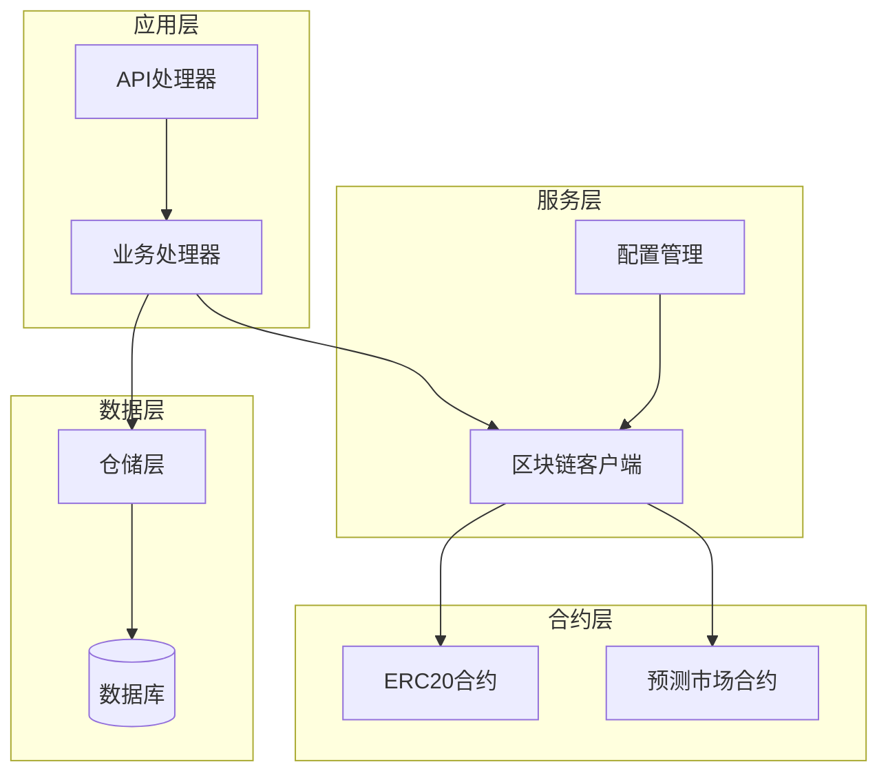
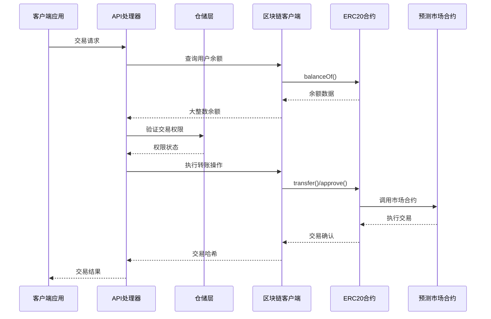
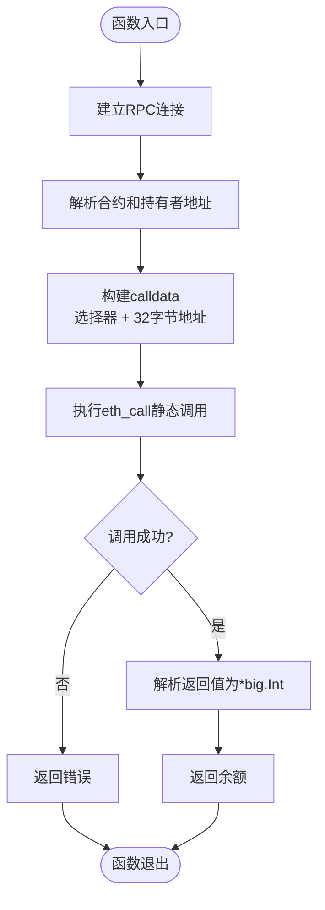
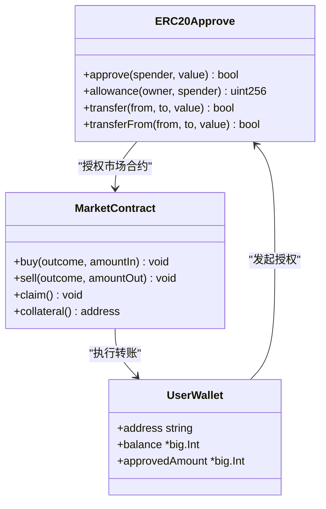
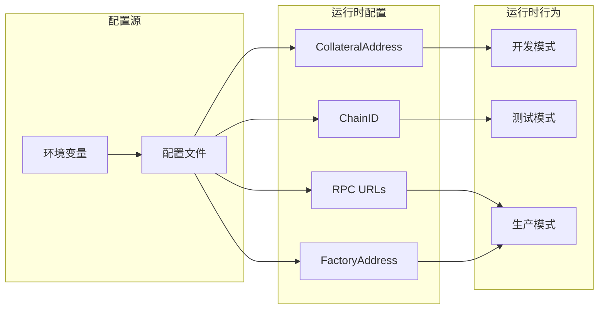
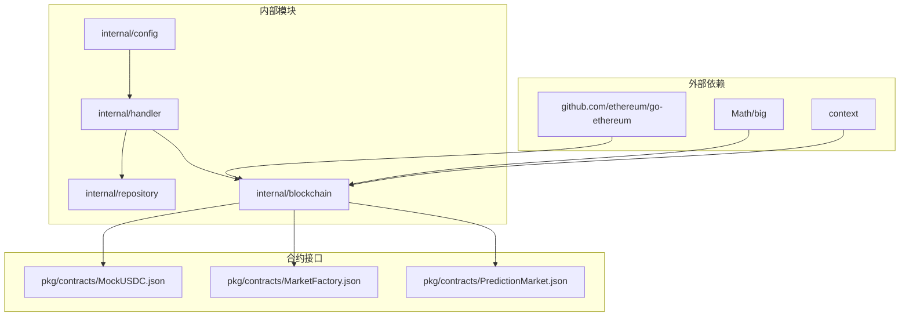

# ERC20代币集成

<cite>
**本文档引用的文件**
- [erc20.go](file://internal/blockchain/erc20.go)
- [MockUSDC.json](file://pkg/contracts/MockUSDC.json)
- [config.go](file://internal/config/config.go)
- [markets.go](file://internal/handler/markets.go)
- [client.go](file://internal/blockchain/client.go)
- [main.go](file://cmd/api/main.go)
- [market.go](file://internal/repository/market.go)
- [oracle_client.go](file://internal/blockchain/oracle_client.go)
- [main.go](file://cmd/reconcile/main.go)
</cite>

## 目录
1. [简介](#简介)
2. [项目结构](#项目结构)
3. [核心组件](#核心组件)
4. [架构概览](#架构概览)
5. [详细组件分析](#详细组件分析)
6. [依赖关系分析](#依赖关系分析)
7. [性能考虑](#性能考虑)
8. [故障排除指南](#故障排除指南)
9. [结论](#结论)

## 简介

PredictionDIDSimple项目中的ERC20代币集成为预测市场的核心金融基础设施，支持保证金存取、奖励发放和费用支付等关键功能。该项目实现了完整的ERC20标准兼容性，包括余额查询、授权管理和转账操作，并提供了与预测市场状态变更的协调机制。

该系统采用模块化设计，将区块链交互抽象为独立的客户端组件，确保了代码的可维护性和扩展性。通过配置驱动的方式，系统能够灵活适配不同的ERC20代币合约和网络环境。

## 项目结构

项目采用清晰的分层架构，ERC20代币集成主要分布在以下层次：

**图表来源**
- [main.go:124-131](file://cmd/api/main.go#L124-L131)
- [erc20.go:1-43](file://internal/blockchain/erc20.go#L1-L43)

**章节来源**
- [main.go:1-161](file://cmd/api/main.go#L1-L161)
- [config.go:1-139](file://internal/config/config.go#L1-L139)

## 核心组件

### ERC20余额查询工具

系统的核心是专门的ERC20余额查询工具，实现了高效的静态调用机制：

- **balanceOf函数选择器**: 使用keccak256("balanceOf(address)")[0:4]生成16进制选择器
- **静态调用模式**: 通过eth_call进行无状态合约调用，避免gas消耗
- **大整数处理**: 返回*big.Int类型，支持任意精度的代币余额计算

### 配置管理系统

系统通过集中化的配置管理确保ERC20集成的灵活性：

- **CollateralAddress**: 抵押代币合约地址配置
- **ChainID**: 网络ID验证，确保交易安全性
- **EthRPCURL**: 主RPC节点配置，支持故障转移
- **环境变量驱动**: 支持开发、测试和生产环境的无缝切换

### 市场集成接口

预测市场与ERC20代币的深度集成体现在多个层面：

- **保证金管理**: 支持YES/NO两种方向的保证金存入和提取
- **费用收取**: 自动计算和扣除交易手续费
- **奖励分配**: 市场结算时的奖励分发机制
- **状态同步**: 与链上状态保持实时同步

**章节来源**
- [erc20.go:14-42](file://internal/blockchain/erc20.go#L14-L42)
- [config.go:25-26](file://internal/config/config.go#L25-L26)
- [markets.go:21-26](file://internal/handler/markets.go#L21-L26)

## 架构概览

系统采用事件驱动的架构模式，ERC20代币集成在整个交易流程中发挥关键作用：

**图表来源**
- [markets.go:12-26](file://internal/handler/markets.go#L12-L26)
- [erc20.go:19-41](file://internal/blockchain/erc20.go#L19-L41)

## 详细组件分析

### ERC20余额查询实现

余额查询功能通过精心设计的静态调用机制实现高效的数据获取：

**图表来源**
- [erc20.go:19-41](file://internal/blockchain/erc20.go#L19-L41)

该实现的关键特性包括：
- **零gas成本**: 使用eth_call进行静态调用，无需签名和广播
- **类型安全**: 返回*big.Int确保大数运算的准确性
- **错误处理**: 完善的错误传播机制

### 代币授权管理

系统实现了完整的ERC20授权管理流程，支持多种授权场景：

**图表来源**
- [MockUSDC.json:182-191](file://pkg/contracts/MockUSDC.json#L182-L191)
- [MockUSDC.json:324-333](file://pkg/contracts/MockUSDC.json#L324-L333)

### 配置驱动的部署架构

系统通过配置管理实现灵活的部署选项：

**图表来源**
- [config.go:49-104](file://internal/config/config.go#L49-L104)
- [main.go:84-86](file://cmd/api/main.go#L84-L86)

**章节来源**
- [erc20.go:1-43](file://internal/blockchain/erc20.go#L1-L43)
- [MockUSDC.json:1-337](file://pkg/contracts/MockUSDC.json#L1-L337)
- [config.go:1-139](file://internal/config/config.go#L1-L139)

## 依赖关系分析

系统中的ERC20代币集成涉及多个关键依赖关系：

**图表来源**
- [erc20.go:5-12](file://internal/blockchain/erc20.go#L5-L12)
- [config.go:1-46](file://internal/config/config.go#L1-L46)

**章节来源**
- [client.go:1-94](file://internal/blockchain/client.go#L1-L94)
- [market.go:1-269](file://internal/repository/market.go#L1-L269)

## 性能考虑

### Gas费用优化策略

系统实施了多项Gas费用优化措施：

- **静态调用优化**: 使用eth_call避免不必要的gas消耗
- **批量查询**: 支持同时查询多个市场的余额状态
- **缓存机制**: 利用Redis缓存频繁查询的结果
- **智能估算**: 通过Oracle客户端的Gas估算功能优化交易成本

### 批量操作支持

系统支持高效的批量操作以提升用户体验：

- **批量对账**: reconcile命令支持批量市场余额核对
- **并发处理**: 多个市场状态的并行查询和处理
- **流水线操作**: 交易执行的流水线化处理减少等待时间

### 错误处理策略

完善的错误处理机制确保系统的稳定性：

- **重试机制**: 对RPC调用失败的自动重试
- **降级策略**: 在部分功能不可用时的优雅降级
- **超时控制**: 合理的超时设置防止资源泄露
- **监控告警**: 完善的监控和告警机制

**章节来源**
- [oracle_client.go:133-167](file://internal/blockchain/oracle_client.go#L133-L167)
- [main.go:72-96](file://cmd/reconcile/main.go#L72-L96)

## 故障排除指南

### 常见问题诊断

系统提供了全面的故障排除能力：

1. **RPC连接问题**: 通过后台ping机制检测节点健康状态
2. **链ID不匹配**: 实时验证期望chainID与实际chainID的一致性
3. **交易失败**: 详细的错误信息和回滚机制
4. **数据不一致**: 自动对账功能检测和报告差异

### 监控和调试

- **健康检查**: 定期的RPC节点健康检查
- **性能指标**: 关键操作的性能监控
- **日志记录**: 详细的日志记录便于问题追踪
- **告警机制**: 异常情况的及时告警通知

**章节来源**
- [client.go:30-83](file://internal/blockchain/client.go#L30-L83)

## 结论

PredictionDIDSimple项目的ERC20代币集成为预测市场提供了坚实的技术基础。通过模块化的设计、完善的错误处理机制和性能优化策略，系统实现了高可用、高效率的代币管理功能。

该集成不仅满足了当前的业务需求，还为未来的扩展和升级预留了充足的空间。通过配置驱动的方式，系统能够快速适应不同的部署环境和业务场景，确保了长期的可持续发展。

关键优势包括：
- **安全性**: 严格的权限控制和多重验证机制
- **可靠性**: 完善的错误处理和故障恢复机制  
- **可扩展性**: 模块化设计支持功能扩展
- **可维护性**: 清晰的代码结构和文档支持