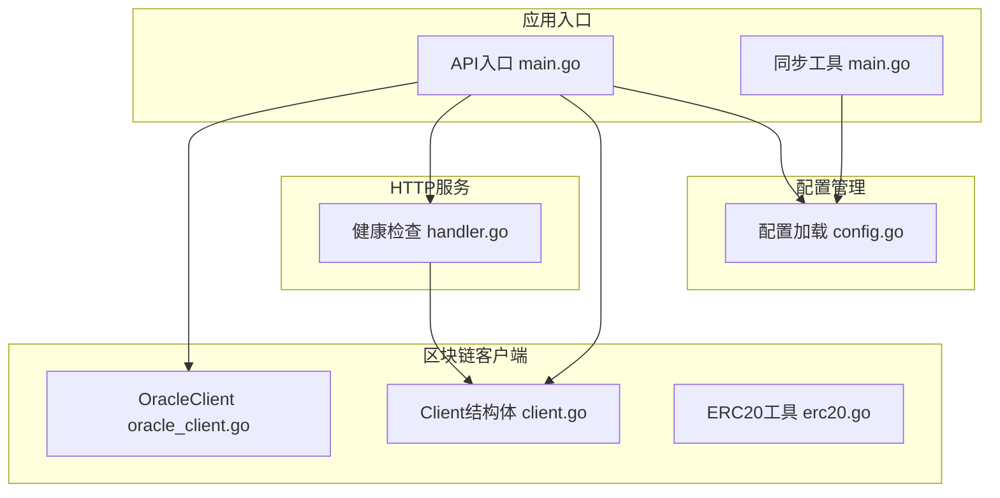
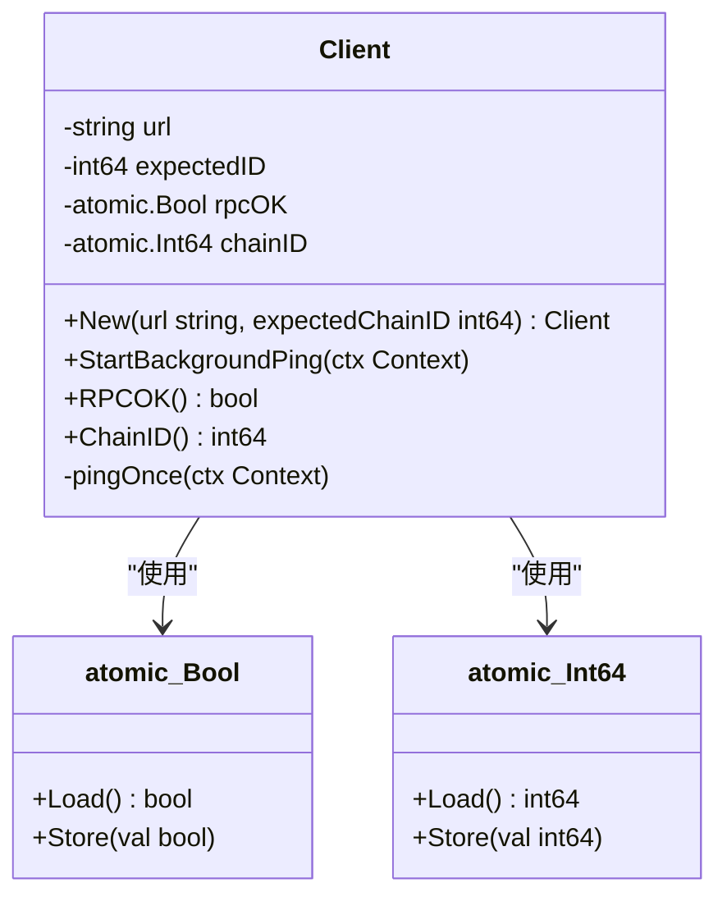
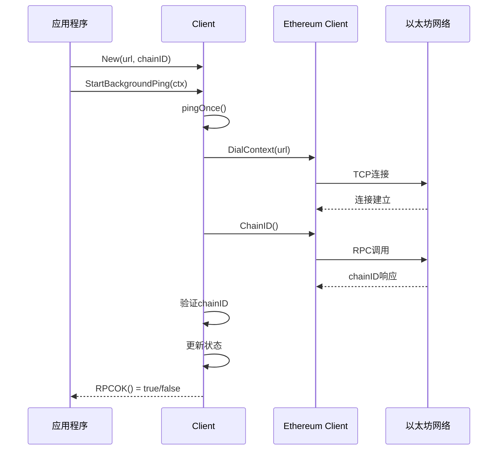
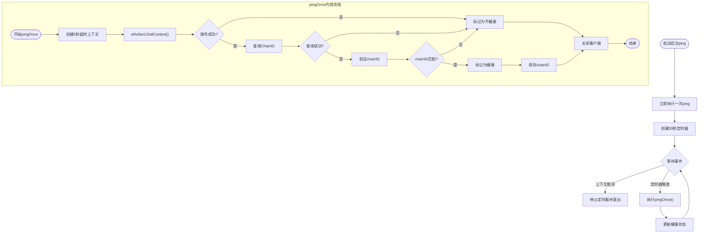
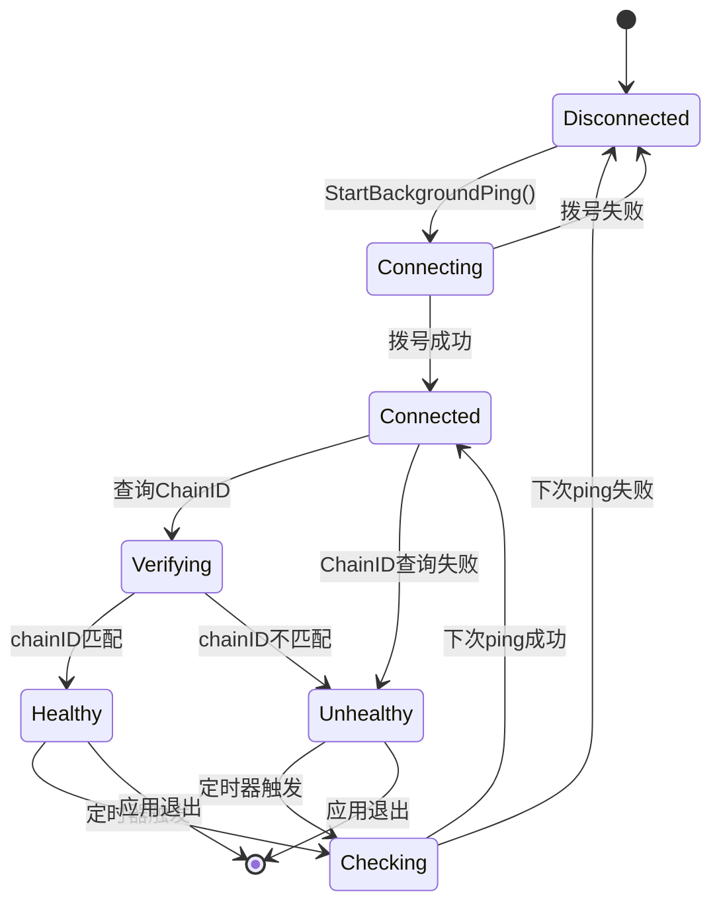
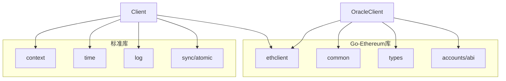
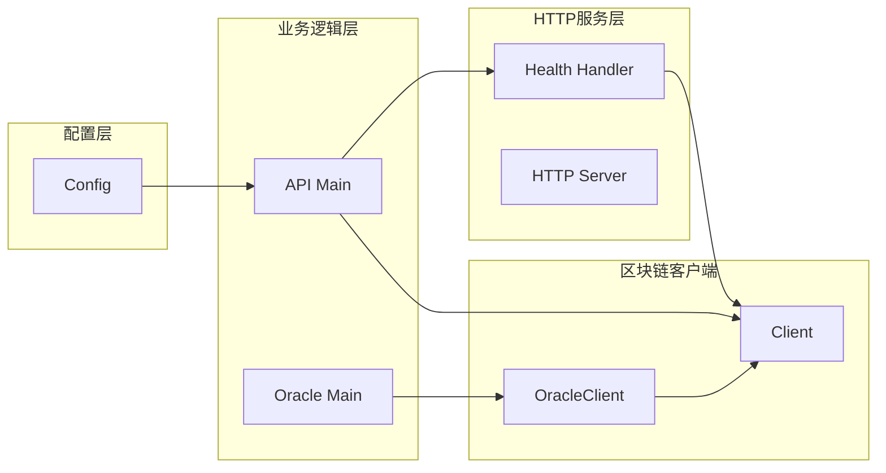

# 以太坊客户端

<cite>
**本文档引用的文件**
- [client.go](file://internal/blockchain/client.go)
- [config.go](file://internal/config/config.go)
- [main.go](file://cmd/api/main.go)
- [health.go](file://internal/handler/health.go)
- [oracle_client.go](file://internal/blockchain/oracle_client.go)
- [erc20.go](file://internal/blockchain/erc20.go)
</cite>

## 目录
1. [简介](#简介)
2. [项目结构](#项目结构)
3. [核心组件](#核心组件)
4. [架构概览](#架构概览)
5. [详细组件分析](#详细组件分析)
6. [依赖关系分析](#依赖关系分析)
7. [性能考虑](#性能考虑)
8. [故障排除指南](#故障排除指南)
9. [结论](#结论)

## 简介

PredictionDIDSimple项目的以太坊客户端是一个轻量级的区块链状态监控组件，主要负责维护RPC连接的健康状态、执行定期的心跳检查以及验证链ID的一致性。该客户端采用原子操作确保线程安全的状态管理，并提供了简洁的API供其他组件使用。

该客户端的核心特性包括：
- 后台定时心跳机制，每30秒自动检查RPC连接状态
- 5秒超时的连接拨号和链ID查询
- chainID验证，确保连接到正确的区块链网络
- 原子化的状态存储，支持并发访问
- 简洁的健康状态查询接口

## 项目结构

以太坊客户端位于`internal/blockchain`包中，与配置管理、HTTP服务、健康检查等功能模块协同工作：



**图表来源**
- [main.go:27-86](file://cmd/api/main.go#L27-L86)
- [config.go:49-104](file://internal/config/config.go#L49-L104)
- [client.go:14-28](file://internal/blockchain/client.go#L14-L28)

**章节来源**
- [client.go:1-94](file://internal/blockchain/client.go#L1-L94)
- [config.go:1-139](file://internal/config/config.go#L1-L139)
- [main.go:1-161](file://cmd/api/main.go#L1-L161)

## 核心组件

### Client结构体设计

Client结构体是整个以太坊客户端的核心，采用了精心设计的数据结构来确保线程安全和高效的状态管理：



**图表来源**
- [client.go:14-28](file://internal/blockchain/client.go#L14-L28)

### 关键字段说明

| 字段名 | 类型 | 描述 | 使用场景 |
|--------|------|------|----------|
| url | string | RPC服务URL地址 | 连接拨号和日志输出 |
| expectedID | int64 | 期望的chainID值 | 链ID一致性验证 |
| rpcOK | atomic.Bool | RPC连接健康状态标志 | 并发安全的状态查询 |
| chainID | atomic.Int64 | 最近一次查询到的chainID | 链信息获取 |

**章节来源**
- [client.go:14-28](file://internal/blockchain/client.go#L14-L28)

## 架构概览

以太坊客户端在整个系统架构中扮演着关键角色，作为底层区块链连接的抽象层：



**图表来源**
- [client.go:30-83](file://internal/blockchain/client.go#L30-L83)
- [main.go:83-86](file://cmd/api/main.go#L83-L86)

## 详细组件分析

### StartBackgroundPing方法实现

StartBackgroundPing是客户端的核心后台监控机制，实现了定时的心跳检查功能：



**图表来源**
- [client.go:30-83](file://internal/blockchain/client.go#L30-L83)

#### 实现细节分析

**超时处理机制**：
- 每次ping操作都有5秒的超时限制
- 使用`context.WithTimeout`确保不会无限等待
- 超时会触发错误处理逻辑

**错误恢复策略**：
- 拨号失败：标记RPC为不健康状态
- ChainID查询失败：同样标记为不健康
- chainID不匹配：标记为不健康但记录实际chainID
- 成功时：更新健康状态和chainID缓存

**资源管理**：
- 每次ping都会正确关闭ethclient连接
- 使用defer确保资源及时释放
- 避免连接泄漏

**章节来源**
- [client.go:30-83](file://internal/blockchain/client.go#L30-L83)

### RPC连接生命周期管理

客户端实现了完整的RPC连接生命周期管理：



**图表来源**
- [client.go:30-83](file://internal/blockchain/client.go#L30-L83)

#### 生命周期阶段说明

1. **Disconnected阶段**：初始状态，等待启动
2. **Connecting阶段**：执行拨号操作
3. **Connected阶段**：连接建立成功
4. **Verifying阶段**：验证chainID一致性
5. **Healthy阶段**：所有检查通过，RPC健康
6. **Unhealthy阶段**：某个检查失败，RPC不健康

**章节来源**
- [client.go:30-83](file://internal/blockchain/client.go#L30-L83)

### 状态监控和查询接口

客户端提供了两个核心的状态查询方法：

```mermaid
classDiagram
class Client {
+RPCOK() bool
+ChainID() int64
}
note for Client : "原子操作保证线程安全\n无需互斥锁保护"
class RPCOK {
+返回 : bool
+描述 : 当前RPC是否健康
+实现 : rpcOK.Load()
}
class ChainID {
+返回 : int64
+描述 : 最近一次记录的chainID
+实现 : chainID.Load()
}
Client --> RPCOK : "提供"
Client --> ChainID : "提供"
```

**图表来源**
- [client.go:85-93](file://internal/blockchain/client.go#L85-L93)

**章节来源**
- [client.go:85-93](file://internal/blockchain/client.go#L85-L93)

## 依赖关系分析

### 外部依赖

客户端主要依赖以下外部库：



**图表来源**
- [client.go:5-12](file://internal/blockchain/client.go#L5-L12)
- [oracle_client.go:5-23](file://internal/blockchain/oracle_client.go#L5-L23)

### 内部集成关系

客户端与系统其他组件的集成关系：



**图表来源**
- [main.go:83-86](file://cmd/api/main.go#L83-L86)
- [health.go:13-18](file://internal/handler/health.go#L13-L18)

**章节来源**
- [client.go:5-12](file://internal/blockchain/client.go#L5-L12)
- [main.go:83-86](file://cmd/api/main.go#L83-L86)
- [health.go:13-18](file://internal/handler/health.go#L13-L18)

## 性能考虑

### 内存使用优化

1. **原子操作替代互斥锁**：使用`sync/atomic`包避免锁竞争
2. **连接复用策略**：每次ping都创建新连接并在完成后关闭
3. **最小化状态存储**：只存储必要的布尔值和整数值

### 网络性能优化

1. **超时控制**：每个RPC操作都有明确的超时限制
2. **定时器优化**：30秒的检查间隔平衡了实时性和资源消耗
3. **连接池考虑**：当前实现为每个操作创建独立连接

### 并发安全性

1. **原子状态管理**：所有状态访问都是原子操作
2. **上下文传播**：支持优雅的取消和超时处理
3. **goroutine安全**：设计为完全线程安全的组件

## 故障排除指南

### 常见RPC连接问题

#### 1. 拨号失败
**症状**：日志显示RPC拨号失败
**可能原因**：
- RPC URL配置错误
- 网络连接问题
- 防火墙阻止连接
- 节点离线

**解决方案**：
- 验证RPC URL格式和可达性
- 检查网络连接状态
- 确认防火墙设置
- 测试手动连接

#### 2. ChainID不匹配
**症状**：日志显示chainID不匹配警告
**可能原因**：
- 连接到错误的区块链网络
- 配置文件中的chainID错误
- 多个RPC节点配置混淆

**解决方案**：
- 验证配置文件中的CHAIN_ID设置
- 确认RPC节点对应正确的网络
- 检查是否有多个RPC配置冲突

#### 3. 超时问题
**症状**：ping操作超时
**可能原因**：
- 网络延迟过高
- RPC节点负载过重
- DNS解析问题

**解决方案**：
- 优化网络连接
- 选择更稳定的RPC节点
- 检查DNS配置

### 调试技巧

#### 1. 启用详细日志
```bash
# 设置日志级别
export LOG_LEVEL=DEBUG
```

#### 2. 监控健康状态
```bash
# 检查健康检查端点
curl http://localhost:8080/health
curl http://localhost:8080/ready
```

#### 3. 验证配置
```bash
# 检查配置加载
echo "RPC URL: $ETH_RPC_URL"
echo "Chain ID: $CHAIN_ID"
```

**章节来源**
- [client.go:56-77](file://internal/blockchain/client.go#L56-L77)
- [health.go:62-68](file://internal/handler/health.go#L62-L68)

## 结论

PredictionDIDSimple项目的以太坊客户端是一个设计精良的轻量级组件，具有以下特点：

**优势**：
- 简洁的设计和清晰的职责分离
- 原子操作确保线程安全
- 完善的错误处理和超时控制
- 合理的性能权衡

**适用场景**：
- 需要监控RPC连接状态的应用
- 对性能要求不是特别严格的服务
- 需要简单可靠区块链连接的场景

**改进建议**：
- 考虑实现连接池以减少频繁拨号开销
- 添加重连机制支持自动恢复
- 增加更多的监控指标和统计信息
- 支持多RPC节点的故障转移

该客户端为PredictionDIDSimple项目提供了可靠的区块链连接基础，通过合理的架构设计和错误处理机制，确保了系统的稳定性和可靠性。