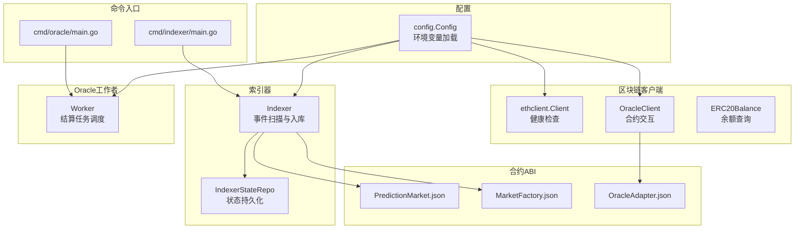
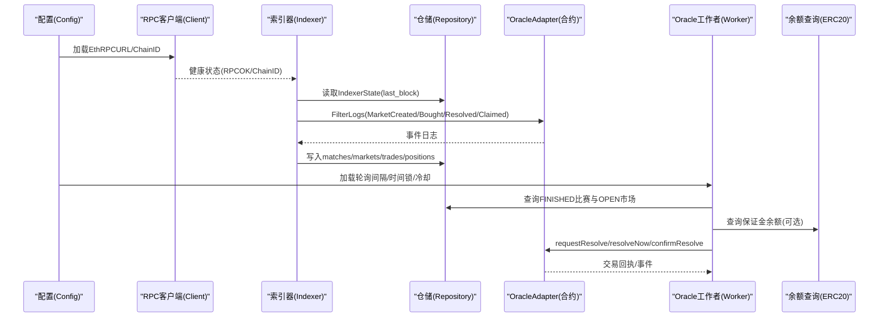
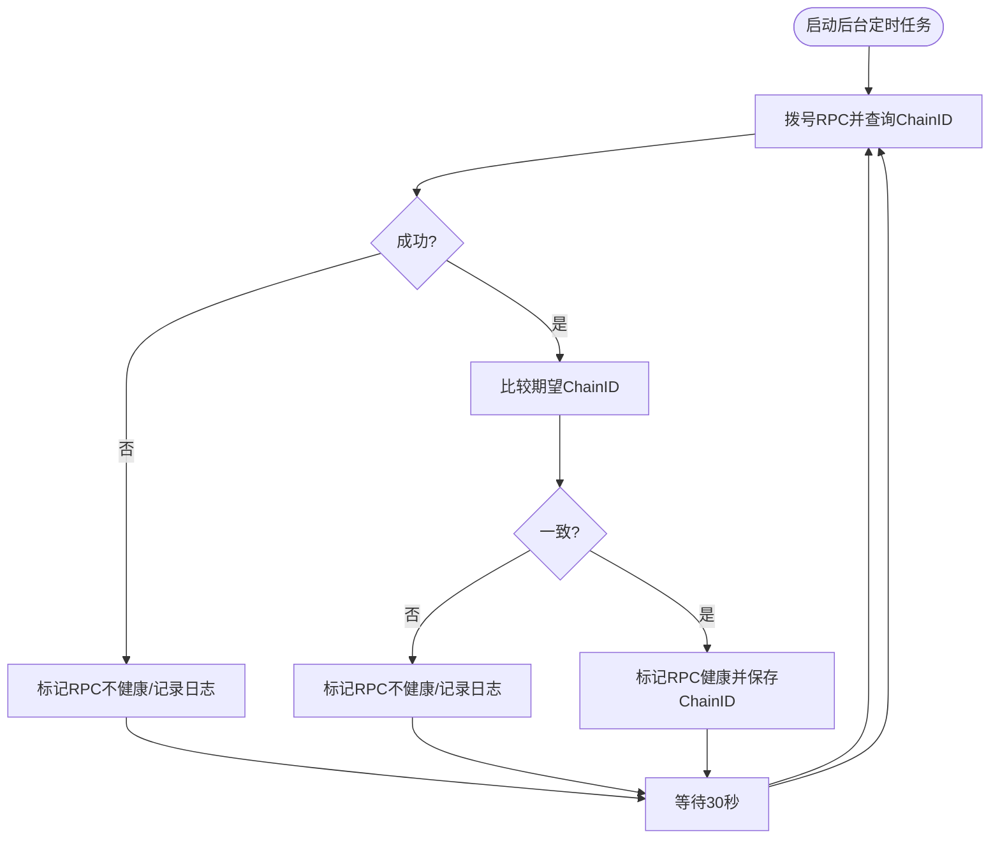
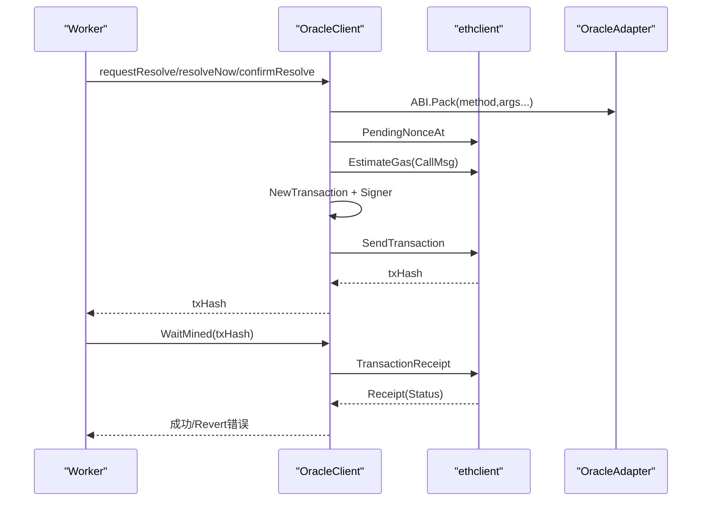
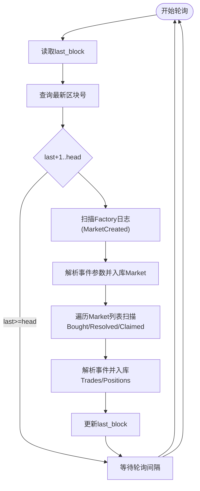
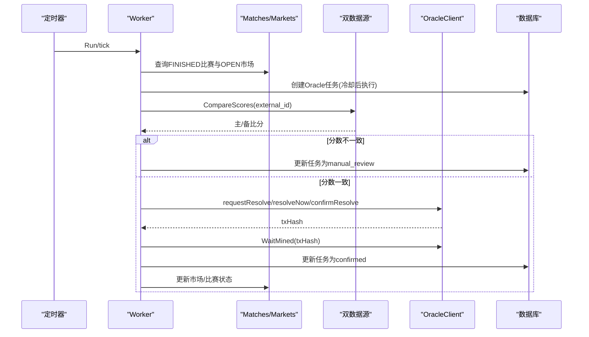
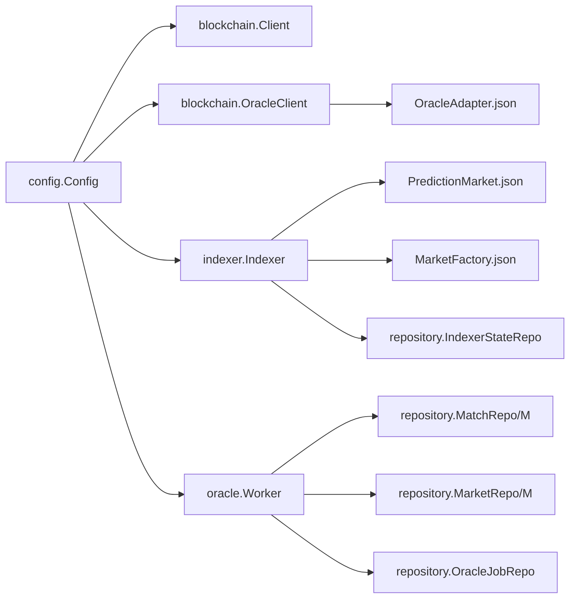

# 区块链集成

<cite>
**本文档引用的文件**
- [internal/blockchain/client.go](file://internal/blockchain/client.go)
- [internal/blockchain/oracle_client.go](file://internal/blockchain/oracle_client.go)
- [internal/blockchain/erc20.go](file://internal/blockchain/erc20.go)
- [internal/indexer/indexer.go](file://internal/indexer/indexer.go)
- [internal/config/config.go](file://internal/config/config.go)
- [internal/oracle/worker.go](file://internal/oracle/worker.go)
- [cmd/indexer/main.go](file://cmd/indexer/main.go)
- [cmd/oracle/main.go](file://cmd/oracle/main.go)
- [internal/repository/indexer_state.go](file://internal/repository/indexer_state.go)
- [internal/models/models.go](file://internal/models/models.go)
- [pkg/contracts/PredictionMarket.json](file://pkg/contracts/PredictionMarket.json)
- [pkg/contracts/MarketFactory.json](file://pkg/contracts/MarketFactory.json)
- [pkg/contracts/OracleAdapter.json](file://pkg/contracts/OracleAdapter.json)
- [migrations/000002_phase1.up.sql](file://migrations/000002_phase1.up.sql)
</cite>

## 目录
1. [简介](#简介)
2. [项目结构](#项目结构)
3. [核心组件](#核心组件)
4. [架构总览](#架构总览)
5. [详细组件分析](#详细组件分析)
6. [依赖关系分析](#依赖关系分析)
7. [性能考虑](#性能考虑)
8. [故障排查指南](#故障排查指南)
9. [结论](#结论)
10. [附录](#附录)

## 简介
本文件面向PredictionDIDSimple项目的区块链集成，系统性阐述以太坊客户端配置、智能合约交互与事件监听机制。重点覆盖以下内容：
- 以太坊客户端健康检查与RPC可用性保障
- 智能合约交互：MarketFactory、PredictionMarket、OracleAdapter
- 事件监听与索引：MarketCreated、Bought、Resolved、Claimed等
- Oracle结算流程：请求结算、时间锁、确认结算
- 数据同步机制与Indexer工作原理
- 错误处理策略、重试与性能优化建议
- 常见问题与调试技巧

## 项目结构
区块链相关代码主要分布在以下模块：
- 配置加载：internal/config
- 区块链客户端与交互：internal/blockchain
- 索引器：internal/indexer
- Oracle工作者：internal/oracle
- 命令入口：cmd/indexer、cmd/oracle
- 数据模型与仓储：internal/models、internal/repository
- 合约ABI：pkg/contracts
- 数据库表结构：migrations

图表来源
- [internal/config/config.go:12-46](file://internal/config/config.go#L12-L46)
- [internal/blockchain/client.go:14-28](file://internal/blockchain/client.go#L14-L28)
- [internal/blockchain/oracle_client.go:25-32](file://internal/blockchain/oracle_client.go#L25-L32)
- [internal/blockchain/erc20.go:18-42](file://internal/blockchain/erc20.go#L18-L42)
- [internal/indexer/indexer.go:26-36](file://internal/indexer/indexer.go#L26-L36)
- [internal/repository/indexer_state.go:11-19](file://internal/repository/indexer_state.go#L11-L19)
- [cmd/indexer/main.go:17-51](file://cmd/indexer/main.go#L17-L51)
- [cmd/oracle/main.go:20-66](file://cmd/oracle/main.go#L20-L66)
- [pkg/contracts/PredictionMarket.json:1-348](file://pkg/contracts/PredictionMarket.json#L1-L348)
- [pkg/contracts/MarketFactory.json:1-251](file://pkg/contracts/MarketFactory.json#L1-L251)
- [pkg/contracts/OracleAdapter.json:1-473](file://pkg/contracts/OracleAdapter.json#L1-L473)

章节来源
- [internal/config/config.go:48-105](file://internal/config/config.go#L48-L105)
- [cmd/indexer/main.go:17-51](file://cmd/indexer/main.go#L17-L51)
- [cmd/oracle/main.go:20-66](file://cmd/oracle/main.go#L20-L66)

## 核心组件
- 以太坊客户端健康检查：定期ping RPC节点，校验chainID，维护健康状态
- Oracle客户端：加载OracleAdapter ABI，构造交易，估算gas，签名发送，等待上链
- 索引器：按区块范围扫描Factory与各市场事件，解析并入库
- Oracle工作者：基于比赛状态与比分数据源，发起链上结算请求或确认
- 配置管理：集中加载环境变量，提供链ID、合约地址、轮询间隔等

章节来源
- [internal/blockchain/client.go:14-94](file://internal/blockchain/client.go#L14-L94)
- [internal/blockchain/oracle_client.go:25-193](file://internal/blockchain/oracle_client.go#L25-L193)
- [internal/indexer/indexer.go:26-329](file://internal/indexer/indexer.go#L26-L329)
- [internal/oracle/worker.go:18-214](file://internal/oracle/worker.go#L18-L214)
- [internal/config/config.go:48-105](file://internal/config/config.go#L48-L105)

## 架构总览
下图展示了从配置到索引器与Oracle工作者的整体交互，以及与智能合约的调用关系。

图表来源
- [internal/config/config.go:12-46](file://internal/config/config.go#L12-L46)
- [internal/blockchain/client.go:30-83](file://internal/blockchain/client.go#L30-L83)
- [internal/indexer/indexer.go:97-160](file://internal/indexer/indexer.go#L97-L160)
- [internal/oracle/worker.go:42-121](file://internal/oracle/worker.go#L42-L121)
- [internal/blockchain/erc20.go:18-42](file://internal/blockchain/erc20.go#L18-L42)

## 详细组件分析

### 以太坊客户端与健康检查
- 功能要点
  - 后台定时ping RPC节点，周期30秒
  - 拨号RPC、查询ChainID并与期望值对比
  - 使用原子布尔与原子整数维护健康状态与chainID
- 关键行为
  - 失败时记录警告日志，健康状态置false
  - 成功时更新chainID并标记健康
- 适用场景
  - 作为索引器与Oracle工作者的前置健康检查
  - 配置中同时设置期望chainID，避免链ID不一致导致的异常

图表来源
- [internal/blockchain/client.go:30-83](file://internal/blockchain/client.go#L30-L83)

章节来源
- [internal/blockchain/client.go:14-94](file://internal/blockchain/client.go#L14-L94)

### Oracle客户端与智能合约交互
- 功能要点
  - 加载OracleAdapter ABI，解析私钥，构造交易选项
  - 支持函数：requestResolve、confirmResolve、resolveNow、voidMarket
  - 通用transact流程：ABI编码、查询nonce、估算gas、签名、发送、返回txHash
  - WaitMined轮询等待上链，检测revert并返回错误
- 交易流程
  - pack方法参数 -> EstimateGas(保守值) -> NewTransaction -> Signer -> SendTransaction
  - 上链后通过TransactionReceipt判断状态，0表示revert
- 适用场景
  - Oracle工作者发起结算请求与确认
  - 管理员路径直接结算或作废市场

图表来源
- [internal/blockchain/oracle_client.go:112-167](file://internal/blockchain/oracle_client.go#L112-L167)
- [internal/blockchain/oracle_client.go:169-193](file://internal/blockchain/oracle_client.go#L169-L193)

章节来源
- [internal/blockchain/oracle_client.go:25-193](file://internal/blockchain/oracle_client.go#L25-L193)

### ERC20余额查询
- 功能要点
  - 通过静态调用balanceOf(address)查询指定账户在代币合约中的余额
  - 使用固定函数选择器与地址参数拼接calldata
  - 返回uint256结果
- 适用场景
  - 校验保证金、资金池状态或用户资产

章节来源
- [internal/blockchain/erc20.go:18-42](file://internal/blockchain/erc20.go#L18-L42)

### 索引器与事件监听
- 功能要点
  - 读取IndexerState(last_block)，结合配置的起始区块与轮询间隔
  - 每轮扫描上限2000区块，避免RPC超时
  - 扫描MarketFactory的MarketCreated事件，解析问题、结束时间、matchRef
  - 扫描各市场Bought/Resolved/Claimed事件，解析参数并入库
  - matchRefToExternal将哈希映射为可读external_id
- 数据模型
  - Market、Match、Position、Trades等模型与数据库表结构对应

图表来源
- [internal/indexer/indexer.go:97-160](file://internal/indexer/indexer.go#L97-L160)
- [internal/indexer/indexer.go:162-228](file://internal/indexer/indexer.go#L162-L228)
- [internal/indexer/indexer.go:251-290](file://internal/indexer/indexer.go#L251-L290)
- [internal/repository/indexer_state.go:21-35](file://internal/repository/indexer_state.go#L21-L35)

章节来源
- [internal/indexer/indexer.go:26-329](file://internal/indexer/indexer.go#L26-L329)
- [internal/models/models.go:6-62](file://internal/models/models.go#L6-L62)
- [migrations/000002_phase1.up.sql:1-76](file://migrations/000002_phase1.up.sql#L1-L76)

### Oracle工作者与结算流程
- 功能要点
  - 每轮tick：将FINISHED比赛入队，冷却后处理到期任务
  - 从双数据源获取比分并比对，不一致则进入人工审核
  - 根据市场结算规则计算获胜结果
  - 无时间锁：直接resolveNow；有时间锁：先requestResolve -> 等待上链 -> 等待时间锁 -> confirmResolve
  - 更新任务状态、市场状态与比赛状态
- 关键配置
  - 轮询间隔、冷却时间、时间锁秒数、Oracle私钥与适配器地址

图表来源
- [internal/oracle/worker.go:42-121](file://internal/oracle/worker.go#L42-L121)
- [internal/oracle/worker.go:123-205](file://internal/oracle/worker.go#L123-L205)

章节来源
- [internal/oracle/worker.go:18-214](file://internal/oracle/worker.go#L18-L214)

### 智能合约ABI与功能概览
- MarketFactory
  - 事件：MarketCreated
  - 函数：createMarket、owner、setOracle、transferOwnership等
- PredictionMarket
  - 事件：Bought、Resolved、Claimed、MarketVoided
  - 函数：buy、claim、resolve、voidMarket、status、winningOutcome等
- OracleAdapter
  - 事件：OracleResolveRequested、OracleResolveConfirmed、MarketVoided
  - 函数：requestResolve、confirmResolve、resolveNow、voidMarket、grantOracle、setTimelockDelay等

章节来源
- [pkg/contracts/MarketFactory.json:1-251](file://pkg/contracts/MarketFactory.json#L1-L251)
- [pkg/contracts/PredictionMarket.json:1-348](file://pkg/contracts/PredictionMarket.json#L1-L348)
- [pkg/contracts/OracleAdapter.json:1-473](file://pkg/contracts/OracleAdapter.json#L1-L473)

## 依赖关系分析
- 配置驱动：所有组件均依赖config.Config提供的运行参数
- 索引器依赖数据库仓储与合约ABI，负责链上事件到数据库的同步
- Oracle工作者依赖索引器产出的市场与比赛状态，结合数据源完成结算
- Oracle客户端依赖合约ABI与私钥，负责链上交易的构建与提交

图表来源
- [internal/config/config.go:12-46](file://internal/config/config.go#L12-L46)
- [internal/indexer/indexer.go:26-65](file://internal/indexer/indexer.go#L26-L65)
- [internal/oracle/worker.go:19-40](file://internal/oracle/worker.go#L19-L40)
- [internal/blockchain/oracle_client.go:25-64](file://internal/blockchain/oracle_client.go#L25-L64)
- [pkg/contracts/PredictionMarket.json:1-348](file://pkg/contracts/PredictionMarket.json#L1-L348)
- [pkg/contracts/MarketFactory.json:1-251](file://pkg/contracts/MarketFactory.json#L1-L251)
- [pkg/contracts/OracleAdapter.json:1-473](file://pkg/contracts/OracleAdapter.json#L1-L473)

章节来源
- [internal/config/config.go:48-105](file://internal/config/config.go#L48-L105)
- [internal/indexer/indexer.go:26-65](file://internal/indexer/indexer.go#L26-L65)
- [internal/oracle/worker.go:19-40](file://internal/oracle/worker.go#L19-L40)
- [internal/blockchain/oracle_client.go:25-64](file://internal/blockchain/oracle_client.go#L25-L64)

## 性能考虑
- 索引器轮询
  - 控制轮询间隔与区块扫描上限，避免RPC超时与网络压力
  - 使用last_block增量扫描，减少重复工作
- 交易成本
  - 估算gas失败时采用保守值，平衡成功率与成本
  - 合理设置gasPrice，结合SuggestGasPrice动态调整
- 并发与重试
  - 对RPC调用增加context超时，避免阻塞
  - 对上链等待采用指数退避或固定间隔轮询
- 数据库
  - 使用连接池与批量写入，降低写入延迟
  - 为高频查询建立索引（如markets.status、markets.match_id）

[本节为通用指导，无需列出章节来源]

## 故障排查指南
- RPC不可用
  - 检查EthRPCURL与ChainID配置，确认健康检查日志
  - 切换备用RPC，确保网络连通性
- 交易上链失败
  - 检查WaitMined返回的receipt状态，0表示revert
  - 核对nonce、gasPrice、gasLimit与链上状态
- 事件未入库
  - 确认Factory地址与ABI正确，检查last_block是否推进
  - 校验事件topics与数据解析逻辑
- Oracle结算异常
  - 核对时间锁配置与冷却时间
  - 比对双数据源比分一致性，必要时人工审核
- 权限与角色
  - OracleAdapter需授予ORACLE_ROLE权限，确认私钥与链上账户匹配

章节来源
- [internal/blockchain/client.go:30-83](file://internal/blockchain/client.go#L30-L83)
- [internal/blockchain/oracle_client.go:169-193](file://internal/blockchain/oracle_client.go#L169-L193)
- [internal/indexer/indexer.go:97-160](file://internal/indexer/indexer.go#L97-L160)
- [internal/oracle/worker.go:123-205](file://internal/oracle/worker.go#L123-L205)

## 结论
本项目通过配置驱动的以太坊客户端、完善的索引器事件同步与Oracle工作者结算流程，实现了从链上事件到数据库的可靠同步与自动化结算。建议在生产环境中：
- 明确配置项与链ID校验
- 严格控制索引器轮询与区块扫描范围
- 为交易与上链等待设计合理的重试与告警
- 对Oracle结算流程进行充分测试与监控

[本节为总结性内容，无需列出章节来源]

## 附录

### 常用配置项
- ETH_RPC_URL：主RPC地址
- CHAIN_ID：链ID（用于健康检查校验）
- MARKET_FACTORY_ADDRESS：工厂合约地址
- ORACLE_ADAPTER_ADDRESS：Oracle适配器地址
- ORACLE_PRIVATE_KEY：Oracle签名私钥
- INDEXER_POLL_SECONDS：索引器轮询间隔
- ORACLE_POLL_SECONDS：Oracle工作者轮询间隔
- ORACLE_TIMELOCK_SECONDS：时间锁秒数
- ORACLE_COOLDOWN_MINUTES：冷却时间（分钟）

章节来源
- [internal/config/config.go:48-105](file://internal/config/config.go#L48-L105)

### 数据库表结构要点
- matches：比赛信息与状态
- markets：预测市场与池子状态
- trades：交易明细
- positions：用户持仓
- indexer_state：索引器扫描进度

章节来源
- [migrations/000002_phase1.up.sql:1-76](file://migrations/000002_phase1.up.sql#L1-L76)