# 智能合约交互

<cite>
**本文档引用的文件**
- [DIDRegistry.json](file://pkg/contracts/DIDRegistry.json)
- [MarketFactory.json](file://pkg/contracts/MarketFactory.json)
- [MarketFactoryV3.json](file://pkg/contracts/MarketFactoryV3.json)
- [MultiOutcomeMarket.json](file://pkg/contracts/MultiOutcomeMarket.json)
- [OracleAdapter.json](file://pkg/contracts/OracleAdapter.json)
- [OracleAdapterV2.json](file://pkg/contracts/OracleAdapterV2.json)
- [PredictionMarket.json](file://pkg/contracts/PredictionMarket.json)
- [PredictionMarketV3.json](file://pkg/contracts/PredictionMarketV3.json)
- [MockUSDC.json](file://pkg/contracts/MockUSDC.json)
- [go.mod](file://go.mod)
</cite>

## 目录
1. [引言](#引言)
2. [项目结构](#项目结构)
3. [核心组件](#核心组件)
4. [架构总览](#架构总览)
5. [详细组件分析](#详细组件分析)
6. [依赖关系分析](#依赖关系分析)
7. [性能考量](#性能考量)
8. [故障排查指南](#故障排查指南)
9. [结论](#结论)

## 引言
本文件面向PredictionDIDSimple项目的智能合约交互，系统性梳理预测市场相关合约的功能、ABI接口与事件定义，总结读取、写入与事件监听的交互模式，并给出合约地址管理、参数处理与返回值解析的实践建议。同时覆盖合约升级路径与向后兼容性要点，帮助开发者在实际业务中安全、稳定地集成与扩展。

## 项目结构
项目采用分层组织方式：合约ABI定义集中于pkg/contracts目录；后端服务通过以太坊客户端与链上交互；数据库与索引模块负责数据持久化与查询加速。核心依赖包括以太坊客户端库、HTTP路由框架、数据库驱动与Redis缓存等。

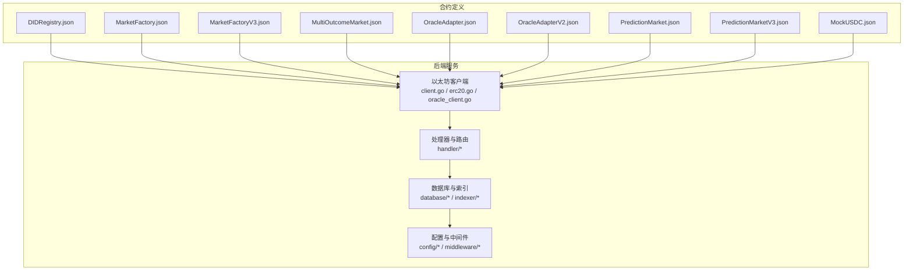

图示来源
- [go.mod:5-14](file://go.mod#L5-L14)

章节来源
- [go.mod:1-56](file://go.mod#L1-L56)

## 核心组件
本节概述各核心合约的职责与关键能力：
- DIDRegistry：去中心化身份绑定与解析，支持签名验证与所有权管理。
- MarketFactory/MarketFactoryV3：市场工厂，负责创建二元与多结果市场，支持费用、暂停与阈值等治理参数。
- MultiOutcomeMarket：多结果市场，支持多结局投注与结算。
- OracleAdapter/OracleAdapterV2：预言机适配器，用于请求/确认/执行市场结果决议，具备角色权限与提案机制。
- PredictionMarket/PredictionMarketV3：二元预测市场，支持流动性注入、买卖、结算与状态管理。
- MockUSDC：模拟USDC代币，便于测试与本地开发。

章节来源
- [DIDRegistry.json:1-187](file://pkg/contracts/DIDRegistry.json#L1-L187)
- [MarketFactory.json:1-251](file://pkg/contracts/MarketFactory.json#L1-L251)
- [MarketFactoryV3.json:1-446](file://pkg/contracts/MarketFactoryV3.json#L1-L446)
- [MultiOutcomeMarket.json:1-363](file://pkg/contracts/MultiOutcomeMarket.json#L1-L363)
- [OracleAdapter.json:1-473](file://pkg/contracts/OracleAdapter.json#L1-L473)
- [OracleAdapterV2.json:1-496](file://pkg/contracts/OracleAdapterV2.json#L1-L496)
- [PredictionMarket.json:1-348](file://pkg/contracts/PredictionMarket.json#L1-L348)
- [PredictionMarketV3.json:1-582](file://pkg/contracts/PredictionMarketV3.json#L1-L582)
- [MockUSDC.json:1-337](file://pkg/contracts/MockUSDC.json#L1-L337)

## 架构总览
下图展示了从后端到链上合约的典型交互路径：后端服务通过以太坊客户端发起交易或查询，合约返回事件日志与状态变更，索引模块消费事件并更新数据库，最终由API层对外提供查询与订阅能力。

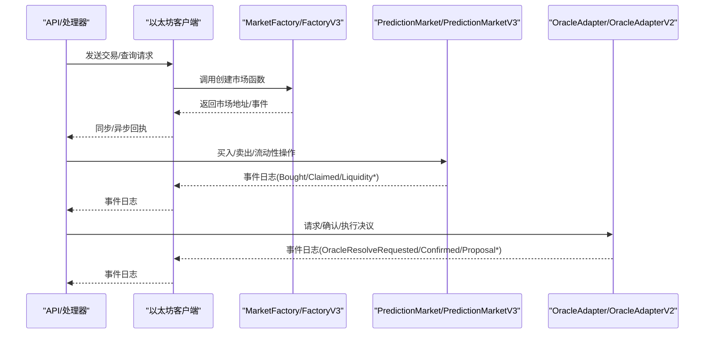

图示来源
- [MarketFactory.json:129-143](file://pkg/contracts/MarketFactory.json#L129-L143)
- [MarketFactoryV3.json:200-253](file://pkg/contracts/MarketFactoryV3.json#L200-L253)
- [PredictionMarket.json:127-130](file://pkg/contracts/PredictionMarket.json#L127-L130)
- [PredictionMarketV3.json:186-207](file://pkg/contracts/PredictionMarketV3.json#L186-L207)
- [OracleAdapter.json:359-362](file://pkg/contracts/OracleAdapter.json#L359-L362)
- [OracleAdapterV2.json:389-398](file://pkg/contracts/OracleAdapterV2.json#L389-L398)

## 详细组件分析

### PredictionMarket（二元预测市场）
- 功能定位：二元市场，支持YES/NO两种结果的投注与结算。
- 关键函数
  - 读取类：collateral、oracle、question、endTime、status、winningOutcome、yesPool/noPool、yesBalance/noBalance、claimed、factory。
  - 写入类：buy(outcome, amount)、claim()、resolve(_winningOutcome)、voidMarket()。
- 事件：Bought、Claimed、Resolved、MarketVoided。
- 典型交互流程：用户买入、市场到期后由工厂或适配器触发resolve，最终claim提取收益。

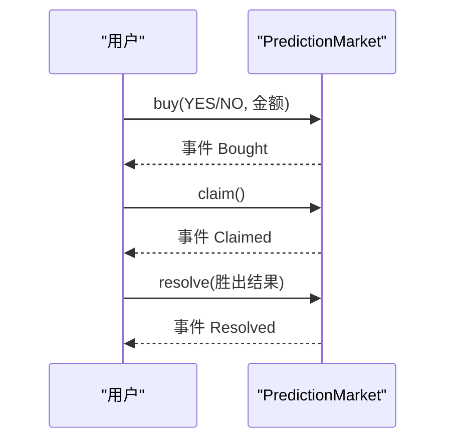

图示来源
- [PredictionMarket.json:127-130](file://pkg/contracts/PredictionMarket.json#L127-L130)
- [PredictionMarket.json:134-137](file://pkg/contracts/PredictionMarket.json#L134-L137)
- [PredictionMarket.json:276-279](file://pkg/contracts/PredictionMarket.json#L276-L279)
- [PredictionMarket.json:296-299](file://pkg/contracts/PredictionMarket.json#L296-L299)

章节来源
- [PredictionMarket.json:1-348](file://pkg/contracts/PredictionMarket.json#L1-L348)

### PredictionMarketV3（二元预测市场V3）
- 升级特性：引入费用BPS、初始流动性、最大单用户投注额度；新增流动性池增减与份额计算；增强池状态查询。
- 关键函数
  - 读取类：feeBps、maxBetPerUser、reserveYes/reserveNo、totalLPSupply、lpBalance、getPoolState、marketStatus、userBetTotal。
  - 写入类：addLiquidity(amount)、buy(outcome, amountIn)、removeLiquidity(lpAmount)、seedReserves(perSide, lpRecipient)、claim()、resolve(outcome)、voidMarket()。
  - 事件：Bought、Claimed、LiquidityAdded、LiquidityRemoved、Resolved、MarketVoided。
- 交互模式：先seedReserves或addLiquidity建立初始池，再进行buy，到期resolve并claim。

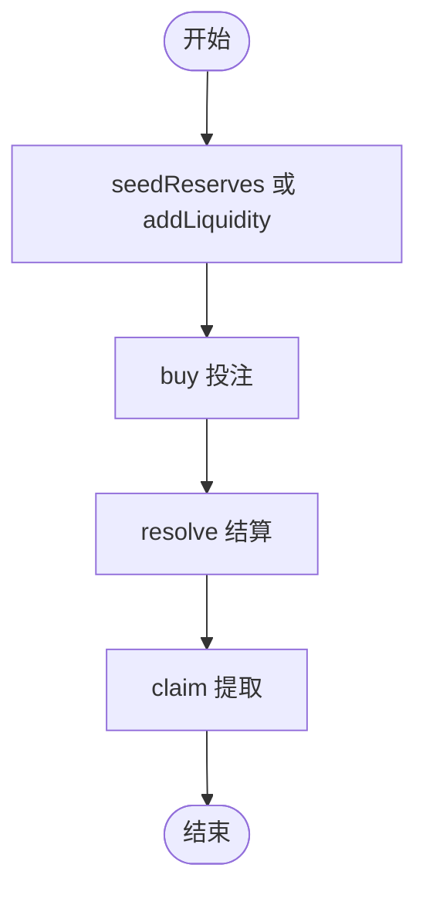

图示来源
- [PredictionMarketV3.json:186-207](file://pkg/contracts/PredictionMarketV3.json#L186-L207)
- [PredictionMarketV3.json:426-476](file://pkg/contracts/PredictionMarketV3.json#L426-L476)
- [PredictionMarketV3.json:491-494](file://pkg/contracts/PredictionMarketV3.json#L491-L494)
- [PredictionMarketV3.json:543-546](file://pkg/contracts/PredictionMarketV3.json#L543-L546)

章节来源
- [PredictionMarketV3.json:1-582](file://pkg/contracts/PredictionMarketV3.json#L1-L582)

### MarketFactory（市场工厂）
- 功能定位：创建二元预测市场，维护市场计数与映射，设置Oracle，支持所有权转移。
- 关键函数
  - createMarket(matchRef, question, endTime) → (market, marketId)
  - setOracle(_oracle)
  - marketCount/markets(id)
  - 版本号version()。
- 事件：MarketCreated。

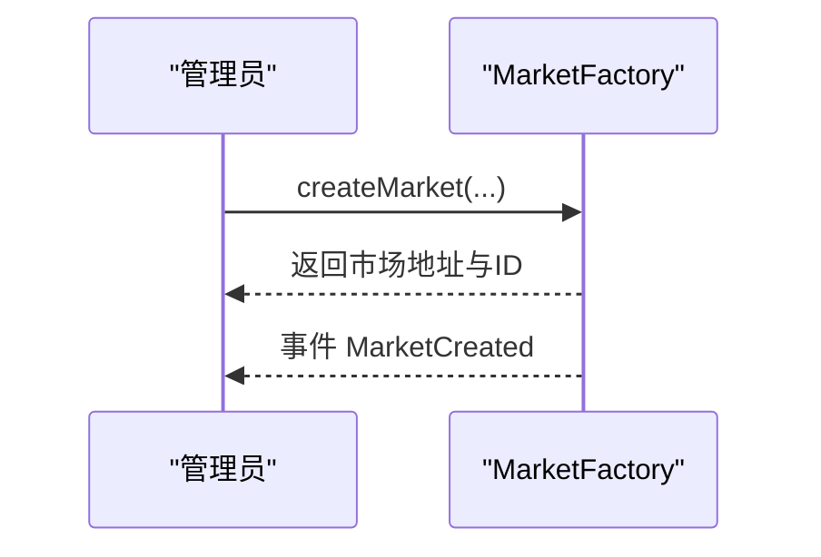

图示来源
- [MarketFactory.json:129-143](file://pkg/contracts/MarketFactory.json#L129-L143)
- [MarketFactory.json:218-221](file://pkg/contracts/MarketFactory.json#L218-L221)

章节来源
- [MarketFactory.json:1-251](file://pkg/contracts/MarketFactory.json#L1-L251)

### MarketFactoryV3（市场工厂V3）
- 升级特性：支持二元与多结果市场创建；默认费用BPS、最大投注额；暂停/恢复；阈值控制。
- 关键函数
  - createBinaryMarket(...) → (market, id)
  - createMultiMarket(...) → (market, id)
  - setDefaultFeeBps(bps)、setDefaultMaxBet(amount)
  - pause()/unpause()、setOracle(_oracle)
  - 事件：BinaryMarketCreated、MultiMarketCreated。
- 升级路径：V3同时兼容二元与多结果，逐步替换旧工厂。

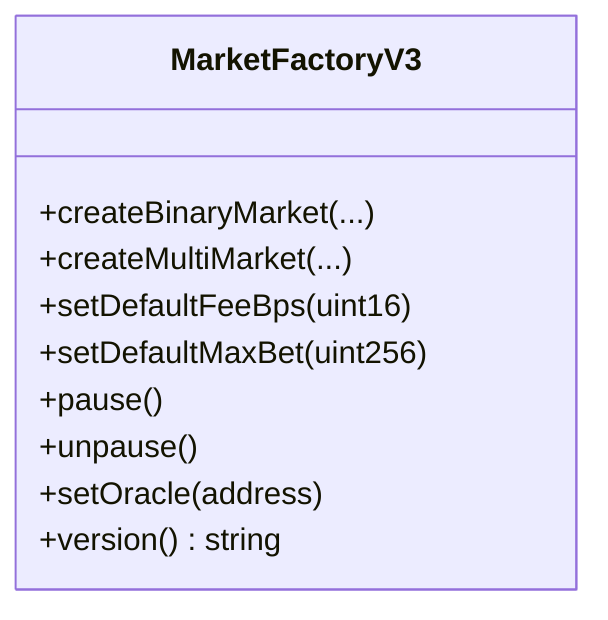

图示来源
- [MarketFactoryV3.json:200-253](file://pkg/contracts/MarketFactoryV3.json#L200-L253)
- [MarketFactoryV3.json:386-422](file://pkg/contracts/MarketFactoryV3.json#L386-L422)

章节来源
- [MarketFactoryV3.json:1-446](file://pkg/contracts/MarketFactoryV3.json#L1-L446)

### MultiOutcomeMarket（多结果市场）
- 功能定位：支持N个结果的预测市场，提供买入、结算与作废能力。
- 关键函数
  - buy(outcome, amount)、claim()、resolve(outcome)、voidMarket()
  - 视图：collateral、oracle、question、endTime、outcomeCount、pool(outcome)、status、winningOutcome、stake(addr,outcome)、marketStatus。
- 事件：Bought、Claimed、Resolved、MarketVoided。

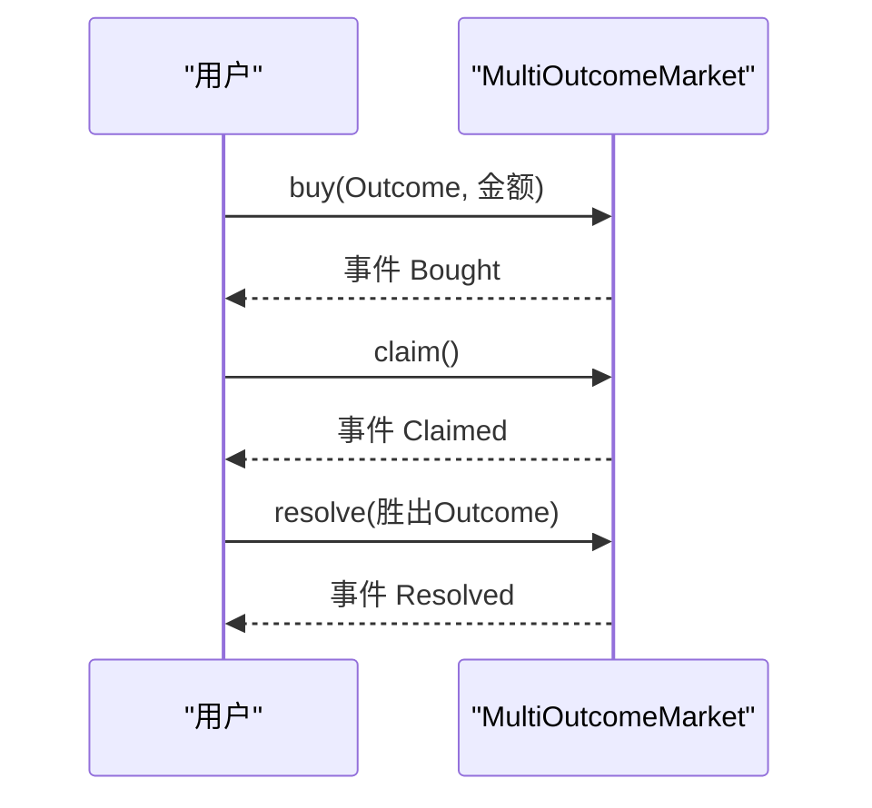

图示来源
- [MultiOutcomeMarket.json:137-140](file://pkg/contracts/MultiOutcomeMarket.json#L137-L140)
- [MultiOutcomeMarket.json:144-147](file://pkg/contracts/MultiOutcomeMarket.json#L144-L147)
- [MultiOutcomeMarket.json:299-302](file://pkg/contracts/MultiOutcomeMarket.json#L299-L302)
- [MultiOutcomeMarket.json:343-346](file://pkg/contracts/MultiOutcomeMarket.json#L343-L346)

章节来源
- [MultiOutcomeMarket.json:1-363](file://pkg/contracts/MultiOutcomeMarket.json#L1-L363)

### OracleAdapter（预言机适配器）
- 功能定位：为市场提供决议请求、确认与作废能力，支持角色权限与时间锁延迟。
- 关键函数
  - requestResolve(market, outcome)、confirmResolve(market)、resolveNow(market, outcome)、voidMarket(market)
  - grantOracle(account)、setFactory(factory)、setTimelockDelay(delay)
  - 事件：OracleResolveRequested、OracleResolveConfirmed、MarketVoided。
- 权限模型：DEFAULT_ADMIN_ROLE、ORACLE_ROLE。

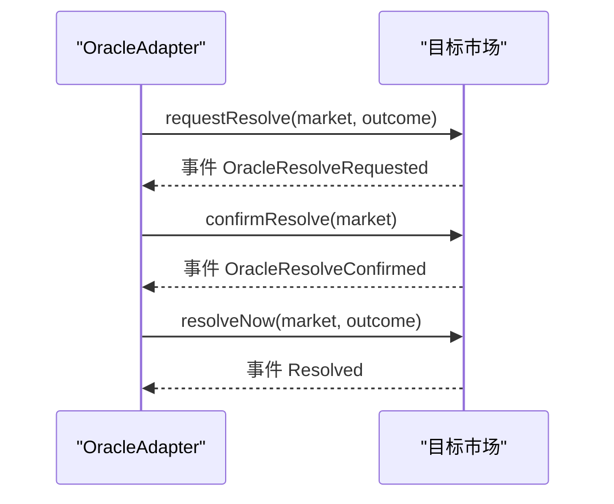

图示来源
- [OracleAdapter.json:359-362](file://pkg/contracts/OracleAdapter.json#L359-L362)
- [OracleAdapter.json:207-210](file://pkg/contracts/OracleAdapter.json#L207-L210)
- [OracleAdapter.json:377-380](file://pkg/contracts/OracleAdapter.json#L377-L380)
- [OracleAdapter.json:466-469](file://pkg/contracts/OracleAdapter.json#L466-L469)

章节来源
- [OracleAdapter.json:1-473](file://pkg/contracts/OracleAdapter.json#L1-L473)

### OracleAdapterV2（预言机适配器V2）
- 升级特性：引入提案机制与阈值，支持多Oracle共识；移除时间锁，改为提案与批准流程。
- 关键函数
  - proposeResolve(market, outcome) → id
  - approveResolve(id)、voidMarket(market)
  - setThreshold(t)、proposalCount、proposals(id)
  - 事件：ProposalCreated、ProposalApproved、ProposalExecuted、MarketVoided。
- 交互模式：多个Oracle对同一决议进行提案与批准，达到阈值后执行。

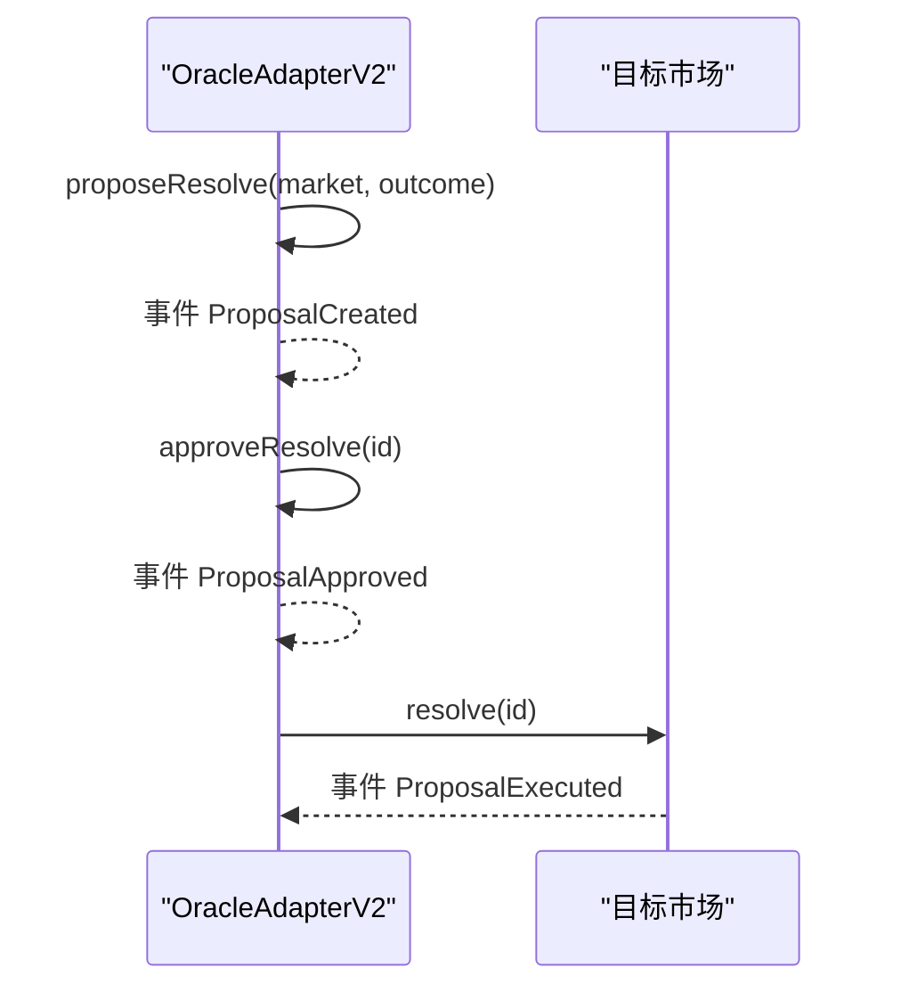

图示来源
- [OracleAdapterV2.json:389-398](file://pkg/contracts/OracleAdapterV2.json#L389-L398)
- [OracleAdapterV2.json:226-229](file://pkg/contracts/OracleAdapterV2.json#L226-L229)
- [OracleAdapterV2.json:439-447](file://pkg/contracts/OracleAdapterV2.json#L439-L447)

章节来源
- [OracleAdapterV2.json:1-496](file://pkg/contracts/OracleAdapterV2.json#L1-L496)

### DIDRegistry（去中心化身份注册）
- 功能定位：绑定与解析DID，支持所有权管理与签名验证。
- 关键函数
  - bindDid(didHash, signature)
  - resolveDid(account) → didHash
  - owner/transferOwnership/renounceOwnership
  - 视图：didHashOf(address)。
- 事件：DidBound、OwnershipTransferred。

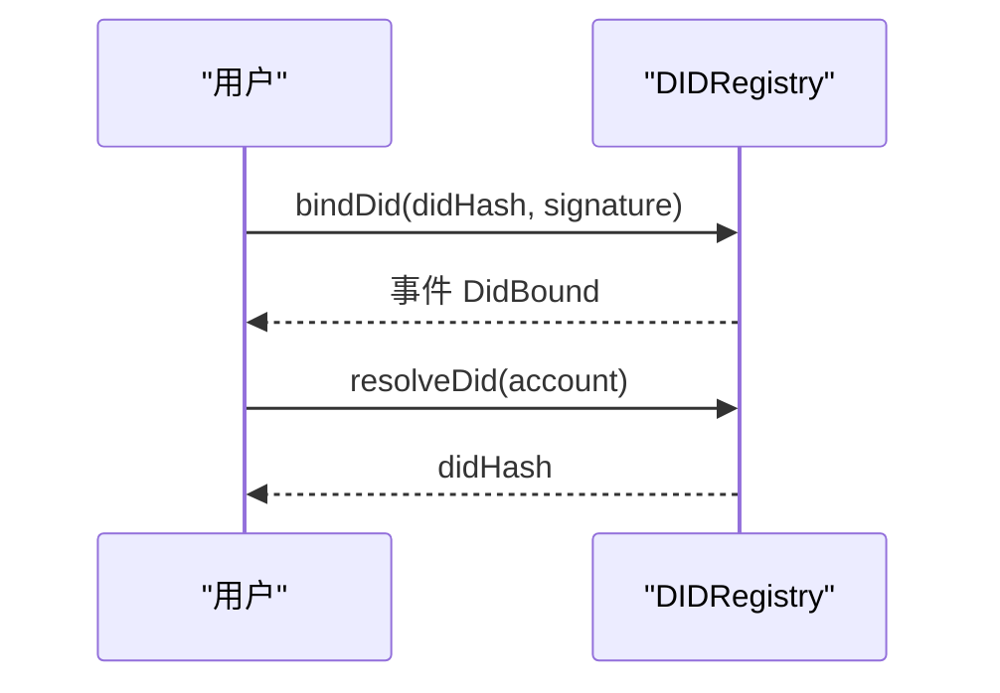

图示来源
- [DIDRegistry.json:97-112](file://pkg/contracts/DIDRegistry.json#L97-L112)
- [DIDRegistry.json:161-170](file://pkg/contracts/DIDRegistry.json#L161-L170)
- [DIDRegistry.json:134-151](file://pkg/contracts/DIDRegistry.json#L134-L151)

章节来源
- [DIDRegistry.json:1-187](file://pkg/contracts/DIDRegistry.json#L1-L187)

## 依赖关系分析
- 合约间耦合
  - MarketFactory/MarketFactoryV3创建PredictionMarket/PredictionMarketV3与MultiOutcomeMarket。
  - OracleAdapter/OracleAdapterV2为市场提供决议通道，不直接持有资金，仅作为权限与流程控制。
  - MockUSDC作为可选的保证金代币，供市场使用。
- 外部依赖
  - 以太坊客户端库用于交易发送、查询与事件订阅。
  - 数据库与Redis用于索引与缓存，提升查询性能。

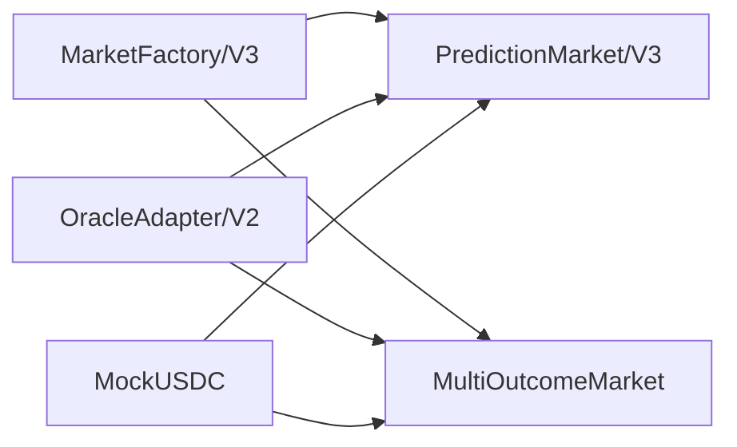

图示来源
- [MarketFactory.json:129-143](file://pkg/contracts/MarketFactory.json#L129-L143)
- [MarketFactoryV3.json:200-253](file://pkg/contracts/MarketFactoryV3.json#L200-L253)
- [PredictionMarket.json:186-195](file://pkg/contracts/PredictionMarket.json#L186-L195)
- [PredictionMarketV3.json:276-285](file://pkg/contracts/PredictionMarketV3.json#L276-L285)
- [MultiOutcomeMarket.json:235-244](file://pkg/contracts/MultiOutcomeMarket.json#L235-L244)
- [MockUSDC.json:146-191](file://pkg/contracts/MockUSDC.json#L146-L191)

章节来源
- [go.mod:5-14](file://go.mod#L5-L14)

## 性能考量
- 交易批处理：批量提交相似交易以降低Gas成本与等待时间。
- 事件轮询优化：基于区块范围增量查询，避免全量扫描；结合Redis缓存热点事件。
- 并发控制：对同账户/同市场的并发写入加锁，防止重入与竞态。
- Gas上限与超时：合理设置Gas上限与超时，失败重试需指数退避。
- 状态缓存：对常用视图函数结果进行短期缓存，减少链上查询频率。

## 故障排查指南
- 交易失败
  - 检查余额与授权额度（如USDC approve），确保Gas充足。
  - 校验输入参数类型与范围（如outcome、amount、endTime）。
- 无事件回调
  - 确认事件过滤器已正确订阅；检查网络节点同步状态。
- 权限错误
  - 验证调用者是否具备相应角色（如ORACLE_ROLE）。
- 市场未结算
  - 确认Oracle已请求/确认/执行决议；检查市场状态与到期时间。
- 升级兼容
  - V3工厂同时支持二元与多结果；旧合约仍可读取，但不再创建新市场。

章节来源
- [OracleAdapter.json:22-39](file://pkg/contracts/OracleAdapter.json#L22-L39)
- [OracleAdapterV2.json:21-39](file://pkg/contracts/OracleAdapterV2.json#L21-L39)
- [MarketFactoryV3.json:360-376](file://pkg/contracts/MarketFactoryV3.json#L360-L376)

## 结论
本项目通过清晰的合约分层与升级策略，实现了从市场创建、交易执行到预言机决议的完整闭环。建议在生产环境优先采用MarketFactoryV3与PredictionMarketV3，配合OracleAdapterV2的提案机制，确保可扩展性与安全性。同时完善事件索引与缓存策略，持续优化Gas消耗与响应时延，保障用户体验与系统稳定性。