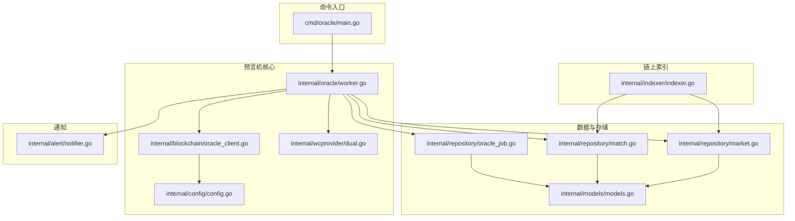
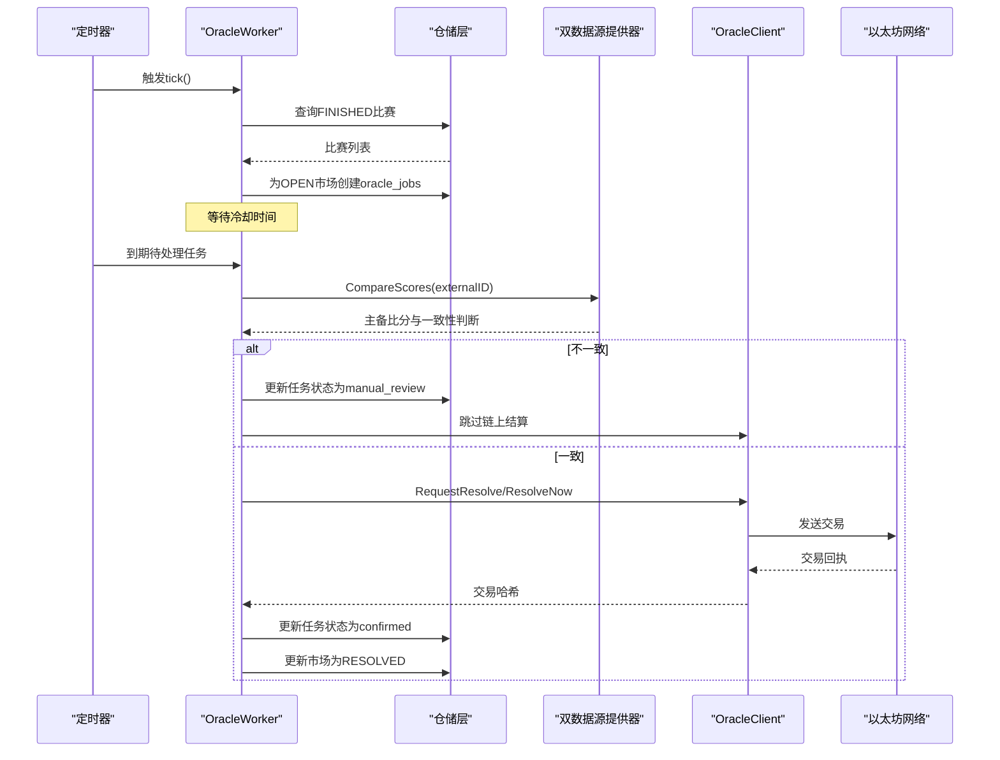
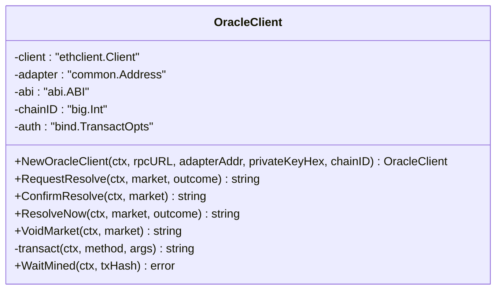
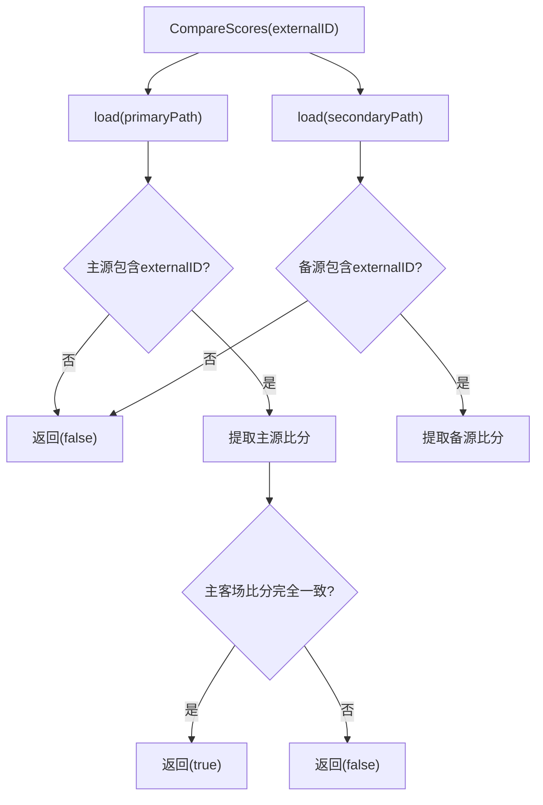
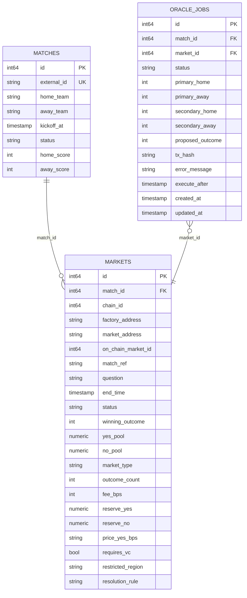
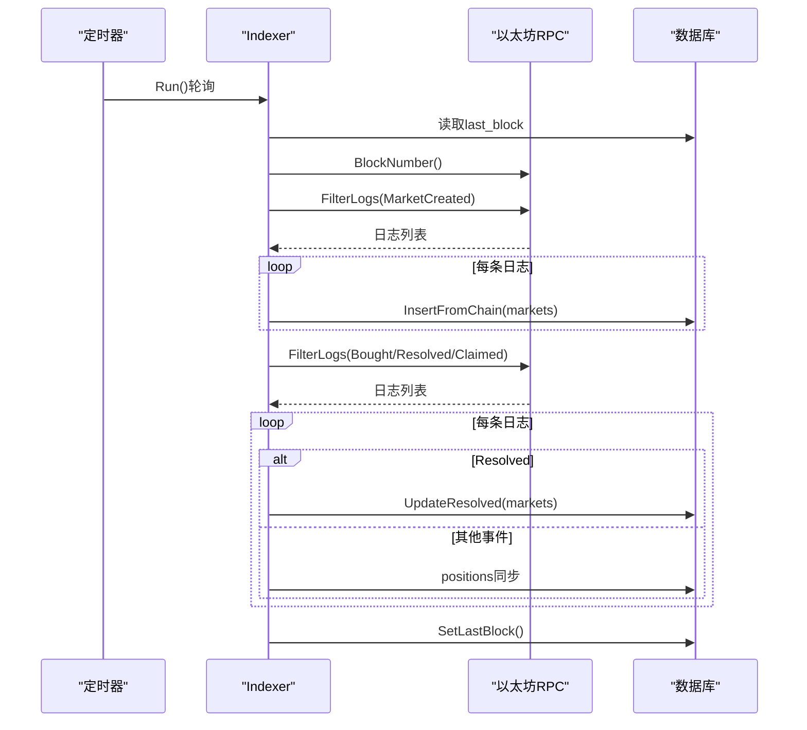
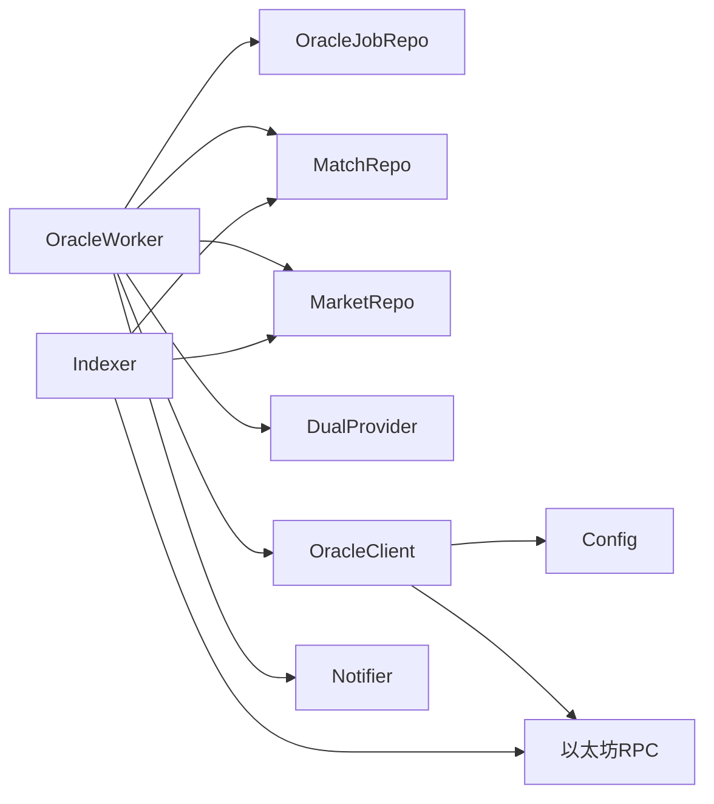

# 预言机数据集成

<cite>
**本文档引用的文件**
- [cmd/oracle/main.go](file://cmd/oracle/main.go)
- [internal/blockchain/oracle_client.go](file://internal/blockchain/oracle_client.go)
- [internal/oracle/worker.go](file://internal/oracle/worker.go)
- [internal/indexer/indexer.go](file://internal/indexer/indexer.go)
- [internal/wcprovider/dual.go](file://internal/wcprovider/dual.go)
- [internal/config/config.go](file://internal/config/config.go)
- [internal/repository/oracle_job.go](file://internal/repository/oracle_job.go)
- [internal/repository/match.go](file://internal/repository/match.go)
- [internal/repository/market.go](file://internal/repository/market.go)
- [internal/models/models.go](file://internal/models/models.go)
- [internal/alert/notifier.go](file://internal/alert/notifier.go)
- [data/mock_matches.json](file://data/mock_matches.json)
</cite>

## 目录
1. [简介](#简介)
2. [项目结构](#项目结构)
3. [核心组件](#核心组件)
4. [架构总览](#架构总览)
5. [详细组件分析](#详细组件分析)
6. [依赖关系分析](#依赖关系分析)
7. [性能考量](#性能考量)
8. [故障排查指南](#故障排查指南)
9. [结论](#结论)
10. [附录](#附录)

## 简介
本文件面向PredictionDIDSimple项目的预言机数据集成，系统性阐述预言机在预测市场中的作用：通过外部数据源（比赛结果）驱动链上结算，保障价格数据更新与外部事件确认的准确性与一致性。重点覆盖以下方面：
- 预言机系统在预测市场中的职责与价值
- OracleClient的实现原理：数据请求机制、结果验证流程、更新通知机制
- 预言机数据来源渠道、数据格式与验证标准
- 如何发起预言机查询、处理返回数据与更新市场状态
- 数据缓存策略、重试机制与故障转移方案
- 与Indexer系统的协作关系与数据一致性保证机制

## 项目结构
本项目采用分层与功能模块化组织方式：
- cmd/oracle：Oracle工作进程入口，负责启动Worker并注入依赖
- internal/blockchain：区块链交互层，封装OracleAdapter合约交互
- internal/oracle：预言机Worker，负责轮询、入队、处理结算任务
- internal/indexer：链上事件索引器，负责将链上事件同步至数据库
- internal/wcprovider：双数据源提供与比分对比，确保数据一致性
- internal/config：配置加载与环境变量解析
- internal/repository：仓储层，封装数据库访问与任务管理
- internal/models：核心领域模型（比赛、市场、持仓）
- internal/alert：告警通知器（日志+Webhook）



图表来源
- [cmd/oracle/main.go:1-67](file://cmd/oracle/main.go#L1-L67)
- [internal/oracle/worker.go:1-214](file://internal/oracle/worker.go#L1-L214)
- [internal/blockchain/oracle_client.go:1-193](file://internal/blockchain/oracle_client.go#L1-L193)
- [internal/wcprovider/dual.go:1-144](file://internal/wcprovider/dual.go#L1-L144)
- [internal/config/config.go:1-139](file://internal/config/config.go#L1-L139)
- [internal/repository/oracle_job.go:1-167](file://internal/repository/oracle_job.go#L1-L167)
- [internal/repository/match.go:1-118](file://internal/repository/match.go#L1-L118)
- [internal/repository/market.go:1-269](file://internal/repository/market.go#L1-L269)
- [internal/models/models.go:1-63](file://internal/models/models.go#L1-L63)
- [internal/alert/notifier.go:1-47](file://internal/alert/notifier.go#L1-L47)
- [internal/indexer/indexer.go:1-329](file://internal/indexer/indexer.go#L1-L329)

章节来源
- [cmd/oracle/main.go:1-67](file://cmd/oracle/main.go#L1-L67)
- [internal/config/config.go:1-139](file://internal/config/config.go#L1-L139)

## 核心组件
- OracleWorker：周期性轮询数据库中的“已完成”比赛，为相关OPEN市场创建结算任务；到期后从双数据源比对比分，确定结算结果并调用链上合约进行结算或请求-确认流程。
- OracleClient：封装与OracleAdapter合约交互，支持立即结算、请求-确认结算、交易上链等待与回执校验。
- 双数据源提供器（DualProvider）：从主备两份JSON数据源加载比分，进行交叉验证，不一致时触发人工审核。
- 仓储层：维护oracle_jobs、matches、markets等表，支撑任务调度、状态流转与链上事件同步。
- Indexer：轮询区块日志，将MarketCreated、Bought、Resolved、Claimed等事件同步到数据库，保证链上与数据库一致性。
- 配置与通知：集中管理运行参数，提供Webhook告警能力。

章节来源
- [internal/oracle/worker.go:18-214](file://internal/oracle/worker.go#L18-L214)
- [internal/blockchain/oracle_client.go:25-193](file://internal/blockchain/oracle_client.go#L25-L193)
- [internal/wcprovider/dual.go:23-144](file://internal/wcprovider/dual.go#L23-L144)
- [internal/repository/oracle_job.go:32-167](file://internal/repository/oracle_job.go#L32-L167)
- [internal/repository/match.go:15-118](file://internal/repository/match.go#L15-L118)
- [internal/repository/market.go:15-269](file://internal/repository/market.go#L15-L269)
- [internal/indexer/indexer.go:26-329](file://internal/indexer/indexer.go#L26-L329)
- [internal/alert/notifier.go:13-47](file://internal/alert/notifier.go#L13-L47)

## 架构总览
预言机数据集成由“数据采集—任务调度—链上结算—状态同步—一致性保障”构成闭环。数据流如下：
- 外部数据源（JSON文件）提供比赛比分，经双源对比验证后作为结算依据
- OracleWorker根据比赛状态与市场状态生成结算任务，到期后执行
- OracleClient根据配置选择立即结算或请求-确认流程，完成链上交易并等待上链
- Indexer持续扫描链上事件，将Resolved等事件回写数据库，维持链上与数据库一致



图表来源
- [internal/oracle/worker.go:60-205](file://internal/oracle/worker.go#L60-L205)
- [internal/wcprovider/dual.go:67-89](file://internal/wcprovider/dual.go#L67-L89)
- [internal/blockchain/oracle_client.go:112-192](file://internal/blockchain/oracle_client.go#L112-L192)

## 详细组件分析

### OracleWorker：自动结算调度器
- 职责
  - 将FINISHED比赛入队，冷却后生成oracle_jobs
  - 轮询到期任务，从双数据源比对比分，决定结算结果
  - 调用链上合约执行结算或请求-确认流程
  - 更新任务状态、市场状态与比赛状态
  - 异常时记录日志并发送告警
- 关键流程
  - 入队：查询FINISHED比赛，查找OPEN市场，去重后创建任务并设置比赛状态为ORACLE_PENDING
  - 处理：获取比赛与市场信息，按规则计算结果，调用OracleClient，等待上链，更新数据库
  - 不一致：双源比分不一致时，任务进入manual_review并发送告警

```mermaid
flowchart TD
Start(["开始 tick"]) --> Enqueue["查询FINISHED比赛<br/>为OPEN市场创建任务"]
Enqueue --> Due["获取到期任务"]
Due --> FetchMatch["获取比赛详情"]
FetchMatch --> Compare["双源比分对比"]
Compare --> Ok{"比分一致?"}
Ok -- 否 --> Manual["更新任务为manual_review<br/>发送告警"]
Manual --> End
Ok -- 是 --> Calc["按规则计算结果"]
Calc --> TxMode{"时间锁配置?"}
TxMode -- 无 -- > ResolveNow["立即结算"]
TxMode -- 有 --> Request["请求结算"]
Request --> Wait["等待上链"]
Wait --> Sleep["等待时间锁到期"]
Sleep --> Confirm["确认结算"]
ResolveNow --> WaitMined["等待上链"]
WaitMined --> Update["更新任务与市场状态"]
Confirm --> Update
Update --> End(["结束"])
```

图表来源
- [internal/oracle/worker.go:60-205](file://internal/oracle/worker.go#L60-L205)

章节来源
- [internal/oracle/worker.go:18-214](file://internal/oracle/worker.go#L18-L214)

### OracleClient：链上交互客户端
- 职责
  - 连接以太坊RPC，加载OracleAdapter ABI
  - 构造交易（requestResolve、confirmResolve、resolveNow、voidMarket）
  - 估算gas、签名、发送交易并等待上链
  - 校验回执状态，处理revert与超时
- 关键机制
  - 交易构造：根据ABI编码参数，查询PendingNonce，估算Gas，构造Legacy交易并签名
  - 上链等待：轮询TransactionReceipt，最多30次，每次2秒，检测Status==0表示revert
  - 方法封装：RequestResolve、ConfirmResolve、ResolveNow、VoidMarket统一走transact流程



图表来源
- [internal/blockchain/oracle_client.go:25-193](file://internal/blockchain/oracle_client.go#L25-L193)

章节来源
- [internal/blockchain/oracle_client.go:25-193](file://internal/blockchain/oracle_client.go#L25-L193)

### 双数据源提供器（DualProvider）
- 职责
  - 从主备JSON文件加载比分数据，过滤掉缺少比分的比赛
  - 对比同一externalID的主备比分，不一致则触发人工审核
  - 提供OutcomeFromRule规则转换，支持OVER_25与HOME_WIN等规则
- 数据格式
  - JSON数组，每项包含external_id、home_team、away_team、kickoff_at、status、home_score、away_score
  - mock数据示例见data/mock_matches.json



图表来源
- [internal/wcprovider/dual.go:67-89](file://internal/wcprovider/dual.go#L67-L89)
- [data/mock_matches.json:1-30](file://data/mock_matches.json#L1-L30)

章节来源
- [internal/wcprovider/dual.go:14-144](file://internal/wcprovider/dual.go#L14-L144)
- [data/mock_matches.json:1-30](file://data/mock_matches.json#L1-L30)

### 仓储层与数据模型
- OracleJobRepo：维护oracle_jobs表，支持创建、查询到期任务、更新状态与字段
- MatchRepo：维护matches表，支持按状态分页、Upsert、SetStatus、GetByExternalID等
- MarketRepo：维护markets表，支持按状态分页、InsertFromChain、UpdateResolved、ListOpenByMatchID等
- Models：定义Match、Market、Position、User等核心模型



图表来源
- [internal/repository/match.go:15-118](file://internal/repository/match.go#L15-L118)
- [internal/repository/market.go:15-269](file://internal/repository/market.go#L15-L269)
- [internal/repository/oracle_job.go:32-167](file://internal/repository/oracle_job.go#L32-L167)
- [internal/models/models.go:6-63](file://internal/models/models.go#L6-L63)

章节来源
- [internal/repository/oracle_job.go:12-167](file://internal/repository/oracle_job.go#L12-L167)
- [internal/repository/match.go:15-118](file://internal/repository/match.go#L15-L118)
- [internal/repository/market.go:15-269](file://internal/repository/market.go#L15-L269)
- [internal/models/models.go:6-63](file://internal/models/models.go#L6-L63)

### Indexer：链上事件索引器
- 职责
  - 轮询区块范围，扫描MarketFactory的MarketCreated事件，同步到markets表
  - 扫描各市场Bought/Resolved/Claimed事件，同步到positions与markets
  - 维护索引器状态last_block，支持断点续跑
- 一致性保障
  - 通过事件回放与Upsert逻辑，确保数据库与链上状态一致
  - 对Resolved事件直接更新市场为RESOLVED，与预言机结算形成闭环



图表来源
- [internal/indexer/indexer.go:97-329](file://internal/indexer/indexer.go#L97-L329)

章节来源
- [internal/indexer/indexer.go:26-329](file://internal/indexer/indexer.go#L26-L329)

### 配置与通知
- 配置项要点
  - EthRPCURL、OracleAdapterAddress、OraclePrivateKey、ChainID：链上交互必需
  - OracleCooldownMinutes、OracleTimelockSeconds、OraclePollSeconds：预言机行为参数
  - MockMatchesPath、MockMatchesSecondary：双源数据文件路径
  - AlertWebhookURL：告警Webhook
- 通知机制
  - 告警同时输出本地日志与Webhook推送，失败仅记录日志不阻塞

章节来源
- [internal/config/config.go:12-139](file://internal/config/config.go#L12-L139)
- [internal/alert/notifier.go:13-47](file://internal/alert/notifier.go#L13-L47)

## 依赖关系分析
- 组件耦合
  - OracleWorker依赖仓储层（oracle_jobs、matches、markets）、双数据源提供器、OracleClient、告警通知器
  - OracleClient依赖配置与以太坊RPC，内部封装交易构造与上链等待
  - Indexer与仓储层强耦合，负责链上事件到数据库的单向同步
- 外部依赖
  - 以太坊RPC（主备可配置）
  - PostgreSQL（通过pgx连接池）
  - Webhook（可选）



图表来源
- [internal/oracle/worker.go:18-27](file://internal/oracle/worker.go#L18-L27)
- [internal/blockchain/oracle_client.go:34-64](file://internal/blockchain/oracle_client.go#L34-L64)
- [internal/indexer/indexer.go:38-65](file://internal/indexer/indexer.go#L38-L65)

章节来源
- [internal/oracle/worker.go:18-40](file://internal/oracle/worker.go#L18-L40)
- [internal/blockchain/oracle_client.go:34-64](file://internal/blockchain/oracle_client.go#L34-L64)
- [internal/indexer/indexer.go:38-65](file://internal/indexer/indexer.go#L38-L65)

## 性能考量
- 轮询与批处理
  - OracleWorker与Indexer均采用ticker轮询，建议合理设置轮询间隔，避免频繁RPC调用
  - Indexer单次扫描上限2000区块，防止RPC超时
- 交易成本与Gas策略
  - 交易前估算Gas，失败时使用保守值；优先设置合理的GasPrice
- 数据库压力
  - 仓储层查询使用LIMIT与分页，避免一次性拉取过多数据
- 并发与资源
  - 建议在生产环境启用多实例部署，配合数据库连接池与限流策略

## 故障排查指南
- 链上交易失败
  - 检查OracleClient的交易回执状态，Status==0表示revert
  - 确认私钥、链ID与适配器地址配置正确
  - 关注WaitMined超时与RPC异常
- 双源比分不一致
  - 检查主备数据源文件路径与格式
  - 任务状态应进入manual_review并发送告警
- 任务未执行
  - 确认冷却时间与到期时间计算
  - 检查HasActiveForMarket去重逻辑
- 告警未到达
  - 检查AlertWebhookURL配置与网络连通性
- 数据不同步
  - 检查Indexer的last_block与轮询间隔
  - 确认工厂地址与事件签名正确

章节来源
- [internal/blockchain/oracle_client.go:169-192](file://internal/blockchain/oracle_client.go#L169-L192)
- [internal/oracle/worker.go:146-153](file://internal/oracle/worker.go#L146-L153)
- [internal/repository/oracle_job.go:56-93](file://internal/repository/oracle_job.go#L56-L93)
- [internal/alert/notifier.go:27-46](file://internal/alert/notifier.go#L27-L46)
- [internal/indexer/indexer.go:122-160](file://internal/indexer/indexer.go#L122-L160)

## 结论
PredictionDIDSimple的预言机数据集成通过“双源数据验证+链上请求-确认/立即结算”的组合，实现了对预测市场的可靠结算。结合Indexer的链上事件回写，系统在数据一致性与可审计性方面具备良好基础。建议在生产环境中完善监控、告警与重试策略，并对RPC与数据库进行容量规划与优化。

## 附录

### 预言机数据来源与验证标准
- 数据来源
  - 主源与备源均为JSON文件，包含external_id、比分与状态
- 验证标准
  - 同一externalID下主备比分完全一致才视为有效
  - 不一致触发人工审核流程
- 数据格式参考
  - [data/mock_matches.json:1-30](file://data/mock_matches.json#L1-L30)

章节来源
- [internal/wcprovider/dual.go:38-89](file://internal/wcprovider/dual.go#L38-L89)
- [data/mock_matches.json:1-30](file://data/mock_matches.json#L1-L30)

### 代码示例（路径指引）
- 启动OracleWorker
  - [cmd/oracle/main.go:21-66](file://cmd/oracle/main.go#L21-L66)
- 创建OracleClient并发起结算
  - [internal/blockchain/oracle_client.go:34-64](file://internal/blockchain/oracle_client.go#L34-L64)
  - [internal/blockchain/oracle_client.go:112-130](file://internal/blockchain/oracle_client.go#L112-L130)
- 处理任务与链上结算
  - [internal/oracle/worker.go:123-205](file://internal/oracle/worker.go#L123-L205)
- 从双源比对比分
  - [internal/wcprovider/dual.go:67-89](file://internal/wcprovider/dual.go#L67-L89)
- 更新市场为已结算
  - [internal/repository/market.go:130-138](file://internal/repository/market.go#L130-L138)
- 索引器扫描事件并回写数据库
  - [internal/indexer/indexer.go:122-329](file://internal/indexer/indexer.go#L122-L329)