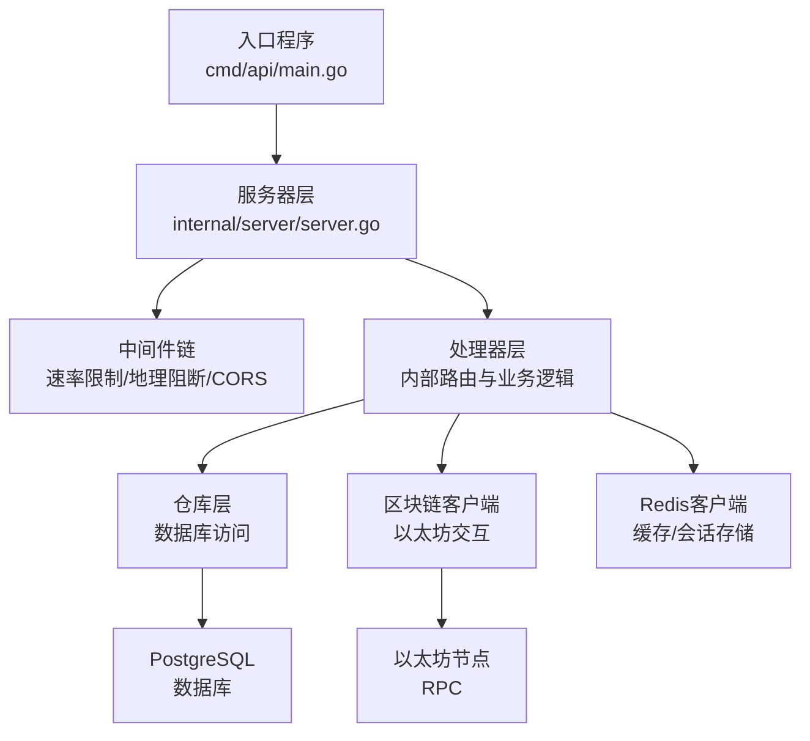
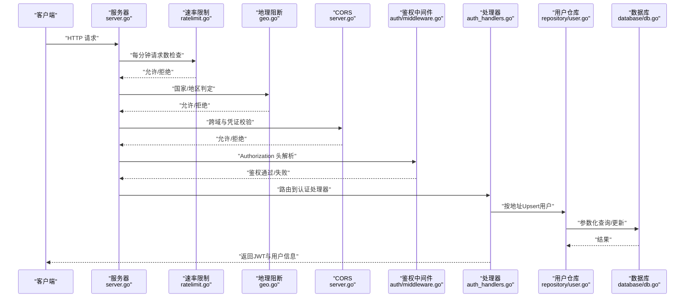
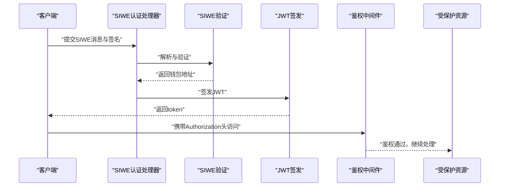
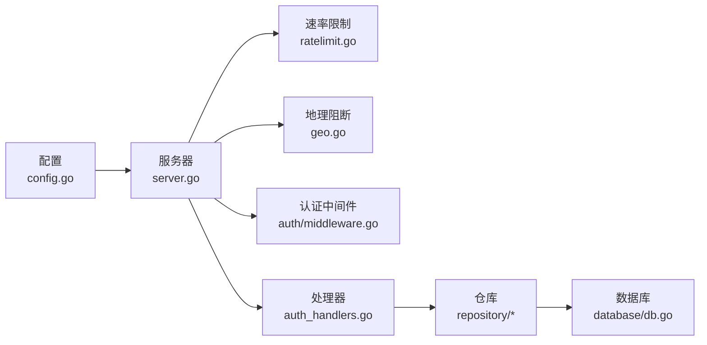

# 安全考虑

<cite>
**本文引用的文件**
- [cmd/api/main.go](file://cmd/api/main.go)
- [internal/server/server.go](file://internal/server/server.go)
- [internal/config/config.go](file://internal/config/config.go)
- [internal/auth/jwt.go](file://internal/auth/jwt.go)
- [internal/auth/middleware.go](file://internal/auth/middleware.go)
- [internal/auth/siwe.go](file://internal/auth/siwe.go)
- [internal/middleware/ratelimit.go](file://internal/middleware/ratelimit.go)
- [internal/middleware/geo.go](file://internal/middleware/geo.go)
- [internal/alert/notifier.go](file://internal/alert/notifier.go)
- [internal/database/db.go](file://internal/database/db.go)
- [internal/handler/auth_handlers.go](file://internal/handler/auth_handlers.go)
- [internal/handler/compliance.go](file://internal/handler/compliance.go)
- [internal/repository/user.go](file://internal/repository/user.go)
- [internal/repository/compliance.go](file://internal/repository/compliance.go)
- [internal/models/models.go](file://internal/models/models.go)
</cite>

## 目录
1. [引言](#引言)
2. [项目结构与安全边界](#项目结构与安全边界)
3. [核心组件与安全职责](#核心组件与安全职责)
4. [架构总览与安全流](#架构总览与安全流)
5. [详细组件安全分析](#详细组件安全分析)
6. [依赖关系与耦合风险](#依赖关系与耦合风险)
7. [性能与安全权衡](#性能与安全权衡)
8. [故障排查与安全事件响应](#故障排查与安全事件响应)
9. [结论](#结论)
10. [附录：安全配置清单与最佳实践](#附录安全配置清单与最佳实践)

## 引言
本文件面向PredictionDIDSimple后端代码库，聚焦于系统在运行期与开发期的安全考量，围绕输入验证、输出编码、安全配置、常见攻击防护（SQL注入、XSS、CSRF、暴力破解）、密钥与证书管理、合约交互安全、身份认证与授权、网络安全策略、数据与隐私保护以及安全监控与事件响应等方面，给出可操作的安全建议与实施路径。文档以代码为依据，避免臆测，所有技术细节均通过“章节来源”与“图表来源”指向具体源码位置。

## 项目结构与安全边界
后端采用分层架构：入口程序负责初始化与生命周期管理；服务器层负责路由注册与中间件链；业务层由处理器与仓库组成；底层依赖数据库、区块链客户端与Redis缓存。安全边界主要体现在：
- 入口与启动：加载配置、迁移数据库、启动服务与索引器/预言机后台任务。
- 网络层：CORS策略、速率限制、地理阻断、请求日志与健康检查。
- 认证与授权：SIWE签名验证、JWT签发与解析、中间件鉴权。
- 数据层：PGX连接池、参数化查询、合规日志记录。
- 合约交互：以太坊RPC与私钥使用场景（仅在特定组件中）。

图表来源
- [cmd/api/main.go](file://cmd/api/main.go#L24-L98)
- [internal/server/server.go](file://internal/server/server.go#L35-L84)

章节来源
- [cmd/api/main.go](file://cmd/api/main.go#L24-L98)
- [internal/server/server.go](file://internal/server/server.go#L35-L84)

## 核心组件与安全职责
- 配置加载与环境变量校验：负责从环境变量读取敏感参数，并进行基础合法性检查（如CHAIN_ID、INDEXER_START_BLOCK等），确保缺失或非法值能被及时发现。
- 认证与授权：SIWE消息解析与签名验证、JWT签发与解析、基于Authorization头的中间件鉴权。
- 网络与传输安全：CORS白名单、速率限制、地理阻断、健康与就绪探针。
- 数据与隐私：参数化查询、合规日志、敏感字段处理。
- 合约交互：仅在特定后台组件中使用私钥，需严格隔离与最小暴露面。
- 安全告警：通过Webhook上报安全事件，便于集中监控与响应。

章节来源
- [internal/config/config.go](file://internal/config/config.go#L45-L96)
- [internal/auth/jwt.go](file://internal/auth/jwt.go#L16-L43)
- [internal/auth/middleware.go](file://internal/auth/middleware.go#L13-L36)
- [internal/auth/siwe.go](file://internal/auth/siwe.go#L17-L46)
- [internal/middleware/ratelimit.go](file://internal/middleware/ratelimit.go#L36-L55)
- [internal/middleware/geo.go](file://internal/middleware/geo.go#L10-L31)
- [internal/server/server.go](file://internal/server/server.go#L48-L53)
- [internal/database/db.go](file://internal/database/db.go#L14-L42)
- [internal/alert/notifier.go](file://internal/alert/notifier.go#L23-L35)

## 架构总览与安全流
下图展示典型请求从进入服务器到数据库与区块链的调用链，以及安全控制点（速率限制、地理阻断、CORS、JWT鉴权）的位置。

图表来源
- [internal/server/server.go](file://internal/server/server.go#L36-L84)
- [internal/middleware/ratelimit.go](file://internal/middleware/ratelimit.go#L36-L55)
- [internal/middleware/geo.go](file://internal/middleware/geo.go#L10-L31)
- [internal/auth/middleware.go](file://internal/auth/middleware.go#L13-L36)
- [internal/handler/auth_handlers.go](file://internal/handler/auth_handlers.go#L16-L44)
- [internal/repository/user.go](file://internal/repository/user.go#L19-L31)
- [internal/database/db.go](file://internal/database/db.go#L14-L26)

## 详细组件安全分析

### 输入验证与输出编码
- 输入验证
  - JSON请求体解析：处理器对请求体进行解码，若失败则返回错误。建议在此处增加结构体字段校验与长度限制，避免异常负载导致资源耗尽。
  - SIWE消息解析：对域名、URI、过期时间与签名进行严格校验，失败即拒绝。
  - 地理阻断：通过请求头中的国家代码判断是否放行，未识别时默认放行，建议在上游网关或WAF统一标准化请求头。
- 输出编码
  - 错误响应与状态码：统一返回JSON错误体与标准HTTP状态码，避免敏感堆栈信息泄露。
  - 响应体：对用户信息与市场数据进行序列化输出，注意避免将内部调试字段暴露给前端。

章节来源
- [internal/handler/auth_handlers.go](file://internal/handler/auth_handlers.go#L16-L44)
- [internal/auth/siwe.go](file://internal/auth/siwe.go#L17-L46)
- [internal/middleware/geo.go](file://internal/middleware/geo.go#L42-L50)

### 常见攻击防护
- SQL注入
  - 使用参数化查询与ORM/驱动特性（PGX）进行数据库访问，避免字符串拼接。仓库层已采用参数化执行，建议保持此模式。
- XSS攻击
  - 当前响应体为JSON，未直接渲染HTML；仍建议在前端渲染时对不可信数据进行HTML转义与上下文适配。
- CSRF防护
  - 项目未显式实现CSRF令牌；建议在需要Cookie会话的场景引入SameSite Cookie策略与CSRF令牌，或统一采用Token-Based认证（当前已使用JWT）。
- 暴力破解防护
  - 已内置速率限制中间件，按IP与分钟粒度计数，对健康检查等豁免路径进行区分。建议结合黑名单与自适应限流策略。

章节来源
- [internal/repository/user.go](file://internal/repository/user.go#L19-L31)
- [internal/middleware/ratelimit.go](file://internal/middleware/ratelimit.go#L24-L34)

### 密钥管理与轮换策略
- JWT密钥
  - 配置项中存在JWT密钥，建议在生产环境强制设置且定期轮换；轮换期间采用双密钥验证与平滑切换。
- 数据库连接
  - 数据库URL来自环境变量，建议使用只读账号用于查询、写入账号分离，并启用TLS连接与最小权限原则。
- API密钥
  - 存在管理员API Key配置项，建议仅在必要接口使用，并与速率限制、地理阻断联动；定期轮换与审计访问日志。
- 区块链私钥
  - 仅在特定后台组件中使用私钥进行交易签名，建议使用硬件安全模块（HSM）或托管密钥服务，最小权限与分账户隔离。

章节来源
- [internal/config/config.go](file://internal/config/config.go#L52-L68)
- [cmd/api/main.go](file://cmd/api/main.go#L84-L89)

### 合约安全审计要点
- 重入攻击防护
  - 合约交互仅在后台组件中触发，建议在业务流程中采用ReentrancyGuard或状态锁，避免在外部调用中立即释放资金。
- 整数溢出防范
  - 在数值计算与余额变更处，确保使用安全算术库或前置检查，避免上溢/下溢。
- 权限控制
  - 对写操作接口与后台任务进行严格的权限校验，结合角色与API密钥双重控制。

章节来源
- [cmd/api/main.go](file://cmd/api/main.go#L84-L89)

### 身份认证与授权机制
- JWT令牌安全
  - 使用HS256签名算法签发与解析，建议迁移到RS256并使用公私钥对；缩短TTL并支持刷新令牌；禁止在Cookie中持久存储，采用HttpOnly与Secure策略（若使用Cookie）。
- 会话管理
  - 当前采用Token-Based认证，建议在需要会话的场景引入短期会话与长期刷新令牌的组合。
- 权限验证
  - 中间件从JWT中提取地址并注入上下文，后续处理器基于地址进行业务权限判断；建议引入细粒度角色与资源级授权。

图表来源
- [internal/handler/auth_handlers.go](file://internal/handler/auth_handlers.go#L16-L44)
- [internal/auth/siwe.go](file://internal/auth/siwe.go#L17-L46)
- [internal/auth/jwt.go](file://internal/auth/jwt.go#L16-L26)
- [internal/auth/middleware.go](file://internal/auth/middleware.go#L13-L31)

章节来源
- [internal/auth/jwt.go](file://internal/auth/jwt.go#L16-L43)
- [internal/auth/middleware.go](file://internal/auth/middleware.go#L13-L36)
- [internal/handler/auth_handlers.go](file://internal/handler/auth_handlers.go#L16-L44)

### 网络安全考虑
- HTTPS配置
  - 服务器未显式启用TLS；建议在反向代理层开启HTTPS与现代密码套件，或在服务器层启用TLS终止。
- CORS策略
  - CORS允许来源与凭证开启，建议将AllowedOrigins收敛至可信域名，并移除通配符。
- IP白名单
  - 可通过上游网关或WAF实现IP白名单；服务端暂未实现。

章节来源
- [internal/server/server.go](file://internal/server/server.go#L48-L53)

### 数据安全与隐私保护
- 敏感数据加密
  - 数据库连接使用环境变量；建议对敏感字段（如私钥、API密钥）在传输与静态存储时加密。
- 访问日志
  - 地理阻断中间件将访问日志写入数据库，建议脱敏IP与路径，保留最小必要信息。
- 数据脱敏
  - 用户地址统一小写存储，避免大小写差异导致的关联性；对外响应中谨慎暴露内部标识。

章节来源
- [internal/middleware/geo.go](file://internal/middleware/geo.go#L10-L31)
- [internal/repository/compliance.go](file://internal/repository/compliance.go#L17-L22)
- [internal/repository/user.go](file://internal/repository/user.go#L19-L31)

### 安全监控与事件响应
- 安全告警
  - 提供通知器，将事件与消息通过Webhook上报；建议在鉴权失败、速率限制触发、地理阻断命中等场景自动上报。
- 事件响应流程
  - 建议定义事件分类（认证失败、风控拦截、异常负载等），并配套自动化处置（临时封禁、熔断、扩容）。

章节来源
- [internal/alert/notifier.go](file://internal/alert/notifier.go#L23-L35)

## 依赖关系与耦合风险
- 组件耦合
  - 服务器层聚合多个中间件与处理器；建议将鉴权、速率限制、地理阻断抽象为独立中间件包，提升复用与测试性。
- 外部依赖
  - PGX、golang-jwt、CORS等均为外部库，建议定期升级并关注CVE公告。
- 配置耦合
  - 多处组件依赖配置对象，建议在初始化阶段进行完整性校验与类型转换校验，避免运行期崩溃。

图表来源
- [internal/config/config.go](file://internal/config/config.go#L45-L96)
- [internal/server/server.go](file://internal/server/server.go#L35-L84)
- [internal/middleware/ratelimit.go](file://internal/middleware/ratelimit.go#L36-L55)
- [internal/middleware/geo.go](file://internal/middleware/geo.go#L10-L31)
- [internal/auth/middleware.go](file://internal/auth/middleware.go#L13-L36)
- [internal/handler/auth_handlers.go](file://internal/handler/auth_handlers.go#L16-L44)
- [internal/repository/user.go](file://internal/repository/user.go#L19-L31)
- [internal/database/db.go](file://internal/database/db.go#L14-L26)

章节来源
- [internal/server/server.go](file://internal/server/server.go#L35-L84)
- [internal/config/config.go](file://internal/config/config.go#L45-L96)

## 性能与安全权衡
- 速率限制
  - 内存计数器实现简单高效，但不跨实例共享；建议在Redis中实现分布式计数器，配合限流算法（令牌桶/漏桶）。
- 地理阻断
  - 依赖上游请求头，建议在网关层统一采集与标准化，减少后端判断成本。
- 数据库连接
  - 连接池与超时控制已具备，建议根据峰值QPS调整最大连接数与空闲连接数。

章节来源
- [internal/middleware/ratelimit.go](file://internal/middleware/ratelimit.go#L10-L34)
- [internal/middleware/geo.go](file://internal/middleware/geo.go#L42-L50)
- [internal/database/db.go](file://internal/database/db.go#L14-L26)

## 故障排查与安全事件响应
- 常见问题定位
  - 鉴权失败：检查Authorization头格式、JWT签名算法与密钥一致性、过期时间。
  - 地理阻断：确认上游是否正确传递国家代码头、阻断列表是否包含目标国家。
  - 速率限制：核对IP识别、豁免路径与限流阈值。
- 安全事件响应
  - 建立事件分级与处置流程，结合告警器进行自动处置与人工复核。

章节来源
- [internal/auth/middleware.go](file://internal/auth/middleware.go#L13-L31)
- [internal/middleware/geo.go](file://internal/middleware/geo.go#L10-L31)
- [internal/middleware/ratelimit.go](file://internal/middleware/ratelimit.go#L36-L55)
- [internal/alert/notifier.go](file://internal/alert/notifier.go#L23-L35)

## 结论
本项目在认证与网络层具备基础安全能力，但在传输安全、CORS收敛、速率限制分布式化、地理阻断上游化、密钥轮换与合约交互安全等方面仍有改进空间。建议优先完成HTTPS与CORS加固、限流与地理阻断的上游化、密钥轮换与最小权限原则落地，并完善安全监控与事件响应流程。

## 附录：安全配置清单与最佳实践
- 环境变量与配置
  - 必填项：DATABASE_URL、JWT_SECRET、SIWE_DOMAIN、SIWE_URI、CHAIN_ID、APP_ENV。
  - 建议：ADMIN_API_KEY、KYC_WEBHOOK_SECRET、VC_ISSUER_KEY、ALERT_WEBHOOK_URL使用密钥管理服务。
- 认证与授权
  - JWT：使用RS256与短TTL；禁止在Cookie中持久存储；支持刷新令牌。
  - SIWE：严格校验域名、URI与过期时间；签名验证失败即拒绝。
  - 中间件：统一鉴权失败返回与日志记录。
- 网络与传输
  - HTTPS：在反向代理层启用TLS；禁用弱密码套件。
  - CORS：收窄AllowedOrigins，移除通配符；仅在必要时允许Credentials。
- 速率限制与地理阻断
  - 速率限制：分布式计数器+限流算法；区分健康检查与受保护路径。
  - 地理阻断：上游网关标准化请求头；记录脱敏日志。
- 数据与隐私
  - 参数化查询：保持PGX参数化；避免动态SQL。
  - 日志脱敏：IP、路径与敏感字段脱敏。
- 合约交互
  - 私钥：HSM/托管密钥；最小权限账户；交易前校验与回滚策略。
- 安全监控
  - Webhook告警：统一事件分类与处置；建立事件响应流程。

章节来源
- [internal/config/config.go](file://internal/config/config.go#L45-L96)
- [internal/server/server.go](file://internal/server/server.go#L48-L53)
- [internal/middleware/ratelimit.go](file://internal/middleware/ratelimit.go#L36-L55)
- [internal/middleware/geo.go](file://internal/middleware/geo.go#L10-L31)
- [internal/alert/notifier.go](file://internal/alert/notifier.go#L23-L35)
- [internal/handler/auth_handlers.go](file://internal/handler/auth_handlers.go#L16-L44)
- [internal/auth/jwt.go](file://internal/auth/jwt.go#L16-L43)
- [internal/auth/middleware.go](file://internal/auth/middleware.go#L13-L36)
- [internal/repository/user.go](file://internal/repository/user.go#L19-L31)
- [internal/database/db.go](file://internal/database/db.go#L14-L42)