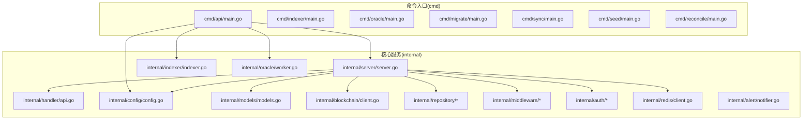
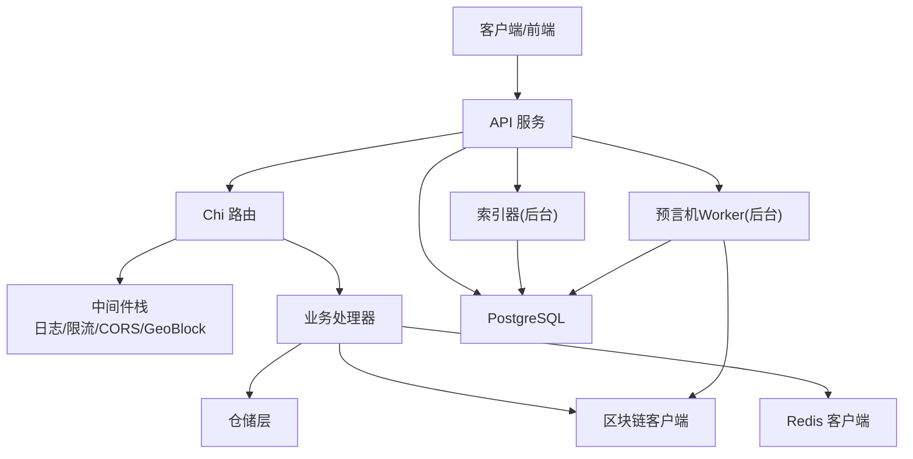
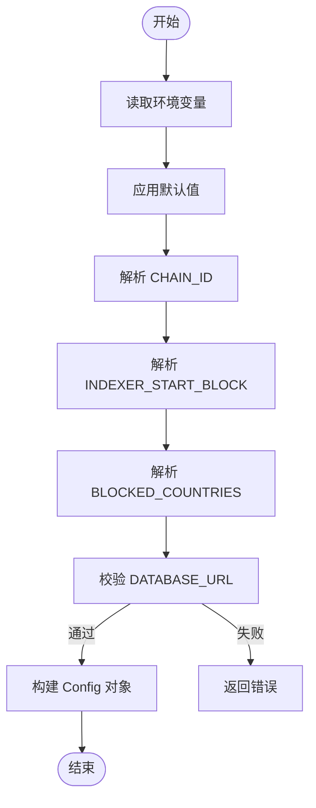
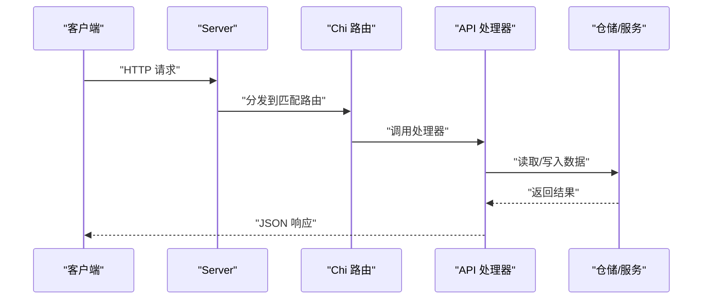
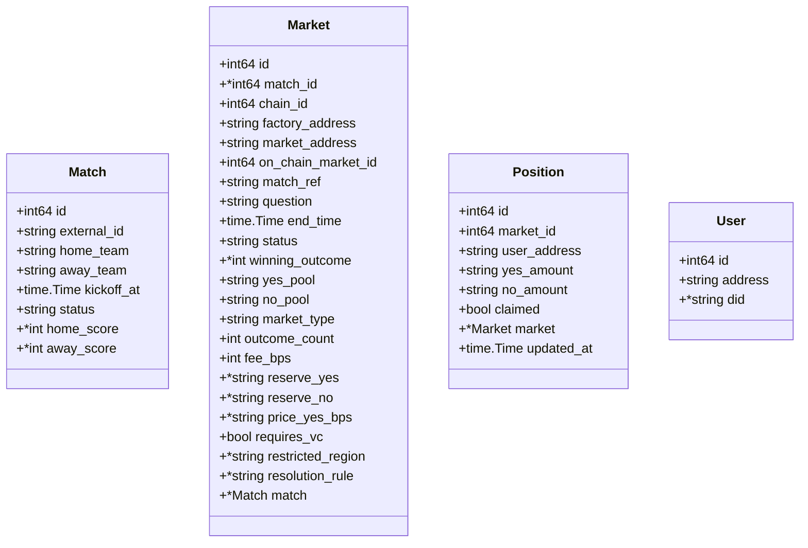
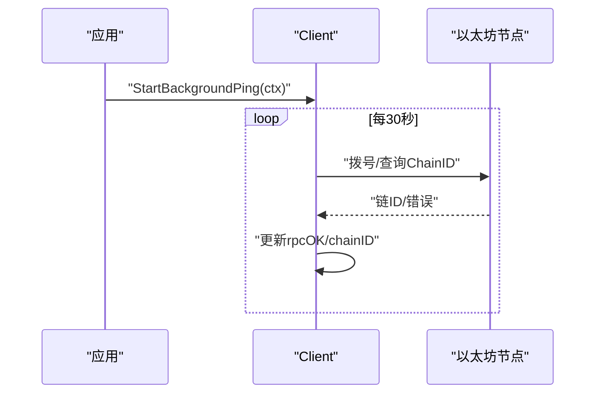
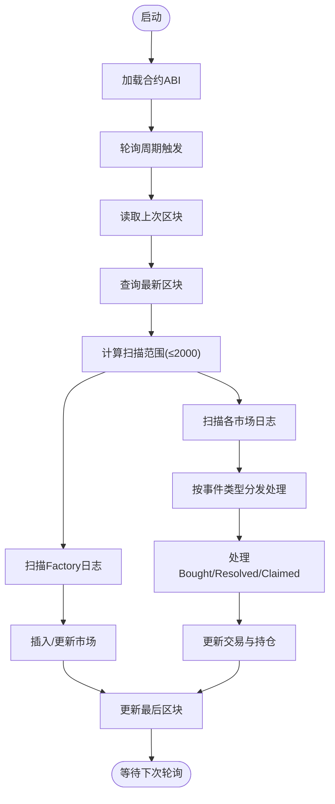
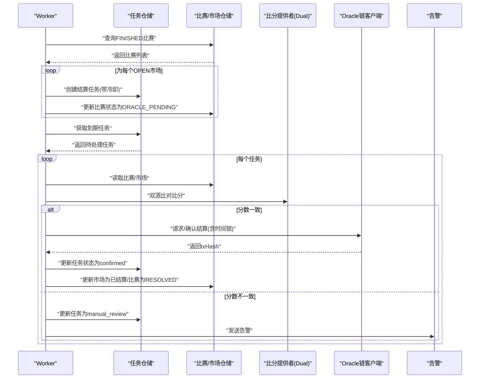
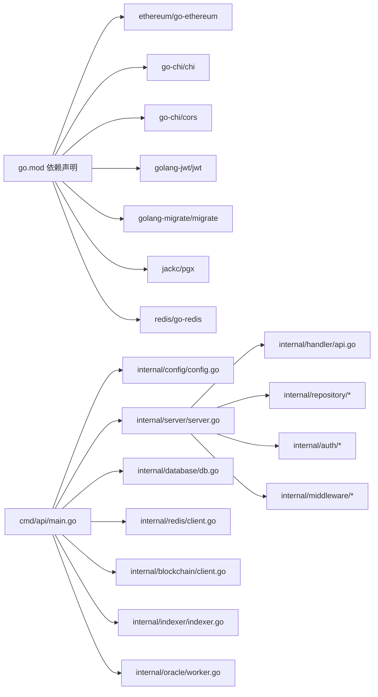

# 开发指南

<cite>
**本文档引用的文件**
- [go.mod](file://go.mod)
- [main.go](file://cmd/api/main.go)
- [server.go](file://internal/server/server.go)
- [config.go](file://internal/config/config.go)
- [models.go](file://internal/models/models.go)
- [api.go](file://internal/handler/api.go)
- [match.go](file://internal/repository/match.go)
- [client.go](file://internal/blockchain/client.go)
- [indexer.go](file://internal/indexer/indexer.go)
- [worker.go](file://internal/oracle/worker.go)
- [config_test.go](file://internal/config/config_test.go)
- [health_test.go](file://internal/handler/health_test.go)
</cite>

## 目录
1. [简介](#简介)
2. [项目结构](#项目结构)
3. [核心组件](#核心组件)
4. [架构总览](#架构总览)
5. [详细组件分析](#详细组件分析)
6. [依赖关系分析](#依赖关系分析)
7. [性能考虑](#性能考虑)
8. [故障排查指南](#故障排查指南)
9. [结论](#结论)
10. [附录](#附录)

## 简介
本开发指南面向PredictionDIDSimple后端团队，目标是帮助开发者快速理解项目架构、掌握开发流程与规范、高效完成新功能开发与维护。内容涵盖：
- 代码贡献规范与分支管理策略
- 代码审查流程与发布流程
- 新功能开发全流程（需求分析、设计讨论、编码实现、测试验证）
- 开发环境设置与调试技巧（IDE配置、调试工具、性能分析）
- 代码组织原则与最佳实践（模块划分、接口设计、错误处理）
- 扩展点与插件系统使用方法
- 代码质量要求与持续改进建议

## 项目结构
后端采用多命令入口（cmd/*）与清晰的分层架构（internal/*），主要目录职责如下：
- cmd：应用入口，每个子命令代表一个独立进程（API、索引器、预言机、迁移等）
- internal：核心业务层，按关注点拆分为 server、handler、repository、blockchain、indexer、oracle、config、models、middleware、auth、alert、redis 等
- migrations：数据库迁移脚本
- pkg/contracts：合约ABI资源
- data：示例mock数据

图表来源
- [main.go:1-161](file://cmd/api/main.go#L1-L161)
- [server.go:1-129](file://internal/server/server.go#L1-L129)
- [api.go:1-100](file://internal/handler/api.go#L1-L100)
- [config.go:1-139](file://internal/config/config.go#L1-L139)
- [models.go:1-63](file://internal/models/models.go#L1-L63)
- [client.go:1-94](file://internal/blockchain/client.go#L1-L94)
- [indexer.go:1-329](file://internal/indexer/indexer.go#L1-L329)
- [worker.go:1-214](file://internal/oracle/worker.go#L1-L214)

章节来源
- [go.mod:1-56](file://go.mod#L1-L56)
- [main.go:1-161](file://cmd/api/main.go#L1-L161)
- [server.go:1-129](file://internal/server/server.go#L1-L129)

## 核心组件
- 配置管理：集中加载环境变量，提供默认值与校验，确保运行一致性
- HTTP服务器：基于Chi路由，内置中间件（日志、限流、CORS、地理封锁），统一注册API路由
- 数据仓储：围绕模型抽象数据库访问，支持分页、Upsert、状态更新等
- 区块链交互：封装RPC连接、健康检查、Oracle写入客户端
- 索引器：轮询Factory与市场事件，增量同步至数据库
- 预言机Worker：根据比赛状态与比分数据源自动发起链上结算
- 测试：覆盖配置加载与健康检查等关键路径

章节来源
- [config.go:1-139](file://internal/config/config.go#L1-L139)
- [server.go:1-129](file://internal/server/server.go#L1-L129)
- [match.go:1-118](file://internal/repository/match.go#L1-L118)
- [client.go:1-94](file://internal/blockchain/client.go#L1-L94)
- [indexer.go:1-329](file://internal/indexer/indexer.go#L1-L329)
- [worker.go:1-214](file://internal/oracle/worker.go#L1-L214)
- [config_test.go:1-55](file://internal/config/config_test.go#L1-L55)
- [health_test.go:1-46](file://internal/handler/health_test.go#L1-L46)

## 架构总览
后端以“命令入口 + 服务层 + 业务层 + 基础设施”分层组织，API进程负责对外提供REST接口，同时在后台运行索引器与预言机Worker；配置中心统一管理运行参数；仓储层屏蔽数据库细节；区块链层抽象以太坊交互。

图表来源
- [main.go:1-161](file://cmd/api/main.go#L1-L161)
- [server.go:1-129](file://internal/server/server.go#L1-L129)
- [api.go:1-100](file://internal/handler/api.go#L1-L100)
- [indexer.go:1-329](file://internal/indexer/indexer.go#L1-L329)
- [worker.go:1-214](file://internal/oracle/worker.go#L1-L214)

## 详细组件分析

### 配置管理（Config）
- 职责：从环境变量加载配置，提供默认值与类型转换，校验必填项
- 关键点：CHAIN_ID与INDEXER_START_BLOCK进行数值解析；BLOCKED_COUNTRIES解析为map；DATABASE_URL必填
- 测试：覆盖默认值、自定义端口、空DATABASE_URL等场景

图表来源
- [config.go:48-105](file://internal/config/config.go#L48-L105)

章节来源
- [config.go:1-139](file://internal/config/config.go#L1-L139)
- [config_test.go:1-55](file://internal/config/config_test.go#L1-L55)

### HTTP服务器与路由（Server & Handler）
- 服务器：依赖注入模式，统一设置中间件、CORS、路由注册与优雅关闭
- 路由：公开接口、认证接口、JWT保护接口、管理员接口分组注册
- 中间件：请求ID、真实IP、日志、恢复、速率限制、地理封锁

图表来源
- [server.go:44-102](file://internal/server/server.go#L44-L102)
- [api.go:34-69](file://internal/handler/api.go#L34-L69)

章节来源
- [server.go:1-129](file://internal/server/server.go#L1-L129)
- [api.go:1-100](file://internal/handler/api.go#L1-L100)

### 数据模型与仓储（Models & Repository）
- 模型：Match、Market、Position、User，定义核心业务实体
- 仓储：MatchRepo提供分页查询、Upsert、状态更新、按external_id检索等
- 设计要点：SQL动态拼接WHERE条件，支持limit/offset分页；Upsert基于冲突列去重

图表来源
- [models.go:6-62](file://internal/models/models.go#L6-L62)

章节来源
- [models.go:1-63](file://internal/models/models.go#L1-L63)
- [match.go:1-118](file://internal/repository/match.go#L1-L118)

### 区块链客户端（Blockchain）
- 职责：封装RPC拨号、周期性健康检查、链ID校验
- 特性：原子状态存储健康状态与链ID，后台goroutine定期ping

图表来源
- [client.go:30-83](file://internal/blockchain/client.go#L30-L83)

章节来源
- [client.go:1-94](file://internal/blockchain/client.go#L1-L94)

### 索引器（Indexer）
- 职责：轮询Factory与市场事件，解析日志，同步到数据库
- 关键流程：加载ABI → 计算区块范围 → 扫描Factory事件 → 扫描各市场事件 → 更新索引器状态

图表来源
- [indexer.go:97-160](file://internal/indexer/indexer.go#L97-L160)
- [indexer.go:251-290](file://internal/indexer/indexer.go#L251-L290)

章节来源
- [indexer.go:1-329](file://internal/indexer/indexer.go#L1-L329)

### 预言机Worker（Oracle Worker）
- 职责：将FINISHED比赛入队结算任务，轮询到期任务，比对比分数据源，发起链上结算
- 关键流程：enqueueFinished → processDue → processJob（含双源比对、时间锁/直接结算）

图表来源
- [worker.go:60-121](file://internal/oracle/worker.go#L60-L121)
- [worker.go:123-205](file://internal/oracle/worker.go#L123-L205)

章节来源
- [worker.go:1-214](file://internal/oracle/worker.go#L1-L214)

## 依赖关系分析
- 外部依赖：以太坊、Chi路由、CORS、JWT、migrate、pgx、Redis、SIWE等
- 内部耦合：server依赖handler、repository、blockchain、redis、config；handler依赖repository与blockchain；indexer与oracle依赖repository与blockchain；config贯穿全链路

图表来源
- [go.mod:5-14](file://go.mod#L5-L14)
- [main.go:17-24](file://cmd/api/main.go#L17-L24)
- [server.go:11-22](file://internal/server/server.go#L11-L22)

章节来源
- [go.mod:1-56](file://go.mod#L1-L56)
- [main.go:1-161](file://cmd/api/main.go#L1-L161)
- [server.go:1-129](file://internal/server/server.go#L1-L129)

## 性能考虑
- 数据库连接池：使用pgx连接池，合理设置最大连接数与超时
- 限流与CORS：中间件层统一限流与跨域策略，避免无效请求放大
- 索引器批处理：单次扫描上限2000区块，降低RPC压力
- 预言机时间锁：通过时间锁避免瞬时结算风暴
- Redis降级：当Redis不可用时，服务仍可运行但部分缓存能力降级
- 健康检查：RPC健康检查与链ID校验，保障上游依赖稳定

## 故障排查指南
- 配置加载失败：检查DATABASE_URL是否缺失，CHAIN_ID与INDEXER_START_BLOCK格式是否正确
- 健康检查异常：确认/health与/ready端点返回200；若DB为nil，/ready仍应返回200
- 索引器无数据：确认MARKET_FACTORY_ADDRESS已配置，轮询间隔与起始区块设置合理
- 预言机结算失败：查看任务状态是否为failed，检查Oracle链客户端与时间锁配置
- CORS跨域问题：核对允许的Origin、Method与Header，确保AllowCredentials启用

章节来源
- [config.go:84-104](file://internal/config/config.go#L84-L104)
- [health_test.go:12-45](file://internal/handler/health_test.go#L12-L45)
- [indexer.go:99-103](file://internal/indexer/indexer.go#L99-L103)
- [worker.go:105-108](file://internal/oracle/worker.go#L105-L108)

## 结论
本指南提供了PredictionDIDSimple后端的开发与维护路径：从配置与架构入手，结合分层设计与依赖注入，明确新功能开发流程与测试策略，给出性能与故障排查建议。遵循本文档可显著提升开发效率与代码质量。

## 附录

### 代码贡献规范与开发流程
- 分支管理策略
  - 主分支：main（受保护，禁止直接推送）
  - 功能分支：feature/xxx（从main切出，完成后合并回main）
  - 修复分支：hotfix/xxx（从main或release切出，修复后回main与release）
  - 预发布分支：release-x.y（准备版本发布，完成后合并回main与develop）
- 提交规范
  - 类型：feat、fix、docs、style、refactor、test、chore
  - 格式：type(scope): subject（subject首字母小写，不超过50字符）
  - 说明：正文描述动机与影响，引用Issue编号
- 代码审查流程
  - 提交PR，至少一名Reviewer批准
  - 自动化检查：静态分析、单元测试、集成测试
  - 合并前确保文档与变更一致
- 发布流程
  - 选择语义化版本号，生成变更日志
  - 打标签并推送，触发CI/CD流水线
  - 产物归档与部署

### 新功能开发完整指南
- 需求分析：明确业务目标、边界与约束
- 设计讨论：确定数据模型、接口设计、错误处理策略
- 编码实现：遵循分层与依赖注入，最小可行实现
- 测试验证：补充单元测试与集成测试，覆盖关键路径
- 文档更新：更新README与内部设计文档
- 评审与发布：提交PR，通过审查与自动化检查后合并

### 开发环境设置与调试技巧
- IDE配置
  - Go插件启用：导入路径提示、格式化、重构
  - LSP：gopls，启用诊断与自动修复
  - 调试：断点、变量监视、调用栈
- 调试工具
  - net/http/pprof：性能剖析与内存分析
  - logrus/zap：结构化日志，区分级别与字段
- 性能分析
  - pprof：CPU/内存火焰图
  - 指标导出：Prometheus指标端点
- 常见问题
  - 端口占用：修改HTTP_PORT
  - 数据库连接：检查DATABASE_URL与SSL模式
  - Redis不可用：确认REDIS_URL与网络连通

### 代码组织原则与最佳实践
- 模块划分
  - cmd：单一职责的命令入口，仅做初始化与组合
  - internal：业务内聚，按领域拆分子包
- 接口设计
  - 依赖倒置：上层依赖接口而非具体实现
  - 最小暴露：仅导出必要接口与类型
- 错误处理
  - 明确错误来源与上下文，避免吞掉错误
  - 使用结构化错误，便于日志与监控
- 可测试性
  - 依赖注入，便于Mock与替换
  - 单元测试覆盖核心逻辑，集成测试覆盖关键流程

### 扩展点与插件系统
- 合约ABI扩展：在pkg/contracts新增合约JSON，索引器与预言机按需加载
- 数据源扩展：比分提供者接口可替换为更多数据源
- 中间件扩展：在server中间件栈增加自定义中间件
- 存储扩展：仓储层抽象可替换为其他持久化方案

### 代码质量要求与持续改进
- 质量门槛
  - 单元测试覆盖率≥80%，关键路径≥90%
  - 无阻塞panic，无长时间阻塞IO
  - 无敏感信息泄露（密钥、令牌等）
- 持续改进
  - 定期重构：消除重复、简化复杂度
  - 技术债清单：跟踪并逐步解决
  - 文档同步：代码变更即文档更新