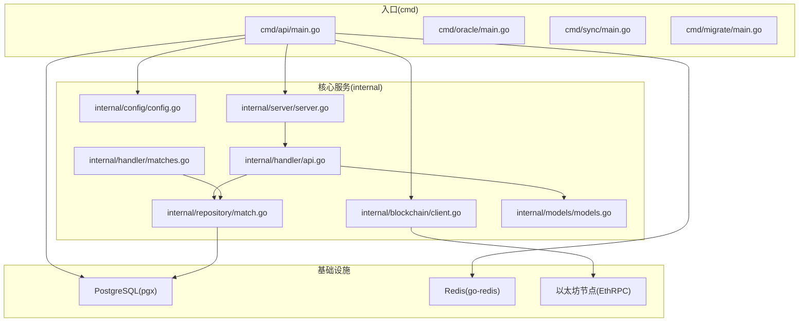
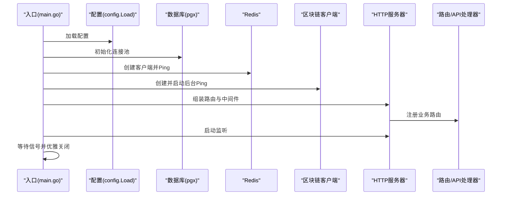
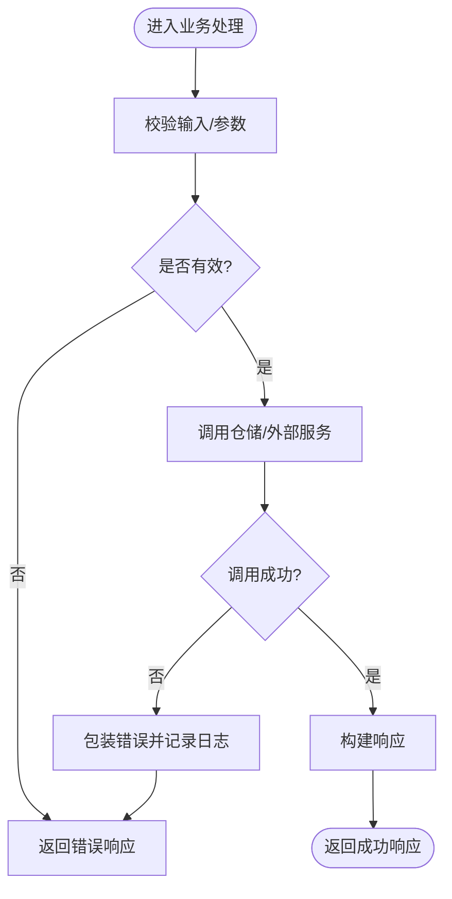
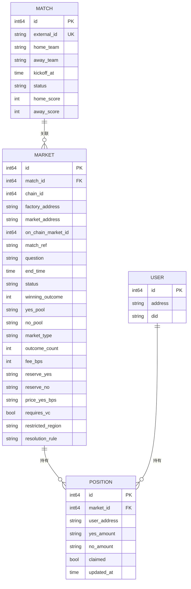
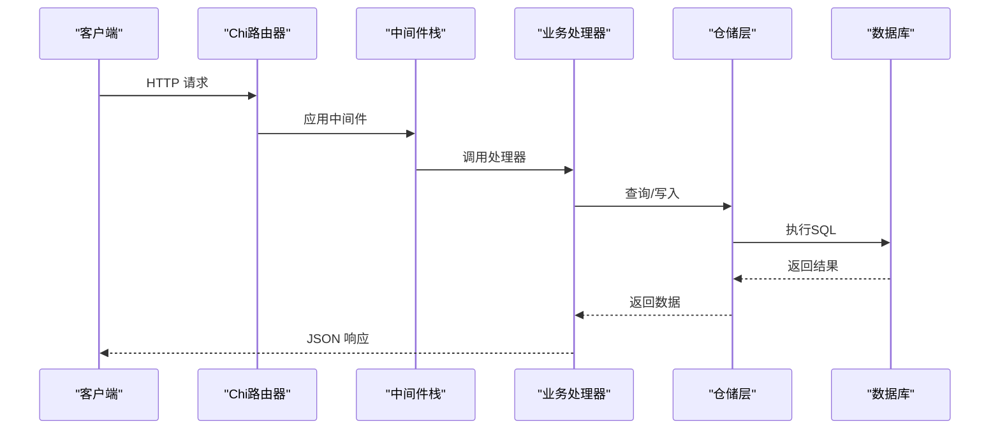
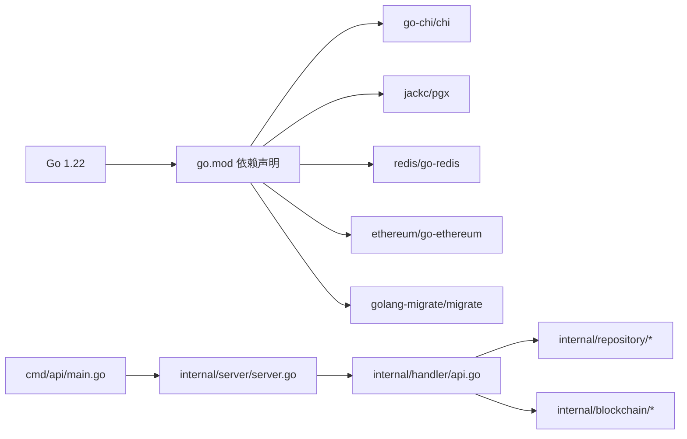

# 代码规范

<cite>
**本文引用的文件**
- [go.mod](file://go.mod)
- [cmd/api/main.go](file://cmd/api/main.go)
- [internal/config/config.go](file://internal/config/config.go)
- [internal/models/models.go](file://internal/models/models.go)
- [internal/handler/api.go](file://internal/handler/api.go)
- [internal/handler/matches.go](file://internal/handler/matches.go)
- [internal/repository/match.go](file://internal/repository/match.go)
- [internal/blockchain/client.go](file://internal/blockchain/client.go)
- [internal/server/server.go](file://internal/server/server.go)
</cite>

## 目录
1. [引言](#引言)
2. [项目结构](#项目结构)
3. [核心组件](#核心组件)
4. [架构总览](#架构总览)
5. [详细组件分析](#详细组件分析)
6. [依赖分析](#依赖分析)
7. [性能考虑](#性能考虑)
8. [故障排查指南](#故障排查指南)
9. [结论](#结论)
10. [附录](#附录)

## 引言
本规范面向 PredictionDIDSimple 后端代码库，旨在统一 Go 语言编码风格与工程实践，覆盖命名约定、文件组织、包设计、格式化、注释、错误处理、代码审查要点以及 IDE 配置建议。本文所有要求均基于仓库现有实现提炼而来，确保与实际代码一致。

## 项目结构
后端采用按职责分层的包组织方式：
- cmd：应用入口（多命令入口）
- internal：内部业务模块（按领域/职责划分）
- pkg：外部合约 ABI 等只读资源
- migrations：数据库迁移脚本
- data：测试/示例数据

图表来源
- [cmd/api/main.go](file://cmd/api/main.go#L24-L117)
- [internal/server/server.go](file://internal/server/server.go#L35-L84)
- [internal/handler/api.go](file://internal/handler/api.go#L30-L61)
- [internal/repository/match.go](file://internal/repository/match.go#L13-L19)
- [internal/blockchain/client.go](file://internal/blockchain/client.go#L12-L24)

章节来源
- [go.mod](file://go.mod#L1-L56)
- [cmd/api/main.go](file://cmd/api/main.go#L1-L118)

## 核心组件
- 配置加载：集中于 internal/config，提供默认值与环境变量解析，并进行参数校验与转换。
- 服务器：internal/server 组合路由、中间件、健康检查与业务处理器。
- 处理器：internal/handler 聚合各领域路由与鉴权组，统一输出 JSON/错误响应。
- 仓储：internal/repository 封装数据库访问，使用 pgx 连接池，SQL 参数化查询。
- 区块链客户端：internal/blockchain 提供以太坊连接健康检查与链 ID 校验。
- 模型：internal/models 定义持久化实体映射。

章节来源
- [internal/config/config.go](file://internal/config/config.go#L10-L96)
- [internal/server/server.go](file://internal/server/server.go#L22-L84)
- [internal/handler/api.go](file://internal/handler/api.go#L16-L28)
- [internal/repository/match.go](file://internal/repository/match.go#L13-L54)
- [internal/blockchain/client.go](file://internal/blockchain/client.go#L12-L79)
- [internal/models/models.go](file://internal/models/models.go#L5-L57)

## 架构总览
系统启动流程概览如下：

图表来源
- [cmd/api/main.go](file://cmd/api/main.go#L24-L117)
- [internal/config/config.go](file://internal/config/config.go#L45-L96)
- [internal/server/server.go](file://internal/server/server.go#L35-L84)
- [internal/blockchain/client.go](file://internal/blockchain/client.go#L26-L70)

## 详细组件分析

### 命名约定
- 包名：小写、简洁、语义明确；如 config、handler、repository、blockchain。
- 结构体与导出标识符：采用驼峰命名；如 Config、API、MatchRepo、Client。
- 方法与字段：导出方法首字母大写，内部方法小写开头；如 New、List、GetByID。
- 常量与变量：遵循 Go 命名习惯；避免缩写，必要时保持团队一致。
- 文件名：与包同名或简明表达职责；如 config.go、api.go、match.go。

章节来源
- [internal/config/config.go](file://internal/config/config.go#L10-L43)
- [internal/handler/api.go](file://internal/handler/api.go#L16-L28)
- [internal/repository/match.go](file://internal/repository/match.go#L13-L19)
- [internal/blockchain/client.go](file://internal/blockchain/client.go#L12-L24)

### 文件组织与包设计原则
- 分层清晰：cmd 负责入口，internal 负责业务，pkg 放置只读资源，migrations/data 放置静态资源。
- 单一职责：每个包聚焦一个子域（配置、服务、处理器、仓储、模型、中间件）。
- 可测试性：通过接口注入与依赖组合（如 server.New 的 Dependencies），便于替换与测试。
- 可复用性：公共工具（如 getEnv/getEnvInt）集中在 config 包中。

章节来源
- [internal/server/server.go](file://internal/server/server.go#L26-L33)
- [internal/config/config.go](file://internal/config/config.go#L45-L96)

### 代码格式化与风格一致性
- 使用 gofmt 格式化；在 CI 中强制执行。
- 导入分组：标准库、第三方、本地包，空行分隔。
- 行宽：建议不超过 120 列；长字符串/SQL 使用换行与缩进。
- 函数长度：单函数控制在合理范围，复杂逻辑拆分为私有辅助函数。
- 错误处理：尽早返回，避免深层嵌套；错误信息包含上下文。

章节来源
- [internal/handler/api.go](file://internal/handler/api.go#L63-L87)
- [internal/repository/match.go](file://internal/repository/match.go#L21-L54)

### 注释规范
- 包注释：在包声明后添加简洁说明，描述用途与边界。
- 导出类型/方法注释：解释职责、输入输出、并发安全与错误语义。
- 行内注释：仅用于复杂逻辑的必要说明，避免冗余。
- 示例注释：对外暴露的 API 或关键流程，可在注释中给出调用示意（路径引用）。

章节来源
- [internal/models/models.go](file://internal/models/models.go#L1-L58)
- [internal/handler/api.go](file://internal/handler/api.go#L16-L28)

### 错误处理模式
- 错误包装：使用 fmt.Errorf 包裹底层错误，保留上下文。
- 错误传播：在业务层统一转换为 HTTP 错误码与标准化消息。
- 日志记录：区分致命错误（log.Fatalf）与警告（log.Printf）；对可恢复错误仅记录上下文。
- 健康检查：区块链客户端定期 Ping 并记录状态；网络/链上异常及时告警。

图表来源
- [internal/handler/matches.go](file://internal/handler/matches.go#L7-L38)
- [internal/repository/match.go](file://internal/repository/match.go#L21-L54)
- [internal/blockchain/client.go](file://internal/blockchain/client.go#L42-L70)

章节来源
- [internal/config/config.go](file://internal/config/config.go#L79-L96)
- [internal/handler/api.go](file://internal/handler/api.go#L63-L87)
- [internal/blockchain/client.go](file://internal/blockchain/client.go#L42-L70)

### 数据模型与仓储
- 模型字段：使用 JSON 标签与可选指针表示可空字段；时间字段使用 time.Time。
- SQL 查询：参数化绑定，动态拼接 WHERE 条件；限制/偏移默认值处理。
- 写入策略：UPSERT 使用 ON CONFLICT；更新时间戳统一使用 NOW()。

图表来源
- [internal/models/models.go](file://internal/models/models.go#L5-L57)

章节来源
- [internal/models/models.go](file://internal/models/models.go#L5-L57)
- [internal/repository/match.go](file://internal/repository/match.go#L21-L82)

### HTTP 服务与路由
- 路由注册：统一在 API.RegisterRoutes 中注册公开与受保护路由组。
- 中间件：请求 ID、真实 IP、日志、恢复、限流、跨域、地理封锁。
- 响应格式：统一 JSON 输出；错误响应包含 error 字段。
- 健康检查：集成数据库、Redis、区块链健康状态。

图表来源
- [internal/server/server.go](file://internal/server/server.go#L35-L84)
- [internal/handler/api.go](file://internal/handler/api.go#L30-L61)
- [internal/repository/match.go](file://internal/repository/match.go#L21-L54)

章节来源
- [internal/server/server.go](file://internal/server/server.go#L35-L84)
- [internal/handler/api.go](file://internal/handler/api.go#L30-L61)

## 依赖分析
- 语言与版本：Go 1.22；依赖管理使用 go.mod。
- 主要第三方库：HTTP 路由与中间件、数据库驱动、Redis 客户端、以太坊客户端、迁移工具。
- 依赖注入：通过 server.New 的 Dependencies 结构体注入 DB、Redis、链客户端等。

图表来源
- [go.mod](file://go.mod#L3-L14)
- [cmd/api/main.go](file://cmd/api/main.go#L13-L22)
- [internal/server/server.go](file://internal/server/server.go#L35-L84)

章节来源
- [go.mod](file://go.mod#L1-L56)
- [cmd/api/main.go](file://cmd/api/main.go#L13-L22)

## 性能考虑
- 数据库连接：使用连接池（pgxpool），避免频繁创建连接；在入口处初始化并在退出时关闭。
- 查询优化：参数化 SQL，避免字符串拼接；对高频查询添加索引（如 external_id）。
- 缓存：Redis 作为可选缓存层，注意键空间设计与过期策略。
- 网络超时：RPC/Ping 设置合理超时，防止阻塞；后台任务周期性健康检查。
- 中间件：日志与恢复器开销可控；限流与地理封锁在路由层生效。

章节来源
- [cmd/api/main.go](file://cmd/api/main.go#L42-L46)
- [internal/repository/match.go](file://internal/repository/match.go#L21-L54)
- [internal/blockchain/client.go](file://internal/blockchain/client.go#L42-L70)
- [internal/server/server.go](file://internal/server/server.go#L37-L53)

## 故障排查指南
- 配置问题：检查 DATABASE_URL、CHAIN_ID、INDEXER_START_BLOCK 等关键环境变量；确认默认值与类型转换。
- 数据库迁移：确认 migrations 目录存在且可访问；失败时查看具体错误并修正 SQL。
- Redis 连接：若 Redis URL 解析失败或 Ping 失败，系统会记录警告并降级运行。
- 区块链健康：后台 Ping 失败或链 ID 不匹配会记录警告；检查 ETH_RPC_URL 与链 ID。
- 优雅关闭：SIGINT/SIGTERM 触发优雅关闭，注意超时与资源释放。

章节来源
- [internal/config/config.go](file://internal/config/config.go#L45-L96)
- [cmd/api/main.go](file://cmd/api/main.go#L33-L59)
- [internal/blockchain/client.go](file://internal/blockchain/client.go#L42-L70)

## 结论
本规范总结了项目现有的编码与工程实践，强调一致性、可维护性与可观测性。建议在后续迭代中持续完善单元测试、接口契约与文档化，确保团队协作效率与系统稳定性。

## 附录

### 代码审查清单
- 命名与注释：标识符语义清晰，包/导出类型/方法具备注释。
- 错误处理：错误被包装与记录；HTTP 层统一错误响应。
- 安全性：鉴权中间件正确使用；敏感配置来自环境变量；CORS 仅允许可信源。
- 性能：SQL 参数化；连接池配置合理；避免 N+1 查询。
- 可维护性：依赖注入清晰；单测覆盖关键路径；日志级别恰当。

### IDE 配置建议
- VS Code
  - 插件：Go、gopls、EditorConfig、Better Comments
  - 设置：go.formatTool=gofmt；go.lspNext=true；editor.rulers=[120]
- GoLand
  - 设置：Go Frameworks：勾选 Modules；Gofmt：启用；Inspections：启用“未使用的导入”“未使用的变量”
  - 代码样式：Hard wrap at 120；类/方法注释模板

### 关键实现参考路径
- 入口与生命周期：[cmd/api/main.go](file://cmd/api/main.go#L24-L117)
- 配置加载与校验：[internal/config/config.go](file://internal/config/config.go#L45-L96)
- 服务器与中间件：[internal/server/server.go](file://internal/server/server.go#L35-L84)
- 路由与响应封装：[internal/handler/api.go](file://internal/handler/api.go#L30-L87)
- 仓储与 SQL 参数化：[internal/repository/match.go](file://internal/repository/match.go#L21-L82)
- 区块链健康检查：[internal/blockchain/client.go](file://internal/blockchain/client.go#L26-L70)
- 数据模型定义：[internal/models/models.go](file://internal/models/models.go#L5-L57)