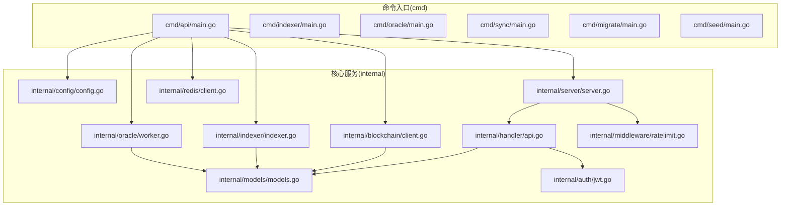
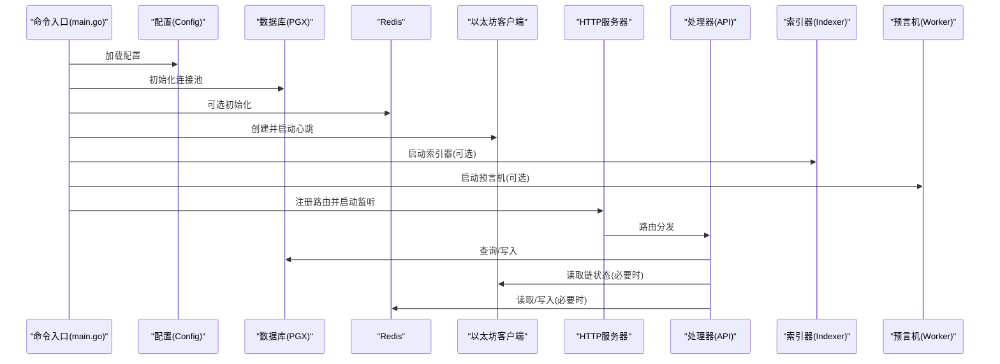
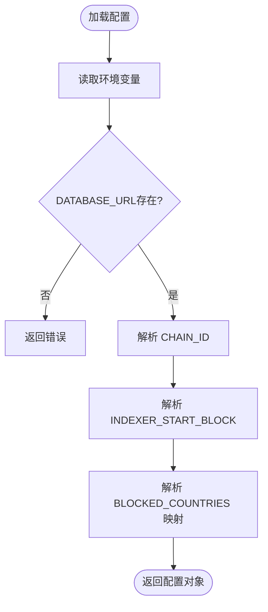
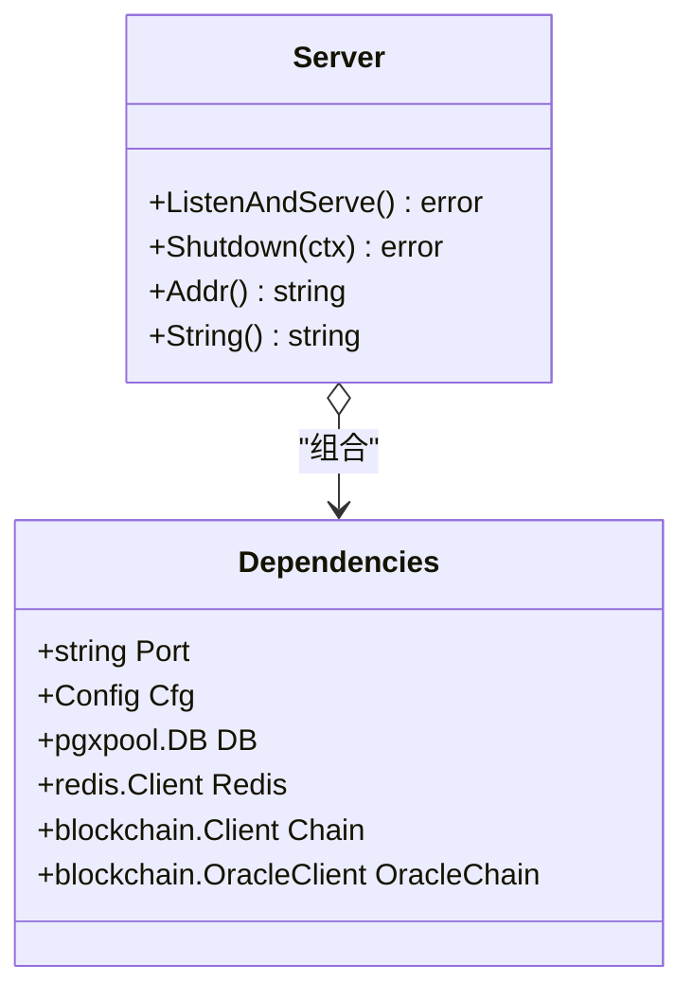
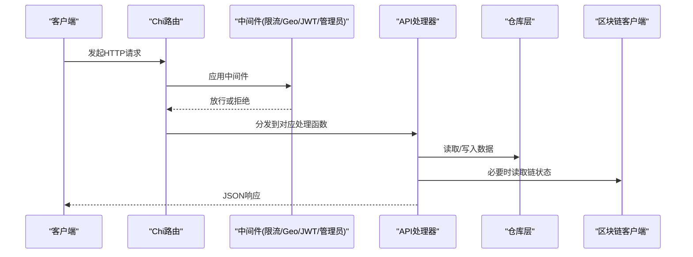
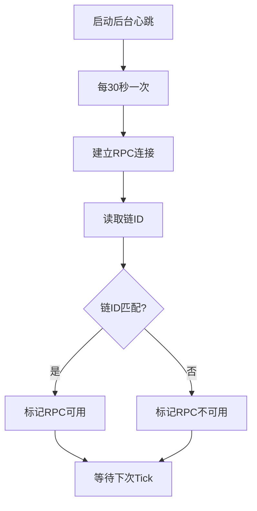
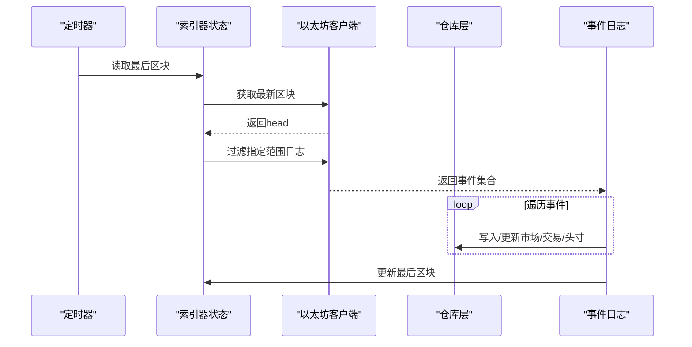
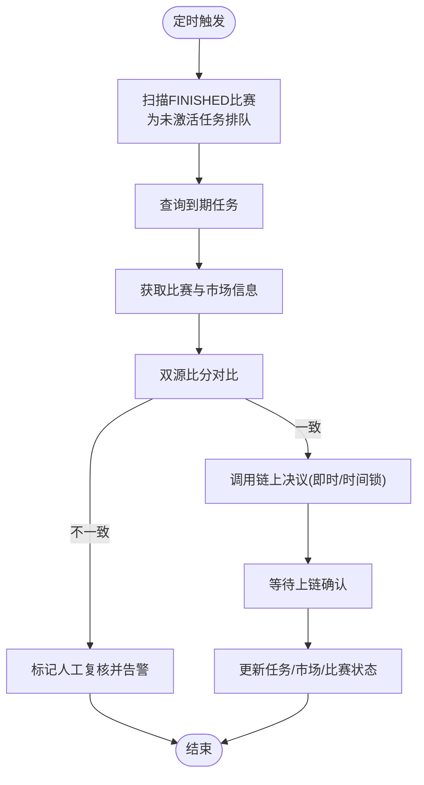
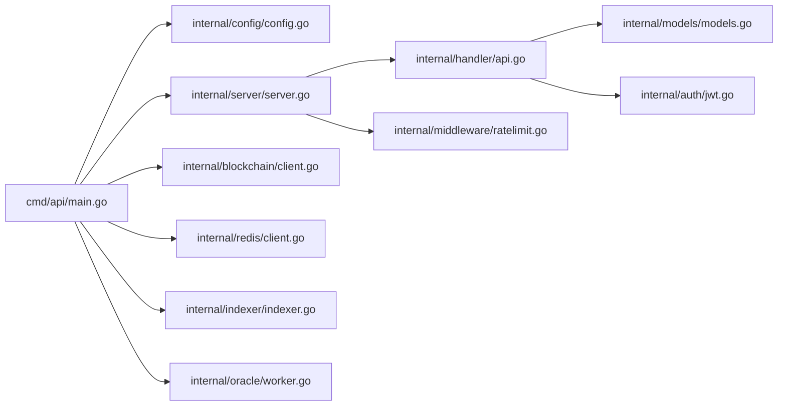

# 开发指南

<cite>
**本文引用的文件**
- [go.mod](file://go.mod)
- [cmd/api/main.go](file://cmd/api/main.go)
- [internal/config/config.go](file://internal/config/config.go)
- [internal/server/server.go](file://internal/server/server.go)
- [internal/handler/api.go](file://internal/handler/api.go)
- [internal/models/models.go](file://internal/models/models.go)
- [internal/blockchain/client.go](file://internal/blockchain/client.go)
- [internal/indexer/indexer.go](file://internal/indexer/indexer.go)
- [internal/oracle/worker.go](file://internal/oracle/worker.go)
- [internal/config/config_test.go](file://internal/config/config_test.go)
- [internal/handler/health_test.go](file://internal/handler/health_test.go)
- [internal/auth/jwt.go](file://internal/auth/jwt.go)
- [internal/middleware/ratelimit.go](file://internal/middleware/ratelimit.go)
- [internal/redis/client.go](file://internal/redis/client.go)
</cite>

## 目录
1. [简介](#简介)
2. [项目结构](#项目结构)
3. [核心组件](#核心组件)
4. [架构总览](#架构总览)
5. [详细组件分析](#详细组件分析)
6. [依赖关系分析](#依赖关系分析)
7. [性能考虑](#性能考虑)
8. [故障排查指南](#故障排查指南)
9. [结论](#结论)
10. [附录](#附录)

## 简介
本开发指南面向PredictionDIDSimple后端团队与贡献者，目标是帮助你快速理解系统架构、掌握开发与测试流程、规范代码贡献与审查，并提供调试、性能优化与安全实践建议。本文档基于仓库中的实际代码进行分析，所有技术细节均来自具体源码文件。

## 项目结构
后端采用命令入口分层（cmd）、业务模块分层（internal）与迁移脚本（migrations）的组织方式。核心运行入口位于多个命令程序中，如API服务、索引器、预言机等；业务逻辑集中在internal目录下，按领域拆分为配置、服务器、处理器、模型、区块链客户端、索引器、预言机、中间件、认证、仓库层、Redis客户端等模块。

图表来源
- [cmd/api/main.go](file://cmd/api/main.go#L24-L117)
- [internal/server/server.go](file://internal/server/server.go#L35-L84)
- [internal/handler/api.go](file://internal/handler/api.go#L30-L61)
- [internal/config/config.go](file://internal/config/config.go#L45-L96)
- [internal/blockchain/client.go](file://internal/blockchain/client.go#L19-L78)
- [internal/indexer/indexer.go](file://internal/indexer/indexer.go#L35-L57)
- [internal/oracle/worker.go](file://internal/oracle/worker.go#L26-L36)
- [internal/middleware/ratelimit.go](file://internal/middleware/ratelimit.go#L36-L55)
- [internal/auth/jwt.go](file://internal/auth/jwt.go#L16-L43)
- [internal/redis/client.go](file://internal/redis/client.go#L10-L22)

章节来源
- [go.mod](file://go.mod#L1-L56)
- [cmd/api/main.go](file://cmd/api/main.go#L1-L118)
- [internal/config/config.go](file://internal/config/config.go#L1-L128)

## 核心组件
- 配置加载：集中于配置结构体与加载函数，支持环境变量注入与默认值处理，包含数据库、Redis、以太坊RPC、工厂地址、Oracle参数、合规与限流等。
- 服务器与路由：基于Chi路由器，注册健康检查、公开接口与受保护接口，启用CORS、速率限制、Geo阻断与恢复器。
- 处理器：提供赛事、市场、统计、合规、KYC回调、事件流、指标等接口，并在受保护组内提供用户绑定DID、凭证查询等能力。
- 区块链客户端：封装以太坊RPC连接、链ID校验与后台心跳检测。
- 索引器：监听工厂合约事件，解析市场创建与交易事件，写入本地数据库。
- 预言机：根据已完成比赛从双源比对分数，生成决议任务，支持即时或带时间锁的链上确认。
- 中间件：速率限制（按IP分钟级滑动窗口）、Geo阻断、CORS、请求ID、日志与恢复。
- 认证：基于JWT的签发与解析，支持管理员密钥的管理端路由。
- Redis客户端：提供连接与Ping探测，用于降级提示。

章节来源
- [internal/config/config.go](file://internal/config/config.go#L10-L96)
- [internal/server/server.go](file://internal/server/server.go#L22-L84)
- [internal/handler/api.go](file://internal/handler/api.go#L16-L61)
- [internal/blockchain/client.go](file://internal/blockchain/client.go#L12-L78)
- [internal/indexer/indexer.go](file://internal/indexer/indexer.go#L24-L57)
- [internal/oracle/worker.go](file://internal/oracle/worker.go#L16-L36)
- [internal/middleware/ratelimit.go](file://internal/middleware/ratelimit.go#L10-L55)
- [internal/auth/jwt.go](file://internal/auth/jwt.go#L11-L43)
- [internal/redis/client.go](file://internal/redis/client.go#L10-L22)

## 架构总览
后端由“命令入口”启动多服务协作：API服务对外提供REST接口；索引器持续扫描链上事件并入库；预言机周期性处理已完成比赛的决议；配置中心统一读取环境变量；服务器负责路由、中间件与鉴权；区块链客户端负责链交互；Redis用于可选缓存与降级提示；PG数据库持久化业务数据。

图表来源
- [cmd/api/main.go](file://cmd/api/main.go#L24-L117)
- [internal/server/server.go](file://internal/server/server.go#L35-L84)
- [internal/handler/api.go](file://internal/handler/api.go#L30-L61)
- [internal/blockchain/client.go](file://internal/blockchain/client.go#L26-L78)
- [internal/indexer/indexer.go](file://internal/indexer/indexer.go#L85-L135)
- [internal/oracle/worker.go](file://internal/oracle/worker.go#L38-L100)

## 详细组件分析

### 配置模块
- 职责：集中管理运行所需的所有配置项，包括端口、数据库、Redis、以太坊RPC、链ID、工厂地址、Oracle相关参数、合规与限流开关、国家黑名单等。
- 关键点：环境变量缺失时返回错误，链ID与起始区块需可解析；国家列表解析为映射；提供默认值与类型转换辅助函数。
- 测试策略：通过设置不同环境变量验证默认值与错误路径。

图表来源
- [internal/config/config.go](file://internal/config/config.go#L45-L96)

章节来源
- [internal/config/config.go](file://internal/config/config.go#L45-L96)
- [internal/config/config_test.go](file://internal/config/config_test.go#L8-L46)

### 服务器与路由
- 职责：构建HTTP服务器，注册中间件与路由，暴露健康检查、公开API与受保护/管理端API。
- 关键点：启用CORS、速率限制、Geo阻断、日志与恢复器；路由分组区分普通用户与管理员权限；SSE场景放宽写超时。
- 安全：管理员路由需要专用密钥；JWT中间件保护用户专属接口。

图表来源
- [internal/server/server.go](file://internal/server/server.go#L22-L84)

章节来源
- [internal/server/server.go](file://internal/server/server.go#L35-L84)
- [internal/middleware/ratelimit.go](file://internal/middleware/ratelimit.go#L36-L55)

### 处理器与API
- 职责：实现REST接口，包括赛事、市场、统计、合规、KYC回调、事件流、指标、认证与凭证等。
- 关键点：路由分组与中间件应用；查询参数解析与错误响应；受保护接口依赖JWT；管理端接口依赖管理员密钥。
- 数据模型：Match、Market、Position、User等实体定义清晰。

图表来源
- [internal/handler/api.go](file://internal/handler/api.go#L30-L61)
- [internal/server/server.go](file://internal/server/server.go#L62-L75)

章节来源
- [internal/handler/api.go](file://internal/handler/api.go#L16-L88)
- [internal/models/models.go](file://internal/models/models.go#L5-L57)

### 区块链客户端
- 职责：维护以太坊RPC连接，定期心跳检测链ID，提供可用性标记。
- 关键点：后台定时ping，失败时置为不可用；支持期望链ID校验；线程安全的状态存储。

图表来源
- [internal/blockchain/client.go](file://internal/blockchain/client.go#L26-L78)

章节来源
- [internal/blockchain/client.go](file://internal/blockchain/client.go#L12-L78)

### 索引器
- 职责：扫描工厂合约事件，解析市场创建与交易事件，写入本地数据库；记录最后同步区块。
- 关键点：批量扫描区块范围（上限2000），事件过滤与ABI解析；MarketCreated、Bought、Resolved、Claimed等事件处理；外部ID映射。

图表来源
- [internal/indexer/indexer.go](file://internal/indexer/indexer.go#L85-L135)
- [internal/indexer/indexer.go](file://internal/indexer/indexer.go#L137-L154)
- [internal/indexer/indexer.go](file://internal/indexer/indexer.go#L212-L244)

章节来源
- [internal/indexer/indexer.go](file://internal/indexer/indexer.go#L24-L57)
- [internal/indexer/indexer.go](file://internal/indexer/indexer.go#L85-L135)

### 预言机
- 职责：周期性检查已完成比赛，生成决议任务，调用Oracle适配器进行链上决议，支持即时或带时间锁确认。
- 关键点：双源比分对比与规则映射；冷却时间与定时轮询；失败告警与状态回写；链上交易等待与确认。

图表来源
- [internal/oracle/worker.go](file://internal/oracle/worker.go#L53-L100)
- [internal/oracle/worker.go](file://internal/oracle/worker.go#L102-L164)

章节来源
- [internal/oracle/worker.go](file://internal/oracle/worker.go#L16-L36)
- [internal/oracle/worker.go](file://internal/oracle/worker.go#L38-L100)

### 认证与中间件
- JWT：签发含过期时间与签名校验，解析并验证签名方法。
- 速率限制：按IP的分钟级滑动窗口计数，健康检查与就绪检查豁免。
- Geo阻断：根据配置与中间件回调记录访问日志。

章节来源
- [internal/auth/jwt.go](file://internal/auth/jwt.go#L16-L43)
- [internal/middleware/ratelimit.go](file://internal/middleware/ratelimit.go#L24-L55)

### Redis客户端
- 职责：解析URL并创建客户端，提供Ping探测（短超时）。
- 用途：可选的降级提示与缓存（当前主流程未强制依赖）。

章节来源
- [internal/redis/client.go](file://internal/redis/client.go#L10-L22)

## 依赖关系分析
- 外部依赖：以太坊客户端、Chi路由器、CORS、PG驱动、Redis客户端、JWT库、迁移工具等。
- 模块耦合：服务器聚合处理器与中间件；处理器依赖仓库层与区块链客户端；索引器与预言机依赖配置与仓库层；认证与限流作为横切关注点注入路由。

图表来源
- [go.mod](file://go.mod#L5-L14)
- [cmd/api/main.go](file://cmd/api/main.go#L13-L22)
- [internal/server/server.go](file://internal/server/server.go#L35-L84)
- [internal/handler/api.go](file://internal/handler/api.go#L16-L28)

章节来源
- [go.mod](file://go.mod#L1-L56)
- [cmd/api/main.go](file://cmd/api/main.go#L1-L118)

## 性能考虑
- 数据库连接池：使用PGX连接池，确保并发查询与事务高效执行。
- 索引器批处理：单次扫描上限2000区块，避免一次性拉取过多导致内存压力。
- 速率限制：分钟级滑动窗口，防止突发流量冲击；健康检查豁免。
- 链交互：后台心跳与超时控制，避免阻塞主线程；链上操作等待上链确认。
- 缓存：Redis可选，建议仅用于热点读取与降级提示，避免强一致性依赖。

## 故障排查指南
- 健康检查：/health与/ready端点可用于快速判断服务可用性与依赖状态。
- 日志：服务器中间件开启日志与恢复器；各子系统打印关键状态与错误信息。
- 配置校验：缺少DATABASE_URL会直接报错；链ID与起始区块解析失败会阻止启动。
- 限流：若出现429，请检查客户端IP与速率限制配置。
- 预言机：失败任务会记录错误字段并发送告警；检查双源比分是否一致与链上适配器状态。

章节来源
- [internal/handler/health_test.go](file://internal/handler/health_test.go#L10-L37)
- [internal/config/config_test.go](file://internal/config/config_test.go#L8-L31)
- [internal/middleware/ratelimit.go](file://internal/middleware/ratelimit.go#L36-L55)
- [internal/oracle/worker.go](file://internal/oracle/worker.go#L149-L154)

## 结论
本指南基于仓库现有代码，梳理了PredictionDIDSimple后端的整体架构与关键模块职责，明确了开发、测试、调试与运维的关键实践。建议在新增功能时遵循现有分层与中间件模式，保持配置集中化与测试覆盖，确保链交互与数据一致性。

## 附录

### A. 代码贡献规范
- 编码标准
  - 使用Go官方格式化工具，保持一致缩进与命名风格。
  - 接口与结构体字段使用清晰语义命名，注释说明职责与边界。
  - 错误处理优先返回错误而非panic，便于上层统一处理。
- 提交规范
  - 提交信息采用“类型: 概述”的格式，如feat: 添加XXX功能；fix: 修复XXX问题；docs: 更新文档。
  - 每个提交聚焦单一变更，避免混杂无关修改。
- 代码审查流程
  - 所有功能变更必须通过Pull Request，至少一名维护者审查。
  - 审查要点：正确性、可测试性、性能影响、安全性与可维护性。

### B. 测试策略
- 单元测试
  - 配置模块：验证默认值与错误路径（参考配置测试文件）。
  - 健康检查：验证HTTP状态与响应结构（参考健康测试文件）。
  - 速率限制：构造多请求场景验证限流行为。
- 集成测试
  - 以最小化依赖启动API服务，验证路由与中间件链路。
  - 使用测试数据库与Mock链客户端，验证索引器与预言机流程片段。
- 端到端测试
  - 搭建完整环境（数据库、Redis、模拟以太坊节点），执行真实链交互与业务流程。

章节来源
- [internal/config/config_test.go](file://internal/config/config_test.go#L8-L46)
- [internal/handler/health_test.go](file://internal/handler/health_test.go#L10-L37)
- [internal/middleware/ratelimit.go](file://internal/middleware/ratelimit.go#L24-L55)

### C. 开发环境搭建
- 工具与版本
  - Go版本：见模块声明。
  - 数据库：PostgreSQL（PGX驱动）。
  - 缓存：Redis（可选）。
  - 以太坊：本地或远程RPC节点。
- IDE配置
  - 启用格式化钩子与静态检查（如revive、gofmt）。
  - 配置运行参数与环境变量（DATABASE_URL、REDIS_URL、ETH_RPC_URL等）。
- 开发工作流
  - 新增路由：在处理器中添加方法并在路由中注册。
  - 新增仓库：在对应仓库文件中实现方法并注入到服务器依赖。
  - 新增中间件：在服务器中注册，注意顺序与豁免路径。

章节来源
- [go.mod](file://go.mod#L3-L14)
- [internal/config/config.go](file://internal/config/config.go#L45-L96)

### D. 调试技巧与工具
- 日志分析
  - 启用服务器日志中间件，结合请求ID定位请求链路。
  - 关注配置加载、链心跳、索引器扫描、预言机任务状态等关键日志。
- 性能分析
  - 使用pprof采集CPU与内存，定位热点函数与内存分配。
  - 观察数据库查询耗时与连接池使用情况。
- 问题定位
  - 从路由到处理器再到仓库与链交互逐层缩小范围。
  - 利用健康检查与就绪检查快速判断依赖状态。

### E. 新功能开发流程
- 需求分析
  - 明确业务边界与数据模型，评估对链交互与数据库的影响。
- 设计文档
  - 描述API设计、数据模型、中间件与限流策略、异常处理与告警机制。
- 实现指南
  - 在处理器中新增路由与处理函数，必要时扩展仓库方法。
  - 在服务器中注册路由与中间件，确保权限与限流符合预期。
  - 编写单元与集成测试，覆盖正常与异常分支。

### F. 第三方集成指南
- 新区块链网络
  - 配置RPC URL与链ID，确保心跳检测通过；必要时调整索引器扫描范围。
  - 验证工厂与市场合约ABI与事件签名，确保索引器与预言机可用。
- 数据源
  - 对于双源比分，确保数据一致性与规则映射正确；失败时进入人工复核流程。
- API集成
  - 遵循现有中间件与认证模式，确保CORS与限流策略一致。

### G. 性能调优指南
- 内存管理
  - 控制单次索引器扫描区块范围，避免峰值内存占用。
  - 合理使用连接池与事务，减少长连接持有时间。
- 并发优化
  - 速率限制与后台心跳使用goroutine与ticker，避免阻塞主循环。
  - 预言机任务并发处理，但需注意链上交易冲突与重试策略。
- 资源利用
  - Redis仅用于可选场景，避免成为瓶颈；数据库查询尽量使用索引与分页。

### H. 安全开发实践
- 输入校验
  - 对查询参数与请求体进行严格校验与默认值处理。
- 认证与授权
  - JWT签发与解析需严格校验算法与过期时间；管理员路由使用专用密钥。
- 中间件
  - CORS白名单与允许头需最小化；恢复器避免泄露内部错误细节。
- 配置安全
  - 生产环境禁止使用默认密钥与开发端口；敏感参数通过环境变量注入。