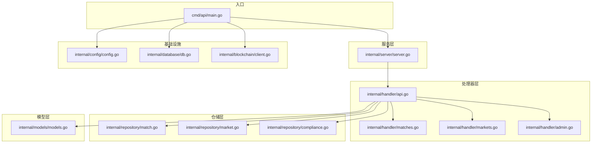
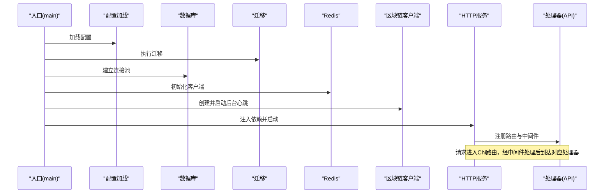
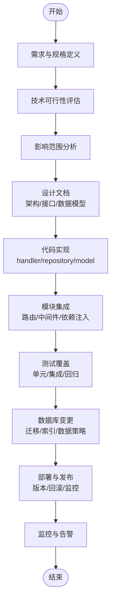
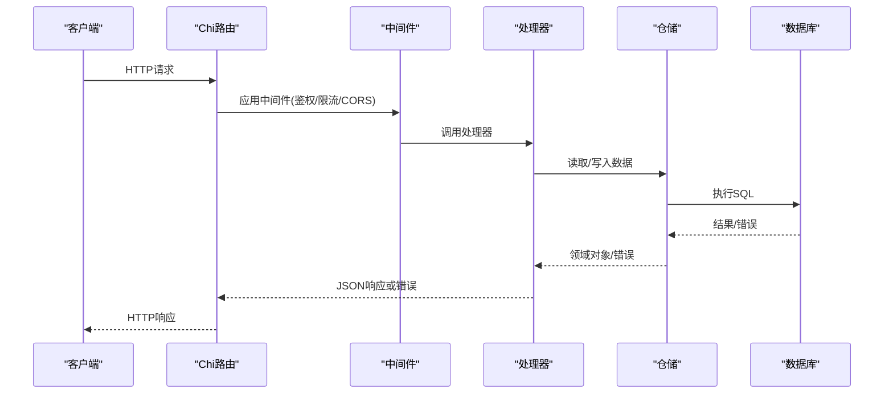
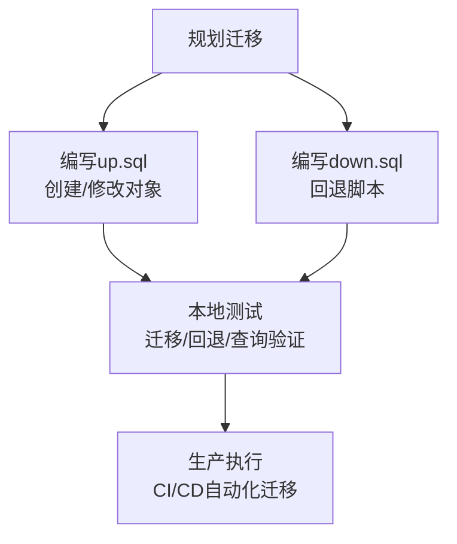
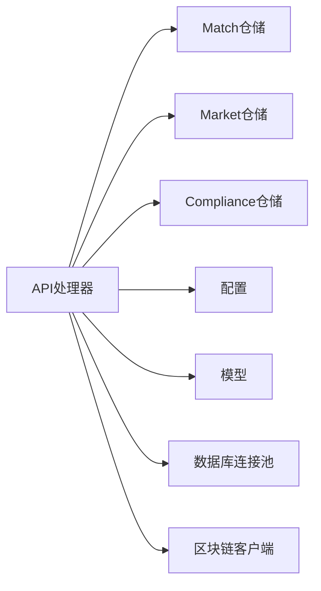

# 新功能开发

<cite>
**本文引用的文件**
- [cmd/api/main.go](file://cmd/api/main.go)
- [internal/server/server.go](file://internal/server/server.go)
- [internal/handler/api.go](file://internal/handler/api.go)
- [internal/handler/matches.go](file://internal/handler/matches.go)
- [internal/handler/markets.go](file://internal/handler/markets.go)
- [internal/handler/admin.go](file://internal/handler/admin.go)
- [internal/models/models.go](file://internal/models/models.go)
- [internal/repository/match.go](file://internal/repository/match.go)
- [internal/repository/market.go](file://internal/repository/market.go)
- [internal/repository/compliance.go](file://internal/repository/compliance.go)
- [internal/config/config.go](file://internal/config/config.go)
- [internal/database/db.go](file://internal/database/db.go)
- [internal/blockchain/client.go](file://internal/blockchain/client.go)
- [migrations/000001_init.up.sql](file://migrations/000001_init.up.sql)
- [migrations/000002_phase1.up.sql](file://migrations/000002_phase1.up.sql)
- [go.mod](file://go.mod)
</cite>

## 目录
1. [引言](#引言)
2. [项目结构](#项目结构)
3. [核心组件](#核心组件)
4. [架构总览](#架构总览)
5. [详细组件分析](#详细组件分析)
6. [依赖关系分析](#依赖关系分析)
7. [性能考虑](#性能考虑)
8. [故障排查指南](#故障排查指南)
9. [结论](#结论)
10. [附录](#附录)

## 引言
本指南面向在 PredictionDIDSimple 后端系统上新增功能的开发流程，目标是帮助团队以一致、可维护的方式完成从需求到上线的全生命周期工作。内容覆盖需求分析、设计文档、开发实施、API 设计、数据库变更、测试与发布等环节，并结合现有代码库的架构与实现模式，给出可操作的步骤与最佳实践。

## 项目结构
后端采用分层与职责分离的组织方式：
- 入口程序：各子命令入口位于 cmd 目录，统一初始化配置、数据库、索引器、链客户端与服务。
- 服务层：基于 Chi 路由与中间件，组装业务处理器。
- 处理器层：按领域拆分（如 matches、markets、admin 等），负责路由注册与请求处理。
- 仓储层：封装数据库访问，提供领域对象的持久化能力。
- 模型层：定义领域数据结构。
- 配置与基础设施：配置加载、数据库连接池与迁移、区块链客户端、Redis 客户端等。

图表来源
- [cmd/api/main.go](file://cmd/api/main.go#L24-L118)
- [internal/server/server.go](file://internal/server/server.go#L35-L85)
- [internal/handler/api.go](file://internal/handler/api.go#L30-L61)
- [internal/handler/matches.go](file://internal/handler/matches.go#L7-L38)
- [internal/handler/markets.go](file://internal/handler/markets.go#L9-L50)
- [internal/handler/admin.go](file://internal/handler/admin.go#L10-L89)
- [internal/repository/match.go](file://internal/repository/match.go#L13-L104)
- [internal/repository/market.go](file://internal/repository/market.go#L13-L246)
- [internal/repository/compliance.go](file://internal/repository/compliance.go#L9-L29)
- [internal/models/models.go](file://internal/models/models.go#L5-L57)
- [internal/config/config.go](file://internal/config/config.go#L45-L96)
- [internal/database/db.go](file://internal/database/db.go#L14-L42)
- [internal/blockchain/client.go](file://internal/blockchain/client.go#L12-L79)

章节来源
- [cmd/api/main.go](file://cmd/api/main.go#L24-L118)
- [internal/server/server.go](file://internal/server/server.go#L35-L85)

## 核心组件
- 配置加载：集中于配置结构体与环境变量解析，支持运行时开关（如限流、合规、地理封锁）。
- 数据库与迁移：通过连接池与迁移工具保证数据库演进一致性。
- 区块链客户端：提供链健康检查与链 ID 校验，保障上游链服务可用性。
- 服务路由：统一注册健康检查、公开接口与受保护接口，注入依赖并启用 CORS、限流、日志等中间件。
- 业务处理器：按领域划分，提供匹配、市场、统计、合规、认证、管理员等接口。
- 仓储层：封装 SQL 查询、条件拼接、冲突处理与扫描逻辑，确保领域对象映射正确。

章节来源
- [internal/config/config.go](file://internal/config/config.go#L10-L43)
- [internal/config/config.go](file://internal/config/config.go#L45-L96)
- [internal/database/db.go](file://internal/database/db.go#L14-L42)
- [internal/blockchain/client.go](file://internal/blockchain/client.go#L12-L79)
- [internal/server/server.go](file://internal/server/server.go#L35-L85)
- [internal/handler/api.go](file://internal/handler/api.go#L16-L28)
- [internal/repository/match.go](file://internal/repository/match.go#L13-L104)
- [internal/repository/market.go](file://internal/repository/market.go#L13-L246)
- [internal/repository/compliance.go](file://internal/repository/compliance.go#L9-L29)

## 架构总览
下图展示启动流程、依赖注入与关键交互：

图表来源
- [cmd/api/main.go](file://cmd/api/main.go#L24-L118)
- [internal/server/server.go](file://internal/server/server.go#L35-L85)
- [internal/handler/api.go](file://internal/handler/api.go#L30-L61)
- [internal/database/db.go](file://internal/database/db.go#L28-L42)
- [internal/blockchain/client.go](file://internal/blockchain/client.go#L26-L79)

## 详细组件分析

### 需求分析方法
- 功能规格定义
  - 明确用户角色与权限边界（公开、认证、管理员）。
  - 描述输入输出、约束条件与边界场景（如地理限制、凭证要求）。
  - 识别与现有模型的关系（如市场与比赛、位置与市场）。
- 技术可行性评估
  - 评估数据库变更是否需要迁移与索引优化。
  - 评估链交互是否需要新的 Oracle 或链上读写。
  - 评估第三方依赖（Redis、CORS、限流）是否满足新功能需求。
- 影响范围分析
  - 分析对现有路由、中间件、鉴权与限流的影响。
  - 评估对索引器、事件流与指标的影响。

### 设计文档编写
- 架构设计
  - 保持分层与职责分离，新增功能尽量复用现有中间件与依赖注入。
  - 明确新增路由命名空间与权限控制策略。
- 接口设计
  - 参考现有 REST 风格与错误响应格式，统一状态码与错误体结构。
  - 对敏感操作使用管理员密钥或 JWT 中间件保护。
- 数据模型设计规范
  - 在 models 层定义结构体，仓储层负责映射与查询。
  - 字段命名与类型与数据库表保持一致，必要时在扫描函数中做空值处理。

章节来源
- [internal/handler/api.go](file://internal/handler/api.go#L30-L61)
- [internal/handler/api.go](file://internal/handler/api.go#L63-L87)
- [internal/models/models.go](file://internal/models/models.go#L5-L57)

### 开发实施步骤
- 代码结构设计
  - 在 internal/handler 下新增处理器文件，参考 matches.go、markets.go 的模式。
  - 在 internal/repository 中新增仓储方法，遵循现有查询与扫描模式。
  - 在 internal/models 中新增或扩展领域模型。
- 模块集成
  - 在 internal/server/server.go 的依赖注入处注册新仓储与处理器。
  - 在 internal/handler/api.go 的 RegisterRoutes 中注册新路由组与中间件。
- 依赖管理
  - 在 go.mod 中引入必要的外部依赖（如新的加密库、HTTP 客户端等）。
  - 通过 cmd/api/main.go 统一初始化与注入。

章节来源
- [internal/server/server.go](file://internal/server/server.go#L35-L85)
- [internal/handler/api.go](file://internal/handler/api.go#L30-L61)
- [go.mod](file://go.mod#L5-L14)

### API 设计原则
- RESTful 设计
  - 使用名词复数表示资源集合，路径参数用于定位单个资源。
  - 使用标准 HTTP 方法表达语义（GET/POST/PUT/DELETE/OPTIONS）。
- 参数验证
  - 对路径与查询参数进行解析与默认值处理，错误时返回 400。
  - 对 JSON 请求体进行解码校验，非法格式返回 400。
- 错误处理标准
  - 成功返回 2xx；服务器内部错误返回 500；资源不存在返回 404。
  - 统一错误响应体结构，包含 error 字段。

图表来源
- [internal/server/server.go](file://internal/server/server.go#L35-L85)
- [internal/handler/api.go](file://internal/handler/api.go#L30-L61)
- [internal/handler/matches.go](file://internal/handler/matches.go#L7-L38)
- [internal/handler/markets.go](file://internal/handler/markets.go#L9-L50)

章节来源
- [internal/handler/api.go](file://internal/handler/api.go#L63-L87)
- [internal/handler/matches.go](file://internal/handler/matches.go#L7-L38)
- [internal/handler/markets.go](file://internal/handler/markets.go#L9-L50)

### 数据库变更管理
- Schema 设计
  - 新增表或字段需与领域模型保持一致，优先考虑唯一性、外键与索引。
  - 参考现有表结构（如 matches、markets、positions、indexer_state）。
- 迁移脚本编写
  - 在 migrations 目录新增 up/down 脚本，遵循递增编号顺序。
  - up 脚本创建/修改对象，down 脚本回退至前一版本。
- 数据迁移策略
  - 小步快跑，先添加列/索引再填充数据。
  - 对大表操作建议分批执行并加事务保护。
  - 在 cmd/api/main.go 中自动执行迁移，确保启动即最新。

图表来源
- [migrations/000001_init.up.sql](file://migrations/000001_init.up.sql#L1-L10)
- [migrations/000002_phase1.up.sql](file://migrations/000002_phase1.up.sql#L1-L76)
- [internal/database/db.go](file://internal/database/db.go#L28-L42)
- [cmd/api/main.go](file://cmd/api/main.go#L33-L40)

章节来源
- [internal/database/db.go](file://internal/database/db.go#L28-L42)
- [cmd/api/main.go](file://cmd/api/main.go#L33-L40)
- [migrations/000002_phase1.up.sql](file://migrations/000002_phase1.up.sql#L1-L76)

### 测试覆盖要求
- 单元测试
  - 为处理器方法编写请求/响应与错误分支测试。
  - 为仓储方法编写 SQL 行为与边界条件测试。
- 集成测试
  - 启动完整服务栈（含数据库、Redis、链客户端），验证端到端流程。
- 回归测试策略
  - 对关键路由与数据流建立自动化回归集，确保变更不破坏既有功能。

章节来源
- [internal/handler/matches.go](file://internal/handler/matches.go#L7-L38)
- [internal/handler/markets.go](file://internal/handler/markets.go#L9-L50)
- [internal/repository/match.go](file://internal/repository/match.go#L21-L104)
- [internal/repository/market.go](file://internal/repository/market.go#L21-L246)

### 部署与发布流程
- 版本管理
  - 使用迁移版本号管理数据库演进，确保多环境一致。
- 回滚策略
  - down 迁移与 down 脚本用于快速回滚；服务层面可通过镜像版本回退。
- 监控配置
  - Prometheus 指标端点与健康检查端点已内置，建议结合告警 webhook 与日志采集。

章节来源
- [internal/handler/api.go](file://internal/handler/api.go#L30-L61)
- [internal/config/config.go](file://internal/config/config.go#L45-L96)
- [internal/alert/notifier.go](file://internal/alert/notifier.go)

## 依赖关系分析
- 组件耦合与内聚
  - 处理器依赖仓储与配置，仓储依赖数据库连接池，服务层统一注入依赖。
- 外部依赖与集成点
  - PostgreSQL（数据库）、Redis（缓存/会话）、Ethereum RPC（链交互）、JWT/SIWE（认证）。
- 接口契约
  - 通过接口与依赖注入降低耦合，便于替换与测试。

图表来源
- [internal/handler/api.go](file://internal/handler/api.go#L16-L28)
- [internal/repository/match.go](file://internal/repository/match.go#L13-L19)
- [internal/repository/market.go](file://internal/repository/market.go#L13-L19)
- [internal/repository/compliance.go](file://internal/repository/compliance.go#L9-L15)
- [internal/models/models.go](file://internal/models/models.go#L5-L57)
- [internal/config/config.go](file://internal/config/config.go#L10-L43)
- [internal/database/db.go](file://internal/database/db.go#L14-L20)
- [internal/blockchain/client.go](file://internal/blockchain/client.go#L12-L24)

章节来源
- [internal/handler/api.go](file://internal/handler/api.go#L16-L28)
- [internal/server/server.go](file://internal/server/server.go#L35-L85)
- [go.mod](file://go.mod#L5-L14)

## 性能考虑
- 数据库
  - 对高频查询字段建立索引，避免 N+1 查询，合理使用 LIMIT/OFFSET。
- 缓存
  - 利用 Redis 缓存热点数据与会话信息，注意过期策略与一致性。
- 网络与链交互
  - 控制请求超时与重试，避免阻塞主请求线程。
- 限流与熔断
  - 启用速率限制与健康检查，防止雪崩效应。

## 故障排查指南
- 配置问题
  - 检查必需环境变量（如 DATABASE_URL、CHAIN_ID、MARKET_FACTORY_ADDRESS 等）。
- 数据库问题
  - 确认迁移是否成功执行，连接池是否可达。
- 链服务问题
  - 关注区块链客户端的心跳与链 ID 校验日志。
- 认证与权限
  - 核对 JWT 密钥、SIWE 域名与管理员密钥配置。

章节来源
- [internal/config/config.go](file://internal/config/config.go#L45-L96)
- [internal/database/db.go](file://internal/database/db.go#L14-L26)
- [internal/blockchain/client.go](file://internal/blockchain/client.go#L26-L79)
- [internal/handler/api.go](file://internal/handler/api.go#L46-L60)

## 结论
通过遵循本文档提供的流程与最佳实践，可以在 PredictionDIDSimple 上高效、安全地交付新功能。重点在于清晰的需求与设计、严格的测试与迁移管理、稳健的部署与监控，以及对现有架构与依赖的充分尊重与复用。

## 附录
- 新增路由示例（概念）
  - 在 internal/handler/api.go 的 RegisterRoutes 中新增组与中间件。
  - 在 internal/server/server.go 中注入新仓储与处理器。
- 数据模型与仓储模板
  - 参考 models.go、match.go、market.go 的结构与扫描模式。
- 迁移脚本模板
  - 参考 000001_init.up.sql、000002_phase1.up.sql 的命名与结构。