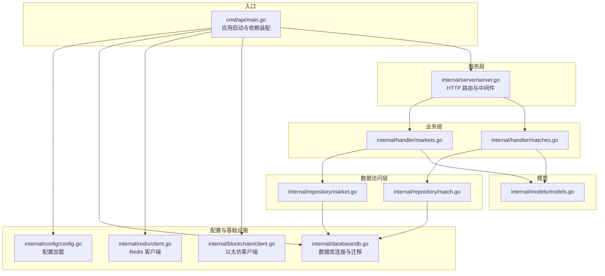
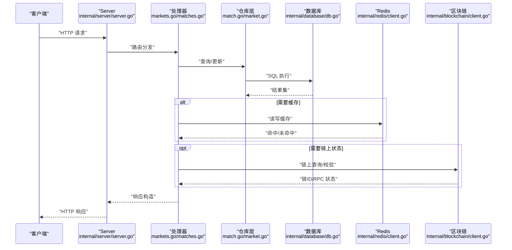
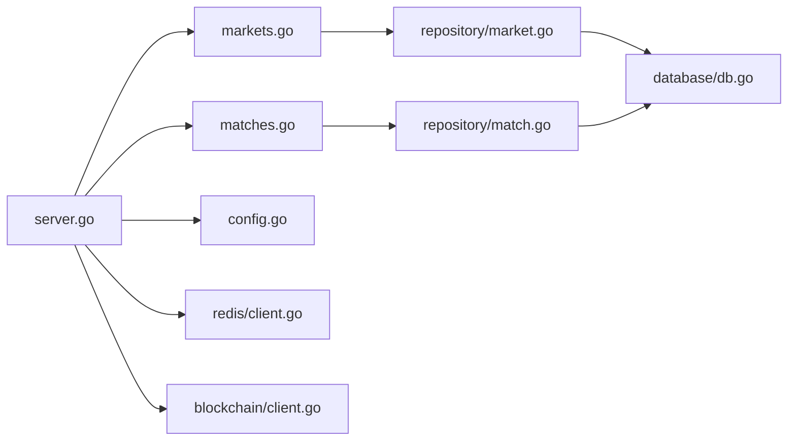

# 测试策略

<cite>
**本文引用的文件**
- [cmd/api/main.go](file://cmd/api/main.go)
- [internal/config/config.go](file://internal/config/config.go)
- [internal/config/config_test.go](file://internal/config/config_test.go)
- [internal/database/db.go](file://internal/database/db.go)
- [internal/server/server.go](file://internal/server/server.go)
- [internal/blockchain/client.go](file://internal/blockchain/client.go)
- [internal/redis/client.go](file://internal/redis/client.go)
- [internal/models/models.go](file://internal/models/models.go)
- [internal/repository/match.go](file://internal/repository/match.go)
- [internal/repository/market.go](file://internal/repository/market.go)
- [internal/handler/markets.go](file://internal/handler/markets.go)
- [internal/handler/matches.go](file://internal/handler/matches.go)
- [internal/handler/health_test.go](file://internal/handler/health_test.go)
- [go.mod](file://go.mod)
</cite>

## 目录
1. 引言
2. 项目结构
3. 核心组件
4. 架构总览
5. 详细组件分析
6. 依赖分析
7. 性能考虑
8. 故障排查指南
9. 结论
10. 附录

## 引言
本测试策略文档面向 PredictionDIDSimple 后端系统，围绕“测试金字塔”（单元测试、集成测试、端到端测试）构建分层测试体系，覆盖单元测试编写规范、Mock 使用与断言策略；集成测试覆盖数据库、API 与区块链集成；提供测试数据管理方案（环境配置、数据清理、模拟数据准备）；并给出性能与压力测试指南以及持续集成测试流程与覆盖率要求建议。

## 项目结构
后端采用按职责分层的模块化组织：入口程序负责初始化配置、数据库迁移、Redis 连接、链客户端与索引器/预言机等子系统；服务层通过路由注册业务处理器；处理器依赖仓库层访问数据库；模型定义数据结构；区块链与 Redis 客户端提供外部依赖抽象。

图表来源
- [cmd/api/main.go](file://cmd/api/main.go#L24-L118)
- [internal/config/config.go](file://internal/config/config.go#L45-L97)
- [internal/database/db.go](file://internal/database/db.go#L14-L42)
- [internal/redis/client.go](file://internal/redis/client.go#L10-L22)
- [internal/blockchain/client.go](file://internal/blockchain/client.go#L19-L79)
- [internal/server/server.go](file://internal/server/server.go#L35-L85)
- [internal/handler/markets.go](file://internal/handler/markets.go#L9-L50)
- [internal/handler/matches.go](file://internal/handler/matches.go#L7-L38)
- [internal/repository/match.go](file://internal/repository/match.go#L17-L103)
- [internal/repository/market.go](file://internal/repository/market.go#L17-L246)
- [internal/models/models.go](file://internal/models/models.go#L5-L57)

章节来源
- [cmd/api/main.go](file://cmd/api/main.go#L24-L118)
- [internal/server/server.go](file://internal/server/server.go#L35-L85)

## 核心组件
- 配置加载：集中于配置结构体与加载函数，支持默认值与环境变量注入，包含数据库、Redis、以太坊 RPC、工厂地址、Oracle 参数、限流与合规开关等。
- 数据库：提供连接池创建、健康检查与迁移执行能力。
- 服务器：组装路由、中间件（限流、地理阻断、CORS）、注册健康与业务处理器。
- 业务处理器：市场与比赛列表/详情接口，封装查询与鉴权门控逻辑。
- 仓库层：对数据库进行增删改查操作，封装 SQL 查询与扫描。
- 区块链与 Redis：作为外部依赖，提供可用性检查与后台心跳。

章节来源
- [internal/config/config.go](file://internal/config/config.go#L10-L43)
- [internal/config/config.go](file://internal/config/config.go#L45-L97)
- [internal/database/db.go](file://internal/database/db.go#L14-L42)
- [internal/server/server.go](file://internal/server/server.go#L35-L85)
- [internal/handler/markets.go](file://internal/handler/markets.go#L9-L50)
- [internal/handler/matches.go](file://internal/handler/matches.go#L7-L38)
- [internal/repository/match.go](file://internal/repository/match.go#L21-L103)
- [internal/repository/market.go](file://internal/repository/market.go#L21-L246)
- [internal/blockchain/client.go](file://internal/blockchain/client.go#L26-L79)
- [internal/redis/client.go](file://internal/redis/client.go#L18-L22)

## 架构总览
下图展示从请求进入 HTTP 层到数据访问层的整体调用链路，以及外部依赖（数据库、Redis、区块链）的交互。

图表来源
- [internal/server/server.go](file://internal/server/server.go#L35-L85)
- [internal/handler/markets.go](file://internal/handler/markets.go#L9-L50)
- [internal/handler/matches.go](file://internal/handler/matches.go#L7-L38)
- [internal/repository/match.go](file://internal/repository/match.go#L21-L103)
- [internal/repository/market.go](file://internal/repository/market.go#L21-L246)
- [internal/database/db.go](file://internal/database/db.go#L14-L42)
- [internal/redis/client.go](file://internal/redis/client.go#L10-L22)
- [internal/blockchain/client.go](file://internal/blockchain/client.go#L26-L79)

## 详细组件分析

### 单元测试策略
- 测试金字塔底层：以“单元测试”为主，聚焦纯函数、结构体方法与小范围逻辑，确保快速反馈与高可维护性。
- 编写指南
  - 测试用例设计：覆盖正常路径、边界条件、异常分支；对输入参数、返回值与副作用进行断言。
  - Mock 对象使用：对外部依赖（如数据库、Redis、区块链）使用接口抽象与替身对象，隔离被测单元。
  - 断言策略：优先断言关键输出与状态变化；对错误路径断言错误类型或消息片段；对副作用断言外部调用次数与参数。
- 示例参考
  - 配置加载：验证必填项缺失时返回错误、默认值注入、整型解析失败回退等。
  - 健康检查：验证健康与就绪端点返回码与响应字段。
  - 处理器：对业务处理器的鉴权门控、查询参数解析与错误处理进行断言。
  - 仓库层：对 SQL 条件拼接、参数绑定、扫描行为进行断言。

章节来源
- [internal/config/config_test.go](file://internal/config/config_test.go#L8-L46)
- [internal/handler/health_test.go](file://internal/handler/health_test.go#L10-L37)

### 集成测试策略
- 数据库测试
  - 目标：验证仓库层 SQL 的正确性、事务一致性与约束行为。
  - 方法：使用独立测试数据库实例，迁移测试前的 schema，插入最小化测试数据，执行 CRUD 操作并断言结果。
  - 关注点：条件查询（status、limit/offset）、冲突写入（ON CONFLICT）、数值类型转换、空值处理。
- API 测试
  - 目标：验证路由、中间件、鉴权门控与响应格式。
  - 方法：启动测试服务器，使用 HTTP 客户端发起请求，断言状态码、响应体结构与关键字段。
  - 关注点：限流、CORS、地理阻断、认证头、错误处理。
- 区块链集成测试
  - 目标：验证链上客户端的心跳、链 ID 校验与 RPC 可达性。
  - 方法：在测试环境中提供可用的本地节点或模拟节点 URL，断言链 ID 一致与 RPC OK 状态。
  - 关注点：超时控制、错误日志、降级行为。

章节来源
- [internal/database/db.go](file://internal/database/db.go#L28-L42)
- [internal/server/server.go](file://internal/server/server.go#L35-L85)
- [internal/blockchain/client.go](file://internal/blockchain/client.go#L26-L79)

### 端到端测试策略
- 目标：从用户视角验证完整业务流程，如“列出比赛—查看市场—鉴权门控—查询结果”。
- 方法：启动完整服务（含数据库、Redis、可选本地链），通过真实 HTTP 客户端驱动，断言端到端行为。
- 关注点：跨模块协作、中间件顺序、错误传播、响应一致性。

章节来源
- [cmd/api/main.go](file://cmd/api/main.go#L24-L118)
- [internal/server/server.go](file://internal/server/server.go#L35-L85)

### 测试数据管理
- 环境配置
  - 使用环境变量注入配置，便于在不同环境（开发、测试、CI）切换数据库、Redis、RPC 地址与功能开关。
- 数据清理
  - 单测：每个测试结束后清理临时表或回滚事务；集成测试：在测试套件前后执行迁移回滚与重置。
- 模拟数据准备
  - 使用最小化样例数据（如比赛、市场、位置）支撑场景覆盖；必要时使用 JSON 模拟数据源（如匹配数据文件）辅助初始化。

章节来源
- [internal/config/config.go](file://internal/config/config.go#L45-L97)
- [internal/models/models.go](file://internal/models/models.go#L5-L57)

### 性能测试与压力测试
- 负载测试
  - 使用工具对关键接口（如列出市场、比赛详情）施加逐步增长的并发请求，观察响应时间、吞吐量与错误率。
- 并发测试
  - 验证限流中间件、数据库连接池与 Redis 客户端的并发安全与稳定性。
- 资源使用监控
  - 监控 CPU、内存、数据库连接数、Redis 延迟与链 RPC 调用量，定位瓶颈。

章节来源
- [internal/server/server.go](file://internal/server/server.go#L41-L53)
- [internal/database/db.go](file://internal/database/db.go#L14-L26)
- [internal/redis/client.go](file://internal/redis/client.go#L18-L22)
- [internal/blockchain/client.go](file://internal/blockchain/client.go#L26-L79)

### 持续集成测试流程
- 自动化测试管道
  - 触发：提交 PR 或合并主干；步骤：安装依赖、运行单元测试、运行集成测试、运行端到端测试、生成覆盖率报告。
- 测试覆盖率要求
  - 建议：核心包（仓库层、配置、服务器）达到中位数以上；关键业务路径（处理器、鉴权门控）100% 覆盖。
- 工具与依赖
  - Go 版本与依赖见模块清单；数据库与 Redis 通过容器或服务提供；链客户端可使用本地节点或模拟。

章节来源
- [go.mod](file://go.mod#L1-L56)

## 依赖分析
- 组件耦合与内聚
  - 服务器与处理器通过依赖注入解耦；仓库层与数据库耦合度高但职责单一；区块链与 Redis 作为外部依赖通过客户端抽象隔离。
- 外部依赖
  - 数据库：PostgreSQL；迁移：golang-migrate；连接池：pgx/v5；Redis：go-redis/v9；以太坊：go-ethereum。
- 接口契约
  - 仓库层方法签名明确输入上下文与查询参数，返回标准错误；处理器统一错误与 JSON 响应格式。

图表来源
- [internal/server/server.go](file://internal/server/server.go#L35-L85)
- [internal/handler/markets.go](file://internal/handler/markets.go#L9-L50)
- [internal/handler/matches.go](file://internal/handler/matches.go#L7-L38)
- [internal/repository/market.go](file://internal/repository/market.go#L17-L246)
- [internal/repository/match.go](file://internal/repository/match.go#L17-L103)
- [internal/database/db.go](file://internal/database/db.go#L14-L42)
- [internal/config/config.go](file://internal/config/config.go#L45-L97)
- [internal/redis/client.go](file://internal/redis/client.go#L10-L22)
- [internal/blockchain/client.go](file://internal/blockchain/client.go#L19-L79)

章节来源
- [internal/server/server.go](file://internal/server/server.go#L35-L85)
- [internal/handler/markets.go](file://internal/handler/markets.go#L9-L50)
- [internal/handler/matches.go](file://internal/handler/matches.go#L7-L38)
- [internal/repository/market.go](file://internal/repository/market.go#L17-L246)
- [internal/repository/match.go](file://internal/repository/match.go#L17-L103)
- [internal/database/db.go](file://internal/database/db.go#L14-L42)
- [internal/config/config.go](file://internal/config/config.go#L45-L97)
- [internal/redis/client.go](file://internal/redis/client.go#L10-L22)
- [internal/blockchain/client.go](file://internal/blockchain/client.go#L19-L79)

## 性能考虑
- 限流与恢复：中间件已内置限流与 Recoverer，建议在高并发场景下结合数据库连接池大小与 Redis 客户端参数调优。
- 查询优化：仓库层查询带条件与分页，建议对常用过滤列建立索引；避免 N+1 查询，复用扫描逻辑。
- 链上交互：后台心跳与链 ID 校验需设置合理超时，避免阻塞主流程。

章节来源
- [internal/server/server.go](file://internal/server/server.go#L41-L53)
- [internal/repository/market.go](file://internal/repository/market.go#L21-L65)
- [internal/repository/match.go](file://internal/repository/match.go#L21-L54)
- [internal/blockchain/client.go](file://internal/blockchain/client.go#L42-L70)

## 故障排查指南
- 健康检查
  - 就绪探针在数据库为空时也应返回成功，便于容器编排；若失败，检查数据库连接与迁移是否完成。
- 配置问题
  - 必填项缺失会触发错误；确认环境变量注入与默认值回退逻辑。
- 区块链连接
  - RPC 不可达或链 ID 不一致会导致标记为不可用；检查 RPC URL 与期望链 ID。
- Redis 连接
  - Ping 失败会记录警告并降级；检查 Redis 地址与网络连通性。

章节来源
- [internal/handler/health_test.go](file://internal/handler/health_test.go#L28-L37)
- [internal/config/config_test.go](file://internal/config/config_test.go#L8-L14)
- [internal/blockchain/client.go](file://internal/blockchain/client.go#L42-L70)
- [internal/redis/client.go](file://internal/redis/client.go#L18-L22)

## 结论
通过分层测试策略与完善的测试数据管理，PredictionDIDSimple 可在快速迭代的同时保证质量与稳定性。建议在 CI 中强制执行单元与集成测试，并逐步引入端到端测试与性能压测，持续提升系统可靠性与可观测性。

## 附录
- 测试金字塔层级
  - 单元测试：结构体方法、纯函数、小范围逻辑。
  - 集成测试：数据库、API、区块链集成。
  - 端到端测试：完整业务流程与用户体验验证。
- 覆盖率目标建议
  - 核心业务与关键路径 100%；其他路径至少 80%。