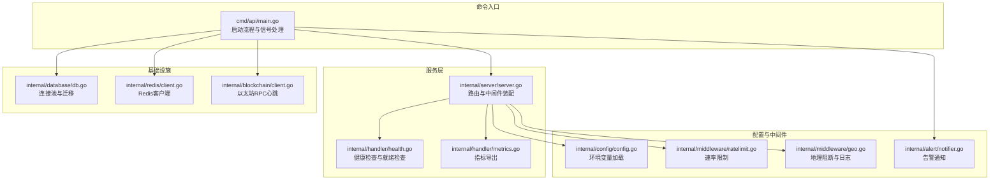
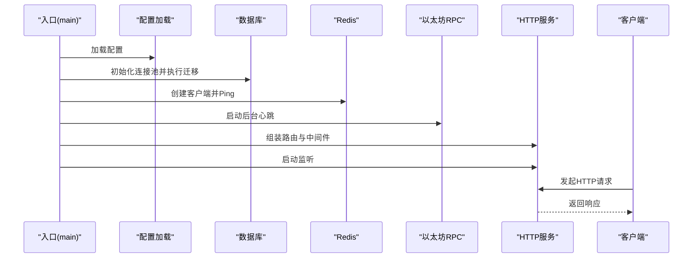
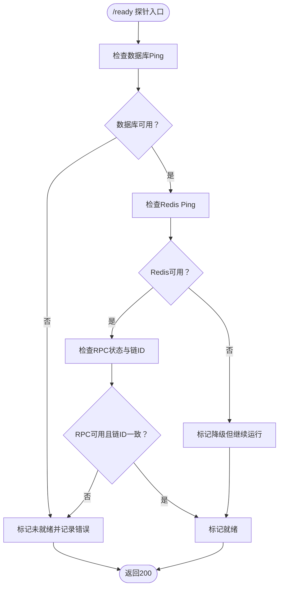
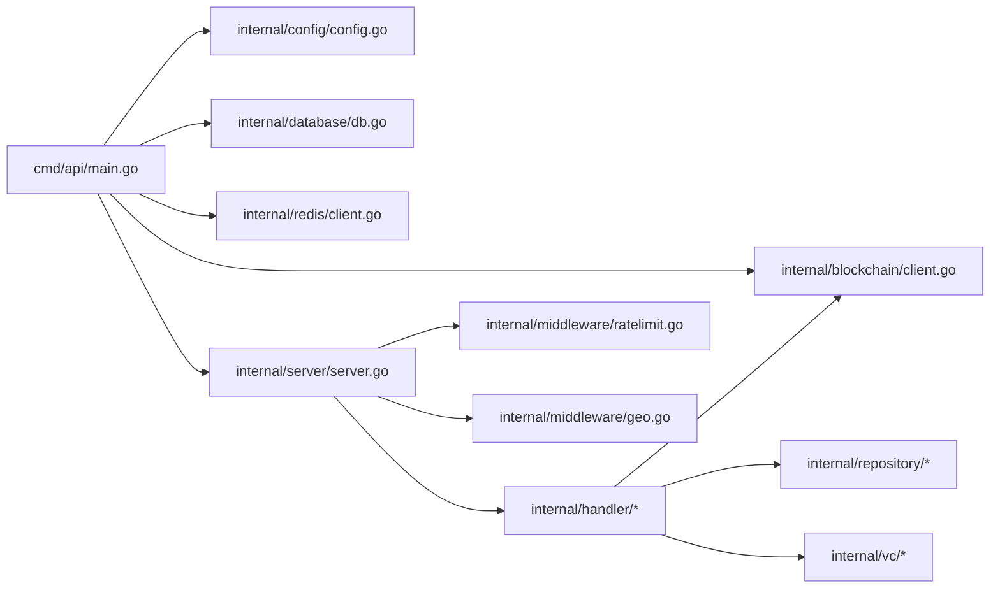

# 调试技巧

<cite>
**本文引用的文件**
- [cmd/api/main.go](file://cmd/api/main.go)
- [internal/server/server.go](file://internal/server/server.go)
- [internal/config/config.go](file://internal/config/config.go)
- [internal/handler/health.go](file://internal/handler/health.go)
- [internal/handler/metrics.go](file://internal/handler/metrics.go)
- [internal/middleware/ratelimit.go](file://internal/middleware/ratelimit.go)
- [internal/middleware/geo.go](file://internal/middleware/geo.go)
- [internal/alert/notifier.go](file://internal/alert/notifier.go)
- [internal/database/db.go](file://internal/database/db.go)
- [internal/redis/client.go](file://internal/redis/client.go)
- [internal/blockchain/client.go](file://internal/blockchain/client.go)
- [internal/blockchain/oracle_client.go](file://internal/blockchain/oracle_client.go)
- [internal/blockchain/erc20.go](file://internal/blockchain/erc20.go)
- [go.mod](file://go.mod)
</cite>

## 目录
1. [简介](#简介)
2. [项目结构](#项目结构)
3. [核心组件](#核心组件)
4. [架构总览](#架构总览)
5. [详细组件分析](#详细组件分析)
6. [依赖关系分析](#依赖关系分析)
7. [性能考虑](#性能考虑)
8. [故障排查指南](#故障排查指南)
9. [结论](#结论)
10. [附录](#附录)

## 简介
本指南面向PredictionDIDSimple后端的调试与运维场景，聚焦以下目标：
- 使用Go调试工具（Delve调试器、pprof性能分析、race detector并发检测）进行问题定位与性能优化
- 基于现有日志与健康检查机制的日志分析方法，包括日志级别设置、结构化日志格式与关键指标监控
- 错误追踪、堆栈分析与根因分析技术在实际代码中的应用
- 分布式系统调试：多服务协调、网络问题排查与状态同步问题诊断
- 性能瓶颈识别：CPU使用率分析、内存泄漏检测与数据库查询优化
- 常见问题解决方案：配置错误、依赖冲突与运行时异常的快速修复

## 项目结构
后端采用命令入口（cmd/*）+ 内部模块（internal/*）的分层组织方式。API入口负责初始化配置、数据库、Redis、区块链客户端与索引器，并启动HTTP服务；内部模块按职责划分（配置、服务器、处理器、中间件、数据库、Redis、区块链、告警等），便于独立调试与扩展。

图表来源
- [cmd/api/main.go](file://cmd/api/main.go#L24-L117)
- [internal/server/server.go](file://internal/server/server.go#L35-L84)
- [internal/handler/health.go](file://internal/handler/health.go#L17-L66)
- [internal/handler/metrics.go](file://internal/handler/metrics.go#L8-L29)
- [internal/middleware/ratelimit.go](file://internal/middleware/ratelimit.go#L36-L55)
- [internal/middleware/geo.go](file://internal/middleware/geo.go#L10-L30)
- [internal/config/config.go](file://internal/config/config.go#L45-L96)
- [internal/database/db.go](file://internal/database/db.go#L14-L42)
- [internal/redis/client.go](file://internal/redis/client.go#L10-L22)
- [internal/blockchain/client.go](file://internal/blockchain/client.go#L26-L78)
- [internal/alert/notifier.go](file://internal/alert/notifier.go#L16-L34)

章节来源
- [cmd/api/main.go](file://cmd/api/main.go#L24-L117)
- [internal/server/server.go](file://internal/server/server.go#L35-L84)
- [internal/config/config.go](file://internal/config/config.go#L45-L96)

## 核心组件
- 配置加载：集中从环境变量读取参数，包含数据库、Redis、以太坊RPC、链ID、索引器轮询间隔、速率限制、合规开关等。错误处理对缺失或非法值给出明确提示，便于快速定位配置问题。
- 服务器与路由：基于Chi框架装配中间件（请求ID、真实IP、日志、恢复器、CORS、限流、地理阻断），注册健康检查、就绪检查、指标导出与业务API路由。
- 健康检查：对数据库、Redis、以太坊RPC进行连通性与状态校验，返回结构化结果，支持就绪探针用于容器编排。
- 指标导出：导出Oracle作业状态分布等关键指标，便于Prometheus抓取。
- 中间件：速率限制与地理阻断，前者通过内存计数窗口实现，后者基于请求头识别国家码并记录访问日志。
- 基础设施：数据库连接池与迁移、Redis客户端、以太坊RPC心跳（后台定时探测链ID一致性）。
- 告警：通过Webhook发送告警事件，日志中输出告警内容与错误。

章节来源
- [internal/config/config.go](file://internal/config/config.go#L45-L96)
- [internal/server/server.go](file://internal/server/server.go#L35-L84)
- [internal/handler/health.go](file://internal/handler/health.go#L24-L66)
- [internal/handler/metrics.go](file://internal/handler/metrics.go#L8-L29)
- [internal/middleware/ratelimit.go](file://internal/middleware/ratelimit.go#L36-L55)
- [internal/middleware/geo.go](file://internal/middleware/geo.go#L10-L30)
- [internal/database/db.go](file://internal/database/db.go#L14-L42)
- [internal/redis/client.go](file://internal/redis/client.go#L10-L22)
- [internal/blockchain/client.go](file://internal/blockchain/client.go#L26-L78)
- [internal/alert/notifier.go](file://internal/alert/notifier.go#L23-L34)

## 架构总览
下图展示启动到请求处理的关键路径，以及与外部系统的交互点（数据库、Redis、以太坊RPC）。

图表来源
- [cmd/api/main.go](file://cmd/api/main.go#L24-L117)
- [internal/server/server.go](file://internal/server/server.go#L35-L84)
- [internal/database/db.go](file://internal/database/db.go#L28-L42)
- [internal/redis/client.go](file://internal/redis/client.go#L10-L22)
- [internal/blockchain/client.go](file://internal/blockchain/client.go#L26-L78)

## 详细组件分析

### 配置加载与调试要点
- 关键点：环境变量缺失或类型不匹配会直接导致启动失败，便于早期发现配置错误。
- 调试建议：
  - 使用最小化配置集验证启动流程，逐步增加外部依赖（数据库、Redis、RPC）。
  - 对整数型字段（如链ID、轮询秒数）添加边界检查与默认值说明。
  - 将敏感配置（私钥、密钥）放入只读环境，避免硬编码。

章节来源
- [internal/config/config.go](file://internal/config/config.go#L45-L96)

### 服务器与中间件调试
- 关键点：内置日志中间件可捕获请求与错误；Recoverer保证异常不中断服务；CORS允许本地前端开发；限流与地理阻断对线上流量治理至关重要。
- 调试建议：
  - 在开发环境开启更详细的日志级别，生产环境保持默认即可。
  - 通过/ready接口观察依赖可用性，结合/health确认整体状态。
  - 临时关闭限流或扩大窗口进行压测，再恢复生产阈值。

章节来源
- [internal/server/server.go](file://internal/server/server.go#L35-L84)
- [internal/middleware/ratelimit.go](file://internal/middleware/ratelimit.go#L36-L55)
- [internal/middleware/geo.go](file://internal/middleware/geo.go#L10-L30)

### 健康检查与就绪检查
- 关键点：/health返回基础状态；/ready对数据库、Redis、RPC进行连通性与状态校验，非就绪时返回503。
- 调试建议：
  - 容器编排中先/ready，再对外暴露服务，确保依赖已就绪。
  - 将RPC链ID与期望值比对作为就绪条件之一，避免链ID不一致导致交易异常。

图表来源
- [internal/handler/health.go](file://internal/handler/health.go#L28-L66)
- [internal/blockchain/client.go](file://internal/blockchain/client.go#L72-L78)

章节来源
- [internal/handler/health.go](file://internal/handler/health.go#L24-L66)
- [internal/blockchain/client.go](file://internal/blockchain/client.go#L42-L78)

### 指标导出与监控
- 关键点：/metrics导出Oracle作业状态分布，便于Prometheus抓取与告警。
- 调试建议：
  - 结合/ready与/health状态，定位指标异常是否由依赖不可用引起。
  - 将指标可视化到仪表盘，设置阈值告警（如pending堆积、failed增长）。

章节来源
- [internal/handler/metrics.go](file://internal/handler/metrics.go#L8-L29)

### 数据库与Redis调试
- 关键点：数据库连接池与迁移在启动阶段完成；Redis客户端解析URL并Ping；两者均设置超时，避免阻塞启动。
- 调试建议：
  - 启动失败优先检查URL格式与可达性。
  - 使用PG客户端工具验证迁移脚本与表结构，排查权限与版本不匹配。

章节来源
- [internal/database/db.go](file://internal/database/db.go#L14-L42)
- [internal/redis/client.go](file://internal/redis/client.go#L10-L22)

### 以太坊RPC心跳与交易等待
- 关键点：后台定时Ping RPC，记录链ID；交易等待循环重试并超时控制。
- 调试建议：
  - 观察日志中RPC链ID变化，快速定位链配置错误。
  - 交易等待超时或回滚时，检查区块确认数与网络拥堵情况。

章节来源
- [internal/blockchain/client.go](file://internal/blockchain/client.go#L26-L78)
- [internal/blockchain/oracle_client.go](file://internal/blockchain/oracle_client.go#L139-L156)

### 速率限制与地理阻断
- 关键点：每分钟窗口计数，忽略健康与事件类路径；地理阻断基于请求头国家码判断。
- 调试建议：
  - 通过/ready排除依赖问题后再排查限流阈值。
  - 地理阻断影响区域需在测试环境模拟，避免误伤。

章节来源
- [internal/middleware/ratelimit.go](file://internal/middleware/ratelimit.go#L36-L55)
- [internal/middleware/geo.go](file://internal/middleware/geo.go#L33-L50)

### 告警通知
- 关键点：Webhook发送结构化事件消息，日志记录告警与错误。
- 调试建议：
  - 先在本地验证Webhook可达性，再启用生产告警。
  - 对重复告警进行去重与收敛，避免噪声。

章节来源
- [internal/alert/notifier.go](file://internal/alert/notifier.go#L23-L34)

## 依赖关系分析
- 外部依赖：以太坊客户端、Chi路由、PostgreSQL连接池、Redis客户端、JWT、CORS等。
- 内部耦合：入口模块对配置、数据库、Redis、区块链与服务器有直接依赖；服务器对处理器、中间件、配置有依赖；处理器对仓库与区块链客户端有依赖。

图表来源
- [cmd/api/main.go](file://cmd/api/main.go#L24-L117)
- [internal/server/server.go](file://internal/server/server.go#L35-L84)
- [internal/config/config.go](file://internal/config/config.go#L45-L96)
- [internal/database/db.go](file://internal/database/db.go#L14-L42)
- [internal/redis/client.go](file://internal/redis/client.go#L10-L22)
- [internal/blockchain/client.go](file://internal/blockchain/client.go#L26-L78)

章节来源
- [go.mod](file://go.mod#L5-L14)

## 性能考虑
- CPU使用率分析
  - 使用pprof采集CPU与阻塞分析，定位热点函数与锁竞争。
  - 开发环境启用pprof HTTP端点，生产环境谨慎开启。
- 内存泄漏检测
  - 使用go test -race与go build -race构建竞态检测版本，排查并发写共享变量。
  - 结合pprof heap分析，关注大对象与长生命周期集合。
- 数据库查询优化
  - 通过/ready与/health观察数据库延迟；对慢查询建立索引与分区。
  - 连接池参数（最大空闲、最大活跃、生命周期）根据负载调优。
- Redis优化
  - 监控命中率与过期策略；避免大Key与阻塞命令。
- RPC与网络
  - 合理设置超时与重试；对高频调用引入缓存与批量请求。

## 故障排查指南

### 启动阶段
- 现象：进程立即退出或报错
- 排查步骤：
  - 检查DATABASE_URL是否正确，必要时手动连接验证。
  - 确认REDIS_URL格式与可达性。
  - 核对CHAIN_ID与期望链ID一致，避免链ID不匹配导致交易异常。
  - 查看迁移脚本是否成功执行，必要时手工执行Up。

章节来源
- [cmd/api/main.go](file://cmd/api/main.go#L33-L46)
- [internal/database/db.go](file://internal/database/db.go#L28-L42)
- [internal/redis/client.go](file://internal/redis/client.go#L10-L22)
- [internal/blockchain/client.go](file://internal/blockchain/client.go#L62-L69)

### 运行时异常
- 现象：请求返回500或panic
- 排查步骤：
  - 查看服务器日志中间件输出的请求ID与堆栈信息。
  - 使用Delve附加进程，设置断点定位具体调用链。
  - 对关键路径（数据库事务、Redis操作、RPC调用）增加超时与重试。

章节来源
- [internal/server/server.go](file://internal/server/server.go#L37-L40)

### 依赖不可用
- 现象：/ready返回非2xx或RPC链ID不一致
- 排查步骤：
  - 优先解决数据库与Redis连通性问题。
  - 校验以太坊RPC URL与链ID配置，必要时切换备用节点。
  - 观察后台RPC心跳日志，确认链ID持续更新。

章节来源
- [internal/handler/health.go](file://internal/handler/health.go#L28-L66)
- [internal/blockchain/client.go](file://internal/blockchain/client.go#L42-L78)

### 并发与竞态
- 现象：偶发数据不一致或崩溃
- 排查步骤：
  - 使用go test -race或构建带race的二进制进行回归测试。
  - 对共享资源加锁或改用原子操作与无锁结构。
  - 减少全局状态，使用依赖注入降低耦合。

章节来源
- [internal/middleware/ratelimit.go](file://internal/middleware/ratelimit.go#L10-L34)

### 指标异常
- 现象：/metrics显示pending堆积或failed增长
- 排查步骤：
  - 检查/ready状态，确认依赖可用。
  - 追踪Oracle作业状态流转，定位上游失败原因。
  - 对高频接口增加缓存与限流，避免雪崩。

章节来源
- [internal/handler/metrics.go](file://internal/handler/metrics.go#L8-L29)
- [internal/handler/health.go](file://internal/handler/health.go#L28-L66)

### 日志分析方法
- 日志级别设置：开发环境可提升日志详细度，生产环境保持默认，避免日志风暴。
- 结构化日志：统一输出字段（时间、级别、请求ID、路径、耗时、错误），便于检索与聚合。
- 关键指标监控：结合/health与/ready状态、/metrics指标与告警Webhook，形成闭环。

章节来源
- [internal/server/server.go](file://internal/server/server.go#L37-L40)
- [internal/alert/notifier.go](file://internal/alert/notifier.go#L23-L34)

### 分布式系统调试
- 多服务协调：通过/ready与容器编排顺序启动，确保数据库、Redis、RPC先就绪。
- 网络问题排查：使用curl或grpcurl验证端点可达性，检查防火墙与代理。
- 状态同步：对关键写操作引入幂等与补偿机制，记录变更日志以便回溯。

章节来源
- [internal/handler/health.go](file://internal/handler/health.go#L28-L66)
- [internal/server/server.go](file://internal/server/server.go#L48-L53)

## 结论
通过将配置、服务器、中间件、健康检查、指标导出与基础设施模块化，PredictionDIDSimple具备良好的可观测性与可调试性。结合Delve、pprof与race detector，配合日志与告警体系，可在开发与生产环境中高效定位问题、优化性能并保障稳定性。

## 附录

### Go调试工具使用清单
- Delve调试器
  - 附加到进程：dlv attach <pid>
  - 断点与单步：break、continue、step、next
  - 变量与堆栈：print、stack、locals
- pprof性能分析
  - CPU采样：go tool pprof -http=:8080 cpu.pprof
  - 内存采样：go tool pprof -http=:8081 mem.pprof
  - 阻塞分析：go tool pprof -http=:8082 block.pprof
- race detector并发检测
  - 构建：go build -race
  - 测试：go test -race ./...

### 常见问题与快速修复
- 配置错误
  - 症状：启动失败或/ready失败
  - 修复：核对DATABASE_URL、REDIS_URL、CHAIN_ID、ENV等关键变量
- 依赖冲突
  - 症状：导入失败或版本不兼容
  - 修复：清理go.sum并重新go mod tidy
- 运行时异常
  - 症状：panic或死锁
  - 修复：使用Delve定位、race检测修复并发问题、增加超时与重试