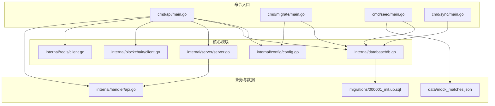
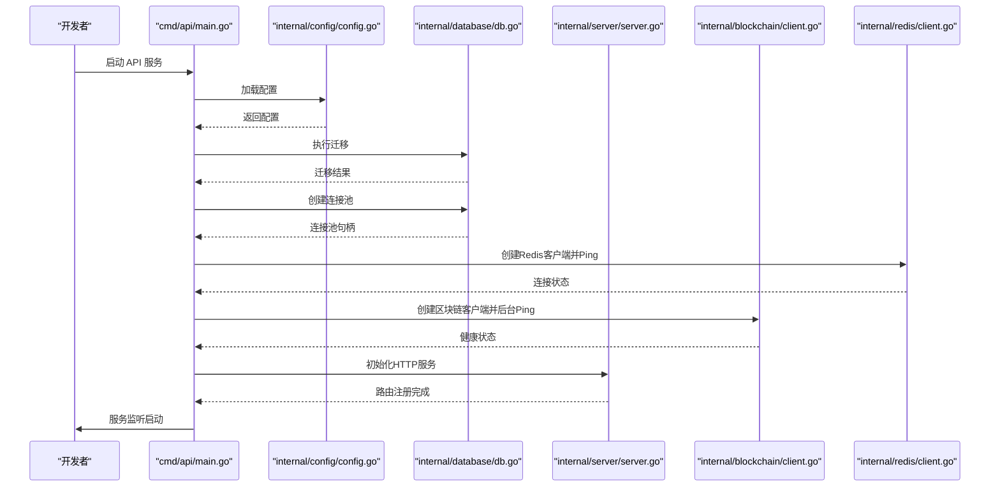
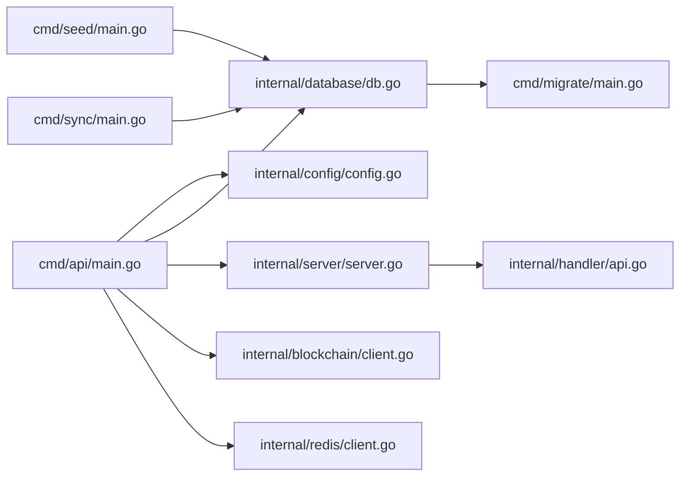

# 快速开始

<cite>
**本文引用的文件**
- [go.mod](file://go.mod)
- [cmd/api/main.go](file://cmd/api/main.go)
- [internal/config/config.go](file://internal/config/config.go)
- [internal/database/db.go](file://internal/database/db.go)
- [internal/server/server.go](file://internal/server/server.go)
- [internal/blockchain/client.go](file://internal/blockchain/client.go)
- [internal/redis/client.go](file://internal/redis/client.go)
- [cmd/migrate/main.go](file://cmd/migrate/main.go)
- [cmd/seed/main.go](file://cmd/seed/main.go)
- [cmd/sync/main.go](file://cmd/sync/main.go)
- [internal/handler/api.go](file://internal/handler/api.go)
- [migrations/000001_init.up.sql](file://migrations/000001_init.up.sql)
</cite>

## 目录
1. [简介](#简介)
2. [项目结构](#项目结构)
3. [核心组件](#核心组件)
4. [架构总览](#架构总览)
5. [详细组件分析](#详细组件分析)
6. [依赖关系分析](#依赖关系分析)
7. [性能注意事项](#性能注意事项)
8. [故障排查指南](#故障排查指南)
9. [结论](#结论)
10. [附录](#附录)

## 简介
本指南面向新手开发者，帮助你在30分钟内完成 PredictionDIDSimple 后端的本地环境搭建与首个API请求验证。你将获得：
- 环境要求与依赖安装（Go语言版本、PostgreSQL、Redis、以太坊节点）
- 配置文件设置（数据库连接、区块链RPC、JWT密钥、Redis参数等）
- 本地开发环境搭建（数据库初始化、表结构创建、种子数据加载）
- 基本API调用示例与验证步骤
- 不同操作系统的具体安装与配置指引

## 项目结构
后端采用多命令入口组织（cmd/*），核心职责分离清晰：
- cmd/api：API服务入口，负责启动HTTP服务、数据库迁移、Redis与区块链连接、索引器与预言机初始化
- cmd/migrate：数据库迁移工具
- cmd/seed：种子数据加载（mock比赛数据）
- cmd/sync：双数据源同步（主源同步）
- internal/*：配置、数据库、服务器、区块链、Redis、仓储、处理器等业务模块
- migrations/*：数据库迁移脚本
- data/*：种子数据文件

图表来源
- [cmd/api/main.go:1-161](file://cmd/api/main.go#L1-L161)
- [internal/config/config.go:1-139](file://internal/config/config.go#L1-L139)
- [internal/database/db.go:1-51](file://internal/database/db.go#L1-L51)
- [internal/server/server.go:1-129](file://internal/server/server.go#L1-L129)
- [internal/blockchain/client.go:1-94](file://internal/blockchain/client.go#L1-L94)
- [internal/redis/client.go:1-29](file://internal/redis/client.go#L1-L29)
- [cmd/migrate/main.go:1-37](file://cmd/migrate/main.go#L1-L37)
- [cmd/seed/main.go:1-54](file://cmd/seed/main.go#L1-L54)
- [cmd/sync/main.go:1-51](file://cmd/sync/main.go#L1-L51)
- [internal/handler/api.go:1-100](file://internal/handler/api.go#L1-L100)
- [migrations/000001_init.up.sql:1-10](file://migrations/000001_init.up.sql#L1-L10)

章节来源
- [go.mod:1-56](file://go.mod#L1-L56)
- [cmd/api/main.go:1-161](file://cmd/api/main.go#L1-L161)

## 核心组件
- 配置加载：从环境变量读取所有运行参数，缺失关键项会报错；支持默认值与类型解析
- 数据库：基于pgx连接池与golang-migrate执行迁移
- HTTP服务：基于Chi路由，内置CORS、限流、地理封锁等中间件
- 区块链：以太坊节点连接与健康检查，支持主备RPC
- Redis：可选连接，降级运行但不影响核心功能
- 种子数据：加载本地mock比赛数据到数据库

章节来源
- [internal/config/config.go:48-104](file://internal/config/config.go#L48-L104)
- [internal/database/db.go:16-50](file://internal/database/db.go#L16-L50)
- [internal/server/server.go:44-102](file://internal/server/server.go#L44-L102)
- [internal/blockchain/client.go:30-83](file://internal/blockchain/client.go#L30-L83)
- [internal/redis/client.go:12-28](file://internal/redis/client.go#L12-L28)
- [cmd/seed/main.go:17-54](file://cmd/seed/main.go#L17-L54)

## 架构总览
下图展示API服务启动时的关键流程：配置加载、数据库迁移、连接池建立、Redis与区块链健康检查、索引器与预言机初始化、HTTP服务启动。

图表来源
- [cmd/api/main.go:27-160](file://cmd/api/main.go#L27-L160)
- [internal/config/config.go:48-104](file://internal/config/config.go#L48-L104)
- [internal/database/db.go:33-50](file://internal/database/db.go#L33-L50)
- [internal/server/server.go:44-102](file://internal/server/server.go#L44-L102)
- [internal/blockchain/client.go:30-83](file://internal/blockchain/client.go#L30-L83)
- [internal/redis/client.go:23-28](file://internal/redis/client.go#L23-L28)

## 详细组件分析

### 环境与依赖要求
- Go语言版本：项目要求使用特定版本，请参考模块文件
- 数据库：PostgreSQL（使用pgx连接池与migrate迁移）
- 缓存：Redis（可选，用于降级运行）
- 区块链：以太坊节点（支持主备RPC）

章节来源
- [go.mod:3](file://go.mod#L3)
- [internal/database/db.go:10-14](file://internal/database/db.go#L10-L14)
- [internal/redis/client.go:9](file://internal/redis/client.go#L9)
- [internal/blockchain/client.go:11](file://internal/blockchain/client.go#L11)

### 配置文件与环境变量
以下为关键配置项及其用途（均来自配置加载逻辑）：
- 数据库连接：DATABASE_URL（必填）
- HTTP端口：HTTP_PORT（默认8080）
- Redis连接：REDIS_URL（默认redis://localhost:6379/0）
- 以太坊RPC：ETH_RPC_URL（默认http://127.0.0.1:8545）、ETH_RPC_FALLBACK_URL（备用RPC）
- 链ID：CHAIN_ID（默认31337）
- JWT密钥：JWT_SECRET（默认开发用密钥）
- SIWE参数：SIWE_DOMAIN、SIWE_URI
- 合约地址：MARKET_FACTORY_ADDRESS、MARKET_FACTORY_V3_ADDRESS、MOCK_USDC_ADDRESS、ORACLE_ADAPTER_ADDRESS、ORACLE_ADAPTER_V2、DID_REGISTRY_ADDRESS
- Oracle私钥：ORACLE_PRIVATE_KEY
- 索引器参数：INDEXER_POLL_SECONDS（默认5）、INDEXER_START_BLOCK（默认0）
- Mock数据路径：MOCK_MATCHES_PATH、MOCK_MATCHES_SECONDARY_PATH
- Oracle参数：ORACLE_COOLDOWN_MINUTES（默认15）、ORACLE_TIMELOCK_SECONDS（默认120）、ORACLE_POLL_SECONDS（默认10）
- 管理员密钥：ADMIN_API_KEY
- VC颁发密钥：VC_ISSUER_KEY（默认开发用）
- 告警Webhook：ALERT_WEBHOOK_URL
- 地理封锁：GEO_BLOCK_ENABLED（默认true）、BLOCKED_COUNTRIES（默认US,KP,IR,SY）
- 速率限制：RATE_LIMIT_PER_MINUTE（默认120）
- KYC回调：KYC_WEBHOOK_SECRET
- 合规开关：COMPLIANCE_REQUIRED（默认true）
- 运行环境：APP_ENV（默认development）

章节来源
- [internal/config/config.go:49-104](file://internal/config/config.go#L49-L104)

### 数据库初始化与表结构
- 迁移工具：通过命令入口执行数据库迁移
- 初始迁移：创建扩展与schema元数据表，并插入初始版本标记

章节来源
- [cmd/migrate/main.go:14-36](file://cmd/migrate/main.go#L14-L36)
- [internal/database/db.go:33-50](file://internal/database/db.go#L33-L50)
- [migrations/000001_init.up.sql:1-10](file://migrations/000001_init.up.sql#L1-L10)

### 种子数据与mock数据
- 种子数据加载：将本地mock比赛数据写入数据库，便于本地测试
- 双数据源同步：支持主源与备源同步

章节来源
- [cmd/seed/main.go:17-54](file://cmd/seed/main.go#L17-L54)
- [cmd/sync/main.go:17-51](file://cmd/sync/main.go#L17-L51)

### API服务启动流程
- 配置加载、数据库迁移、连接池创建
- Redis与区块链健康检查（可选）
- 索引器与预言机初始化（按配置启用）
- HTTP服务启动并注册路由

章节来源
- [cmd/api/main.go:27-160](file://cmd/api/main.go#L27-L160)
- [internal/server/server.go:44-102](file://internal/server/server.go#L44-L102)

### 区块链客户端与健康检查
- 定时后台ping以太坊节点，校验链ID一致性
- 健康状态可用于服务监控与告警

章节来源
- [internal/blockchain/client.go:30-83](file://internal/blockchain/client.go#L30-L83)

### Redis客户端与健康检查
- 解析Redis URL并创建客户端
- 2秒超时Ping检测，失败降级运行

章节来源
- [internal/redis/client.go:12-28](file://internal/redis/client.go#L12-L28)

### HTTP路由与认证
- 公开接口：比赛、市场、统计、事件流、指标等
- 登录接口：SIWE钱包登录、VC验证
- JWT保护接口：用户绑定DID、凭证查询等
- 管理员接口：市场注册、作废、Oracle任务管理、凭证颁发等

章节来源
- [internal/handler/api.go:33-69](file://internal/handler/api.go#L33-L69)

## 依赖关系分析
下图展示启动流程中的主要依赖关系与调用顺序。

图表来源
- [cmd/api/main.go:27-160](file://cmd/api/main.go#L27-L160)
- [internal/config/config.go:48-104](file://internal/config/config.go#L48-L104)
- [internal/database/db.go:33-50](file://internal/database/db.go#L33-L50)
- [internal/server/server.go:44-102](file://internal/server/server.go#L44-L102)
- [internal/blockchain/client.go:30-83](file://internal/blockchain/client.go#L30-L83)
- [internal/redis/client.go:12-28](file://internal/redis/client.go#L12-L28)
- [cmd/migrate/main.go:14-36](file://cmd/migrate/main.go#L14-L36)
- [cmd/seed/main.go:17-54](file://cmd/seed/main.go#L17-L54)
- [cmd/sync/main.go:17-51](file://cmd/sync/main.go#L17-L51)
- [internal/handler/api.go:33-69](file://internal/handler/api.go#L33-L69)

## 性能注意事项
- 数据库连接池：使用pgx连接池，建议根据并发与资源情况调整池大小
- 迁移执行：在启动时自动执行，生产环境建议预执行以缩短冷启动时间
- Redis降级：Ping失败不会阻止服务，但缓存相关功能不可用
- 区块链健康检查：后台定时ping，异常会记录警告日志
- 速率限制：默认每分钟120次，可根据部署环境调整

## 故障排查指南
- 启动时报错提示缺少数据库连接字符串：请设置DATABASE_URL
- 数据库迁移失败：确认PostgreSQL可达且具备相应权限
- Redis连接失败：确认Redis服务可用，或忽略降级运行
- 以太坊节点不可达：检查ETH_RPC_URL与网络连通性，必要时配置ETH_RPC_FALLBACK_URL
- 端口占用：修改HTTP_PORT，默认8080

章节来源
- [internal/config/config.go:84-87](file://internal/config/config.go#L84-L87)
- [internal/database/db.go:33-50](file://internal/database/db.go#L33-L50)
- [internal/redis/client.go:23-28](file://internal/redis/client.go#L23-L28)
- [internal/blockchain/client.go:48-83](file://internal/blockchain/client.go#L48-L83)

## 结论
按照本指南，你可以在30分钟内完成本地环境搭建、数据库初始化、种子数据加载与首个API请求验证。建议在开发完成后逐步替换默认配置为生产安全参数，并完善监控与告警机制。

## 附录

### 环境准备与安装（按操作系统）
- Windows
  - 安装Go（版本见模块文件）
  - 安装PostgreSQL（确保服务运行）
  - 安装Redis（确保服务运行）
  - 准备以太坊节点（本地或远程RPC）
- macOS/Linux
  - 使用包管理器安装Go、PostgreSQL、Redis
  - 准备以太坊节点（本地或远程RPC）

章节来源
- [go.mod:3](file://go.mod#L3)

### 配置文件设置步骤
- 数据库连接：设置DATABASE_URL（必填）
- HTTP端口：设置HTTP_PORT（默认8080）
- Redis连接：设置REDIS_URL（默认本地）
- 以太坊RPC：设置ETH_RPC_URL与ETH_RPC_FALLBACK_URL
- 链ID：设置CHAIN_ID（默认31337）
- JWT密钥：设置JWT_SECRET（生产环境务必随机且保密）
- 合约地址：按部署情况设置各合约地址
- Oracle私钥：设置ORACLE_PRIVATE_KEY（生产环境使用安全存储）
- 索引器参数：按需求设置INDEXER_POLL_SECONDS与INDEXER_START_BLOCK
- Mock数据路径：设置MOCK_MATCHES_PATH与MOCK_MATCHES_SECONDARY_PATH
- 管理员密钥：设置ADMIN_API_KEY
- VC颁发密钥：设置VC_ISSUER_KEY
- 地理封锁与速率限制：按需调整GEO_BLOCK_ENABLED、BLOCKED_COUNTRIES、RATE_LIMIT_PER_MINUTE

章节来源
- [internal/config/config.go:49-104](file://internal/config/config.go#L49-L104)

### 本地开发环境搭建步骤
- 步骤1：执行数据库迁移
  - 使用迁移命令入口执行迁移
- 步骤2：创建数据库连接池
  - 启动API服务时自动创建
- 步骤3：加载种子数据
  - 使用种子命令入口加载mock比赛数据
- 步骤4：启动API服务
  - 启动API入口，等待服务监听

章节来源
- [cmd/migrate/main.go:14-36](file://cmd/migrate/main.go#L14-L36)
- [cmd/seed/main.go:17-54](file://cmd/seed/main.go#L17-L54)
- [cmd/api/main.go:27-160](file://cmd/api/main.go#L27-L160)

### 基本API调用示例与验证
- 健康检查
  - GET /health
- 公开接口
  - GET /matches
  - GET /markets
  - GET /stats/platform
  - GET /metrics
- 登录接口
  - POST /auth/siwe
- 需要JWT的接口
  - GET /me/positions
  - POST /users/bind-did
  - GET /users/me/credentials
- 需要管理员密钥的接口
  - GET /admin/oracle-jobs
  - POST /admin/markets
  - POST /admin/markets/{id}/void
  - POST /admin/oracle-jobs/{id}/retry
  - POST /credentials/issue

章节来源
- [internal/handler/api.go:33-69](file://internal/handler/api.go#L33-L69)