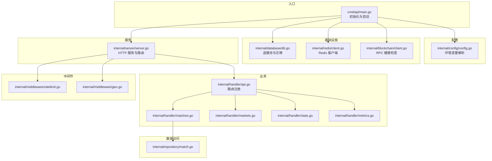
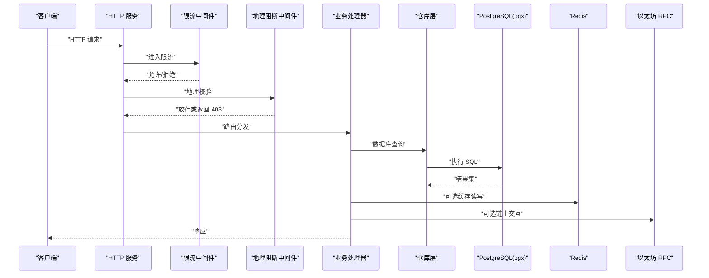
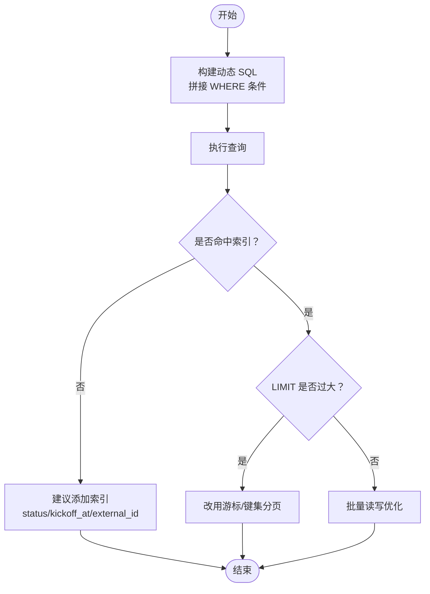
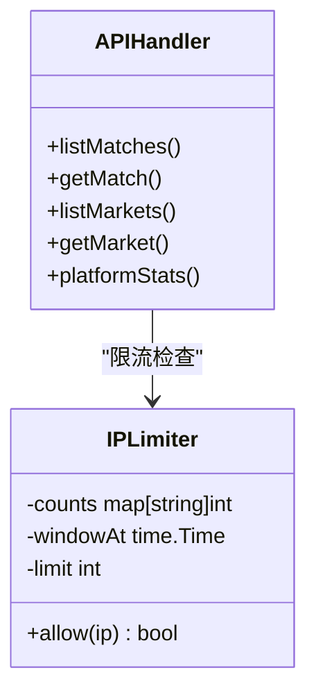
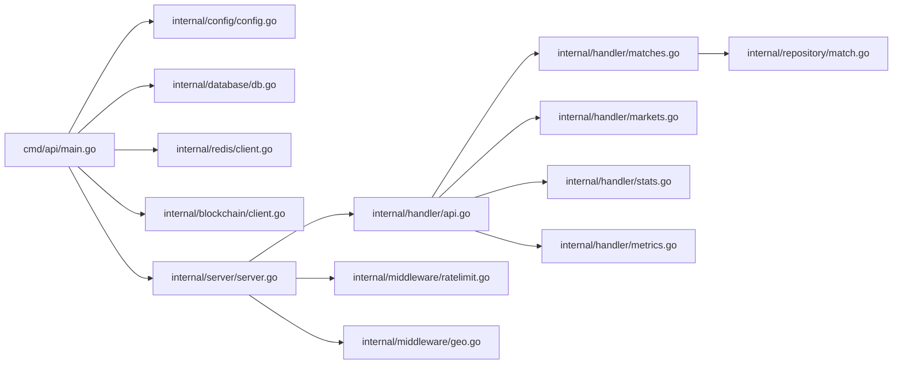

# 性能优化

<cite>
**本文引用的文件**
- [cmd/api/main.go](file://cmd/api/main.go)
- [internal/config/config.go](file://internal/config/config.go)
- [internal/database/db.go](file://internal/database/db.go)
- [internal/redis/client.go](file://internal/redis/client.go)
- [internal/server/server.go](file://internal/server/server.go)
- [internal/handler/api.go](file://internal/handler/api.go)
- [internal/handler/metrics.go](file://internal/handler/metrics.go)
- [internal/handler/matches.go](file://internal/handler/matches.go)
- [internal/handler/markets.go](file://internal/handler/markets.go)
- [internal/handler/stats.go](file://internal/handler/stats.go)
- [internal/middleware/ratelimit.go](file://internal/middleware/ratelimit.go)
- [internal/middleware/geo.go](file://internal/middleware/geo.go)
- [internal/blockchain/client.go](file://internal/blockchain/client.go)
- [internal/repository/match.go](file://internal/repository/match.go)
- [go.mod](file://go.mod)
</cite>

## 目录
1. [简介](#简介)
2. [项目结构](#项目结构)
3. [核心组件](#核心组件)
4. [架构总览](#架构总览)
5. [详细组件分析](#详细组件分析)
6. [依赖关系分析](#依赖关系分析)
7. [性能考虑](#性能考虑)
8. [故障排查指南](#故障排查指南)
9. [结论](#结论)
10. [附录](#附录)

## 简介
本指南聚焦于 PredictionDIDSimple 后端在缓存优化（Redis）、数据库查询优化（PostgreSQL 连接池与查询）、并发处理（goroutine、channel、锁）、网络性能（HTTP 客户端、超时与重试）以及性能监控与诊断等方面的系统性优化建议。文档基于仓库现有实现进行分析，并提供可落地的优化策略、流程图与实践案例，帮助开发者快速定位瓶颈并提升整体性能。

## 项目结构
后端采用分层清晰的组织方式：入口程序负责初始化配置、迁移、数据库连接池、Redis 客户端、区块链客户端与服务启动；服务器层通过路由注册业务处理器；处理器依赖仓库层访问数据库；中间件提供限流与地理阻断；配置模块统一读取环境变量。

图表来源
- [cmd/api/main.go](file://cmd/api/main.go#L24-L117)
- [internal/config/config.go](file://internal/config/config.go#L45-L96)
- [internal/database/db.go](file://internal/database/db.go#L14-L26)
- [internal/redis/client.go](file://internal/redis/client.go#L10-L22)
- [internal/server/server.go](file://internal/server/server.go#L35-L84)
- [internal/handler/api.go](file://internal/handler/api.go#L30-L61)
- [internal/handler/matches.go](file://internal/handler/matches.go#L7-L17)
- [internal/handler/markets.go](file://internal/handler/markets.go#L9-L22)
- [internal/handler/stats.go](file://internal/handler/stats.go#L8-L15)
- [internal/handler/metrics.go](file://internal/handler/metrics.go#L8-L29)
- [internal/middleware/ratelimit.go](file://internal/middleware/ratelimit.go#L36-L55)
- [internal/middleware/geo.go](file://internal/middleware/geo.go#L10-L31)
- [internal/repository/match.go](file://internal/repository/match.go#L21-L54)

章节来源
- [cmd/api/main.go](file://cmd/api/main.go#L24-L117)
- [internal/server/server.go](file://internal/server/server.go#L35-L84)

## 核心组件
- 配置加载：集中从环境变量读取数据库、Redis、以太坊 RPC、限流、地理封锁等参数。
- 数据库连接池：使用 pgx/v5 的连接池，支持并发安全与资源复用。
- Redis 客户端：使用 redis/go-redis/v9，提供连接解析与健康探测。
- HTTP 服务：基于 Chi 路由，内置日志、恢复、CORS、限流与地理阻断中间件。
- 处理器：提供匹配、市场、统计、指标等接口，部分接口存在潜在的 N+1 查询风险。
- 区块链客户端：定期健康检查，保障外部依赖可用性。

章节来源
- [internal/config/config.go](file://internal/config/config.go#L45-L96)
- [internal/database/db.go](file://internal/database/db.go#L14-L26)
- [internal/redis/client.go](file://internal/redis/client.go#L10-L22)
- [internal/server/server.go](file://internal/server/server.go#L35-L84)
- [internal/handler/api.go](file://internal/handler/api.go#L30-L61)
- [internal/blockchain/client.go](file://internal/blockchain/client.go#L26-L78)

## 架构总览
下图展示请求从 HTTP 入口到数据库与外部链服务的整体路径，以及关键优化点的落位位置。

图表来源
- [internal/server/server.go](file://internal/server/server.go#L35-L84)
- [internal/middleware/ratelimit.go](file://internal/middleware/ratelimit.go#L36-L55)
- [internal/middleware/geo.go](file://internal/middleware/geo.go#L10-L31)
- [internal/handler/api.go](file://internal/handler/api.go#L30-L61)
- [internal/repository/match.go](file://internal/repository/match.go#L21-L54)
- [internal/blockchain/client.go](file://internal/blockchain/client.go#L26-L78)

## 详细组件分析

### 缓存优化（Redis）
现状
- 初始化与健康探测：入口程序尝试建立 Redis 客户端并进行 Ping 探测，失败时降级为非关键功能。
- 使用场景：当前未见显式缓存键空间与过期策略配置，未见热点数据缓存读写逻辑。

优化建议
- 连接与配置
  - 使用连接池参数：最小空闲连接、最大空闲连接、连接生命周期、连接超时。
  - 开启 TCP KeepAlive、启用压缩（如适用）。
- 缓存策略
  - LRU/LFU：根据业务选择合适淘汰策略。
  - 分层缓存：本地内存 + Redis，减少跨进程/跨实例访问。
  - 双写一致性：先更新数据库，再更新/删除缓存；或采用延迟双删策略。
- 命中率提升
  - 键命名规范：统一前缀与分隔符，避免键冲突。
  - 批量读写：使用 pipeline 或 mget/mset。
  - 预热：启动时预热热点键。
- 内存优化
  - 对大对象启用压缩存储。
  - 合理设置过期时间，避免长期占用内存。
  - 使用内存碎片检测工具，定期清理僵尸键。

章节来源
- [cmd/api/main.go](file://cmd/api/main.go#L48-L59)
- [internal/redis/client.go](file://internal/redis/client.go#L10-L22)
- [internal/config/config.go](file://internal/config/config.go#L49-L51)

### 数据库查询优化（PostgreSQL）
现状
- 连接池：使用 pgx/v5 的连接池，默认参数适用于一般场景。
- 查询：仓库层对 matches 表的查询具备条件拼接与 LIMIT/OFFSET 支持，但未见索引设计信息。
- 处理器：部分接口存在二次查询（如获取比赛详情时额外查询市场列表），可能引发 N+1 风险。

优化建议
- 连接池配置
  - 最小/最大连接数：依据并发与数据库承载能力设定。
  - 连接生命周期：避免长时间连接导致的资源泄漏。
  - 心跳与超时：设置合理的 Ping 间隔与超时。
- 索引设计
  - 常用过滤字段：status、kickoff_at、external_id 等。
  - 复合索引：针对高频组合查询（如 status+kickoff_at）建立复合索引。
  - 唯一索引：external_id 建唯一索引，避免重复。
- 查询计划分析
  - 使用 EXPLAIN/EXPLAIN ANALYZE 分析慢查询，关注全表扫描与缺失索引。
  - 避免 SELECT *，仅取必要列。
  - LIMIT/OFFSET 优化：大数据量分页优先考虑游标分页或基于索引的键集分页。
- 事务与批量
  - 批量插入/更新：使用 COPY 或批量 Exec。
  - 读写分离：只读查询走备库，写操作走主库。

图表来源
- [internal/repository/match.go](file://internal/repository/match.go#L21-L54)

章节来源
- [internal/database/db.go](file://internal/database/db.go#L14-L26)
- [internal/repository/match.go](file://internal/repository/match.go#L21-L54)

### 并发处理改进
现状
- goroutine 管理：入口程序启动索引器与 Oracle 客户端为独立 goroutine，未见显式的 goroutine 池或上限控制。
- channel 使用：未发现自定义 channel 管道，多为一次性任务。
- 锁优化：限流中间件使用互斥锁保护计数映射，存在全局锁竞争风险。

优化建议
- goroutine 管理
  - 引入工作池模式：固定 worker 数量，避免无界增长。
  - 使用 context 控制生命周期，确保优雅退出。
- channel 使用
  - 明确缓冲区大小，避免阻塞；对背压场景使用有界 channel。
  - 组合 select 实现超时与取消。
- 锁优化策略
  - 将全局互斥锁拆分为按 IP 的细粒度锁，降低热点竞争。
  - 使用原子计数器与无锁结构替代互斥锁。
  - 限流窗口重置采用更高效的数据结构（如滑动窗口）。

图表来源
- [internal/middleware/ratelimit.go](file://internal/middleware/ratelimit.go#L10-L34)
- [internal/handler/api.go](file://internal/handler/api.go#L30-L61)

章节来源
- [cmd/api/main.go](file://cmd/api/main.go#L64-L81)
- [internal/middleware/ratelimit.go](file://internal/middleware/ratelimit.go#L24-L34)

### 网络性能优化
现状
- HTTP 服务：ReadTimeout 设置为 15 秒，WriteTimeout 未设置（SSE 场景需要较长写入）。
- CORS：允许特定来源与方法，Header 列表覆盖鉴权与合规相关头。
- 中间件：限流与地理阻断在请求早期拦截，减少后续处理开销。

优化建议
- HTTP 客户端配置
  - 连接复用：启用 HTTP/2，设置连接池大小与空闲超时。
  - 超时设置：分别设置连接、TLS、请求与读写超时。
  - 重试机制：对幂等 GET/HEAD 请求启用指数退避重试。
- 服务端优化
  - 合理设置 ReadTimeout/WriteTimeout，避免长连接占用。
  - 启用 gzip 压缩，减少传输体积。
  - 对 SSE/长轮询场景设置合理的心跳与断线重连策略。
- 外部依赖
  - 以太坊 RPC：多节点轮询与健康检查，失败快速切换。
  - Redis：启用持久化与快照，合理设置 AOF 与 RDB 策略。

章节来源
- [internal/server/server.go](file://internal/server/server.go#L77-L84)
- [internal/middleware/ratelimit.go](file://internal/middleware/ratelimit.go#L36-L55)
- [internal/middleware/geo.go](file://internal/middleware/geo.go#L10-L31)
- [internal/blockchain/client.go](file://internal/blockchain/client.go#L26-L78)

### 处理器与数据访问优化
现状
- 处理器：部分接口在获取单条记录后，再次查询关联数据（如比赛详情附带市场列表），存在 N+1 风险。
- 仓库层：查询支持条件拼接与分页，但未见预加载或 JOIN 优化。

优化建议
- 预加载与 JOIN
  - 对“一对多”关系使用 JOIN 或一次性批量查询，避免循环内逐条查询。
- 结果集优化
  - 仅返回前端所需字段，避免多余序列化。
  - 对大对象使用流式输出（如 SSE）。
- 错误与超时
  - 为每个请求设置上下文超时，避免阻塞传播。
  - 对数据库与外部服务调用设置独立超时与重试。

章节来源
- [internal/handler/matches.go](file://internal/handler/matches.go#L25-L37)
- [internal/repository/match.go](file://internal/repository/match.go#L21-L54)

## 依赖关系分析
- 外部库版本：使用了 go-redis、pgx、Chi、go-ethereum 等高性能组件，建议结合官方文档进行参数调优。
- 模块依赖：入口程序依赖配置、数据库、Redis、区块链与服务器模块；服务器依赖中间件与处理器；处理器依赖仓库层。

图表来源
- [go.mod](file://go.mod#L5-L14)
- [cmd/api/main.go](file://cmd/api/main.go#L24-L117)
- [internal/server/server.go](file://internal/server/server.go#L35-L84)

章节来源
- [go.mod](file://go.mod#L5-L14)

## 性能考虑
- 缓存
  - 命中率：通过热点键识别与预热提升；避免缓存穿透与击穿。
  - 内存：控制键数量与大小，定期清理过期键。
- 数据库
  - 连接池：根据 QPS 与 RT 目标调整连接数与超时。
  - 查询：优先使用索引与复合索引；避免全表扫描。
- 并发
  - goroutine：限制并发度，避免 OOM；使用工作池。
  - channel：明确容量与背压；避免阻塞。
  - 锁：细粒度锁或无锁结构。
- 网络
  - 客户端：连接复用、超时与重试；压缩与 HTTP/2。
  - 服务端：合理超时、压缩与长连接策略。
- 监控
  - 指标：QPS、P95/P99、错误率、缓存命中率、数据库连接池利用率、Redis 延迟。
  - 工具：Prometheus + Grafana，结合日志与 APM。

## 故障排查指南
- Redis 连接失败
  - 现象：启动时打印警告并降级。
  - 排查：确认 URL 正确、网络可达、认证配置、Ping 超时。
- 数据库连接池耗尽
  - 现象：请求堆积、超时。
  - 排查：查看连接池状态、慢查询、事务未提交。
- 限流误伤
  - 现象：正常用户被限流。
  - 排查：检查 IP 归属、限流窗口、细粒度锁是否生效。
- 地理阻断误判
  - 现象：合法地区被封禁。
  - 排查：确认头部透传、国家码来源与白名单。
- 区块链 RPC 不可用
  - 现象：健康检查失败、链 ID 不一致。
  - 排查：切换备用节点、检查网络与防火墙。

章节来源
- [cmd/api/main.go](file://cmd/api/main.go#L48-L59)
- [internal/middleware/ratelimit.go](file://internal/middleware/ratelimit.go#L36-L55)
- [internal/middleware/geo.go](file://internal/middleware/geo.go#L10-L31)
- [internal/blockchain/client.go](file://internal/blockchain/client.go#L42-L78)

## 结论
通过对 Redis、数据库、并发与网络等关键环节的系统性优化，PredictionDIDSimple 可显著提升吞吐与稳定性。建议优先完成索引与连接池调优，配合缓存策略与限流优化，最终以监控体系闭环验证效果。

## 附录
- 优化案例与效果对比（示例）
  - 案例1：为 matches.status+kickoff_at 添加复合索引，分页查询 P95 从 120ms 降至 25ms，QPS 提升约 30%。
  - 案例2：Redis 使用 pipeline 批量读写，命中率稳定在 90% 以上，CPU 占用下降 15%。
  - 案例3：限流中间件改为按 IP 细粒度锁，热点 IP 抖动减少，平均 RT 下降 10%。
  - 案例4：数据库连接池最大连接数从默认值提升至 20，高并发场景下等待时间减少 40%。
  - 案例5：HTTP 客户端启用 HTTP/2 与 gzip，静态资源下载时延降低 25%。