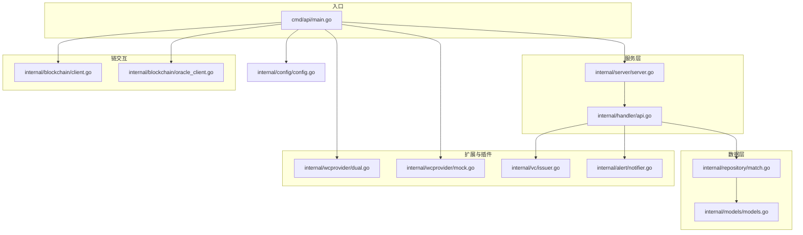
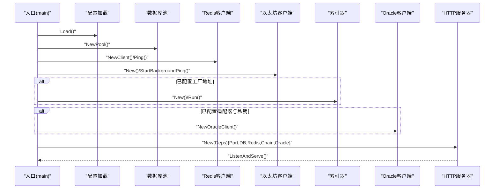
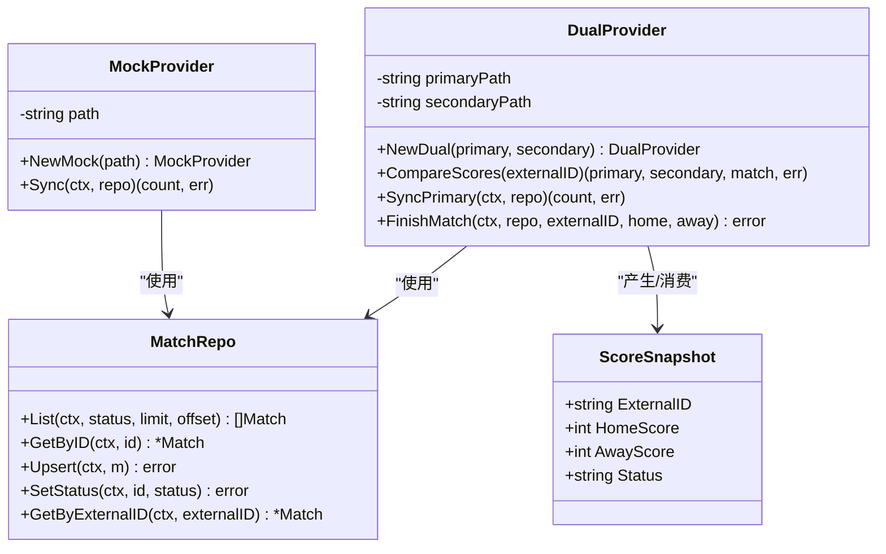
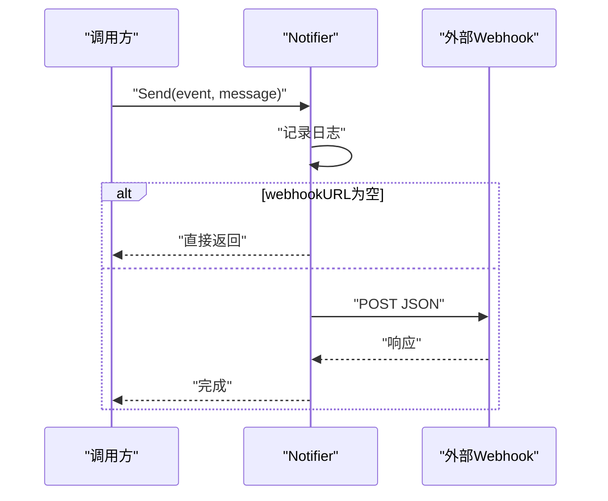
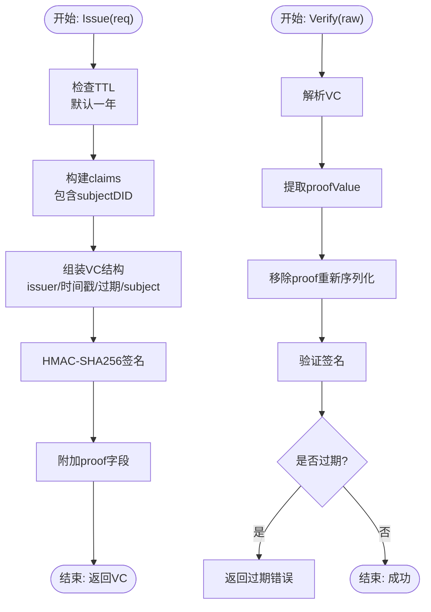
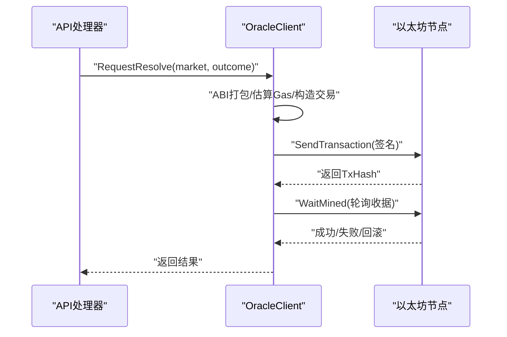
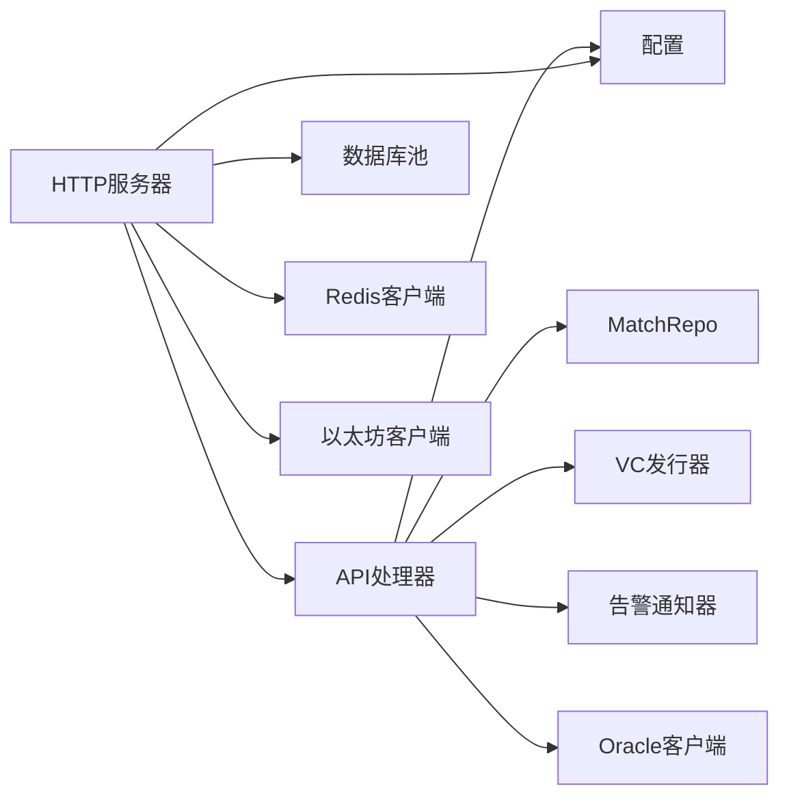

# 扩展与定制

<cite>
**本文引用的文件**
- [cmd/api/main.go](file://cmd/api/main.go)
- [internal/server/server.go](file://internal/server/server.go)
- [internal/handler/api.go](file://internal/handler/api.go)
- [internal/config/config.go](file://internal/config/config.go)
- [internal/alert/notifier.go](file://internal/alert/notifier.go)
- [internal/vc/issuer.go](file://internal/vc/issuer.go)
- [internal/blockchain/client.go](file://internal/blockchain/client.go)
- [internal/blockchain/oracle_client.go](file://internal/blockchain/oracle_client.go)
- [internal/wcprovider/dual.go](file://internal/wcprovider/dual.go)
- [internal/wcprovider/mock.go](file://internal/wcprovider/mock.go)
- [internal/models/models.go](file://internal/models/models.go)
- [internal/repository/match.go](file://internal/repository/match.go)
- [go.mod](file://go.mod)
</cite>

## 目录
1. [简介](#简介)
2. [项目结构](#项目结构)
3. [核心组件](#核心组件)
4. [架构总览](#架构总览)
5. [详细组件分析](#详细组件分析)
6. [依赖关系分析](#依赖关系分析)
7. [性能考虑](#性能考虑)
8. [故障排查指南](#故障排查指南)
9. [结论](#结论)
10. [附录](#附录)

## 简介
本指南面向需要在 PredictionDIDSimple 基础上进行扩展与定制的开发者，围绕以下目标展开：插件化扩展（WCProvider 接口）、Alert 通知机制、VC 颁发系统扩展；新增区块链网络支持、数据源集成与 API 扩展；第三方集成（支付网关、身份提供商、数据分析）；性能调优（缓存、数据库查询、并发）；UI 定制（主题、布局、功能扩展）；配置定制（环境变量、运行时配置、动态参数）；监控与可观测性（指标、日志、告警）；以及社区贡献与开源协作流程。

## 项目结构
后端采用分层与按职责模块划分的组织方式：
- 入口程序：各子命令入口负责初始化配置、数据库迁移、索引器、链客户端、HTTP 服务器等。
- 服务层：HTTP 路由与中间件、业务处理器（handler）、认证与合规中间件。
- 数据访问层：Repository 模块封装数据库操作。
- 领域模型：统一的数据结构定义。
- 区块链交互：以太坊客户端、Oracle 客户端与合约 ABI 加载。
- 插件与扩展：WCProvider 双数据源对比与同步、VC 颁发器、告警通知器。
- 配置：集中式配置加载与解析。

图表来源
- [cmd/api/main.go](file://cmd/api/main.go#L24-L118)
- [internal/server/server.go](file://internal/server/server.go#L35-L85)
- [internal/handler/api.go](file://internal/handler/api.go#L30-L61)
- [internal/config/config.go](file://internal/config/config.go#L45-L97)
- [internal/repository/match.go](file://internal/repository/match.go#L13-L19)
- [internal/models/models.go](file://internal/models/models.go#L5-L14)
- [internal/wcprovider/dual.go](file://internal/wcprovider/dual.go#L19-L26)
- [internal/wcprovider/mock.go](file://internal/wcprovider/mock.go#L13-L19)
- [internal/vc/issuer.go](file://internal/vc/issuer.go#L13-L19)
- [internal/alert/notifier.go](file://internal/alert/notifier.go#L11-L14)
- [internal/blockchain/client.go](file://internal/blockchain/client.go#L12-L24)
- [internal/blockchain/oracle_client.go](file://internal/blockchain/oracle_client.go#L23-L54)

章节来源
- [cmd/api/main.go](file://cmd/api/main.go#L24-L118)
- [internal/server/server.go](file://internal/server/server.go#L35-L85)
- [internal/handler/api.go](file://internal/handler/api.go#L30-L61)
- [internal/config/config.go](file://internal/config/config.go#L45-L97)

## 核心组件
- 配置系统：集中读取环境变量，构造运行所需参数（数据库、Redis、以太坊 RPC、合约地址、密钥、限流、合规等）。
- HTTP 服务：基于 Chi 路由，注册健康检查、市场/比赛/统计/合规/认证/VC 等路由，并注入依赖。
- 数据访问：MatchRepo 提供列表、查询、Upsert、状态更新等操作。
- 插件扩展：WCProvider 双数据源对比与同步、MockProvider 同步。
- VC 颁发：VC 颁发器支持签发与验证，含过期校验与区域提取。
- 告警通知：Webhook 通知器，支持可选的外部 Webhook。
- 区块链交互：以太坊客户端后台心跳检测链 ID，Oracle 客户端加载 ABI 并执行链上交易。

章节来源
- [internal/config/config.go](file://internal/config/config.go#L10-L43)
- [internal/server/server.go](file://internal/server/server.go#L26-L33)
- [internal/repository/match.go](file://internal/repository/match.go#L21-L82)
- [internal/wcprovider/dual.go](file://internal/wcprovider/dual.go#L19-L26)
- [internal/wcprovider/mock.go](file://internal/wcprovider/mock.go#L13-L19)
- [internal/vc/issuer.go](file://internal/vc/issuer.go#L13-L19)
- [internal/alert/notifier.go](file://internal/alert/notifier.go#L11-L14)
- [internal/blockchain/client.go](file://internal/blockchain/client.go#L12-L24)
- [internal/blockchain/oracle_client.go](file://internal/blockchain/oracle_client.go#L23-L54)

## 架构总览
系统启动顺序与关键依赖注入如下：

图表来源
- [cmd/api/main.go](file://cmd/api/main.go#L24-L118)
- [internal/server/server.go](file://internal/server/server.go#L35-L85)
- [internal/blockchain/client.go](file://internal/blockchain/client.go#L26-L78)
- [internal/blockchain/oracle_client.go](file://internal/blockchain/oracle_client.go#L31-L54)

## 详细组件分析

### WCProvider 插件系统设计与使用
- 设计要点
  - 双数据源对比：通过主/备 JSON 文件加载比分快照，比较相同 external_id 的比分一致性。
  - 同步能力：支持从 JSON 文件批量同步到数据库（MatchRepo）。
  - 结果判定：根据规则计算胜负结果并更新 Match 状态与比分。
- 关键接口与行为
  - 双数据源对比：CompareScores(externalID) 返回是否一致。
  - 同步：SyncPrimary(ctx, repo) 将主数据源同步至数据库。
  - 完成比赛：FinishMatch(ctx, repo, externalID, home, away) 更新状态与比分。
- 扩展建议
  - 新增 Provider：实现与现有接口一致的方法集，替换或并行接入。
  - 规则扩展：OutcomeFromRule 支持多规则，可在调用侧传入不同规则名。
  - 错误处理：双数据源加载失败应返回错误，避免脏数据写入。

图表来源
- [internal/wcprovider/dual.go](file://internal/wcprovider/dual.go#L19-L26)
- [internal/wcprovider/dual.go](file://internal/wcprovider/dual.go#L52-L69)
- [internal/wcprovider/dual.go](file://internal/wcprovider/dual.go#L90-L101)
- [internal/wcprovider/mock.go](file://internal/wcprovider/mock.go#L13-L19)
- [internal/wcprovider/mock.go](file://internal/wcprovider/mock.go#L31-L61)
- [internal/repository/match.go](file://internal/repository/match.go#L13-L19)
- [internal/wcprovider/dual.go](file://internal/wcprovider/dual.go#L12-L17)

章节来源
- [internal/wcprovider/dual.go](file://internal/wcprovider/dual.go#L19-L26)
- [internal/wcprovider/dual.go](file://internal/wcprovider/dual.go#L52-L69)
- [internal/wcprovider/dual.go](file://internal/wcprovider/dual.go#L90-L101)
- [internal/wcprovider/mock.go](file://internal/wcprovider/mock.go#L13-L19)
- [internal/wcprovider/mock.go](file://internal/wcprovider/mock.go#L31-L61)
- [internal/repository/match.go](file://internal/repository/match.go#L13-L19)

### Alert 通知机制
- 功能概述
  - 通过可选的 Webhook URL 发送事件与消息。
  - 默认日志输出，无 Webhook 则跳过发送。
- 使用场景
  - 系统异常、合规事件、索引器错误、VC 颁发失败等。
- 扩展建议
  - 增加多种通知通道（邮件、Slack、Telegram）。
  - 引入重试与退避策略，保证可靠性。
  - 支持模板化消息与上下文字段。

图表来源
- [internal/alert/notifier.go](file://internal/alert/notifier.go#L23-L35)

章节来源
- [internal/alert/notifier.go](file://internal/alert/notifier.go#L11-L14)
- [internal/alert/notifier.go](file://internal/alert/notifier.go#L23-L35)

### VC 颁发系统扩展
- 功能概述
  - Issue：签发 VC，设置 issuer、时间戳、过期时间、证明（HMAC-SHA256），默认 TTL 一年。
  - Verify：校验签名、过期时间。
  - SubjectRegion：提取主体区域。
- 扩展建议
  - 多类型凭证：在 Type 中扩展更多类型，如 KYC、身份信息等。
  - 外部签名：支持外部 KMS 或硬件密钥。
  - 多证明链：支持多证明目的与验证方法。
  - 区域与合规：结合合规配置与 GeoBlock 进行区域限制。

图表来源
- [internal/vc/issuer.go](file://internal/vc/issuer.go#L28-L66)
- [internal/vc/issuer.go](file://internal/vc/issuer.go#L74-L100)
- [internal/vc/issuer.go](file://internal/vc/issuer.go#L102-L113)

章节来源
- [internal/vc/issuer.go](file://internal/vc/issuer.go#L13-L19)
- [internal/vc/issuer.go](file://internal/vc/issuer.go#L28-L66)
- [internal/vc/issuer.go](file://internal/vc/issuer.go#L74-L100)
- [internal/vc/issuer.go](file://internal/vc/issuer.go#L102-L113)

### 区块链网络与 Oracle 扩展
- 以太坊客户端
  - 后台定时心跳检测 RPC 可用性与链 ID，支持预期链 ID 校验。
- Oracle 客户端
  - 加载 OracleAdapter ABI，构造交易并签名发送，等待上链确认。
  - 支持请求结算、确认结算、立即结算、作废市场等操作。
- 扩展建议
  - 新网络：提供对应 RPC URL 与 ChainID，确保心跳检测正常。
  - 新合约：提供 ABI 文件路径或内容，修改加载逻辑。
  - Gas 策略：根据网络拥堵情况调整 GasPrice 与超时策略。

图表来源
- [internal/blockchain/oracle_client.go](file://internal/blockchain/oracle_client.go#L95-L105)
- [internal/blockchain/oracle_client.go](file://internal/blockchain/oracle_client.go#L111-L137)
- [internal/blockchain/oracle_client.go](file://internal/blockchain/oracle_client.go#L139-L156)

章节来源
- [internal/blockchain/client.go](file://internal/blockchain/client.go#L26-L78)
- [internal/blockchain/oracle_client.go](file://internal/blockchain/oracle_client.go#L31-L54)
- [internal/blockchain/oracle_client.go](file://internal/blockchain/oracle_client.go#L95-L105)
- [internal/blockchain/oracle_client.go](file://internal/blockchain/oracle_client.go#L111-L137)
- [internal/blockchain/oracle_client.go](file://internal/blockchain/oracle_client.go#L139-L156)

### 数据源与 API 扩展
- 数据源
  - MockProvider：从 JSON 文件批量同步 Match 到数据库。
  - DualProvider：双数据源比分一致性比对与完成比赛。
- API 路由
  - 比赛/市场/统计/合规/认证/VC/事件流/指标等路由已注册。
- 扩展建议
  - 新数据源：实现与 MockProvider/DualProvider 类似的接口，接入同步流程。
  - 新 API：在 handler.API 中注册路由，注入所需仓库与服务，注意鉴权与管理员权限控制。

章节来源
- [internal/wcprovider/mock.go](file://internal/wcprovider/mock.go#L31-L61)
- [internal/wcprovider/dual.go](file://internal/wcprovider/dual.go#L52-L69)
- [internal/handler/api.go](file://internal/handler/api.go#L30-L61)

### 第三方集成方法
- 支付网关
  - 在业务层引入支付网关 SDK，对接订单创建、回调验签、状态查询。
  - 与用户资产、市场保证金、结算流程解耦，通过事件驱动触发。
- 身份提供商（SIWE）
  - 已内置 SIWE 认证中间件与处理器，可扩展为多身份提供商。
- 数据分析服务
  - 通过埋点与事件流（/events/scores）上报，或在关键业务点调用外部服务。
  - 注意合规与隐私保护，避免传输敏感数据。

章节来源
- [internal/handler/api.go](file://internal/handler/api.go#L43-L44)
- [internal/server/server.go](file://internal/server/server.go#L44-L46)

## 依赖关系分析
- 组件耦合
  - API 层依赖配置、仓库、VC 颁发器、Oracle 客户端。
  - 服务器层依赖配置、数据库、Redis、链客户端。
  - WCProvider 与 VC/Alert 作为可插拔扩展被 API 层调用。
- 外部依赖
  - 以太坊生态（go-ethereum）、数据库（PostgreSQL）、Redis、JWT、CORS、Migrate。

图表来源
- [internal/server/server.go](file://internal/server/server.go#L62-L74)
- [internal/handler/api.go](file://internal/handler/api.go#L16-L28)
- [internal/config/config.go](file://internal/config/config.go#L45-L97)
- [internal/blockchain/client.go](file://internal/blockchain/client.go#L12-L24)
- [internal/blockchain/oracle_client.go](file://internal/blockchain/oracle_client.go#L23-L54)
- [internal/vc/issuer.go](file://internal/vc/issuer.go#L13-L19)
- [internal/alert/notifier.go](file://internal/alert/notifier.go#L11-L14)

章节来源
- [go.mod](file://go.mod#L5-L14)
- [internal/server/server.go](file://internal/server/server.go#L62-L74)
- [internal/handler/api.go](file://internal/handler/api.go#L16-L28)

## 性能考虑
- 缓存优化
  - Redis 用于会话、限流、短期热点数据，建议对高频查询结果做键空间规划与过期策略。
  - 对比赛/市场列表与统计结果进行合理缓存，结合失效策略。
- 数据库查询优化
  - MatchRepo 的列表查询支持按状态过滤与分页，建议为常用查询列建立索引（如 status、kickoff_at）。
  - Upsert 使用 ON CONFLICT，减少写放大；注意更新字段与时间戳更新。
- 并发处理改进
  - 以太坊客户端心跳与索引器轮询使用独立 goroutine，避免阻塞主流程。
  - Oracle 交易等待采用轮询与超时控制，建议增加指数退避与并发上限。
- 其他
  - CORS 与限流中间件已在服务器层启用，建议结合业务场景调整阈值。

章节来源
- [internal/repository/match.go](file://internal/repository/match.go#L21-L54)
- [internal/repository/match.go](file://internal/repository/match.go#L68-L82)
- [internal/blockchain/client.go](file://internal/blockchain/client.go#L26-L78)
- [internal/server/server.go](file://internal/server/server.go#L41-L53)

## 故障排查指南
- 配置问题
  - DATABASE_URL 必填且正确；CHAIN_ID 解析失败需检查环境变量。
  - GEO_BLOCK_ENABLED、BLOCKED_COUNTRIES、RATE_LIMIT_PER_MINUTE 等需按预期生效。
- 链交互问题
  - RPC Dial 失败或链 ID 不匹配会标记 RPC 不可用；检查 ETH_RPC_URL 与预期 ChainID。
  - Oracle 交易可能因 Gas 估算失败回退到固定值，必要时手动调整。
- 通知问题
  - Webhook URL 为空则不发送；检查网络连通与超时设置。
- VC 问题
  - 签名验证失败或过期导致校验失败；检查 VC 时间戳与密钥。

章节来源
- [internal/config/config.go](file://internal/config/config.go#L79-L96)
- [internal/blockchain/client.go](file://internal/blockchain/client.go#L42-L78)
- [internal/blockchain/oracle_client.go](file://internal/blockchain/oracle_client.go#L111-L137)
- [internal/alert/notifier.go](file://internal/alert/notifier.go#L23-L35)
- [internal/vc/issuer.go](file://internal/vc/issuer.go#L74-L100)

## 结论
PredictionDIDSimple 提供了清晰的分层架构与可扩展点。通过 WCProvider 插件、VC 颁发器与 Alert 通知器，开发者可以快速集成新的数据源、凭证与告警策略。配合以太坊与 Oracle 客户端，可扩展至多网络与多合约场景。建议在扩展过程中遵循配置驱动、中间件统一鉴权、缓存与数据库优化、可观测性与告警完善的最佳实践。

## 附录

### 新增区块链网络支持步骤
- 设置环境变量：ETH_RPC_URL、CHAIN_ID、工厂/适配器地址等。
- 启动心跳检测：确保以太坊客户端后台 Ping 正常。
- 部署合约：准备对应网络的 OracleAdapter 等合约并配置地址。
- 测试交易：通过 Oracle 客户端发起请求/确认/结算等操作。

章节来源
- [internal/config/config.go](file://internal/config/config.go#L45-L97)
- [internal/blockchain/client.go](file://internal/blockchain/client.go#L26-L78)
- [internal/blockchain/oracle_client.go](file://internal/blockchain/oracle_client.go#L31-L54)

### 数据源集成步骤
- 实现同步接口：参考 MockProvider/DualProvider 的模式，提供 Sync(ctx, repo)。
- 配置文件路径：通过环境变量指定 JSON 文件路径。
- 注册到调度：在入口或索引器中调用同步逻辑。

章节来源
- [internal/wcprovider/mock.go](file://internal/wcprovider/mock.go#L31-L61)
- [internal/wcprovider/dual.go](file://internal/wcprovider/dual.go#L52-L69)
- [internal/config/config.go](file://internal/config/config.go#L63-L64)

### API 扩展步骤
- 在 handler.API 中新增路由与处理器。
- 注入所需仓库与服务（MatchRepo、MarketRepo、VCIssuer、OracleChain 等）。
- 添加鉴权中间件（普通用户/管理员）以保护敏感接口。

章节来源
- [internal/handler/api.go](file://internal/handler/api.go#L30-L61)
- [internal/server/server.go](file://internal/server/server.go#L62-L74)

### 第三方集成清单
- 支付网关：订单创建、回调验签、状态查询。
- 身份提供商：SIWE 已内置，可扩展为多提供商。
- 数据分析：事件流上报与埋点，注意合规。

章节来源
- [internal/handler/api.go](file://internal/handler/api.go#L43-L44)
- [internal/server/server.go](file://internal/server/server.go#L44-L46)

### 配置定制选项
- 环境变量：HTTP_PORT、DATABASE_URL、REDIS_URL、ETH_RPC_URL、CHAIN_ID、JWT_SECRET、SIWE_*、合约地址、索引器与 Oracle 参数、VC_ISSUER_KEY、ALERT_WEBHOOK_URL、BLOCKED_COUNTRIES、GEO_BLOCK_ENABLED、RATE_LIMIT_PER_MINUTE、KYC_WEBhookSecret、COMPLIANCE_REQUIRED、APP_ENV 等。
- 运行时配置：通过 config.Load() 统一加载，支持整型与布尔解析。
- 动态参数：可通过重启进程应用新配置；建议在生产环境使用配置中心或滚动更新。

章节来源
- [internal/config/config.go](file://internal/config/config.go#L45-L97)
- [internal/config/config.go](file://internal/config/config.go#L110-L127)

### 监控与可观测性扩展
- 指标：/metrics 路由返回 Prometheus 指标，建议扩展业务指标（请求量、错误率、延迟、链状态、Redis 命中率）。
- 日志：统一使用标准日志输出，建议接入结构化日志与分布式追踪。
- 告警：结合 Alert 通知器与外部 Webhook，配置阈值与告警规则。

章节来源
- [internal/handler/api.go](file://internal/handler/api.go#L41-L41)
- [internal/alert/notifier.go](file://internal/alert/notifier.go#L23-L35)

### 社区贡献指南与开源协作流程
- 分支管理：建议采用 Git Flow 或 GitHub Flow，主分支保持稳定。
- 提交规范：使用清晰的提交信息，关联 Issue/PR。
- 代码审查：至少一次审查，关注安全性、性能与可维护性。
- 测试：补充单元测试与集成测试，覆盖关键路径。
- 文档：更新 README 与扩展指南，保持一致性。

[本节为通用指导，无需特定文件引用]