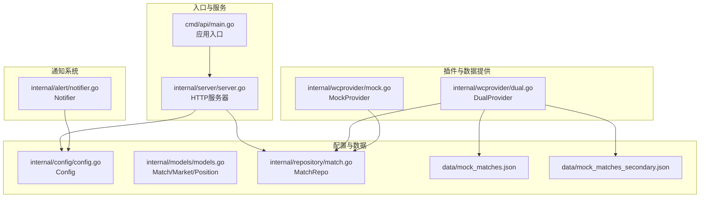
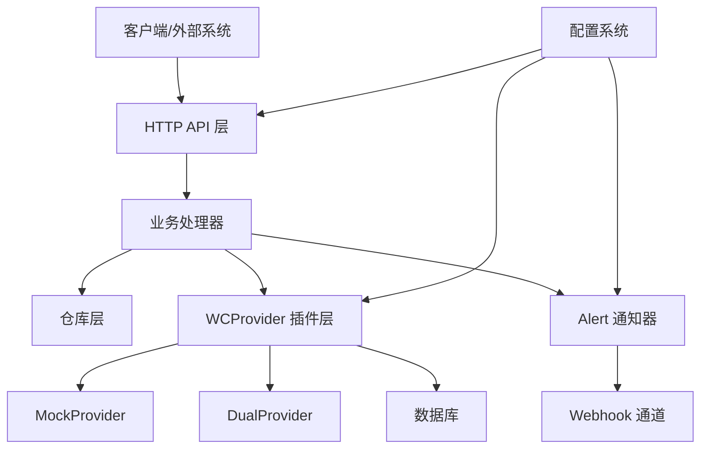
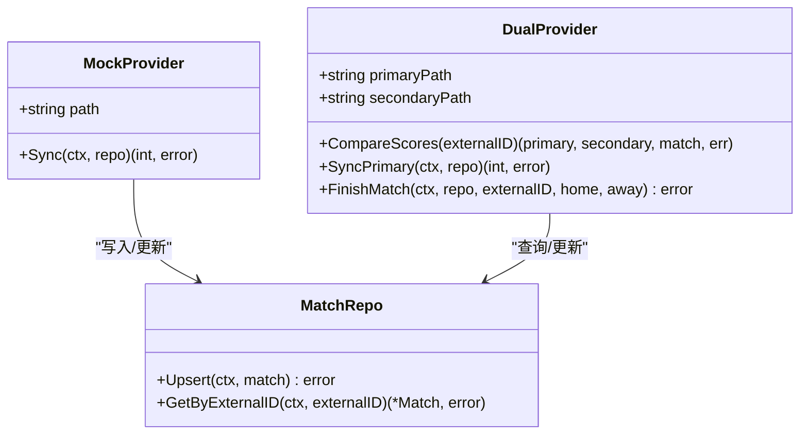
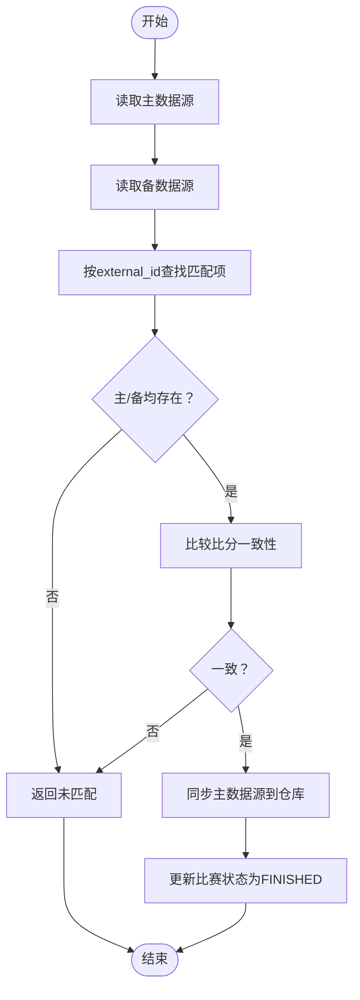
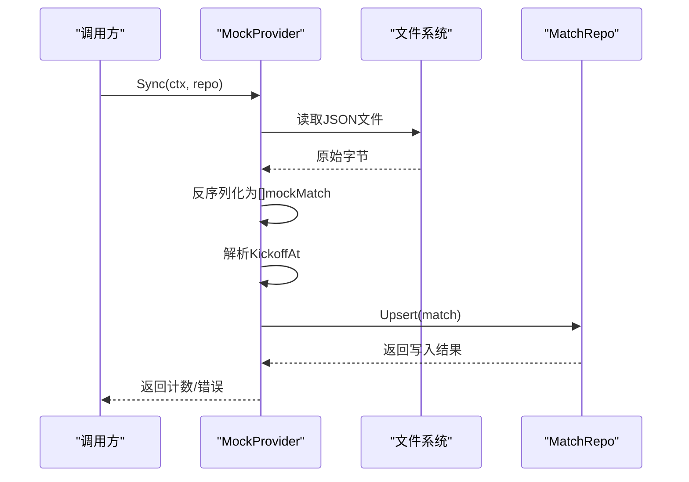
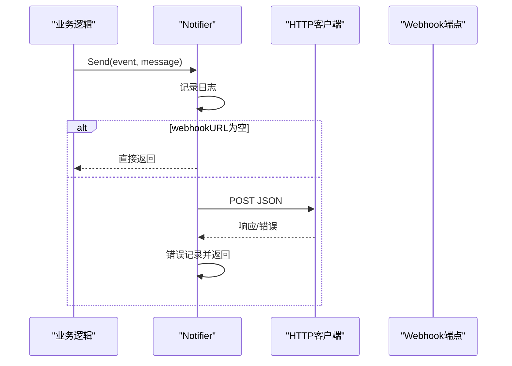
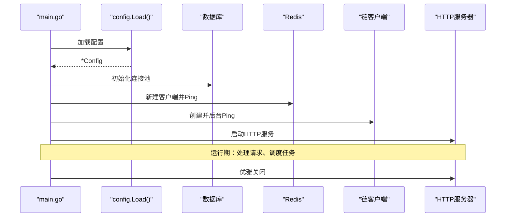
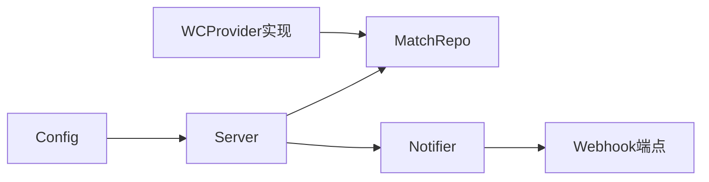

# 插件系统

<cite>
**本文引用的文件**
- [dual.go](file://internal/wcprovider/dual.go)
- [mock.go](file://internal/wcprovider/mock.go)
- [notifier.go](file://internal/alert/notifier.go)
- [config.go](file://internal/config/config.go)
- [models.go](file://internal/models/models.go)
- [match.go](file://internal/repository/match.go)
- [mock_matches.json](file://data/mock_matches.json)
- [mock_matches_secondary.json](file://data/mock_matches_secondary.json)
- [main.go（API入口）](file://cmd/api/main.go)
- [server.go](file://internal/server/server.go)
- [api.go（路由与处理器）](file://internal/handler/api.go)
</cite>

## 目录
1. [简介](#简介)
2. [项目结构](#项目结构)
3. [核心组件](#核心组件)
4. [架构总览](#架构总览)
5. [详细组件分析](#详细组件分析)
6. [依赖关系分析](#依赖关系分析)
7. [性能考量](#性能考量)
8. [故障排查指南](#故障排查指南)
9. [结论](#结论)
10. [附录：扩展指南与最佳实践](#附录扩展指南与最佳实践)

## 简介
本指南面向PredictionDIDSimple的插件系统扩展，重点围绕以下目标展开：
- 深入解析WCProvider接口设计与实现思路，涵盖DualProvider双数据源对比机制与MockProvider模拟数据提供器。
- 详解Alert通知系统的扩展方式，包括新通知渠道集成、自定义告警规则与通知模板配置。
- 提供插件开发最佳实践：接口契约、错误处理、性能优化与测试策略。
- 给出可直接参考的代码片段路径，帮助快速实现自定义WCProvider、AlertNotifier与数据源提供器。
- 阐述插件生命周期管理、配置加载与动态注册机制。

## 项目结构
后端采用分层与按功能域组织的结构，插件相关能力主要集中在以下模块：
- 数据提供与同步：internal/wcprovider（MockProvider、DualProvider）
- 通知系统：internal/alert（Notifier）
- 配置加载：internal/config（Config结构体与环境变量解析）
- 数据模型与仓库：internal/models、internal/repository
- 入口与服务：cmd/api、internal/server
- 路由与业务处理器：internal/handler

图表来源
- [main.go（API入口）](file://cmd/api/main.go#L24-L118)
- [server.go](file://internal/server/server.go#L35-L85)
- [dual.go](file://internal/wcprovider/dual.go#L19-L26)
- [mock.go](file://internal/wcprovider/mock.go#L13-L19)
- [notifier.go](file://internal/alert/notifier.go#L11-L21)
- [config.go](file://internal/config/config.go#L10-L43)
- [models.go](file://internal/models/models.go#L5-L14)
- [match.go](file://internal/repository/match.go#L13-L19)
- [mock_matches.json](file://data/mock_matches.json#L1-L30)
- [mock_matches_secondary.json](file://data/mock_matches_secondary.json#L1-L30)

章节来源
- [main.go（API入口）](file://cmd/api/main.go#L24-L118)
- [server.go](file://internal/server/server.go#L35-L85)

## 核心组件
- WCProvider（抽象接口）：用于统一数据提供器的契约，支持从不同数据源读取比赛数据并进行同步或对比。
- MockProvider：基于本地JSON文件的模拟数据提供器，负责将数据写入数据库仓库。
- DualProvider：双数据源对比提供器，比较主/备两份数据源的比分一致性，并支持完成比赛状态更新。
- AlertNotifier：告警通知器，通过Webhook发送事件消息；可扩展为多渠道通知器。
- 配置系统：集中加载环境变量到Config结构体，驱动各组件初始化与行为。

章节来源
- [dual.go](file://internal/wcprovider/dual.go#L19-L26)
- [mock.go](file://internal/wcprovider/mock.go#L13-L19)
- [notifier.go](file://internal/alert/notifier.go#L11-L21)
- [config.go](file://internal/config/config.go#L10-L43)

## 架构总览
下图展示了插件系统在整体架构中的位置与交互关系：

图表来源
- [server.go](file://internal/server/server.go#L62-L75)
- [api.go（路由与处理器）](file://internal/handler/api.go#L30-L61)
- [dual.go](file://internal/wcprovider/dual.go#L52-L69)
- [mock.go](file://internal/wcprovider/mock.go#L31-L61)
- [notifier.go](file://internal/alert/notifier.go#L23-L35)
- [config.go](file://internal/config/config.go#L45-L96)

## 详细组件分析

### WCProvider接口设计与实现
WCProvider并非显式定义于代码中，但通过DualProvider与MockProvider的行为体现了其职责边界：
- 抽象职责：提供统一的数据同步与对比能力，屏蔽底层数据源差异。
- 关键方法族：
  - 同步：将外部数据写入数据库仓库（如MockProvider.Sync）。
  - 对比：比较主/备两份数据源的比分一致性（如DualProvider.CompareScores）。
  - 结束与归档：根据比分规则更新比赛状态（如DualProvider.FinishMatch）。

图表来源
- [mock.go](file://internal/wcprovider/mock.go#L13-L19)
- [mock.go](file://internal/wcprovider/mock.go#L31-L61)
- [dual.go](file://internal/wcprovider/dual.go#L19-L26)
- [dual.go](file://internal/wcprovider/dual.go#L52-L69)
- [match.go](file://internal/repository/match.go#L68-L82)

章节来源
- [dual.go](file://internal/wcprovider/dual.go#L19-L26)
- [dual.go](file://internal/wcprovider/dual.go#L52-L69)
- [mock.go](file://internal/wcprovider/mock.go#L13-L19)
- [mock.go](file://internal/wcprovider/mock.go#L31-L61)
- [match.go](file://internal/repository/match.go#L68-L82)

### DualProvider双数据源对比机制
DualProvider通过两个JSON文件作为主/备数据源，执行以下流程：
- 加载数据：读取并反序列化JSON为内部结构，过滤掉缺少比分的条目。
- 对比逻辑：以external_id为键，比较主/备两份数据的比分是否一致。
- 同步主源：将主数据源内容同步至数据库仓库。
- 完成比赛：根据比分规则更新比赛状态为“FINISHED”。

图表来源
- [dual.go](file://internal/wcprovider/dual.go#L28-L50)
- [dual.go](file://internal/wcprovider/dual.go#L52-L69)
- [dual.go](file://internal/wcprovider/dual.go#L71-L73)
- [dual.go](file://internal/wcprovider/dual.go#L90-L101)

章节来源
- [dual.go](file://internal/wcprovider/dual.go#L28-L50)
- [dual.go](file://internal/wcprovider/dual.go#L52-L69)
- [dual.go](file://internal/wcprovider/dual.go#L71-L73)
- [dual.go](file://internal/wcprovider/dual.go#L90-L101)

### MockProvider模拟数据提供器
MockProvider负责将本地JSON数据批量写入数据库，核心流程如下：
- 读取文件 -> 反序列化 -> 解析Kickoff时间 -> 构造Match对象 -> 写入仓库（Upsert）。

图表来源
- [mock.go](file://internal/wcprovider/mock.go#L31-L61)
- [match.go](file://internal/repository/match.go#L68-L82)

章节来源
- [mock.go](file://internal/wcprovider/mock.go#L31-L61)
- [match.go](file://internal/repository/match.go#L68-L82)

### Alert通知系统的扩展
当前实现为基于Webhook的通知器，支持：
- 初始化时注入Webhook URL与HTTP客户端超时。
- 发送事件消息，若URL为空则跳过。
- 日志记录与错误降级处理。

扩展方向建议：
- 多渠道通知器：新增Slack、Teams、邮件等通知器，统一接口Send(event, message)。
- 自定义告警规则：基于Match/Market状态变化触发条件（如比分差异、状态变更）。
- 通知模板：支持模板渲染（事件名、消息体、时间戳、外部ID等占位符）。

图表来源
- [notifier.go](file://internal/alert/notifier.go#L23-L35)

章节来源
- [notifier.go](file://internal/alert/notifier.go#L11-L21)
- [notifier.go](file://internal/alert/notifier.go#L23-L35)

### 配置加载与插件生命周期
- 配置加载：Config结构体集中解析环境变量，包含数据库、Redis、链上RPC、索引器轮询、告警Webhook、地理封锁、速率限制等。
- 生命周期：
  - 应用启动：加载配置、执行迁移、建立数据库连接、初始化Redis与链客户端。
  - 插件初始化：根据配置决定是否启用索引器、Oracle客户端等。
  - 运行期：HTTP服务监听、业务请求处理、定时任务（如索引轮询）。
  - 关闭：优雅关闭HTTP服务与资源。

图表来源
- [main.go（API入口）](file://cmd/api/main.go#L25-L98)
- [config.go](file://internal/config/config.go#L45-L96)

章节来源
- [config.go](file://internal/config/config.go#L10-L43)
- [config.go](file://internal/config/config.go#L45-L96)
- [main.go（API入口）](file://cmd/api/main.go#L24-L118)

## 依赖关系分析
- 组件耦合：
  - WCProvider实现依赖MatchRepo进行数据持久化。
  - Alert通知器依赖配置中的Webhook URL。
  - HTTP服务依赖配置与仓库层。
- 外部依赖：
  - 数据库：PostgreSQL（pgx连接池）。
  - 缓存：Redis。
  - 区块链：以太坊RPC与Oracle客户端。
- 接口契约：
  - WCProvider实现需保证幂等性与错误传播。
  - Alert通知器需具备超时控制与失败降级。

图表来源
- [server.go](file://internal/server/server.go#L62-L75)
- [config.go](file://internal/config/config.go#L45-L96)
- [notifier.go](file://internal/alert/notifier.go#L16-L21)

章节来源
- [server.go](file://internal/server/server.go#L62-L75)
- [config.go](file://internal/config/config.go#L45-L96)
- [notifier.go](file://internal/alert/notifier.go#L16-L21)

## 性能考量
- 文件IO与反序列化：Dual/MockProvider在每次对比/同步前会读取并解析JSON，建议：
  - 使用缓存或增量更新策略减少重复解析。
  - 控制文件大小与条目数量，必要时分页或分批处理。
- 数据库写入：Upsert操作在高并发下可能成为瓶颈，建议：
  - 批量写入（批量Upsert）降低事务开销。
  - 合理设置连接池大小与超时。
- 网络请求：Alert通知器的HTTP Post需设置合理超时与重试策略，避免阻塞。
- 配置热更新：当前配置在启动时一次性加载，建议在运行期增加配置变更检测与平滑刷新。

## 故障排查指南
- 配置缺失：
  - DATABASE_URL未设置会导致启动失败，检查环境变量与示例文件。
- 数据源问题：
  - JSON文件格式不正确或字段缺失会导致解析失败，检查mock文件格式与字段映射。
- 数据库异常：
  - Upsert失败通常由约束冲突或连接异常引起，检查表结构与连接池状态。
- 通知失败：
  - Webhook URL为空则不会发送；网络错误会被记录，检查URL与网络连通性。
- 服务不可用：
  - /ready端点会返回DB/Redis/RPC状态，结合日志定位问题。

章节来源
- [config.go](file://internal/config/config.go#L79-L86)
- [mock.go](file://internal/wcprovider/mock.go#L32-L39)
- [match.go](file://internal/repository/match.go#L68-L82)
- [notifier.go](file://internal/alert/notifier.go#L25-L33)
- [main.go（API入口）](file://cmd/api/main.go#L37-L40)

## 结论
本插件系统以清晰的分层与可替换的数据提供器为核心，配合灵活的配置与通知机制，为扩展提供了良好基础。通过实现WCProvider接口、扩展Alert通知器以及完善配置与生命周期管理，可以快速接入新的数据源与通知渠道，满足生产环境的多样化需求。

## 附录：扩展指南与最佳实践

### 如何实现自定义WCProvider
- 设计接口契约（建议）：
  - Sync(ctx, repo) (int, error)：同步数据到仓库。
  - CompareScores(externalID)：对比主/备数据源。
  - FinishMatch(ctx, repo, externalID, home, away)：根据规则更新比赛状态。
- 实现要点：
  - 幂等性：确保多次调用不会产生副作用。
  - 错误处理：区分数据解析错误、网络错误与业务错误。
  - 性能优化：批量写入、缓存热点数据、异步处理。
- 参考实现路径：
  - [dual.go](file://internal/wcprovider/dual.go#L52-L69)
  - [mock.go](file://internal/wcprovider/mock.go#L31-L61)

### 如何扩展Alert通知系统
- 新增通知渠道：
  - 定义统一接口Send(event, message)，实现Slack/Teams/邮件等适配器。
  - 在配置中新增对应URL/凭据字段。
- 自定义告警规则：
  - 基于Match/Market状态变化触发，例如比分差异阈值、状态变更等。
- 通知模板：
  - 支持事件名、消息体、时间戳、外部ID等占位符渲染。
- 参考实现路径：
  - [notifier.go](file://internal/alert/notifier.go#L11-L21)
  - [config.go](file://internal/config/config.go#L36-L70)

### 插件生命周期管理、配置加载与动态注册
- 生命周期：
  - 启动：加载配置、初始化仓库与外部客户端、启动HTTP服务。
  - 运行：处理请求、调度定时任务（如索引轮询）。
  - 关闭：优雅关闭HTTP服务与资源。
- 配置加载：
  - 通过环境变量驱动，集中于Config结构体，便于注入到各组件。
- 动态注册：
  - 当前未见动态注册机制，建议引入工厂模式与插件目录扫描，按需加载实现。

章节来源
- [main.go（API入口）](file://cmd/api/main.go#L24-L118)
- [config.go](file://internal/config/config.go#L45-L96)
- [server.go](file://internal/server/server.go#L35-L85)