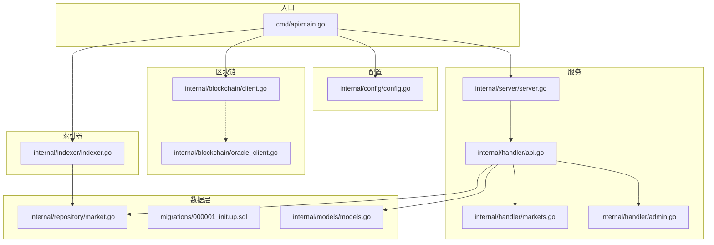
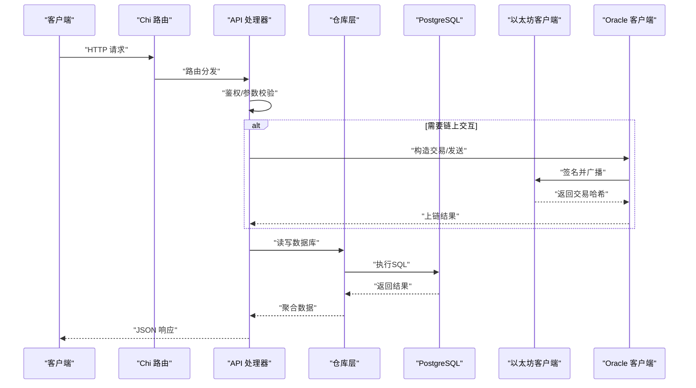
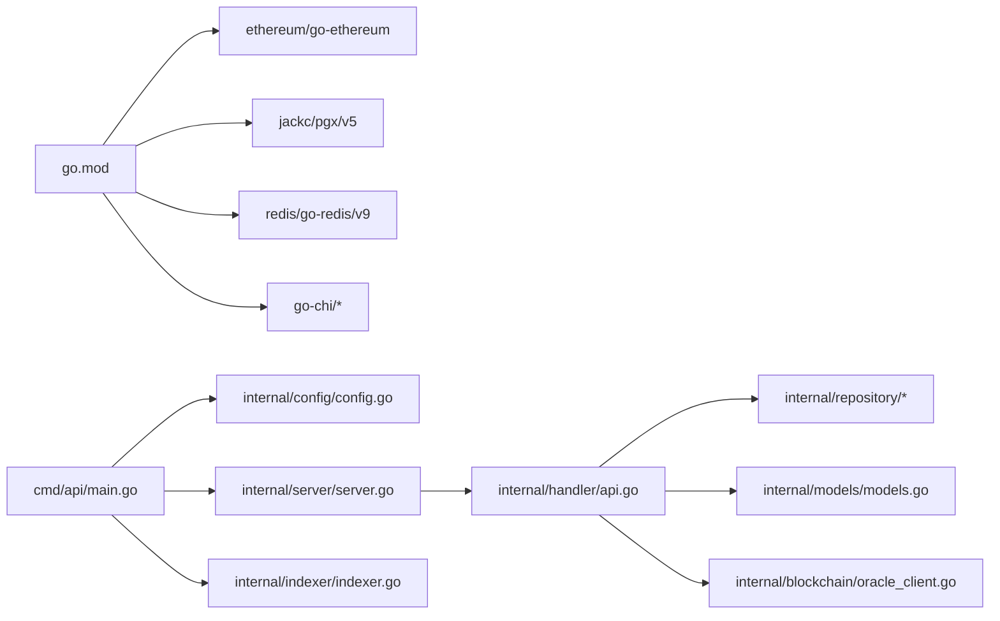

# 新功能开发

<cite>
**本文引用的文件**
- [cmd/api/main.go](file://cmd/api/main.go)
- [internal/config/config.go](file://internal/config/config.go)
- [internal/blockchain/client.go](file://internal/blockchain/client.go)
- [internal/blockchain/oracle_client.go](file://internal/blockchain/oracle_client.go)
- [internal/server/server.go](file://internal/server/server.go)
- [internal/handler/api.go](file://internal/handler/api.go)
- [internal/handler/markets.go](file://internal/handler/markets.go)
- [internal/handler/admin.go](file://internal/handler/admin.go)
- [internal/indexer/indexer.go](file://internal/indexer/indexer.go)
- [internal/repository/market.go](file://internal/repository/market.go)
- [internal/models/models.go](file://internal/models/models.go)
- [internal/auth/middleware.go](file://internal/auth/middleware.go)
- [go.mod](file://go.mod)
- [migrations/000001_init.up.sql](file://migrations/000001_init.up.sql)
</cite>

## 目录
1. [简介](#简介)
2. [项目结构](#项目结构)
3. [核心组件](#核心组件)
4. [架构总览](#架构总览)
5. [详细组件分析](#详细组件分析)
6. [依赖关系分析](#依赖关系分析)
7. [性能考虑](#性能考虑)
8. [故障排查指南](#故障排查指南)
9. [结论](#结论)
10. [附录](#附录)

## 简介
本指南面向PredictionDIDSimple后端系统的新功能开发，围绕“添加新的区块链网络支持”“数据源集成”“API扩展开发”“业务逻辑扩展”四个维度，提供从需求分析、架构设计、代码实现到测试验证的完整流程与最佳实践。文档同时给出可直接定位到源码位置的路径指引，便于快速落地。

## 项目结构
后端采用分层架构：入口程序负责初始化配置、数据库迁移、索引器与服务启动；服务层通过路由注册对外API；处理器层封装业务接口；仓库层负责数据库访问；区块链层对接以太坊生态；索引器监听链上事件并写入数据库；配置模块集中管理环境变量与默认值。

**图表来源**
- [cmd/api/main.go](file://cmd/api/main.go#L24-L118)
- [internal/config/config.go](file://internal/config/config.go#L45-L97)
- [internal/server/server.go](file://internal/server/server.go#L35-L85)
- [internal/handler/api.go](file://internal/handler/api.go#L30-L61)
- [internal/blockchain/client.go](file://internal/blockchain/client.go#L19-L79)
- [internal/blockchain/oracle_client.go](file://internal/blockchain/oracle_client.go#L31-L55)
- [internal/indexer/indexer.go](file://internal/indexer/indexer.go#L35-L58)
- [internal/repository/market.go](file://internal/repository/market.go#L17-L20)
- [internal/models/models.go](file://internal/models/models.go#L5-L58)
- [migrations/000001_init.up.sql](file://migrations/000001_init.up.sql#L1-L10)

**章节来源**
- [cmd/api/main.go](file://cmd/api/main.go#L24-L118)
- [internal/config/config.go](file://internal/config/config.go#L45-L97)

## 核心组件
- 配置加载：集中读取环境变量并解析为运行时配置，支持链ID、RPC地址、合约地址、轮询间隔等关键参数。
- 区块链客户端：封装以太坊连接与健康检查，后台定时校验RPC连通性与链ID一致性。
- Oracle客户端：基于私钥与链ID构造交易上下文，打包ABI调用并发送链上交易，支持等待上链确认。
- 服务与路由：统一注册公开与鉴权路由，注入仓库与区块链客户端，提供限流与跨域中间件。
- 索引器：按区块范围扫描工厂与市场事件，入库匹配、市场、头寸与状态变更。
- 数据模型与仓库：定义市场、匹配、头寸等实体及查询更新操作，支撑API与索引器。

**章节来源**
- [internal/config/config.go](file://internal/config/config.go#L10-L43)
- [internal/blockchain/client.go](file://internal/blockchain/client.go#L12-L79)
- [internal/blockchain/oracle_client.go](file://internal/blockchain/oracle_client.go#L23-L55)
- [internal/server/server.go](file://internal/server/server.go#L26-L85)
- [internal/indexer/indexer.go](file://internal/indexer/indexer.go#L24-L135)
- [internal/repository/market.go](file://internal/repository/market.go#L13-L173)
- [internal/models/models.go](file://internal/models/models.go#L5-L58)

## 架构总览
下图展示从请求进入、鉴权、业务处理到链上交互与数据库持久化的整体流程。

**图表来源**
- [internal/server/server.go](file://internal/server/server.go#L62-L75)
- [internal/handler/api.go](file://internal/handler/api.go#L30-L61)
- [internal/blockchain/oracle_client.go](file://internal/blockchain/oracle_client.go#L111-L137)
- [internal/repository/market.go](file://internal/repository/market.go#L103-L126)

## 详细组件分析

### 添加新的区块链网络支持（网络配置、RPC节点管理、交易签名适配）
目标：在不破坏现有功能的前提下，支持新增链ID、RPC地址与合约地址组合。

- 网络配置
  - 在配置加载中增加新网络的键位，或通过环境变量注入。参考路径：
    - [internal/config/config.go](file://internal/config/config.go#L45-L97)
    - [internal/config/config.go](file://internal/config/config.go#L10-L43)
  - 启动时读取链ID与RPC地址，用于初始化区块链客户端与索引器。
    - [cmd/api/main.go](file://cmd/api/main.go#L61-L62)
    - [cmd/api/main.go](file://cmd/api/main.go#L84-L89)

- RPC节点管理
  - 区块链客户端提供后台心跳检测，定时拉取链ID并校验是否与期望一致。
    - [internal/blockchain/client.go](file://internal/blockchain/client.go#L26-L70)
  - 可扩展为多RPC地址轮询策略：在心跳失败时切换备用地址，或在配置中引入备用RPC字段并在心跳失败时回退。
    - [internal/blockchain/client.go](file://internal/blockchain/client.go#L42-L70)

- 交易签名适配
  - Oracle客户端基于链ID与私钥构造交易上下文，自动估算Gas价格并签名发送。
    - [internal/blockchain/oracle_client.go](file://internal/blockchain/oracle_client.go#L57-L68)
    - [internal/blockchain/oracle_client.go](file://internal/blockchain/oracle_client.go#L111-L137)
  - 新网络需确保链ID正确、私钥可用且RPC支持Gas估算。

- 索引器适配
  - 索引器使用工厂地址与ABI监听事件，需为新网络准备对应ABI与工厂地址。
    - [internal/indexer/indexer.go](file://internal/indexer/indexer.go#L35-L58)
    - [internal/indexer/indexer.go](file://internal/indexer/indexer.go#L137-L155)

- 最佳实践
  - 将链ID与RPC映射抽象为配置表，便于动态扩展。
  - 为每个网络维护独立的ABI与合约地址集合，避免硬编码。
  - 在服务启动阶段进行链ID一致性校验，失败则记录告警并降级。

**章节来源**
- [internal/config/config.go](file://internal/config/config.go#L10-L43)
- [internal/config/config.go](file://internal/config/config.go#L45-L97)
- [internal/blockchain/client.go](file://internal/blockchain/client.go#L26-L70)
- [internal/blockchain/oracle_client.go](file://internal/blockchain/oracle_client.go#L57-L68)
- [internal/blockchain/oracle_client.go](file://internal/blockchain/oracle_client.go#L111-L137)
- [internal/indexer/indexer.go](file://internal/indexer/indexer.go#L35-L58)
- [cmd/api/main.go](file://cmd/api/main.go#L61-L62)
- [cmd/api/main.go](file://cmd/api/main.go#L84-L89)

### 数据源集成（外部API接入、数据格式转换、实时同步）
目标：接入新的外部数据源（如比分、赔率），完成格式转换与实时同步。

- 外部API接入
  - 在入口处新增数据采集任务，周期性拉取外部数据并转换为内部模型。
    - [cmd/api/main.go](file://cmd/api/main.go#L24-L40)
  - 参考现有索引器模式，将外部数据写入数据库或缓存，供API消费。
    - [internal/indexer/indexer.go](file://internal/indexer/indexer.go#L85-L135)

- 数据格式转换
  - 定义与外部API一致的数据结构，再映射到内部模型。
    - [internal/models/models.go](file://internal/models/models.go#L5-L58)
  - 使用仓库层的插入/更新接口，保持幂等与去重。
    - [internal/repository/market.go](file://internal/repository/market.go#L103-L126)

- 实时同步机制
  - 可借鉴索引器的轮询策略，限制单次扫描范围，避免阻塞。
    - [internal/indexer/indexer.go](file://internal/indexer/indexer.go#L106-L135)
  - 对于推送型数据源，可结合Redis发布订阅或WebSocket，降低轮询成本。

- 最佳实践
  - 统一错误处理与重试策略，避免单点故障影响整体。
  - 引入幂等键与时间戳，保证重复数据不会破坏一致性。
  - 对外部API进行速率限制与熔断保护。

**章节来源**
- [cmd/api/main.go](file://cmd/api/main.go#L24-L40)
- [internal/indexer/indexer.go](file://internal/indexer/indexer.go#L85-L135)
- [internal/models/models.go](file://internal/models/models.go#L5-L58)
- [internal/repository/market.go](file://internal/repository/market.go#L103-L126)

### API扩展开发（HTTP端点设计、参数验证、错误处理、版本管理）
目标：新增业务相关HTTP端点，遵循现有规范。

- 路由注册
  - 在API路由集中注册新端点，区分公开与受保护路由。
    - [internal/handler/api.go](file://internal/handler/api.go#L30-L61)

- 参数验证
  - 使用统一的查询参数解析函数，提供默认值与类型转换。
    - [internal/handler/api.go](file://internal/handler/api.go#L73-L83)
  - 对ID解析与JWT鉴权进行前置校验。
    - [internal/handler/api.go](file://internal/handler/api.go#L85-L87)
    - [internal/auth/middleware.go](file://internal/auth/middleware.go#L13-L31)

- 错误处理
  - 统一输出JSON错误响应，避免泄露内部细节。
    - [internal/handler/api.go](file://internal/handler/api.go#L69-L71)

- 版本管理
  - 建议在路由前缀中加入版本号（如/v1），并保留向后兼容的迁移策略。
  - 在响应中附带版本信息，便于前端适配。
    - [internal/handler/markets.go](file://internal/handler/markets.go#L18-L22)

- 示例端点设计
  - 列表/详情：复用现有分页与鉴权模式。
    - [internal/handler/markets.go](file://internal/handler/markets.go#L9-L23)
  - 管理端：使用管理员中间件保护。
    - [internal/handler/admin.go](file://internal/handler/admin.go#L50-L77)

**章节来源**
- [internal/handler/api.go](file://internal/handler/api.go#L30-L61)
- [internal/handler/api.go](file://internal/handler/api.go#L69-L87)
- [internal/auth/middleware.go](file://internal/auth/middleware.go#L13-L31)
- [internal/handler/markets.go](file://internal/handler/markets.go#L9-L23)
- [internal/handler/admin.go](file://internal/handler/admin.go#L50-L77)

### 业务逻辑扩展（新的市场类型、交易机制、结算流程）
目标：在现有市场模型基础上扩展业务能力。

- 新的市场类型
  - 在模型中扩展字段（如市场类型、结果计数、结算规则）。
    - [internal/models/models.go](file://internal/models/models.go#L16-L40)
  - 在仓库层新增查询与更新逻辑，支持按类型筛选与批量处理。
    - [internal/repository/market.go](file://internal/repository/market.go#L21-L65)
    - [internal/repository/market.go](file://internal/repository/market.go#L146-L172)

- 交易机制
  - 若涉及链上交易，复用Oracle客户端的签名与广播流程。
    - [internal/blockchain/oracle_client.go](file://internal/blockchain/oracle_client.go#L111-L137)
  - 对于离线交易，通过仓库层的头寸与池子更新接口实现。
    - [internal/repository/market.go](file://internal/repository/market.go#L174-L180)

- 结算流程
  - 解决市场时更新状态与胜出结果，必要时清空池子。
    - [internal/repository/market.go](file://internal/repository/market.go#L119-L126)
  - 索引器监听已解决事件并触发结算逻辑。
    - [internal/indexer/indexer.go](file://internal/indexer/indexer.go#L262-L269)

- 最佳实践
  - 保持领域模型稳定，通过配置驱动行为差异。
  - 对关键流程增加幂等与回滚策略，确保一致性。

**章节来源**
- [internal/models/models.go](file://internal/models/models.go#L16-L40)
- [internal/repository/market.go](file://internal/repository/market.go#L21-L65)
- [internal/repository/market.go](file://internal/repository/market.go#L119-L180)
- [internal/blockchain/oracle_client.go](file://internal/blockchain/oracle_client.go#L111-L137)
- [internal/indexer/indexer.go](file://internal/indexer/indexer.go#L262-L269)

## 依赖关系分析
- 外部依赖集中在以太坊生态与数据库生态，版本锁定在go.mod中。
- 内部模块耦合度低，通过接口与仓库层解耦服务与数据访问。

**图表来源**
- [go.mod](file://go.mod#L5-L14)
- [cmd/api/main.go](file://cmd/api/main.go#L24-L118)
- [internal/server/server.go](file://internal/server/server.go#L35-L85)
- [internal/handler/api.go](file://internal/handler/api.go#L16-L28)
- [internal/repository/market.go](file://internal/repository/market.go#L13-L20)
- [internal/models/models.go](file://internal/models/models.go#L5-L58)
- [internal/blockchain/oracle_client.go](file://internal/blockchain/oracle_client.go#L23-L55)
- [internal/indexer/indexer.go](file://internal/indexer/indexer.go#L24-L58)

**章节来源**
- [go.mod](file://go.mod#L5-L14)

## 性能考虑
- 索引器轮询窗口控制：限制每次扫描区块数量，避免长时间阻塞。
  - [internal/indexer/indexer.go](file://internal/indexer/indexer.go#L122-L126)
- 数据库连接池与事务：合理设置并发与超时，避免长事务占用资源。
  - [cmd/api/main.go](file://cmd/api/main.go#L42-L46)
- 缓存与热点数据：对高频查询结果进行缓存，减少数据库压力。
  - [cmd/api/main.go](file://cmd/api/main.go#L48-L59)
- 链上交互批量化：合并多次调用，降低Gas消耗与上链延迟。
  - [internal/blockchain/oracle_client.go](file://internal/blockchain/oracle_client.go#L111-L137)

## 故障排查指南
- 配置错误
  - 检查必需环境变量是否齐全，链ID与RPC地址是否匹配。
    - [internal/config/config.go](file://internal/config/config.go#L79-L96)
- RPC不可达
  - 查看后台心跳日志，确认链ID一致性与连通性。
    - [internal/blockchain/client.go](file://internal/blockchain/client.go#L42-L70)
- 交易未上链
  - 检查私钥、链ID与Gas估算，确认交易哈希并等待确认。
    - [internal/blockchain/oracle_client.go](file://internal/blockchain/oracle_client.go#L111-L137)
    - [internal/blockchain/oracle_client.go](file://internal/blockchain/oracle_client.go#L139-L156)
- 索引器停滞
  - 核对起始区块与轮询间隔，检查事件ABI与合约地址。
    - [internal/indexer/indexer.go](file://internal/indexer/indexer.go#L85-L135)
    - [internal/indexer/indexer.go](file://internal/indexer/indexer.go#L137-L155)

**章节来源**
- [internal/config/config.go](file://internal/config/config.go#L79-L96)
- [internal/blockchain/client.go](file://internal/blockchain/client.go#L42-L70)
- [internal/blockchain/oracle_client.go](file://internal/blockchain/oracle_client.go#L111-L156)
- [internal/indexer/indexer.go](file://internal/indexer/indexer.go#L85-L155)

## 结论
通过模块化设计与清晰的职责边界，PredictionDIDSimple具备良好的扩展性。新增网络、数据源与业务功能的关键在于：配置中心化、链上交互标准化、数据模型与仓库层解耦、以及完善的错误处理与监控。建议在开发过程中严格遵循现有中间件与路由规范，确保新功能与既有系统无缝衔接。

## 附录
- 开发流程建议
  - 需求分析 → 架构设计 → 配置与ABI准备 → 仓库与模型扩展 → 路由与处理器实现 → 链上交互适配 → 测试与验证 → 上线与监控
- 关键路径速查
  - 配置加载与校验：[internal/config/config.go](file://internal/config/config.go#L45-L97)
  - 服务与路由：[internal/server/server.go](file://internal/server/server.go#L35-L85)、[internal/handler/api.go](file://internal/handler/api.go#L30-L61)
  - 区块链交互：[internal/blockchain/client.go](file://internal/blockchain/client.go#L26-L70)、[internal/blockchain/oracle_client.go](file://internal/blockchain/oracle_client.go#L111-L137)
  - 索引器：[internal/indexer/indexer.go](file://internal/indexer/indexer.go#L85-L135)
  - 数据模型与仓库：[internal/models/models.go](file://internal/models/models.go#L5-L58)、[internal/repository/market.go](file://internal/repository/market.go#L103-L180)
  - 入口与迁移：[cmd/api/main.go](file://cmd/api/main.go#L24-L40)、[migrations/000001_init.up.sql](file://migrations/000001_init.up.sql#L1-L10)