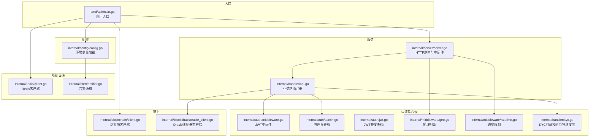
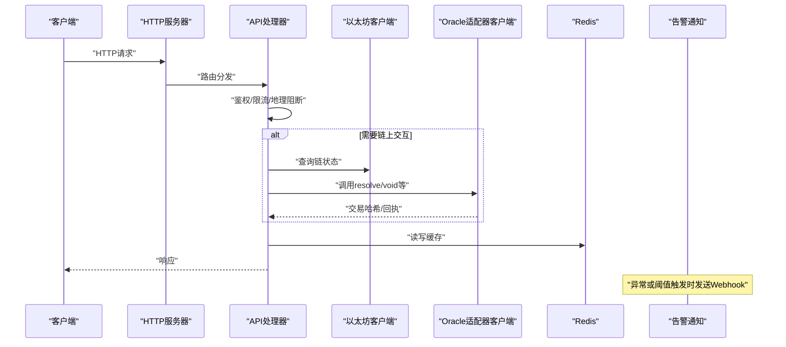
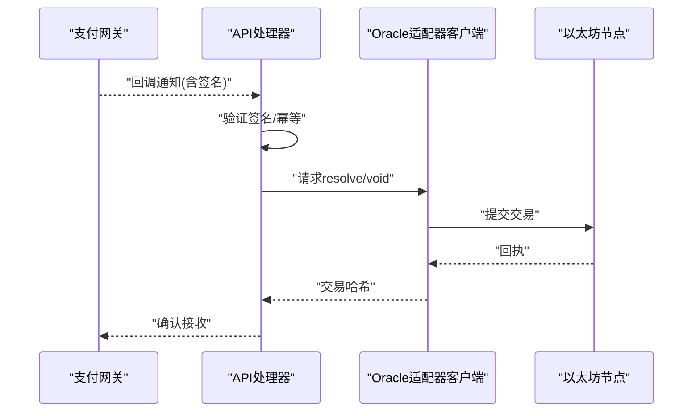
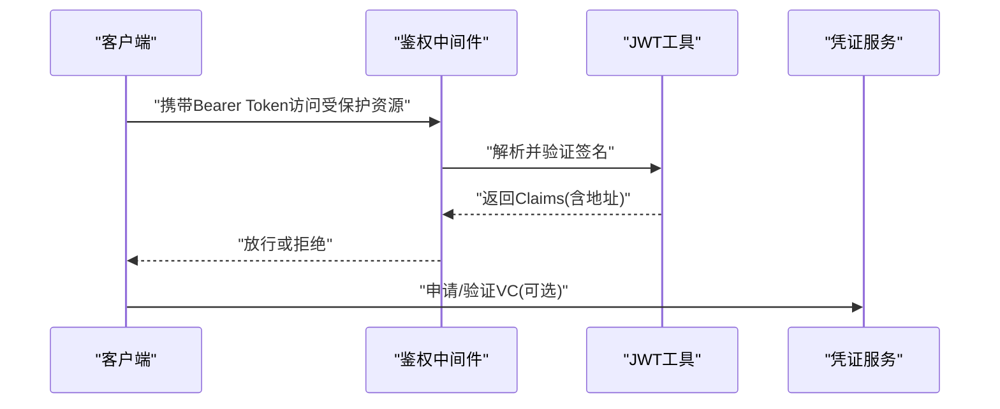
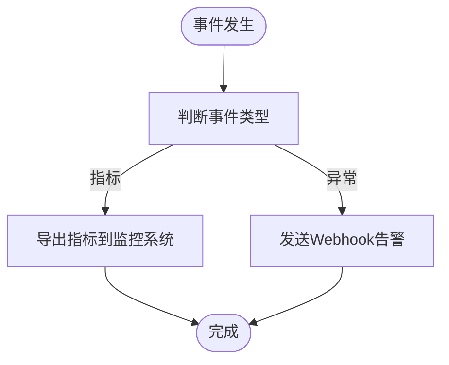
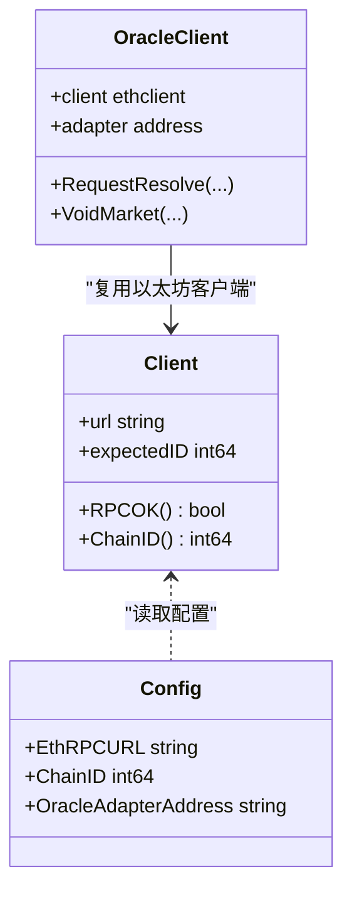
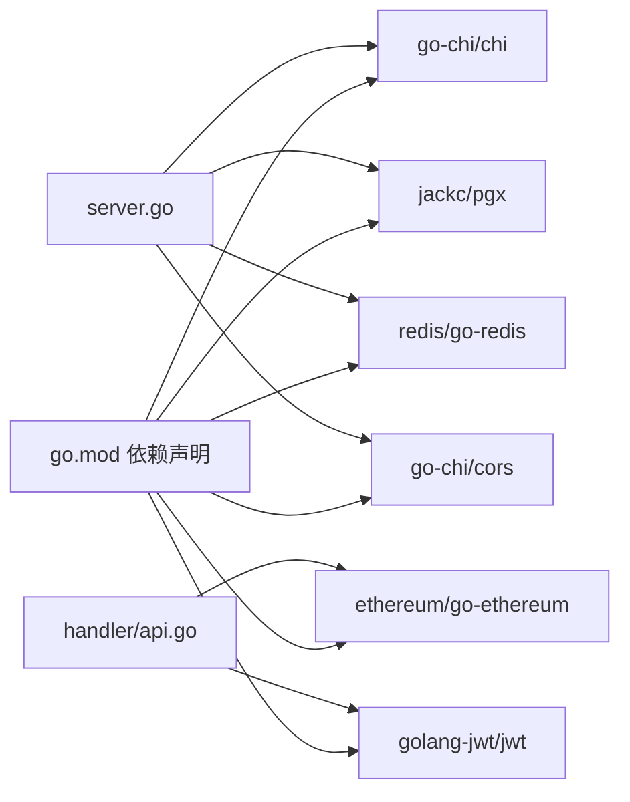

# 第三方集成

<cite>
**本文引用的文件**
- [cmd/api/main.go](file://cmd/api/main.go)
- [internal/config/config.go](file://internal/config/config.go)
- [internal/server/server.go](file://internal/server/server.go)
- [internal/handler/api.go](file://internal/handler/api.go)
- [internal/blockchain/client.go](file://internal/blockchain/client.go)
- [internal/blockchain/oracle_client.go](file://internal/blockchain/oracle_client.go)
- [internal/redis/client.go](file://internal/redis/client.go)
- [internal/alert/notifier.go](file://internal/alert/notifier.go)
- [internal/auth/middleware.go](file://internal/auth/middleware.go)
- [internal/auth/admin.go](file://internal/auth/admin.go)
- [internal/auth/jwt.go](file://internal/auth/jwt.go)
- [internal/middleware/ratelimit.go](file://internal/middleware/ratelimit.go)
- [internal/middleware/geo.go](file://internal/middleware/geo.go)
- [internal/handler/kyc.go](file://internal/handler/kyc.go)
- [go.mod](file://go.mod)
</cite>

## 目录
1. [简介](#简介)
2. [项目结构](#项目结构)
3. [核心组件](#核心组件)
4. [架构总览](#架构总览)
5. [详细组件分析](#详细组件分析)
6. [依赖关系分析](#依赖关系分析)
7. [性能考量](#性能考量)
8. [故障排查指南](#故障排查指南)
9. [结论](#结论)
10. [附录](#附录)

## 简介
本技术指南面向PredictionDIDSimple的第三方集成场景，围绕以下目标展开：支付网关与资金结算（基于现有链上适配器模式）、身份提供商（OAuth/SIWE/SAML扩展思路）、数据分析与监控（指标与告警）、以及区块链网络扩展（侧链/跨链/多链资产管理）。文档提供可操作的集成步骤、配置参数说明与API接口清单，并给出安全与可靠性最佳实践。

## 项目结构
后端采用模块化分层设计：入口程序负责初始化配置、数据库迁移、索引器与服务启动；服务层通过路由注册业务API；业务层调用存储与链上客户端；中间件提供限流、地理阻断与CORS；配置中心集中管理运行时参数。

图表来源
- [cmd/api/main.go](file://cmd/api/main.go#L24-L118)
- [internal/config/config.go](file://internal/config/config.go#L45-L97)
- [internal/server/server.go](file://internal/server/server.go#L35-L85)
- [internal/handler/api.go](file://internal/handler/api.go#L30-L61)
- [internal/blockchain/client.go](file://internal/blockchain/client.go#L19-L79)
- [internal/blockchain/oracle_client.go](file://internal/blockchain/oracle_client.go#L31-L55)
- [internal/redis/client.go](file://internal/redis/client.go#L10-L23)
- [internal/alert/notifier.go](file://internal/alert/notifier.go#L16-L36)
- [internal/auth/middleware.go](file://internal/auth/middleware.go#L13-L31)
- [internal/auth/admin.go](file://internal/auth/admin.go#L8-L26)
- [internal/auth/jwt.go](file://internal/auth/jwt.go#L16-L43)
- [internal/middleware/ratelimit.go](file://internal/middleware/ratelimit.go#L36-L55)
- [internal/middleware/geo.go](file://internal/middleware/geo.go#L10-L31)
- [internal/handler/kyc.go](file://internal/handler/kyc.go#L14-L55)

章节来源
- [cmd/api/main.go](file://cmd/api/main.go#L24-L118)
- [internal/config/config.go](file://internal/config/config.go#L45-L97)
- [internal/server/server.go](file://internal/server/server.go#L35-L85)

## 核心组件
- 配置中心：集中读取环境变量，提供链上地址、密钥、轮询周期、合规开关等参数。
- 服务层：注册健康检查、市场/匹配查询、统计、事件流、指标、认证与管理员接口。
- 链上客户端：通用以太坊节点连接与心跳检测；Oracle适配器用于链上决议与作废等操作。
- 中间件：CORS、速率限制、地理阻断、管理员鉴权、JWT鉴权。
- 基础设施：Redis连接与心跳；告警Webhook通知。
- 合规与凭证：KYC回调签名验证与通过后发放VC。

章节来源
- [internal/config/config.go](file://internal/config/config.go#L10-L43)
- [internal/handler/api.go](file://internal/handler/api.go#L16-L28)
- [internal/blockchain/client.go](file://internal/blockchain/client.go#L12-L17)
- [internal/blockchain/oracle_client.go](file://internal/blockchain/oracle_client.go#L23-L29)
- [internal/middleware/ratelimit.go](file://internal/middleware/ratelimit.go#L10-L15)
- [internal/middleware/geo.go](file://internal/middleware/geo.go#L10-L15)
- [internal/auth/admin.go](file://internal/auth/admin.go#L8-L15)
- [internal/auth/middleware.go](file://internal/auth/middleware.go#L13-L21)
- [internal/alert/notifier.go](file://internal/alert/notifier.go#L16-L21)

## 架构总览
下图展示从请求到链上交互的关键路径，以及与外部系统的集成点（如KYC供应商、监控与告警）。

图表来源
- [internal/server/server.go](file://internal/server/server.go#L35-L85)
- [internal/handler/api.go](file://internal/handler/api.go#L30-L61)
- [internal/blockchain/client.go](file://internal/blockchain/client.go#L26-L70)
- [internal/blockchain/oracle_client.go](file://internal/blockchain/oracle_client.go#L95-L137)
- [internal/alert/notifier.go](file://internal/alert/notifier.go#L23-L35)

## 详细组件分析

### 支付网关与资金结算（基于链上适配器）
当前系统通过Oracle适配器在链上执行市场决议与作废，资金结算遵循链上合约逻辑。第三方支付网关可按如下方式对接：

- 新增支付处理器对接
  - 在业务层新增支付网关适配器，封装其SDK/HTTP客户端与回调签名验证。
  - 将支付订单状态与链上市场状态解耦：支付成功后由业务层触发链上决议流程。
  - 使用管理员鉴权保护相关接口，避免未授权调用。
- 回调处理
  - 提供独立回调端点，接收支付网关异步通知；进行签名验证与幂等处理。
  - 成功回调后，调用Oracle适配器发起链上resolve/void等操作，并记录交易哈希。
- 资金结算机制
  - 结算逻辑由链上合约实现；服务层仅负责触发与追踪交易状态。
  - 对于链上失败或超时，结合告警Webhook进行人工干预提示。

图表来源
- [internal/handler/api.go](file://internal/handler/api.go#L30-L61)
- [internal/blockchain/oracle_client.go](file://internal/blockchain/oracle_client.go#L95-L137)

章节来源
- [internal/handler/api.go](file://internal/handler/api.go#L30-L61)
- [internal/blockchain/oracle_client.go](file://internal/blockchain/oracle_client.go#L31-L55)

### 身份提供商集成（OAuth/SIWE/SAML）
系统已内置SIWE登录与JWT鉴权，可作为OAuth/SAML扩展的基础。

- SIWE登录
  - 客户端引导用户签名消息，服务端使用SIWE库验证；成功后签发JWT。
  - 可在JWT中携带用户地址，配合鉴权中间件保护受保护路由。
- OAuth提供商接入
  - 引入OAuth SDK，完成授权码交换与用户信息获取。
  - 将OAuth用户标识映射到系统内用户模型，必要时生成对应钱包地址并绑定DID。
- SAML集成
  - 通过SAML IdP获取断言，解析属性声明映射到用户模型。
  - 与JWT中间件结合，颁发短期访问令牌。
- 多因素认证（MFA）
  - 在登录流程中增加TOTP/短信验证码校验环节。
  - 通过管理员接口对高风险账户启用MFA策略。

图表来源
- [internal/auth/middleware.go](file://internal/auth/middleware.go#L13-L31)
- [internal/auth/jwt.go](file://internal/auth/jwt.go#L28-L43)
- [internal/handler/api.go](file://internal/handler/api.go#L43-L51)

章节来源
- [internal/auth/middleware.go](file://internal/auth/middleware.go#L13-L31)
- [internal/auth/jwt.go](file://internal/auth/jwt.go#L16-L43)
- [internal/handler/api.go](file://internal/handler/api.go#L43-L51)

### 数据分析服务集成（监控、日志与指标）
系统提供指标端点与告警Webhook，便于对接Prometheus/Grafana与企业监控平台。

- 指标上报
  - 访问指标端点获取内部运行指标，供Prometheus抓取。
  - 可在业务层扩展自定义指标（如请求耗时、错误率、链上交易成功率）。
- 日志收集
  - 服务端统一使用结构化日志中间件，建议接入集中式日志系统（ELK/Cloud Logging）。
- 告警集成
  - 配置告警Webhook URL，异常事件自动推送至外部告警平台。
  - 结合速率限制与地理阻断中间件，过滤误报并定位攻击源。

图表来源
- [internal/server/server.go](file://internal/server/server.go#L55-L60)
- [internal/alert/notifier.go](file://internal/alert/notifier.go#L23-L35)

章节来源
- [internal/server/server.go](file://internal/server/server.go#L55-L60)
- [internal/alert/notifier.go](file://internal/alert/notifier.go#L16-L36)

### 区块链网络扩展（侧链/跨链/多链资产）
系统通过以太坊客户端与Oracle适配器实现链上交互，可扩展至多链与跨链场景。

- 侧链集成
  - 为每条侧链实例化独立的以太坊客户端与Oracle适配器客户端。
  - 通过配置中心注入不同RPC与合约地址，按链ID区分。
- 跨链桥接
  - 在业务层引入跨链桥合约地址与ABI，封装跨链调用。
  - 通过管理员接口触发跨链事件，记录跨链交易哈希并在目标链追踪回执。
- 多链资产管理
  - 维护链ID到合约地址映射表，查询/交易时按链选择对应客户端。
  - 对链上状态变化进行索引与缓存，降低重复查询成本。

图表来源
- [internal/blockchain/client.go](file://internal/blockchain/client.go#L12-L17)
- [internal/blockchain/oracle_client.go](file://internal/blockchain/oracle_client.go#L23-L29)
- [internal/config/config.go](file://internal/config/config.go#L10-L43)

章节来源
- [internal/blockchain/client.go](file://internal/blockchain/client.go#L19-L79)
- [internal/blockchain/oracle_client.go](file://internal/blockchain/oracle_client.go#L31-L55)
- [internal/config/config.go](file://internal/config/config.go#L45-L97)

## 依赖关系分析
- 运行时依赖：HTTP路由框架、PostgreSQL连接池、Redis客户端、以太坊客户端、JWT库、CORS中间件。
- 关键耦合点：服务层依赖配置中心与存储仓库；业务层依赖链上客户端；鉴权中间件贯穿所有路由。

图表来源
- [go.mod](file://go.mod#L5-L14)
- [internal/server/server.go](file://internal/server/server.go#L9-L20)
- [internal/handler/api.go](file://internal/handler/api.go#L3-L14)

章节来源
- [go.mod](file://go.mod#L5-L14)
- [internal/server/server.go](file://internal/server/server.go#L35-L85)
- [internal/handler/api.go](file://internal/handler/api.go#L16-L28)

## 性能考量
- 链上交互
  - 使用PendingNonce估算与GasPrice建议降低失败重试成本。
  - 对高频查询结果进行Redis缓存，设置合理TTL。
- 服务端
  - 启用速率限制与地理阻断，避免DDoS与地区合规风险。
  - 指标端点与健康检查不参与速率限制，保障可观测性。
- 存储
  - 批量写入与事务合并，减少数据库往返。
  - 对热点数据建立索引，避免全表扫描。

## 故障排查指南
- 链上RPC不可达
  - 检查RPC URL与链ID配置是否匹配；查看后台心跳日志。
- 交易失败或超时
  - 使用交易哈希在链上浏览器查询；结合等待回执逻辑定位Revert原因。
- 鉴权失败
  - 确认Authorization头格式与JWT密钥一致；检查过期时间。
- 管理员接口403
  - 确认X-Admin-Key或Authorization头中的Bearer值与配置一致。
- 地区受限
  - 检查地理阻断开关与被屏蔽国家列表；确认请求头Country字段来源。
- 速率限制
  - 调整每分钟限额或优化客户端重试策略。

章节来源
- [internal/blockchain/client.go](file://internal/blockchain/client.go#L42-L70)
- [internal/blockchain/oracle_client.go](file://internal/blockchain/oracle_client.go#L139-L156)
- [internal/auth/middleware.go](file://internal/auth/middleware.go#L17-L26)
- [internal/auth/admin.go](file://internal/auth/admin.go#L15-L22)
- [internal/middleware/geo.go](file://internal/middleware/geo.go#L17-L27)
- [internal/middleware/ratelimit.go](file://internal/middleware/ratelimit.go#L24-L34)

## 结论
通过现有链上适配器与中间件体系，PredictionDIDSimple具备良好的第三方集成扩展能力。支付网关可按回调与链上触发模式对接；身份提供商可基于SIWE/JWT扩展；监控与告警可无缝接入企业运维体系；区块链网络可通过多链客户端与配置中心实现横向扩展。建议在生产环境强化密钥管理、审计日志与安全测试，确保集成的安全性与可靠性。

## 附录

### 集成步骤与配置参数

- 支付网关对接
  - 步骤
    - 在业务层新增支付适配器与回调端点。
    - 实现签名验证与幂等处理。
    - 成功后调用Oracle适配器发起链上决议。
  - 关键配置
    - 管理员密钥：用于保护管理端接口。
    - Oracle私钥与适配器地址：用于链上交易签名与调用。
    - 链ID与RPC URL：确保链上交互正确性。
  - 相关接口
    - 管理员接口组：列出/注册/作废市场、重试任务等。
    - 事件流：实时推送比分/事件更新。

- 身份提供商集成
  - 步骤
    - 引入OAuth/SAML SDK，完成授权与断言解析。
    - 与JWT中间件结合，颁发短期访问令牌。
    - 受保护路由需携带有效Token。
  - 关键配置
    - JWT密钥：用于签发与验证。
    - SIWE域名与URI：用于SIWE登录。
  - 相关接口
    - SIWE登录与VC验证接口。

- 数据分析服务集成
  - 步骤
    - 配置告警Webhook URL。
    - 暴露指标端点供Prometheus抓取。
    - 统一结构化日志输出。
  - 关键配置
    - 指标端点、告警Webhook URL、日志级别。

- 区块链网络扩展
  - 步骤
    - 为每条链实例化客户端与适配器。
    - 通过配置中心切换RPC与合约地址。
    - 在业务层按链ID路由到对应客户端。
  - 关键配置
    - 多RPC URL与链ID映射。
    - Oracle适配器地址与私钥。

章节来源
- [internal/config/config.go](file://internal/config/config.go#L45-L97)
- [internal/handler/api.go](file://internal/handler/api.go#L30-L61)
- [internal/server/server.go](file://internal/server/server.go#L55-L75)
- [internal/alert/notifier.go](file://internal/alert/notifier.go#L16-L36)