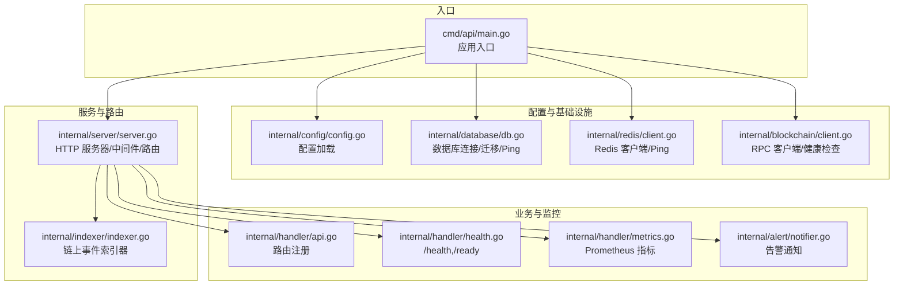
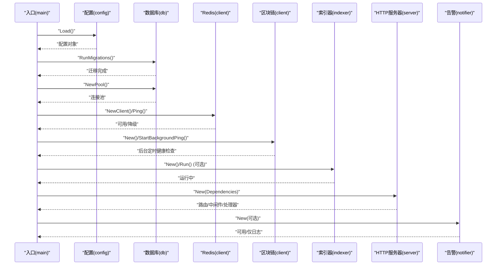
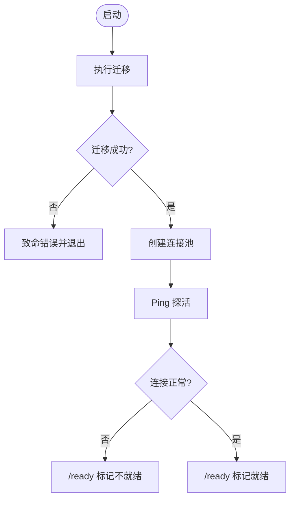
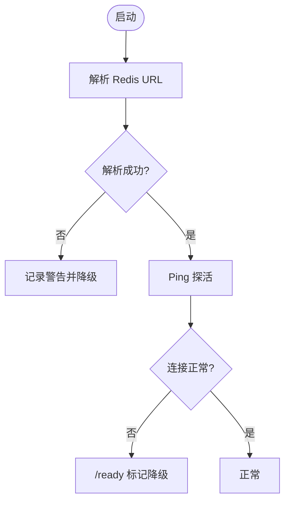
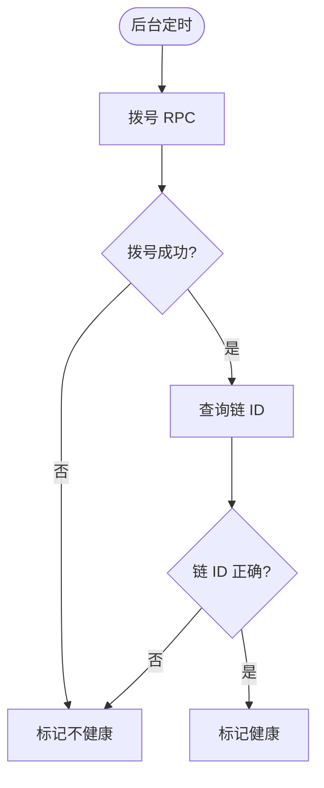
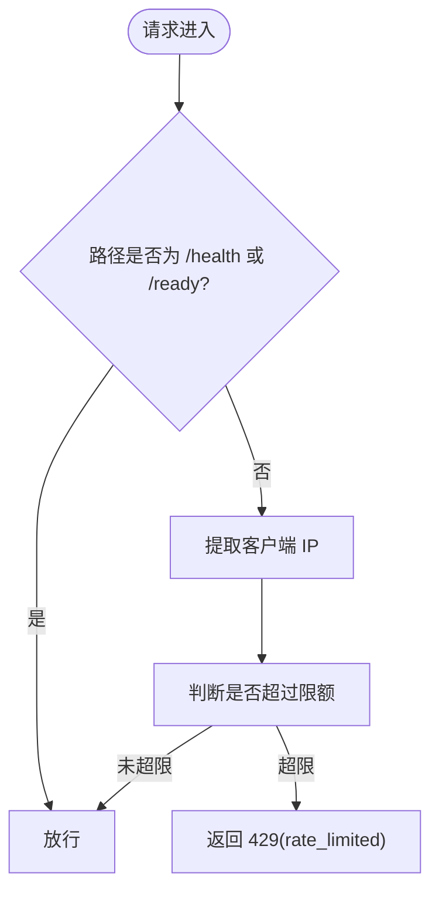
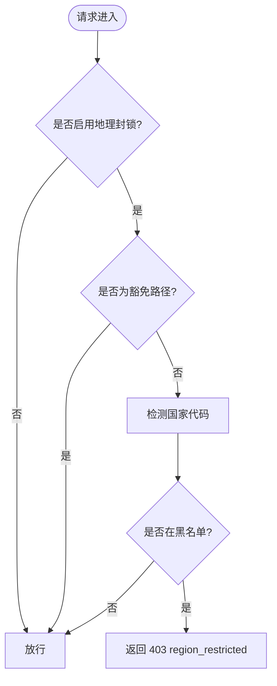
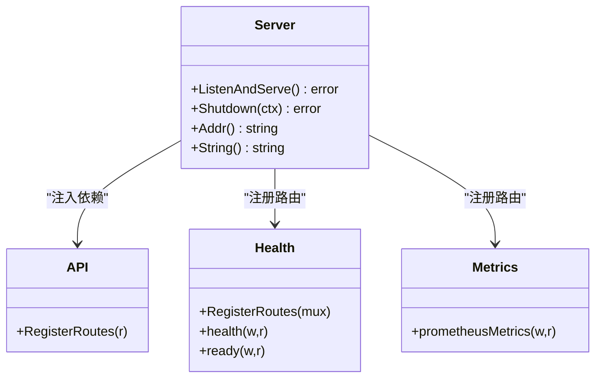
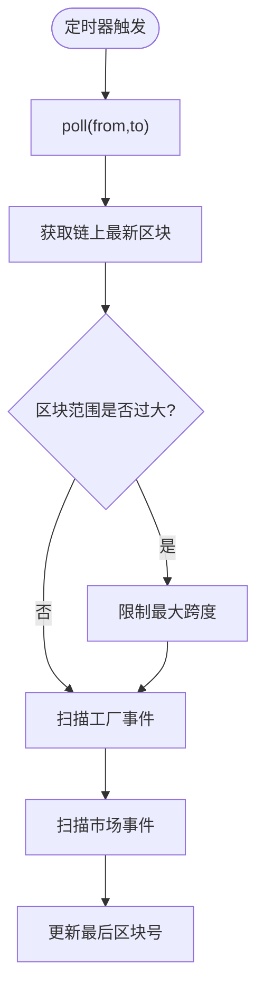
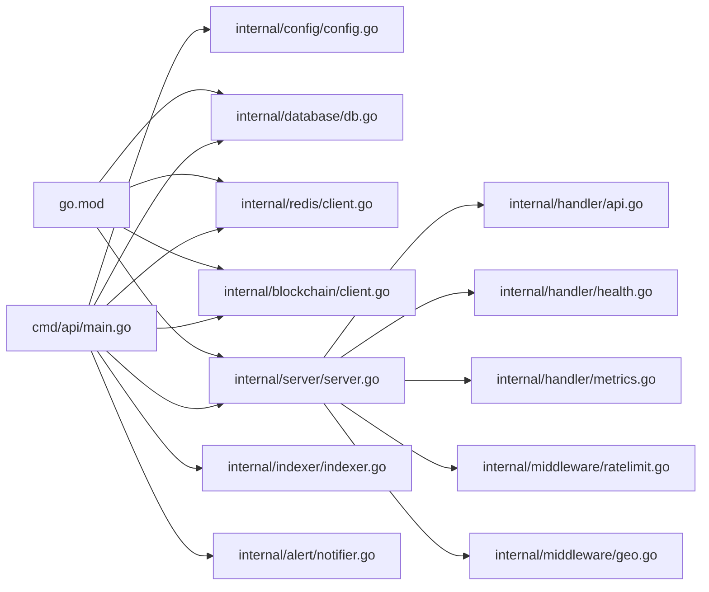

# 故障排除

<cite>
**本文档引用的文件**
- [cmd/api/main.go](file://cmd/api/main.go)
- [internal/config/config.go](file://internal/config/config.go)
- [internal/database/db.go](file://internal/database/db.go)
- [internal/redis/client.go](file://internal/redis/client.go)
- [internal/blockchain/client.go](file://internal/blockchain/client.go)
- [internal/server/server.go](file://internal/server/server.go)
- [internal/middleware/ratelimit.go](file://internal/middleware/ratelimit.go)
- [internal/middleware/geo.go](file://internal/middleware/geo.go)
- [internal/alert/notifier.go](file://internal/alert/notifier.go)
- [internal/indexer/indexer.go](file://internal/indexer/indexer.go)
- [internal/handler/api.go](file://internal/handler/api.go)
- [internal/handler/health.go](file://internal/handler/health.go)
- [internal/handler/metrics.go](file://internal/handler/metrics.go)
- [go.mod](file://go.mod)
</cite>

## 目录
1. [简介](#简介)
2. [项目结构](#项目结构)
3. [核心组件](#核心组件)
4. [架构总览](#架构总览)
5. [详细组件分析](#详细组件分析)
6. [依赖分析](#依赖分析)
7. [性能考虑](#性能考虑)
8. [故障排除指南](#故障排除指南)
9. [结论](#结论)
10. [附录](#附录)

## 简介
本指南面向 PredictionDIDSimple 后端服务的运维与开发人员，聚焦于常见故障的定位与修复方法，涵盖数据库连接、区块链同步、认证失败、API 限流、日志与调试、性能优化、监控指标解读、紧急恢复与备用方案，以及针对不同技术栈（Go/HTTP、PostgreSQL、Redis、以太坊 RPC）的具体问题处理建议。

## 项目结构
后端采用多命令入口（cmd/*）与清晰的分层设计（internal/*），核心入口在 API 服务，负责加载配置、执行数据库迁移、建立数据库与 Redis 连接、启动区块链客户端与索引器、构建 HTTP 服务器并注册路由。

**图表来源**
- [cmd/api/main.go:27-161](file://cmd/api/main.go#L27-L161)
- [internal/config/config.go:49-104](file://internal/config/config.go#L49-L104)
- [internal/database/db.go:16-50](file://internal/database/db.go#L16-L50)
- [internal/redis/client.go:12-28](file://internal/redis/client.go#L12-L28)
- [internal/blockchain/client.go:30-94](file://internal/blockchain/client.go#L30-L94)
- [internal/server/server.go:44-102](file://internal/server/server.go#L44-L102)
- [internal/indexer/indexer.go:97-120](file://internal/indexer/indexer.go#L97-L120)
- [internal/handler/api.go:33-69](file://internal/handler/api.go#L33-L69)
- [internal/handler/health.go:20-77](file://internal/handler/health.go#L20-L77)
- [internal/handler/metrics.go:9-36](file://internal/handler/metrics.go#L9-L36)
- [internal/alert/notifier.go:19-46](file://internal/alert/notifier.go#L19-L46)

**章节来源**
- [cmd/api/main.go:27-161](file://cmd/api/main.go#L27-L161)
- [internal/server/server.go:44-102](file://internal/server/server.go#L44-L102)

## 核心组件
- 配置加载：从环境变量读取数据库、Redis、RPC、合约地址、速率限制、合规与告警等配置，缺失关键项会直接导致启动失败。
- 数据库：使用连接池与迁移工具，启动阶段执行迁移并进行 Ping 探活。
- Redis：可选依赖，启动时尝试解析与 Ping，失败仅记录警告并降级运行。
- 区块链：定时健康检查 RPC，校验链 ID，提供健康状态与链 ID 查询。
- HTTP 服务器：注册健康检查、指标、路由组与中间件（限流、地理封锁、CORS、日志、panic 恢复）。
- 索引器：按轮询间隔扫描工厂与市场事件，更新数据库状态。
- 告警：本地日志与可选 Webhook 告警。

**章节来源**
- [internal/config/config.go:49-104](file://internal/config/config.go#L49-L104)
- [internal/database/db.go:16-50](file://internal/database/db.go#L16-L50)
- [internal/redis/client.go:12-28](file://internal/redis/client.go#L12-L28)
- [internal/blockchain/client.go:30-94](file://internal/blockchain/client.go#L30-L94)
- [internal/server/server.go:44-102](file://internal/server/server.go#L44-L102)
- [internal/indexer/indexer.go:97-120](file://internal/indexer/indexer.go#L97-L120)
- [internal/alert/notifier.go:19-46](file://internal/alert/notifier.go#L19-L46)

## 架构总览
以下序列图展示启动流程与关键依赖注入：

**图表来源**
- [cmd/api/main.go:27-161](file://cmd/api/main.go#L27-L161)
- [internal/config/config.go:49-104](file://internal/config/config.go#L49-L104)
- [internal/database/db.go:33-50](file://internal/database/db.go#L33-L50)
- [internal/redis/client.go:12-28](file://internal/redis/client.go#L12-L28)
- [internal/blockchain/client.go:30-94](file://internal/blockchain/client.go#L30-L94)
- [internal/indexer/indexer.go:38-64](file://internal/indexer/indexer.go#L38-L64)
- [internal/server/server.go:44-102](file://internal/server/server.go#L44-L102)
- [internal/alert/notifier.go:19-25](file://internal/alert/notifier.go#L19-L25)

## 详细组件分析

### 数据库连接与迁移
- 启动时执行迁移，若迁移失败直接致命退出。
- 迁移完成后建立连接池并进行探活。
- 健康检查接口对数据库进行 Ping，失败时返回非就绪状态。

**图表来源**
- [cmd/api/main.go:47-61](file://cmd/api/main.go#L47-L61)
- [internal/database/db.go:33-50](file://internal/database/db.go#L33-L50)
- [internal/handler/health.go:41-50](file://internal/handler/health.go#L41-L50)

**章节来源**
- [internal/database/db.go:16-50](file://internal/database/db.go#L16-L50)
- [internal/handler/health.go:33-77](file://internal/handler/health.go#L33-L77)

### Redis 连接与降级
- 启动时解析 Redis URL 并 Ping，失败仅记录警告并降级运行。
- 健康检查接口对 Redis 进行 Ping，失败时标记降级但不影响服务可用性。

**图表来源**
- [cmd/api/main.go:63-81](file://cmd/api/main.go#L63-L81)
- [internal/redis/client.go:12-28](file://internal/redis/client.go#L12-L28)
- [internal/handler/health.go:52-60](file://internal/handler/health.go#L52-L60)

**章节来源**
- [internal/redis/client.go:12-28](file://internal/redis/client.go#L12-L28)
- [internal/handler/health.go:52-60](file://internal/handler/health.go#L52-L60)

### 区块链 RPC 健康检查
- 后台定时拨号、查询链 ID 并与期望链 ID 对比，不一致或错误即标记不健康。
- 健康检查接口返回 RPC 健康状态与链 ID。

**图表来源**
- [internal/blockchain/client.go:30-94](file://internal/blockchain/client.go#L30-L94)
- [internal/handler/health.go:62-68](file://internal/handler/health.go#L62-L68)

**章节来源**
- [internal/blockchain/client.go:30-94](file://internal/blockchain/client.go#L30-L94)
- [internal/handler/health.go:62-68](file://internal/handler/health.go#L62-L68)

### 速率限制中间件
- 基于 IP 的每分钟滑动窗口限流，健康检查路径豁免。
- 超限时返回特定错误码与错误负载。

**图表来源**
- [internal/middleware/ratelimit.go:42-66](file://internal/middleware/ratelimit.go#L42-L66)

**章节来源**
- [internal/middleware/ratelimit.go:12-66](file://internal/middleware/ratelimit.go#L12-L66)

### 地理封锁中间件
- 从请求头识别国家代码，命中黑名单则返回 403。
- 豁免路径包括健康检查、指标与事件流等。

**图表来源**
- [internal/middleware/geo.go:12-64](file://internal/middleware/geo.go#L12-L64)

**章节来源**
- [internal/middleware/geo.go:12-64](file://internal/middleware/geo.go#L12-L64)

### HTTP 服务器与路由
- 注册健康检查、指标、公开与受保护路由组。
- 中间件顺序：请求 ID、真实 IP、日志、panic 恢复、限流、地理封锁、CORS。

**图表来源**
- [internal/server/server.go:24-102](file://internal/server/server.go#L24-L102)
- [internal/handler/api.go:33-69](file://internal/handler/api.go#L33-L69)
- [internal/handler/health.go:20-26](file://internal/handler/health.go#L20-L26)
- [internal/handler/metrics.go:9-36](file://internal/handler/metrics.go#L9-L36)

**章节来源**
- [internal/server/server.go:44-102](file://internal/server/server.go#L44-L102)
- [internal/handler/api.go:33-69](file://internal/handler/api.go#L33-L69)

### 索引器与链上同步
- 按配置轮询扫描工厂与市场事件，最多一次性扫描固定区块范围，避免 RPC 超时。
- 更新索引器状态并入库相应数据。

**图表来源**
- [internal/indexer/indexer.go:97-120](file://internal/indexer/indexer.go#L97-L120)
- [internal/indexer/indexer.go:122-160](file://internal/indexer/indexer.go#L122-L160)

**章节来源**
- [internal/indexer/indexer.go:97-160](file://internal/indexer/indexer.go#L97-L160)

## 依赖分析
- 外部依赖集中在以太坊客户端、HTTP 路由、PostgreSQL 连接池、Redis 客户端与迁移工具。
- 服务启动时严格依赖数据库迁移与配置加载，任一失败均会导致启动失败。

**图表来源**
- [go.mod:5-14](file://go.mod#L5-L14)
- [cmd/api/main.go:27-161](file://cmd/api/main.go#L27-L161)
- [internal/server/server.go:44-102](file://internal/server/server.go#L44-L102)

**章节来源**
- [go.mod:5-14](file://go.mod#L5-L14)
- [cmd/api/main.go:27-161](file://cmd/api/main.go#L27-L161)

## 性能考虑
- 数据库查询优化
  - 使用连接池与合理的超时设置，避免长事务与不必要的全表扫描。
  - 对高频查询建立合适索引，关注市场、持仓、事件相关的字段。
- 缓存策略调整
  - Redis 作为可选缓存，建议对热点读取（如市场概览、平台统计）进行缓存，注意键空间与过期策略。
  - 对于写入敏感场景，优先保证数据库一致性，再考虑缓存降级。
- 网络请求优化
  - 以太坊 RPC 调用应避免短时间大量请求，合理设置轮询间隔与批量扫描范围。
  - 健康检查与指标接口尽量轻量化，避免阻塞主请求路径。
- 中间件与路由
  - 保持中间件顺序与最小化开销，避免重复解析与转换。
  - 限流与地理封锁仅对必要路径生效，减少对静态资源与事件流的影响。

[本节为通用指导，无需具体文件来源]

## 故障排除指南

### 数据库连接问题
- 症状
  - 启动时报迁移失败或连接池创建失败。
  - /ready 返回非就绪，包含数据库错误信息。
- 排查步骤
  - 确认 DATABASE_URL 环境变量正确且可达。
  - 检查数据库网络连通性与凭据。
  - 查看迁移脚本是否存在且可读。
  - 使用数据库自带工具验证连接与权限。
- 解决方案
  - 修正 DATABASE_URL 与网络配置。
  - 补齐迁移文件或回滚到兼容版本。
  - 调整连接池大小与超时参数。

**章节来源**
- [internal/config/config.go:84-87](file://internal/config/config.go#L84-L87)
- [internal/database/db.go:33-50](file://internal/database/db.go#L33-L50)
- [internal/handler/health.go:41-50](file://internal/handler/health.go#L41-L50)

### Redis 连接问题（可降级）
- 症状
  - 启动时出现 Redis 解析或 Ping 失败警告。
  - /ready 标记降级但仍可运行。
- 排查步骤
  - 检查 REDIS_URL 格式与可达性。
  - 验证 Redis 服务状态与认证配置。
- 解决方案
  - 修复 URL 或网络配置。
  - 如短期内不可用，系统将以降级模式运行，部分缓存功能不可用。

**章节来源**
- [cmd/api/main.go:63-81](file://cmd/api/main.go#L63-L81)
- [internal/redis/client.go:12-28](file://internal/redis/client.go#L12-L28)
- [internal/handler/health.go:52-60](file://internal/handler/health.go#L52-L60)

### 区块链同步异常
- 症状
  - /ready 显示 RPC 不健康或链 ID 不一致。
  - 索引器长时间无新区块推进。
- 排查步骤
  - 检查 ETH_RPC_URL 与备用 RPC 配置。
  - 确认链 ID 与期望值一致。
  - 观察后台定时健康日志。
  - 检查网络连通性与 RPC 服务状态。
- 解决方案
  - 切换至备用 RPC 或修复主 RPC。
  - 调整轮询间隔与扫描范围，避免 RPC 超时。
  - 校正链 ID 配置。

**章节来源**
- [internal/blockchain/client.go:30-94](file://internal/blockchain/client.go#L30-L94)
- [internal/handler/health.go:62-68](file://internal/handler/health.go#L62-L68)
- [internal/indexer/indexer.go:122-160](file://internal/indexer/indexer.go#L122-L160)

### 认证失败（JWT/SIWE）
- 症状
  - 需要登录的接口返回未授权或无效 token。
- 排查步骤
  - 确认 Authorization 头格式为 Bearer Token。
  - 检查 JWT_SECRET 与签发方一致。
  - 对于 SIWE，确认域名与 URI 配置正确。
- 解决方案
  - 重新签发有效令牌。
  - 校正密钥与配置。

**章节来源**
- [internal/middleware/ratelimit.go:42-66](file://internal/middleware/ratelimit.go#L42-L66)
- [internal/handler/api.go:48-58](file://internal/handler/api.go#L48-L58)

### API 限流
- 症状
  - 请求被拒绝并返回限流错误。
- 排查步骤
  - 检查 RATE_LIMIT_PER_MINUTE 配置。
  - 确认请求路径是否在豁免列表。
- 解决方案
  - 调整限流阈值或为特定来源白名单。
  - 优化客户端重试策略与并发。

**章节来源**
- [internal/middleware/ratelimit.go:42-66](file://internal/middleware/ratelimit.go#L42-L66)
- [internal/config/config.go:76-76](file://internal/config/config.go#L76-L76)

### 地理封锁误判
- 症状
  - 访问被 403，提示区域受限。
- 排查步骤
  - 检查请求头 CF-IPCountry 或 X-Country-Code。
  - 确认 BLOCKED_COUNTRIES 配置。
- 解决方案
  - 将来源国家加入白名单或调整配置。
  - 核实代理/CDN 的国家头透传。

**章节来源**
- [internal/middleware/geo.go:12-64](file://internal/middleware/geo.go#L12-L64)
- [internal/config/config.go:82-82](file://internal/config/config.go#L82-L82)

### 健康检查与就绪检查
- /health：始终返回存活状态。
- /ready：聚合数据库、Redis、RPC 状态，任一异常返回非就绪。
- 建议
  - 将 /ready 作为容器/服务编排的就绪探测端点。
  - 对 /health 仅用于存活探测。

**章节来源**
- [internal/handler/health.go:20-77](file://internal/handler/health.go#L20-L77)

### 日志分析与调试
- 日志级别与关键点
  - 配置加载失败、数据库迁移失败、Redis 解析/Ping 失败、RPC 拨号/链 ID 失败、索引器轮询错误、告警发送等。
- 调试工具
  - 使用 HTTP 客户端直接调用 /health 与 /ready。
  - 通过 /metrics 查看 Oracle 作业状态分布。
  - 启用更详细的日志（可在运行时调整）。

**章节来源**
- [cmd/api/main.go:29-50](file://cmd/api/main.go#L29-L50)
- [cmd/api/main.go:74-81](file://cmd/api/main.go#L74-L81)
- [internal/blockchain/client.go:56-82](file://internal/blockchain/client.go#L56-L82)
- [internal/indexer/indexer.go:111-113](file://internal/indexer/indexer.go#L111-L113)
- [internal/alert/notifier.go:29-46](file://internal/alert/notifier.go#L29-L46)
- [internal/handler/metrics.go:9-36](file://internal/handler/metrics.go#L9-L36)

### 监控指标解读
- /metrics 暴露 Oracle 作业状态计数：pending、manual_review、confirmed、failed。
- 建议
  - 结合告警规则对状态异常波动进行告警。
  - 与索引器运行状态联动分析。

**章节来源**
- [internal/handler/metrics.go:9-36](file://internal/handler/metrics.go#L9-L36)

### 紧急恢复与备用方案
- 短期降级
  - Redis 不可用：系统降级运行，禁用缓存功能。
  - RPC 不可用：切换备用 RPC，等待恢复。
- 临时绕过
  - 临时提高限流阈值或豁免特定路径（谨慎使用）。
  - 临时关闭地理封锁（仅在紧急情况下）。
- 备份与回滚
  - 回滚数据库到上一个稳定版本。
  - 回退到上一个可用镜像或二进制版本。

**章节来源**
- [cmd/api/main.go:63-81](file://cmd/api/main.go#L63-L81)
- [internal/blockchain/client.go:30-94](file://internal/blockchain/client.go#L30-L94)
- [internal/config/config.go:75-79](file://internal/config/config.go#L75-L79)

## 结论
本指南提供了 PredictionDIDSimple 后端在数据库、Redis、区块链 RPC、认证、限流、地理封锁、健康检查与监控等方面的系统化故障排除方法。建议在生产环境中结合告警与日志体系，持续监控 /ready 与 /metrics，确保快速发现与恢复异常。

## 附录

### 常见环境变量与配置要点
- 数据库：DATABASE_URL（必填）、迁移脚本路径自动探测。
- 缓存：REDIS_URL（可选，降级运行）。
- 区块链：ETH_RPC_URL、ETH_RPC_FALLBACK、CHAIN_ID、工厂与市场合约地址。
- 安全：JWT_SECRET、SIWE 域名与 URI、管理员 API Key。
- 运行：HTTP_PORT、索引器轮询间隔、速率限制、合规与地理封锁开关。

**章节来源**
- [internal/config/config.go:49-104](file://internal/config/config.go#L49-L104)