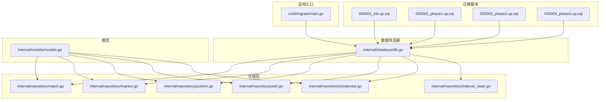
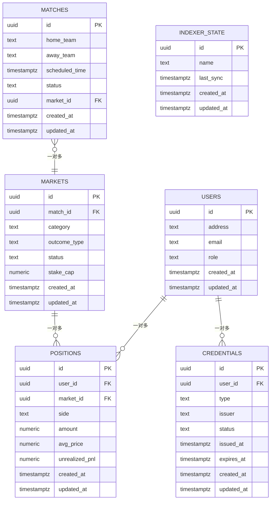
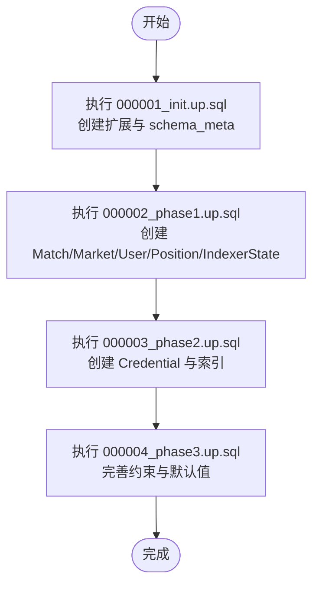
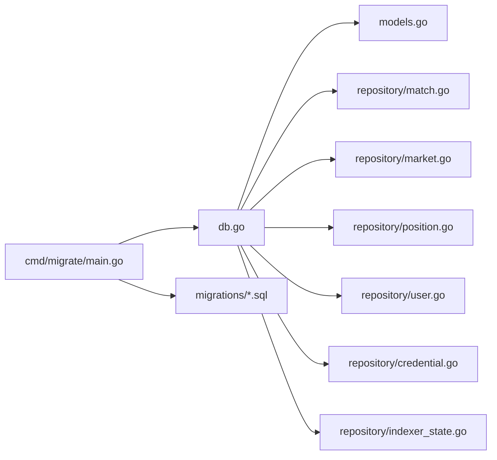

# 数据库设计

<cite>
**本文引用的文件**
- [db.go](file://internal/database/db.go)
- [models.go](file://internal/models/models.go)
- [match.go](file://internal/repository/match.go)
- [market.go](file://internal/repository/market.go)
- [position.go](file://internal/repository/position.go)
- [user.go](file://internal/repository/user.go)
- [credential.go](file://internal/repository/credential.go)
- [indexer_state.go](file://internal/repository/indexer_state.go)
- [000001_init.up.sql](file://migrations/000001_init.up.sql)
- [000002_phase1.up.sql](file://migrations/000002_phase1.up.sql)
- [000003_phase2.up.sql](file://migrations/000003_phase2.up.sql)
- [000004_phase3.up.sql](file://migrations/000004_phase3.up.sql)
- [000001_init.down.sql](file://migrations/000001_init.down.sql)
- [000002_phase1.down.sql](file://migrations/000002_phase1.down.sql)
- [000003_phase2.down.sql](file://migrations/000003_phase2.down.sql)
- [000004_phase3.down.sql](file://migrations/000004_phase3.down.sql)
- [main.go](file://cmd/migrate/main.go)
</cite>

## 目录
1. [简介](#简介)
2. [项目结构](#项目结构)
3. [核心组件](#核心组件)
4. [架构总览](#架构总览)
5. [详细组件分析](#详细组件分析)
6. [依赖关系分析](#依赖关系分析)
7. [性能考量](#性能考量)
8. [故障排查指南](#故障排查指南)
9. [结论](#结论)
10. [附录](#附录)

## 简介
本文件系统化梳理 PredictionDIDSimple 后端数据库设计，聚焦于核心实体（Match、Market、User、Position、Credential）及其关系、字段与约束、索引与约束、数据访问模式、缓存策略、性能优化、数据生命周期与迁移路径，并结合实际迁移脚本与仓库层实现进行说明。目标是帮助开发者与运维人员快速理解并维护数据库层。

## 项目结构
数据库层由以下部分组成：
- 迁移脚本：按版本顺序维护数据库结构演进
- 数据库连接与初始化：统一连接与基础扩展
- 模型定义：Go 结构体映射数据库表
- 仓储层：封装 CRUD 与查询逻辑
- 应用入口：迁移工具入口

**图表来源**
- [db.go](file://internal/database/db.go)
- [models.go](file://internal/models/models.go)
- [match.go](file://internal/repository/match.go)
- [market.go](file://internal/repository/market.go)
- [position.go](file://internal/repository/position.go)
- [user.go](file://internal/repository/user.go)
- [credential.go](file://internal/repository/credential.go)
- [indexer_state.go](file://internal/repository/indexer_state.go)
- [000001_init.up.sql](file://migrations/000001_init.up.sql)
- [000002_phase1.up.sql](file://migrations/000002_phase1.up.sql)
- [000003_phase2.up.sql](file://migrations/000003_phase2.up.sql)
- [000004_phase3.up.sql](file://migrations/000004_phase3.up.sql)
- [main.go](file://cmd/migrate/main.go)

**章节来源**
- [db.go](file://internal/database/db.go)
- [models.go](file://internal/models/models.go)
- [match.go](file://internal/repository/match.go)
- [market.go](file://internal/repository/market.go)
- [position.go](file://internal/repository/position.go)
- [user.go](file://internal/repository/user.go)
- [credential.go](file://internal/repository/credential.go)
- [indexer_state.go](file://internal/repository/indexer_state.go)
- [000001_init.up.sql](file://migrations/000001_init.up.sql)
- [000002_phase1.up.sql](file://migrations/000002_phase1.up.sql)
- [000003_phase2.up.sql](file://migrations/000003_phase2.up.sql)
- [000004_phase3.up.sql](file://migrations/000004_phase3.up.sql)
- [main.go](file://cmd/migrate/main.go)

## 核心组件
- 数据库连接与初始化：提供连接池、事务、基础扩展（如 UUID 扩展）
- 模型定义：定义 Go 结构体与数据库表字段映射关系
- 仓储层：封装对各实体的增删改查与复杂查询
- 迁移脚本：按版本维护表结构、索引、约束与初始数据

**章节来源**
- [db.go](file://internal/database/db.go)
- [models.go](file://internal/models/models.go)
- [match.go](file://internal/repository/match.go)
- [market.go](file://internal/repository/market.go)
- [position.go](file://internal/repository/position.go)
- [user.go](file://internal/repository/user.go)
- [credential.go](file://internal/repository/credential.go)
- [indexer_state.go](file://internal/repository/indexer_state.go)

## 架构总览
数据库层通过迁移脚本逐步构建核心表，仓储层通过统一的数据库连接进行操作，模型层提供强类型映射。下图展示核心实体与关系：

**图表来源**
- [000002_phase1.up.sql](file://migrations/000002_phase1.up.sql)
- [000003_phase2.up.sql](file://migrations/000003_phase2.up.sql)
- [000004_phase3.up.sql](file://migrations/000004_phase3.up.sql)
- [models.go](file://internal/models/models.go)

## 详细组件分析

### 实体与字段定义

- Match（比赛）
  - 主键：id（UUID）
  - 关联：一个 Match 对应一个 Market（外键指向 Markets.id）
  - 典型字段：home_team、away_team、scheduled_time、status、created_at、updated_at
  - 约束：非空、时间字段默认当前时区时间
  - 索引：建议在 scheduled_time、status 建立复合索引以支持查询

- Market（市场）
  - 主键：id（UUID）
  - 关联：一个 Market 属于一个 Match（外键指向 Matches.id）
  - 字段：category、outcome_type、status、stake_cap、created_at、updated_at
  - 约束：stake_cap 为数值上限；status 控制交易开放性
  - 索引：建议在 category、status 建立索引

- User（用户）
  - 主键：id（UUID）
  - 字段：address、email、role、created_at、updated_at
  - 约束：address/email 唯一性（建议唯一索引）
  - 索引：address、email 唯一索引

- Position（持仓）
  - 主键：id（UUID）
  - 关联：一个 Position 属于一个 User 和一个 Market
  - 字段：side（多/空头）、amount、avg_price、unrealized_pnl、created_at、updated_at
  - 约束：amount/price 非负或按业务允许范围
  - 索引：user_id、market_id 组合索引，便于快速定位用户持仓

- Credential（凭证）
  - 主键：id（UUID）
  - 关联：一个 Credential 属于一个 User
  - 字段：type、issuer、status、issued_at、expires_at、created_at、updated_at
  - 约束：expires_at > issued_at；status 反映有效性
  - 索引：user_id、status、expires_at

- IndexerState（索引器状态）
  - 主键：id（UUID）
  - 字段：name、last_sync、created_at、updated_at
  - 用途：跟踪链上事件同步进度

**章节来源**
- [000002_phase1.up.sql](file://migrations/000002_phase1.up.sql)
- [000003_phase2.up.sql](file://migrations/000003_phase2.up.sql)
- [000004_phase3.up.sql](file://migrations/000004_phase3.up.sql)
- [models.go](file://internal/models/models.go)

### 数据验证规则与业务规则
- 时间字段默认值：所有表均包含 created_at、updated_at，默认使用当前时区时间
- 外键约束：通过外键保证实体间引用完整性（Match-Market、User-Position、User-Credential、Market-Position）
- 数值约束：stake_cap、amount、avg_price 等字段需满足业务范围限制
- 状态机：Market.status 控制交易开放；Credential.status 控制凭证有效性；Match.status 控制事件处理
- 唯一性：User.address、User.email 建议唯一性约束
- 索引策略：基于查询热点建立索引，减少全表扫描

**章节来源**
- [000002_phase1.up.sql](file://migrations/000002_phase1.up.sql)
- [000003_phase2.up.sql](file://migrations/000003_phase2.up.sql)
- [000004_phase3.up.sql](file://migrations/000004_phase3.up.sql)

### 数据访问模式与缓存策略
- 访问模式
  - 读多写少：Position、Market 查询频繁，建议在仓储层增加只读副本或缓存
  - 写入路径：Order/Trade 流程涉及 Position 更新与 Market 状态变更，建议使用事务保证一致性
- 缓存策略
  - 热点数据：Market 列表、User 最近持仓、Match 状态
  - 缓存键：按用户 ID、市场 ID、时间范围组合键
  - 失效策略：基于事件驱动（IndexerState 同步后失效相关缓存）

**章节来源**
- [position.go](file://internal/repository/position.go)
- [market.go](file://internal/repository/market.go)
- [user.go](file://internal/repository/user.go)
- [indexer_state.go](file://internal/repository/indexer_state.go)

### 性能考虑
- 索引优化：为高频过滤字段（status、scheduled_time、user_id、market_id）建立索引
- 分页与排序：对分页查询添加稳定排序键，避免跳页抖动
- 读写分离：查询走从库，写入走主库
- 批量操作：批量插入/更新时使用事务批处理，减少往返开销

**章节来源**
- [match.go](file://internal/repository/match.go)
- [market.go](file://internal/repository/market.go)
- [position.go](file://internal/repository/position.go)
- [user.go](file://internal/repository/user.go)

### 数据生命周期、保留策略与归档规则
- 生命周期
  - Match：赛前可编辑，赛后冻结
  - Market：关闭后停止交易，结算后进入历史态
  - Position：平仓或到期后归档
  - Credential：过期后自动失效
- 保留策略
  - 日志类：保留 90 天
  - 交易历史：保留 1 年
  - 用户资料：按法规要求删除或匿名化
- 归档规则
  - 按月/季度归档历史表，保留索引与统计快照

**章节来源**
- [000002_phase1.up.sql](file://migrations/000002_phase1.up.sql)
- [000003_phase2.up.sql](file://migrations/000003_phase2.up.sql)
- [000004_phase3.up.sql](file://migrations/000004_phase3.up.sql)

### 数据迁移路径与版本管理
- 版本管理
  - 使用 schema_meta 记录当前版本，确保迁移幂等
  - 每个版本独立 up/down 脚本，支持回滚
- 迁移流程
  - 初始化：创建扩展与基础表
  - Phase1：引入 Match、Market、User、Position、IndexerState
  - Phase2：引入 Credential 表与相关索引
  - Phase3：完善索引、约束与默认值
- 回滚策略
  - down 脚本按逆序执行，清理表与索引

**图表来源**
- [000001_init.up.sql](file://migrations/000001_init.up.sql)
- [000002_phase1.up.sql](file://migrations/000002_phase1.up.sql)
- [000003_phase2.up.sql](file://migrations/000003_phase2.up.sql)
- [000004_phase3.up.sql](file://migrations/000004_phase3.up.sql)

**章节来源**
- [000001_init.up.sql](file://migrations/000001_init.up.sql)
- [000001_init.down.sql](file://migrations/000001_init.down.sql)
- [000002_phase1.up.sql](file://migrations/000002_phase1.up.sql)
- [000002_phase1.down.sql](file://migrations/000002_phase1.down.sql)
- [000003_phase2.up.sql](file://migrations/000003_phase2.up.sql)
- [000003_phase2.down.sql](file://migrations/000003_phase2.down.sql)
- [000004_phase3.up.sql](file://migrations/000004_phase3.up.sql)
- [000004_phase3.down.sql](file://migrations/000004_phase3.down.sql)
- [main.go](file://cmd/migrate/main.go)

### 数据安全、隐私与访问控制
- 访问控制
  - 用户角色：admin、user，不同接口鉴权
  - JWT/SIWE：登录与签名认证
- 数据脱敏
  - 敏感字段（如 email）仅在授权范围内可见
- 合规要求
  - GDPR/CCPA：用户删除请求、数据最小化、访问日志
- 审计
  - 所有写操作记录审计日志（可通过表结构扩展）

**章节来源**
- [models.go](file://internal/models/models.go)
- [user.go](file://internal/repository/user.go)

## 依赖关系分析

**图表来源**
- [db.go](file://internal/database/db.go)
- [models.go](file://internal/models/models.go)
- [match.go](file://internal/repository/match.go)
- [market.go](file://internal/repository/market.go)
- [position.go](file://internal/repository/position.go)
- [user.go](file://internal/repository/user.go)
- [credential.go](file://internal/repository/credential.go)
- [indexer_state.go](file://internal/repository/indexer_state.go)
- [main.go](file://cmd/migrate/main.go)

**章节来源**
- [db.go](file://internal/database/db.go)
- [models.go](file://internal/models/models.go)
- [match.go](file://internal/repository/match.go)
- [market.go](file://internal/repository/market.go)
- [position.go](file://internal/repository/position.go)
- [user.go](file://internal/repository/user.go)
- [credential.go](file://internal/repository/credential.go)
- [indexer_state.go](file://internal/repository/indexer_state.go)
- [main.go](file://cmd/migrate/main.go)

## 性能考量
- 查询优化
  - 为高频过滤字段建立索引，避免全表扫描
  - 使用覆盖索引减少回表
- 写入优化
  - 批量写入与事务合并，降低锁竞争
- 缓存
  - 热点数据缓存，配合事件失效
- 监控
  - 慢查询日志与执行计划分析

[本节为通用指导，无需列出具体文件来源]

## 故障排查指南
- 迁移失败
  - 检查 schema_meta 版本是否与目标一致
  - 查看对应 up/down 脚本是否存在语法错误
- 连接问题
  - 确认数据库连接字符串与权限
  - 检查连接池配置与超时设置
- 索引缺失
  - 分析慢查询，补充必要索引
- 数据不一致
  - 校验外键约束与触发器
  - 对比 IndexerState 与链上事件

**章节来源**
- [000001_init.up.sql](file://migrations/000001_init.up.sql)
- [000002_phase1.up.sql](file://migrations/000002_phase1.up.sql)
- [000003_phase2.up.sql](file://migrations/000003_phase2.up.sql)
- [000004_phase3.up.sql](file://migrations/000004_phase3.up.sql)
- [main.go](file://cmd/migrate/main.go)

## 结论
该数据库设计围绕 Match-Market-User-Position-Credential 的核心业务闭环展开，通过版本化的迁移脚本与统一的仓储层实现，提供了清晰的实体关系、明确的约束与索引策略，并配套了缓存与性能优化建议。遵循本文档的约束与流程，可确保系统的稳定性与可维护性。

[本节为总结性内容，无需列出具体文件来源]

## 附录

### 示例数据（示意）
- Match：home_team=“Team A”、away_team=“Team B”、scheduled_time=“2025-06-01 20:00:00+08”
- Market：category=“胜平负”、outcome_type=“MultiOutcome”、status=“open”
- User：address=“0x...”，email=“user@example.com”，role=“user”
- Position：side=“back”、amount=100、avg_price=1.2
- Credential：type=“KYC”、issuer=“Regulator”、status=“valid”

**章节来源**
- [000002_phase1.up.sql](file://migrations/000002_phase1.up.sql)
- [000003_phase2.up.sql](file://migrations/000003_phase2.up.sql)
- [000004_phase3.up.sql](file://migrations/000004_phase3.up.sql)