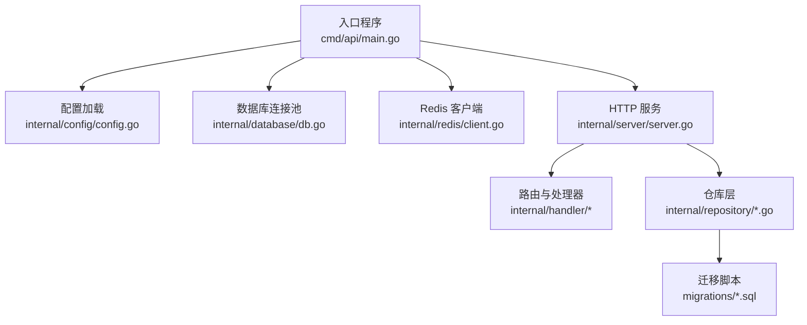
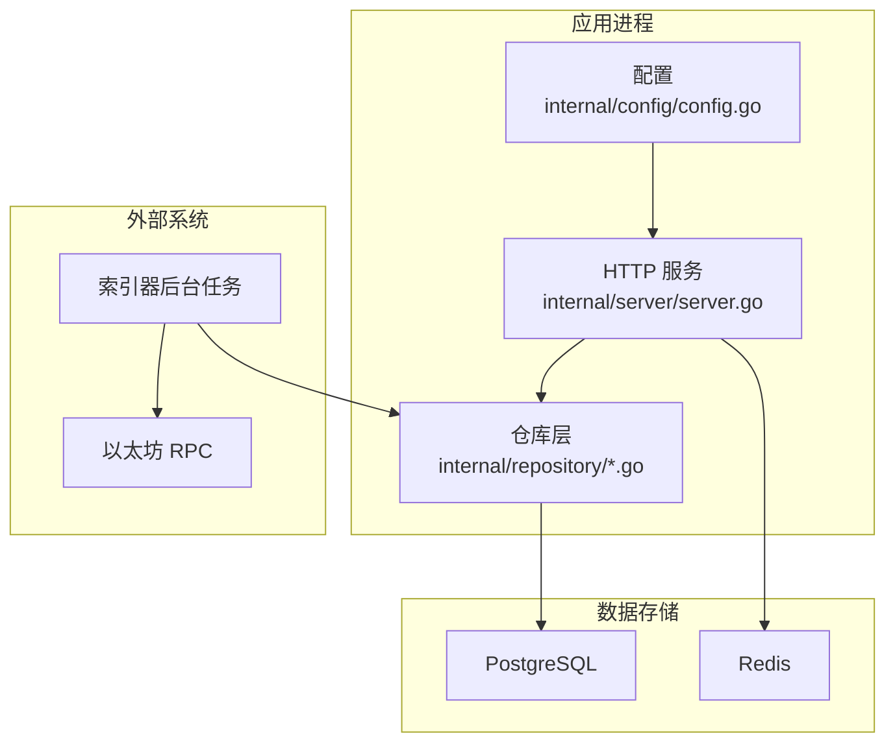
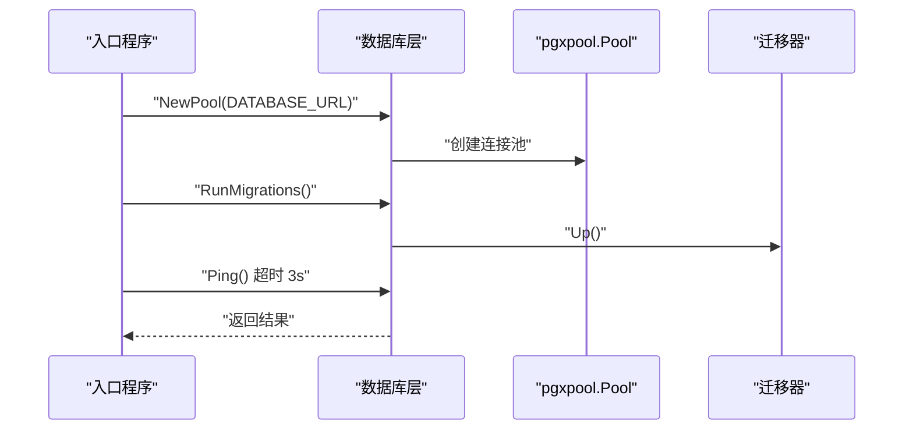
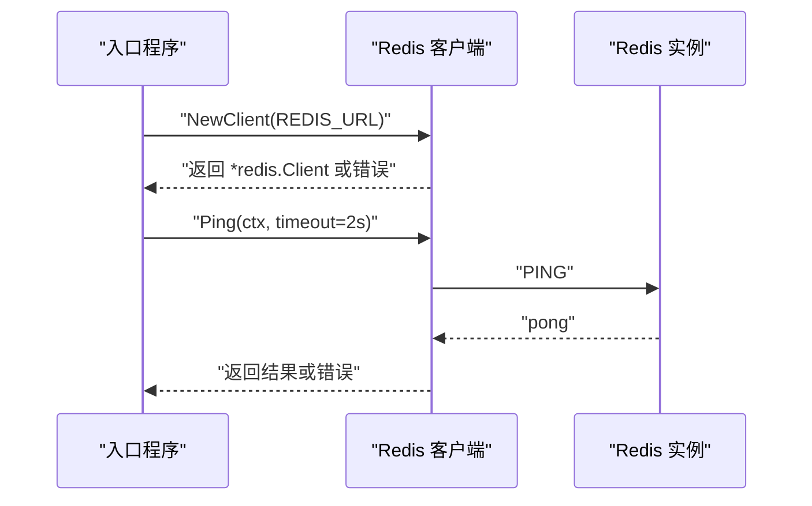
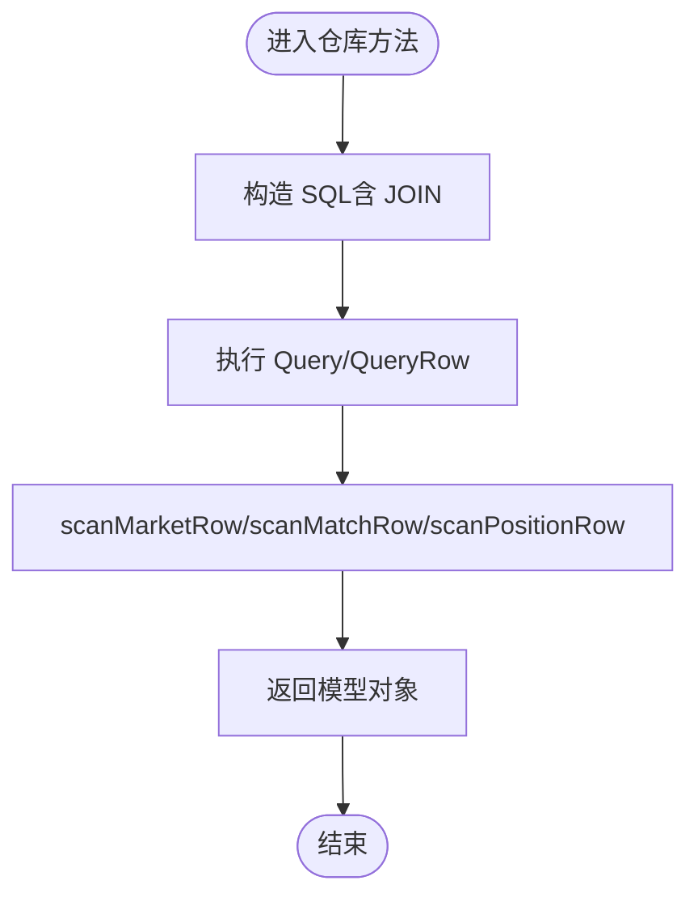
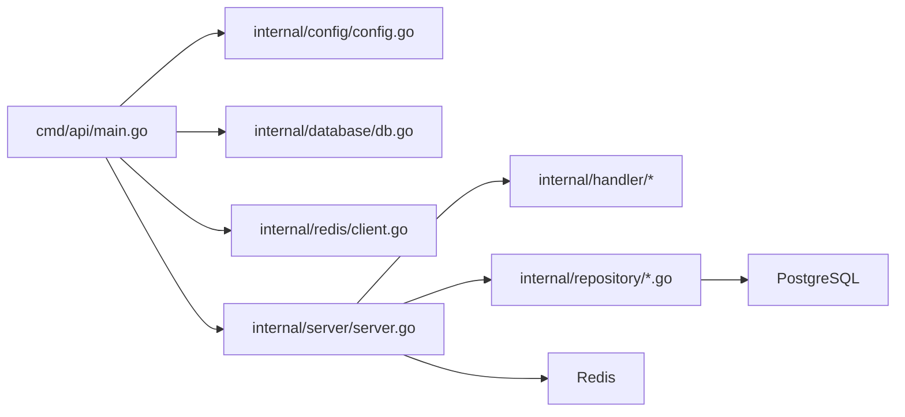

# 性能优化策略

<cite>
**本文引用的文件**
- [main.go](file://cmd/api/main.go)
- [db.go](file://internal/database/db.go)
- [config.go](file://internal/config/config.go)
- [client.go](file://internal/redis/client.go)
- [server.go](file://internal/server/server.go)
- [market.go](file://internal/repository/market.go)
- [match.go](file://internal/repository/match.go)
- [position.go](file://internal/repository/position.go)
- [user.go](file://internal/repository/user.go)
- [000002_phase1.up.sql](file://migrations/000002_phase1.up.sql)
- [000003_phase2.up.sql](file://migrations/000003_phase2.up.sql)
- [000004_phase3.up.sql](file://migrations/000004_phase3.up.sql)
- [000001_init.up.sql](file://migrations/000001_init.up.sql)
- [go.mod](file://go.mod)
</cite>

## 目录
1. [简介](#简介)
2. [项目结构](#项目结构)
3. [核心组件](#核心组件)
4. [架构总览](#架构总览)
5. [详细组件分析](#详细组件分析)
6. [依赖关系分析](#依赖关系分析)
7. [性能考量与优化建议](#性能考量与优化建议)
8. [故障排查指南](#故障排查指南)
9. [结论](#结论)
10. [附录](#附录)

## 简介
本文件面向 PredictionDIDSimple 的数据库性能优化，聚焦以下方面：
- 查询优化：索引设计原则、查询计划分析与慢查询优化
- 连接池配置与管理：连接数限制、超时设置与连接复用策略
- 缓存策略：Redis 集成、热点数据缓存与缓存失效机制
- 数据访问模式：批量操作、预加载与 N+1 查询问题的解决方案
- 监控与指标：查询性能、连接池状态与瓶颈识别
- 测试与基准：性能测试方法与基准策略
- 生产调优：最佳实践与运维建议

## 项目结构
后端采用分层结构：入口程序负责初始化配置、迁移、数据库连接池与 Redis 客户端；服务层构建 HTTP 路由与中间件；仓库层封装数据库访问；迁移脚本定义表结构与索引。

图表来源
- [main.go](file://cmd/api/main.go#L24-L117)
- [config.go](file://internal/config/config.go#L45-L96)
- [db.go](file://internal/database/db.go#L14-L26)
- [client.go](file://internal/redis/client.go#L10-L22)
- [server.go](file://internal/server/server.go#L35-L84)
- [000002_phase1.up.sql](file://migrations/000002_phase1.up.sql#L1-L76)
- [000003_phase2.up.sql](file://migrations/000003_phase2.up.sql#L1-L39)
- [000004_phase3.up.sql](file://migrations/000004_phase3.up.sql#L1-L44)

章节来源
- [main.go](file://cmd/api/main.go#L24-L117)
- [config.go](file://internal/config/config.go#L45-L96)
- [db.go](file://internal/database/db.go#L14-L26)
- [client.go](file://internal/redis/client.go#L10-L22)
- [server.go](file://internal/server/server.go#L35-L84)

## 核心组件
- 入口程序：加载配置、执行数据库迁移、创建连接池与 Redis 客户端、启动服务与后台任务（索引器、链客户端）。
- 数据库层：使用 pgx/v5 的连接池，提供 Ping 与迁移能力。
- Redis 层：解析 URL 并提供 Ping 能力。
- 仓库层：封装对 matches/markets/positions/users 等表的 CRUD 与聚合查询。
- 迁移层：定义表结构、主键、外键、唯一约束与索引。

章节来源
- [main.go](file://cmd/api/main.go#L24-L117)
- [db.go](file://internal/database/db.go#L14-L26)
- [client.go](file://internal/redis/client.go#L10-L22)
- [market.go](file://internal/repository/market.go#L13-L19)
- [match.go](file://internal/repository/match.go#L13-L19)
- [position.go](file://internal/repository/position.go#L10-L16)
- [user.go](file://internal/repository/user.go#L11-L17)
- [000002_phase1.up.sql](file://migrations/000002_phase1.up.sql#L1-L76)
- [000003_phase2.up.sql](file://migrations/000003_phase2.up.sql#L1-L39)
- [000004_phase3.up.sql](file://migrations/000004_phase3.up.sql#L1-L44)

## 架构总览
系统以 HTTP 服务为中心，通过仓库层访问 PostgreSQL，使用 Redis 提升读取性能，并在后台运行索引器同步链上数据。

图表来源
- [server.go](file://internal/server/server.go#L35-L84)
- [market.go](file://internal/repository/market.go#L13-L19)
- [match.go](file://internal/repository/match.go#L13-L19)
- [position.go](file://internal/repository/position.go#L10-L16)
- [user.go](file://internal/repository/user.go#L11-L17)
- [main.go](file://cmd/api/main.go#L64-L81)

## 详细组件分析

### 数据库连接池与超时
- 连接池创建：通过 pgxpool.New 建立连接池，默认参数由 DATABASE_URL 控制。
- 连接健康检查：Ping 操作带超时，避免阻塞启动流程。
- 迁移执行：使用 golang-migrate，确保 schema 一致性。

图表来源
- [main.go](file://cmd/api/main.go#L33-L46)
- [db.go](file://internal/database/db.go#L14-L26)
- [000001_init.up.sql](file://migrations/000001_init.up.sql#L1-L10)

章节来源
- [db.go](file://internal/database/db.go#L14-L26)
- [main.go](file://cmd/api/main.go#L33-L46)

### Redis 缓存集成与可用性
- Redis 客户端：解析 URL 并创建连接；Ping 带超时，失败时降级记录日志。
- 使用场景：可作为热点数据与会话缓存，提升读取性能。

图表来源
- [main.go](file://cmd/api/main.go#L48-L59)
- [client.go](file://internal/redis/client.go#L10-L22)

章节来源
- [client.go](file://internal/redis/client.go#L10-L22)
- [main.go](file://cmd/api/main.go#L48-L59)

### 仓库层查询与潜在 N+1 问题
- 市场列表与详情：使用 LEFT JOIN 合并 matches，减少多次查询。
- 用户持仓：JOIN markets 获取市场信息，避免循环逐条查询。
- 未发现显式 N+1 场景，但需关注业务层是否在循环中再次发起数据库请求。

图表来源
- [market.go](file://internal/repository/market.go#L21-L83)
- [match.go](file://internal/repository/match.go#L21-L66)
- [position.go](file://internal/repository/position.go#L46-L84)

章节来源
- [market.go](file://internal/repository/market.go#L21-L83)
- [match.go](file://internal/repository/match.go#L21-L66)
- [position.go](file://internal/repository/position.go#L46-L84)

### 索引现状与设计建议
- 现有索引
  - markets.match_id、markets.status：支持按状态与关联匹配查询
  - oracle_jobs.status、oracle_jobs(market_id) 唯一索引（待处理）：支持作业调度与去重
  - credentials(user_address)：大小写不敏感索引（LOWER）
- 设计原则
  - 选择性高、过滤性强的列优先建索引
  - 复合索引考虑查询谓词顺序与覆盖扫描
  - 写多读少场景谨慎增加索引，平衡写入成本
  - 定期评估索引使用率，清理无效索引

章节来源
- [000002_phase1.up.sql](file://migrations/000002_phase1.up.sql#L40-L42)
- [000003_phase2.up.sql](file://migrations/000003_phase2.up.sql#L24-L26)
- [000003_phase2.up.sql](file://migrations/000003_phase2.up.sql#L38-L38)

### 查询计划分析与慢查询优化
- 分析步骤
  - 使用 EXPLAIN/EXPLAIN ANALYZE 对关键查询进行剖析
  - 关注全表扫描、隐式函数调用（如 LOWER 列）、不必要的排序与连接
  - 通过覆盖索引减少回表
- 优化方向
  - 将 LOWER 应用到常量而非列，避免索引失效
  - 合理使用 LIMIT/OFFSET，避免深分页；必要时使用基于游标分页
  - 将高频条件前置，利用索引快速裁剪

章节来源
- [market.go](file://internal/repository/market.go#L85-L101)
- [position.go](file://internal/repository/position.go#L46-L56)
- [user.go](file://internal/repository/user.go#L40-L49)

### 缓存策略设计
- 热点数据缓存
  - markets/status、matches/kickoff_at 排序列表：短期缓存（如 10-30s），结合失效时间
  - market_by_address：按地址缓存，写扩散更新
- 缓存失效机制
  - 写路径：插入/更新后主动失效相关 key
  - 过期策略：TTL 结合 LRU，避免缓存雪崩
- Redis 集成
  - 读多写少场景优先使用 Redis；写入后异步落库或使用事务保证一致性

章节来源
- [client.go](file://internal/redis/client.go#L10-L22)
- [market.go](file://internal/repository/market.go#L21-L65)
- [match.go](file://internal/repository/match.go#L21-L54)

### 数据访问模式优化
- 批量操作
  - 批量插入/更新 trades 与 positions：使用事务包裹，减少往返
  - 批量 Upsert：利用 ON CONFLICT，避免单条循环
- 预加载策略
  - JOIN 预加载关联实体，避免 N+1
  - 分页查询：LIMIT+OFFSET 或游标分页
- N+1 查询规避
  - 在仓库层一次性拉取所需数据，避免业务层循环触发查询

章节来源
- [position.go](file://internal/repository/position.go#L18-L35)
- [position.go](file://internal/repository/position.go#L87-L94)
- [market.go](file://internal/repository/market.go#L21-L65)

### 监控与性能指标
- 查询性能监控
  - 记录慢查询阈值与耗时分布，定位异常 SQL
- 连接池状态监控
  - 空闲/活跃连接数、等待时间、最大池大小
- 瓶颈识别
  - CPU、内存、磁盘 IO 与网络延迟；结合数据库锁等待与 WAL 压力

章节来源
- [db.go](file://internal/database/db.go#L14-L26)
- [server.go](file://internal/server/server.go#L77-L84)

## 依赖关系分析

图表来源
- [main.go](file://cmd/api/main.go#L24-L117)
- [server.go](file://internal/server/server.go#L35-L84)
- [market.go](file://internal/repository/market.go#L13-L19)
- [match.go](file://internal/repository/match.go#L13-L19)
- [position.go](file://internal/repository/position.go#L10-L16)
- [user.go](file://internal/repository/user.go#L11-L17)

章节来源
- [main.go](file://cmd/api/main.go#L24-L117)
- [server.go](file://internal/server/server.go#L35-L84)

## 性能考量与优化建议

### 查询优化
- 索引设计
  - 为高频过滤列（如 markets.status、markets.match_id）保持现有索引
  - 对 credentials(user_address) 使用 LOWER 索引，避免大小写转换导致的索引失效
- 查询计划
  - 使用 EXPLAIN 分析 JOIN 与排序开销，必要时调整索引或重写 SQL
  - 避免在 WHERE 子句对索引列使用函数或表达式
- 分页与排序
  - 深分页使用游标分页替代 OFFSET
  - 仅选择需要字段，避免 SELECT *

章节来源
- [000002_phase1.up.sql](file://migrations/000002_phase1.up.sql#L40-L42)
- [000003_phase2.up.sql](file://migrations/000003_phase2.up.sql#L38-L38)
- [market.go](file://internal/repository/market.go#L21-L65)

### 连接池配置与管理
- 连接数限制
  - 根据并发请求数与数据库承载能力设置最大连接数
- 超时设置
  - 读超时与写超时合理配置；长连接场景注意写超时上限
- 复用策略
  - 通过连接池复用连接，避免频繁创建销毁
- 可观测性
  - 监控空闲/活跃连接、等待队列长度与超时次数

章节来源
- [db.go](file://internal/database/db.go#L14-L26)
- [server.go](file://internal/server/server.go#L77-L84)

### 缓存策略
- 热点数据
  - markets 列表与详情、用户持仓等高频读取数据
- 失效机制
  - 写路径主动失效；过期策略防止缓存击穿
- Redis 集成
  - 读多写少场景优先缓存；写入后异步落库或使用事务

章节来源
- [client.go](file://internal/redis/client.go#L10-L22)
- [market.go](file://internal/repository/market.go#L21-L65)
- [position.go](file://internal/repository/position.go#L46-L84)

### 数据访问模式
- 批量操作
  - 交易与头寸批量插入/更新，使用事务
- 预加载
  - JOIN 预加载关联实体，避免 N+1
- N+1 解决
  - 在仓库层一次性拉取，业务层不再触发额外查询

章节来源
- [position.go](file://internal/repository/position.go#L18-L35)
- [position.go](file://internal/repository/position.go#L87-L94)
- [market.go](file://internal/repository/market.go#L21-L65)

### 监控与指标
- 查询性能
  - 慢查询日志与采样分析
- 连接池
  - 连接数、等待时间、超时统计
- 瓶颈识别
  - 数据库锁等待、WAL 压力、IO 等

章节来源
- [db.go](file://internal/database/db.go#L14-L26)
- [server.go](file://internal/server/server.go#L77-L84)

### 性能测试与基准策略
- 基准测试
  - 使用数据库压测工具对关键查询进行吞吐与延迟测试
- 回归验证
  - 引入索引或缓存变更后对比前后指标
- A/B 验证
  - 新旧方案并行，对比延迟与资源占用

### 生产调优最佳实践
- 逐步上线：小范围灰度，观察指标再扩大
- 渐进式变更：先加索引/缓存，再优化 SQL
- 监控告警：建立慢查询、连接池超限、Redis 可用性告警
- 定期复盘：根据业务高峰与数据增长趋势调整参数

## 故障排查指南
- 启动阶段
  - 数据库迁移失败：检查 DATABASE_URL 与迁移脚本版本
  - Redis 连接失败：确认 REDIS_URL 与网络连通性
- 运行阶段
  - 查询缓慢：使用 EXPLAIN 分析，检查索引使用情况
  - 连接池耗尽：检查最大连接数与超时配置
  - 缓存命中低：核对键空间与 TTL 设置

章节来源
- [main.go](file://cmd/api/main.go#L33-L59)
- [db.go](file://internal/database/db.go#L28-L42)
- [client.go](file://internal/redis/client.go#L18-L22)

## 结论
通过对仓库层 SQL、索引现状与连接池/缓存配置的系统化梳理，可在不改变业务逻辑的前提下显著提升查询性能与系统稳定性。建议优先完善索引覆盖、优化慢查询、引入缓存与批量写入，并建立完善的监控与回归测试体系。

## 附录

### 关键文件与职责摘要
- 入口与配置
  - cmd/api/main.go：初始化、迁移、连接池与 Redis、服务启动
  - internal/config/config.go：环境变量解析与默认值
- 数据库与 Redis
  - internal/database/db.go：连接池与迁移
  - internal/redis/client.go：Redis 客户端与 Ping
- 仓库层
  - internal/repository/market.go：市场列表/详情/更新
  - internal/repository/match.go：比赛列表/详情/更新
  - internal/repository/position.go：头寸与交易
  - internal/repository/user.go：用户绑定与查询
- 迁移脚本
  - migrations/000002_phase1.up.sql：基础表与索引
  - migrations/000003_phase2.up.sql：扩展列与索引
  - migrations/000004_phase3.up.sql：平台统计与合规表
  - migrations/000001_init.up.sql：初始化元数据

章节来源
- [main.go](file://cmd/api/main.go#L24-L117)
- [config.go](file://internal/config/config.go#L45-L96)
- [db.go](file://internal/database/db.go#L14-L26)
- [client.go](file://internal/redis/client.go#L10-L22)
- [market.go](file://internal/repository/market.go#L13-L19)
- [match.go](file://internal/repository/match.go#L13-L19)
- [position.go](file://internal/repository/position.go#L10-L16)
- [user.go](file://internal/repository/user.go#L11-L17)
- [000002_phase1.up.sql](file://migrations/000002_phase1.up.sql#L1-L76)
- [000003_phase2.up.sql](file://migrations/000003_phase2.up.sql#L1-L39)
- [000004_phase3.up.sql](file://migrations/000004_phase3.up.sql#L1-L44)
- [000001_init.up.sql](file://migrations/000001_init.up.sql#L1-L10)