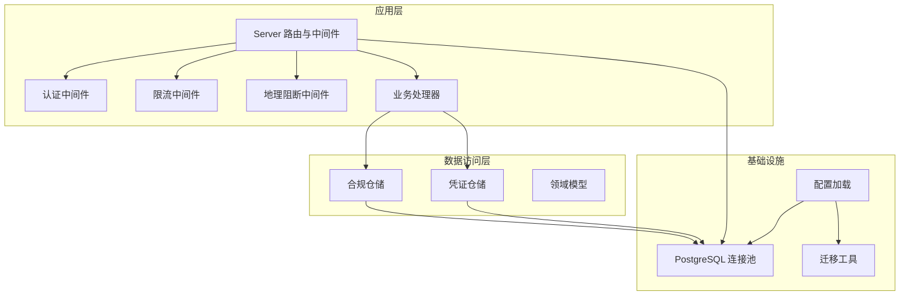
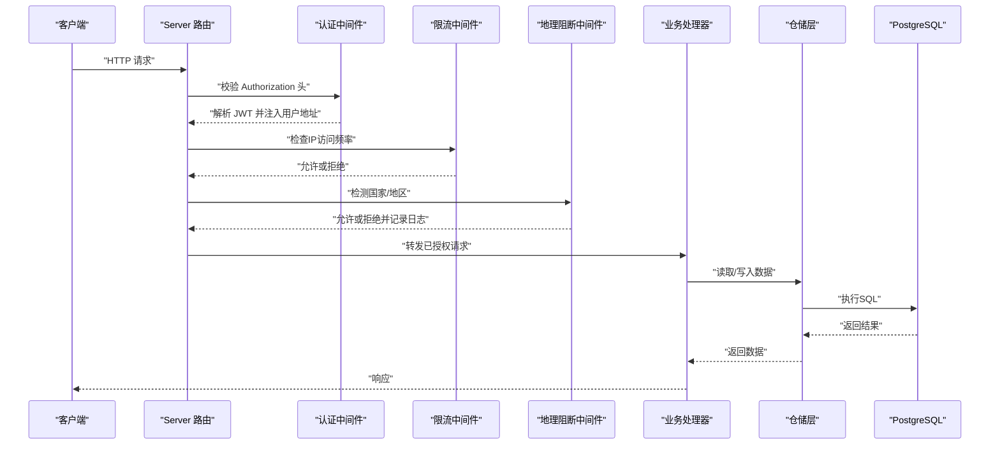
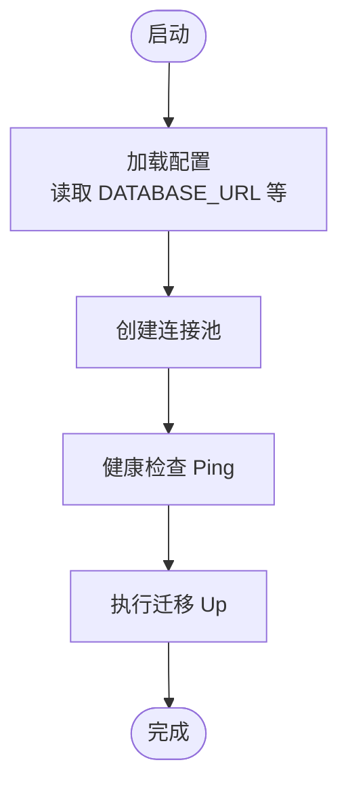
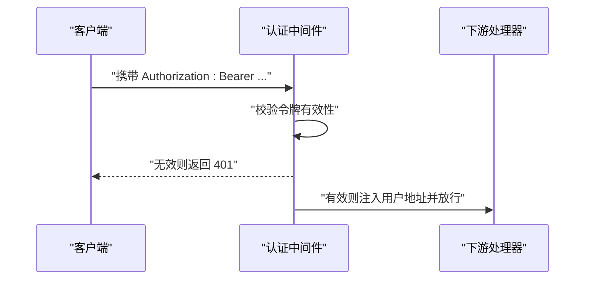
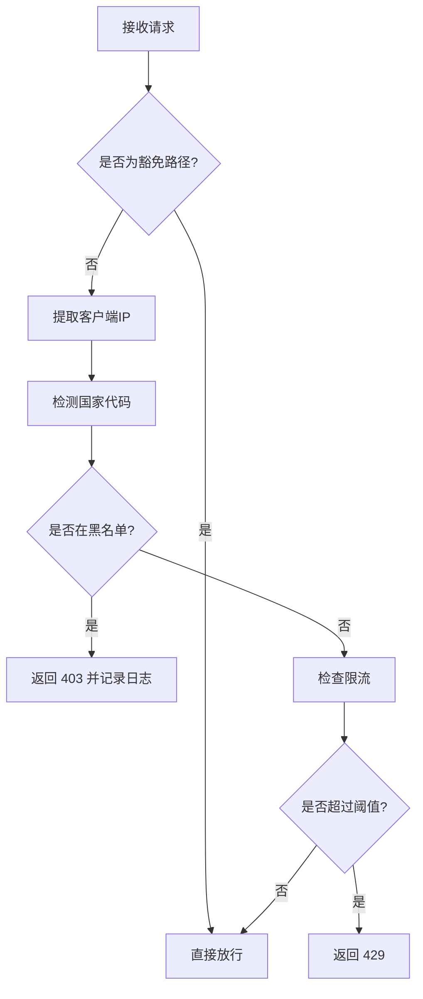
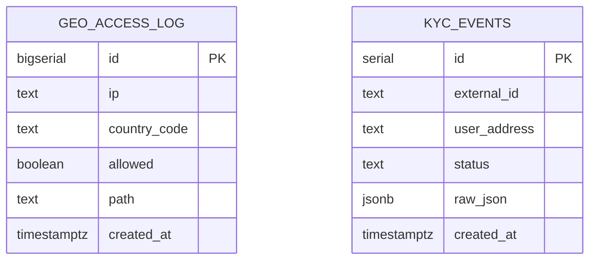
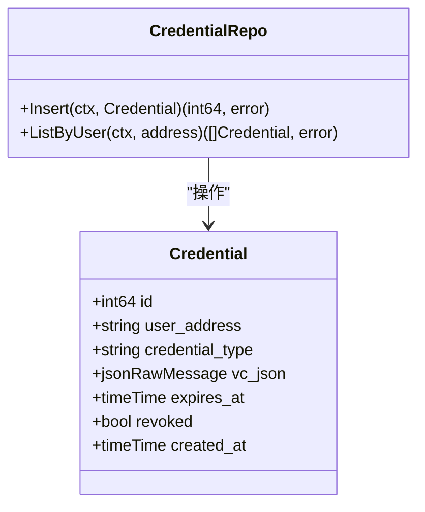
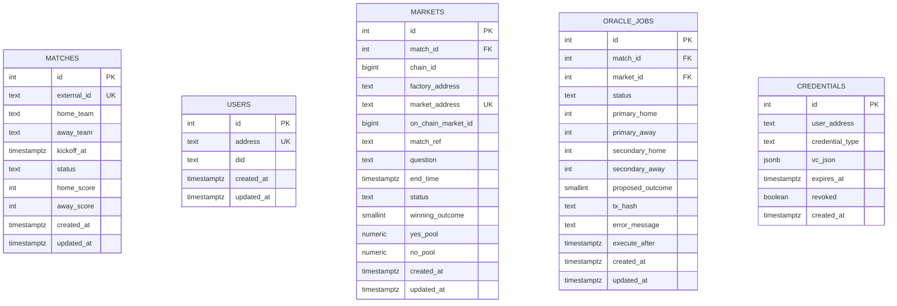
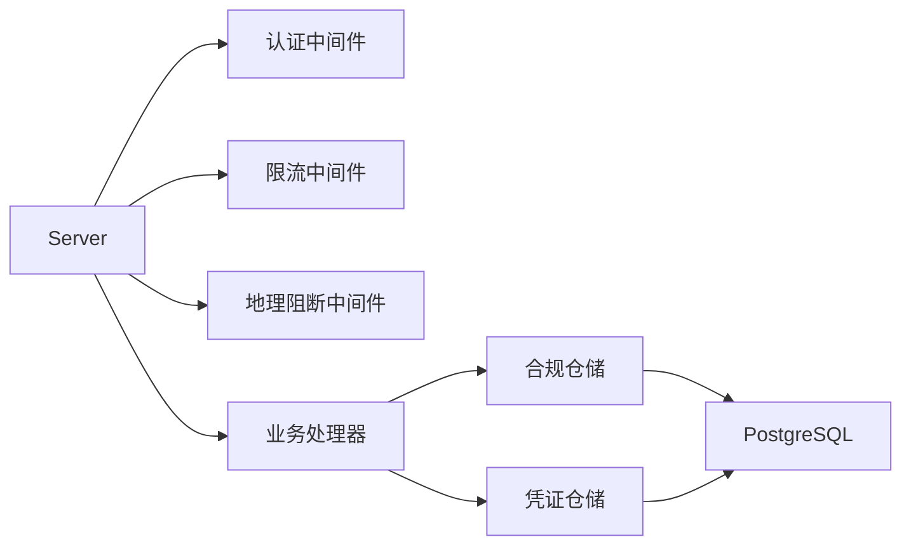

# 数据安全与访问控制

<cite>
**本文档引用的文件**
- [db.go](file://internal/database/db.go)
- [config.go](file://internal/config/config.go)
- [server.go](file://internal/server/server.go)
- [middleware.go](file://internal/auth/middleware.go)
- [ratelimit.go](file://internal/middleware/ratelimit.go)
- [geo.go](file://internal/middleware/geo.go)
- [compliance.go](file://internal/handler/compliance.go)
- [compliance_repo.go](file://internal/repository/compliance.go)
- [credential_repo.go](file://internal/repository/credential.go)
- [models.go](file://internal/models/models.go)
- [000001_init.up.sql](file://migrations/000001_init.up.sql)
- [000002_phase1.up.sql](file://migrations/000002_phase1.up.sql)
- [000003_phase2.up.sql](file://migrations/000003_phase2.up.sql)
- [000004_phase3.up.sql](file://migrations/000004_phase3.up.sql)
- [main.go](file://cmd/migrate/main.go)
</cite>

## 目录
1. [引言](#引言)
2. [项目结构](#项目结构)
3. [核心组件](#核心组件)
4. [架构总览](#架构总览)
5. [详细组件分析](#详细组件分析)
6. [依赖关系分析](#依赖关系分析)
7. [性能考虑](#性能考虑)
8. [故障排查指南](#故障排查指南)
9. [结论](#结论)
10. [附录](#附录)

## 引言
本文件面向PredictionDIDSimple后端系统，聚焦数据库安全与访问控制主题，系统化梳理以下方面：数据访问权限控制（行级安全策略、视图权限管理、存储过程安全）、敏感数据保护（数据加密、脱敏技术、PII处理）、数据库安全配置（SSL连接、防火墙规则、审计日志）、合规性要求（GDPR、CCPA等）、数据备份与恢复策略（增量备份、异地备份、灾难恢复）、安全威胁防护（SQL注入、权限提升、数据泄露）以及安全监控与事件响应机制。本文所有技术建议均基于现有代码实现进行归纳总结，并提出可落地的改进建议。

## 项目结构
后端采用分层架构：配置加载、数据库连接池、迁移管理、中间件（限流、地理阻断）、认证中间件、业务处理器、仓储层（数据库访问）、模型定义与迁移脚本。数据库通过PGX连接池管理，使用golang-migrate执行版本化迁移；服务端在路由层集成限流与地理阻断中间件，并记录合规审计日志。

**图表来源**
- [server.go](file://internal/server/server.go#L35-L48)
- [db.go](file://internal/database/db.go#L14-L26)
- [config.go](file://internal/config/config.go#L45-L96)
- [compliance_repo.go](file://internal/repository/compliance.go#L17-L29)
- [credential_repo.go](file://internal/repository/credential.go#L29-L45)

**章节来源**
- [server.go](file://internal/server/server.go#L35-L48)
- [db.go](file://internal/database/db.go#L14-L26)
- [config.go](file://internal/config/config.go#L45-L96)

## 核心组件
- 数据库连接与迁移
  - 连接池初始化与健康检查，确保连接可用性与超时控制。
  - 使用迁移工具按顺序升级数据库结构，保证版本一致性。
- 认证与授权中间件
  - 基于JWT的认证中间件，从请求头提取令牌并解析用户地址，注入到上下文。
- 安全中间件
  - 限流中间件：基于IP与时间窗口的计数器，防止滥用与DDoS。
  - 地理阻断中间件：根据国家/地区白名单/黑名单拒绝访问，并记录访问日志。
- 合规审计
  - 地理访问日志与KYC事件日志写入专用表，支持合规追踪。
- 凭证管理
  - 凭证仓储负责凭据的插入与查询，支持过期与撤销状态管理。

**章节来源**
- [db.go](file://internal/database/db.go#L14-L42)
- [middleware.go](file://internal/auth/middleware.go#L13-L36)
- [ratelimit.go](file://internal/middleware/ratelimit.go#L17-L55)
- [geo.go](file://internal/middleware/geo.go#L10-L50)
- [compliance_repo.go](file://internal/repository/compliance.go#L17-L29)
- [credential_repo.go](file://internal/repository/credential.go#L29-L45)

## 架构总览
下图展示从客户端到数据库的关键交互路径，突出安全控制点（认证、限流、地理阻断、合规日志）。

**图表来源**
- [server.go](file://internal/server/server.go#L35-L48)
- [middleware.go](file://internal/auth/middleware.go#L13-L36)
- [ratelimit.go](file://internal/middleware/ratelimit.go#L36-L55)
- [geo.go](file://internal/middleware/geo.go#L10-L30)
- [compliance_repo.go](file://internal/repository/compliance.go#L17-L29)

## 详细组件分析

### 数据库连接与迁移安全
- 连接池
  - 初始化时使用环境变量提供的数据库URL，支持超时控制与Ping检测，确保连接可用性。
- 迁移
  - 使用迁移工具按序执行up脚本，避免手动变更导致的不一致；失败时返回错误，便于回滚与修复。

**图表来源**
- [db.go](file://internal/database/db.go#L14-L42)
- [config.go](file://internal/config/config.go#L45-L96)
- [main.go](file://cmd/migrate/main.go#L12-L27)

**章节来源**
- [db.go](file://internal/database/db.go#L14-L42)
- [main.go](file://cmd/migrate/main.go#L12-L27)

### 认证与访问控制
- JWT认证中间件
  - 从Authorization头提取Bearer令牌，验证签名与有效期，成功后将用户地址写入上下文供后续处理器使用。
- 访问控制要点
  - 当前未实现细粒度的角色/资源授权（RBAC），建议引入基于角色的访问控制与资源级权限矩阵。
  - 对敏感接口（如管理员功能）应增加额外的鉴权与审计。

**图表来源**
- [middleware.go](file://internal/auth/middleware.go#L13-L36)

**章节来源**
- [middleware.go](file://internal/auth/middleware.go#L13-L36)

### 限流与地理阻断
- 限流中间件
  - 基于每分钟请求数限制，使用内存计数器与时间窗口，自动重置。
  - 特殊路径（健康检查、指标、合规查询、事件订阅）豁免限流。
- 地理阻断中间件
  - 从请求头提取国家代码，结合配置的黑名单决定是否拒绝访问。
  - 访问日志记录IP、国家、路径与结果，便于合规审计。

**图表来源**
- [ratelimit.go](file://internal/middleware/ratelimit.go#L36-L55)
- [geo.go](file://internal/middleware/geo.go#L10-L30)

**章节来源**
- [ratelimit.go](file://internal/middleware/ratelimit.go#L17-L55)
- [geo.go](file://internal/middleware/geo.go#L10-L50)
- [compliance.go](file://internal/handler/compliance.go#L7-L22)

### 合规审计与日志
- 地理访问日志
  - 表结构包含IP、国家代码、允许状态、请求路径与时间戳，用于追踪访问来源与合规性。
- KYC事件日志
  - 记录外部ID、用户地址、状态与原始JSON，便于监管审计。
- 日志落盘与保留
  - 建议配置归档策略与保留周期，满足合规要求。

**图表来源**
- [000004_phase3.up.sql](file://migrations/000004_phase3.up.sql#L17-L33)
- [compliance_repo.go](file://internal/repository/compliance.go#L17-L29)

**章节来源**
- [000004_phase3.up.sql](file://migrations/000004_phase3.up.sql#L17-L33)
- [compliance_repo.go](file://internal/repository/compliance.go#L17-L29)

### 凭证与敏感数据管理
- 凭证仓储
  - 插入时统一转小写用户地址，查询时过滤撤销与过期状态，确保数据一致性与安全性。
- 敏感字段
  - 用户地址、凭证内容、链上交易哈希等均为敏感信息，建议在传输与存储层面加强保护。

**图表来源**
- [credential_repo.go](file://internal/repository/credential.go#L21-L45)
- [models.go](file://internal/models/models.go#L53-L57)

**章节来源**
- [credential_repo.go](file://internal/repository/credential.go#L29-L45)
- [models.go](file://internal/models/models.go#L53-L57)

### 数据库模式与索引
- 核心表与索引
  - 包含matches、users、markets、trades、positions、indexer_state等，多数表具备时间戳字段与更新逻辑。
  - markets与oracle_jobs建立索引以优化查询性能。
- 扩展字段
  - markets新增市场类型、结果数量、费用、保证金等字段，支持更复杂的业务场景。

**图表来源**
- [000002_phase1.up.sql](file://migrations/000002_phase1.up.sql#L1-L76)
- [000003_phase2.up.sql](file://migrations/000003_phase2.up.sql#L1-L39)
- [000004_phase3.up.sql](file://migrations/000004_phase3.up.sql#L8-L44)

**章节来源**
- [000002_phase1.up.sql](file://migrations/000002_phase1.up.sql#L1-L76)
- [000003_phase2.up.sql](file://migrations/000003_phase2.up.sql#L1-L39)
- [000004_phase3.up.sql](file://migrations/000004_phase3.up.sql#L8-L44)

## 依赖关系分析
- 组件耦合
  - 服务器在路由层集成了认证、限流与地理阻断中间件，形成统一的安全入口。
  - 业务处理器通过仓储层访问数据库，避免直接SQL拼接，降低注入风险。
- 外部依赖
  - PostgreSQL驱动与迁移工具，需关注版本兼容性与安全补丁。
  - Redis用于缓存与会话，建议启用TLS与访问控制。

**图表来源**
- [server.go](file://internal/server/server.go#L35-L48)
- [compliance_repo.go](file://internal/repository/compliance.go#L17-L29)
- [credential_repo.go](file://internal/repository/credential.go#L29-L45)

**章节来源**
- [server.go](file://internal/server/server.go#L35-L48)

## 性能考虑
- 连接池与超时
  - 合理设置最大连接数、空闲超时与查询超时，避免资源耗尽。
- 索引优化
  - markets与oracle_jobs已建立必要索引，建议定期分析查询计划，补充缺失索引。
- 缓存策略
  - 利用Redis缓存热点数据，减少数据库压力；对敏感数据设置合理TTL与访问控制。

## 故障排查指南
- 连接问题
  - 检查DATABASE_URL格式与可达性；确认Ping超时设置合理。
- 迁移失败
  - 查看迁移日志与错误码，定位具体脚本位置并修正。
- 访问受限
  - 检查限流阈值与豁免路径配置；核对地理阻断规则与国家代码来源。
- 审计缺失
  - 确认合规日志表存在且写入正常；检查数据库权限与触发器（如有）。

**章节来源**
- [db.go](file://internal/database/db.go#L22-L26)
- [main.go](file://cmd/migrate/main.go#L23-L25)
- [ratelimit.go](file://internal/middleware/ratelimit.go#L36-L55)
- [geo.go](file://internal/middleware/geo.go#L10-L30)
- [compliance_repo.go](file://internal/repository/compliance.go#L17-L29)

## 结论
当前系统在安全入口（认证、限流、地理阻断）与合规审计方面具备基础能力，数据库连接与迁移流程清晰。为进一步强化数据库安全与访问控制，建议引入行级安全策略、视图权限管理、存储过程安全、敏感数据加密与脱敏、合规性自动化检查、备份与恢复策略以及安全监控与事件响应机制。

## 附录

### 数据库安全配置建议
- SSL连接
  - 在DATABASE_URL中启用SSL参数，强制加密传输。
- 防火墙规则
  - 仅开放数据库端口给应用服务器与运维网段；对公网访问实施严格白名单。
- 审计日志
  - 开启数据库审计日志，记录DDL/DML与登录事件；设置归档与保留策略。

### 敏感数据保护
- 数据加密
  - 对PII字段（如用户地址）在传输与静态存储层面启用加密；密钥轮换与访问控制。
- 脱敏技术
  - 在日志与监控中对PII进行脱敏显示；仅在必要时暴露最小化数据。
- PII处理
  - 明确数据处理目的与合法性依据；提供数据主体权利（访问、更正、删除）实现路径。

### 合规性要求与法规遵循
- GDPR
  - 实施数据最小化、明确目的、数据主体权利、安全措施与数据泄露通知。
- CCPA
  - 提供“不销售信息”选项、访问与删除请求处理流程。
- 内控与审计
  - 建立合规检查清单与自动化测试，定期评估安全与合规状况。

### 数据备份与恢复策略
- 增量备份
  - 周期性全量+增量备份，保留至少7天滚动备份。
- 异地备份
  - 将备份数据复制至异地存储，确保灾难场景下的可恢复性。
- 灾难恢复
  - 制定RTO/RPO目标与演练计划，定期验证备份完整性与恢复速度。

### 安全威胁防护
- SQL注入防护
  - 全面使用参数化查询与ORM；禁用动态SQL拼接；最小权限原则。
- 权限提升攻击
  - 实施最小权限与职责分离；定期审查数据库角色与对象权限。
- 数据泄露防护
  - 加强传输加密与访问控制；对敏感数据进行分类分级与标记。

### 安全监控与事件响应
- 监控
  - 关键指标（连接数、慢查询、异常登录、访问拒绝）告警。
- 响应
  - 建立事件响应流程与沟通机制；定期演练与复盘。