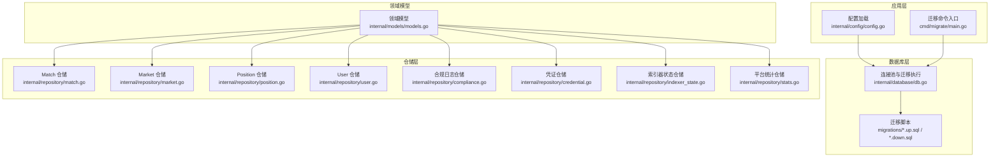
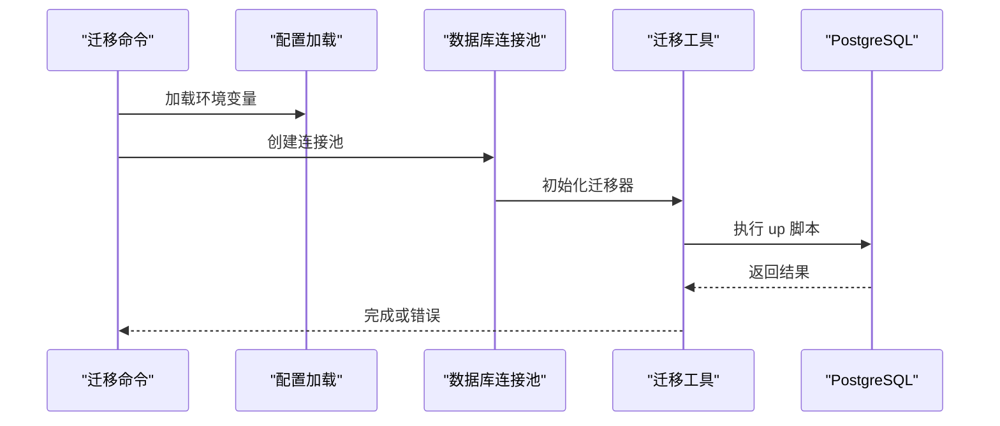
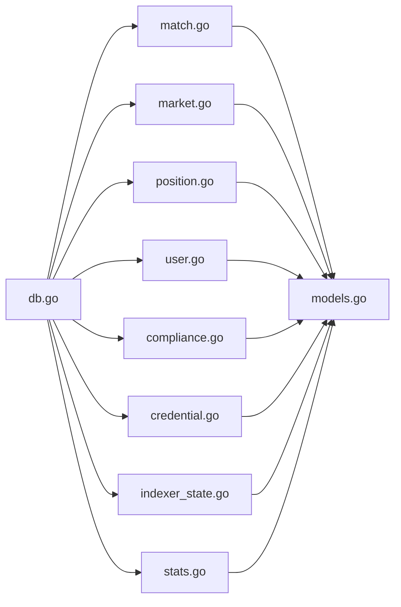

# 数据库设计

<cite>
**本文引用的文件**
- [internal/models/models.go](file://internal/models/models.go)
- [internal/database/db.go](file://internal/database/db.go)
- [internal/config/config.go](file://internal/config/config.go)
- [internal/repository/match.go](file://internal/repository/match.go)
- [internal/repository/market.go](file://internal/repository/market.go)
- [internal/repository/position.go](file://internal/repository/position.go)
- [internal/repository/user.go](file://internal/repository/user.go)
- [internal/repository/compliance.go](file://internal/repository/compliance.go)
- [internal/repository/credential.go](file://internal/repository/credential.go)
- [internal/repository/indexer_state.go](file://internal/repository/indexer_state.go)
- [internal/repository/stats.go](file://internal/repository/stats.go)
- [migrations/000001_init.up.sql](file://migrations/000001_init.up.sql)
- [migrations/000001_init.down.sql](file://migrations/000001_init.down.sql)
- [migrations/000002_phase1.up.sql](file://migrations/000002_phase1.up.sql)
- [migrations/000003_phase2.up.sql](file://migrations/000003_phase2.up.sql)
- [migrations/000004_phase3.up.sql](file://migrations/000004_phase3.up.sql)
- [cmd/migrate/main.go](file://cmd/migrate/main.go)
</cite>

## 目录
1. [简介](#简介)
2. [项目结构](#项目结构)
3. [核心组件](#核心组件)
4. [架构总览](#架构总览)
5. [详细组件分析](#详细组件分析)
6. [依赖分析](#依赖分析)
7. [性能考虑](#性能考虑)
8. [故障排查指南](#故障排查指南)
9. [结论](#结论)
10. [附录](#附录)

## 简介
本文件为 PredictionDIDSimple 的数据库设计与实现文档，聚焦于核心实体（Match、Market、Position、User）及其关系建模，系统性阐述表结构、主外键约束、索引策略、数据完整性规则、数据类型选择与业务规则落地方式；同时覆盖 PostgreSQL 选型理由、迁移策略（版本控制、脚本结构、回滚机制）、性能优化建议（查询、索引、缓存）、数据生命周期管理（保留与归档）、数据访问模式与并发控制、以及数据安全与隐私保护。

## 项目结构
后端采用分层架构：配置加载、数据库连接池与迁移、模型定义、仓储层（Repository）、服务与处理器。数据库层通过 pgx 连接池与 golang-migrate 执行迁移脚本，迁移脚本按版本号顺序组织，支持 up/down 回滚。

图表来源
- [internal/config/config.go](file://internal/config/config.go#L45-L96)
- [internal/database/db.go](file://internal/database/db.go#L28-L42)
- [cmd/migrate/main.go](file://cmd/migrate/main.go#L12-L27)
- [internal/models/models.go](file://internal/models/models.go#L5-L57)
- [internal/repository/match.go](file://internal/repository/match.go#L13-L19)
- [internal/repository/market.go](file://internal/repository/market.go#L13-L19)
- [internal/repository/position.go](file://internal/repository/position.go#L10-L16)
- [internal/repository/user.go](file://internal/repository/user.go#L11-L17)
- [internal/repository/compliance.go](file://internal/repository/compliance.go#L9-L15)
- [internal/repository/credential.go](file://internal/repository/credential.go#L21-L27)
- [internal/repository/indexer_state.go](file://internal/repository/indexer_state.go#L9-L15)
- [internal/repository/stats.go](file://internal/repository/stats.go#L18-L24)

章节来源
- [internal/config/config.go](file://internal/config/config.go#L45-L96)
- [internal/database/db.go](file://internal/database/db.go#L14-L42)
- [cmd/migrate/main.go](file://cmd/migrate/main.go#L12-L27)

## 核心组件
- 领域模型（Go 结构体）用于在应用层表达业务实体与关系，便于序列化/反序列化与跨层传递。
- 仓储层封装对数据库的读写操作，统一使用参数化查询与连接池，保证可维护性与安全性。
- 迁移脚本负责数据库结构演进，支持版本化升级与降级。

章节来源
- [internal/models/models.go](file://internal/models/models.go#L5-L57)
- [internal/repository/match.go](file://internal/repository/match.go#L21-L82)
- [internal/repository/market.go](file://internal/repository/market.go#L21-L117)
- [internal/repository/position.go](file://internal/repository/position.go#L18-L43)
- [internal/repository/user.go](file://internal/repository/user.go#L19-L31)

## 架构总览
数据库层以 PostgreSQL 为核心，使用 UUID 扩展与 pgx 连接池，迁移工具负责结构变更与版本控制。应用通过仓储层进行数据访问，遵循最小暴露原则与参数化查询，避免 SQL 注入。

图表来源
- [cmd/migrate/main.go](file://cmd/migrate/main.go#L12-L27)
- [internal/database/db.go](file://internal/database/db.go#L28-L42)
- [internal/config/config.go](file://internal/config/config.go#L45-L96)

## 详细组件分析

### 数据模型与表关系
- 实体与字段
  - Match：外部标识、球队、开赛时间、状态、比分等。
  - Market：关联 Match，链上工厂/市场地址、链上 ID、问题、结束时间、状态、池子金额、费用、类型、结果计数、价格分等。
  - Position：用户在某市场的多/空头寸，含已认领标记。
  - User：用户地址与 DID 绑定。
  - 衍生/运营表：trades、credentials、oracle_jobs、platform_stats_daily、geo_access_log、kyc_events、reconciliation_runs、indexer_state。
- 关系
  - Market.match_id → Match.id（一对多）
  - Position.market_id → Market.id（一对多）
  - trades.market_id → Market.id（一对多）
  - credentials.user_address → User.address（间接约束）
- 主键/外键与唯一性
  - 多表使用自增主键；markets.market_address 唯一；positions(market_id,user_address) 唯一；trades(tx_hash,log_index) 唯一；indexer_state(id=1) 检查约束。
- 索引策略
  - markets: match_id、status
  - oracle_jobs: status、(market_id) where 状态为特定值
  - credentials: LOWER(user_address)
  - trades: 复合唯一索引
- 时间戳
  - 大多数表包含 created_at/updated_at，默认值为当前时间。

章节来源
- [internal/models/models.go](file://internal/models/models.go#L5-L57)
- [migrations/000002_phase1.up.sql](file://migrations/000002_phase1.up.sql#L1-L76)
- [migrations/000003_phase2.up.sql](file://migrations/000003_phase2.up.sql#L1-L39)
- [migrations/000004_phase3.up.sql](file://migrations/000004_phase3.up.sql#L1-L44)

### 数据类型与业务规则
- 数值精度
  - 使用 NUMERIC(78,0) 存储大整数（如池子、交易量），满足链上金额的高精度要求。
- 文本与枚举
  - 使用 TEXT 字段存储地址、标识、规则等；状态字段以业务语义约束（如 OPEN/RESOLVED/VOID）。
- 默认值与空值
  - 大量字段设置默认值；可空字段用于可选业务属性（如 Match.home_score/away_score、Market.restricted_region）。
- 业务规则实现
  - ON CONFLICT UPSERT：matches、markets、users、positions、credentials 等均采用 upsert 保证幂等。
  - 计算字段：markets 中 yes_pool/no_pool 以数值类型存储；平台统计通过聚合查询计算。
  - 解析与校验：MatchRepo 提供外部 ID 到 Match 的映射与状态更新；MarketRepo 支持按地址解析、解析状态更新、池子更新等。

章节来源
- [migrations/000002_phase1.up.sql](file://migrations/000002_phase1.up.sql#L22-L38)
- [migrations/000003_phase2.up.sql](file://migrations/000003_phase2.up.sql#L3-L5)
- [migrations/000004_phase3.up.sql](file://migrations/000004_phase3.up.sql#L1-L7)
- [internal/repository/match.go](file://internal/repository/match.go#L68-L82)
- [internal/repository/market.go](file://internal/repository/market.go#L103-L126)
- [internal/repository/position.go](file://internal/repository/position.go#L18-L35)

### 数据访问模式与并发控制
- 读写分离与事务
  - 仓储方法以单次查询或更新为主，必要时可在上层组合多个仓储调用；未见显式事务包裹的批量写入。
- 并发控制
  - 使用 pgx 连接池；UPSERT 使用 ON CONFLICT 避免竞态；positions 按 (market_id,user_address) 唯一键保障并发累加一致性。
- 参数化查询
  - 全部使用参数绑定，防止注入风险。

章节来源
- [internal/database/db.go](file://internal/database/db.go#L14-L26)
- [internal/repository/position.go](file://internal/repository/position.go#L18-L35)

### 数据迁移策略
- 版本控制
  - 迁移脚本按序号命名（如 000001、000002），先 up 再 down，确保可逆。
- 脚本结构
  - init：扩展 UUID、schema_meta 元数据表。
  - phase1：核心业务表（matches/users/markets/trades/positions/indexer_state）及基础索引。
  - phase2：Match/Market 扩展字段、oracle_jobs、credentials 及索引。
  - phase3：Market 类型/计数/费用/储备/价格分等扩展、平台统计、地理访问日志、KYC 事件、对账记录。
- 回滚机制
  - 每个 up 对应 down，drop 表/索引/约束，确保安全回退。
- 启动迁移
  - 命令行入口加载配置，定位迁移目录，调用迁移工具执行 up。

章节来源
- [migrations/000001_init.up.sql](file://migrations/000001_init.up.sql#L1-L10)
- [migrations/000001_init.down.sql](file://migrations/000001_init.down.sql#L1-L2)
- [migrations/000002_phase1.up.sql](file://migrations/000002_phase1.up.sql#L1-L76)
- [migrations/000003_phase2.up.sql](file://migrations/000003_phase2.up.sql#L1-L39)
- [migrations/000004_phase3.up.sql](file://migrations/000004_phase3.up.sql#L1-L44)
- [cmd/migrate/main.go](file://cmd/migrate/main.go#L12-L27)

### 数据生命周期管理
- 保留策略
  - trades、positions、users、markets、matches 等核心表保留完整历史，支持审计与复盘。
  - credentials 设置过期时间与撤销标志，定期清理过期凭证。
  - platform_stats_daily 以天为粒度归档，可按需压缩旧数据。
- 归档规则
  - 建议对历史 trades/positions 按时间分区或归档到独立表空间；对 resolved 的 markets 可单独归档。
- 清理与维护
  - 定期清理过期 credentials；对 geo_access_log/kyc_events 设置保留周期。

章节来源
- [migrations/000002_phase1.up.sql](file://migrations/000002_phase1.up.sql#L43-L65)
- [migrations/000003_phase2.up.sql](file://migrations/000003_phase2.up.sql#L28-L39)
- [migrations/000004_phase3.up.sql#L8-L24)

### 数据安全、隐私与访问控制
- 地理限制与合规
  - geo_access_log 记录访问尝试与国家代码；BlockedCountries 由配置注入，结合中间件实现访问控制。
- 凭证与 KYC
  - credentials 存储 VC JSON，带过期与撤销；kyc_events 记录 KYC 状态变化，便于审计。
- 敏感字段
  - 用户地址统一小写存储与查询，降低大小写差异导致的匹配问题。
- 传输与存储
  - 使用 DATABASE_URL 等环境变量配置连接；建议生产环境启用 TLS 与最小权限账号。

章节来源
- [internal/config/config.go](file://internal/config/config.go#L71-L77)
- [internal/repository/compliance.go](file://internal/repository/compliance.go#L17-L22)
- [internal/repository/credential.go](file://internal/repository/credential.go#L29-L73)
- [migrations/000003_phase2.up.sql](file://migrations/000003_phase2.up.sql#L28-L39)

## 依赖分析
- 组件耦合
  - 仓储层依赖 pgx 连接池；模型层仅承载数据结构，低耦合。
- 外部依赖
  - golang-migrate：迁移工具；pgx：PostgreSQL 驱动；uuid-ossp：生成全局唯一标识。
- 循环依赖
  - 未发现循环导入；模型与仓储分层清晰。

图表来源
- [internal/repository/match.go](file://internal/repository/match.go#L13-L19)
- [internal/repository/market.go](file://internal/repository/market.go#L13-L19)
- [internal/repository/position.go](file://internal/repository/position.go#L10-L16)
- [internal/repository/user.go](file://internal/repository/user.go#L11-L17)
- [internal/repository/compliance.go](file://internal/repository/compliance.go#L9-L15)
- [internal/repository/credential.go](file://internal/repository/credential.go#L21-L27)
- [internal/repository/indexer_state.go](file://internal/repository/indexer_state.go#L9-L15)
- [internal/repository/stats.go](file://internal/repository/stats.go#L18-L24)
- [internal/models/models.go](file://internal/models/models.go#L5-L57)
- [internal/database/db.go](file://internal/database/db.go#L14-L26)

## 性能考虑
- 查询优化
  - 使用参数化查询与索引；对高频过滤字段（markets.status、markets.match_id、credentials.user_address）建立索引。
  - 聚合统计通过专用视图或物化视图（建议）减少热点查询压力。
- 索引设计
  - 已有：markets(status)、markets(match_id)、oracle_jobs(status)、oracle_jobs(market_id) 条件唯一索引、credentials(LOWER(user_address))。
  - 建议：根据实际查询模式增加复合索引（如 markets(end_time,status)、trades(block_number)）。
- 缓存策略
  - 使用 Redis 缓存热门市场详情、用户头寸、平台统计数据；结合数据库更新触发缓存失效。
- 连接池与并发
  - 合理配置连接池大小；对只读查询使用只读副本（建议）。
- 分区与归档
  - 对历史表按时间分区或冷热分离，降低扫描范围。

## 故障排查指南
- 迁移失败
  - 检查 DATABASE_URL 是否正确；确认迁移脚本路径；查看迁移工具返回的错误码。
- 连接失败
  - 使用 Ping 方法验证连接；检查网络与防火墙；确认数据库服务运行状态。
- 数据不一致
  - 核对 upsert 逻辑与唯一键；检查 positions 的并发累加是否正确；核对 trades 的去重键。
- 性能问题
  - 分析慢查询日志；补充缺失索引；评估是否需要物化视图或缓存。

章节来源
- [internal/database/db.go](file://internal/database/db.go#L22-L26)
- [cmd/migrate/main.go](file://cmd/migrate/main.go#L23-L25)

## 结论
该数据库设计围绕 Match-Market-Position-User 的核心业务闭环构建，采用 PostgreSQL 的强一致与扩展能力，配合版本化迁移与严格的索引策略，满足预测市场场景下的高精度数值存储、合规审计与高性能查询需求。通过合理的数据生命周期管理与安全策略，能够支撑从开发到生产的全链路演进。

## 附录
- PostgreSQL 选型理由
  - 强大的 JSON/JSONB 支持（credentials、kyc_events）；NUMERIC 高精度；丰富的索引类型；扩展性强（uuid-ossp）。
- 数据完整性规则
  - 唯一键约束、外键引用、CHECK 约束（indexer_state.id=1）、默认值与非空约束。
- 业务规则映射
  - 市场状态机（OPEN/RESOLVED/VOID）、池子与费用计算、头寸累加与认领、凭证有效期与撤销。