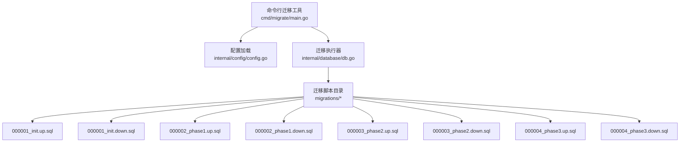
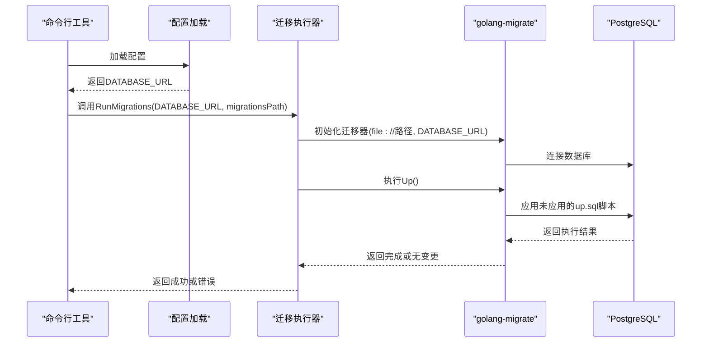
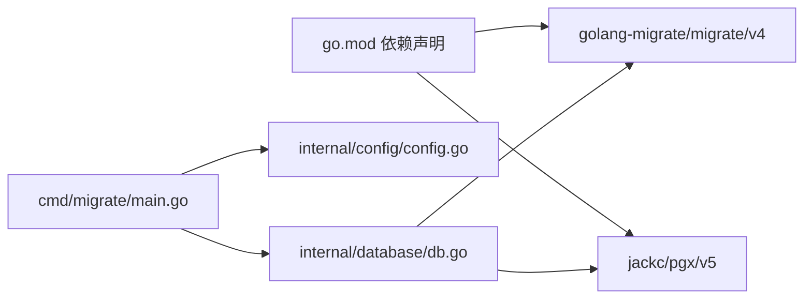

# 数据库迁移管理

<cite>
**本文引用的文件**
- [cmd/migrate/main.go](file://cmd/migrate/main.go)
- [internal/database/db.go](file://internal/database/db.go)
- [internal/config/config.go](file://internal/config/config.go)
- [migrations/000001_init.up.sql](file://migrations/000001_init.up.sql)
- [migrations/000001_init.down.sql](file://migrations/000001_init.down.sql)
- [migrations/000002_phase1.up.sql](file://migrations/000002_phase1.up.sql)
- [migrations/000002_phase1.down.sql](file://migrations/000002_phase1.down.sql)
- [migrations/000003_phase2.up.sql](file://migrations/000003_phase2.up.sql)
- [migrations/000003_phase2.down.sql](file://migrations/000003_phase2.down.sql)
- [migrations/000004_phase3.up.sql](file://migrations/000004_phase3.up.sql)
- [migrations/000004_phase3.down.sql](file://migrations/000004_phase3.down.sql)
- [internal/models/models.go](file://internal/models/models.go)
- [go.mod](file://go.mod)
</cite>

## 目录
1. [简介](#简介)
2. [项目结构](#项目结构)
3. [核心组件](#核心组件)
4. [架构总览](#架构总览)
5. [详细组件分析](#详细组件分析)
6. [依赖分析](#依赖分析)
7. [性能考虑](#性能考虑)
8. [故障排查指南](#故障排查指南)
9. [结论](#结论)
10. [附录](#附录)

## 简介
本文件面向PredictionDIDSimple项目的数据库迁移管理，系统性说明版本控制策略、迁移脚本结构与规范、执行流程、阶段化演进策略、最佳实践以及常见问题排查方法。项目采用PostgreSQL与golang-migrate进行迁移管理，迁移脚本位于migrations目录，按顺序编号推进。

## 项目结构
- 迁移入口：命令行工具cmd/migrate/main.go负责加载配置并调用迁移执行函数。
- 迁移执行：internal/database/db.go封装了基于golang-migrate的Up()执行逻辑。
- 配置来源：internal/config/config.go提供DATABASE_URL等运行时参数。
- 迁移脚本：migrations目录下包含多版本up/down脚本，按序号递增。

**图表来源**
- [cmd/migrate/main.go](file://cmd/migrate/main.go#L12-L27)
- [internal/database/db.go](file://internal/database/db.go#L28-L42)
- [internal/config/config.go](file://internal/config/config.go#L45-L96)
- [migrations/000001_init.up.sql](file://migrations/000001_init.up.sql#L1-L10)
- [migrations/000001_init.down.sql](file://migrations/000001_init.down.sql#L1-L2)
- [migrations/000002_phase1.up.sql](file://migrations/000002_phase1.up.sql#L1-L76)
- [migrations/000002_phase1.down.sql](file://migrations/000002_phase1.down.sql#L1-L7)
- [migrations/000003_phase2.up.sql](file://migrations/000003_phase2.up.sql#L1-L39)
- [migrations/000003_phase2.down.sql](file://migrations/000003_phase2.down.sql#L1-L7)
- [migrations/000004_phase3.up.sql](file://migrations/000004_phase3.up.sql#L1-L44)
- [migrations/000004_phase3.down.sql](file://migrations/000004_phase3.down.sql#L1-L11)

**章节来源**
- [cmd/migrate/main.go](file://cmd/migrate/main.go#L12-L27)
- [internal/database/db.go](file://internal/database/db.go#L28-L42)
- [internal/config/config.go](file://internal/config/config.go#L45-L96)

## 核心组件
- 命令行迁移工具：解析运行环境，定位migrations目录，调用迁移执行器。
- 迁移执行器：通过golang-migrate连接数据库，执行Up()，处理无变更场景。
- 配置加载：读取DATABASE_URL等环境变量，校验必填项。
- 迁移脚本：按版本号顺序组织，每个版本包含up.sql与down.sql成对脚本。

**章节来源**
- [cmd/migrate/main.go](file://cmd/migrate/main.go#L12-L27)
- [internal/database/db.go](file://internal/database/db.go#L28-L42)
- [internal/config/config.go](file://internal/config/config.go#L45-L96)

## 架构总览
迁移执行链路自上而下：命令行工具 -> 配置加载 -> 迁移执行器 -> golang-migrate -> PostgreSQL。

**图表来源**
- [cmd/migrate/main.go](file://cmd/migrate/main.go#L18-L25)
- [internal/database/db.go](file://internal/database/db.go#L29-L41)
- [internal/config/config.go](file://internal/config/config.go#L79-L81)

## 详细组件分析

### 命令行迁移工具（cmd/migrate/main.go）
- 功能：加载配置，确定migrations目录位置，调用RunMigrations执行迁移。
- 关键点：支持相对路径与backend子目录两种migrations路径探测；日志输出“migrations ok”。

**章节来源**
- [cmd/migrate/main.go](file://cmd/migrate/main.go#L12-L27)

### 迁移执行器（internal/database/db.go）
- 功能：封装golang-migrate初始化、Up()执行、错误处理。
- 关键点：使用file://前缀指定本地脚本目录；Up()返回ErrNoChange表示无需迁移；关闭migrate实例避免资源泄漏。

**章节来源**
- [internal/database/db.go](file://internal/database/db.go#L28-L42)

### 配置加载（internal/config/config.go）
- 功能：统一读取环境变量，校验DATABASE_URL必填。
- 关键点：若未设置DATABASE_URL，返回错误；支持多种业务配置项。

**章节来源**
- [internal/config/config.go](file://internal/config/config.go#L45-L96)

### 迁移脚本结构与版本管理
- 命名规范：以固定宽度序号+语义化名称组成，如000001_init、000002_phase1等。
- 版本号管理：按顺序递增，确保幂等与可追踪。
- 变更历史记录：通过schema_meta表记录当前版本字符串，便于审计与回溯。

**章节来源**
- [migrations/000001_init.up.sql](file://migrations/000001_init.up.sql#L3-L9)

### 初始Schema创建（000001_init）
- up.sql：启用uuid扩展、创建schema_meta表并插入初始版本记录。
- down.sql：删除schema_meta表，用于回滚至空态。

**章节来源**
- [migrations/000001_init.up.sql](file://migrations/000001_init.up.sql#L1-L10)
- [migrations/000001_init.down.sql](file://migrations/000001_init.down.sql#L1-L2)

### 第一阶段：核心实体建模（000002_phase1）
- up.sql：创建matches、users、markets、trades、positions、indexer_state等表及索引；初始化indexer_state。
- down.sql：按依赖逆序删除表，保证外键约束安全解除。

**章节来源**
- [migrations/000002_phase1.up.sql](file://migrations/000002_phase1.up.sql#L1-L76)
- [migrations/000002_phase1.down.sql](file://migrations/000002_phase1.down.sql#L1-L7)

### 第二阶段：合规与预言机增强（000003_phase2）
- up.sql：为matches与markets新增列；新增oracle_jobs与credentials表及索引。
- down.sql：删除新表与列，恢复markets原状。

**章节来源**
- [migrations/000003_phase2.up.sql](file://migrations/000003_phase2.up.sql#L1-L39)
- [migrations/000003_phase2.down.sql](file://migrations/000003_phase2.down.sql#L1-L7)

### 第三阶段：运营与风控扩展（000004_phase3）
- up.sql：为markets新增类型与费用字段；新增platform_stats_daily、geo_access_log、kyc_events、reconciliation_runs等表。
- down.sql：删除新表与列，保持向后兼容。

**章节来源**
- [migrations/000004_phase3.up.sql](file://migrations/000004_phase3.up.sql#L1-L44)
- [migrations/000004_phase3.down.sql](file://migrations/000004_phase3.down.sql#L1-L11)

### 模型映射与迁移一致性（internal/models/models.go）
- 作用：定义应用侧数据模型，确保代码与数据库结构一致。
- 建议：随着迁移版本演进，同步更新模型字段，避免运行期类型不匹配。

**章节来源**
- [internal/models/models.go](file://internal/models/models.go#L5-L57)

## 依赖分析
- 外部依赖：golang-migrate/migrate/v4用于迁移管理；jackc/pgx/v5用于PostgreSQL连接池。
- 内部耦合：命令行工具依赖配置加载与数据库模块；数据库模块依赖golang-migrate与PostgreSQL驱动。

**图表来源**
- [go.mod](file://go.mod#L10-L11)
- [cmd/migrate/main.go](file://cmd/migrate/main.go#L8-L9)
- [internal/database/db.go](file://internal/database/db.go#L8-L11)

**章节来源**
- [go.mod](file://go.mod#L10-L11)
- [cmd/migrate/main.go](file://cmd/migrate/main.go#L8-L9)
- [internal/database/db.go](file://internal/database/db.go#L8-L11)

## 性能考虑
- 迁移执行时间：在生产环境应尽量缩短迁移窗口，避免长时间锁表。
- 索引创建：分阶段添加索引，减少单次DDL开销。
- 幂等性：所有DDL应具备IF NOT EXISTS或ON CONFLICT处理，提升重复执行安全性。
- 连接池：数据库连接池由pgx管理，建议在迁移前后合理控制并发与超时。

[本节为通用指导，无需列出章节来源]

## 故障排查指南
- 迁移失败
  - 现象：命令行输出错误信息。
  - 排查：确认DATABASE_URL正确；检查migrations目录路径；查看具体up.sql报错行。
  - 解决：修正脚本语法或权限问题后重试。
- 数据库连接失败
  - 现象：Up()阶段连接异常。
  - 排查：验证DATABASE_URL格式与可达性；检查网络与认证配置。
  - 解决：修复连接串或服务端配置。
- 无变更但报错
  - 现象：Up()返回ErrNoChange，但工具仍报错。
  - 排查：确认执行器对ErrNoChange的处理逻辑。
  - 解决：忽略ErrNoChange或调整日志级别。
- 回滚需求
  - 现象：需要撤销某版本变更。
  - 排查：使用对应的down.sql脚本；注意依赖顺序。
  - 解决：按down.sql逆序删除对象，确保外键与索引清理完毕。
- 版本冲突
  - 现象：迁移版本与实际数据库不一致。
  - 排查：检查schema_meta中的版本记录；核对已应用的up.sql。
  - 解决：必要时手动维护schema_meta或使用数据库迁移工具的版本锁定能力。

**章节来源**
- [internal/database/db.go](file://internal/database/db.go#L38-L40)
- [internal/config/config.go](file://internal/config/config.go#L79-L81)

## 结论
本项目采用清晰的版本化迁移策略，通过golang-migrate与PostgreSQL配合，实现了从初始Schema到功能演进的全生命周期管理。遵循本文的命名规范、编写规范与执行流程，可在开发、测试与生产环境中稳定推进数据库演进。

[本节为总结性内容，无需列出章节来源]

## 附录

### 迁移执行流程（启动时自动迁移）
- 启动应用时，建议在初始化数据库连接前先执行迁移，确保Schema处于目标版本。
- 若使用独立迁移工具，可直接运行cmd/migrate/main.go，它会自动加载配置并执行Up()。

**章节来源**
- [cmd/migrate/main.go](file://cmd/migrate/main.go#L12-L27)
- [internal/database/db.go](file://internal/database/db.go#L28-L42)

### 手动迁移命令
- 使用命令行工具执行迁移：go run cmd/migrate/main.go
- 确保DATABASE_URL环境变量已设置，且migrations目录存在。

**章节来源**
- [cmd/migrate/main.go](file://cmd/migrate/main.go#L18-L25)
- [internal/config/config.go](file://internal/config/config.go#L79-L81)

### 迁移状态检查
- 检查schema_meta表中的version字段，确认当前版本。
- 在数据库中查询迁移执行日志（如使用golang-migrate的内置表），确认已应用的版本与时间戳。

**章节来源**
- [migrations/000001_init.up.sql](file://migrations/000001_init.up.sql#L3-L9)

### 不同阶段的迁移策略
- 初始Schema创建：仅包含基础表与元数据表，确保最小可用。
- 功能演进：逐步引入业务表与索引，保持向后兼容。
- 运营与风控：增加统计、日志与合规相关表，支撑平台运营。

**章节来源**
- [migrations/000001_init.up.sql](file://migrations/000001_init.up.sql#L1-L10)
- [migrations/000002_phase1.up.sql](file://migrations/000002_phase1.up.sql#L1-L76)
- [migrations/000003_phase2.up.sql](file://migrations/000003_phase2.up.sql#L1-L39)
- [migrations/000004_phase3.up.sql](file://migrations/000004_phase3.up.sql#L1-L44)

### 迁移最佳实践
- 数据备份：在生产环境执行重大迁移前，务必进行数据库快照或导出。
- 迁移测试：在预生产环境完整复现迁移流程，验证up.sql与down.sql。
- 生产部署策略：采用蓝绿部署或灰度发布，先在小流量环境验证，再全量上线。
- 幂等性与回滚：所有DDL需具备幂等性；严格维护up/down脚本对应关系。
- 监控与告警：迁移期间监控数据库连接数、执行耗时与错误率。

[本节为通用指导，无需列出章节来源]