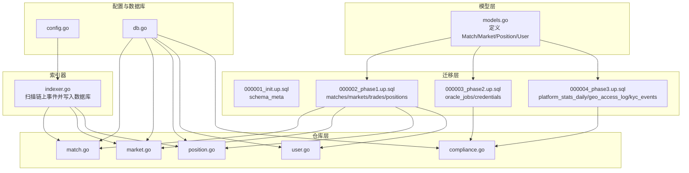
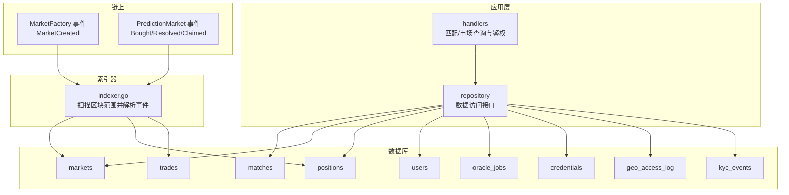
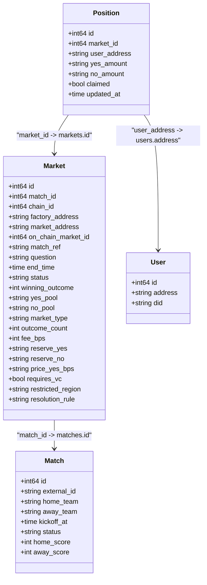
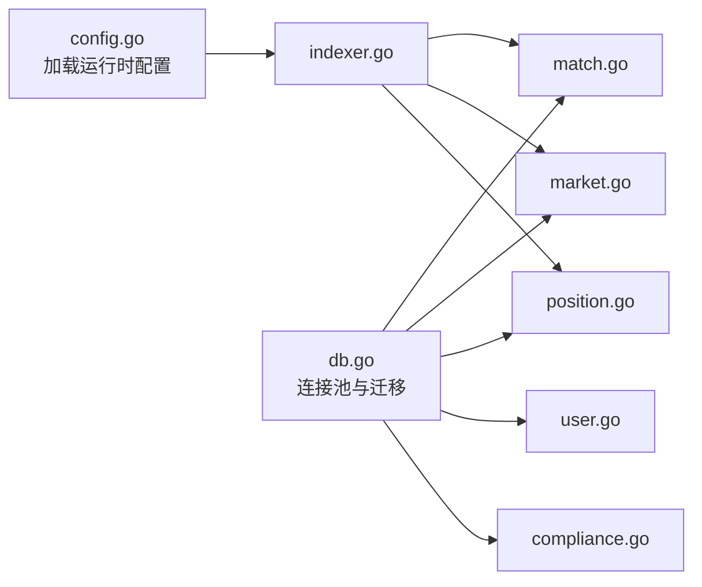
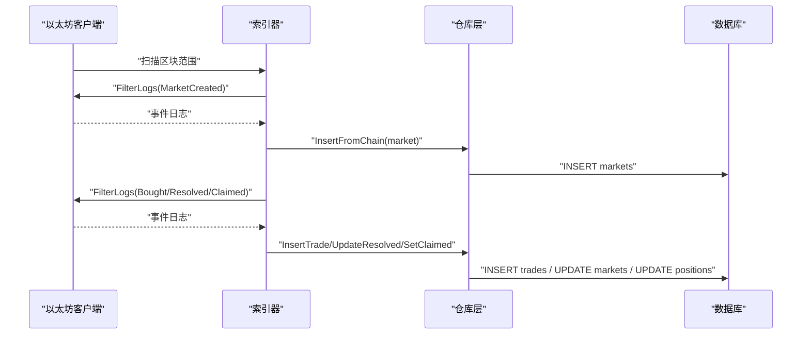

# 数据模型设计

<cite>
**本文引用的文件**
- [internal/models/models.go](file://internal/models/models.go)
- [migrations/000001_init.up.sql](file://migrations/000001_init.up.sql)
- [migrations/000002_phase1.up.sql](file://migrations/000002_phase1.up.sql)
- [migrations/000003_phase2.up.sql](file://migrations/000003_phase2.up.sql)
- [migrations/000004_phase3.up.sql](file://migrations/000004_phase3.up.sql)
- [internal/repository/match.go](file://internal/repository/match.go)
- [internal/repository/market.go](file://internal/repository/market.go)
- [internal/repository/position.go](file://internal/repository/position.go)
- [internal/repository/user.go](file://internal/repository/user.go)
- [internal/repository/compliance.go](file://internal/repository/compliance.go)
- [internal/indexer/indexer.go](file://internal/indexer/indexer.go)
- [internal/config/config.go](file://internal/config/config.go)
- [internal/database/db.go](file://internal/database/db.go)
</cite>

## 目录
1. [简介](#简介)
2. [项目结构](#项目结构)
3. [核心组件](#核心组件)
4. [架构总览](#架构总览)
5. [详细组件分析](#详细组件分析)
6. [依赖分析](#依赖分析)
7. [性能考虑](#性能考虑)
8. [故障排查指南](#故障排查指南)
9. [结论](#结论)
10. [附录](#附录)

## 简介
本文件为 PredictionDIDSimple 的数据模型设计文档，聚焦于核心实体模型与关系映射，涵盖 Match（比赛）、Market（市场）、Position（持仓）、User（用户）等关键数据结构的设计理念、字段定义、主外键约束与数据完整性保障机制。同时阐述业务规则在数据模型中的体现，如市场状态管理、用户权限控制、交易规则、合规限制等，并提供实体关系图、字段类型说明及数据验证与业务逻辑约束的具体实现位置。

## 项目结构
后端采用分层架构：模型层（models）定义领域对象；迁移脚本（migrations）定义数据库表结构与约束；仓库层（repository）封装数据访问；索引器（indexer）负责链上事件同步；配置与数据库工具提供运行时参数与连接管理。

图表来源
- [internal/models/models.go](file://internal/models/models.go#L1-L58)
- [migrations/000002_phase1.up.sql](file://migrations/000002_phase1.up.sql#L1-L76)
- [migrations/000003_phase2.up.sql](file://migrations/000003_phase2.up.sql#L1-L39)
- [migrations/000004_phase3.up.sql](file://migrations/000004_phase3.up.sql#L1-L44)
- [internal/repository/match.go](file://internal/repository/match.go#L1-L104)
- [internal/repository/market.go](file://internal/repository/market.go#L1-L246)
- [internal/repository/position.go](file://internal/repository/position.go#L1-L95)
- [internal/repository/user.go](file://internal/repository/user.go#L1-L50)
- [internal/repository/compliance.go](file://internal/repository/compliance.go#L1-L30)
- [internal/indexer/indexer.go](file://internal/indexer/indexer.go#L1-L275)
- [internal/config/config.go](file://internal/config/config.go#L1-L128)
- [internal/database/db.go](file://internal/database/db.go#L1-L43)

章节来源
- [internal/models/models.go](file://internal/models/models.go#L1-L58)
- [migrations/000002_phase1.up.sql](file://migrations/000002_phase1.up.sql#L1-L76)
- [internal/repository/match.go](file://internal/repository/match.go#L1-L104)
- [internal/repository/market.go](file://internal/repository/market.go#L1-L246)
- [internal/repository/position.go](file://internal/repository/position.go#L1-L95)
- [internal/repository/user.go](file://internal/repository/user.go#L1-L50)
- [internal/repository/compliance.go](file://internal/repository/compliance.go#L1-L30)
- [internal/indexer/indexer.go](file://internal/indexer/indexer.go#L1-L275)
- [internal/config/config.go](file://internal/config/config.go#L1-L128)
- [internal/database/db.go](file://internal/database/db.go#L1-L43)

## 核心组件
本节从数据模型角度梳理核心实体及其职责边界：
- Match（比赛）：记录外部赛事信息、开赛时间、状态与比分，用于与链上市场进行语义关联。
- Market（市场）：记录链上预测市场的元数据、状态、池子规模、费用结构、可选的凭证要求与区域限制等。
- Position（持仓）：记录用户在各市场的多/空头寸与已结算标记，支持按市场与用户聚合。
- User（用户）：记录用户钱包地址与可选的去中心身份标识（DID），用于权限与合规绑定。

章节来源
- [internal/models/models.go](file://internal/models/models.go#L5-L57)

## 架构总览
下图展示数据模型在系统中的交互关系：索引器从链上读取事件，写入数据库；仓库层提供统一的数据访问接口；处理器根据业务规则进行权限校验与返回数据。

图表来源
- [internal/indexer/indexer.go](file://internal/indexer/indexer.go#L137-L275)
- [migrations/000002_phase1.up.sql](file://migrations/000002_phase1.up.sql#L22-L65)
- [migrations/000003_phase2.up.sql](file://migrations/000003_phase2.up.sql#L7-L39)
- [migrations/000004_phase3.up.sql](file://migrations/000004_phase3.up.sql#L8-L44)
- [internal/repository/match.go](file://internal/repository/match.go#L68-L82)
- [internal/repository/market.go](file://internal/repository/market.go#L103-L126)
- [internal/repository/position.go](file://internal/repository/position.go#L18-L43)

## 详细组件分析

### 实体关系与字段定义
- 主键与唯一性
  - 所有表均使用自增主键或显式主键约束，确保行级唯一性。
  - 外键约束明确指向父表主键，保证引用完整性。
  - 唯一性约束覆盖外部 ID、市场地址、用户地址等关键字段，避免重复。
- 字段类型与用途
  - 时间戳：Timestamptz 类型用于记录创建与更新时间，便于跨时区一致性。
  - 数值：大整数与高精度数值类型用于处理链上金额与池子规模，避免精度损失。
  - 文本：TEXT/JSONB 用于存储问题描述、规则、凭证内容与原始日志。
  - 枚举：通过文本域与默认值表达有限状态集合（如状态字段）。
- 可空与默认值
  - 可空字段用于表示可选属性（如比分、获胜结果、区域限制等）。
  - 默认值用于状态、费用、池子规模等关键字段，确保新记录具备合理初始值。

章节来源
- [migrations/000002_phase1.up.sql](file://migrations/000002_phase1.up.sql#L1-L76)
- [migrations/000003_phase2.up.sql](file://migrations/000003_phase2.up.sql#L1-L39)
- [migrations/000004_phase3.up.sql](file://migrations/000004_phase3.up.sql#L1-L44)

### 关系映射与约束
- 一对一
  - Market 与 Match：通过 match_id 引用，部分市场无直接关联（match_id 可空）。
- 一对多
  - Match → Market：一个比赛可对应多个市场（不同规则/时间窗口）。
  - Market → Position：一个市场存在多个用户的持仓记录。
  - Market → Trade：一个市场存在多笔交易记录。
  - User → Position：一个用户在多个市场持有头寸。
- 多对多
  - 通过中间表实现：Positions 与 Markets、Users 的组合唯一性由复合唯一索引保证。
- 外键与检查约束
  - 外键约束确保子表引用父表存在性。
  - 检查约束用于限制单例状态（如索引器状态表的 id=1）。
  - 唯一索引防止重复注册（如市场地址、用户地址、交易哈希+日志索引）。

章节来源
- [migrations/000002_phase1.up.sql](file://migrations/000002_phase1.up.sql#L22-L65)
- [migrations/000003_phase2.up.sql](file://migrations/000003_phase2.up.sql#L7-L26)
- [internal/repository/market.go](file://internal/repository/market.go#L128-L144)
- [internal/repository/position.go](file://internal/repository/position.go#L45-L84)

### 数据模型类图

图表来源
- [internal/models/models.go](file://internal/models/models.go#L5-L57)
- [migrations/000002_phase1.up.sql](file://migrations/000002_phase1.up.sql#L22-L65)

### 业务规则在数据模型中的体现
- 市场状态管理
  - 状态字段（如 OPEN/RESOLVED/VOID）通过默认值与更新接口控制，索引器在链上事件触发时更新状态与池子规模。
- 用户权限控制
  - 市场可配置凭证要求（requires_vc），处理器在查询市场详情时结合凭证类型进行访问判定。
- 交易规则
  - 交易记录包含交易哈希与日志索引的唯一性，避免重复计入；头寸按用户与市场聚合，支持多空方向累加。
- 合规与风控
  - 地理访问日志与 KYC 事件记录用于合规审计；区域限制字段与地理阻断开关共同作用于访问控制。
- 费用与池子
  - 市场费用（bps）、池子规模（yes/no pool）与价格参数（price_yes_bps）在模型中保留，供前端订单簿与统计模块使用。

章节来源
- [internal/repository/market.go](file://internal/repository/market.go#L119-L126)
- [internal/repository/market.go](file://internal/repository/market.go#L169-L172)
- [internal/repository/position.go](file://internal/repository/position.go#L18-L35)
- [internal/repository/compliance.go](file://internal/repository/compliance.go#L17-L29)
- [internal/handler/markets.go](file://internal/handler/markets.go#L37-L43)

### 数据验证与业务逻辑约束
- 输入校验
  - 处理器对请求参数进行解析与校验（如 id、limit、offset），非法输入返回错误响应。
- 数据完整性
  - 数据库约束（唯一、外键、检查）与仓库层的 upsert/on conflict 逻辑共同保证幂等性与一致性。
- 业务一致性
  - 索引器扫描区块范围并解析事件，确保链上状态与数据库一致；对重复事件通过唯一索引进行去重。

章节来源
- [internal/handler/matches.go](file://internal/handler/matches.go#L7-L17)
- [internal/handler/markets.go](file://internal/handler/markets.go#L9-L23)
- [internal/repository/match.go](file://internal/repository/match.go#L68-L82)
- [internal/repository/market.go](file://internal/repository/market.go#L103-L117)
- [internal/repository/position.go](file://internal/repository/position.go#L87-L94)
- [internal/indexer/indexer.go](file://internal/indexer/indexer.go#L106-L135)

## 依赖分析
- 组件耦合
  - 仓库层对数据库表结构强依赖，迁移脚本变更需同步调整仓库扫描与插入逻辑。
  - 索引器依赖 ABI 与配置，解析事件后调用仓库接口写入数据库。
- 外部依赖
  - 以太坊 RPC 客户端用于事件扫描；PostgreSQL 连接池用于并发访问；迁移工具用于版本演进。
- 接口契约
  - 仓库方法签名与 SQL 查询保持稳定，便于替换实现与扩展。

图表来源
- [internal/config/config.go](file://internal/config/config.go#L45-L97)
- [internal/database/db.go](file://internal/database/db.go#L14-L42)
- [internal/indexer/indexer.go](file://internal/indexer/indexer.go#L35-L58)
- [internal/repository/match.go](file://internal/repository/match.go#L17-L19)
- [internal/repository/market.go](file://internal/repository/market.go#L17-L19)
- [internal/repository/position.go](file://internal/repository/position.go#L14-L16)
- [internal/repository/user.go](file://internal/repository/user.go#L15-L17)
- [internal/repository/compliance.go](file://internal/repository/compliance.go#L13-L15)

章节来源
- [internal/config/config.go](file://internal/config/config.go#L1-L128)
- [internal/database/db.go](file://internal/database/db.go#L1-L43)
- [internal/indexer/indexer.go](file://internal/indexer/indexer.go#L1-L275)
- [internal/repository/match.go](file://internal/repository/match.go#L1-L104)
- [internal/repository/market.go](file://internal/repository/market.go#L1-L246)
- [internal/repository/position.go](file://internal/repository/position.go#L1-L95)
- [internal/repository/user.go](file://internal/repository/user.go#L1-L50)
- [internal/repository/compliance.go](file://internal/repository/compliance.go#L1-L30)

## 性能考虑
- 索引策略
  - 对常用过滤字段（如 markets.status、markets.match_id、positions.user_address、oracle_jobs.status）建立索引，提升查询效率。
- 扫描范围控制
  - 索引器每次扫描上限为固定区块范围，避免一次性处理过多事件导致超时。
- 数值类型选择
  - 使用高精度数值类型存储链上金额，减少精度误差与转换成本。
- 并发与连接
  - 使用连接池管理数据库连接，避免频繁创建销毁带来的开销。

章节来源
- [migrations/000002_phase1.up.sql](file://migrations/000002_phase1.up.sql#L40-L41)
- [migrations/000003_phase2.up.sql](file://migrations/000003_phase2.up.sql#L24-L26)
- [internal/indexer/indexer.go](file://internal/indexer/indexer.go#L122-L126)

## 故障排查指南
- 数据不一致
  - 检查索引器上次扫描区块号与当前区块高度，确认是否存在长时间未轮询的情况。
  - 核对 markets 表的状态更新逻辑与链上事件是否匹配。
- 重复数据
  - 检查 trades 表的唯一索引（tx_hash, log_index）是否生效，确认 upsert 逻辑是否正确执行。
- 权限拒绝
  - 确认市场是否启用凭证要求（requires_vc），以及用户凭证类型是否满足要求。
- 合规日志缺失
  - 检查 geo_access_log 与 kyc_events 写入路径，确认合规开关与环境变量配置正确。

章节来源
- [internal/indexer/indexer.go](file://internal/indexer/indexer.go#L106-L135)
- [internal/repository/market.go](file://internal/repository/market.go#L119-L126)
- [internal/repository/position.go](file://internal/repository/position.go#L87-L94)
- [internal/handler/markets.go](file://internal/handler/markets.go#L37-L43)
- [internal/repository/compliance.go](file://internal/repository/compliance.go#L17-L29)

## 结论
该数据模型围绕“比赛—市场—持仓—用户”主线构建，通过数据库约束与仓库层逻辑共同保障数据完整性与业务一致性。索引器与处理器分别承担链上同步与业务编排职责，配合合规与风控字段，形成完整的预测市场数据通路。建议在后续演进中持续完善索引策略与监控告警，确保系统在高并发与复杂业务场景下的稳定性与可维护性。

## 附录
- 字段类型与示例
  - 时间戳：Timestamptz，用于记录创建与更新时间。
  - 数值：NUMERIC(78,0) 用于存储链上金额；SMALLINT/INT 用于状态码与计数。
  - 文本：TEXT 用于描述性字段；JSONB 用于凭证与日志。
  - 布尔：BOOLEAN 用于开关类字段（如 requires_vc、claimed）。
- 关键流程示意
  - 市场创建：工厂合约事件触发，索引器写入 markets 表。
  - 交易撮合：市场合约事件触发，索引器写入 trades 与 positions。
  - 市场结算：解析 Resolved 事件，更新 markets 状态与池子。

图表来源
- [internal/indexer/indexer.go](file://internal/indexer/indexer.go#L137-L275)
- [internal/repository/market.go](file://internal/repository/market.go#L103-L126)
- [internal/repository/position.go](file://internal/repository/position.go#L87-L94)