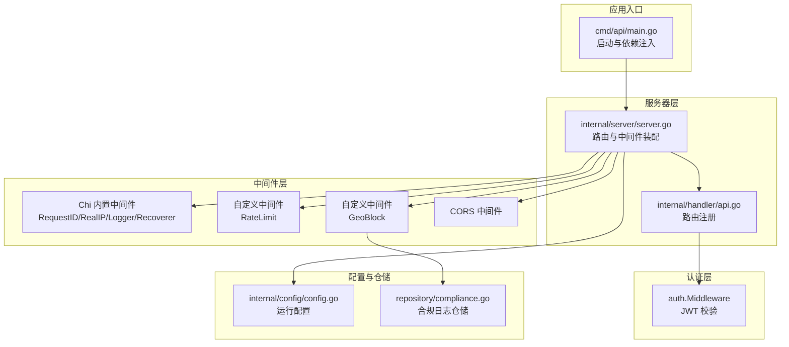
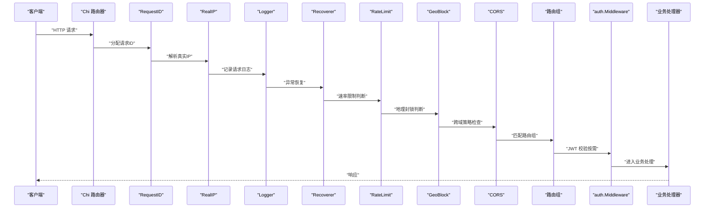
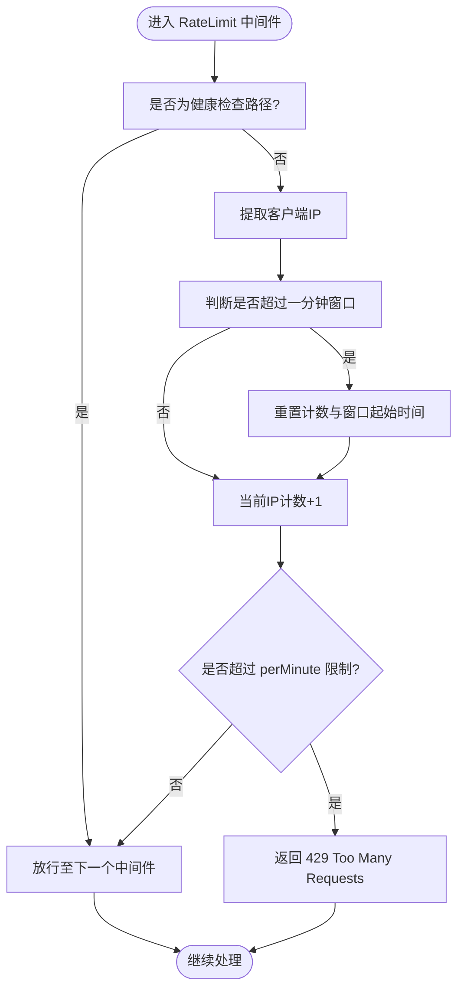
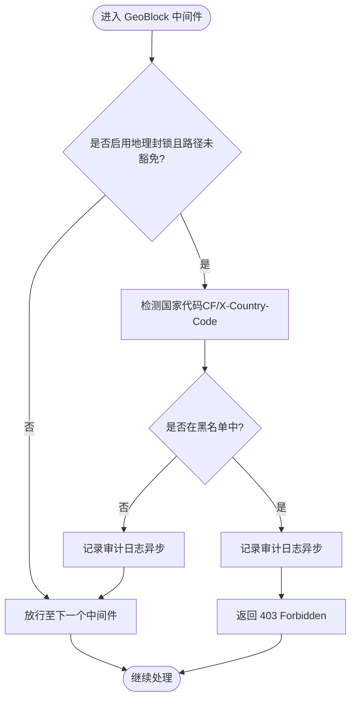
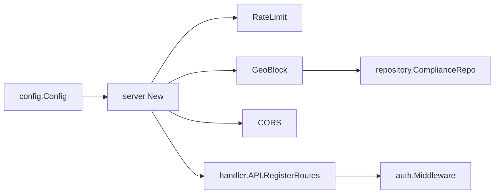

# 中间件系统设计

<cite>
**本文引用的文件**
- [server.go](file://internal/server/server.go)
- [ratelimit.go](file://internal/middleware/ratelimit.go)
- [geo.go](file://internal/middleware/geo.go)
- [middleware.go](file://internal/auth/middleware.go)
- [config.go](file://internal/config/config.go)
- [api.go](file://internal/handler/api.go)
- [compliance.go](file://internal/repository/compliance.go)
- [main.go](file://cmd/api/main.go)
</cite>

## 目录
1. [简介](#简介)
2. [项目结构](#项目结构)
3. [核心组件](#核心组件)
4. [架构总览](#架构总览)
5. [详细组件分析](#详细组件分析)
6. [依赖分析](#依赖分析)
7. [性能考量](#性能考量)
8. [故障排查指南](#故障排查指南)
9. [结论](#结论)
10. [附录](#附录)

## 简介
本设计文档聚焦 PredictionDIDSimple 项目的中间件系统，系统采用 Chi 路由与中间件链模式，结合 Chi 内置中间件与自定义中间件，实现全局横切关注点的统一治理，包括：请求追踪、真实 IP 获取、请求日志、异常恢复、速率限制、地理封锁、CORS 跨域、JWT 认证与管理员鉴权等。文档将阐述中间件的注册顺序、职责分离原则、执行链路、性能与扩展机制，并给出配置最佳实践。

## 项目结构
中间件体系主要分布在以下模块：
- 服务器与路由装配：在服务器初始化阶段集中注册全局中间件与路由
- 自定义中间件：速率限制与地理封锁
- 认证中间件：JWT 校验与管理员鉴权
- 配置中心：提供运行期开关与阈值
- 路由注册：按需在路由组内叠加认证类中间件

图表来源
- [server.go:44-102](file://internal/server/server.go#L44-L102)
- [api.go:33-69](file://internal/handler/api.go#L33-L69)
- [config.go:12-46](file://internal/config/config.go#L12-L46)
- [compliance.go:21-27](file://internal/repository/compliance.go#L21-L27)

章节来源
- [server.go:44-102](file://internal/server/server.go#L44-L102)
- [api.go:33-69](file://internal/handler/api.go#L33-L69)
- [config.go:12-46](file://internal/config/config.go#L12-L46)
- [compliance.go:21-27](file://internal/repository/compliance.go#L21-L27)

## 核心组件
- Chi 内置中间件（全局）
  - RequestID：为每个请求生成唯一标识
  - RealIP：解析真实客户端 IP（支持代理）
  - Logger：记录请求日志
  - Recoverer：捕获 panic，避免服务崩溃
- 自定义中间件
  - RateLimit：基于 IP 的每分钟滑动窗口限流
  - GeoBlock：基于国家代码的地理封锁，支持豁免路径与审计日志
- CORS 中间件：统一跨域策略
- 认证中间件
  - auth.Middleware：校验 Bearer JWT，将钱包地址注入上下文
- 配置中心
  - GeoBlockEnabled、BlockedCountries、RateLimitPerMinute 等运行期开关与阈值
- 合规仓储：异步记录地理访问日志

章节来源
- [server.go:47-67](file://internal/server/server.go#L47-L67)
- [ratelimit.go:42-66](file://internal/middleware/ratelimit.go#L42-L66)
- [geo.go:14-41](file://internal/middleware/geo.go#L14-L41)
- [config.go:40-42](file://internal/config/config.go#L40-L42)
- [compliance.go:21-27](file://internal/repository/compliance.go#L21-L27)

## 架构总览
中间件链在服务器初始化阶段一次性装配，形成“全局中间件 → 路由 → 认证中间件 → 处理器”的执行序列。Chi 的路由组允许在特定路由组内叠加认证中间件，从而实现细粒度的权限控制。

图表来源
- [server.go:47-67](file://internal/server/server.go#L47-L67)
- [api.go:52-58](file://internal/handler/api.go#L52-L58)
- [middleware.go:17-43](file://internal/auth/middleware.go#L17-L43)

## 详细组件分析

### 全局中间件链与注册顺序
- 注册顺序严格遵循“前置处理 → 安全防护 → 跨域 → 路由”的原则，确保：
  - RequestID/RealIP/Logger/Recoverer 位于链首，保证后续中间件与处理器具备一致的上下文与可观测性
  - RateLimit 与 GeoBlock 作为安全前置，尽早拒绝异常流量
  - CORS 在路由匹配之前生效，避免 OPTIONS 预检绕过
- 服务器装配位置与关键配置项：
  - 全局中间件注册：RequestID、RealIP、Logger、Recoverer、RateLimit
  - 地理封锁中间件：根据配置开关与豁免路径决定是否启用
  - CORS：允许指定来源、方法与头部，支持凭据传递
  - 路由注册：公开接口、登录接口、JWT 授权接口、管理员接口

章节来源
- [server.go:47-67](file://internal/server/server.go#L47-L67)
- [server.go:69-91](file://internal/server/server.go#L69-L91)

### 速率限制中间件（基于 IP 的滑动窗口）
- 设计要点
  - 每分钟一个滑动窗口，窗口重置后清空计数
  - 健康检查路径豁免限流，避免监控自扰
  - 使用互斥锁保护并发访问
- 执行流程

图表来源
- [ratelimit.go:28-40](file://internal/middleware/ratelimit.go#L28-L40)
- [ratelimit.go:42-66](file://internal/middleware/ratelimit.go#L42-L66)

章节来源
- [ratelimit.go:12-40](file://internal/middleware/ratelimit.go#L12-L40)
- [ratelimit.go:42-66](file://internal/middleware/ratelimit.go#L42-L66)

### 地理封锁中间件（基于国家代码）
- 设计要点
  - 支持配置开关与国家黑名单
  - 豁免路径：健康检查、指标、合规受限名单、事件流等
  - 优先从 Cloudflare 或自定义头提取国家代码，兜底 UNKNOWN
  - 通过回调将访问日志异步写入合规仓储
- 执行流程

图表来源
- [geo.go:14-41](file://internal/middleware/geo.go#L14-L41)
- [geo.go:43-51](file://internal/middleware/geo.go#L43-L51)
- [geo.go:53-64](file://internal/middleware/geo.go#L53-L64)
- [compliance.go:21-27](file://internal/repository/compliance.go#L21-L27)

章节来源
- [geo.go:12-41](file://internal/middleware/geo.go#L12-L41)
- [geo.go:43-64](file://internal/middleware/geo.go#L43-L64)
- [compliance.go:21-27](file://internal/repository/compliance.go#L21-L27)

### CORS 跨域中间件
- 设计要点
  - 明确允许来源、方法、头部与凭据
  - 对前端开发环境（Vite）进行白名单配置
  - 支持 Cloudflare 与自定义国家头参与鉴权与合规
- 配置位置
  - 在全局中间件链中注册，确保所有路由均受 CORS 策略约束

章节来源
- [server.go:61-67](file://internal/server/server.go#L61-L67)

### 认证中间件（JWT）
- 设计要点
  - 从 Authorization 头提取 Bearer Token
  - 使用配置中的密钥解析 JWT，失败返回 401
  - 将钱包地址注入上下文，供后续处理器使用
- 使用方式
  - 在需要登录的路由组中注册，确保仅认证用户可访问

章节来源
- [middleware.go:17-43](file://internal/auth/middleware.go#L17-L43)
- [api.go:52-58](file://internal/handler/api.go#L52-L58)

### 管理员中间件（可选）
- 设计要点
  - 在需要管理员权限的路由组中注册
  - 通过配置中的管理员密钥进行鉴权
- 使用方式
  - 与认证中间件配合，实现“登录 + 管理员”双重校验

章节来源
- [api.go:60-68](file://internal/handler/api.go#L60-L68)

## 依赖分析
- 服务器装配依赖
  - 依赖注入结构体包含端口、配置、数据库、Redis、区块链客户端等
  - 服务器在初始化时集中注册全局中间件与路由
- 中间件依赖
  - RateLimit 依赖配置中的每分钟阈值
  - GeoBlock 依赖配置中的开关与黑名单、合规仓储用于异步日志
  - CORS 依赖配置中的允许来源与头部
  - 认证中间件依赖配置中的 JWT 密钥
- 路由与中间件耦合
  - 路由组内叠加认证中间件，体现“按需加固”的职责分离

图表来源
- [server.go:44-102](file://internal/server/server.go#L44-L102)
- [config.go:12-46](file://internal/config/config.go#L12-L46)
- [compliance.go:21-27](file://internal/repository/compliance.go#L21-L27)

章节来源
- [server.go:29-38](file://internal/server/server.go#L29-L38)
- [config.go:12-46](file://internal/config/config.go#L12-L46)
- [compliance.go:11-19](file://internal/repository/compliance.go#L11-L19)

## 性能考量
- 中间件链顺序优化
  - 将轻量、快速的前置中间件（RequestID/RealIP/Logger/Recoverer）置于链首，降低对下游的影响
  - 将限流与地理封锁放在靠近入口的位置，尽早丢弃异常流量，减少数据库与业务压力
- 并发与资源
  - 限流器使用互斥锁保护共享状态，建议在高并发场景评估锁竞争；可考虑更高效的并发限流方案（如令牌桶、分布式限流）
  - 地理封锁日志采用异步写入，避免阻塞请求链路
- 超时与长连接
  - 服务器读超时设置为较短时间，写超时为 0 以支持事件流（SSE），确保实时推送不受影响
- 配置调优
  - RateLimitPerMinute 应结合业务峰值与基础设施容量进行动态调整
  - BlockedCountries 与 GeoBlockEnabled 应定期审计，避免过度封锁导致误伤

章节来源
- [server.go:98-101](file://internal/server/server.go#L98-L101)
- [ratelimit.go:14-18](file://internal/middleware/ratelimit.go#L14-L18)
- [geo.go:17-21](file://internal/middleware/geo.go#L17-L21)

## 故障排查指南
- 速率限制频繁触发
  - 检查 RateLimitPerMinute 配置是否过低
  - 确认健康检查路径是否被正确豁免
  - 观察是否存在来自同一 IP 的突发流量
- 地理封锁误判
  - 检查请求头是否包含 CF-IPCountry 或 X-Country-Code
  - 确认 BlockedCountries 配置是否包含目标国家
  - 查看合规日志表是否正确记录访问行为
- CORS 失败
  - 确认前端来源是否在 AllowedOrigins 白名单中
  - 检查是否携带了允许的头部与凭据
- 认证失败
  - 确认 Authorization 头格式是否为 Bearer <token>
  - 校验 JWT 密钥与签名是否匹配
- 服务器异常
  - 检查 Recoverer 是否正常工作
  - 查看日志中间件输出的请求上下文与错误栈

章节来源
- [server.go:47-67](file://internal/server/server.go#L47-L67)
- [ratelimit.go:47-61](file://internal/middleware/ratelimit.go#L47-L61)
- [geo.go:17-36](file://internal/middleware/geo.go#L17-L36)
- [middleware.go:20-36](file://internal/auth/middleware.go#L20-L36)

## 结论
该中间件系统通过 Chi 的中间件链实现了横切关注点的集中治理：前置处理保证可观测性与稳定性，安全中间件在入口处拦截异常流量，跨域策略统一对外暴露面，认证中间件按需加固敏感接口。整体设计遵循职责分离与最小耦合原则，具备良好的可维护性与扩展性。建议在生产环境中结合业务流量特征持续调优限流阈值与地理封锁策略，并引入更精细的监控与告警体系。

## 附录
- 配置项参考
  - GeoBlockEnabled：是否启用地理封锁
  - BlockedCountries：国家代码黑名单
  - RateLimitPerMinute：每分钟请求上限
  - JWTSecret：JWT 签名密钥
- 最佳实践
  - 将高频但低风险的中间件置于链首，将高开销的中间件尽量靠后
  - 对外暴露的公共接口尽量不启用地理封锁，避免误伤
  - 限流阈值应结合灰度与压测结果逐步提升
  - 异步日志与指标采集应具备降级与缓冲能力