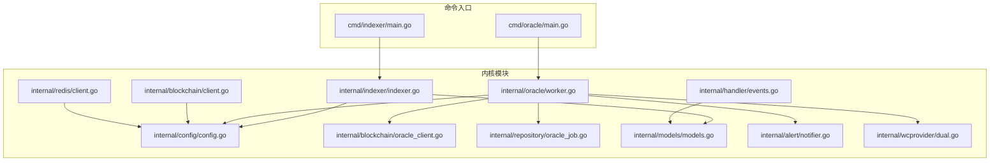
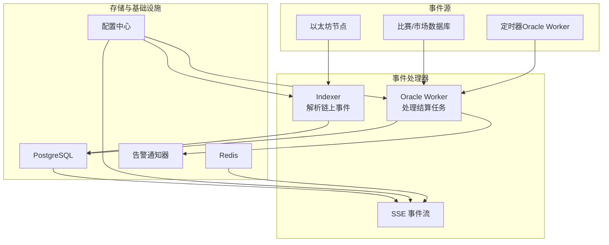
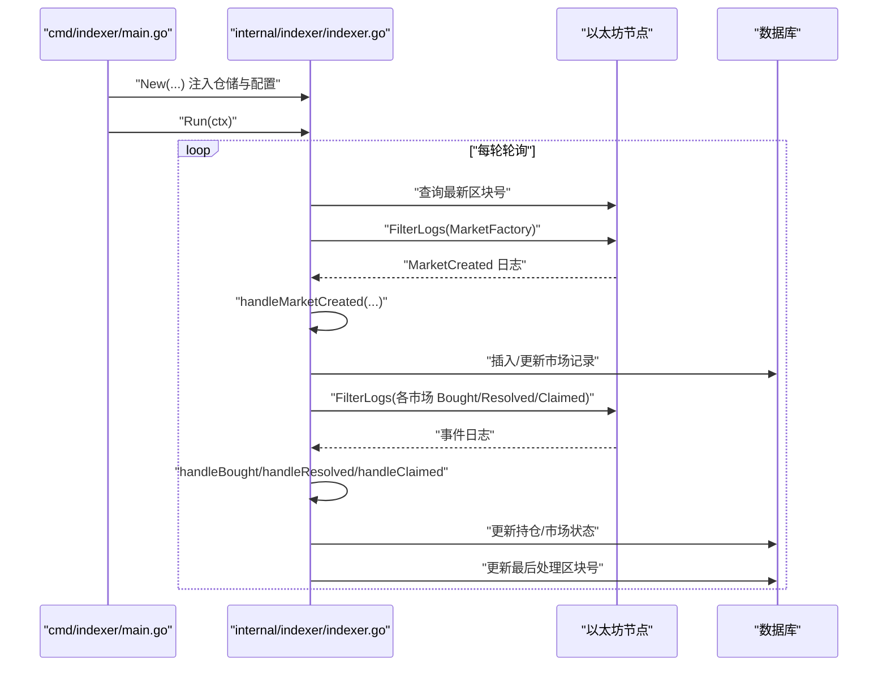
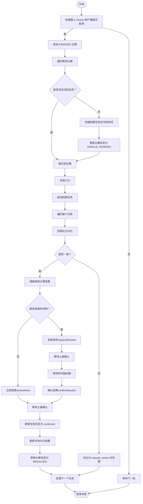
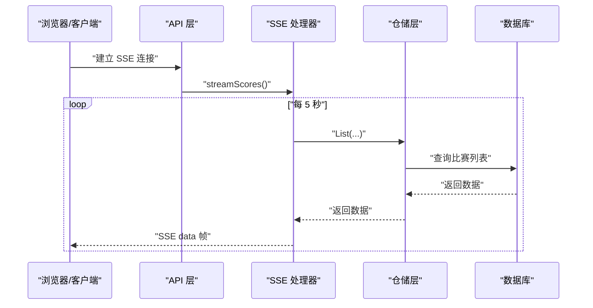
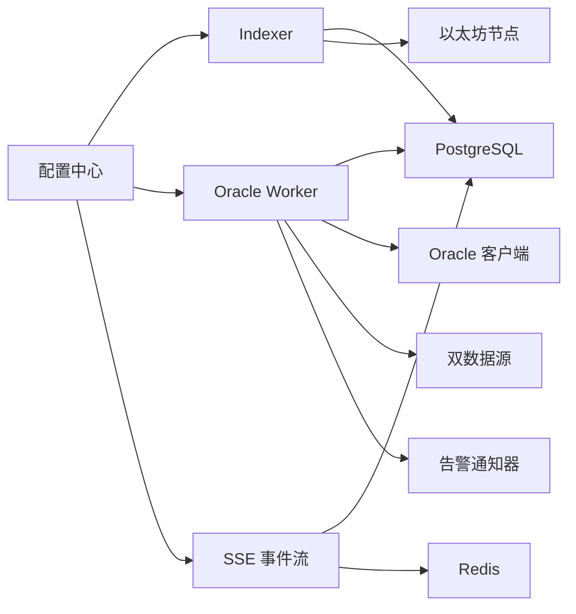

# 事件驱动架构

<cite>
**本文档引用的文件**
- [cmd/indexer/main.go](file://cmd/indexer/main.go)
- [internal/indexer/indexer.go](file://internal/indexer/indexer.go)
- [cmd/oracle/main.go](file://cmd/oracle/main.go)
- [internal/oracle/worker.go](file://internal/oracle/worker.go)
- [internal/blockchain/client.go](file://internal/blockchain/client.go)
- [internal/blockchain/oracle_client.go](file://internal/blockchain/oracle_client.go)
- [internal/handler/events.go](file://internal/handler/events.go)
- [internal/redis/client.go](file://internal/redis/client.go)
- [internal/config/config.go](file://internal/config/config.go)
- [internal/repository/oracle_job.go](file://internal/repository/oracle_job.go)
- [internal/models/models.go](file://internal/models/models.go)
- [internal/alert/notifier.go](file://internal/alert/notifier.go)
- [internal/wcprovider/dual.go](file://internal/wcprovider/dual.go)
</cite>

## 目录
1. [简介](#简介)
2. [项目结构](#项目结构)
3. [核心组件](#核心组件)
4. [架构总览](#架构总览)
5. [详细组件分析](#详细组件分析)
6. [依赖分析](#依赖分析)
7. [性能考虑](#性能考虑)
8. [故障排除指南](#故障排除指南)
9. [结论](#结论)

## 简介
本文件面向 PredictionDIDSimple 项目，系统化阐述其事件驱动架构的设计与实现，重点覆盖以下方面：
- 区块链事件监听与索引：Indexer 如何轮询并解析链上事件，驱动数据库状态变更。
- 异步任务处理：Oracle Worker 如何基于“任务队列”机制，按时间窗口自动结算市场。
- 消息与事件流：SSE 事件流用于实时推送比分，提升前端体验。
- 松耦合模块通信：通过配置中心、仓储层、告警通知器等实现跨模块解耦。

事件驱动架构的优势体现在：
- 提高系统响应性：索引器与 Oracle Worker 分别以轮询与事件驱动的方式处理链上与业务事件，减少阻塞。
- 支持水平扩展：每个服务（Indexer、Oracle Worker、API 服务器）可独立扩缩容。
- 简化复杂业务流程：通过任务队列与事件分发，将复杂的结算流程拆分为可追踪、可重试的步骤。

## 项目结构
项目采用命令入口 + 内核模块的分层组织方式：
- 命令入口：cmd 下的各个 main.go 负责启动独立的服务进程（API、Indexer、Oracle、Reconcile、Sync、Migrate、Seed）。
- 内核模块：internal 下按职责划分的子包（blockchain、indexer、oracle、handler、repository、config、alert、redis、wcprovider 等）提供核心能力。
- 数据模型与仓储：models 定义领域模型，repository 提供数据库访问抽象。
- 配置与基础设施：config 提供统一配置加载，redis 提供连接与探活，blockchain 提供链上交互能力。

图表来源
- [cmd/indexer/main.go:1-52](file://cmd/indexer/main.go#L1-L52)
- [internal/indexer/indexer.go:1-329](file://internal/indexer/indexer.go#L1-L329)
- [cmd/oracle/main.go:1-67](file://cmd/oracle/main.go#L1-L67)
- [internal/oracle/worker.go:1-214](file://internal/oracle/worker.go#L1-L214)
- [internal/config/config.go:1-139](file://internal/config/config.go#L1-L139)
- [internal/blockchain/client.go:1-94](file://internal/blockchain/client.go#L1-L94)
- [internal/blockchain/oracle_client.go:1-193](file://internal/blockchain/oracle_client.go#L1-L193)
- [internal/handler/events.go:1-47](file://internal/handler/events.go#L1-L47)
- [internal/redis/client.go:1-29](file://internal/redis/client.go#L1-L29)
- [internal/repository/oracle_job.go:1-167](file://internal/repository/oracle_job.go#L1-L167)
- [internal/models/models.go:1-63](file://internal/models/models.go#L1-L63)
- [internal/alert/notifier.go:1-47](file://internal/alert/notifier.go#L1-L47)
- [internal/wcprovider/dual.go:1-144](file://internal/wcprovider/dual.go#L1-L144)

章节来源
- [cmd/indexer/main.go:1-52](file://cmd/indexer/main.go#L1-L52)
- [cmd/oracle/main.go:1-67](file://cmd/oracle/main.go#L1-L67)
- [internal/config/config.go:1-139](file://internal/config/config.go#L1-L139)

## 核心组件
- Indexer（索引器）：负责轮询区块链事件，解析 MarketCreated、Bought、Resolved、Claimed 等事件，写入数据库，驱动市场与持仓状态变更。
- Oracle Worker（预言机工作者）：基于“任务队列”机制，将 FINISHED 的比赛入队，到期后自动结算市场，支持时间锁与手动审核流程。
- SSE 事件流：以 Server-Sent Events 方式向客户端推送实时比分，改善用户体验。
- 配置中心：集中管理运行时参数（轮询间隔、冷却时间、时间锁、链上地址等）。
- 告警通知器：统一的告警通道，支持日志与 Webhook。
- 双数据源提供者：用于比分数据交叉验证，保障结算准确性。

章节来源
- [internal/indexer/indexer.go:1-329](file://internal/indexer/indexer.go#L1-L329)
- [internal/oracle/worker.go:1-214](file://internal/oracle/worker.go#L1-L214)
- [internal/handler/events.go:1-47](file://internal/handler/events.go#L1-L47)
- [internal/config/config.go:1-139](file://internal/config/config.go#L1-L139)
- [internal/alert/notifier.go:1-47](file://internal/alert/notifier.go#L1-L47)
- [internal/wcprovider/dual.go:1-144](file://internal/wcprovider/dual.go#L1-L144)

## 架构总览
事件驱动架构由“事件源 + 事件处理器 + 任务队列 + 事件流”构成：
- 事件源：区块链事件（Indexer）、比赛状态变化（API/数据库）、定时器（Oracle Worker）。
- 事件处理器：Indexer 解析链上事件并更新数据库；Oracle Worker 读取任务队列并执行结算。
- 任务队列：oracle_jobs 表作为事件驱动的“作业队列”，承载结算任务的生命周期。
- 事件流：SSE 将比分变化实时推送给客户端。

图表来源
- [internal/indexer/indexer.go:97-160](file://internal/indexer/indexer.go#L97-L160)
- [internal/oracle/worker.go:42-121](file://internal/oracle/worker.go#L42-L121)
- [internal/handler/events.go:12-47](file://internal/handler/events.go#L12-L47)
- [internal/config/config.go:12-46](file://internal/config/config.go#L12-L46)
- [internal/alert/notifier.go:13-47](file://internal/alert/notifier.go#L13-L47)

## 详细组件分析

### Indexer：区块链事件监听与业务触发
Indexer 通过轮询区块范围，过滤并解析合约事件，驱动数据库状态变更，形成“链上事件 → 数据库状态 → 业务可用”的闭环。

图表来源
- [cmd/indexer/main.go:35-50](file://cmd/indexer/main.go#L35-L50)
- [internal/indexer/indexer.go:97-160](file://internal/indexer/indexer.go#L97-L160)
- [internal/indexer/indexer.go:162-228](file://internal/indexer/indexer.go#L162-L228)
- [internal/indexer/indexer.go:251-329](file://internal/indexer/indexer.go#L251-L329)

章节来源
- [cmd/indexer/main.go:17-51](file://cmd/indexer/main.go#L17-L51)
- [internal/indexer/indexer.go:38-65](file://internal/indexer/indexer.go#L38-L65)
- [internal/indexer/indexer.go:97-160](file://internal/indexer/indexer.go#L97-L160)
- [internal/indexer/indexer.go:162-228](file://internal/indexer/indexer.go#L162-L228)
- [internal/indexer/indexer.go:251-329](file://internal/indexer/indexer.go#L251-L329)

### Oracle Worker：异步任务处理与结算流程
Oracle Worker 以“任务队列”为核心，将业务事件（比赛完成）转化为可追踪的结算任务，并在到期后自动执行结算，支持时间锁与人工审核。

图表来源
- [internal/oracle/worker.go:42-121](file://internal/oracle/worker.go#L42-L121)
- [internal/oracle/worker.go:123-205](file://internal/oracle/worker.go#L123-L205)
- [internal/repository/oracle_job.go:42-93](file://internal/repository/oracle_job.go#L42-L93)
- [internal/blockchain/oracle_client.go:112-192](file://internal/blockchain/oracle_client.go#L112-L192)
- [internal/alert/notifier.go:27-46](file://internal/alert/notifier.go#L27-L46)

章节来源
- [cmd/oracle/main.go:20-66](file://cmd/oracle/main.go#L20-L66)
- [internal/oracle/worker.go:18-40](file://internal/oracle/worker.go#L18-L40)
- [internal/oracle/worker.go:60-121](file://internal/oracle/worker.go#L60-L121)
- [internal/oracle/worker.go:123-205](file://internal/oracle/worker.go#L123-L205)
- [internal/repository/oracle_job.go:12-30](file://internal/repository/oracle_job.go#L12-L30)
- [internal/repository/oracle_job.go:42-93](file://internal/repository/oracle_job.go#L42-L93)
- [internal/blockchain/oracle_client.go:25-64](file://internal/blockchain/oracle_client.go#L25-L64)
- [internal/blockchain/oracle_client.go:112-192](file://internal/blockchain/oracle_client.go#L112-L192)
- [internal/alert/notifier.go:13-47](file://internal/alert/notifier.go#L13-L47)

### SSE 事件流：实时比分推送
SSE 以 Server-Sent Events 方式向客户端推送比分数据，定时刷新，适合低频更新场景。

图表来源
- [internal/handler/events.go:12-47](file://internal/handler/events.go#L12-L47)

章节来源
- [internal/handler/events.go:12-47](file://internal/handler/events.go#L12-L47)

### 配置中心与基础设施
- 配置中心：集中加载运行时参数（轮询间隔、冷却时间、时间锁、链上地址、Redis URL、告警 Webhook 等），确保各组件行为一致。
- 链上健康检查：区块链客户端定期探测 RPC 连通性与链 ID，保障索引器与 Oracle Worker 的稳定性。
- Redis 探活：提供连接创建与探活能力，确保缓存可用性。

章节来源
- [internal/config/config.go:12-46](file://internal/config/config.go#L12-L46)
- [internal/config/config.go:48-105](file://internal/config/config.go#L48-L105)
- [internal/blockchain/client.go:14-94](file://internal/blockchain/client.go#L14-L94)
- [internal/redis/client.go:12-29](file://internal/redis/client.go#L12-L29)

## 依赖分析
- 组件耦合与内聚：
  - Indexer 与 Oracle Worker 分别依赖配置中心与数据库，彼此独立，通过数据库状态与任务表进行间接协作。
  - Oracle Worker 依赖链上 Oracle 客户端、双数据源提供者与告警通知器，形成清晰的职责边界。
  - SSE 依赖仓储层与数据库，与业务逻辑解耦。
- 外部依赖：
  - 以太坊 RPC 节点、PostgreSQL、Redis。
  - 合约 ABI 与链上交互（OracleAdapter）。
- 循环依赖：
  - 未发现直接循环依赖；模块间通过接口与仓储层解耦。

图表来源
- [internal/config/config.go:12-46](file://internal/config/config.go#L12-L46)
- [internal/indexer/indexer.go:26-36](file://internal/indexer/indexer.go#L26-L36)
- [internal/oracle/worker.go:18-27](file://internal/oracle/worker.go#L18-L27)
- [internal/handler/events.go:12-47](file://internal/handler/events.go#L12-L47)
- [internal/blockchain/oracle_client.go:25-32](file://internal/blockchain/oracle_client.go#L25-L32)
- [internal/wcprovider/dual.go:23-28](file://internal/wcprovider/dual.go#L23-L28)
- [internal/alert/notifier.go:13-17](file://internal/alert/notifier.go#L13-L17)

章节来源
- [internal/config/config.go:12-46](file://internal/config/config.go#L12-L46)
- [internal/indexer/indexer.go:26-36](file://internal/indexer/indexer.go#L26-L36)
- [internal/oracle/worker.go:18-27](file://internal/oracle/worker.go#L18-L27)
- [internal/handler/events.go:12-47](file://internal/handler/events.go#L12-L47)
- [internal/blockchain/oracle_client.go:25-32](file://internal/blockchain/oracle_client.go#L25-L32)
- [internal/wcprovider/dual.go:23-28](file://internal/wcprovider/dual.go#L23-L28)
- [internal/alert/notifier.go:13-17](file://internal/alert/notifier.go#L13-L17)

## 性能考虑
- 轮询策略：Indexer 与 Oracle Worker 均采用定时器轮询，需合理设置轮询间隔，避免频繁查询导致 RPC 或数据库压力过大。
- 区块范围限制：Indexer 对单次扫描区块范围进行上限控制，防止 RPC 超时与内存占用过高。
- 任务批处理：Oracle Worker 在到期任务较多时，逐个处理可降低瞬时负载，必要时可引入并发控制。
- 链上交互优化：Oracle 客户端在估算 gas 失败时采用保守值，避免因估算异常导致交易失败。
- SSE 刷新频率：SSE 每 5 秒推送一次，可根据业务需求调整，平衡实时性与网络开销。

## 故障排除指南
- 索引器无法启动或报错：
  - 检查配置中的工厂合约地址与 RPC URL 是否正确。
  - 确认数据库连接正常，索引器状态表可读写。
- Oracle Worker 无法结算：
  - 检查链上 Oracle 客户端是否启用（地址与私钥配置）。
  - 查看任务状态是否为 pending 且已到达执行时间。
  - 若出现双源不一致，检查数据源文件路径与内容。
- SSE 无法接收数据：
  - 确认客户端支持 Server-Sent Events，且未被代理或浏览器策略拦截。
  - 检查 API 层日志与数据库查询是否正常。
- 告警未触发：
  - 检查告警 Webhook URL 配置与网络连通性。

章节来源
- [cmd/indexer/main.go:18-51](file://cmd/indexer/main.go#L18-L51)
- [cmd/oracle/main.go:20-66](file://cmd/oracle/main.go#L20-L66)
- [internal/oracle/worker.go:147-153](file://internal/oracle/worker.go#L147-L153)
- [internal/alert/notifier.go:27-46](file://internal/alert/notifier.go#L27-L46)

## 结论
PredictionDIDSimple 的事件驱动架构通过“索引器 + 任务队列 + SSE 事件流”的组合，实现了链上事件的可靠捕获、业务事件的异步处理与前端的实时体验。该设计具备良好的可扩展性与可维护性，适合在预测市场等对实时性与一致性要求较高的场景中推广使用。