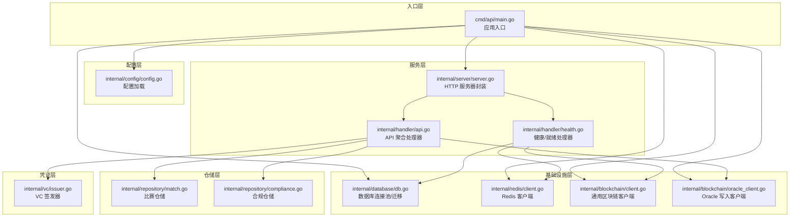
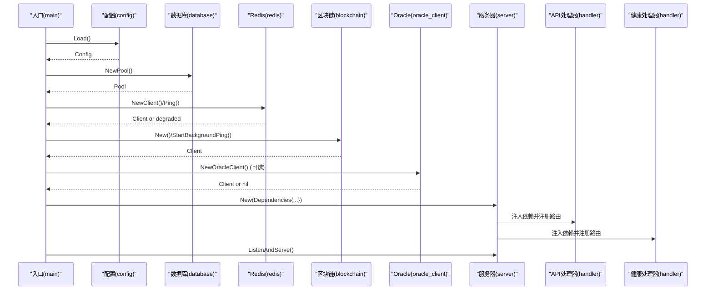
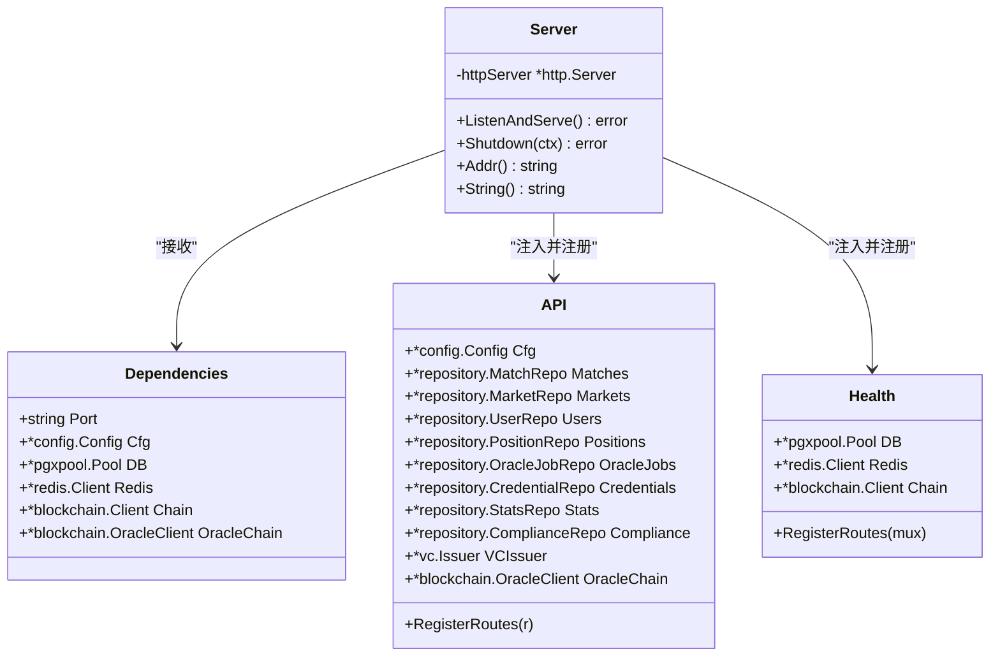
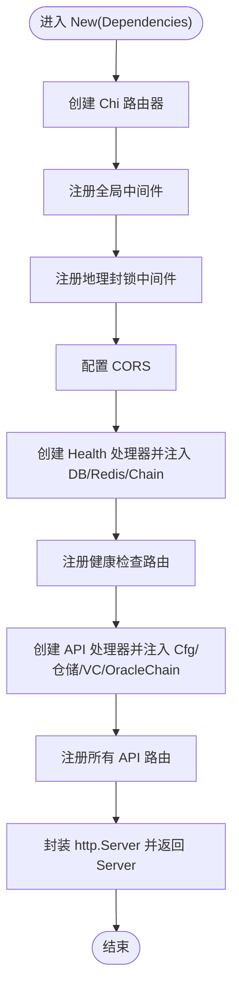
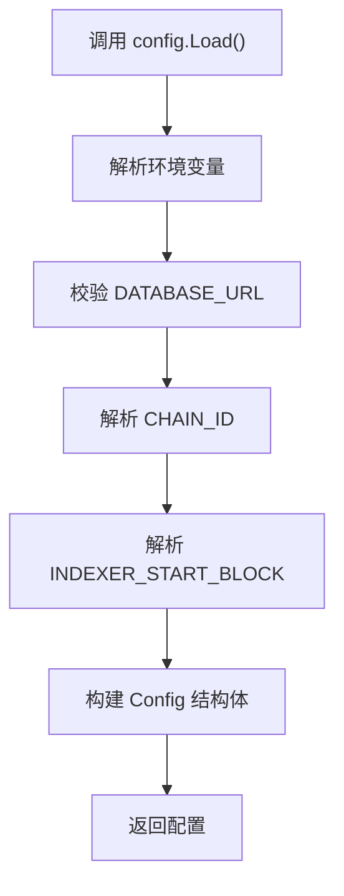
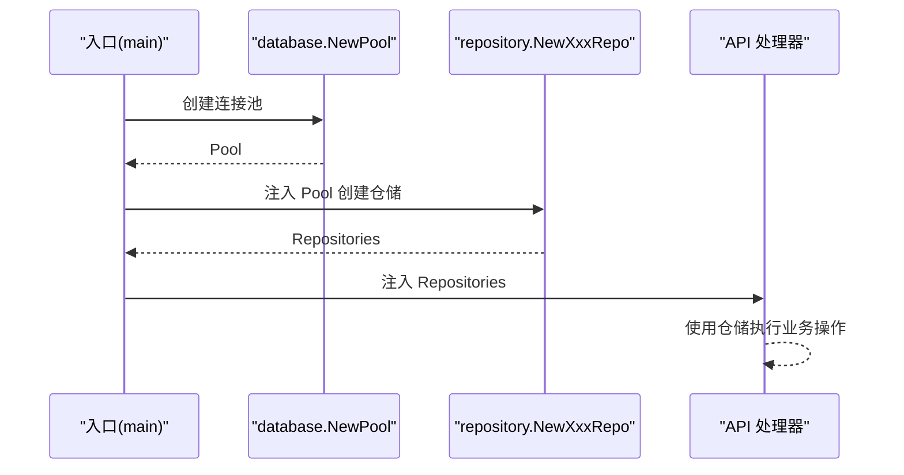
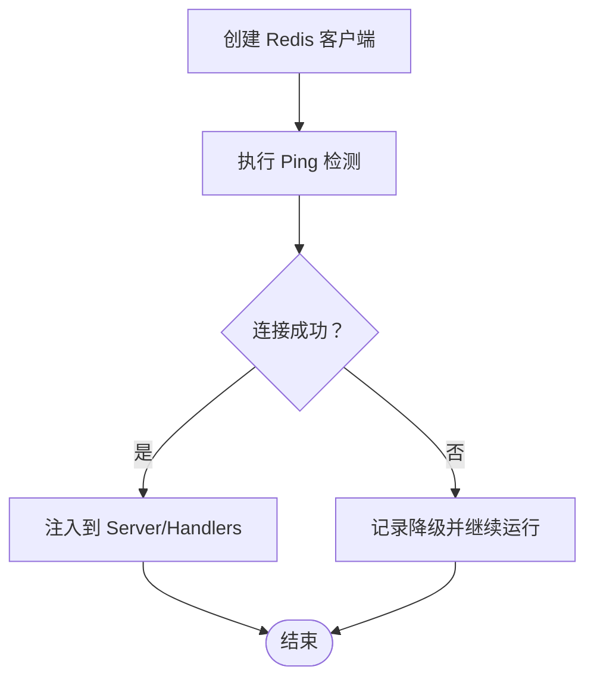
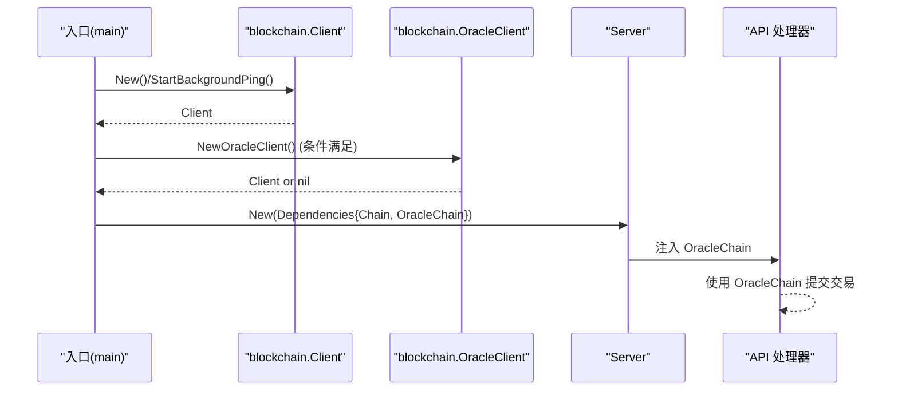
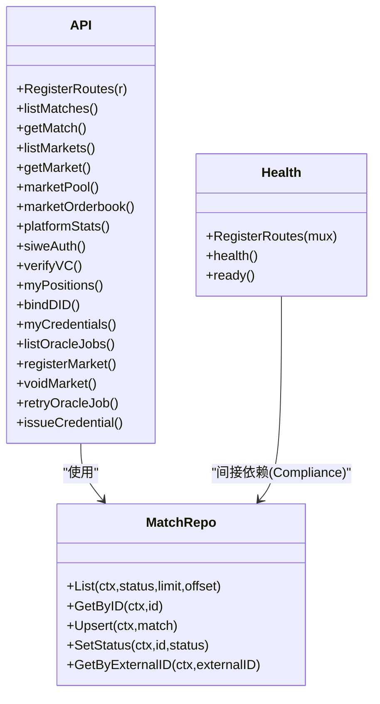
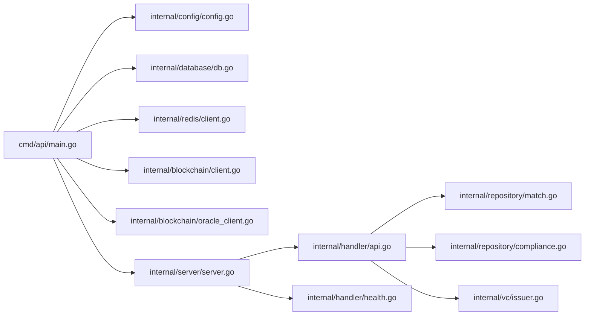

# 依赖注入设计

<cite>
**本文档引用的文件**
- [server.go](file://internal/server/server.go)
- [main.go](file://cmd/api/main.go)
- [config.go](file://internal/config/config.go)
- [db.go](file://internal/database/db.go)
- [client.go](file://internal/redis/client.go)
- [client.go](file://internal/blockchain/client.go)
- [oracle_client.go](file://internal/blockchain/oracle_client.go)
- [api.go](file://internal/handler/api.go)
- [health.go](file://internal/handler/health.go)
- [match.go](file://internal/repository/match.go)
- [compliance.go](file://internal/repository/compliance.go)
- [issuer.go](file://internal/vc/issuer.go)
- [go.mod](file://go.mod)
</cite>

## 目录
1. [简介](#简介)
2. [项目结构](#项目结构)
3. [核心组件](#核心组件)
4. [架构总览](#架构总览)
5. [详细组件分析](#详细组件分析)
6. [依赖关系分析](#依赖关系分析)
7. [性能考虑](#性能考虑)
8. [故障排除指南](#故障排除指南)
9. [结论](#结论)

## 简介
本设计文档聚焦于 PredictionDIDSimple 项目的依赖注入设计，系统性阐述依赖注入容器的实现机制、Dependencies 结构体的设计与各组件的注入方式，解释 New 函数如何创建和配置服务器实例，以及如何将配置、数据库连接、Redis 客户端、区块链客户端等依赖注入到各个处理器中。同时总结依赖注入带来的优势（测试友好性、组件解耦、配置集中管理），并提供具体代码示例路径与环境配置切换实践。

## 项目结构
该项目采用分层与职责分离的组织方式：
- cmd/api/main.go：应用入口，负责初始化配置、数据库、Redis、区块链客户端、索引器与 HTTP 服务器，并进行优雅关闭。
- internal/server/server.go：HTTP 服务器封装，负责路由、中间件、处理器注册与生命周期管理。
- internal/config/config.go：集中式配置加载，从环境变量解析应用配置。
- internal/database/db.go：数据库连接池创建、Ping 检测与迁移执行。
- internal/redis/client.go：Redis 客户端创建与 Ping 检测。
- internal/blockchain/client.go：通用区块链客户端，负责 RPC 连通性检测与链 ID 校验。
- internal/blockchain/oracle_client.go：Oracle 写入客户端，负责向合约提交结算/作废等交易。
- internal/handler/api.go：API 聚合处理器，持有所有业务依赖并注册路由。
- internal/handler/health.go：健康检查与就绪检查处理器。
- internal/repository/*：仓储层，基于 pgxpool.Pool 提供数据库访问能力。
- internal/vc/issuer.go：可验证凭证签发器，使用 HMAC-SHA256 对凭证进行签名与验证。

图表来源
- [main.go:27-160](file://cmd/api/main.go#L27-L160)
- [server.go:44-102](file://internal/server/server.go#L44-L102)
- [config.go:48-105](file://internal/config/config.go#L48-L105)
- [db.go:16-50](file://internal/database/db.go#L16-L50)
- [client.go:12-28](file://internal/redis/client.go#L12-L28)
- [client.go:22-93](file://internal/blockchain/client.go#L22-L93)
- [oracle_client.go:34-64](file://internal/blockchain/oracle_client.go#L34-L64)
- [api.go:18-31](file://internal/handler/api.go#L18-L31)
- [health.go:13-26](file://internal/handler/health.go#L13-L26)
- [match.go:15-23](file://internal/repository/match.go#L15-L23)
- [compliance.go:11-19](file://internal/repository/compliance.go#L11-L19)
- [issuer.go:15-26](file://internal/vc/issuer.go#L15-L26)

章节来源
- [main.go:27-160](file://cmd/api/main.go#L27-L160)
- [server.go:44-102](file://internal/server/server.go#L44-L102)

## 核心组件
本项目采用“构造器注入”与“组合注入”的混合模式：
- Dependencies 结构体：集中承载所有外部依赖（端口、配置、数据库、Redis、区块链客户端、Oracle 客户端），作为 New 函数的单一参数，确保依赖边界清晰、易于测试替换。
- New 函数：接收 Dependencies，创建路由、注册中间件与处理器，并将依赖注入到各处理器中；返回封装后的 Server 实例，统一管理生命周期。
- 处理器聚合：API 与 Health 等处理器均以结构体形式持有各自所需的依赖，形成“处理器即服务”的轻量依赖图。

优势体现：
- 测试友好性：通过替换 Dependencies 中的依赖（如使用内存数据库、Mock Redis、Mock Oracle），可在单元测试中快速搭建隔离环境。
- 组件解耦：处理器仅依赖抽象接口（如 pgxpool.Pool、redis.Client、blockchain.Client），不直接感知外部实现细节。
- 配置集中管理：Config 结构体集中定义所有运行时参数，Load 函数负责解析与校验，避免散落的环境变量读取逻辑。

章节来源
- [server.go:29-38](file://internal/server/server.go#L29-L38)
- [server.go:44-102](file://internal/server/server.go#L44-L102)
- [api.go:18-31](file://internal/handler/api.go#L18-L31)
- [health.go:13-18](file://internal/handler/health.go#L13-L18)
- [config.go:12-46](file://internal/config/config.go#L12-L46)

## 架构总览
依赖注入贯穿应用生命周期：入口层负责创建与组装依赖，服务层负责路由与中间件，处理器层负责业务逻辑，仓储层负责数据持久化，凭证层负责 VC 签发与验证。

图表来源
- [main.go:28-141](file://cmd/api/main.go#L28-L141)
- [server.go:44-102](file://internal/server/server.go#L44-L102)
- [config.go:48-105](file://internal/config/config.go#L48-L105)
- [db.go:16-31](file://internal/database/db.go#L16-L31)
- [client.go:12-28](file://internal/redis/client.go#L12-L28)
- [client.go:22-46](file://internal/blockchain/client.go#L22-L46)
- [oracle_client.go:34-64](file://internal/blockchain/oracle_client.go#L34-L64)

## 详细组件分析

### 依赖注入容器与 Dependencies 设计
- Dependencies 结构体集中承载端口、配置、数据库连接池、Redis 客户端、通用区块链客户端与 Oracle 写入客户端，作为 New 的输入参数，确保依赖注入的显式性与完整性。
- 该设计避免了全局状态污染，使依赖关系一目了然，便于单元测试替换与集成测试编排。

图表来源
- [server.go:29-38](file://internal/server/server.go#L29-L38)
- [server.go:44-102](file://internal/server/server.go#L44-L102)
- [api.go:18-31](file://internal/handler/api.go#L18-L31)
- [health.go:13-18](file://internal/handler/health.go#L13-L18)

章节来源
- [server.go:29-38](file://internal/server/server.go#L29-L38)
- [server.go:44-102](file://internal/server/server.go#L44-L102)

### New 函数如何创建和配置服务器实例
- 路由与中间件：创建 Chi 路由器，注册全局中间件（RequestID、RealIP、Logger、Recoverer、速率限制、地理封锁），随后注册健康检查与 API 路由。
- 处理器注入：分别创建 Health 与 API 处理器实例，将 DB、Redis、Chain、OracleChain 等依赖注入到处理器字段中；API 处理器进一步注入多个仓储与 VC 签发器。
- 服务器配置：基于 Dependencies.Port 构造 http.Server，设置读超时与写超时，封装为 Server 实例。

图表来源
- [server.go:44-102](file://internal/server/server.go#L44-L102)

章节来源
- [server.go:44-102](file://internal/server/server.go#L44-L102)

### 配置加载与环境切换
- 配置来源：Config.Load 从环境变量解析所有运行参数，包含端口、数据库 URL、Redis URL、以太坊 RPC、合约地址、密钥、索引器参数、速率限制、合规开关等。
- 环境切换：通过 APP_ENV 控制运行环境（development/production），结合 BLOCKED_COUNTRIES、GEO_BLOCK_ENABLED、RateLimitPerMinute 等参数在不同环境间切换行为。

图表来源
- [config.go:48-105](file://internal/config/config.go#L48-L105)

章节来源
- [config.go:48-105](file://internal/config/config.go#L48-L105)

### 数据库连接与仓储注入
- 数据库连接池：database.NewPool 基于 DATABASE_URL 创建 pgxpool.Pool，供仓储层复用。
- 仓储注入：API 处理器通过 repository.NewXxxRepo(deps.DB) 注入多个仓储，实现对数据库的统一访问。

图表来源
- [db.go:16-24](file://internal/database/db.go#L16-L24)
- [match.go:20-23](file://internal/repository/match.go#L20-L23)
- [api.go:77-91](file://internal/handler/api.go#L77-L91)

章节来源
- [db.go:16-24](file://internal/database/db.go#L16-L24)
- [match.go:20-23](file://internal/repository/match.go#L20-L23)
- [api.go:77-91](file://internal/handler/api.go#L77-L91)

### Redis 客户端注入与降级策略
- 客户端创建：redis.NewClient 基于 REDIS_URL 创建 redis.Client，Ping 检测连通性。
- 降级策略：若 Redis 不可用，API 仍可正常运行，但健康检查会标记为降级状态，不影响核心业务流程。

图表来源
- [client.go:12-28](file://internal/redis/client.go#L12-L28)
- [main.go:63-81](file://cmd/api/main.go#L63-L81)
- [server.go:70-75](file://internal/server/server.go#L70-L75)

章节来源
- [client.go:12-28](file://internal/redis/client.go#L12-L28)
- [main.go:63-81](file://cmd/api/main.go#L63-L81)
- [server.go:70-75](file://internal/server/server.go#L70-L75)

### 区块链客户端注入与 Oracle 写入
- 通用客户端：blockchain.Client 负责 RPC 连通性检测与链 ID 校验，通过 StartBackgroundPing 在后台持续监控。
- Oracle 客户端：仅在配置了 OracleAdapterAddress 与 OraclePrivateKey 时创建，用于向合约提交结算/作废等写入操作。

图表来源
- [client.go:22-46](file://internal/blockchain/client.go#L22-L46)
- [oracle_client.go:34-64](file://internal/blockchain/oracle_client.go#L34-L64)
- [main.go:83-122](file://cmd/api/main.go#L83-L122)
- [server.go:124-131](file://internal/server/server.go#L124-L131)
- [api.go:29-30](file://internal/handler/api.go#L29-L30)

章节来源
- [client.go:22-46](file://internal/blockchain/client.go#L22-L46)
- [oracle_client.go:34-64](file://internal/blockchain/oracle_client.go#L34-L64)
- [main.go:83-122](file://cmd/api/main.go#L83-L122)
- [server.go:124-131](file://internal/server/server.go#L124-L131)
- [api.go:29-30](file://internal/handler/api.go#L29-L30)

### 处理器与仓储的依赖注入模式
- API 处理器聚合了配置、多个仓储、合规仓储、VC 签发器与 Oracle 客户端，通过 RegisterRoutes 将路由与处理器绑定。
- Health 处理器聚合 DB、Redis、Chain，提供健康与就绪检查。
- 仓储层通过 NewXxxRepo(deps.DB) 注入连接池，实现对数据库的统一访问。

图表来源
- [api.go:33-69](file://internal/handler/api.go#L33-L69)
- [health.go:20-26](file://internal/handler/health.go#L20-L26)
- [match.go:25-63](file://internal/repository/match.go#L25-L63)

章节来源
- [api.go:33-69](file://internal/handler/api.go#L33-L69)
- [health.go:20-26](file://internal/handler/health.go#L20-L26)
- [match.go:25-63](file://internal/repository/match.go#L25-L63)

## 依赖关系分析
- 入口层依赖配置层、数据库层、Redis 层、区块链层与 Oracle 层，最终组装为服务器层。
- 服务器层依赖处理器层与仓储层，处理器层再依赖仓储层与凭证层。
- 依赖方向清晰，无循环依赖迹象；仓储层与凭证层相对独立，便于替换与测试。

图表来源
- [main.go:27-160](file://cmd/api/main.go#L27-L160)
- [server.go:44-102](file://internal/server/server.go#L44-L102)
- [api.go:18-31](file://internal/handler/api.go#L18-L31)
- [match.go:15-23](file://internal/repository/match.go#L15-L23)
- [compliance.go:11-19](file://internal/repository/compliance.go#L11-L19)
- [issuer.go:15-26](file://internal/vc/issuer.go#L15-L26)

章节来源
- [main.go:27-160](file://cmd/api/main.go#L27-L160)
- [server.go:44-102](file://internal/server/server.go#L44-L102)

## 性能考虑
- 连接池与超时：数据库使用 pgxpool.Pool，Redis 使用 redis.Client，均具备连接复用与超时控制；Server 写超时设为 0 以支持 SSE。
- 后台监控：区块链客户端定期 Ping RPC，及时发现网络异常；Oracle 客户端在交易失败时进行重试与回执轮询。
- 降级策略：Redis 不可用时健康检查标记降级，API 仍可运行，保障核心功能不受影响。

## 故障排除指南
- 配置缺失：DATABASE_URL 为空会导致配置加载失败；请检查环境变量或配置文件。
- 数据库连接失败：检查 DATABASE_URL 与网络连通性；可通过 database.Ping 进行探测。
- Redis 不可用：记录降级日志，确认 REDIS_URL 与网络；必要时临时禁用 Redis 依赖。
- RPC 连通性：查看 blockchain.Client 的健康状态与链 ID 校验日志，确保 ETH_RPC_URL 与 CHAIN_ID 正确。
- Oracle 写入失败：检查 OracleAdapter 地址、私钥与链 ID；确认 gasPrice 估算与交易上链状态。

章节来源
- [config.go:84-95](file://internal/config/config.go#L84-L95)
- [db.go:26-31](file://internal/database/db.go#L26-L31)
- [client.go:23-28](file://internal/redis/client.go#L23-L28)
- [client.go:48-83](file://internal/blockchain/client.go#L48-L83)
- [oracle_client.go:169-192](file://internal/blockchain/oracle_client.go#L169-L192)

## 结论
本项目通过 Dependencies 结构体与 New 函数实现了清晰、可测试、可维护的依赖注入设计。入口层负责组装依赖，服务层负责路由与中间件，处理器层专注于业务逻辑，仓储与凭证层提供基础能力。该设计提升了组件解耦度、测试友好性与配置集中管理能力，便于在不同环境中进行灵活切换与扩展。