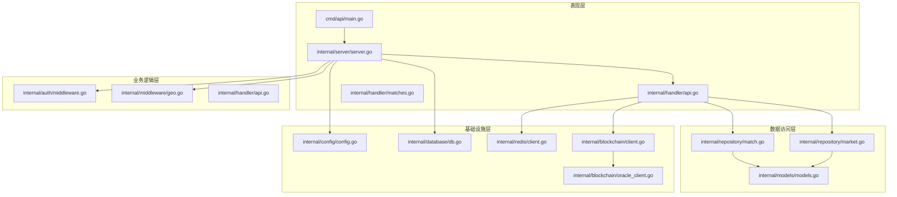
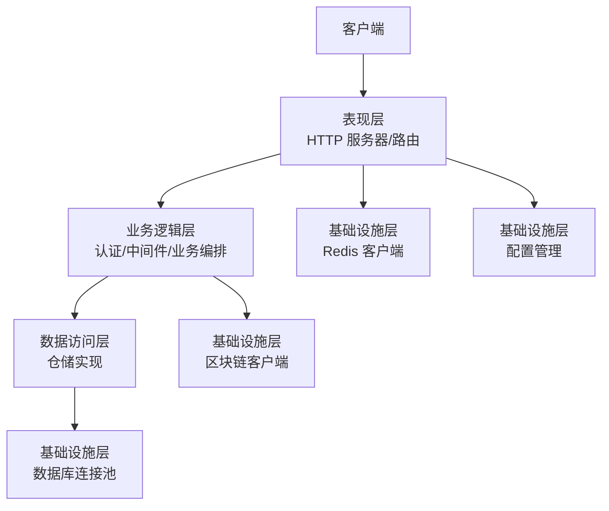
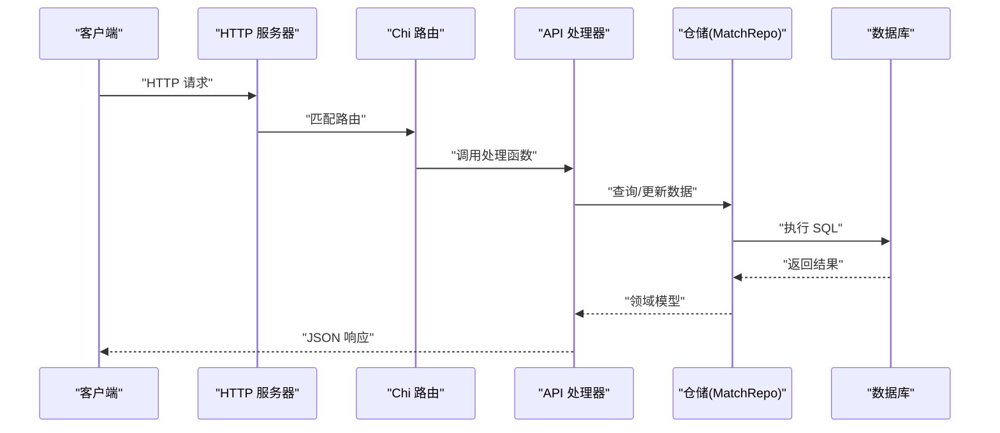
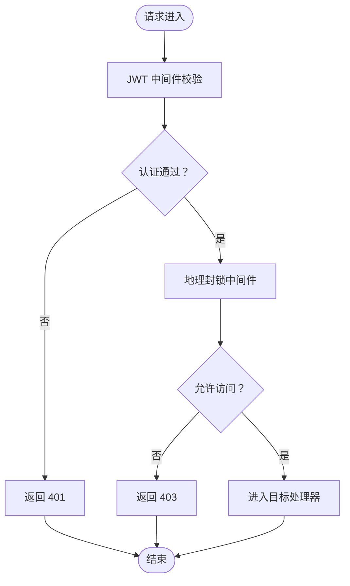
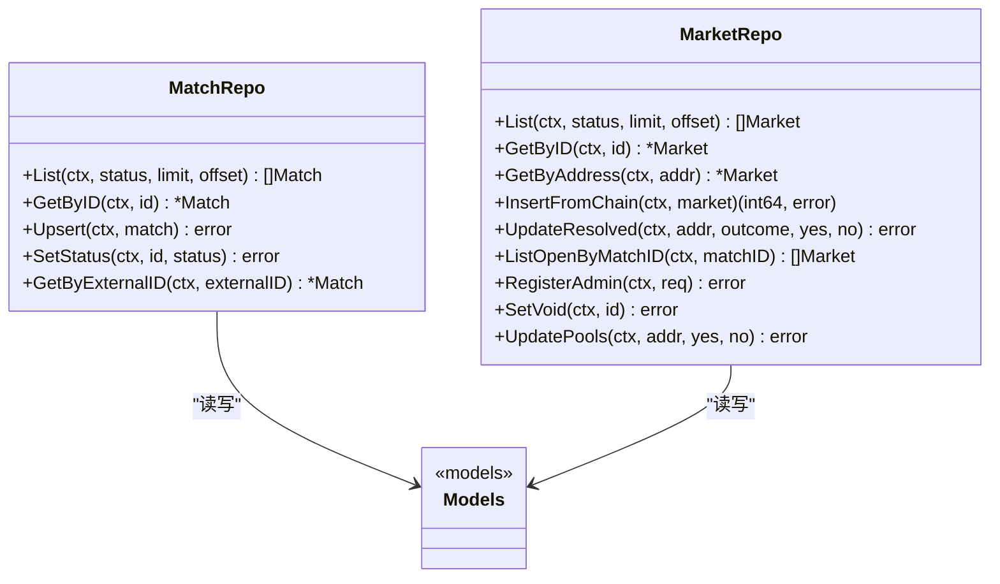
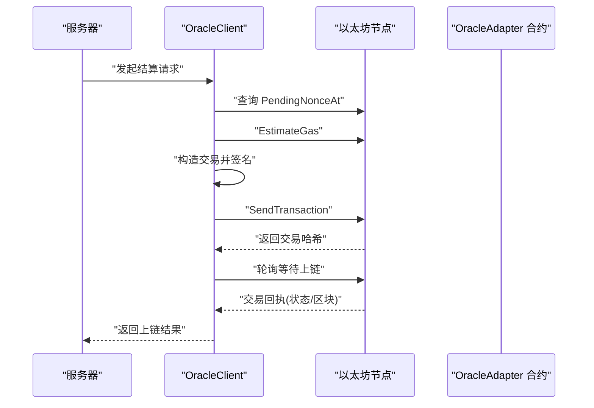
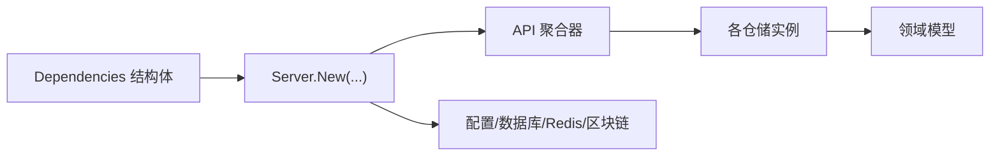

# 分层架构设计

<cite>
**本文档引用的文件**
- [cmd/api/main.go](file://cmd/api/main.go)
- [internal/server/server.go](file://internal/server/server.go)
- [internal/handler/api.go](file://internal/handler/api.go)
- [internal/handler/matches.go](file://internal/handler/matches.go)
- [internal/repository/match.go](file://internal/repository/match.go)
- [internal/repository/market.go](file://internal/repository/market.go)
- [internal/blockchain/client.go](file://internal/blockchain/client.go)
- [internal/blockchain/oracle_client.go](file://internal/blockchain/oracle_client.go)
- [internal/database/db.go](file://internal/database/db.go)
- [internal/redis/client.go](file://internal/redis/client.go)
- [internal/config/config.go](file://internal/config/config.go)
- [internal/models/models.go](file://internal/models/models.go)
- [internal/auth/middleware.go](file://internal/auth/middleware.go)
- [internal/middleware/geo.go](file://internal/middleware/geo.go)
- [go.mod](file://go.mod)
</cite>

## 目录
1. [简介](#简介)
2. [项目结构](#项目结构)
3. [核心组件](#核心组件)
4. [架构总览](#架构总览)
5. [详细组件分析](#详细组件分析)
6. [依赖分析](#依赖分析)
7. [性能考虑](#性能考虑)
8. [故障排查指南](#故障排查指南)
9. [结论](#结论)

## 简介
本设计文档面向 PredictionDIDSimple 后端项目，基于四层架构模式进行系统化梳理与说明：
- 表现层（Presentation Layer）：负责 HTTP 路由与请求处理，使用 Chi 路由与中间件实现。
- 业务逻辑层（Business Logic Layer）：通过 Handler 聚合仓储与服务，编排业务流程与权限控制。
- 数据访问层（Data Access Layer）：采用 Repository 模式封装数据库访问，提供领域模型的持久化能力。
- 基础设施层（Infrastructure Layer）：提供区块链客户端、数据库连接池、Redis 客户端等外部依赖。

文档重点阐述各层职责边界、依赖方向与交互模式，解释依赖注入在分层架构中的应用，以及如何通过接口抽象实现层间解耦，并给出最佳实践与代码示例路径。

## 项目结构
后端采用按职责分层的目录组织方式：
- cmd：应用入口与子命令（API、索引器、预言机等）
- internal：核心业务与基础设施
  - config：配置加载与解析
  - server：HTTP 服务器与路由装配
  - handler：HTTP 处理器与路由注册
  - repository：仓储实现（数据库访问）
  - database：数据库连接池与迁移
  - redis：Redis 客户端封装
  - blockchain：以太坊客户端与 Oracle 客户端
  - auth/middleware：认证与中间件
  - models：领域模型
- migrations：数据库迁移脚本
- pkg/contracts：智能合约 ABI

图表来源
- [cmd/api/main.go:1-161](file://cmd/api/main.go#L1-L161)
- [internal/server/server.go:1-129](file://internal/server/server.go#L1-L129)
- [internal/handler/api.go:1-100](file://internal/handler/api.go#L1-L100)
- [internal/handler/matches.go:1-44](file://internal/handler/matches.go#L1-L44)
- [internal/repository/match.go:1-118](file://internal/repository/match.go#L1-L118)
- [internal/repository/market.go:1-269](file://internal/repository/market.go#L1-L269)
- [internal/blockchain/client.go:1-94](file://internal/blockchain/client.go#L1-L94)
- [internal/blockchain/oracle_client.go:1-193](file://internal/blockchain/oracle_client.go#L1-L193)
- [internal/database/db.go:1-51](file://internal/database/db.go#L1-L51)
- [internal/redis/client.go:1-29](file://internal/redis/client.go#L1-L29)
- [internal/config/config.go:1-139](file://internal/config/config.go#L1-L139)
- [internal/models/models.go:1-63](file://internal/models/models.go#L1-L63)
- [internal/auth/middleware.go:1-50](file://internal/auth/middleware.go#L1-L50)
- [internal/middleware/geo.go:1-65](file://internal/middleware/geo.go#L1-L65)

章节来源
- [cmd/api/main.go:1-161](file://cmd/api/main.go#L1-L161)
- [internal/server/server.go:1-129](file://internal/server/server.go#L1-L129)
- [internal/config/config.go:1-139](file://internal/config/config.go#L1-L139)

## 核心组件
- 配置管理：集中加载环境变量并解析为强类型配置对象，作为各层的输入。
- HTTP 服务器：统一装配路由、中间件与处理器，暴露 REST API。
- 处理器聚合：API 聚合器注入仓储与服务，按路由分发至具体处理函数。
- 仓储实现：MatchRepo、MarketRepo 等封装数据库访问，提供领域模型的增删改查。
- 基础设施：区块链客户端（只读/写入）、数据库连接池、Redis 客户端。

章节来源
- [internal/config/config.go:12-105](file://internal/config/config.go#L12-L105)
- [internal/server/server.go:24-102](file://internal/server/server.go#L24-L102)
- [internal/handler/api.go:18-31](file://internal/handler/api.go#L18-L31)
- [internal/repository/match.go:15-23](file://internal/repository/match.go#L15-L23)
- [internal/repository/market.go:15-23](file://internal/repository/market.go#L15-L23)
- [internal/blockchain/client.go:14-28](file://internal/blockchain/client.go#L14-L28)
- [internal/blockchain/oracle_client.go:25-64](file://internal/blockchain/oracle_client.go#L25-L64)
- [internal/database/db.go:16-31](file://internal/database/db.go#L16-L31)
- [internal/redis/client.go:12-28](file://internal/redis/client.go#L12-L28)

## 架构总览
四层架构的职责边界与依赖方向如下：
- 表现层（Presentation Layer）
  - 职责：路由注册、中间件处理、请求响应编解码
  - 依赖：业务逻辑层（API 聚合器）、基础设施（配置、数据库、Redis、区块链）
- 业务逻辑层（Business Logic Layer）
  - 职责：权限控制（JWT、管理员）、地理封锁、业务流程编排
  - 依赖：数据访问层（仓储）、基础设施（配置、区块链）
- 数据访问层（Data Access Layer）
  - 职责：领域模型持久化、SQL 查询与映射
  - 依赖：基础设施（数据库连接池）
- 基础设施层（Infrastructure Layer）
  - 职责：外部系统集成（RPC、数据库、缓存）
  - 依赖：标准库与第三方库

图表来源
- [internal/server/server.go:44-102](file://internal/server/server.go#L44-L102)
- [internal/handler/api.go:33-69](file://internal/handler/api.go#L33-L69)
- [internal/auth/middleware.go:17-43](file://internal/auth/middleware.go#L17-L43)
- [internal/middleware/geo.go:12-41](file://internal/middleware/geo.go#L12-L41)
- [internal/repository/match.go:25-63](file://internal/repository/match.go#L25-L63)
- [internal/repository/market.go:25-73](file://internal/repository/market.go#L25-L73)
- [internal/database/db.go:16-31](file://internal/database/db.go#L16-L31)
- [internal/redis/client.go:12-28](file://internal/redis/client.go#L12-L28)
- [internal/blockchain/client.go:14-28](file://internal/blockchain/client.go#L14-L28)
- [internal/config/config.go:48-105](file://internal/config/config.go#L48-L105)

## 详细组件分析

### 表现层（HTTP Handlers）
- 服务器装配：在服务器构造阶段注入配置、数据库、Redis、区块链客户端，并初始化各类仓储与服务，随后注册健康检查与 API 路由组。
- 路由注册：API 聚合器按公开接口、登录接口、JWT 授权接口、管理员接口分组注册，统一使用中间件链路。
- 响应编解码：提供通用 JSON 响应与错误写入工具，保证一致性。

图表来源
- [internal/server/server.go:77-91](file://internal/server/server.go#L77-L91)
- [internal/handler/api.go:33-69](file://internal/handler/api.go#L33-L69)
- [internal/handler/matches.go:8-19](file://internal/handler/matches.go#L8-L19)
- [internal/repository/match.go:25-63](file://internal/repository/match.go#L25-L63)

章节来源
- [internal/server/server.go:44-102](file://internal/server/server.go#L44-L102)
- [internal/handler/api.go:33-69](file://internal/handler/api.go#L33-L69)
- [internal/handler/matches.go:8-19](file://internal/handler/matches.go#L8-L19)

### 业务逻辑层（权限与流程控制）
- 认证中间件：从 Authorization 头提取 Bearer Token，解析 JWT 并将钱包地址注入上下文，后续处理器可通过上下文获取已认证地址。
- 地理封锁中间件：根据请求头检测国家代码，结合配置判断是否放行，支持审计日志回调。
- 路由分组：按权限级别分组注册，确保敏感操作仅限管理员或已认证用户。

图表来源
- [internal/auth/middleware.go:17-43](file://internal/auth/middleware.go#L17-L43)
- [internal/middleware/geo.go:12-41](file://internal/middleware/geo.go#L12-L41)

章节来源
- [internal/auth/middleware.go:17-43](file://internal/auth/middleware.go#L17-L43)
- [internal/middleware/geo.go:12-41](file://internal/middleware/geo.go#L12-L41)

### 数据访问层（Repository 模式）
- MatchRepo：提供分页查询、按 ID 获取、Upsert（按 external_id 去重）、状态更新、按外部 ID 查询等方法，内部使用动态 SQL 与参数绑定，避免 SQL 注入。
- MarketRepo：提供市场列表、按 ID/地址查询、从链上事件插入、结算/作废/资金池更新、管理员批量更新等方法，包含复杂 LEFT JOIN 与 DTO 映射。
- 模型定义：Match、Market、Position、User 等领域模型，承载数据结构与业务语义。

图表来源
- [internal/repository/match.go:15-118](file://internal/repository/match.go#L15-L118)
- [internal/repository/market.go:15-269](file://internal/repository/market.go#L15-L269)
- [internal/models/models.go:6-63](file://internal/models/models.go#L6-L63)

章节来源
- [internal/repository/match.go:25-93](file://internal/repository/match.go#L25-L93)
- [internal/repository/market.go:25-188](file://internal/repository/market.go#L25-L188)
- [internal/models/models.go:6-63](file://internal/models/models.go#L6-L63)

### 基础设施层（区块链、数据库、Redis）
- 区块链客户端：提供只读链状态检查（定时 ping），记录链 ID 与健康状态，支持后台心跳。
- Oracle 客户端：封装与 OracleAdapter 合约交互，支持结算请求、确认、立即结算、作废市场等操作，内置交易打包、签名、上链与上链等待。
- 数据库：提供连接池创建、Ping 探活、迁移执行（Up 向）。
- Redis：提供客户端创建与 Ping 探活。

图表来源
- [internal/blockchain/oracle_client.go:112-167](file://internal/blockchain/oracle_client.go#L112-L167)
- [internal/blockchain/oracle_client.go:169-192](file://internal/blockchain/oracle_client.go#L169-L192)

章节来源
- [internal/blockchain/client.go:30-83](file://internal/blockchain/client.go#L30-L83)
- [internal/blockchain/oracle_client.go:34-64](file://internal/blockchain/oracle_client.go#L34-L64)
- [internal/blockchain/oracle_client.go:112-167](file://internal/blockchain/oracle_client.go#L112-L167)
- [internal/blockchain/oracle_client.go:169-192](file://internal/blockchain/oracle_client.go#L169-L192)
- [internal/database/db.go:16-50](file://internal/database/db.go#L16-L50)
- [internal/redis/client.go:12-28](file://internal/redis/client.go#L12-L28)

## 依赖分析
- 依赖注入（DI）应用
  - 服务器构造函数接收 Dependencies 结构体，集中注入端口、配置、数据库、Redis、区块链与 Oracle 客户端。
  - API 聚合器同样以结构体形式注入各仓储与服务，避免全局状态与硬编码依赖。
- 层间依赖方向
  - 表现层 → 业务逻辑层：通过处理器聚合器与中间件链路
  - 业务逻辑层 → 数据访问层：通过仓储接口
  - 数据访问层 → 基础设施层：通过连接池与外部客户端
- 接口抽象与解耦
  - 通过结构体聚合与函数注入，避免直接依赖具体实现，提升可测试性与替换性。
  - 仓储接口对外暴露领域模型，内部封装 SQL 细节，降低上层耦合。

图表来源
- [internal/server/server.go:29-38](file://internal/server/server.go#L29-L38)
- [internal/server/server.go:124-131](file://internal/server/server.go#L124-L131)
- [internal/handler/api.go:18-31](file://internal/handler/api.go#L18-L31)

章节来源
- [internal/server/server.go:29-38](file://internal/server/server.go#L29-L38)
- [internal/server/server.go:124-131](file://internal/server/server.go#L124-L131)
- [internal/handler/api.go:18-31](file://internal/handler/api.go#L18-L31)

## 性能考虑
- 数据库连接池：使用 pgxpool 提升并发与资源复用效率，建议合理设置最大连接数与空闲连接数。
- SQL 查询优化：仓储层使用参数化查询与动态 WHERE 条件，避免全表扫描；对高频查询建立合适索引。
- Redis 降级：Redis 客户端创建失败时仅告警并降级运行，保障核心功能可用。
- 区块链交互：Oracle 客户端内置 gas 估算与上链等待轮询，建议结合链上费用波动调整 gasPrice 与轮询策略。
- 中间件开销：速率限制与日志中间件在高并发场景下需评估 CPU 与 I/O 影响，建议结合监控指标调优。

## 故障排查指南
- 配置缺失：DATABASE_URL 必填，否则迁移与启动会失败；检查环境变量与默认值。
- 数据库迁移：迁移失败会直接终止，检查迁移脚本与数据库连接。
- Redis 连接：Ping 失败会降级运行，检查 Redis 地址与网络连通性。
- 区块链节点：RPC 连接失败或 chainID 不一致会标记为不健康，检查 RPC 地址与链 ID。
- Oracle 交易：上链等待超时或交易回执状态为 revert 时需检查私钥、gasPrice 与合约 ABI。
- 认证失败：JWT 中间件要求 Authorization 头为 Bearer Token，解析失败返回 401。
- 地理封锁：被封禁国家访问返回 403，检查封禁列表与请求头。

章节来源
- [internal/config/config.go:84-105](file://internal/config/config.go#L84-L105)
- [internal/database/db.go:33-50](file://internal/database/db.go#L33-L50)
- [internal/redis/client.go:23-28](file://internal/redis/client.go#L23-L28)
- [internal/blockchain/client.go:48-83](file://internal/blockchain/client.go#L48-L83)
- [internal/blockchain/oracle_client.go:169-192](file://internal/blockchain/oracle_client.go#L169-L192)
- [internal/auth/middleware.go:20-42](file://internal/auth/middleware.go#L20-L42)
- [internal/middleware/geo.go:14-41](file://internal/middleware/geo.go#L14-L41)

## 结论
本项目通过清晰的四层架构实现了职责分离与依赖解耦：表现层专注路由与响应，业务逻辑层负责权限与流程，数据访问层封装持久化细节，基础设施层提供外部系统集成。依赖注入贯穿各层，配合接口抽象与中间件机制，提升了系统的可维护性、可扩展性与可观测性。建议在后续迭代中进一步完善单元测试覆盖、引入缓存策略与异步任务队列，持续优化链上交互与数据库性能。