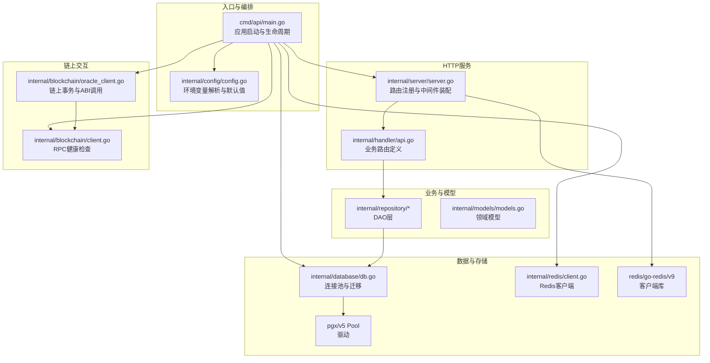
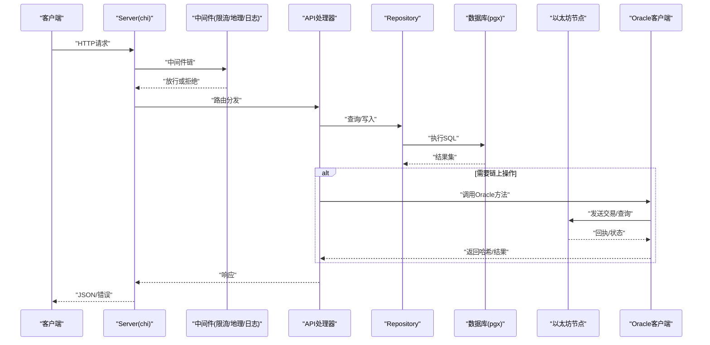
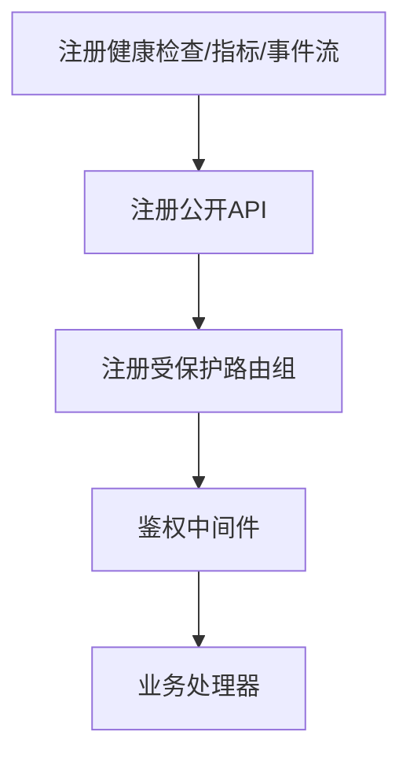
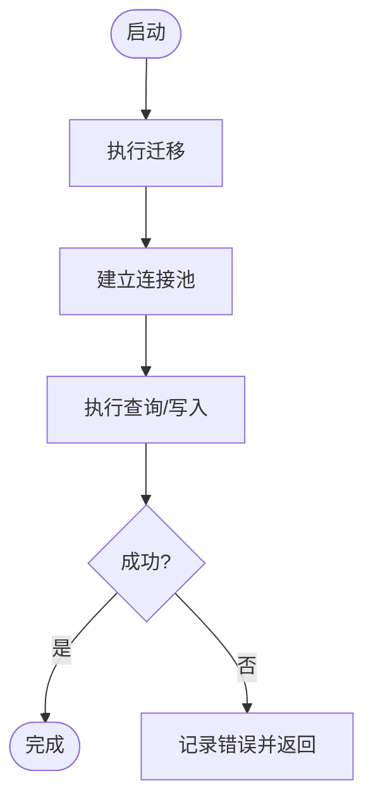
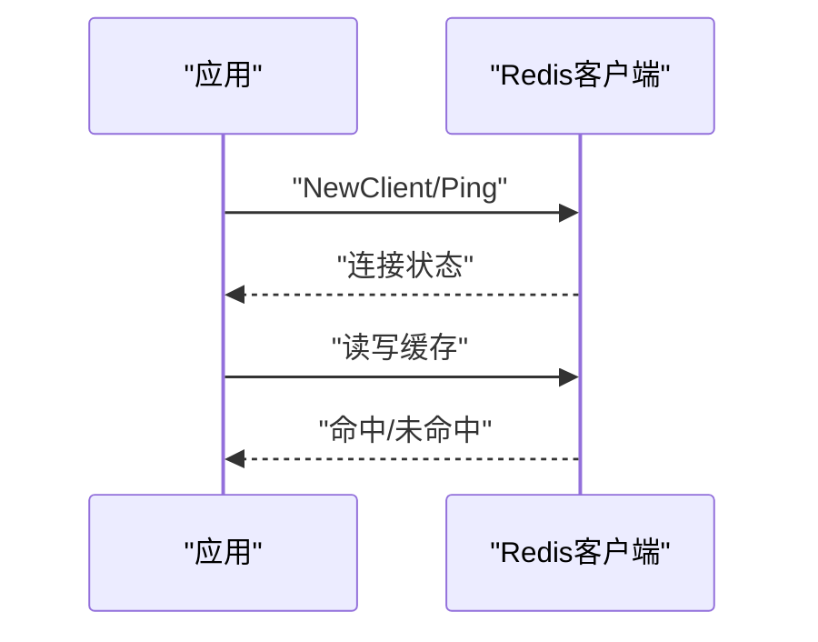
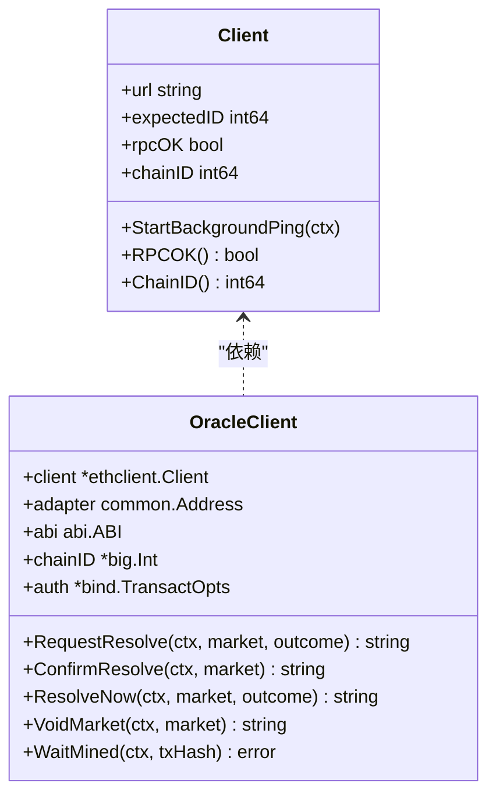
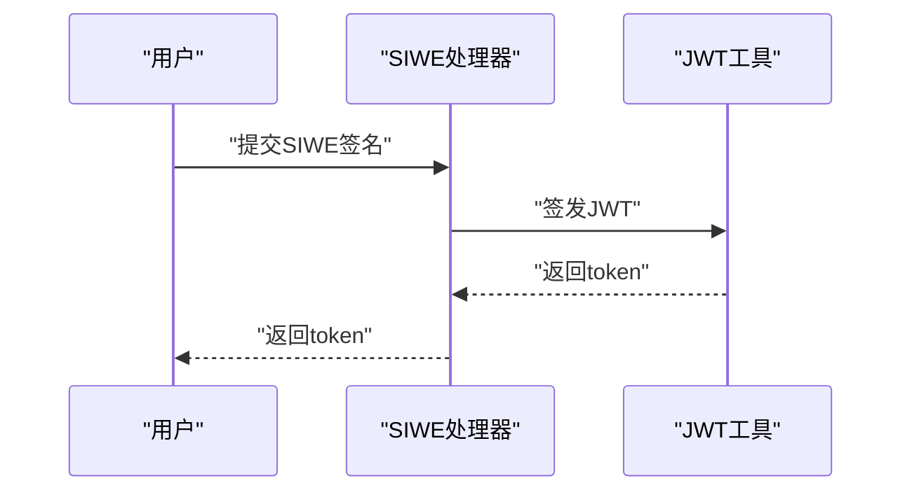
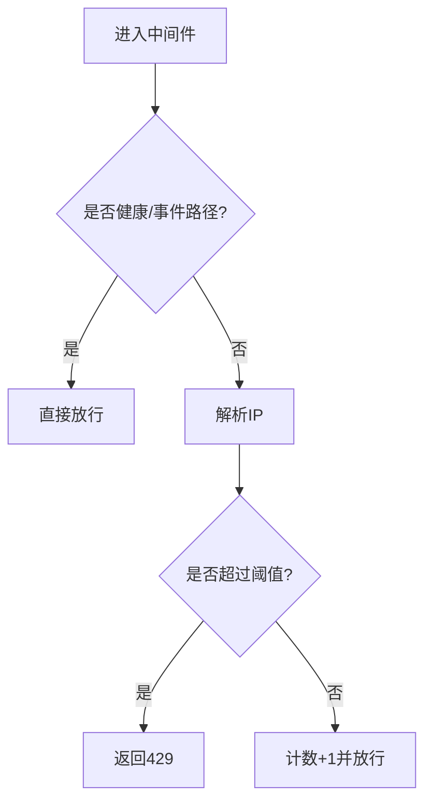
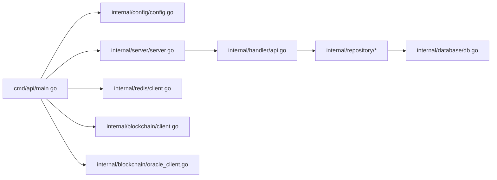

# 技术选型

<cite>
**本文引用的文件**
- [go.mod](file://go.mod)
- [cmd/api/main.go](file://cmd/api/main.go)
- [internal/config/config.go](file://internal/config/config.go)
- [internal/server/server.go](file://internal/server/server.go)
- [internal/handler/api.go](file://internal/handler/api.go)
- [internal/database/db.go](file://internal/database/db.go)
- [internal/redis/client.go](file://internal/redis/client.go)
- [internal/blockchain/client.go](file://internal/blockchain/client.go)
- [internal/blockchain/oracle_client.go](file://internal/blockchain/oracle_client.go)
- [internal/repository/match.go](file://internal/repository/match.go)
- [internal/middleware/ratelimit.go](file://internal/middleware/ratelimit.go)
- [internal/middleware/geo.go](file://internal/middleware/geo.go)
- [internal/models/models.go](file://internal/models/models.go)
- [internal/auth/jwt.go](file://internal/auth/jwt.go)
- [migrations/000001_init.up.sql](file://migrations/000001_init.up.sql)
</cite>

## 目录
1. [引言](#引言)
2. [项目结构](#项目结构)
3. [核心组件](#核心组件)
4. [架构总览](#架构总览)
5. [详细组件分析](#详细组件分析)
6. [依赖关系分析](#依赖关系分析)
7. [性能考量](#性能考量)
8. [故障排查指南](#故障排查指南)
9. [结论](#结论)
10. [附录](#附录)

## 引言
本技术选型文档围绕PredictionDIDSimple后端的技术栈与关键框架选择进行系统化说明，重点解释以下方面：
- Go语言作为主要开发语言的优势、性能考量与生态；
- HTTP框架chi的选择理由与路由设计；
- 数据库选择PostgreSQL的原因、ORM替代方案与性能优化；
- Redis在缓存与会话管理中的作用；
- 以太坊客户端的选择与集成方式；
- 对比其他技术方案的权衡（成本、性能、可维护性、团队技能）；
- 版本兼容性与升级路径建议。

## 项目结构
后端采用按职责分层的组织方式：入口命令、配置加载、服务编排、HTTP服务器、处理器、中间件、数据访问层、区块链与索引器等模块清晰分离。整体结构如下：

图表来源
- [cmd/api/main.go](file://cmd/api/main.go#L24-L117)
- [internal/config/config.go](file://internal/config/config.go#L45-L96)
- [internal/server/server.go](file://internal/server/server.go#L35-L84)
- [internal/handler/api.go](file://internal/handler/api.go#L30-L61)
- [internal/database/db.go](file://internal/database/db.go#L14-L26)
- [internal/redis/client.go](file://internal/redis/client.go#L10-L22)
- [internal/blockchain/client.go](file://internal/blockchain/client.go#L19-L78)
- [internal/blockchain/oracle_client.go](file://internal/blockchain/oracle_client.go#L31-L54)

章节来源
- [cmd/api/main.go](file://cmd/api/main.go#L24-L117)
- [internal/config/config.go](file://internal/config/config.go#L45-L96)
- [internal/server/server.go](file://internal/server/server.go#L35-L84)

## 核心组件
- 应用入口与编排：负责读取配置、执行数据库迁移、初始化连接池、Redis客户端、以太坊客户端、启动索引器与API服务，并处理优雅关闭。
- 配置系统：集中从环境变量加载参数，包含数据库、Redis、以太坊RPC、链ID、索引器参数、限流与合规开关等。
- HTTP服务：基于chi构建路由，注入认证、限流、地理阻断、CORS等中间件，注册公开与鉴权路由组。
- 数据访问：使用pgx连接池与原生SQL，配合迁移工具进行数据库演进。
- 缓存与会话：Redis用于会话与缓存，提供连接探测与降级处理。
- 区块链集成：以太坊客户端负责RPC连通性与链ID校验；Oracle客户端封装ABI调用与交易签名。

章节来源
- [cmd/api/main.go](file://cmd/api/main.go#L24-L117)
- [internal/config/config.go](file://internal/config/config.go#L45-L96)
- [internal/server/server.go](file://internal/server/server.go#L35-L84)
- [internal/handler/api.go](file://internal/handler/api.go#L30-L61)
- [internal/database/db.go](file://internal/database/db.go#L14-L26)
- [internal/redis/client.go](file://internal/redis/client.go#L10-L22)
- [internal/blockchain/client.go](file://internal/blockchain/client.go#L19-L78)
- [internal/blockchain/oracle_client.go](file://internal/blockchain/oracle_client.go#L31-L54)

## 架构总览
下图展示从请求到链上交互的典型流程，涵盖路由、中间件、数据访问与链交互：

图表来源
- [internal/server/server.go](file://internal/server/server.go#L35-L84)
- [internal/handler/api.go](file://internal/handler/api.go#L30-L61)
- [internal/repository/match.go](file://internal/repository/match.go#L21-L54)
- [internal/blockchain/oracle_client.go](file://internal/blockchain/oracle_client.go#L95-L137)

## 详细组件分析

### Go语言选型
- 优势
  - 并发模型简洁高效，goroutine与channel适合高并发I/O密集场景（如HTTP服务、链上RPC轮询）。
  - 静态编译产物便于部署与容器化，减少运行时依赖。
  - 生态成熟，数据库驱动、HTTP框架、加密库、以太坊库均有高质量实现。
- 性能考量
  - 内存分配与GC压力控制：避免在热路径频繁分配，复用连接池与缓冲区。
  - 网络I/O：合理设置超时与读写超时，避免阻塞导致资源泄露。
- 生态系统
  - 以太坊生态广泛采用Go，社区与工具链完善，便于问题定位与升级。

章节来源
- [go.mod](file://go.mod#L3-L14)
- [cmd/api/main.go](file://cmd/api/main.go#L24-L117)

### HTTP框架：chi
- 选择理由
  - 路由简洁、中间件生态丰富，易于组合限流、CORS、日志与恢复等中间件。
  - 与标准库http.Server无缝集成，便于优雅关闭与超时控制。
- 路由设计
  - 公开接口与鉴权接口分组，鉴权中间件仅对受保护路由生效。
  - 支持SSE长连接场景，写超时设为0以避免阻塞。
- CORS策略
  - 明确允许来源、方法与头部，支持凭据传递，满足前端跨域需求。

图表来源
- [internal/server/server.go](file://internal/server/server.go#L55-L75)
- [internal/handler/api.go](file://internal/handler/api.go#L30-L61)

章节来源
- [internal/server/server.go](file://internal/server/server.go#L35-L84)
- [internal/handler/api.go](file://internal/handler/api.go#L30-L61)

### 数据库：PostgreSQL + pgx + 迁移
- 选择原因
  - 结构化数据与复杂查询友好，ACID特性满足金融类业务一致性要求。
  - JSON/JSONB类型支持灵活扩展，便于未来引入非结构化元数据。
- ORM替代方案
  - 项目采用原生SQL与pgx，具备更高的可控性与性能潜力，避免ORM抽象带来的隐式开销。
- 性能优化
  - 使用连接池与预编译语句，批量插入/更新结合ON CONFLICT策略降低往返次数。
  - 合理索引与查询条件，避免全表扫描；必要时拆分只读副本或分区。
- 迁移与演进
  - 使用迁移工具按版本推进schema变更，确保多环境一致性。

图表来源
- [internal/database/db.go](file://internal/database/db.go#L28-L42)
- [internal/repository/match.go](file://internal/repository/match.go#L21-L54)

章节来源
- [internal/database/db.go](file://internal/database/db.go#L14-L42)
- [internal/repository/match.go](file://internal/repository/match.go#L21-L82)
- [migrations/000001_init.up.sql](file://migrations/000001_init.up.sql#L1-L10)

### Redis：缓存与会话
- 作用
  - 会话与短期缓存：承载用户登录态与热点数据，降低数据库压力。
  - 降级容错：当Redis不可用时，应用仍可工作（降级模式），但需记录告警。
- 客户端与健康检查
  - 提供连接解析与Ping探测，超时短路，保障主流程稳定。
- 建议
  - 配置合理的TTL与淘汰策略，避免内存膨胀；生产环境建议哨兵/集群。

图表来源
- [internal/redis/client.go](file://internal/redis/client.go#L10-L22)
- [cmd/api/main.go](file://cmd/api/main.go#L48-L59)

章节来源
- [internal/redis/client.go](file://internal/redis/client.go#L10-L22)
- [cmd/api/main.go](file://cmd/api/main.go#L48-L59)

### 以太坊客户端：go-ethereum
- 选择与集成
  - go-ethereum提供完整的RPC、签名、ABI绑定能力，适配多链ID与交易构造。
  - 客户端包含后台心跳检测，校验链ID与可用性，失败时记录警告。
- Oracle客户端
  - 加载合约ABI，构造交易并签名发送，支持等待确认与回执检查。
  - 通过估算Gas与动态GasPrice提升成功率与成本控制。
- 可靠性
  - 失败重试与超时控制，必要时回退至备用RPC。

图表来源
- [internal/blockchain/client.go](file://internal/blockchain/client.go#L12-L78)
- [internal/blockchain/oracle_client.go](file://internal/blockchain/oracle_client.go#L23-L54)

章节来源
- [internal/blockchain/client.go](file://internal/blockchain/client.go#L19-L78)
- [internal/blockchain/oracle_client.go](file://internal/blockchain/oracle_client.go#L31-L54)
- [internal/blockchain/oracle_client.go](file://internal/blockchain/oracle_client.go#L95-L137)

### 认证与授权
- SIWE登录与JWT签发
  - 通过SIWE消息验证地址，签发JWT并设置过期时间，支持前端携带令牌访问受保护接口。
- 管理员权限
  - 通过独立的管理员密钥进行管理端路由鉴权。

图表来源
- [internal/handler/api.go](file://internal/handler/api.go#L43-L44)
- [internal/auth/jwt.go](file://internal/auth/jwt.go#L16-L26)

章节来源
- [internal/auth/jwt.go](file://internal/auth/jwt.go#L16-L43)
- [internal/handler/api.go](file://internal/handler/api.go#L43-L44)

### 中间件：限流与地理阻断
- 限流中间件
  - 基于IP与滑动窗口的简单计数器，每分钟限制请求数，健康检查与事件流豁免。
- 地理阻断中间件
  - 从请求头提取国家码，匹配黑名单，支持日志回调记录。

图表来源
- [internal/middleware/ratelimit.go](file://internal/middleware/ratelimit.go#L24-L34)
- [internal/middleware/geo.go](file://internal/middleware/geo.go#L10-L31)

章节来源
- [internal/middleware/ratelimit.go](file://internal/middleware/ratelimit.go#L36-L55)
- [internal/middleware/geo.go](file://internal/middleware/geo.go#L10-L50)

## 依赖关系分析
- 模块耦合
  - 服务层通过依赖注入聚合各子系统，处理器仅依赖仓库接口，降低耦合。
  - 区块链客户端与Oracle客户端解耦，便于替换或扩展。
- 外部依赖
  - 关键库版本集中在go.mod中，统一管理以保证一致性与可追溯性。

图表来源
- [go.mod](file://go.mod#L5-L14)
- [cmd/api/main.go](file://cmd/api/main.go#L24-L117)
- [internal/server/server.go](file://internal/server/server.go#L35-L84)

章节来源
- [go.mod](file://go.mod#L5-L14)
- [cmd/api/main.go](file://cmd/api/main.go#L24-L117)

## 性能考量
- HTTP层
  - 设置合理的ReadTimeout与写超时（SSE场景写超时为0），避免长时间占用连接。
  - 中间件链尽量轻量，避免在热路径做昂贵操作。
- 数据库层
  - 使用连接池与预编译语句，批量写入与冲突更新减少往返。
  - 查询添加必要索引，避免N+1与全表扫描。
- 缓存层
  - 合理设置TTL，热点数据优先走缓存；Redis不可用时启用降级逻辑。
- 链交互
  - 估算Gas与动态GasPrice，减少失败重试；交易上链后轮询确认，设置超时上限。

## 故障排查指南
- 配置问题
  - 确认DATABASE_URL、REDIS_URL、ETH_RPC_URL、CHAIN_ID等关键环境变量已正确设置。
- 数据库连接
  - 检查连接池初始化与Ping结果，关注迁移是否成功。
- Redis可用性
  - 观察Redis连接与Ping日志，若失败则进入降级模式。
- 以太坊RPC
  - 关注后台心跳日志，链ID不匹配或RPC拨号失败会导致服务异常。
- 限流与地理阻断
  - 检查限流阈值与豁免路径，确认国家码来源头是否正确。

章节来源
- [internal/config/config.go](file://internal/config/config.go#L45-L96)
- [internal/database/db.go](file://internal/database/db.go#L22-L26)
- [internal/redis/client.go](file://internal/redis/client.go#L18-L22)
- [internal/blockchain/client.go](file://internal/blockchain/client.go#L26-L70)
- [internal/middleware/ratelimit.go](file://internal/middleware/ratelimit.go#L36-L55)
- [internal/middleware/geo.go](file://internal/middleware/geo.go#L10-L50)

## 结论
本项目在高性能、可维护性与团队技能之间取得平衡：以Go为核心语言，结合chi、pgx、Redis与go-ethereum形成清晰、高效的后端技术栈。通过中间件与限流策略保障稳定性，通过连接池与原生SQL提升性能，通过迁移工具与明确的升级路径确保演进可控。

## 附录

### 版本兼容性与升级路径
- Go版本
  - 当前使用1.22.0，建议保持与CI/CD一致，升级时先在测试环境验证。
- 关键依赖
  - chi v5、pgx/v5、redis/go-redis/v9、ethereum/go-ethereum等均处于活跃维护期，建议遵循官方发布节奏进行滚动升级。
- 升级建议
  - 以补丁版本优先，再评估小版本；重大版本升级前准备回归测试与灰度发布。
- 运维建议
  - 将依赖锁定在go.mod中，定期同步安全更新；对第三方库建立监控与告警。

章节来源
- [go.mod](file://go.mod#L3-L14)
- [cmd/api/main.go](file://cmd/api/main.go#L24-L117)