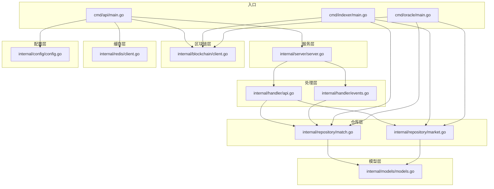
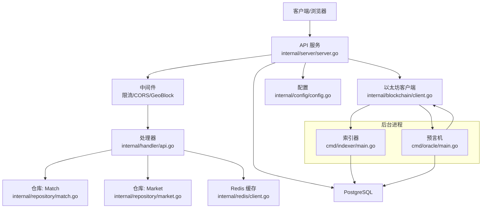
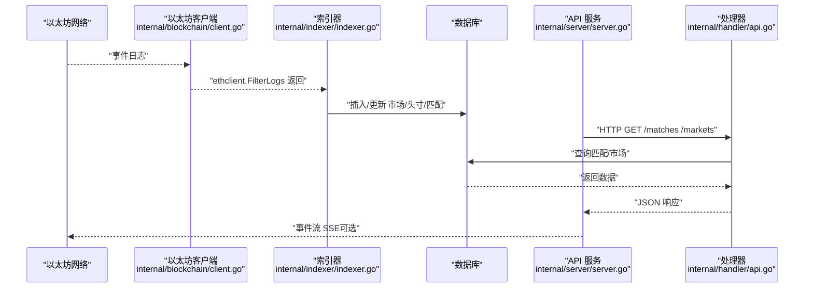
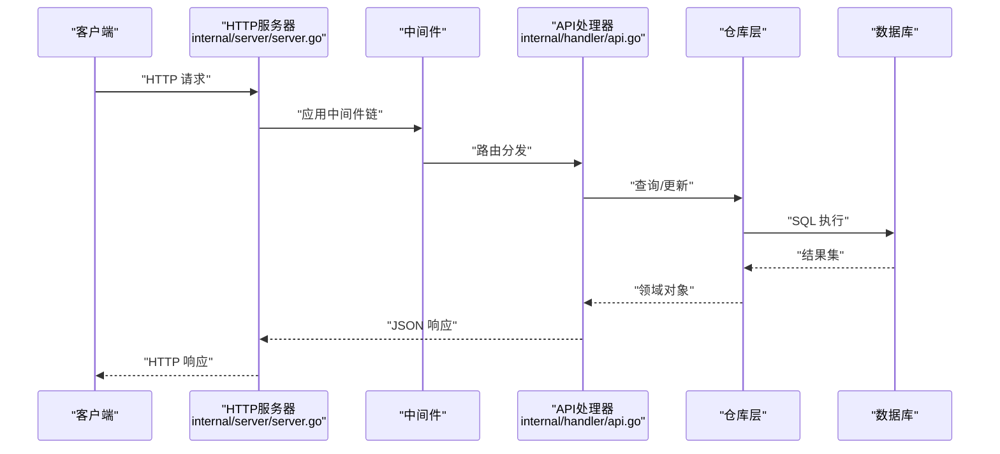
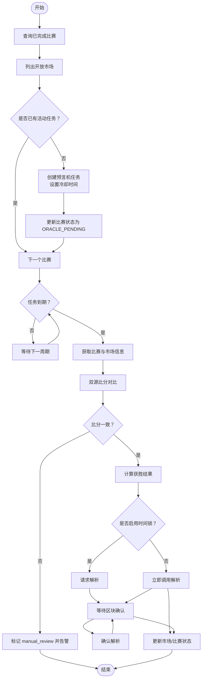
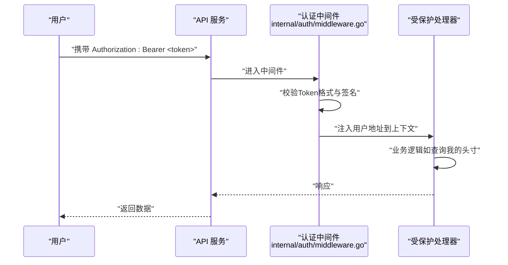
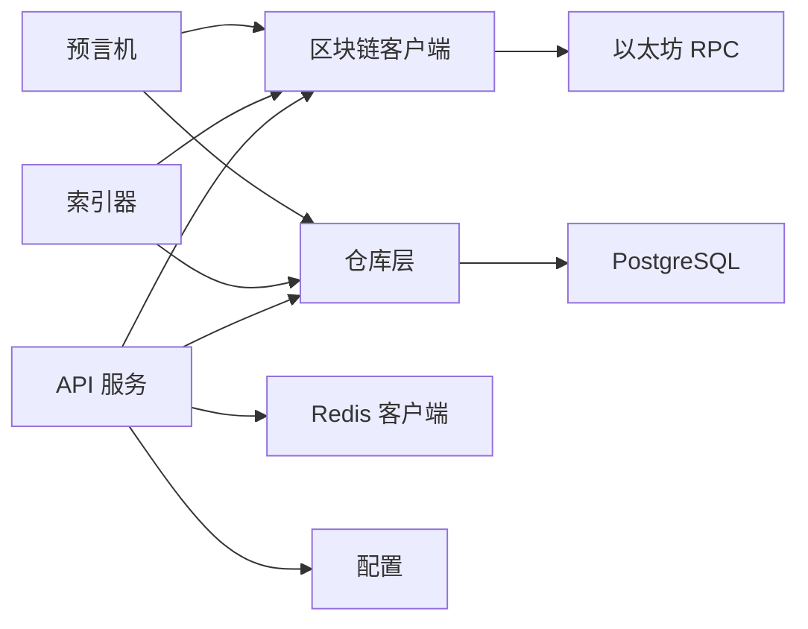
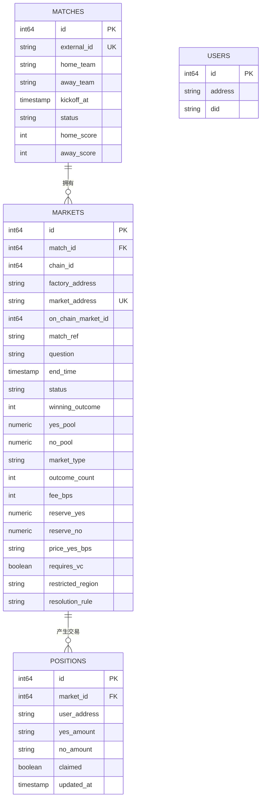

# 数据流设计

<cite>
**本文引用的文件**
- [cmd/api/main.go](file://cmd/api/main.go)
- [cmd/indexer/main.go](file://cmd/indexer/main.go)
- [cmd/oracle/main.go](file://cmd/oracle/main.go)
- [internal/server/server.go](file://internal/server/server.go)
- [internal/blockchain/client.go](file://internal/blockchain/client.go)
- [internal/indexer/indexer.go](file://internal/indexer/indexer.go)
- [internal/oracle/worker.go](file://internal/oracle/worker.go)
- [internal/handler/api.go](file://internal/handler/api.go)
- [internal/handler/events.go](file://internal/handler/events.go)
- [internal/repository/match.go](file://internal/repository/match.go)
- [internal/repository/market.go](file://internal/repository/market.go)
- [internal/models/models.go](file://internal/models/models.go)
- [internal/auth/middleware.go](file://internal/auth/middleware.go)
- [internal/redis/client.go](file://internal/redis/client.go)
- [internal/config/config.go](file://internal/config/config.go)
</cite>

## 目录
1. [简介](#简介)
2. [项目结构](#项目结构)
3. [核心组件](#核心组件)
4. [架构总览](#架构总览)
5. [详细组件分析](#详细组件分析)
6. [依赖关系分析](#依赖关系分析)
7. [性能考量](#性能考量)
8. [故障排查指南](#故障排查指南)
9. [结论](#结论)
10. [附录](#附录)

## 简介
本文件面向PredictionDIDSimple后端系统，围绕“数据流设计”目标，系统化梳理以下四类关键数据流转路径与处理机制：
- 区块链事件流：以太坊事件 → 索引器 → 数据库 → API响应
- 用户请求流：HTTP请求 → 中间件 → 处理器 → 业务逻辑 → 数据库
- 预言机流程：比赛完成 → 数据源验证 → 智能合约调用 → 状态更新
- 身份验证流：用户登录 → JWT生成 → 会话管理 → 权限检查

同时，文档解释数据转换过程、缓存策略与一致性保证，并提供数据流向图与时序图，最后讨论数据安全、隐私保护与合规性。

## 项目结构
后端采用多命令入口（API、索引器、预言机等）与清晰的分层架构：
- 入口层：cmd/* 主程序，负责配置加载、资源初始化与服务启动
- 服务层：internal/server 提供HTTP路由与中间件
- 处理层：internal/handler 定义REST接口与业务编排
- 仓库层：internal/repository 封装数据库访问
- 模型层：internal/models 定义领域模型
- 区块链层：internal/blockchain 与合约交互
- 缓存层：internal/redis 提供Redis客户端
- 配置层：internal/config 统一读取环境变量

图表来源
- [cmd/api/main.go](file://cmd/api/main.go#L24-L118)
- [cmd/indexer/main.go](file://cmd/indexer/main.go#L15-L44)
- [cmd/oracle/main.go](file://cmd/oracle/main.go#L18-L56)
- [internal/server/server.go](file://internal/server/server.go#L35-L85)
- [internal/handler/api.go](file://internal/handler/api.go#L30-L61)
- [internal/handler/events.go](file://internal/handler/events.go#L10-L37)
- [internal/repository/match.go](file://internal/repository/match.go#L21-L104)
- [internal/repository/market.go](file://internal/repository/market.go#L21-L246)
- [internal/models/models.go](file://internal/models/models.go#L5-L58)
- [internal/blockchain/client.go](file://internal/blockchain/client.go#L19-L79)
- [internal/redis/client.go](file://internal/redis/client.go#L10-L23)
- [internal/config/config.go](file://internal/config/config.go#L45-L97)

章节来源
- [cmd/api/main.go](file://cmd/api/main.go#L24-L118)
- [internal/server/server.go](file://internal/server/server.go#L35-L85)
- [internal/config/config.go](file://internal/config/config.go#L45-L97)

## 核心组件
- 配置中心：统一从环境变量加载运行参数，包括数据库、Redis、以太坊RPC、工厂地址、预言机参数等
- HTTP服务器：基于Chi路由，集成CORS、限流、日志、恢复等中间件
- 区块链客户端：维护RPC连通性与链ID校验，支持后台心跳检测
- 索引器：周期扫描工厂与市场事件，入库匹配、市场、头寸等数据
- 预言机工作器：根据已完成比赛生成预言机任务，比对双源比分，调用Oracle适配器进行解析或请求解析，更新市场与比赛状态
- 仓库层：封装数据库查询与写入，提供匹配、市场、头寸、指数状态等操作
- 模型层：定义Match、Market、Position、User等核心实体
- 缓存客户端：提供Redis连接与健康探测

章节来源
- [internal/config/config.go](file://internal/config/config.go#L10-L43)
- [internal/server/server.go](file://internal/server/server.go#L22-L33)
- [internal/blockchain/client.go](file://internal/blockchain/client.go#L12-L17)
- [internal/indexer/indexer.go](file://internal/indexer/indexer.go#L24-L33)
- [internal/oracle/worker.go](file://internal/oracle/worker.go#L16-L24)
- [internal/repository/match.go](file://internal/repository/match.go#L13-L19)
- [internal/repository/market.go](file://internal/repository/market.go#L13-L19)
- [internal/models/models.go](file://internal/models/models.go#L5-L58)
- [internal/redis/client.go](file://internal/redis/client.go#L10-L23)

## 架构总览
下图展示系统主要组件及其交互关系，涵盖API、索引器、预言机、数据库与区块链：

图表来源
- [internal/server/server.go](file://internal/server/server.go#L35-L85)
- [internal/handler/api.go](file://internal/handler/api.go#L30-L61)
- [internal/repository/match.go](file://internal/repository/match.go#L21-L104)
- [internal/repository/market.go](file://internal/repository/market.go#L21-L246)
- [internal/redis/client.go](file://internal/redis/client.go#L10-L23)
- [internal/blockchain/client.go](file://internal/blockchain/client.go#L19-L79)
- [internal/config/config.go](file://internal/config/config.go#L45-L97)
- [cmd/indexer/main.go](file://cmd/indexer/main.go#L15-L44)
- [cmd/oracle/main.go](file://cmd/oracle/main.go#L18-L56)

## 详细组件分析

### 区块链事件流（以太坊事件 → 索引器 → 数据库 → API响应）
该流程实现链上事件到应用数据的闭环：
- 以太坊事件：工厂合约创建市场、市场合约买入、解析、认领等事件
- 索引器轮询：按区块范围过滤事件，解析事件数据，写入数据库
- 数据库：存储匹配、市场、头寸等实体
- API响应：前端通过REST接口查询匹配与市场信息

图表来源
- [internal/blockchain/client.go](file://internal/blockchain/client.go#L42-L70)
- [internal/indexer/indexer.go](file://internal/indexer/indexer.go#L106-L135)
- [internal/repository/match.go](file://internal/repository/match.go#L68-L82)
- [internal/repository/market.go](file://internal/repository/market.go#L103-L117)
- [internal/handler/api.go](file://internal/handler/api.go#L30-L61)
- [internal/server/server.go](file://internal/server/server.go#L35-L85)

章节来源
- [internal/indexer/indexer.go](file://internal/indexer/indexer.go#L106-L135)
- [internal/repository/market.go](file://internal/repository/market.go#L103-L117)
- [internal/repository/match.go](file://internal/repository/match.go#L68-L82)
- [internal/handler/api.go](file://internal/handler/api.go#L30-L61)

### 用户请求流（HTTP请求 → 中间件 → 处理器 → 业务逻辑 → 数据库）
- 请求进入：CORS、限流、Geo阻断、日志、恢复等中间件
- 路由注册：API处理器注册匹配、市场、统计、合规、认证等路由
- 业务编排：处理器调用仓库层执行查询或更新
- 数据持久化：仓库层通过SQL写入数据库

图表来源
- [internal/server/server.go](file://internal/server/server.go#L35-L85)
- [internal/handler/api.go](file://internal/handler/api.go#L30-L61)
- [internal/repository/match.go](file://internal/repository/match.go#L21-L54)
- [internal/repository/market.go](file://internal/repository/market.go#L21-L65)

章节来源
- [internal/server/server.go](file://internal/server/server.go#L35-L85)
- [internal/handler/api.go](file://internal/handler/api.go#L30-L61)
- [internal/repository/match.go](file://internal/repository/match.go#L21-L54)
- [internal/repository/market.go](file://internal/repository/market.go#L21-L65)

### 预言机流程（比赛完成 → 数据源验证 → 智能合约调用 → 状态更新）
- 任务调度：遍历已完成比赛，为开放市场创建预言机任务，设置冷却时间
- 数据校验：使用双源比分比较，若不一致则标记人工复核并告警
- 合约调用：根据配置选择立即解析或请求解析+确认解析，等待区块确认
- 状态更新：更新市场为已解析，更新比赛为已解析

图表来源
- [internal/oracle/worker.go](file://internal/oracle/worker.go#L60-L100)
- [internal/oracle/worker.go](file://internal/oracle/worker.go#L102-L165)

章节来源
- [internal/oracle/worker.go](file://internal/oracle/worker.go#L60-L100)
- [internal/oracle/worker.go](file://internal/oracle/worker.go#L102-L165)

### 身份验证流（用户登录 → JWT生成 → 会话管理 → 权限检查）
- 登录/签发：前端通过SIWE或凭证签发JWT
- 会话管理：中间件从Authorization头提取Bearer Token，解析JWT载荷
- 权限检查：在受保护路由中，中间件将用户地址注入上下文，后续处理器据此鉴权

图表来源
- [internal/auth/middleware.go](file://internal/auth/middleware.go#L13-L31)
- [internal/handler/api.go](file://internal/handler/api.go#L46-L61)

章节来源
- [internal/auth/middleware.go](file://internal/auth/middleware.go#L13-L31)
- [internal/handler/api.go](file://internal/handler/api.go#L46-L61)

## 依赖关系分析
- 组件耦合：API服务通过依赖注入聚合仓库、区块链、Redis与配置；索引器与预言机分别独立运行，通过数据库与区块链交互
- 外部依赖：PostgreSQL用于持久化，Redis用于缓存（可选），以太坊RPC用于事件监听与合约交互
- 一致性：索引器按区块范围扫描并限制单次扫描跨度，避免错过事件；预言机通过冷却与时间锁降低重入风险；JWT中间件确保受保护路由的访问控制

图表来源
- [internal/server/server.go](file://internal/server/server.go#L91-L98)
- [internal/blockchain/client.go](file://internal/blockchain/client.go#L19-L79)
- [internal/redis/client.go](file://internal/redis/client.go#L10-L23)
- [internal/config/config.go](file://internal/config/config.go#L45-L97)
- [cmd/indexer/main.go](file://cmd/indexer/main.go#L29-L35)
- [cmd/oracle/main.go](file://cmd/oracle/main.go#L42-L50)

章节来源
- [internal/server/server.go](file://internal/server/server.go#L91-L98)
- [internal/blockchain/client.go](file://internal/blockchain/client.go#L19-L79)
- [internal/redis/client.go](file://internal/redis/client.go#L10-L23)
- [internal/config/config.go](file://internal/config/config.go#L45-L97)
- [cmd/indexer/main.go](file://cmd/indexer/main.go#L29-L35)
- [cmd/oracle/main.go](file://cmd/oracle/main.go#L42-L50)

## 性能考量
- 索引器批处理：单次扫描限制区块跨度，避免RPC压力过大
- 预言机节流：冷却时间与轮询间隔可配置，减少频繁调用
- 缓存策略：Redis作为可选缓存，建议用于热点查询（需结合具体实现）
- 数据库优化：仓库层使用参数化查询与LIMIT/OFFSET分页，避免全表扫描
- 事件流：SSE长连接按固定频率推送，注意客户端断连与重连策略

章节来源
- [internal/indexer/indexer.go](file://internal/indexer/indexer.go#L122-L126)
- [internal/oracle/worker.go](file://internal/oracle/worker.go#L38-L51)
- [internal/handler/events.go](file://internal/handler/events.go#L20-L36)
- [internal/repository/market.go](file://internal/repository/market.go#L21-L48)

## 故障排查指南
- RPC连通性：后台心跳检测失败时，检查ETH_RPC_URL与链ID配置
- 索引器未运行：确认工厂地址与轮询间隔配置，查看数据库索引状态记录
- 预言机失败：检查Oracle适配器地址与私钥配置，关注告警Webhook通知
- 认证失败：确认JWT密钥与Authorization头格式，检查中间件日志
- Geo阻断：检查被禁国家列表与开关，确认日志记录

章节来源
- [internal/blockchain/client.go](file://internal/blockchain/client.go#L26-L70)
- [internal/config/config.go](file://internal/config/config.go#L45-L97)
- [internal/oracle/worker.go](file://internal/oracle/worker.go#L87-L100)
- [internal/auth/middleware.go](file://internal/auth/middleware.go#L13-L31)

## 结论
本系统通过清晰的分层与职责划分，实现了从链上事件到应用数据的可靠流转，以及从用户请求到业务处理的稳定通道。索引器与预言机分别承担链上数据摄取与自动化决策，配合中间件与JWT实现访问控制与地理风控。建议在生产环境中强化缓存策略、监控与告警体系，并持续评估数据库与RPC的扩展能力。

## 附录
- 数据模型概览（简化）

图表来源
- [internal/models/models.go](file://internal/models/models.go#L5-L58)
- [internal/repository/match.go](file://internal/repository/match.go#L21-L104)
- [internal/repository/market.go](file://internal/repository/market.go#L21-L246)